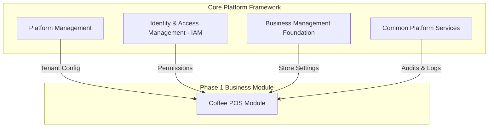

# SYSTEM SCOPE DEFINITION DOCUMENT

**Project Name:** Enterprise SaaS Business Management Platform  
**Document Version:** 1.0.0  
**Date:** July 11, 2026  
**Author:** Senior Business Analyst, Enterprise System Architect & Product Manager  
**Status:** Under Review  

---

## Table of Contents
1. [Introduction](#1-introduction)
2. [System Vision](#2-system-vision)
3. [System Scope Overview](#3-system-scope-overview)
4. [In-Scope Features](#4-in-scope-features)
5. [Out-of-Scope Features](#5-out-of-scope-features)
6. [Future Scope Expansion](#6-future-scope-expansion)
7. [System Actors Boundary](#7-system-actors-boundary)
8. [System Integration Boundary](#8-system-integration-boundary)
9. [Data Scope Definition](#9-data-scope-definition)
10. [Assumptions](#10-assumptions)
11. [Constraints](#11-constraints)
12. [Scope Acceptance Criteria](#12-scope-acceptance-criteria)

---

## 1. Introduction

### 1.1 Purpose of this Document
The purpose of this document is to establish and define the functional, data, and system boundaries of the Enterprise SaaS Business Management Platform. This document outlines exactly what will be built, what will be integrated, and what is excluded from the initial release cycle (Phase 1). 

### 1.2 Importance of System Scope Definition
Defining system scope is a critical architecture and product management control. It provides a common reference point for software engineers, product owners, and business sponsors. A well-defined scope helps prevent "scope creep" (the uncontrolled expansion of project requirements), optimizes development budgets, schedules realistic sprint goals, and sets clear boundaries for system testing and QA validation.

### 1.3 Relationship Between Business Requirements and System Boundaries
While the Business Requirement Document (BRD) defines *why* the product is built, who the target market is, and what the financial vision is, the System Scope Definition Document translates those objectives into functional system components. It acts as a bridge, mapping high-level business goals directly to technical capabilities and defining the system interfaces, data ownership, and actors that will interact with the platform kernel.

---

## 2. System Vision

The SaaS Business Management Platform is envisioned as an extensible enterprise ecosystem. Over time, it will evolve into a "Business Operating System" that powers all operational components of a brick-and-mortar business.

*   **The Scalable Kernel:** At the core sits a highly secure tenant isolation engine, a unified user and role directory, and a consolidated financial ledger.
*   **The Modular Layer:** Surrounding the kernel is a dynamically toggled suite of vertical modules. A business owner can start with a single-location Coffee POS, expand to multi-location restaurant operations, add retail inventory management, and integrate hotel check-in services—all within the same user identity and billing framework.
*   **The Strategic Impact:** By providing an integrated, modular alternative to disjointed legacy software, this platform will enable businesses to lower operational software costs, reduce data discrepancies, automate stock management, and make real-time decisions backed by aggregated analytics.

---

## 3. System Scope Overview

The system scope is defined by the core operational boundary of the platform. The platform kernel and active business modules govern and maintain control over specific entities, while relying on external systems only for peripheral services (e.g., payment routing or email delivery).

```
+------------------------------------------------------------------------+
|                         SYSTEM BOUNDARY OVERVIEW                       |
|                                                                        |
|  [ Direct System Management ]                                           |
|  +------------------------------------------------------------------+  |
|  | * Business Tenant Registry (HQ & Branches)                       |  |
|  | * User Directory & Granular RBAC Permissions                     |  |
|  | * Active Subscription States & Limit Control                     |  |
|  | * Real-time POS Transactions & Inventory Deductions              |  |
|  | * Aggregated Audit History & Activity Logs                       |  |
|  +------------------------------------------------------------------+  |
|                                                                        |
|  [ External Integration Border ]                                       |
|  +---------------------+  +--------------------+  +-----------------+  |
|  |  Payment Processing |  | SMS/Email Delivery |  |   Cloud Storage |  |
|  |  (Stripe, Adyen)    |  | (Twilio, SendGrid) |  |   (S3 / GCS)    |  |
|  +---------------------+  +--------------------+  +-----------------+  |
+------------------------------------------------------------------------+
```

### 3.1 What the SaaS Platform Directly Manages
*   **Business Accounts & Tenants:** Provisioning, isolation, and lifecycles of business organizations.
*   **Company Profiles & Branches:** Enterprise organizational trees (HQ -> Regional Offices -> Branches -> Warehouses).
*   **User Registry & Identity:** Authentication states, session controls, and profile data for employees and administrators.
*   **Subscription Plans & Entitlements:** Active subscription packages, monthly/yearly billing records, and automated feature limit enforcement.
*   **Operational Modules:** The lifecycle of business-specific components (e.g., activation status of the Coffee POS module).
*   **Operational Data:** Sales transaction records, modifier selections, ingredient receipts, stock levels, and shift logs.
*   **Reporting Ledger:** Consolidated, immutable journal logs that compile sales, inventory write-offs, and tax calculations.
*   **System Notifications:** Logic for triggering in-app alerts, email queue dispatches, and SMS formatting.

---

## 4. In-Scope Features (Phase 1)

The initial release cycle (Phase 1) is focused on delivering a functional, secure platform core and validating its capability through the **Coffee POS** module.



### 4.1 Platform Management (SaaS Operations)
*   **SaaS Admin Dashboard:** A centralized interface for the SaaS owner to monitor platform health, search for specific tenants, review billing states, and manually lock/suspend delinquent tenant accounts.
*   **Tenant Registry:** Workflows for self-service business signup, allocating subdomains (`tenant-name.platform.com`), and validating organizational isolation.
*   **Subscription & Billing Engine:** Invoicing logs, plan upgrade/downgrade handling, payment receipt compilation, and tracking renewal schedules.
*   **Plan Configuration Manager:** Interface to set limits on specific subscription plans (e.g., maximum branches, maximum cashiers, or device thresholds).
*   **Module Activation Controls:** Admin and owner tools to toggle the Coffee POS module on or off for a given tenant.

### 4.2 Identity & Access Management (IAM)
*   **User Registration:** Secure self-registration workflows for Business Owners.
*   **Authentication & Session Management:** User logins, secure session validation, password recovery mechanisms, and multi-device connection checks.
*   **Role-Based Access Control (RBAC):** Setting up role profiles (Owner, Manager, Staff) with predefined capabilities.
*   **Permission Scoping Matrix:** Logic to restrict user actions by location (e.g., cashier "Staff A" can only process transactions at "Branch 1" and cannot view financials for "Branch 2").
*   **Staff Invitation System:** Owner/Manager workflow to invite new staff members via email, pre-assigning their branch locations and operational roles.

### 4.3 Business Management Foundation
*   **Company Profile Settings:** Managing corporate legal names, localized tax settings, base currency, and regional date formats.
*   **Branch Registry:** Adding and editing physical store locations, assigning specific managers, configuring localized sales tax rates, and binding receipt formats.
*   **Employee Management:** Accessing staff registers, capturing baseline contact details, logging active statuses, and configuring branch assignments.
*   **Global POS Parameters:** Centralized setup of general parameters, such as allowed payment options (cash, card, mobile wallet) and basic tax schemes.

### 4.4 Business Modules: Coffee POS
*   **Product & Variant Manager:** Creating menu items, setting selling prices, establishing cost prices (for COGS), defining categories, and setting up option matrices (e.g., milk types: oat, almond, soy; drink sizes: small, large; extra espresso shots).
*   **Category Organizers:** Grouping products to populate an intuitive, color-coded checkout grid on tablet screens.
*   **Sales Transaction Checkout:** Running cart calculations, applying discounts, applying service charges, computing sales tax, capturing payments, calculating change, and logging transaction events.
*   **Order Ticket Queue:** Holding order tickets for unpaid tables, printing kitchen routing orders, and tracking preparation states.
*   **Basic Inventory Interaction:** Adjusting stock counts upon checkout (e.g., subtracting cups, paper bags, or ingredients based on transaction details).
*   **End-of-Shift Ledger (Z-Report):** Providing shift-end reports for cashiers to reconcile physical drawer cash against recorded system sales.

### 4.5 Common Platform Services
*   **Notification Dispatcher:** Ingesting system events and distributing notification emails, SMS logs, or in-app alerts.
*   **File Management Service:** Organizing and securing uploads, including product images, receipt headers, and store logos.
*   **System Audit Logging:** Recording critical admin actions (e.g., employee role changes, cart price overrides, stock manual adjustments) for security auditing.
*   **Reporting Database Foundation:** Structuring transaction and inventory databases to run high-speed summaries.

---

## 5. Out-of-Scope Features (Phase 1 Exclusions)

To maintain focus and speed to market, the following capabilities are explicitly out of scope for the Phase 1 release. These features will be deferred to subsequent development cycles.

*   **Advanced AI Analytics & Intelligence:** Machine learning models for traffic prediction, automated staff scheduling, dynamic pricing, and inventory purchase recommendation.
*   **App Marketplace & External Developer SDK:** Allowing third-party developers to access APIs, hook into system events, or distribute custom modules.
*   **Complex Financial Accounting System:** Complete general ledger, double-entry book balancing, balance sheet generation, accounts payable management, and tax filing modules. The system will restrict accounting capability to raw transaction CSV exports for external ingestion (e.g., Xero, QuickBooks).
*   **Enterprise-Grade HR & Payroll Automation:** Biometric employee timesheet validation, tax declarations, benefit configurations, and direct wage bank transfers.
*   **Global Multi-Currency Tax Consolidation Engine:** Real-time automatic compliance with different state, county, and international VAT regulations based on real-time external tax databases.
*   **Full Hardware Offline Engine:** Advanced offline modes allowing complex transactions (e.g., credit card caching or inventory routing) to persist locally across multiple local devices without internet for more than 48 hours.

---

## 6. Future Scope Expansion

Features planned for development in Phase 2 and beyond include:

*   **Restaurant Management Module:** Visual floor planner, table reservation queue, split billing engines, and kitchen display screen (KDS) integration.
*   **Retail & Mini Mart Inventory Module:** Barcode label printing, purchase order generation, supplier management, shelf-life tracker, and serial code tracking.
*   **Warehouse Management Module (WMS):** Bin-location maps, transfer ticket routing, and shipping carrier integrations.
*   **Core HR & Biometric Time Management:** Biometric employee attendance sync, automated shift roster planner, and basic payroll calculators.
*   **Customer Relationship Management (CRM):** Loyalty rewards engine, customer profile histories, SMS marketing campaigns, and customer feedback surveys.
*   **Platform Developer SDK:** API gateways, webhook dispatch systems, sandbox accounts, and app store listings.
*   **AI BizPal Assistant:** Text-based query system to retrieve store metrics and automate stock ordering thresholds.

---

## 7. System Actors Boundary

The system interacts with several distinct actors, categorized by their relationship to the platform.

```
       [ Platform Core System Boundary ]
       |
  +----+----+     +----+----+     +----+----+
  | Admin   |     | Support |     | Developer
  +----+----+     +----+----+     +----+----+
       |               |               |
=======+===============+===============+================ [System Border]
       |               |               |
  +----+----+     +----+----+     +----+----+
  | Owner   |     | Manager |     | Staff   |
  +----+----+     +----+----+     +----+----+
       |               |               |
  +----+----+     +----+----+     +----+----+
  | Customer|     | Payments|     | Services|
  +---------+     +---------+     +---------+
```

### 7.1 Internal Actors
*   **Platform Administrator:** SaaS team members who manage plans, manage modules, configure billing rates, monitor security, and handle tenant escalations.
*   **Support Staff:** SaaS personnel granted read-only diagnostic permissions to view logs, check tenant subscriptions, and assist with store setup.
*   **Developer Team:** System engineers who deploy updates, monitor API latencies, and debug platform core issues (without access to tenant business data).

### 7.2 External Actors
*   **Business Owner (Tenant Owner):** The merchant representative who purchases the platform subscription, registers branches, defines employee roles, and audits financials.
*   **Manager:** Local store operator who manages inventory audits, processes sales overrides, verifies cash drawer shift reports, and views local sales metrics.
*   **Employee (Cashiers, Baristas, Clerks):** Standard users who process sales transactions, update ticket queues, log shift starts, and record inventory waste.
*   **Customer:** The end-consumer who makes purchases, selects modifier choices, and receives receipt notifications.
*   **Payment Provider:** Third-party APIs (Stripe, Adyen) that process payment requests and update status codes.
*   **External Service Provider:** SMS or email delivery APIs (SendGrid, Twilio) that dispatch verification codes and notifications.

---

## 8. System Integration Boundary

The platform relies on integrations with several external cloud-based services:

| External System Type | Purpose | Interaction Mode |
| :--- | :--- | :--- |
| **Payment Gateways** | Processes tenant monthly subscription charges and handles in-store POS customer credit card transactions. | Two-way REST API & Webhooks |
| **Email Gateway** | Sends invitation links to new staff, subscription invoices, password reset requests, and customer digital receipts. | Outbound API call |
| **SMS Gateway** | Dispatches verification codes (OTP) and notifications to store managers (e.g., low-stock alerts). | Outbound API call |
| **Cloud Object Storage** | Securely stores assets, product images, store logo branding, and compiled PDF reports. | Secure URL generation & Upload requests |
| **Accounting Software Export** | Formats and delivers daily sales journal records to external tools (Xero, QuickBooks). | Outbound CSV format delivery |
| **POS Hardware Interfaces** | Integrates with local physical receipt printers, barcode scanners, and cash drawers. | Local browser device drivers |

---

## 9. Data Scope Definition

The platform captures, processes, and stores several key types of data:

*   **Business Profile Data:** Branch addresses, tax configuration rates, vendor details, and localization settings.
*   **User & IAM Data:** Hashed credentials, active session keys, assigned branch scopes, role permission matrices, and PINs.
*   **Subscription & Billing Data:** Active plan tier metadata, transaction histories, billing failure counts, invoice PDFs, and billing frequencies.
*   **Sales Transaction Data:** Order items, applied modifiers, unit costs, applied discounts, customer loyalty bindings, tax components, payment modes, and register session logs.
*   **Inventory Data:** Stock levels, minimum warning levels, wastage records, unit cost metrics, ingredient weights, and replenishment logs.
*   **System Log & Audit Data:** Chronological logs of employee logins, manager overrides, inventory adjustments, and billing changes.

---

## 10. Assumptions

*   **Network Connectivity:** Users have access to a stable, broadband internet connection or cellular data connection to process checkout transactions and sync inventory logs.
*   **Valid Legal Entities:** Business owners provide accurate tax identification numbers, currency parameters, and legal entity info during onboarding.
*   **API Availability:** External providers (Stripe, Twilio, SendGrid) maintain service availability (>99.9% uptime).
*   **Standard Client Hardware:** Tenants use modern, supported web browsers (Chrome, Safari, Edge) running on tablet devices, laptops, or PCs.

---

## 11. Constraints

*   **Data Separation Constraints:** The multi-tenant architecture must enforce absolute logical isolation between different tenants at all database access points.
*   **Performance Constraints:** POS transaction requests, item searches, and checkout cart calculations must execute within 2 seconds to avoid checkout bottlenecks.
*   **Regulatory & PII Constraints:** System must comply with standard regional data privacy guidelines (GDPR, CCPA) regarding customer and employee PII storage.
*   **Resource & Time Constraints:** Phase 1 development must be delivered within the designated timeframe using standard development team resources.

---

## 12. Scope Acceptance Criteria

Stakeholders will confirm that the system scope is complete and ready for production launch when:

1.  **Platform Self-Service Verification:** A new merchant can register, select a plan, map a subdomain, and activate the Coffee POS module without manual team support.
2.  **Core Transaction Cycle Verification:** POS terminals can process sales, add modifiers, calculate local taxes, process cards, deduct items from inventory, and email receipts.
3.  **Tenant Separation Validation:** Multi-tenant checks verify that no data leakage is possible between different merchant databases or dashboard panels.
4.  **RBAC Verification:** Test logs verify that employees cannot view financial dashboards, modify product pricing, or perform manager overrides without authorization.
5.  **Audit Integrity:** System logs confirm that administrative actions (pricing updates, overrides, stock adjustments) are tracked in the database audit log.
6.  **Performance Verification:** Load tests verify that core checkout API transactions complete in under 2 seconds under peak expected volumes.
