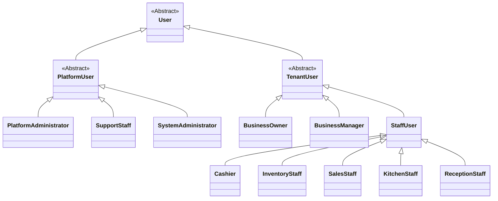

# ACTOR IDENTIFICATION AND ROLE ANALYSIS DOCUMENT

**Project Name:** Enterprise SaaS Business Management Platform  
**Document Version:** 1.0.0  
**Date:** July 11, 2026  
**Author:** Senior Business Analyst, Enterprise System Architect & UML System Analyst  
**Status:** Under Review  

---

## Table of Contents
1. [Introduction](#1-introduction)
2. [Actor Definition](#2-actor-definition)
3. [Actor Classification](#3-actor-classification)
4. [Actor Hierarchy](#4-actor-hierarchy)
5. [Actor Permission Analysis](#5-actor-permission-analysis)
6. [Actor Interaction Summary](#6-actor-interaction-summary)
7. [Actor Relationship Rules](#7-actor-relationship-rules)
8. [Future Actor Expansion](#8-future-actor-expansion)
9. [Conclusion](#9-conclusion)

---

## 1. Introduction

### 1.1 Purpose of Actor Identification
In system analysis, actor identification is the process of identifying all external entities that interact with a software system. This document catalogs and defines these entities for the Enterprise SaaS Business Management Platform. This analysis establishes the user roles, system boundaries, and security rules that will guide subsequent UML modeling and design.

### 1.2 Importance of Identifying System Users
A clear understanding of system users is essential to:
*   Secure the platform by establishing role boundaries and preventing data access violations.
*   Ensure that user interfaces are customized to the specific tasks and technical skills of different user groups.
*   Provide developers and QA engineers with a clear reference for designing, implementing, and testing role-based access rules.

### 1.3 Relationship Between Actors and Use Cases
In UML modeling, a Use Case describes a system's behavior when responding to an action initiated by an Actor. Actors represent the starting point for all system workflows. By clearly identifying all actors and their roles, we establish the foundation for mapping the system's use cases, ensuring that no functional requirements are missed.

---

## 2. Actor Definition

In system analysis, an **Actor** represents a role that an external entity plays when interacting with the system. An actor is always outside the boundary of the system under analysis. Actors are classified into three types:

```
               +---------------------------------------+
               |              UML ACTORS               |
               +---------------------------------------+
                                  |
         +------------------------+------------------------+
         |                        |                        |
         v                        v                        v
  [ HUMAN ACTOR ]        [ EXTERNAL SYSTEM ACTOR ]  [ ORGANIZATION ACTOR ]
  Direct interaction via  Automated integrations,   B2B partners interacting
  client UIs (web/app).   APIs, and cloud services. as unified entities.
```

### 2.1 Human Actor
A human actor is a person who directly interacts with the system using client user interfaces, such as web portals, tablet apps, or mobile interfaces (e.g., Cashiers, Managers, Business Owners, and End Customers).

### 2.2 External System Actor
An external system actor is an external software system, database, or API that exchanges data with the platform (e.g., Payment Gateways, SMS Providers, and Email Services). These actors are external systems that trigger processes or receive data from our platform.

### 2.3 Organization Actor
An organization actor is a legal entity, business partner, or B2B customer that interacts with the system in an automated, aggregated way (e.g., supplier networks, corporate clients, or third-party delivery services).

---

## 3. Actor Classification

Actors are classified into four main categories based on their operational domain in the SaaS ecosystem.

### 3.1 Platform-Level Actors (Internal SaaS Administration)

#### 3.1.1 Platform Administrator
*   **Responsibilities:** Managing overall SaaS operations, including tenant registration, plan configurations, billing audits, and global security.
*   **Permissions:** Global system access, excluding tenant business databases.
*   **Main Activities:** Provisioning/suspending tenants, creating subscription plans, enabling modules, and auditing platform performance.
*   **System Interaction:** Interacts with the SaaS Administration Dashboard.

#### 3.1.2 Support Staff
*   **Responsibilities:** Providing technical support to tenant managers, troubleshooting printer setups, and investigating system errors.
*   **Permissions:** Read-only access to tenant-level configurations, system diagnostic logs, and billing logs. No access to sensitive business data like customer records or profit margins.
*   **Main Activities:** Investigating transaction errors, updating tenant configurations, and managing customer tickets.
*   **System Interaction:** Interacts with the Support Console.

#### 3.1.3 System Administrator (DevOps/SaaS Technical Lead)
*   **Responsibilities:** Monitoring infrastructure status, database health, API rate limits, and scheduling maintenance windows.
*   **Permissions:** Global infrastructure configuration access.
*   **Main Activities:** Managing system deployments, monitoring API logs, database maintenance, and responding to system alerts.
*   **System Interaction:** Interacts with infrastructure logging portals.

---

### 3.2 Tenant-Level Actors (Customer Business Entities)

#### 3.2.1 Business Owner (Tenant Owner)
*   **Responsibilities:** Managing the business, defining corporate policy, setting up branches, and managing billing.
*   **Permissions:** Full administrative access to the tenant database and settings.
*   **Main Activities:** Managing subscriptions, creating user accounts, assigning roles, viewing financial reports, and setting tax rates.
*   **System Interaction:** Interacts with the Owner Web Dashboard.

#### 3.2.2 Business Manager
*   **Responsibilities:** Managing daily operations for one or more physical branches.
*   **Permissions:** Operational access scoped to assigned branches.
*   **Main Activities:** Managing shift records, approving stock adjustments, auditing cash registers, and authorizing transaction refunds.
*   **System Interaction:** Interacts with both the Manager Portal and POS.

#### 3.2.3 Staff Users
Staff roles are divided into specialized operational profiles:
*   **Cashier:**
    *   *Daily Tasks:* Ringing up orders, processing payments, opening/closing cash registers, and issuing receipts.
    *   *Required Permissions:* Scoped point-of-sale checkout permissions. Cannot perform transaction overrides or view store reports.
    *   *System Interaction:* Interacts with the POS interface.
*   **Inventory Staff:**
    *   *Daily Tasks:* Receiving stock deliveries, logging product wastage, and performing inventory audits.
    *   *Required Permissions:* Read/Write access to inventory ledger and product lists. No checkout or financial data access.
    *   *System Interaction:* Interacts with the Inventory Dashboard.
*   **Sales Staff:**
    *   *Daily Tasks:* Assisted sales, generating customer quotes, and processing orders on the showroom floor.
    *   *Required Permissions:* Scoped product search and checkout order placement.
    *   *System Interaction:* Interacts with the Mobile Sales interface.
*   **Kitchen Staff:**
    *   *Daily Tasks:* Monitoring food orders, preparing menu items, and updating ticket preparation status.
    *   *Required Permissions:* Read-only access to incoming order queues, write-access to order status updates.
    *   *System Interaction:* Interacts with the Kitchen Display Screen (KDS).
*   **Reception Staff:**
    *   *Daily Tasks:* Logging customer check-ins, booking salon/clinic appointments, and managing service queues.
    *   *Required Permissions:* Read/Write access to scheduling calendars.
    *   *System Interaction:* Interacts with the Booking Calendar.

---

### 3.3 Customer-Level Actors

#### 3.3.1 End Customer
*   **Responsibilities:** Submitting payment details and completing purchases.
*   **Main Activities:** Browsing product catalogs, selecting menu options, paying via digital portals, and viewing transaction summaries.
*   **System Interaction:** Interacts with customer-facing display screens and self-checkout portals.

---

### 3.4 External System Actors

#### 3.4.1 Payment Gateway
*   **Interaction:** Securely processes subscription charges and POS transactions, returning status and confirmation codes.

#### 3.4.2 SMS Provider
*   **Interaction:** Delivers system-triggered SMS notifications, security verification codes (OTPs), and digital receipt links.

#### 3.4.3 Email Service
*   **Interaction:** Delivers staff invitations, password reset links, billing invoices, and daily dashboard reports.

#### 3.4.4 Cloud Storage Service
*   **Interaction:** Stores tenant logo images, product photos, invoice PDFs, and exported reports.

#### 3.4.5 Third-Party Business Systems
*   **Interaction:** Integrates with external tools, such as exporting daily sales data to accounting platforms (e.g., Xero).

---

## 4. Actor Hierarchy

In UML modeling, actor relationships can be structured hierarchically using generalization/inheritance relationships.



### 4.1 Relationship Rationale
*   **User Generalization:** The abstract `User` actor defines the baseline requirements for authentication and security that apply to all users.
*   **Platform vs. Tenant Split:** This split separates SaaS administrative functions from customer tenant operations.
*   **Tenant Hierarchy:** The `Business Owner` has full admin access. The `Business Manager` inherits operational controls, and `StaffUser` roles are restricted to specific front-line tasks (e.g., Cashier, Inventory Staff).

---

## 5. Actor Permission Analysis

This matrix details the access levels and data visibility rules for each actor.

| Actor | Primary Responsibilities | Access Level | Branch & Data Scope |
| :--- | :--- | :--- | :--- |
| **System Administrator** | Infrastructure configuration, API rate monitoring, software updates. | Infrastructure Root | Platform-wide infrastructure metrics. No tenant business data. |
| **Platform Administrator** | Tenant account management, plan setup, subscription auditing. | Platform Admin Access | Platform metadata, tenant profiles, global billing details. |
| **Support Staff** | Troubleshooting, printer setup, bug investigations. | Read-Only Admin Access | Limited to tenant configuration settings and system logs. |
| **Business Owner** | Managing corporate settings, branch configuration, billing, and reporting. | Tenant Root Access | Full read/write access across all branches under the tenant. |
| **Business Manager** | Managing daily branch operations, staff schedules, and shift approvals. | Branch Admin Access | Read/write access restricted to assigned branches. |
| **Cashier** | Processing payments and logging cashier shifts. | POS Operational Access | Restricted to POS screens at the assigned branch. |
| **Inventory Staff** | Auditing stock levels, logging waste, and receiving shipments. | Inventory Access | Restricted to inventory screens at the assigned branch. |
| **Kitchen Staff** | Monitoring kitchen orders and updating preparation status. | Kitchen Access | Read-only order queue access at the assigned branch. |
| **Reception Staff** | Scheduling appointments and booking reservations. | Scheduler Access | Read/write scheduling calendar access at the assigned branch. |

---

## 6. Actor Interaction Summary

This summary defines the inputs, outputs, and primary actions for each actor.

### 6.1 Platform Administrator
*   **Information Provided:** Plan configurations, tenant status overrides, and global module registries.
*   **Information Received:** Platform health metrics, subscription billing logs, and support tickets.
*   **Actions Performed:** Provisioning tenants, suspending delinquent accounts, and adjusting subscription levels.

### 6.2 Business Owner (Tenant)
*   **Information Provided:** Company profile, branch details, employee details, role definitions, and billing details.
*   **Information Received:** Consolidated sales reports, tax logs, and subscription invoices.
*   **Actions Performed:** Inviting staff, selecting subscription plans, and configuring branch details.

### 6.3 Business Manager
*   **Information Provided:** Inventory counts, waste logs, shift overrides, and employee schedules.
*   **Information Received:** Local branch sales reports, stock warning alerts, and cashier shift summaries.
*   **Actions Performed:** Approving shifts, editing inventory counts, and processing customer refunds.

### 6.4 Cashier
*   **Information Provided:** Cart selections, customer profiles, payment types, and shift starting/ending cash counts.
*   **Information Received:** Item prices, checkout subtotals, and transaction receipts.
*   **Actions Performed:** Processing checkouts, printing receipts, and opening/closing cash registers.

---

## 7. Actor Relationship Rules

The system enforces several relationship rules to maintain multi-tenant data isolation and operational structure:

*   **Rule 1 (Multi-Branch Mapping):** A single `Business Owner` can configure and manage multiple `Branch` locations under a single billing subscription.
*   **Rule 2 (Tenant Isolation):** A `Business Manager` or `StaffUser` belongs to one specific tenant company and cannot view or access data for other tenants.
*   **Rule 3 (Branch Scoping):** A `Business Manager` can be assigned to multiple branches within the same tenant, while a cashier or kitchen staff user is typically restricted to a single branch per shift.
*   **Rule 4 (Platform Separation):** `Platform Administrators` and `System Administrators` manage the platform infrastructure and metadata only. They are blocked from accessing tenant business databases to protect data privacy.
*   **Rule 5 (Hierarchy Inheritance):** When a user is assigned a higher-level role (e.g., `Business Manager`), they inherit the permissions of lower-level roles (e.g., `Cashier`) for their assigned branch, unless custom permissions are configured.

---

## 8. Future Actor Expansion

As the platform scales, the actor ecosystem will expand to support new operational roles:

*   **Accountant (External/Internal):** Generates financial reports, manages cash flow logs, and exports tax data to external accounting software.
*   **Delivery Partner (External System):** Integrates third-party delivery services (e.g., UberEats, DoorDash) to automatically sync orders with the POS ticket queue.
*   **Supplier (External Tenant Partner):** Interacts with the platform to receive purchase orders and update delivery schedules.
*   **Developer Partner (External User):** Uses the Developer Portal to build and list custom modules in the App Marketplace.
*   **Auditor (Internal/External):** Accesses read-only, immutable audit logs to verify compliance with local laws.
*   **AI Assistant (Automated System Agent):** Evaluates transaction data to automate inventory replenishment and staff scheduling recommendations.

---

## 9. Conclusion

This Actor Identification and Role Analysis Document defines the user roles, system boundaries, and permission rules for the platform. It separates SaaS platform administration from customer tenant operations, and outlines the roles of managers, staff, and external systems.

This document serves as the basis for the next phase: **UML Use Case Analysis**. In the next step, we will map these actors to specific system interactions and construct detailed UML Use Case Diagrams for the platform kernel and the initial Coffee POS module.
