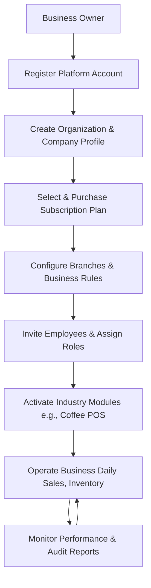

# BUSINESS PROCESS MODELING AND WORKFLOW ANALYSIS DOCUMENT

**Project Name:** Enterprise SaaS Business Management Platform  
**Document Version:** 1.0.0  
**Date:** July 11, 2026  
**Author:** Senior Business Analyst, BPMN Process Designer & Enterprise Solution Architect  
**Status:** Under Review  

---

## Table of Contents
1. [Introduction](#1-introduction)
2. [Business Process Overview](#2-business-process-overview)
3. [Core Business Processes Analysis](#3-core-business-processes-analysis)
4. [BPMN Modeling Requirements](#4-bpmn-modeling-requirements)
5. [Business Rules Extraction](#5-business-rules-extraction)
6. [Process Dependencies](#6-process-dependencies)
7. [Process Improvement Opportunities](#7-process-improvement-opportunities)
8. [Future Process Expansion](#8-future-process-expansion)
9. [Conclusion](#9-conclusion)

---

## 1. Introduction

### 1.1 Purpose of Business Process Modeling
Business Process Modeling is the practice of mapping, analyzing, and designing the operational workflows of an organization. In this document, we map the key operational paths for the Enterprise SaaS Business Management Platform. This analysis ensures that the software design supports real-world business activities and user roles.

### 1.2 Difference Between Business Process and System Function
*   **Business Process:** A sequence of structured activities performed by people or systems to achieve a concrete business goal (e.g., checking out a customer, restocking inventory). It focuses on *who* does *what* and in *what order*.
*   **System Function:** A specific technical utility or capability of the software system (e.g., executing a SQL query, validating a session token, sending an HTTP request). A system function is a technical tool used to execute steps within a broader business process.

### 1.3 Why Workflow Analysis is Required Before Software Design
Conducting a workflow analysis before writing code helps:
*   Identify bottlenecks, loops, and inefficiencies in the business before they are coded into the software.
*   Define the exact system requirements, inputs, and outputs for developers.
*   Establish clear rules for how the system handles exceptions, such as inventory stockouts or payment declines, rather than addressing these cases post-launch.

---

## 2. Business Process Overview

The lifecycle of a business tenant on the SaaS platform follows a structured progression, from initial registration to daily operational monitoring.



### 2.1 The Complete SaaS Tenant Lifecycle
1.  **Account Registration:** The Business Owner registers a tenant account, establishing their isolated database workspace.
2.  **Organization Creation:** The owner defines their company profile, tax parameters, and base currency.
3.  **Subscription Activation:** The owner selects a subscription tier, completes payment setup, and initializes system limits.
4.  **Branch Setup & Configuration:** The owner creates physical branch locations, defines localized tax rules, and configures receipts.
5.  **User Provisioning:** The owner or manager invites staff members and assigns them specific roles (e.g., Cashier).
6.  **Module Activation:** The tenant activates the modular applications required for their operations (e.g., the Coffee POS module).
7.  **Daily Operations:** Front-line staff use the platform to run checkout transactions, update inventory counts, and manage orders.
8.  **Management Auditing:** Owners and managers review real-time dashboards, audit logs, and export reports for tax compliance.

---

## 3. Core Business Processes Analysis

### 3.1 Process 1: New Business Registration
*   **Actors:** Business Owner, SaaS Platform Core
*   **Trigger:** Owner accesses the registration portal to sign up.
*   **Main Workflow:**
    1. Owner enters their email, business name, and password on the signup form.
    2. Platform verifies that the email address is unique.
    3. Platform creates a pending tenant profile.
    4. Platform sends a verification link to the owner's email.
    5. Owner clicks the verification link to confirm their email address.
    6. Platform activates the tenant account.
*   **Alternative Flow:** Owner signs up using an OAuth provider (e.g., Google OAuth). Platform retrieves the verified email and name, bypasses email verification, and activates the tenant account immediately.
*   **Exception Flow (Email Already Registered):** Platform displays an error message, blocks registration, and prompts the owner to log in or reset their password.
*   **Business Rules:** Every business owner must verify their email address before they can access tenant dashboards or configure organization profiles.
*   **Expected Outcome:** A verified tenant workspace is created, and the owner is redirected to the onboarding wizard.

### 3.2 Process 2: Tenant Organization Setup
*   **Actors:** Business Owner, Platform Administrator
*   **Trigger:** Tenant account is verified and the owner launches the onboarding wizard.
*   **Main Workflow:**
    1. Owner enters company details (legal name, contact information, tax identification numbers).
    2. Owner selects the base currency, timezone, and local date formats.
    3. Owner creates the initial physical branch and inputs its address.
    4. System applies default configuration templates based on the selected vertical (e.g., quick-service F&B).
    5. System initializes the organization hierarchy.
*   **Business Rules:** A tenant must configure at least one physical branch location before they can activate modules or invite staff users.
*   **Expected Outcome:** Company profile, localized parameters, and initial branch structures are recorded in the tenant database.

### 3.3 Process 3: Subscription Management
*   **Actors:** Business Owner, Payment Provider
*   **Trigger:** Onboarding wizard prompts for plan selection, or an active plan approaches its renewal date.
*   **Main Workflow:**
    1. Owner selects a plan tier (Starter, Growth, Enterprise) and billing frequency.
    2. System requests billing details (credit card or debit options).
    3. System routes the payment request to the Payment Provider.
    4. Payment Provider processes the payment and returns a transaction ID.
    5. System updates the subscription status to Active and updates the tenant's workspace limits.
*   **Alternative Flow (Trial Activation):** Owner chooses the 14-day free trial. System activates trial limits without requiring payment details.
*   **Exception Flow (Payment Declined):** System notifies the owner of the failure, keeps the account on a temporary 3-day grace status, and prompts for updated billing information.
*   **Business Rules:** If subscription payment fails after the grace period, the system blocks write-access to the tenant workspace, allowing read-only reporting access until payment is updated.
*   **Expected Outcome:** Subscription status is verified, and the corresponding user and branch limits are updated.

### 3.4 Process 4: User and Employee Management
*   **Actors:** Business Owner, Manager, Employee
*   **Trigger:** Owner or manager decides to grant system access to a new employee.
*   **Main Workflow:**
    1. Administrator enters the employee's name, email, role, and branch assignment.
    2. System verifies that the subscription limits permit adding a new user.
    3. System sends an invitation link to the employee's email.
    4. Employee clicks the invitation link and configures their password and security PIN.
    5. System activates the user profile.
*   **Exception Flow (Limit Exceeded):** System blocks the invitation and prompts the owner to upgrade their subscription plan to add more users.
*   **Business Rules:** Only users with verified and active profiles can log in to POS terminals or access back-office dashboards.
*   **Expected Outcome:** Employee is assigned a role and security PIN, and granted access to the assigned branch.

### 3.5 Process 5: Coffee POS Sales
*   **Actors:** Customer, Cashier, Kitchen Staff, Manager
*   **Trigger:** Customer approaches the counter or places an order.
*   **Main Workflow:**
    1. Cashier adds menu items and modifiers (e.g., espresso shots, milk options) to the cart.
    2. Cashier confirms the items with the customer and clicks Checkout.
    3. Cashier processes the payment (cash or card terminal).
    4. System routes the payment request to the Payment Provider.
    5. Payment Provider approves the transaction.
    6. System deducts the ingredients from inventory, records the sale in the ledger, and sends the ticket to the kitchen printer or Kitchen Display Screen (KDS).
    7. Kitchen Staff prepare the order and mark it as Ready.
    8. Cashier hands the order to the customer and prints or emails the receipt.
*   **Alternative Flow (Cash Sale):** At Step 3, if the customer pays with cash, the cashier inputs the amount received. The system calculates change, opens the cash drawer, and skips the card payment step.
*   **Exception Flow (Payment Declined):** At Step 5, if the card is declined, the system keeps the cart active and prompts the cashier for a different payment method.
*   **Business Rules:** A transaction cannot be finalized until payment is confirmed by the Payment Provider or cashier cash confirmation.
*   **Expected Outcome:** Transaction is completed, inventory is updated, and the order is sent to the kitchen.

### 3.6 Process 6: Inventory Management
*   **Actors:** Inventory Staff, Manager
*   **Trigger:** New stock arrives, stock counts need adjustment, or stock levels drop below warning thresholds.
*   **Main Workflow:**
    1. Staff selects the target branch and views the inventory list.
    2. Staff records incoming shipments (item counts, unit cost, batch IDs).
    3. System updates the stock levels and adjusts the average cost basis.
    4. System monitors stock levels against low-stock thresholds.
    5. System alerts the manager if stock drops below set warning levels.
*   **Alternative Flow (Wastage Log):** Staff logs product wastage (e.g., spilled beans, expired milk). System deducts the items from stock levels and records the write-off in the log.
*   **Business Rules:** Manual inventory adjustments (other than checkout deductions and receiving shipments) require manager authorization.
*   **Expected Outcome:** Inventory levels are updated, and low-stock alerts are sent to managers when thresholds are crossed.

### 3.7 Process 7: Reporting Process
*   **Actors:** Business Owner, Manager
*   **Trigger:** Manager requires shift reconciliation data, or Owner needs to audit monthly sales.
*   **Main Workflow:**
    1. User logs in, navigates to the Reports tab, and selects a branch and date range.
    2. System queries the transaction, inventory, and audit databases.
    3. System compiles the raw data into charts, sales tables, and inventory reports.
    4. User exports the report to a PDF, CSV, or Excel file.
*   **Business Rules:** Report access is restricted based on role permissions (e.g., cashiers can only view their own shift Z-reports; owners can view consolidated data across all branches).
*   **Expected Outcome:** User exports the requested reports.

### 3.8 Process 8: Customer Support Process
*   **Actors:** Business User (Tenant), Customer Support Team
*   **Trigger:** A tenant user encounters a hardware error, billing issue, or system bug.
*   **Main Workflow:**
    1. Tenant logs a support request using the in-app support chat.
    2. Support Agent receives the ticket, reviews diagnostic logs, and troubleshooting parameters.
    3. Support Agent resolves the issue or escalates it to the engineering team.
    4. Support Agent updates the ticket status and sends resolution details to the tenant.
    5. System collects feedback from the tenant upon closing the ticket.
*   **Expected Outcome:** The issue is resolved, and support ticket metrics are logged.

---

## 4. BPMN Modeling Requirements

This section details the swimlane layouts, start/end events, and decision gateways for each core process.

```
+---------------------------------------------------------------------------------+
|                               BPMN SWIMLANES TEMPLATE                           |
|                                                                                 |
|  [ SWIMLANE: BUSINESS OWNER ]                                                   |
|  (Start Event) --> [Register Account] --> [Input Billing Details] --------------+
|                                                                                 |
|  [ SWIMLANE: SAAS PLATFORM CORE ]                                               |
|  +-------------------------------------> [Validate Email] --> (Decision Gateway)|
|                                                                    |            |
|                                                     Valid Email? --+            |
|                                                     | YES          | NO         |
|                                                     v              v            |
|                                            [Activate Tenant]   [Show Error]     |
|                                                     |              |            |
|                                                     v              v            |
|                                                (End Event)     (End Event)      |
+---------------------------------------------------------------------------------+
```

### 4.1 Process 1: New Business Registration
*   **Swimlanes:** Business Owner, SaaS Platform Core
*   **Start Event:** Owner accesses the registration URL.
*   **Tasks:** Enter Registration Details, Validate Email Address, Dispatch Activation Link, Confirm Activation.
*   **Gateways:** Is the email already registered? Is the activation link valid?
*   **End Event:** Tenant account is activated, and onboarding begins.

### 4.2 Process 2: Tenant Organization Setup
*   **Swimlanes:** Business Owner, SaaS Platform Core
*   **Start Event:** Email address is verified.
*   **Tasks:** Input Company Profile Details, Select Base Currency, Create Initial Branch, Apply Industry Templates.
*   **Gateways:** Does the organization require custom tax configurations?
*   **End Event:** Branch is created, and the default system configuration is active.

### 4.3 Process 3: Subscription Management
*   **Swimlanes:** Business Owner, SaaS Platform Core, Payment Provider
*   **Start Event:** Subscription setup prompt is triggered.
*   **Tasks:** Select Plan Tier, Enter Credit Card Details, Request Payment Authorization, Update Subscription Limits.
*   **Gateways:** Is payment authorized?
*   **End Event:** Subscription is active, and limits are updated.

### 4.4 Process 4: User and Employee Management
*   **Swimlanes:** Business Owner (or Manager), SaaS Platform Core, Employee
*   **Start Event:** Administrator initiates the invitation process.
*   **Tasks:** Input Employee Details, Verify Subscription Limits, Send Invitation Email, Configure Password and PIN.
*   **Gateways:** Are subscription user seats available?
*   **End Event:** User account is active and permissions are assigned.

### 4.5 Process 5: Coffee POS Sales
*   **Swimlanes:** Customer, Cashier, SaaS Platform Core, Kitchen Staff
*   **Start Event:** Customer places an order.
*   **Tasks:** Input Cart Items, Verify Pricing, Select Payment Type, Process Payment, Deduct Inventory, Send Kitchen Ticket, Prepare Order, Hand Order to Customer.
*   **Gateways:** Card Payment or Cash Payment? Is payment authorized? Are all ingredients available in stock?
*   **End Event:** Customer receives their order, and the sale is recorded.

### 4.6 Process 6: Inventory Management
*   **Swimlanes:** Inventory Staff, Manager, SaaS Platform Core
*   **Start Event:** New stock shipment arrives.
*   **Tasks:** Verify Shipping Manifest, Input Delivered Quantities, Update Stock Levels, Check Stock Levels against Low-Stock Thresholds.
*   **Gateways:** Does stock level fall below the warning threshold? Does the manual count match recorded system stock?
*   **End Event:** Stock levels are updated, and low-stock alerts are sent to managers when thresholds are crossed.

### 4.7 Process 7: Reporting Process
*   **Swimlanes:** Business Owner (or Manager), SaaS Platform Core
*   **Start Event:** Auditor or manager requests a sales audit report.
*   **Tasks:** Select Date Range, Select Branch, Query Database, Generate Charts, Export Report.
*   **Gateways:** Does the user have permission to view consolidated reports?
*   **End Event:** Report is generated and exported.

### 4.8 Process 8: Customer Support Process
*   **Swimlanes:** Business User, Support Agent, Engineering Team
*   **Start Event:** Business User submits a support request.
*   **Tasks:** Log Ticket, Diagnose System Logs, Resolve Technical Issue, Confirm Fix with User.
*   **Gateways:** Can Support Agent resolve the issue directly? Does the issue require escalation to engineering?
*   **End Event:** Issue is resolved, and ticket is closed.

---

## 5. Business Rules Extraction

The following business rules govern system actions within workflows:

*   **Rule 1 (Access Control):** A user cannot log in to a POS terminal or access back-office dashboards unless their profile status is Active.
*   **Rule 2 (Limit Enforcement):** The platform must block invitations to new users if the active employee count matches the subscription plan limit.
*   **Rule 3 (Reconciliation Permanence):** Cashier register sessions cannot be reopened once Z-reports are compiled and closed.
*   **Rule 4 (Transaction Integrity):** Point-of-sale checkout orders cannot be finalized without payment confirmation from the Payment Provider or cashier cash confirmation.
*   **Rule 5 (Data Separation):** All database queries, reports, and search results must be scoped to the user's active tenant ID to enforce logical isolation.
*   **Rule 6 (Override Audit):** Manual stock adjustments and transaction refunds must require manager authentication PINs, and the action must be logged in the audit history.

---

## 6. Process Dependencies

Operational processes depend on prerequisite configurations being completed:

```
[ New Business Registration ]
             |
             v
[ Tenant Organization Setup ]
             |
             v
[ Subscription Activation ]
             |
             +----------------------------+
             |                            |
             v                            v
  [ Employee Provisioning ]     [ Product Configuration ]
             |                            |
             +------------+---------------+
                          |
                          v
                 [ Coffee POS Sales ]
                          |
                          v
                 [ Reporting & Auditing ]
```

*   **Tenant Organization Setup** requires a verified **New Business Registration**.
*   **Subscription Activation** requires a configured **Tenant Organization**.
*   **Employee Provisioning** and **Product Configuration** both require an active **Subscription**.
*   **Coffee POS Sales** requires **Product Configuration** (items, pricing) and active **Employee Profiles** (cashier logins).
*   **Reporting & Auditing** requires historical sales records from completed **POS Sales** transactions.

---

## 7. Process Improvement Opportunities

The SaaS platform improves current business operations by transitioning from manual, disjointed processes to automated, unified workflows:

| Current Manual / Disjointed Process | Optimized SaaS Digital Workflow | Expected Business Benefit |
| :--- | :--- | :--- |
| **Manual Inventory Audits:** Staff count inventory items on paper weekly, leading to delays and data entry errors. | **Automated Inventory Deductions:** The system automatically deducts ingredients from stock levels in real time upon checkout. | Reduces manual auditing labor and prevents stockouts of popular items. |
| **Disconnected Systems:** F&B operators use separate software systems for POS billing, staff scheduling, and inventory. | **Unified Business Platform:** All functions run on the core SaaS platform, sharing a single customer registry and database. | Eliminates manual data transfer errors and reduces software subscription costs. |
| **Delayed Sales Reports:** Owners calculate profits manually using paper ledger entries, resulting in outdated reporting. | **Real-Time Dashboards:** Consolidated sales metrics, transaction histories, and tax data are visible on the dashboard in real time. | Enables managers to respond quickly to sales trends and inventory changes. |
| **Cash Drawer Variances:** Cashiers open cash drawers without record validation, increasing the risk of cash variances. | **Manager PIN Overrides:** Cash drawer access and refunds require manager PIN authorization, and all actions are logged in the audit trail. | Reduces internal theft and ensures shift cash drops match system calculations. |

---

## 8. Future Process Expansion

As the platform scales, the process models will be expanded to support:

*   **AI Procurement Workflows:** Automated purchase orders are generated and sent to suppliers when AI analytics forecast stock shortages.
*   **Marketplace Installation Workflows:** Tenants browse the App Marketplace, select a third-party plugin, and integrate it with their workspace.
*   **Third-Party Delivery Dispatch Workflows:** Orders from third-party delivery apps are automatically accepted and sent to the kitchen display screen (KDS).
*   **Multi-Country Tax Compliance Workflows:** Automated localized tax calculation and reporting configurations for international business expansion.

---

## 9. Conclusion

This Business Process Modeling and Workflow Analysis Document defines the operational workflows, BPMN swimlanes, and business rules that govern the SaaS Business Management Platform. It models the platform's core processes, outlines role-based responsibilities, and analyzes operational improvements over manual processes.

With these processes modeled, the next step is to define the **Functional Requirements Specification (FRS)**. The FRS will outline the system capabilities, user interface behaviors, and validation rules required to implement these workflows in software.
