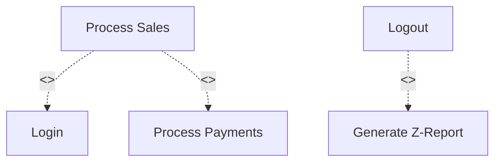

# USE CASE ANALYSIS AND USE CASE DIAGRAM SPECIFICATION DOCUMENT

**Project Name:** Enterprise SaaS Business Management Platform  
**Document Version:** 1.0.0  
**Date:** July 11, 2026  
**Author:** Senior Business Analyst, UML System Analyst & Enterprise Solution Architect  
**Status:** Under Review  

---

## Table of Contents
1. [Introduction](#1-introduction)
2. [System Boundary Definition](#2-system-boundary-definition)
3. [High-Level Use Case Overview](#3-high-level-use-case-overview)
4. [Detailed Use Case Specification](#4-detailed-use-case-specification)
5. [Actor-Use Case Relationship Matrix](#5-actor-use-case-relationship-matrix)
6. [Use Case Diagram Specification](#6-use-case-diagram-specification)
7. [Use Case Relationships](#7-use-case-relationships)
8. [Business Rules from Use Cases](#8-business-rules-from-use-cases)
9. [Future Use Case Expansion](#9-future-use-case-expansion)
10. [Conclusion](#10-conclusion)

---

## 1. Introduction

### 1.1 Purpose of Use Case Analysis
The purpose of Use Case Analysis is to define the functional requirements of the Enterprise SaaS Business Management Platform by detailing the interactions between external actors and the system. This document translates business requirements into a functional model, describing the step-by-step paths required to achieve operational goals on the platform.

### 1.2 Importance of Understanding User-System Interaction
Understanding how users interact with the system is essential to:
*   Ensure that developers write code that aligns with real-world business workflows.
*   Prevent errors in system boundaries by clearly defining where the platform ends and where external services (like payment gateways) begin.
*   Provide the QA team with structured inputs to write functional test cases and verify system behavior.

### 1.3 Relationship Between Actors, Use Cases, and Requirements
In UML system analysis, requirements represent *what* the system must do. Actors represent *who* triggers the actions, and Use Cases represent *how* the system accomplishes those goals. Correctly mapping these relationships ensures that every system capability can be traced back to a specific business need.

---

## 2. System Boundary Definition

Defining the system boundary is critical to establishing what operations are handled directly by our application code versus what is delegated to external entities.

*   **The System ("SaaS Business Management Platform"):** The software containing the tenant databases, business logic engines (e.g., cart calculator, inventory tracking ledger), role assignment directories, and subscription managers.
*   **External Actors:** All entities identified in the Actor Analysis who initiate processes or receive data across the boundary lines (e.g., Human users accessing dashboards and external services like Payment Gateways and SMS Providers).

```
+---------------------------------------------------------------------------------+
|                                 SYSTEM BOUNDARY                                 |
|                                                                                 |
|  [ EXTERNAL ACTORS ]                                                            |
|  * Platform Admin / Support Staff                                               |
|  * Business Owner / Branch Manager / Staff                                      |
|  * End Customer                                                                 |
|                                                                                 |
|      =================== [ SYSTEM BORDER ] ===================                  |
|                                                                                 |
|  [ INSIDE SYSTEM BOUNDARY ]                                                     |
|  +---------------------------------------------------------------------------+  |
|  | * Account registration workflows     * Checkout cart calculations         |  |
|  | * User authentication check          * Inventory level updates            |  |
|  | * Active subscription validation     * Audit trail compilation            |  |
|  +---------------------------------------------------------------------------+  |
|                                                                                 |
|      =================== [ SYSTEM BORDER ] ===================                  |
|                                                                                 |
|  [ EXTERNAL SYSTEM ACTORS ]                                                     |
|  * Payment Gateways (Stripe)            * Cloud Object Storage                  |
|  * SMS/Email Service Providers          * Third-party ERPs                      |
+---------------------------------------------------------------------------------+
```

---

## 3. High-Level Use Case Overview

The platform’s functional capabilities are grouped into nine use case categories:

### 3.1 Platform Management Use Cases
*   **Manage Platform Account:** Administrators update their system credentials and view platform health metrics.
*   **Manage Tenant Organizations:** Administrators create, suspend, view, or modify tenant accounts.
*   **Manage Subscription Plans:** Administrators define pricing tiers, billing cycles, and branch limits.
*   **Manage Modules:** Administrators publish, update, or disable functional modules in the registry.
*   **Monitor Platform Activity:** Administrators view global transaction volumes and system diagnostic logs.

### 3.2 Authentication & Identity Use Cases
*   **Register Account:** Business Owners register their company and sign up for the platform.
*   **Login:** Users authenticate using their credentials (email/password or PIN code) to gain access.
*   **Logout:** Users terminate active sessions.
*   **Reset Password:** Users request and complete password recovery.
*   **Manage User Profile:** Users edit their contact details, language preferences, and personal settings.
*   **Manage Roles:** Business Owners define and configure role templates.
*   **Manage Permissions:** Business Owners assign granular capability matrices to roles.

### 3.3 Tenant Management Use Cases
*   **Create Business Organization:** Owners build their corporate structure (Headquarters, Regional branches, Warehouses).
*   **Manage Company Profile:** Owners update corporate details, primary currencies, and registration IDs.
*   **Manage Branches:** Owners add, suspend, or configure physical outlets.
*   **Configure Business Settings:** Owners set tax rules, receipt layouts, and local printer behaviors.

### 3.4 Subscription Management Use Cases
*   **Select Subscription Plan:** Owners select a subscription tier during onboarding.
*   **Start Trial:** Owners activate a 14-day free trial limit.
*   **Upgrade Plan:** Owners purchase higher subscription tiers or additional seats.
*   **Renew Subscription:** System automatically processes recurring subscription payments.
*   **Cancel Subscription:** Owners schedule termination of recurring subscriptions.
*   **View Billing Information:** Owners view historical invoices and update credit card details.

### 3.5 User Management Use Cases
*   **Invite Staff:** Owners or Managers send onboarding invitations via email.
*   **Assign Role:** Owners or Managers bind user accounts to specific roles (e.g., Cashier).
*   **Update User Permission:** Owners modify access rules for specific users.
*   **Disable User Account:** Owners or Managers suspend staff access to the tenant database.

### 3.6 Coffee POS Module Use Cases
*   **Manage Products:** Managers add menu items, prices, and options (e.g., milk choices, espresso shots).
*   **Manage Categories:** Managers organize items into color-coded groups on the checkout display.
*   **Create Orders:** Cashiers add products to carts, assign tables, and apply discounts.
*   **Process Sales:** Cashiers process carts, finalize balances, and route orders to printers or KDS.
*   **Process Payments:** Cashiers handle payments (cash, card, mobile wallet) and print/email receipts.
*   **Manage Inventory Interaction:** System automatically updates inventory counts when items are sold.
*   **View Sales Reports:** Managers view sales summaries, inventory statuses, and cashier shift reports.

### 3.7 Reporting & Analytics Use Cases
*   **View Dashboard:** Owners and Managers review real-time graphs and performance indicators.
*   **Generate Reports:** Owners and Managers create custom reports on sales, inventory, and labor.
*   **Export Reports:** Users download financial summaries in PDF, CSV, or Excel formats.
*   **Analyze Business Performance:** Owners run comparisons of sales data across multiple branches.

### 3.8 Notification Use Cases
*   **Send System Notification:** Platform automatically alerts administrators to billing errors or system alerts.
*   **Send Business Notification:** System alerts managers to low stock levels, cash variances, or staff updates.
*   **Receive Alerts:** Users receive push notifications, emails, or SMS alerts based on configured rules.

### 3.9 Integration Use Cases
*   **Process Payment Gateway:** Platform communicates with payment APIs (Stripe) to charge subscriptions and customer orders.
*   **Send SMS:** Platform calls SMS APIs (Twilio) to send one-time passcodes (OTPs) and receipts.
*   **Send Email:** Platform calls email services (SendGrid) to send onboarding links and invoices.
*   **Connect External Services:** Platform exports financial summaries to accounting platforms (Xero).

---

## 4. Detailed Use Case Specification

This section details five critical use cases that define the platform’s core operations.

### 4.1 UC-01: Register Account
*   **Primary Actor:** Business Owner
*   **Supporting Actors:** Email Service, Platform Administrator
*   **Description:** A new business owner registers their organization and initializes a tenant account.
*   **Preconditions:** The applicant has a valid email address and internet access.
*   **Main Flow:**
    1. User accesses the registration page and inputs their email, business name, and password.
    2. System verifies that the email address is unique.
    3. System creates a pending tenant shell.
    4. System calls the Email Service to send an activation link.
    5. User clicks the link and verifies their email.
    6. System updates the tenant account status to Active and redirects the user to the onboarding wizard.
*   **Alternative Flow (OAuth Sign-up):** At Step 1, the user signs up using a verified external account (e.g., Google OAuth). System bypasses email validation and proceeds to Step 6.
*   **Exception Flow (Email Already Registered):** At Step 2, if the email is already in use, the system displays an error message and suggests logging in or resetting the password.
*   **Postconditions:** An isolated tenant workspace is created, and the Business Owner profile is initialized.

### 4.2 UC-02: Login
*   **Primary Actor:** User (General)
*   **Supporting Actors:** None
*   **Description:** A user authenticates into the platform to access their workspace.
*   **Preconditions:** The user's account is registered and active.
*   **Main Flow:**
    1. User enters their email address and password (or PIN code on POS devices).
    2. System verifies the credentials against the user directory.
    3. System verifies that the tenant account is active (not suspended).
    4. System generates a secure session token.
    5. System redirects the user to their designated landing page based on their role.
*   **Alternative Flow (PIN Login):** At Step 1, on a registered POS terminal, a cashier enters their 4-digit PIN. The system verifies the PIN for that terminal and logs them in.
*   **Exception Flow 1 (Invalid Credentials):** At Step 2, if credentials do not match, the system displays an error message. After 5 failed attempts, the system locks the account for 15 minutes.
*   **Exception Flow 2 (Tenant Suspended):** At Step 3, if the tenant account is suspended, the system displays a billing warning and blocks dashboard access.
*   **Postconditions:** A secure session is established, and the user's role-based permissions are loaded.

### 4.3 UC-03: Select Subscription Plan
*   **Primary Actor:** Business Owner
*   **Supporting Actors:** Payment Gateway
*   **Description:** The owner selects a subscription plan, enters payment details, and activates plan limits.
*   **Preconditions:** Owner is logged in and the tenant account is initialized.
*   **Main Flow:**
    1. Owner reviews the pricing plans and selects a tier (Starter, Growth, Enterprise).
    2. System prompts for credit card and billing details.
    3. Owner enters billing details.
    4. System sends payment data to the Payment Gateway to process the transaction.
    5. Payment Gateway returns a success response.
    6. System records the transaction, schedules recurring billing, and updates plan limits.
*   **Exception Flow (Payment Declined):** At Step 5, if the Payment Gateway declines the card, the system displays a payment error, prompts for a different card, and places the tenant account on trial/grace status.
*   **Postconditions:** The subscription plan is updated, and the tenant's workspace limits (users, branches, devices) are adjusted.

### 4.4 UC-04: Invite Staff
*   **Primary Actor:** Business Owner (or Branch Manager)
*   **Supporting Actors:** Email Service
*   **Description:** An administrator invites an employee to join their organization.
*   **Preconditions:** Administrator is logged in and their subscription user limit has not been reached.
*   **Main Flow:**
    1. Administrator enters the employee's name, email, role, and branch assignment.
    2. System verifies that the subscription plan has available user seats.
    3. System creates a pending staff user record.
    4. System calls the Email Service to dispatch an onboarding invitation.
    5. Employee opens the email, clicks the invitation link, and sets their password.
    6. System activates the employee profile and assigns the designated role and permissions.
*   **Exception Flow (Seat Limit Reached):** At Step 2, if the seat limit is reached, the system blocks the invitation and prompts the Owner to upgrade their subscription plan.
*   **Postconditions:** A new user record is created, and the employee is granted access to the assigned branch.

### 4.5 UC-05: Process Sales (POS Checkout)
*   **Primary Actor:** Cashier
*   **Supporting Actors:** Payment Gateway, Email Service
*   **Description:** A cashier processes a customer's cart, calculates taxes, updates inventory, and registers the transaction.
*   **Preconditions:** Cashier is logged in, and an active register shift is open.
*   **Main Flow:**
    1. Cashier adds items and options (e.g., espresso shots) to the cart.
    2. System calculates subtotals, applies tax rules, and displays the total.
    3. Cashier selects the payment method (e.g., Credit Card) and submits the transaction.
    4. System calls the Payment Gateway to process the card.
    5. Payment Gateway returns a success response.
    6. System deducts the purchased items from inventory records.
    7. System records the transaction in the ledger.
    8. System prompts the cashier to print or email the receipt.
*   **Alternative Flow (Cash Payment):** At Step 3, if the payment method is Cash, the cashier enters the cash received. The system displays the change due and opens the cash drawer, bypassing the Payment Gateway integration.
*   **Exception Flow (Payment Declined):** At Step 5, if the transaction is declined, the system alerts the cashier, keeps the cart open, and prompts for a different payment method.
*   **Postconditions:** The sale is recorded in the ledger, inventory levels are updated, and the register shift balances are adjusted.

---

## 5. Actor-Use Case Relationship Matrix

This matrix maps actors to their permitted use cases:

| Actor | Permitted Use Cases |
| :--- | :--- |
| **Platform Administrator** | Manage Platform Account, Manage Tenant Organizations, Manage Subscription Plans, Manage Modules, Monitor Platform Activity, Send System Notification. |
| **Support Staff** | Monitor Platform Activity, View Tenant Configuration (Read-only), View Log Files (Read-only). |
| **Business Owner** | Register Account, Select Subscription Plan, Create Business Organization, Manage Company Profile, Manage Branches, Invite Staff, Assign Role, Manage Roles, Manage Permissions, Upgrade/Cancel Plan, View Billing, View Dashboard, Export Reports. |
| **Business Manager** | Invite Staff, Assign Role, Disable User Account, Manage Products, Manage Categories, View Sales Reports, Adjust Inventory, View Dashboard, Generate Reports, Export Reports. |
| **Cashier** | Login, Logout, Create Orders, Process Sales, Process Payments, Reconcile Shift (Z-Report). |
| **Inventory Staff** | Login, Logout, Adjust Inventory, Receive Deliveries, Log Wastage. |
| **Kitchen Staff** | Login, Logout, View Kitchen Queue, Update Preparation Status. |
| **End Customer** | Browse Menu, Submit Payment Details, Receive Receipts. |
| **Payment Gateway** | Process Payment Gateway, Send Transaction Confirmation. |

---

## 6. Use Case Diagram Specification

When constructing the UML Use Case Diagram for the platform, the following design principles must be followed:

```
                  +----------------------------------------------+
                  |                 SYSTEM BOUNDARY              |
                  |                                              |
 +----------+     |    +--------------------+                    |
 |  Actor   |--------->|    Use Case A      |                    |
 +----------+     |    +--------------------+                    |
                  |              |                               |
                  |              | <<include>>                   |
                  |              v                               |
                  |    +--------------------+                    |
                  |    |    Use Case B      |                    |
                  |    +--------------------+                    |
                  +----------------------------------------------+
```

### 6.1 System Boundary Representation
A single, clearly labeled rectangle must enclose all use cases. The system boundary represents the limits of our application logic. Actors must be placed outside this boundary.

### 6.2 UML Relationship Rules
*   **Association:** Draw a solid line between an actor and a use case to indicate direct interaction. Associations are non-directional unless indicating a specific source of input.
*   **Include (`<<include>>`):** Use a dashed arrow pointing from a base use case to an included use case (e.g., `Process Sales` points to `Process Payments` with `<<include>>`). This indicates that the included use case is a mandatory step in the base flow.
*   **Extend (`<<extend>>`):** Use a dashed arrow pointing from an extending use case to the base use case (e.g., `Price Override` points to `Create Orders` with `<<extend>>`). This indicates that the extension only occurs under specific conditions (e.g., when a manager enters an authorization code).
*   **Generalization:** Use a solid line with a hollow triangle arrowhead pointing from a specialized actor to a general actor (e.g., `Business Manager` points to `Staff User`), indicating inheritance of roles and permissions.

---

## 7. Use Case Relationships

An analysis of key UML dependencies reveals how core workflows are linked:



### 7.1 The Login Dependency (`<<include>>`)
*   **Dependency:** Every dashboard, POS checkout, and inventory modification use case includes the `Login` authentication check. 
*   **Rationale:** The system is secure by default. Access tokens must be verified before any database read or write operation is permitted.

### 7.2 The Payment Dependency (`<<include>>`)
*   **Dependency:** The `Process Payments` use case is included by both `Process Sales` (POS checkout) and `Subscription Renewal` (tenant billing).
*   **Rationale:** Rather than duplicating payment handling logic, the core platform uses a unified payment routing service to process all credit card and digital wallet transactions.

### 7.3 The Z-Report Shift-End Dependency (`<<extend>>`)
*   **Dependency:** The `Generate Z-Report` use case extends the `Logout` sequence.
*   **Rationale:** When a cashier logs out of a shift, they are not simply closing their session. If it is the end of the work shift, this triggers the optional cash drawer reconciliation flow.

---

## 8. Business Rules from Use Cases

Analyzing functional use case flows highlights several key business rules:

*   **Rule 1 (Data Separation):** Every use case execution must verify tenant identifiers. A user cannot run a search or print report queries that cross tenant database boundaries.
*   **Rule 2 (Authentication Requirement):** No user can access dashboards or perform sales transactions without active login tokens.
*   **Rule 3 (Subscription Limits):** Before creating new records (e.g., adding a branch, manager, or cashier), the system must verify that the tenant's current subscription plan permits the addition.
*   **Rule 4 (Transaction Records):** Finalized transactions are read-only. Adjustments, voided orders, and returns must be recorded as separate, offset transactions in the database ledger for compliance auditing.

---

## 9. Future Use Case Expansion

As the SaaS ecosystem expands, new use cases will be introduced:

*   **UC-AI-01 (Run Traffic Forecasting):** Managers use the AI assistant to analyze historical sales data and forecast store traffic.
*   **UC-MKT-01 (Publish Plugin to Marketplace):** Third-party developers submit custom integration plugins to the App Marketplace.
*   **UC-DEL-01 (Dispatch Delivery Ticket):** POS system automatically routes orders to external delivery services when order status changes.
*   **UC-BI-01 (Compile Cross-Tenant Benchmarks):** Platform owners extract anonymized sales trends to analyze industry-wide performance.

---

## 10. Conclusion

This Use Case Analysis and Use Case Diagram Specification Document defines the functional, user-facing capabilities of the Enterprise SaaS Business Management Platform. It models the platform's features, specifies detailed flows for critical use cases, maps actor permissions, and establishes UML design rules.

With this document complete, the product and engineering teams have a clear roadmap. The next step is **Business Process Modeling (BPMN)**, which will outline the sequence of workflows and trace the data flows across departments and system components.
