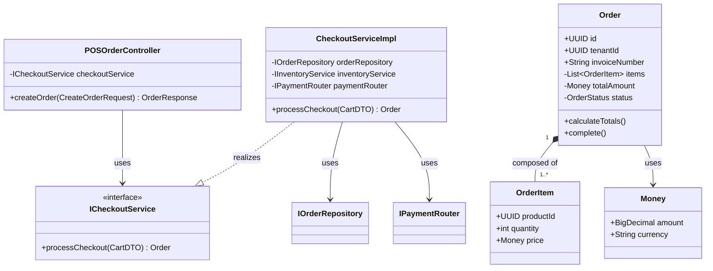

# SYSTEM DESIGN SPECIFICATION
## PART 6 — CLASS DIAGRAM DESIGN

**Project Name:** Enterprise SaaS Business Management Platform  
**Document Version:** 1.0.0  
**Date:** July 11, 2026  
**Author:** Principal Software Architect, UML Specialist & Object-Oriented Design Engineer  
**Status:** Under Review  

---

## 1. Object-Oriented Design Overview

### 1.1 Object-Oriented Design Principles
The core architecture follows **SOLID** principles to ensure that system components remain extensible and easy to test:
*   **Single Responsibility Principle (SRP):** Controllers handle HTTP payloads, services coordinate use case logic, and repositories execute database operations.
*   **Open/Closed Principle (OCP):** New payment systems or tax rules are implemented by adding new classes that implement interfaces, rather than modifying existing checkout code.
*   **Liskov Substitution Principle (LSP):** Any class implementing the payment interface can be substituted without affecting the checkout service.
*   **Interface Segregation Principle (ISP):** Clients depend only on the specific methods they use (e.g., separating POS read-only methods from inventory write operations).
*   **Dependency Inversion Principle (DIP):** Services depend on repository interfaces, not concrete implementations.

### 1.2 Domain-Driven Design (DDD) Approach
The core logic is modeled using Domain-Driven Design (DDD) concepts:
*   **Aggregates:** A collection of related entities bounded by a root entity (e.g., the `Order` aggregate contains `Order` as the root and `OrderItem` as a child).
*   **Entities:** Objects with unique identities (e.g., `User`, `Product`).
*   **Value Objects:** Immutable objects without independent identities (e.g., `Money`, `TaxRate`).

---

## 2. Domain Model Identification

### Domain: Tenant Management
*   **Purpose:** Manages isolated customer workspaces.
*   **Business Responsibilities:** Registers tenants, sets configuration parameters, and manages subscription lifecycles.
*   **Related Business Rules:** BR-TEN-001 (Unique Workspace), BR-TEN-002 (Active Account Status).
*   **Related Use Cases:** UC-001 (Register Tenant), UC-005 (Setup Branch).

### Domain: Sales Transaction (POS Checkout)
*   **Purpose:** Records customer checkouts and shifts.
*   **Business Responsibilities:** Validates cart contents, applies taxes, and records ledger entries.
*   **Related Business Rules:** BR-TXN-001 (Ledger Immutability), BR-FIN-001 (Local Tax Rules).
*   **Related Use Cases:** UC-008 (Create POS Order), UC-009 (Process Payment).

---

## 3. Class Identification

### Class 3.1: `POSOrderController`
*   **Purpose:** Exposes HTTP endpoints for POS order operations.
*   **Responsibilities:** Receives JSON payloads, validates parameters, and passes DTOs to the checkout service.
*   *Attributes:*
    *   `- checkoutService: ICheckoutService`
*   *Methods:*
    *   `+ createOrder(request: CreateOrderRequest): ResponseEntity<OrderResponse>`
    *   `+ getOrderDetails(orderId: UUID): ResponseEntity<OrderResponse>`
*   *Visibility:* Public.
*   *Relationships:* Association with `ICheckoutService`.

### Class 3.2: `Order` (Domain Aggregate Root)
*   **Purpose:** Represents a sales transaction in the system.
*   **Responsibilities:** Calculates totals, manages item details, and validates payment states.
*   *Attributes:*
    *   `+ id: UUID`
    *   `+ tenantId: UUID`
    *   `+ invoiceNumber: String`
    *   `- items: List<OrderItem>`
    *   `- subtotal: Money`
    *   `- taxAmount: Money`
    *   `- status: OrderStatus`
*   *Methods:*
    *   `+ addItem(product: Product, qty: int)`
    *   `+ calculateTotals(taxRate: TaxRate)`
    *   `+ completePayment(receipt: PaymentReceipt)`
*   *Visibility:* Public.
*   *Relationships:* Composition with `OrderItem`, Association with `Money`.

---

## 4. Class Relationships

*   **Order | Composition | OrderItem:**
    *   *Reason:* An `OrderItem` cannot exist without an `Order`. If an order is deleted, all its associated items are also deleted.
    *   *Multiplicity:* 1 to 1..* (An order must contain at least one line item).
*   **Order | Association | User (Cashier):**
    *   *Reason:* The order references the cashier who processed it.
    *   *Multiplicity:* 0..* to 1 (A cashier processes multiple orders).
*   **ICheckoutService | Realization | CheckoutServiceImpl:**
    *   *Reason:* Implements the methods defined in the checkout service interface.

---

## 5. UML Class Diagram Specification

The class structures and relationships are represented below:



---

## 6. Package Design

### Package: `com.platform.pos`
*   **Purpose:** Handles retail transactions and cash drawer shifts.
*   **Contained Classes:** `POSOrderController`, `ICheckoutService`, `CheckoutServiceImpl`, `Order`, `OrderItem`, `IOrderRepository`.
*   **Dependencies:** `com.platform.iam`, `com.platform.inventory`, `com.platform.tenant`.

### Package: `com.platform.inventory`
*   **Purpose:** Manages stock levels, suppliers, and ingredient recipes.
*   **Contained Classes:** `InventoryController`, `InventoryService`, `Product`, `StockLevel`, `InventoryRepository`.
*   **Dependencies:** `com.platform.tenant`.

---

## 7. Interface Design

### Interface 7.1: `IOrderRepository`
*   **Purpose:** Decouples the database access layer from the POS domain logic.
*   **Implemented By:** `PostgresOrderRepository`.
*   *Methods:*
    *   `+ save(order: Order): Order`
    *   `+ findById(id: UUID): Optional<Order>`
    *   `+ findByInvoiceNumber(tenantId: UUID, invoiceNo: String): Optional<Order>`
*   **Benefits:** Simplifies testing by allowing developers to mock database access.

### Interface 7.2: `IPaymentGateway`
*   **Purpose:** Standardizes payment operations across different gateways (e.g., Stripe, Bakong).
*   **Implemented By:** `StripePaymentGateway`, `BakongPaymentGateway`.
*   *Methods:*
    *   `+ authorizeCharge(amount: Money, token: String): PaymentReceipt`
    *   `+ refundCharge(chargeId: String, amount: Money): PaymentReceipt`

---

## 8. Design Pattern Application

*   **Repository Pattern:**
    *   *Purpose:* Decouples domain logic from database query execution details.
    *   *Applicable Classes:* `IOrderRepository`, `IProductRepository`, `ITenantRepository`.
    *   *Advantages:* Enforces row-level security scopes at the database layer.
*   **Strategy Pattern:**
    *   *Purpose:* Selects the payment gateway implementation at runtime based on the request context.
    *   *Applicable Classes:* `PaymentContext`, `IPaymentGateway`, `StripePaymentGateway`, `BakongPaymentGateway`.
    *   *Advantages:* Enforces open/closed extensibility for adding new payment gateways.

---

## 9. Domain Constraints

*   **Order Total Invariant:** The total value of an `Order` must equal the sum of its `OrderItem` prices multiplied by their quantities, plus taxes, minus discounts.
*   **Stock Minimum Invariant:** The quantity value of an inventory line must be greater than or equal to zero: `stock.quantity >= 0`.
*   **Invoice Uniqueness:** Invoice numbers must be unique within a tenant's workspace.

---

## 10. Object Lifecycle

*   **Creation:** An `Order` aggregate root is created when the cashier submits a cart payload.
*   **Initialization:** The constructor sets the order ID (UUID), sets the status to `PENDING`, and generates a temporary invoice number.
*   **Modification:** The cashier can add items, which adds new `OrderItem` instances to the order's internal list.
*   **Persistence:** The order is saved to the database via `IOrderRepository.save(order)` once the transaction is completed.
*   **Deletion:** Finalized orders cannot be deleted. If voided, the order status changes to `CANCELLED` to preserve audit records.

---

## 11. Class Interaction Summary

This sequence diagram maps the class interactions during order creation:

```
[ POSClient ] ──( createOrder )──> [ POSOrderController ]
                                           │
                                           ▼
[ CheckoutServiceImpl ] <──( processCheckout )── [ POSOrderController ]
      │
      ├──( authorizeCharge )──> [ IPaymentGateway ]
      │                                │
      │ <──( PaymentReceipt ) ─────────┘
      │
      ├──( deductRecipeStock )──> [ IInventoryService ]
      │
      ├──( save )───────────────> [ IOrderRepository ]
      │
      ▼
[ POSOrderController ] ──( OrderResponse )──> [ POSClient ]
```

---

## 12. Class Traceability Matrix

This matrix maps requirements to their software implementations:

| Requirement ID | Use Case ID | Domain Area | Target Class | Package Path |
| :--- | :--- | :--- | :--- | :--- |
| **FR-AUTH-001** | UC-002: Login | IAM | `LoginServiceImpl` | `com.platform.iam` |
| **FR-POS-ORD-001**| UC-008: Create Order | POS | `Order` | `com.platform.pos` |
| **FR-POS-PAY-001**| UC-009: Payment | POS | `CheckoutServiceImpl` | `com.platform.pos` |
| **FR-INV-DED-001**| UC-010: Deduct Stock | Inventory | `InventoryServiceImpl` | `com.platform.inventory` |

---

## 13. Conclusion

This Class Diagram Design Document establishes the object-oriented models, interfaces, and patterns required for implementation. By using a domain-driven design, repository abstraction interfaces, and SOLID programming principles, we ensure that both backend and frontend developers can build their respective systems using clear boundaries.

Developers can now proceed to package creation, domain entity setups, and repository mappings.
