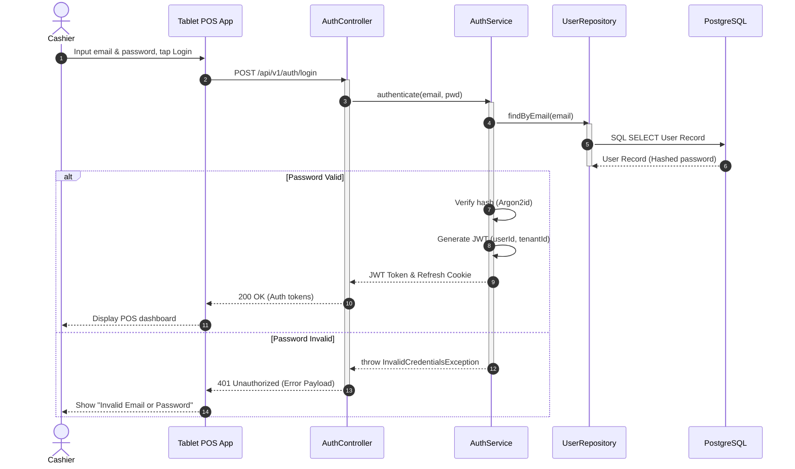
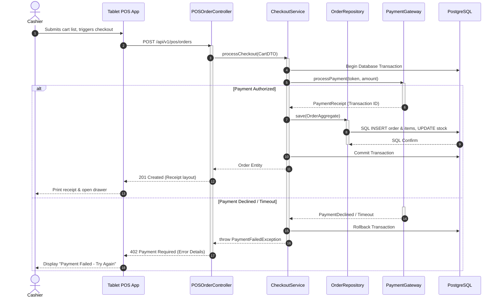

# SYSTEM DESIGN SPECIFICATION
## PART 7 — SEQUENCE DIAGRAM DESIGN

**Project Name:** Enterprise SaaS Business Management Platform  
**Document Version:** 1.0.0  
**Date:** July 11, 2026  
**Author:** Principal Software Architect, UML Specialist & Software Interaction Modeling Expert  
**Status:** Under Review  

---

## 1. Sequence Diagram Overview

### 1.1 Purpose & Modeling Strategy
Sequence diagrams capture the dynamic, chronological interaction of objects during execution. This document details the timeline, control shifts, database actions, and third-party integrations for core platform scenarios.
*   **Request Flow Visibility:** Visualizes how HTTP requests pass through middleware, controllers, and services.
*   **Decoupling Verification:** Verifies that module-to-module communication respects packages and interface contracts, without direct cross-database context calls.
*   **Error Boundaries:** Maps out exactly where exceptions are caught and how transactions are rolled back.

---

## 2. Major System Scenarios

### Scenario SQ-01: Cashier Authentication
*   **Actor:** Cashier.
*   **Goal:** Obtain a secure session token and load local tablet POS configurations.
*   **Related Use Case:** UC-002 (Authenticate User).
*   **Business Importance:** Blocks unauthorized access to cash registers and locks session actions to specific user IDs.

### Scenario SQ-02: POS Checkout & Payment Processing
*   **Actor:** Cashier, Store Customer.
*   **Goal:** Submit a checkout cart, process payment through external gateways, deduct inventory stock, and print receipt.
*   **Related Use Case:** UC-008 (Create POS Order), UC-009 (Process Payment), UC-010 (Deduct Inventory).
*   **Business Importance:** Primary revenue flow. Needs to handle connectivity losses, inventory race conditions, and payment gateway timeouts.

---

## 3. Sequence Diagram Specification & UML Diagrams

### 3.1 Scenario SQ-01: Cashier Authentication Sequence
*   **Participants:**
    *   `Actor: Cashier`
    *   `Client: Tablet POS App`
    *   `Controller: AuthController`
    *   `Service: AuthService`
    *   `Repository: UserRepository`
    *   `Database: PostgreSQL`

---

### 3.2 Scenario SQ-02: POS Checkout Sequence (Stripe / Local KHQR Card)
*   **Participants:**
    *   `Actor: Cashier`
    *   `Client: Tablet POS App`
    *   `Controller: POSOrderController`
    *   `Service: CheckoutService`
    *   `Repository: OrderRepository`
    *   `External: PaymentGateway`
    *   `Database: PostgreSQL`

---

## 4. API & Database Interaction Mapping

### 4.1 SQL Transaction Specifications
*   **POS Checkout Transaction:**
    *   *Entity:* `Order`, `OrderItem`, `Inventory`.
    *   *Operations:* `INSERT` order header, `INSERT` items list, `UPDATE` inventory quantities.
    *   *Transaction Requirement:* Read Committed transaction boundary. If any insert or update fails, rollback the entire transaction.

---

## 5. External Service Integration Details

### 5.1 Payment Gateway Failure Handling
*   **Gateway Down (500/Timeout):**
    *   If the payment gateway times out, the service does not commit the database changes. 
    *   The transaction is rolled back, the user is notified of the gateway timeout, and they are prompted to retry.
*   **Webhooks:** The system processes asynchronous webhooks to confirm invoice status in case the client browser disconnected before receiving the direct response.

---

## 6. Error & Exception Flow Design

*   **Payment Failure (Declined):**
    *   *Detection Point:* `IPaymentGateway` interface response.
    *   *System Response:* Rolls back database transaction, logs payment error code, releases checkout locks.
    *   *User Notification:* Display "Card Declined - Please choose another payment method."
*   **Inventory Race Condition (Out of Stock):**
    *   *Detection Point:* `InventoryService` validation checks.
    *   *System Response:* Blocks order creation, returns a validation error with the out-of-stock product IDs.
    *   *User Notification:* Displays "Some items in your cart are no longer available."

---

## 7. Sequence Diagram Traceability Matrix

This matrix traces requirements through sequences to components:

| Requirement ID | Use Case ID | Scenario ID | Sequence Diagram | Components Involved |
| :--- | :--- | :--- | :--- | :--- |
| **FR-AUTH-001** | UC-002: Login | SQ-01 | Cashier Auth | `AuthController`, `AuthService`, `UserRepository` |
| **FR-POS-ORD-001**| UC-008: Checkout | SQ-02 | POS Checkout | `POSOrderController`, `CheckoutService`, `PaymentGateway` |
| **FR-INV-DED-001**| UC-010: Stock | SQ-02 | POS Checkout | `CheckoutService`, `InventoryService`, `OrderRepository` |

---

## 8. Conclusion

This Sequence Diagram Design Document defines the runtime interactions and runtime sequences of the platform's core components. By defining clear transaction boundaries, error handling actions, and database transaction rollback processes, we ensure that developers can build a stable, robust checkout experience.

Developers can now proceed to route configuration, class interaction code setup, and unit testing.
