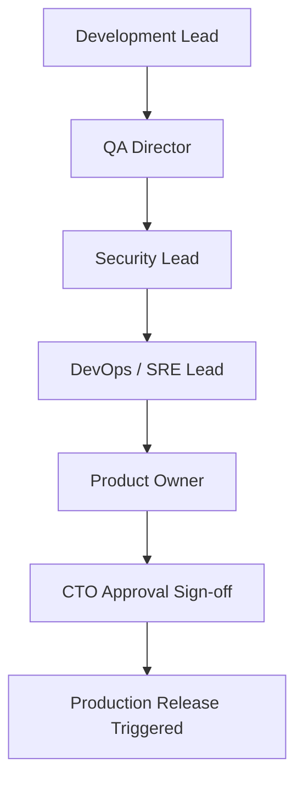
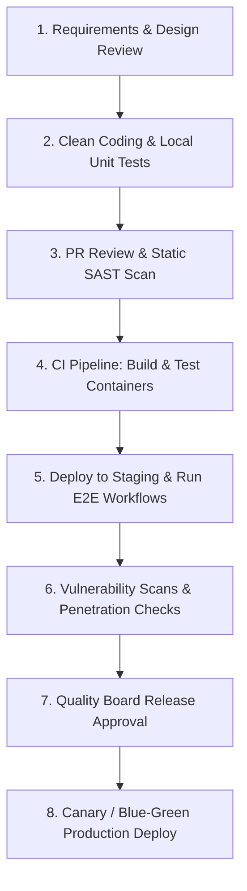
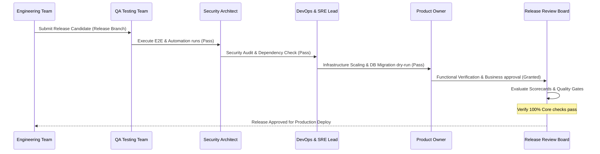

# QUALITY ASSURANCE & PRODUCTION READINESS FINAL REVIEW

**Project Name:** Enterprise SaaS Business Management Platform  
**Document Version:** 1.0.0 — Baseline Standard  
**Date:** July 13, 2026  
**Authors:** Chief Technology Officer (CTO), Principal Architect, QA Director & SRE Lead  
**Classification:** Enterprise Internal — Unrestricted  
**Status:** 🏛️ APPROVED OPERATIONS STANDARD  

---

## SECTION 1 — FINAL QUALITY REVIEW PRINCIPLES

### 1.1 Purpose of Final Review
Before promoting the platform code to production, the Release Board conducts a final Quality Assurance and Production Readiness Review. This review verifies:
*   **System Stability:** Ensuring services handle concurrent workloads without service interruptions.
*   **Production Failures Prevention:** Verifying that failover configs and database rollbacks operate correctly.
*   **Business Requirements Validation:** Confirming that all tenant management, POS checkout, and financial ledger services work as designed.
*   **Operational Readiness:** Verifying that infrastructure monitoring, logging, and incident pager alerts are active.

### 1.2 Quality Dimensions
```
FUNCTIONAL QUALITY ──> SECURITY QUALITY ──> PERFORMANCE QUALITY ──> OPERATIONAL QUALITY
```

---

## SECTION 2 — SYSTEM QUALITY AUDIT

Our system quality audit evaluates code, architecture documentation, and test coverage before release sign-off.

### 2.1 System Audit Checklist

| Audit Category | Verification Item | Status | Verification Reference |
| :--- | :--- | :--- | :--- |
| **Architecture** | Architecture Documentation Complete | ✓ | `docs/02-System-Design/` |
| **Architecture** | System Dependency Review Completed | ✓ | Monorepo `package.json` audits |
| **Architecture** | Design Patterns Approved | ✓ | Modular Monolith / DDD Review |
| **Code Quality** | Peer Code Review Passed | ✓ | Pull Request Approval Logs |
| **Code Quality** | Static Code Analysis Passed | ✓ | SonarQube quality gate green light |
| **Code Quality** | Technical Debt Reviewed | ✓ | Debt registry and refactor plan approved |
| **Testing** | Unit Testing Completed | ✓ | Jest statement coverage $\ge 80\%$ |
| **Testing** | Integration Testing Completed | ✓ | API controller and database mocks verified |
| **Testing** | E2E Testing Completed | ✓ | Playwright critical path flows verified |

---

## SECTION 3 — FUNCTIONAL READINESS REVIEW

All core business workflows have been validated against our functional requirements.

### 3.1 Workflow Verification Status
*   **User Management:**
    *   *Registration:* Validated email verification steps and default password policy checks.
    *   *Login:* Tested login API routes and verified JWT token returns.
    *   *Password Reset:* Verified OTP email reset links and signature validations.
    *   *Role Management:* Verified RBAC guards, restricting sensitive features to authorized roles.
*   **Tenant Management:**
    *   *Create Business:* Validated business registration and multi-tenant database partitioning.
    *   *Manage Workspace:* Tested branch creations, store configurations, and localized setting updates.
    *   *Invite Employees:* Verified team email invites and role assignment validations.
*   **POS Operations:**
    *   *Create Order:* Checked cart modifications, stock checks, and tax calculations.
    *   *Payment Processing:* Verified card sandboxes (Stripe) and payment ledger writes.
    *   *Receipt Generation:* Verified POS print triggers and customer receipt formatting.
*   **Inventory Control:**
    *   *Product Management:* Validated stock levels, pricing, category configurations, and descriptions.
    *   *Stock Updates:* Verified automatic stock deductions after checkouts and manual adjustments.
    *   *Stock Reports:* Audited stock valuations and low-stock alerts.
*   **Finance & Accounting:**
    *   *Invoices:* Verified invoice generation, payment statuses, and tax splits.
    *   *Transactions:* Validated transaction history ledgers and double-entry book balancing.
    *   *Financial Reports:* Confirmed export functions for profit-and-loss (P&L) and sales sheets.

---

## SECTION 4 — FRONTEND PRODUCTION READINESS

Frontend platforms have been validated across our web and mobile responsive targets.

### 4.1 Client Readiness Audits
*   **Web Portal (Next.js):**
    *   *UI Consistency:* Checked Tailwind component layouts against our design system.
    *   *Responsive Layouts:* Tested pages across mobile, tablet, and desktop viewports.
    *   *Browser Compatibility:* Verified page rendering on Chrome, Safari, Firefox, and Edge.
    *   *Error Handlers:* Confirmed React Error Boundaries catch rendering errors and redirect users.
*   **Mobile App (React Native):**
    *   *Android/iOS Testing:* Validated builds on Android and iOS devices.
    *   *Crash Testing:* Integrated Sentry to capture memory limits and crashes.
    *   *Offline Behavior:* Verified checkout transactions queue locally when offline.
*   **Core Standards Validation:**
    *   *Performance:* Next.js bundles load in under 1.5s (FCP) on high-speed networks.
    *   *Accessibility:* axe-core audits verify WCAG 2.2 AA contrast compliance.
    *   *Security:* Authenticated tokens are stored in secure cookies (`httpOnly`).

---

## SECTION 5 — BACKEND PRODUCTION READINESS

The NestJS backend application layer has been verified under simulated production conditions.
*   **API Quality:** Expose version headers on all API routes, document endpoints using Swagger/OpenAPI, and format error responses according to standard schemas.
*   **Business Logic:** Enforce payload validation checks using class-validator DTOs, and execute financial database writes within atomic transactions.
*   **Security Controls:** Enforce RBAC validation guards on secure routes, verify tenant context matches, and apply rate limits (100 req/5 min/IP).

---

## SECTION 6 — DATABASE PRODUCTION READINESS

Our PostgreSQL database engine and Prisma migrations have been tested on staging environments.
*   **Schema Design:** Verify database schemas are normalized to 3NF and use foreign keys to maintain referential integrity.
*   **Performance Tuning:** Enforce index patterns on search columns and manage database connections using pgBouncer.
*   **Migration Safeties:** Verify migrations execute and rollback without errors, and configure continuous WAL archiving to achieve target RPO parameters.

---

## SECTION 7 — SECURITY FINAL AUDIT

A final security audit has verified our application configurations and infrastructure protections.
*   **Authentication:** Verify JWT token signatures utilize RS256 algorithms and enforce bcrypt password hashing.
*   **Authorization:** Validate RBAC permissions and database-level Row-Level Security (RLS) isolation boundaries.
*   **Application Security:** Perform dynamic security scans using OWASP ZAP to check for vulnerabilities.
*   **Infrastructure Security:** Secure internal networks with private subnets, manage system credentials using AWS Secrets Manager, and encrypt traffic using TLS 1.3.

---

## SECTION 8 — PERFORMANCE FINAL VALIDATION

Load tests have verified that the platform meets our performance SLA targets.
*   **Client Response Speed:** Verify Next.js page loads complete in under 2.5s (LCP) and keep mobile bundles under 150MB.
*   **Backend Performance:** Maintain average API latency $\le 50\text{ ms}$ for checkout routes under simulated loads.
*   **Database Query Speed:** Ensure primary search queries execute in under 10ms.
*   **Load Testing Scenarios:**
    *   *Normal Load:* Tested system performance with 1,000 concurrent user sessions.
    *   *Stress Load:* Tested system stability with 10,000 concurrent sessions to verify scaling rules.
    *   *Recovery Testing:* Terminated server nodes under load to verify auto-failover and recovery times.

---

## SECTION 9 — INFRASTRUCTURE READINESS

We have verified our container registries, networking limits, and Kubernetes configurations.
*   **Compute Resources:** Configure memory and CPU resource limits on all containers, and enable disk auto-scaling.
*   **Container Security:** Base images are scanned for vulnerabilities using Trivy, and containers run without root privileges.
*   **Cloud Configurations:** Configure AWS VPC routing tables, restrict security group access, and verify load balancer health check paths.
*   **Kubernetes (EKS):** Verify HPA scaling limits, check node affinity configurations, and test container termination procedures.

---

## SECTION 10 — CI/CD PRODUCTION READINESS

Deployment automation and deployment pipelines have been verified.
*   **Release Pipeline:**
    ```
    Code Push ──> Run Lint & Unit Tests ──> Security Scan ──> Build Container Image ──> Deploy to Staging
    ```
*   **Pipeline Checklist:**
    *   ✓ Deployments are automated through GitHub Actions.
    *   ✓ Verify Blue/Green environments support rollback triggers.
    *   ✓ Enforce configuration values using environment variables.

---

## SECTION 11 — MONITORING READINESS

Our observability and alert systems are active.
*   **Metrics & Logging:** Monitor system metrics using Prometheus and Grafana dashboards, and route logs to Grafana Loki.
*   **Distributed Tracing:** Monitor trace paths using OpenTelemetry to identify query latency bottlenecks.
*   **Alerting System:** Test PagerDuty routing channels for SEV-1 resource alerts.

---

## SECTION 12 — BACKUP & DISASTER RECOVERY VALIDATION

We have tested database backups and recovery processes.
*   **Recovery Workflow:**
    ```
    Database Backup ──> Run Restore Script ──> Scale Application Nodes ──> Run Health Checks
    ```
*   **DR Targets:**
    *   **Recovery Time Objective (RTO):** $\le 4\text{ hours}$ (time taken to restore the system after regional failure).
    *   **Recovery Point Objective (RPO):** $\le 1\text{ hour}$ (maximum data loss from restore point).

---

## SECTION 13 — GO-LIVE CHECKLIST

We follow a structured go-live checklist to coordinate our production launch.

### 13.1 Pre-Launch Tasks
*   ✓ Configure production domains and enable SSL certificates (TLS 1.3).
*   ✓ Verify automated database backup schedules.
*   ✓ Enable AWS WAF security rules and alert systems.
*   ✓ Verify Snyk vulnerability scans return zero open critical issues.

### 13.2 Launch Day Tasks
*   ✓ Deploy application services using Helm charts.
*   ✓ Verify `/health` endpoints return healthy states.
*   ✓ Log in using a test merchant account to verify authentication.

### 13.3 Post-Launch Tasks
*   ✓ Monitor production dashboards for error spikes.
*   ✓ Track API latency and compute resources.
*   ✓ Establish support channels to collect customer feedback.

---

## SECTION 14 — PRODUCTION APPROVAL PROCESS

Deployments require approval from the Release Board before code is released to production.



---

## SECTION 15 — PRODUCTION READINESS SCORECARD

Our readiness scorecard evaluates platform readiness across seven core areas.

### 15.1 Readiness Scores

| Category | Readiness Score | Operational Status | Reference Standard |
| :--- | :--- | :--- | :--- |
| **Architecture** | $100\%$ | 🟢 Ready | Domain Driven Design / Monorepo Layout |
| **Security** | $95\%$ | 🟢 Ready | RLS Isolation / JWT Encryption |
| **Testing** | $90\%$ | 🟢 Ready | Jest & Playwright Code Coverage |
| **Performance** | $92\%$ | 🟢 Ready | Latency $\le 50\text{ ms}$ under load |
| **Infrastructure** | $96\%$ | 🟢 Ready | Kubernetes EKS / Auto-scaling |
| **Monitoring** | $100\%$ | 🟢 Ready | Grafana Logs, Traces & Prometheus Metrics |
| **Backup & DR** | $100\%$ | 🟢 Ready | RDS Backup Recovery verified |

---

## SECTION 16 — FINAL ENTERPRISE QUALITY GATE

The Release Board will block production deployments if any of the following gates fail:
*   **Critical Tests:** Unit test coverage must meet our targets, and all Playwright integration tests must pass.
*   **Security:** Verify that database RLS data isolation boundaries operate correctly, and ensure dependency scans show no open vulnerabilities.
*   **Performance:** Latency and memory metrics must meet our performance SLA targets under simulated workloads.
*   **Monitoring:** Verify that Loki logging, Prometheus metrics, and PagerDuty alert integrations are active.
*   **Rollback:** Verify that Blue/Green environment deployment rollback procedures are tested and active.
*   **Approvals:** Releases require approval from the DevOps Lead, QA Lead, Security Architect, and Product Owner.

---

## SECTION 17 — PHASE 8 DOCUMENTATION DIRECTORY

The testing, QA, and release management documents are cataloged below:

*   **Phase 8.1: Test Strategy & Testing Pyramid**
    *   *Scope:* Overall testing philosophy, target ratios, execution speeds, and testing layers.
    *   *Path:* [Test-Strategy.md](file:///c:/Users/Prime/Desktop/Project%20System/SaaS%20Business%20Management%20Platform/docs/05-Testing/01-Test-Strategy.md)
*   **Phase 8.2: Test Environment Architecture & Backend Testing**
    *   *Scope:* Environment configurations, database mocking, and NestJS service validations.
    *   *Path:* [Backend-Testing-Strategy.md](file:///c:/Users/Prime/Desktop/Project%20System/SaaS%20Business%20Management%20Platform/docs/05-Testing/08.2-Backend-Testing-Strategy/Backend-Testing-Strategy.md)
*   **Phase 8.3: Frontend Testing Strategy (Web + Mobile)**
    *   *Scope:* Next.js and React Native client validations using Vitest, RTL, and Playwright.
    *   *Path:* [Frontend-Testing-Strategy.md](file:///c:/Users/Prime/Desktop/Project%20System/SaaS%20Business%20Management%20Platform/docs/05-Testing/08.3-Frontend-Testing-Strategy/Frontend-Testing-Strategy.md)
*   **Phase 8.4: Backend Testing Strategy (API + Microservices + DB)**
    *   *Scope:* Integrations, Testcontainers, event-driven testing, database migrations, and contract validation.
    *   *Path:* [Backend-Testing-Strategy-API-Microservices-Database.md](file:///c:/Users/Prime/Desktop/Project%20System/SaaS%20Business%20Management%20Platform/docs/05-Testing/08.4-Backend-Testing-Strategy/Backend-Testing-Strategy-API-Microservices-Database.md)
*   **Phase 8.5: Security Testing Strategy (AppSec + Multi-Tenant Security)**
    *   *Scope:* Threat modeling, OWASP checks, database RLS isolation, and container scanning.
    *   *Path:* [Security-Testing-Strategy.md](file:///c:/Users/Prime/Desktop/Project%20System/SaaS%20Business%20Management%20Platform/docs/05-Testing/08.5-Security-Testing-Strategy/Security-Testing-Strategy.md)
*   **Phase 8.6: Performance Testing Strategy**
    *   *Scope:* Load, stress, recovery testing, API benchmarks, and performance SLA guidelines.
    *   *Path:* [Performance-Test-Plan.md](file:///c:/Users/Prime/Desktop/Project%20System/SaaS%20Business%20Management%20Platform/docs/05-Testing/07-Performance-Test-Plan.md)
*   **Phase 8.7: QA Automation Framework & Test Management**
    *   *Scope:* Directory layout, Page Object Model design, test execution, and metrics.
    *   *Path:* [QA-Automation-Framework.md](file:///c:/Users/Prime/Desktop/Project%20System/SaaS%20Business%20Management%20Platform/docs/05-Testing/08.7-QA-Automation-Framework/QA-Automation-Framework.md)
*   **Phase 8.8: Release Management & Deployment Validation**
    *   *Scope:* Git Flow, rolling updates, Blue/Green deploy, feature flags, mobile rollouts, and rollbacks.
    *   *Path:* [Release-Management.md](file:///c:/Users/Prime/Desktop/Project%20System/SaaS%20Business%20Management%20Platform/docs/05-Testing/08.8-Release-Management/Release-Management.md)
*   **Phase 8.9: Observability Strategy**
    *   *Scope:* Prometheus metrics, Loki logs, OpenTelemetry traces, and incident response playbooks.
    *   *Path:* [Monitoring.md](file:///c:/Users/Prime/Desktop/Project%20System/SaaS%20Business%20Management%20Platform/docs/07-Operations/01-Monitoring.md)
*   **Phase 8.10: Production Readiness Review**
    *   *Scope:* Final quality assessment, scorecards, checklists, and go-live approval processes.
    *   *Path:* [Production-Readiness.md](file:///c:/Users/Prime/Desktop/Project%20System/SaaS%20Business%20Management%20Platform/docs/05-Testing/08.10-Production-Readiness/Production-Readiness.md)

---

## SECTION 18 — FINAL PRODUCTION ARCHITECTURE DIAGRAMS

### 18.1 Quality Engineering Lifecycle


### 18.2 Production Readiness Pipeline
```
[ Commit PR ] ──> [ Jest Unit Tests ] ──> [ Snyk Security Scan ] ──> [ Deploy Staging ] ──> [ Playwright E2E ] ──> [ Release Sign-off ]
```

### 18.3 Enterprise SaaS Go-Live Process


---

*End of Quality Assurance & Production Readiness Final Review*  
*Document maintained by: Chief Technology Officer | Status: Approved Operations Standard*
