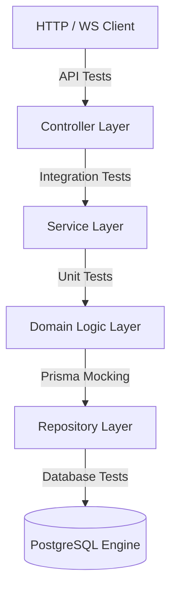
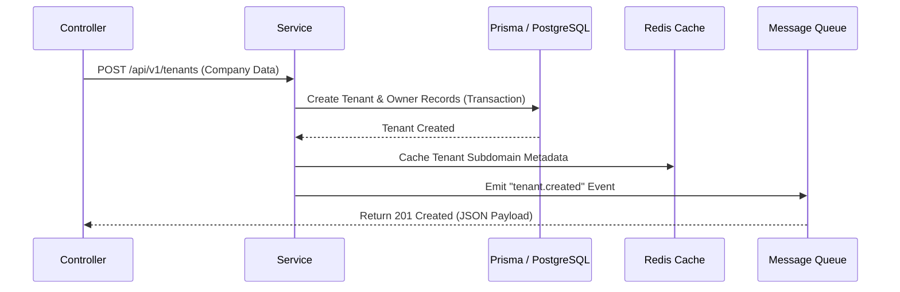
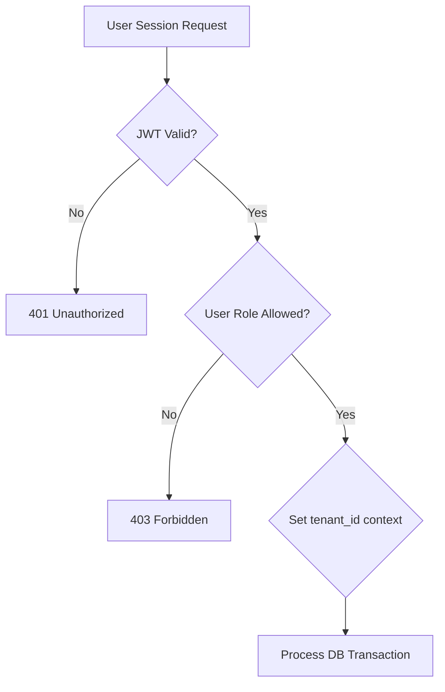
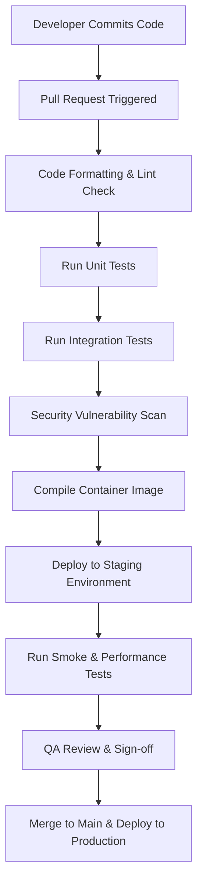

# ENTERPRISE BACKEND TESTING STRATEGY & RELIABILITY ENGINEERING

**Project Name:** Enterprise SaaS Business Management Platform  
**Document Version:** 1.0.0 — Baseline Standard  
**Date:** July 13, 2026  
**Authors:** QA Automation Architect, Principal Software Architect & SRE Lead  
**Classification:** Enterprise Internal — Unrestricted  
**Status:** 🏛️ APPROVED TESTING STANDARD  

---

## 1. Introduction

### 1.1 Purpose
This *Backend Testing Strategy* defines the testing methodology, tools, environments, and quality gates for the NestJS/TypeScript/Prisma API backend. It provides backend and QA engineers with a standardized framework to verify business logic correctness, data isolation, and API performance before code is released to production.

### 1.2 Importance for the SaaS Platform
Multi-tenant SaaS platforms carry high operational risks. A bug in query structures can leak sensitive financial transactions to competing merchants. Performance regressions on point-of-sale (POS) checkout paths immediately halt in-store checkouts, causing business disruption. Therefore, our testing strategy prioritizes:
*   **Absolute Tenant Data Isolation:** Verifying that data borders are maintained under all load conditions.
*   **System Latency Protection:** Ensuring checkout routes maintain sub-50ms processing speeds.
*   **Operational Resilience:** Validating automated recovery and fallback routines (e.g., caching timeouts, database reconnects).

### 1.3 Quality Objectives

| Objective | Target Metric | Verification Method |
| :--- | :--- | :--- |
| **Code Coverage** | $\ge 80\%$ (Overall), $\ge 90\%$ (Core domains like Billing/Orders) | Jest Coverage Reports in CI/CD pipeline |
| **API Latency** | P99 latency $\le 50\text{ ms}$ for POS checkouts under load | k6 Performance Load Pipeline |
| **Defect Density** | Zero critical/high-severity vulnerabilities in production | Static (SAST) & Dynamic (DAST) Security Scans |
| **Data Isolation** | 100% tenant data boundaries maintained | Multi-tenant automated security tests |

---

## 2. Backend Testing Architecture

Our testing architecture mirrors the application's layered design. Each layer has specific testing responsibilities.



### 2.1 Layer Testing Responsibilities

*   **Controller Layer:**
    *   *Testing Focus:* API routing, HTTP status codes, request validation filters, authentication checks, and standard serialization.
    *   *Testing Style:* API Integration Tests (using `Supertest`).
*   **Service Layer:**
    *   *Testing Focus:* Transaction management, workflow coordination, event emitting, and database mapping.
    *   *Testing Style:* Mocked Service Tests and Unit Tests.
*   **Domain Logic Layer:**
    *   *Testing Focus:* Pure business calculations, licensing rules, pricing structures, and status changes.
    *   *Testing Style:* Pure Unit Tests (no database or external mock dependencies).
*   **Repository Layer:**
    *   *Testing Focus:* SQL query validation, schema mapping, Prisma constraints, and index optimizations.
    *   *Testing Style:* Database Integration Tests.
*   **Database Engine:**
    *   *Testing Focus:* Row-Level Security (RLS) enforcement, database constraints, and foreign key integrity.
    *   *Testing Style:* Isolated Database Security Verification Tests.

---

## 3. Testing Environment Strategy

To prevent test runs from affecting production data and keep test results reliable, we isolate environments.

```
DEVELOPMENT (Local) ──> TESTING (CI Pipeline) ──> STAGING (Pre-Prod) ──> PRODUCTION
* Local SQLite/Postgres * Dockerized Database  * AWS RDS Multi-AZ       * AWS RDS Multi-AZ
* Mocked Queue/Redis    * Mocked Redis/Queue   * Active Queue/Redis      * Isolated Subnets
```

### 3.1 Environment Definitions

#### Development (Local VM)
*   *Database Strategy:* Run a local dockerized PostgreSQL instance.
*   *Data Management:* Developers run seed scripts to populate testing databases with sample tenant records.
*   *Config Management:* Configurations are loaded from local `.env.development` files.

#### Testing (CI Pipeline Run)
*   *Database Strategy:* Spin up a temporary PostgreSQL instance inside a Docker container for each test run.
*   *Data Management:* Database schemas are set up using Prisma migrations at pipeline start. Databases are wiped between test suites.
*   *Config Management:* Configurations are injected as pipeline variables by GitHub Actions.

#### Staging (Pre-Production sandbox)
*   *Database Strategy:* AWS RDS PostgreSQL Multi-AZ instance mirroring production specifications.
*   *Data Management:* Populated with obfuscated copies of production databases to validate query speeds against large data sets.
*   *Config Management:* Credentials are retrieved at runtime from AWS Secrets Manager.

#### Production (Live Site)
*   *Database Strategy:* Live AWS RDS PostgreSQL Multi-AZ instance with active read replicas.
*   *Data Management:* Live customer transactions. Test scripts are disallowed from executing against production.
*   *Config Management:* Credentials managed via AWS Secrets Manager with automated 90-day rotations.

---

## 4. Unit Testing Strategy

Unit tests verify that individual functions, utilities, and calculations compute values correctly. We use **Jest** to execute tests and mock external dependencies.

### 4.1 Dependency Injection Mocking (NestJS)
To test services without executing actual database queries, we mock the NestJS dependency injection container:

```typescript
import { Test, TestingModule } from '@nestjs/testing';
import { SubscriptionService } from './subscription.service';
import { PrismaService } from '../prisma/prisma.service';

describe('SubscriptionService', () => {
  let service: SubscriptionService;
  let prismaMock: any;

  beforeEach(async () => {
    prismaMock = {
      tenant: {
        findUnique: jest.fn(),
      },
    };

    const module: TestingModule = await Test.createTestingModule({
      providers: [
        SubscriptionService,
        { provide: PrismaService, useValue: prismaMock },
      ],
    }).compile();

    service = module.get<SubscriptionService>(SubscriptionService);
  });

  it('should calculate subscription invoices correctly', () => {
    const result = service.calculateInvoice('Professional');
    expect(result).toEqual({ price: 49, interval: 'month' });
  });
});
```

### 4.2 Test Scenario Example: Subscription Price Calculation

| Test Scenario | Input plan | Expected Result | Assertions |
| :--- | :--- | :--- | :--- |
| Free Trial Plan | `Plan = "Trial"` | Price = `$0`, Limit = `14 Days` | `invoice.price === 0 && invoice.days === 14` |
| Professional Plan | `Plan = "Professional"` | Price = `$49/month`, Limit = `Unlimited` | `invoice.price === 49 && invoice.interval === "month"` |
| Enterprise Plan | `Plan = "Enterprise"` | Price = Custom Quote, Limit = `Unlimited` | `invoice.isCustom === true` |

---

## 5. Integration Testing Strategy

Integration tests verify data flows and communications across controllers, services, database models, and external services (caching, queues).

### 5.1 Test Flow: Create New Tenant



1.  **Request Input:** Post tenant metadata (`companyName`, `ownerEmail`, `selectedPlan`) to `/api/v1/tenants`.
2.  **Database Assertions:** Verify that the database registers both the tenant record and the admin account within an atomic transaction.
3.  **Cache Assertions:** Validate that the system registers the tenant's subdomain in Redis with correct TTL values.
4.  **Queue Assertions:** Verify that the platform sends a `tenant.created` event payload to the notification queue.
5.  **Output Assertion:** Validate that the HTTP response returns `201 Created` with a valid, non-null tenant identifier.

---

## 6. Database Testing Strategy

Database tests verify database constraints, relational integrity, migrations, and tenant isolation rules.

### 6.1 Verification Scenarios (PostgreSQL + Prisma)
*   **Migration Testing:** Run rollback and forward migration scripts in the CI database container to ensure migrations execute without errors:
    ```bash
    prisma migrate dev --name test-run
    ```
*   **Relationship Integrity:** Verify that deleting a tenant record automatically removes associated users and transactions (cascade deletes).
*   **Constraint Checks:** Verify that inserting negative values into monetary fields triggers database check constraints and returns errors.
*   **Transaction Integrity:** Inject network delay mock triggers into the database connection, verifying that failed multistep operations roll back data states completely.

---

## 7. API Testing Strategy

We test REST API routes to ensure they process parameters and authorize endpoints correctly.

### 7.1 Testing Checklist
*   **Input Validation:** POST request payloads with missing fields or invalid email formats, verifying the API returns `400 Bad Request` with validation detail objects.
*   **Route Guards:** Query secure endpoints without headers, verifying that they return `401 Unauthorized`.
*   **Access Denied:** Query administrative routes using cashier tokens, verifying they return `403 Forbidden`.
*   **Response Standards:** Validate that successful routes match our standard JSON API payload layouts, including matching data schemas, correlation headers, and timestamps.

### 7.2 Tool Selections
*   **Supertest:** Integrated into Jest to test NestJS route controllers in-process during CI pipelines.
*   **Postman/Newman:** Used to execute dynamic end-to-end API test workflows against running staging environments.

---

## 8. Authentication and Authorization Testing

We verify JWT validity, role configurations, and access control policies across all API endpoints.



### 8.1 Authorization Test Cases

| Active Session Role | Targeted Endpoint | Action | Expected Outcome |
| :--- | :--- | :--- | :--- |
| **Super Admin** | `GET /api/v1/tenants` | List all platform tenants | `200 OK` (Full Tenant Array) |
| **Tenant Admin (Owner)** | `POST /api/v1/employees` | Create a new employee record | `201 Created` (Employee Record) |
| **Tenant Admin (Owner)** | `DELETE /api/v1/tenants` | Terminate tenant account | `403 Forbidden` (Vetoed) |
| **Cashier** | `POST /api/v1/orders` | Register checkout transaction | `201 Created` (Checkout Confirmed) |
| **Cashier** | `GET /api/v1/reports/pnl` | View branch profit-loss reports | `403 Forbidden` (Access Denied) |

---

## 9. SaaS Multi-Tenant Testing

Tenant isolation is the core security concern of the platform. We run automated checks to ensure tenant data boundaries are maintained.

### 9.1 Tenant Data Boundary Verification Flow
To confirm that PostgreSQL RLS policies block cross-tenant data access:

```typescript
describe('Tenant Data Isolation Security Gate', () => {
  it('should prevent Tenant A from accessing Tenant B database records', async () => {
    // Generate active tokens for Tenant A and Tenant B
    const tokenTenantA = authService.generateToken({ tenantId: 'tenant-a', role: 'Cashier' });
    const tokenTenantB = authService.generateToken({ tenantId: 'tenant-b', role: 'Cashier' });

    // Insert order record owned by Tenant B
    const orderTenantB = await prisma.order.create({
      data: { tenantId: 'tenant-b', total: 100, status: 'Completed' }
    });

    // Attempt to access Tenant B's order using Tenant A's token
    const response = await request(app.getHttpServer())
      .get(`/api/v1/orders/${orderTenantB.id}`)
      .set('Authorization', `Bearer ${tokenTenantA}`);

    // Assert request is blocked and returns a 404/403 status code
    expect(response.status).toBe(404); // Database RLS prevents search mapping, returning not found
  });
});
```

### 9.2 Security Scenarios Tested
*   **Subdomain Spoofing:** Send HTTP requests with host headers set to `tenant-b.saas.com` while presenting a JWT signed for `tenant-a`. Verify that the gateway blocks the request or forces matching token contexts.
*   **Batch Leak Checks:** Query data listings (`GET /api/v1/products`) with valid tokens, verifying that the returned arrays contain only items matching the user's `tenant_id`.

---

## 10. Module Testing Strategy

Each business module is tested across three layers before release.

### 10.1 Module Verification Matrix

| Module | Unit Test Target | Integration Test Target | End-to-End Workflow Target |
| :--- | :--- | :--- | :--- |
| **Coffee POS** | Tax rounding, cart price addition, and discount codes. | Stock level deductions in the inventory tables. | Scan items $\rightarrow$ Apply discount $\rightarrow$ Process cash checkout $\rightarrow$ Verify stock reduction and print invoice. |
| **Restaurant** | Table status logic and menu configuration updates. | Kitchen Display System (KDS) live order updates. | Assign table $\rightarrow$ Order food $\rightarrow$ Route to kitchen display $\rightarrow$ Close bill. |
| **Pharmacy** | Expiry date validation checks. | Batch tracking and stock levels. | Scan medicine $\rightarrow$ Validate expiry status $\rightarrow$ Process sale $\rightarrow$ Record batch numbers. |

---

## 11. Performance Testing

We run performance tests to ensure checkout transactions maintain sub-50ms processing speeds under load.

### 11.1 Simulation Metrics
*   **Sustained Load:** Test system performance with 10,000 businesses and 100,000 concurrent active users.
*   **Core Target:** Maintain checkout response latency $\le 50\text{ ms}$ at 200 requests per second.
*   **Tools:**
    *   **k6:** Simulates high concurrent checkouts and measures API gateway latency.
    *   **Artillery:** Simulates WebSocket connections from POS tablet terminals.

### 11.2 performance Test Pipeline (k6 Script)
```javascript
import http from 'k6/http';
import { check, sleep } from 'k6';

export const options = {
  stages: [
    { duration: '1m', target: 50 },  // Ramp up traffic
    { duration: '3m', target: 200 }, // Sustained heavy load
    { duration: '1m', target: 0 },   // Cool down
  ],
  thresholds: {
    http_req_duration: ['p(99)<50'], // 99% of requests must complete under 50ms
  },
};

export default function () {
  const payload = JSON.stringify({ productId: 'prod-1', quantity: 1 });
  const params = {
    headers: {
      'Content-Type': 'application/json',
      'Authorization': 'Bearer test-jwt-token',
    },
  };
  const res = http.post('https://staging-api.saas.com/api/v1/orders', payload, params);
  check(res, { 'status is 201': (r) => r.status === 201 });
  sleep(1);
}
```

---

## 12. Security Testing

Our security testing pipeline checks for vulnerabilities before code commits merge to `main`.

### 12.1 Security Testing Focus (OWASP API Top 10)
*   **Broken Object Level Authorization (BOLA):** Verify that users cannot read or modify resources belonging to other tenants by changing the resource ID in API calls.
*   **Broken Authentication:** Validate that expired JWT tokens and malformed authorization headers are blocked.
*   **SQL Injection:** Test input fields with SQL character triggers (`' OR 1=1 --`), verifying that Prisma prevents query execution.
*   **Rate Limiting:** Send volumetric requests to security endpoints (like login), verifying that the API blocks IPs exceeding limits.
*   **Sensitive Data Exposure:** Validate that API responses do not leak database password hashes, internal server paths, or trace details.

---

## 13. CI/CD Testing Pipeline

Every change committed to the repository must pass all automated pipeline gates.



---

## 14. Test Folder Structure

To keep tests organized and simplify execution, we use a standardized testing directory layout:

```
/tests
├── database/               # Database setups, schemas, and RLS validation checks
│   ├── rls-isolation.spec.ts
│   └── schema-validation.spec.ts
├── e2e/                    # Complete business workflow tests
│   ├── pos-checkout.spec.ts
│   └── tenant-onboarding.spec.ts
├── fixtures/               # Seed data, sample payloads, and JSON assets
│   ├── sample-products.json
│   └── tenant-profiles.json
├── integration/            # Controller and service database tests
│   ├── auth-flow.spec.ts
│   └── inventory-sync.spec.ts
├── mocks/                  # Mock implementations of external services
│   ├── mailer.service.mock.ts
│   └── payment.gateway.mock.ts
├── reports/                # Output destination for JUnit XML and code coverage reports
└── unit/                   # Pure logic calculations and utility tests
    ├── decimal-math.spec.ts
    └── subscription-calculator.spec.ts
```

---

## 15. Quality Gate Rules

We enforce strict quality standards. Code merges to `main` are blocked if any of the following gates fail:

1.  **Code Coverage:**
    *   *System Average:* $\ge 80\%$ statement coverage.
    *   *Core Modules (Billing, Orders, Auth):* $\ge 90\%$ statement coverage.
2.  **Lint Status:** Zero warning or error flags from `golangci-lint` or `eslint` checks.
3.  **Security Scans:** Zero open Critical or High-severity vulnerability alerts.
4.  **Integration Pass Rate:** 100% pass rate on integration and end-to-end test suites.
5.  **Build Status:** The application must compile successfully without syntax or configuration warnings.

---

## 16. Deliverables Reference

The backend testing strategy specifications are stored in the project's documentation catalog at:
*   [Backend-Testing-Strategy.md](file:///c:/Users/Prime/Desktop/Project%20System/SaaS%20Business%20Management%20Platform/docs/05-Testing/08.2-Backend-Testing-Strategy/Backend-Testing-Strategy.md)

---

*End of Enterprise Backend Testing Strategy Document*  
*Document maintained by: QA Automation Architect | Status: Approved Standard*
