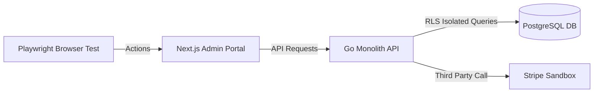
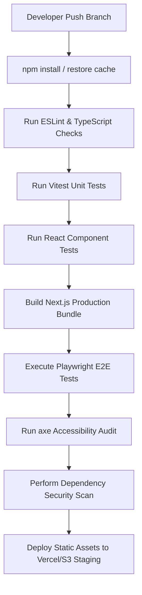
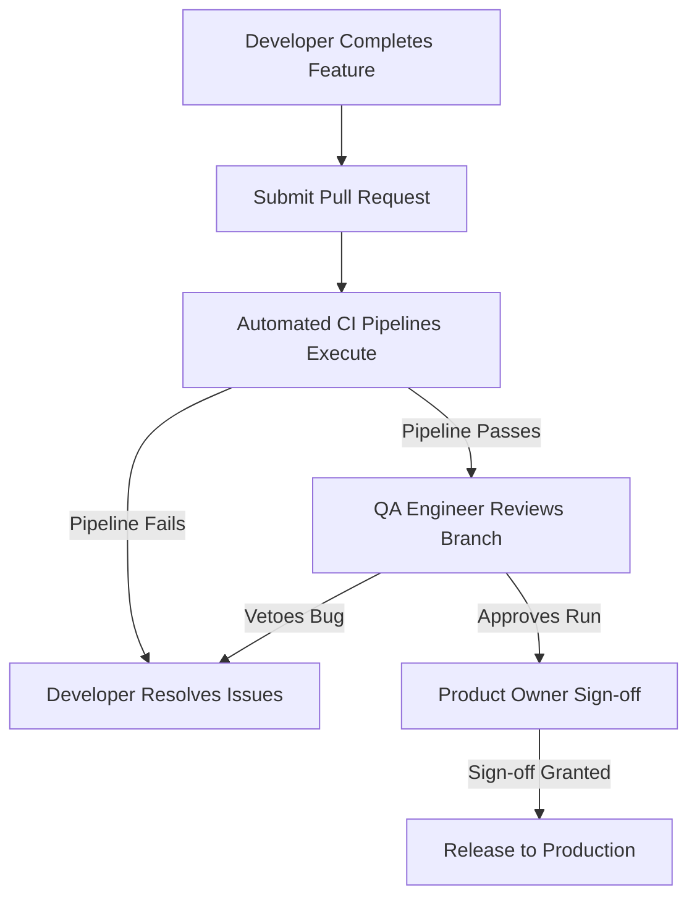

# ENTERPRISE FRONTEND TESTING STRATEGY (WEB & MOBILE SAAS APPLICATIONS)

**Project Name:** Enterprise SaaS Business Management Platform  
**Document Version:** 1.0.0 — Baseline Standard  
**Date:** July 13, 2026  
**Authors:** Principal Frontend Architect, QA Automation Lead & Mobile Testing Specialist  
**Classification:** Enterprise Internal — Unrestricted  
**Status:** 🏛️ APPROVED TESTING STANDARD  

---

## SECTION 1 — FRONTEND TESTING PRINCIPLES

### 1.1 Why Frontend Testing is Critical for SaaS Platforms
In a multi-tenant, modular SaaS platform, the user interface is the gateway through which merchants execute high-volume checkout, inventory audits, and financial reporting. Regression issues in frontend code directly translate to lost revenue for stores and increased churn for the platform.
*   **Preventing Regression Issues:** Automated frontend checks ensure that updating a shared payment library or UI component does not inadvertently break critical cashier checkouts or store manager analytics.
*   **Maintaining Reliability Across Modules:** With multiple business domains (POS, Pharmacy, Hotel, CRM) sharing the same underlying monorepo, changes in core packages must be verified across all importing client platforms.
*   **Supporting Rapid Feature Development:** By validating component behaviors automatically, developers can refactor interfaces and introduce new features with confidence.

### 1.2 Testing Goals
*   **Correctness:** Interfaces render accurately and process input data precisely before executing API calls.
*   **Reliability:** The UI handles errors gracefully, maintaining performance under poor network conditions or offline states.
*   **Performance:** Client applications load quickly and remain responsive, preserving cashier speed during peak store hours.
*   **Security:** Session credentials are saved securely, roles are verified before exposing administrative paths, and inputs are sanitized to prevent scripting exploits.
*   **User Experience (UX):** Transitions are smooth, validation alerts are clear, and responsive layouts fit desktop, mobile, and tablet displays.
*   **Maintainability:** Test suites are written using standard frameworks, keeping maintenance overhead low as the platform grows.

---

## SECTION 2 — FRONTEND TESTING PYRAMID

To balance test execution speed and operational confidence, the platform uses a tiered testing structure.

```
                  E2E Testing (5%)
                        ▲
                        |
             Integration Testing (15%)
                        ▲
                        |
             Component Testing (30%)
                        ▲
                        |
               Unit Testing (50%)
```

### 2.1 Pyramid Layer Allocations

| Test Layer | Percentage Recommendation | Execution Frequency | Execution Cost | Maintenance Effort |
| :--- | :--- | :--- | :--- | :--- |
| **End-to-End (E2E)** | $5\%$ | Daily / Release Builds | High (Browser Spawning) | High (Prone to UI changes) |
| **Integration** | $15\%$ | Per Pull Request | Medium | Medium (Requires backend mocks) |
| **Component** | $30\%$ | Per Pull Request | Low (In-Process Rendering)| Medium |
| **Unit** | $50\%$ | On Code Commit | Extremely Low (Fast Node execution) | Low |

---

## SECTION 3 — WEB APPLICATION TESTING STRATEGY

The web admin portal is built using Next.js (TypeScript) and styled with TailwindCSS.

### 3.1 Unit Testing
*   **Tools:** Vitest (for fast, in-process execution) and Jest.
*   **Targets:** Utility functions, custom hooks, business validations, and state managers.

#### Unit Test Example: Tax Calculation Utility
```typescript
import { calculateTax } from '@/utils/pricing';

describe('Pricing Utility - Tax Calculation', () => {
  it('should calculate flat taxes correctly for standard products', () => {
    const price = 10.00;
    const taxRate = 0.10; // 10% VAT
    const result = calculateTax(price, taxRate);
    expect(result).toBe(1.00);
  });

  it('should handle zero tax rates for tax-exempt items', () => {
    const result = calculateTax(100.00, 0);
    expect(result).toBe(0.00);
  });
});
```

### 3.2 Component Testing
*   **Tools:** React Testing Library (RTL).
*   **Targets:** UI components, form inputs, dashboard charts, and POS checkout carts.

#### Component Test Example: POS Cart Component
```typescript
import { render, screen, fireEvent } from '@testing-library/react';
import { PosCart } from '@/components/pos/PosCart';

describe('PosCart Component', () => {
  const mockItems = [{ id: '1', name: 'Espresso', price: 2.50, quantity: 2 }];

  it('should display cart items and calculate total values correctly', () => {
    render(<PosCart items={mockItems} onCheckout={jest.fn()} />);
    
    expect(screen.getByText('Espresso')).toBeInTheDocument();
    expect(screen.getByText('$5.00')).toBeInTheDocument(); // 2 x $2.50
  });

  it('should trigger checkout events when the checkout button is clicked', () => {
    const checkoutSpy = jest.fn();
    render(<PosCart items={mockItems} onCheckout={checkoutSpy} />);
    
    const button = screen.getByRole('button', { name: /checkout/i });
    fireEvent.click(button);
    expect(checkoutSpy).toHaveBeenCalledTimes(1);
  });
});
```

### 3.3 Integration Testing
Integration tests verify complete UI workflows, checking how multiple components communicate with state management stores and API clients.
*   **User Registration Workflow:** Input register forms $\rightarrow$ validate inputs $\rightarrow$ mock API call $\rightarrow$ receive response $\rightarrow$ route user to the dashboard.
*   **POS Transaction Workflow:** Login cashier $\rightarrow$ select menu products $\rightarrow$ verify cart calculation $\rightarrow$ trigger checkout $\rightarrow$ record payment status.

---

## SECTION 4 — MOBILE APPLICATION TESTING STRATEGY

The mobile POS application is written in React Native, targeting iOS and Android tablets.

### 4.1 Testing Stack
*   **Unit/Component level:** React Native Testing Library (RNTL) + Jest.
*   **Integration/E2E level:** Detox (gray-box automation tool).

### 4.2 Key Mobile Test Targets
*   **Authentication:** Verify cashier PIN authorization, SMS OTP codes, and password resets.
*   **Offline Mode:** Verify that checkouts queue transactions locally using SQLite/WatermelonDB when network access is lost, and sync data once the connection is restored.
*   **Printer & Device Integrations:** Verify Bluetooth connection states and ESC/POS receipt generation signals.

### 4.3 Device Matrix

```
[ MOBILE PLATFORMS ]
  ├── Android Tablet Simulator: 10-inch, Android 11+
  ├── iPad Mini Simulator: iOS 16+
  └── Physical Test Devices: Samsung Galaxy Tab A (Standard POS client hardware)
```

---

## SECTION 5 — END-TO-END (E2E) TESTING STRATEGY

E2E tests verify complete user journeys across client apps, database engines, and external APIs.



### 5.1 Playwright E2E Test Scenarios

#### Scenario 1: New Business Registration & Setup
1.  Navigate to the landing page and click register.
2.  Fill in the company details, select a subscription plan, and submit the form.
3.  Receive a confirmation token, log in, and invite a test employee account.
4.  Assert that the backend database registers both the tenant record and the admin account with correct subscription permissions.

#### Scenario 2: Complete Cashier Checkout Transaction
1.  Log in to the tablet POS app using a cashier PIN.
2.  Search for a product, add it to the checkout cart, and select checkout.
3.  Simulate a payment transaction using the payment sandbox.
4.  Assert that the transaction displays on the merchant portal sales report and verifies inventory deductions.

---

## SECTION 6 — FRONTEND PERFORMANCE TESTING

We test frontend performance to ensure interfaces load quickly and remain responsive on low-end merchant devices.

### 6.1 Performance KPIs

| Metric | Target Boundary | Description |
| :--- | :--- | :--- |
| **First Contentful Paint (FCP)** | $\le 1.5\text{ seconds}$ | Time taken for the browser to render the first piece of page content. |
| **Largest Contentful Paint (LCP)** | $\le 2.5\text{ seconds}$ | Time taken to render the primary visible content block. |
| **Time to Interactive (TTI)** | $\le 3.0\text{ seconds}$ | Time taken for the page to become fully interactive. |
| **Mobile Memory Footprint** | $\le 150\text{ MB}$ | Maximum memory consumption for tablet POS runtimes. |

### 6.2 Optimization Audits
*   **Automated Auditing:** Execute Google Lighthouse audits in CI pipelines to flag uncompressed bundles.
*   **Asset Rules:** Verify that images are compressed, bundles are lazy-loaded, and scripts utilize code splitting.
*   **Mobile Analytics:** Monitor tablet CPU usage and battery drain during continuous checkout simulations.

---

## SECTION 7 — ACCESSIBILITY (a11y) TESTING

We design and test interfaces to comply with **WCAG 2.2 AA** accessibility standards.

### 7.1 Accessibility Checklist
*   **Keyboard Navigation:** Cashiers must be able to navigate POS carts and process payments using only keyboard shortcuts.
*   **Screen Readers:** Verify that interactive elements include descriptive `aria-label` tags for screen readers.
*   **Color Contrast:** Ensure text-to-background contrast ratios match the WCAG $\ge 4.5:1$ requirement.
*   **Form Errors:** Ensure validation errors are announced clearly and input fields feature explicit title tags.

### 7.2 Testing Tools
*   **axe-core:** Run automated accessibility scans inside Jest and Playwright testing tasks.
*   **Lighthouse Accessibility:** Execute automated accessibility score audits in the build pipeline.

---

## SECTION 8 — FRONTEND SECURITY TESTING

Security tests verify that client applications protect sensitive data and prevent unauthorized routing.

### 8.1 Key Frontend Security Checks
*   **Token Handling:** Verify that JWT tokens are stored securely in HTTPOnly cookies, preventing scripts from reading keys.
*   **XSS Protection:** Enforce strict React rendering patterns to sanitize HTML inputs and prevent cross-site scripting (XSS).
*   **Client Routing Protection:** Verify that updating browser URLs to administrative routes (e.g., `/admin`) triggers authorization checks, routing unauthorized accounts to login.
*   **Tenant Scoping:** Verify that client applications only request resources under their assigned tenant context, and check that backend APIs validate these requests.

---

## SECTION 9 — TEST ENVIRONMENT STRATEGY

We configure client applications to target isolated environments depending on the pipeline stage:

```
[ DEV ENVIRONMENT ] ──> [ STAGING / QA ] ──> [ PRODUCTION ]
* Local Node server     * Vercel staging deploy * CloudFront CDN
* Mock Service Worker   * Staging Go API        * Live Go API Monolith
* SQLite mock database  * Staging Postgres RLS  * Multi-AZ RDS Postgres
```

### 9.1 Environment Configurations
*   **Mock Service Worker (MSW):** Used in development and component testing to intercept and mock API requests, allowing developers to test frontends without running backend services.
*   **Feature Flags:** Enforce feature flags (using LaunchDarkly or local configs) to isolate in-development business modules from production users.

---

## SECTION 10 — TEST DATA MANAGEMENT

To ensure test results are reproducible, we use isolated test accounts and mock services.

### 10.1 Standard Test Accounts

| Account Role | Purpose | Default Username |
| :--- | :--- | :--- |
| **Platform Owner** | Verifies multi-tenant directory setups and billing reports. | `owner@platform-test.com` |
| **Merchant Admin** | Manages store settings, catalog setups, and invitations. | `admin@merchant-test.com` |
| **Cashier** | Verifies POS checkout, receipt printing, and sales limits. | `cashier@merchant-test.com` |
| **Consumer Client**| Verifies client portal orders and payment histories. | `customer@client-test.com` |

### 10.2 Data Cleanup
*   **API Mocking:** Component tests use JSON fixtures in `/tests/fixtures/` to simulate product catalogs and invoices.
*   **Staging Database Reset:** Execute database clean scripts in staging environments before running automated E2E test runs.

---

## SECTION 11 — CI/CD FRONTEND TEST PIPELINE

Our CI/CD pipeline runs automated checks on every pull request to verify frontend code quality.



---

## SECTION 12 — QUALITY GATES

Pull requests are blocked from merging to `main` if any of the following gates fail:

1.  **Code Compilation:** ESLint checks must pass and TypeScript compilers must build without syntax errors.
2.  **Test Coverage:** Maintain statement coverage $\ge 80\%$ on all frontend projects.
3.  **Critical Workflows:** 100% pass rate on E2E checkout and onboarding test journeys.
4.  **Performance Budgets:** Lighthouse performance and accessibility scores must meet target thresholds.
5.  **Security Scans:** NPM audit scans must return zero critical vulnerability alerts.

---

## SECTION 13 — ENTERPRISE QA WORKFLOW

We follow a structured validation workflow to coordinate changes across engineering and QA teams:



---

## SECTION 14 — TESTING TOOL STACK

Our standardized frontend testing tools are detailed in the table below:

| Category | Tool | Purpose |
| :--- | :--- | :--- |
| **Unit Testing** | **Vitest** | Fast, local execution of utility and hook tests. |
| **Component Testing**| **React Testing Library**| In-process rendering and interaction validation. |
| **Mobile Integration**| **React Native Testing Library** | Verifies mobile element views and native triggers. |
| **End-to-End (Web)** | **Playwright** | Automates browser testing and validates user journeys. |
| **End-to-End (Mobile)**| **Detox** | Automates gray-box mobile simulator tests. |
| **Performance Audit**| **Google Lighthouse** | Evaluates load times, bundle sizes, and performance budgets. |
| **Accessibility** | **axe-core** | Scans component structures for WCAG accessibility issues. |
| **Security Auditing** | **OWASP ZAP** | Scans application packages for frontend vulnerability risks. |
| **Pipeline Runner** | **GitHub Actions** | Orchestrates build, test, and deployment steps. |

---

## SECTION 15 — FINAL ARCHITECTURE SUMMARY

The *Enterprise Frontend Testing Architecture* integrates code validation across four distinct layers to ensure platform reliability:

```
[ DEVELOPMENT LINT ] ──> [ UNIT/COMPONENT CHECKS ] ──> [ WORKFLOW INTEGRATION ] ──> [ GLOBAL E2E AUDIT ]
* ESLint Standards        * Vitest Logic Checks        * Mock Service Worker       * Playwright Journeys
* TS Compiler Checks     * RTL Component Checks       * MSW API Mocks             * axe Accessibility
```

*   **Commit Validation:** Pre-commit hooks run ESLint and TypeScript checks to catch formatting and syntax errors early.
*   **Pull Request Verification:** GitHub Actions run Vitest unit tests and RTL component tests on every pull request.
*   **Staging Validation:** Playwright E2E tests, axe accessibility checks, and dependency audits run against staging environments.
*   **Production Deployment:** Swaps load balancer targets to release new versions only after smoke tests verify system status.

---

*End of Enterprise Frontend Testing Strategy Document*  
*Document maintained by: Principal Frontend Architect | Status: Approved Standard*
