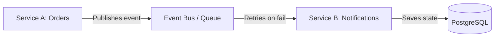
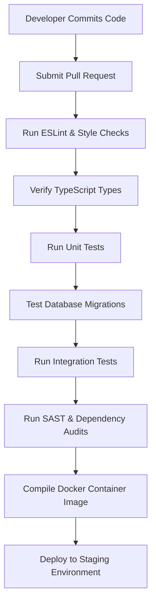

# ENTERPRISE BACKEND TESTING STRATEGY (API + MICROSERVICES + DATABASE TESTING)

**Project Name:** Enterprise SaaS Business Management Platform  
**Document Version:** 1.0.0 — Baseline Standard  
**Date:** July 13, 2026  
**Authors:** Principal Backend Architect, QA Lead & SRE Director  
**Classification:** Enterprise Internal — Unrestricted  
**Status:** 🏛️ APPROVED TESTING STANDARD  

---

## SECTION 1 — BACKEND TESTING PRINCIPLES

### 1.1 Why Backend Testing is Critical for SaaS Platforms
In a multi-tenant SaaS architecture where multiple businesses run their point-of-sale, pharmacy, accounting, and inventory operations, the backend represents the absolute source of truth for business logic and data state. Backend testing is critical to verify:
*   **Data Accuracy:** Enforcing precise tax, discount, and inventory accounting across all calculations.
*   **Business Logic Correctness:** Validating complex licensing rules, subscription triggers, and order processing workflows.
*   **Multi-Tenant Isolation:** Enforcing absolute data borders, ensuring that no tenant can read, modify, or delete another tenant's records.
*   **Security Protection:** Validating API gateways, request validation schemas, token signatures, and rate limits to block malicious traffic.
*   **API Reliability:** Protecting endpoints under high loads, preventing timeouts and database connection exhaustion.
*   **Scalability:** Assuring that application nodes scale horizontally and cache queries efficiently.

### 1.2 Testing Goals
*   **Functional Correctness:** All API endpoints return precise values and enforce domain constraints.
*   **Reliability:** The system handles failures, network delays, and bad inputs gracefully.
*   **Security:** Enforce strict access control filters (RBAC) and database-level data isolation (RLS).
*   **Performance:** Meet target processing times (sub-50ms checkouts) under peak workloads.
*   **Maintainability:** Tests are modular and well-documented, allowing teams to update code without breaking existing features.

---

## SECTION 2 — BACKEND TESTING PYRAMID

Our testing methodology relies on a high volume of fast unit and service tests, backed by targeted API and end-to-end integration tests.

```
                  E2E Testing (5%)
                         ▲
                         |
             API Integration Testing (15%)
                         ▲
                         |
           Service Integration Testing (30%)
                         ▲
                         |
                 Unit Testing (50%)
```

### 2.1 Testing Execution Matrix

| Test Layer | Execution Target | Average Run Speed | Maintenance Cost |
| :--- | :--- | :--- | :--- |
| **E2E Testing** | Complete end-to-end business workflows. | Minutes per run | High |
| **API Integration** | Validates HTTP controllers and routing rules. | Seconds per suite | Medium |
| **Service Integration** | Test service logic with mock database engines. | Milliseconds per test | Low |
| **Unit Testing** | Verifies pure math and utility calculations. | Sub-millisecond | Very Low |

---

## SECTION 3 — BACKEND UNIT TESTING STRATEGY

Unit tests verify that individual backend services and utility functions calculate values correctly, using **Jest** to mock external dependencies.

### 3.1 Test Scenarios (Order Service)
*   `createOrder()`: Verify order creation flows and validate input formats.
*   `validateStock()`: Verify inventory levels and check low-stock triggers.
*   `calculateTotal()`: Calculate items, apply tax rates, apply discount codes, and verify roundings.
*   `processPayment()`: Connect to payment gateways and record payment status.

### 3.2 Unit Test Example: Order Calculations
```typescript
import { Test } from '@nestjs/testing';
import { OrderService } from './order.service';
import { InventoryService } from '../inventory/inventory.service';

describe('OrderService - Unit Tests', () => {
  let orderService: OrderService;
  let inventoryMock: any;

  beforeEach(async () => {
    inventoryMock = {
      checkStock: jest.fn().mockResolvedValue(true),
      deductStock: jest.fn().mockResolvedValue(true),
    };

    const module = await Test.createTestingModule({
      providers: [
        OrderService,
        { provide: InventoryService, useValue: inventoryMock },
      ],
    }).compile();

    orderService = module.get<OrderService>(OrderService);
  });

  it('should compute tax and total values correctly', async () => {
    const items = [{ id: 'p1', price: 100, quantity: 2 }];
    const taxRate = 0.10; // 10%
    const total = await orderService.calculateTotal(items, taxRate);
    expect(total.subtotal).toBe(200);
    expect(total.tax).toBe(20);
    expect(total.grandTotal).toBe(220);
  });

  it('should throw exceptions if products are out of stock', async () => {
    inventoryMock.checkStock.mockResolvedValue(false);
    const items = [{ id: 'p2', price: 50, quantity: 1 }];
    
    await expect(orderService.createOrder('tenant-1', items))
      .rejects.toThrow('Product p2 is out of stock');
  });
});
```

---

## SECTION 4 — SERVICE LAYER TESTING

Service layer tests verify business workflow logic. We use **Testcontainers** to spin up lightweight databases and message queues inside Docker containers, ensuring tests validate code against real environments.

### 4.1 Mocking Strategies
*   **Database Mocking:** In unit tests, mock Prisma clients to prevent network overhead. In service integration tests, connect to isolated dockerized PostgreSQL instances.
*   **External APIs:** Intercept and mock outgoing HTTP calls (like Stripe payments) using Mock Service Worker (MSW) or Jest overrides.
*   **Caching & Queues:** Use local in-memory instances to mock Redis and message queue triggers.

---

## SECTION 5 — CONTROLLER / API TESTING

API integration tests verify routing, HTTP status responses, payload formatting, and route validation.

### 5.1 Test Validation Checklist
*   **Request Inputs:** Verify the API rejects invalid requests with `400 Bad Request` and detailed field validation alerts.
*   **Route Protection:** Access secure routes without authorization tokens, verifying they return `401 Unauthorized`.
*   **RBAC Enforcement:** Access admin routes using a cashier session token, verifying the API returns `403 Forbidden`.
*   **Payload Format:** Validate that successful routes match our standard JSON API payload layouts, including matching data schemas, correlation headers, and timestamps.

### 5.2 Controller Integration Test Example
```typescript
import { Test, TestingModule } from '@nestjs/testing';
import { INestApplication, ValidationPipe } from '@nestjs/common';
import request from 'supertest';
import { AppModule } from '../../src/app.module';

describe('Orders Controller (Integration)', () => {
  let app: INestApplication;

  beforeAll(async () => {
    const moduleFixture: TestingModule = await Test.createTestingModule({
      imports: [AppModule],
    }).compile();

    app = moduleFixture.createNestApplication();
    app.useGlobalPipes(new ValidationPipe());
    await app.init();
  });

  it('should block order creations with missing fields (400)', () => {
    return request(app.getHttpServer())
      .post('/orders')
      .set('Authorization', 'Bearer valid-user-token')
      .send({ quantity: 5 }) // Missing product ID
      .expect(400);
  });

  afterAll(async () => {
    await app.close();
  });
});
```

---

## SECTION 6 — DATABASE TESTING STRATEGY

We test database configurations to verify migrations, constraints, and data integrity.

### 6.1 Database Verification Areas
*   **Schema & Constraints:** Verify that database schema setups, unique constraints, and foreign keys enforce business rules.
*   **Migration Testing:** Run rollback and forward migration scripts in the CI database container to ensure migrations execute without errors.
*   **Transaction Consistency:** Inject delays and simulated errors mid-transaction to verify that failed multi-step database writes roll back completely.
*   **Query Performance:** Audit query execution plans on staging databases to verify index utilization and optimize slow queries.

---

## SECTION 7 — MULTI-TENANT ISOLATION TESTING

Tenant isolation is verified at both the application and database layers.

### 7.1 Security Scenarios Tested
*   **Tenant Cross-Talk Prevention:** Ensure users cannot read, edit, or delete records belonging to different tenants by modifying request parameters.
*   **Database-Level RLS Verification:** Verify that PostgreSQL Row-Level Security (RLS) policies filter queries, blocking access to data records matching other tenant IDs.

### 7.2 Multi-Tenant Test Case Specifications

| Active User Role | Action | Target Resource Owner | Expected Outcome |
| :--- | :--- | :--- | :--- |
| **Cashier (Tenant A)** | `GET /api/v1/orders/12` | Order owned by **Tenant A** | `200 OK` (Order Details) |
| **Cashier (Tenant A)** | `GET /api/v1/orders/15` | Order owned by **Tenant B** | `404 Not Found` (Blocked by RLS) |
| **Merchant Admin (Tenant A)** | `POST /api/v1/products` | Create product for **Tenant B** | `403 Forbidden` (Vetoed) |

---

## SECTION 8 — INTEGRATION WORKFLOWS

Integration tests verify data flows across multiple application modules.

### 8.1 Key Integration Workflows

#### Workflow 1: Tenant Onboarding
```
POST /auth/register ──> Create Tenant ──> Create Admin User ──> Setup Default Roles ──> Emit Notification
```
*   *Validation:* Verify that the database registers both the tenant record and the admin account within an atomic transaction, and check that default configuration settings are initialized.

#### Workflow 2: POS Checkout Sync
```
POST /orders ──> Verify Stock ──> Deduct Inventory ──> Process Stripe Payment ──> Print Invoice PDF
```
*   *Validation:* Verify that order records match payment statuses, and ensure inventory tables deduct stock levels accurately.

---

## SECTION 9 — EVENT-DRIVEN TESTING

Our services use asynchronous message queues (Redis/Kafka) to decouple background workflows.



### 9.1 Verification Scenarios
*   **Publish Validation:** Verify that service transactions publish formatted event payloads to message queues.
*   **Consume Validation:** Verify that consumer services parse events, update database states, and handle duplicate messages safely (idempotency).
*   **Queue Failure Handling:** Verify that failed consumer services trigger retry cycles and route unprocessable messages to Dead Letter Queues (DLQ) after limit failures.

---

## SECTION 10 — API CONTRACT TESTING

We use API contract tests to prevent frontend and backend code updates from introducing breaking changes.
*   **Tooling:** Pact (for contract testing) and OpenAPI/Swagger specifications.
*   **Validation:** Verify that API controllers accept and return payloads matching OpenAPI schemas, and ensure minor version updates maintain backwards compatibility.

---

## SECTION 11 — PERFORMANCE TESTING

We run performance tests to verify system speed and resource usage under simulated load conditions.
*   **KPI Metrics:** Monitor endpoint latency (P95/P99), database connection usage, CPU load, and memory limits.
*   **Tooling:** **k6** and **Artillery**.

---

## SECTION 12 — LOAD TESTING SCENARIOS

Our load testing pipeline executes three validation scenarios:

```
[ NORMAL LOAD ] ───────────────> [ HIGH LOAD ] ───────────────> [ STRESS TEST ]
* 1,000 Concurrent Users        * 10,000 Concurrent Users      * 50,000+ Users
* Target: Latency <= 50ms       * Target: Latency <= 150ms     * Target: Graceful error modes
```

*   **Normal Load:** Simulates 1,000 concurrent user sessions to verify baseline performance budgets.
*   **High Load:** Simulates 10,000 concurrent user sessions to verify system scaling rules.
*   **Stress Testing:** Increases load until components fail, verifying that the system degrades gracefully without losing data.

---

## SECTION 13 — BACKEND SECURITY TESTING

We verify backend security using static scanners and dynamic penetration tests.
*   **Authentication & Session Management:** Verify JWT validation limits, check blacklist checks in Redis, and ensure secure password hashing.
*   **Input Protection:** Inject malicious scripts and SQL commands into API routes to verify input validation filters.
*   **Rate Limiting:** Verify that the API gateway blocks IP addresses exceeding request limits.

---

## SECTION 14 — TEST ENVIRONMENT STRATEGY

We define and configure testing environments to isolate data states.
*   **Local (Developer PC):** Runs Go APIs, Next.js apps, Redis, and PostgreSQL databases locally using Docker Compose.
*   **CI Pipeline (GitHub Actions):** Runs test cases inside isolated Docker containers, using seeded test databases for validation.
*   **Staging Environment:** AWS ECS Fargate and RDS setups running obfuscated production databases to validate query performance.

---

## SECTION 15 — CI/CD BACKEND TEST PIPELINE

Every commit submitted to the repository must pass all automated validation gates.



---

## SECTION 16 — QUALITY GATES

Merging changes to `main` is blocked if any of the following gates fail:

1.  **Code Compilation:** Lint checks and TypeScript compilers must build without syntax errors.
2.  **Test Coverage:** Maintain statement coverage $\ge 80\%$ on all backend projects.
3.  **Critical Endpoints:** 100% pass rate on checkout and payment transaction integration tests.
4.  **Database Status:** Migrations must execute and rollback successfully.
5.  **Security Scans:** NPM audit and Snyk scans must return zero critical vulnerability alerts.

---

## SECTION 17 — ENTERPRISE QA WORKFLOW

We follow a structured validation workflow to coordinate changes across engineering and QA teams:

```
[ Developer ] ──> [ Automated Checks ] ──> [ Code Review ] ──> [ Security & Load Checks ] ──> [ Release ]
```

1.  **Code Verification:** The developer writes code, verifies changes locally, and submits a PR.
2.  **Pipeline Automation:** Automated CI workflows execute unit tests and compile checks.
3.  **Review Checklists:** Tech leads conduct code reviews, checking RLS configurations and transaction blocks.
4.  **QA Validation:** QA engineers run regression and security tests in the staging environment.
5.  **Release Approval:** The Release Board approves production deployment after all validation gates pass.

---

## SECTION 18 — BACKEND TEST TOOL STACK

Our standardized backend testing tools are detailed in the table below:

| Category | Tool | Purpose |
| :--- | :--- | :--- |
| **Unit Testing** | **Jest** | Executes backend unit tests. |
| **API Integration**| **Supertest** | Validates HTTP controllers and routing rules. |
| **API Workflows** | **Postman / Newman** | Runs end-to-end API validations. |
| **DB Integration** | **Prisma Test Environment** | Validates database queries and schema updates. |
| **Container Mocks** | **Testcontainers** | Spins up temporary database containers for integration tests. |
| **Contract Checks**| **Pact** | Validates API contracts between frontend and backend. |
| **Performance** | **k6** | Simulates concurrent checkouts and measures API latency. |
| **Security Auditing**| **OWASP ZAP** | Scans application packages for vulnerabilities. |
| **CI Runner** | **GitHub Actions** | Orchestrates build, test, and deployment steps. |

---

## SECTION 19 — FINAL BACKEND TESTING ARCHITECTURE

The *Enterprise Backend Testing Architecture* integrates code validation across four distinct layers to ensure platform reliability:

### 19.1 Testing Layers
```
[ DEVELOPMENT LINT ] ──> [ UNIT/INTEGRATION CHECKS ] ──> [ API CONTROLLER TESTS ] ──> [ PRODUCTION DEPLOY ]
* ESLint Standards        * Jest Unit Checks           * Supertest Routings        * Smoke Test Checks
* TS Compiler Checks     * Prisma DB Mocks            * Postman Collections       * PagerDuty Metrics
```

### 19.2 CI/CD Pipeline
```
[ Commit PR ] ──> [ Lint Check ] ──> [ Unit Test ] ──> [ Migration Test ] ──> [ Integration Test ] ──> [ Deploy Staging ]
```

### 19.3 Quality Gate Process
```
[ Coverage >= 80% ] ──> [ RLS Policy Asserted ] ──> [ Zero High Vulnerabilities ] ──> [ Build Successful ] ──> [ Release ]
```

---

*End of Enterprise Backend Testing Strategy Document*  
*Document maintained by: Principal Backend Architect | Status: Approved Standard*
