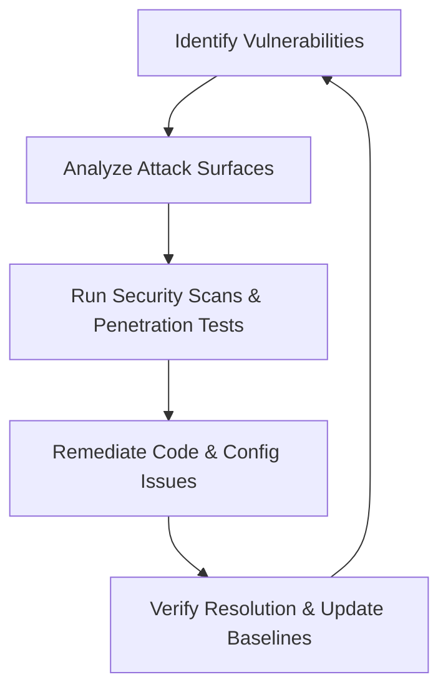
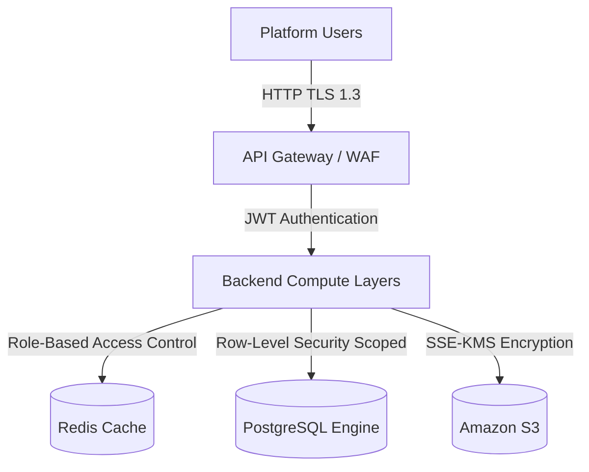
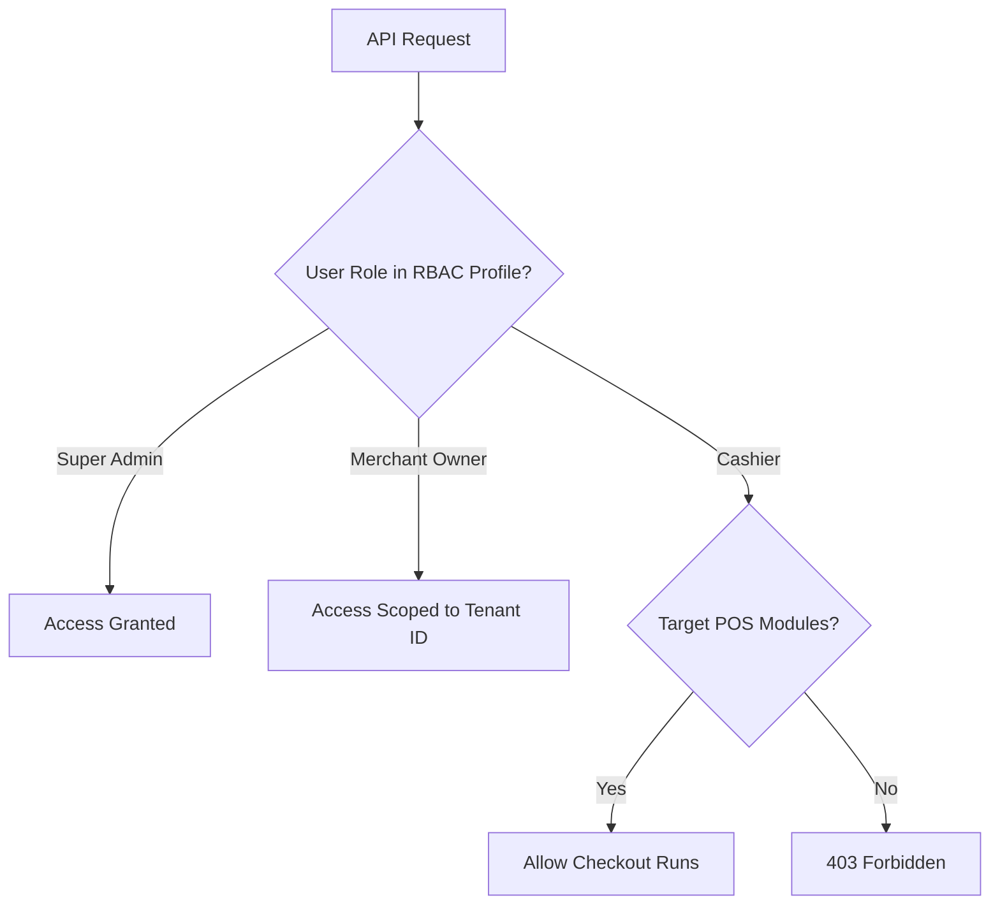
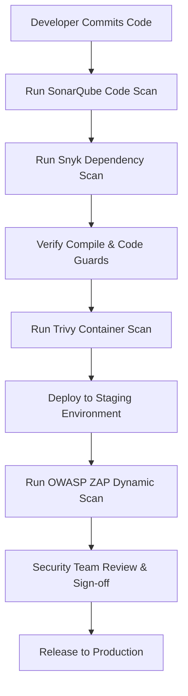
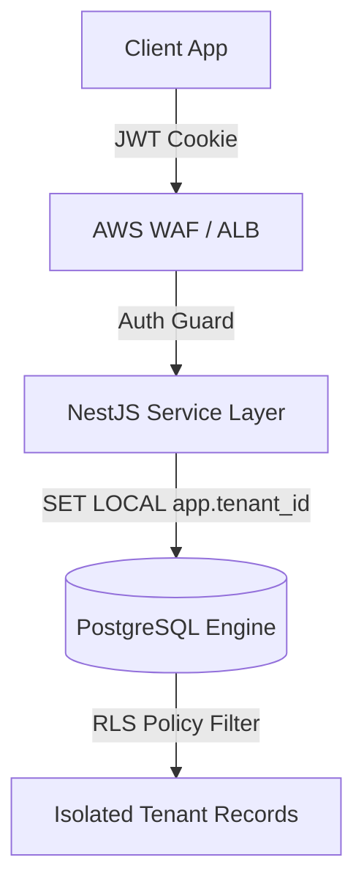

# ENTERPRISE SECURITY TESTING STRATEGY (APPLICATION & MULTI-TENANT SECURITY)

**Project Name:** Enterprise SaaS Business Management Platform  
**Document Version:** 1.0.0 — Baseline Standard  
**Date:** July 13, 2026  
**Authors:** Chief Information Security Officer (CISO), Application Security Architect & DevSecOps Lead  
**Classification:** Enterprise Internal — Unrestricted  
**Status:** 🏛️ APPROVED TESTING STANDARD  

---

## SECTION 1 — SECURITY TESTING PRINCIPLES

### 1.1 Why Security Testing is Critical for SaaS
In a multi-tenant cloud environment where multiple businesses run their POS checkout, inventory, and accounting ledger datasets on shared compute and database infrastructure, a security failure can lead to catastrophic data leaks, compliance penalties, and loss of business trust.
*   **Protect Customer Data:** Prevent unauthorized disclosure of customer records and sales transactions.
*   **Prevent Unauthorized Access:** Ensure credentials and session states cannot be bypassed.
*   **Maintain Customer Trust:** Demonstrate strong data boundaries to protect customer brands.
*   **Prevent Financial Loss:** Secure checkout API paths and integrations (Stripe, Bakong) against payment fraud.
*   **Protect Business Operations:** Prevent service disruptions from denial-of-service (DDoS) attacks.

### 1.2 Security Goals (CIA Triad)
*   **Confidentiality:** Enforce strict data isolation, ensuring only authorized user accounts access tenant records.
*   **Integrity:** Ensure financial ledgers, audit logs, and transaction tables are protected from tampering.
*   **Availability:** Configure WAF and rate limit rules to protect system access.

### 1.3 Security Testing Lifecycle
Security validation is integrated directly into the development cycle:



---

## SECTION 2 — SAAS SECURITY ARCHITECTURE MODEL

Security controls are configured at every layer of the platform's infrastructure.



### 2.1 Layer Security Controls
*   **Authentication Layer:** Verifies user identities using short-lived JWT access tokens and single-use refresh token rotation.
*   **Authorization Layer:** Enforces access limits using Role-Based Access Control (RBAC) middleware checks.
*   **Tenant Isolation Layer:** PostgreSQL Row-Level Security (RLS) policies isolate queries at the database engine layer.
*   **Encryption Layer:** Enforces TLS 1.3 for data in transit and AES-256 (KMS keys) for databases and backups.
*   **Audit Layer:** Modifiers, system alterations, and security logs are recorded in immutable, WORM-compliant AWS S3 storage.

---

## SECTION 3 — THREAT MODELING (STRIDE)

We use the **STRIDE** model to identify threats and define mitigation strategies for the platform.

### 3.1 STRIDE Threat Register

| STRIDE Category | Identified Threat Scenario | System Risk | Core Mitigation Strategy |
| :--- | :--- | :--- | :--- |
| **Spoofing** | Session token hijacking or API parameter modification. | Unauthorized account access. | Enforce short token lifespans (15 min) and restrict cookie access to `httpOnly` and `secure`. |
| **Tampering** | Man-in-the-Middle alterations to checkout payment fields. | Financial checkout fraud. | Terminate TLS 1.3 at the ALB and verify transaction signatures using HMAC validation. |
| **Repudiation** | An employee modifies stock levels and denies doing so. | Untraceable inventory loss. | Write all user actions, change metrics, and timestamps to WORM-compliant audit logs. |
| **Information Disclosure**| Users view other tenants' catalogs or sales logs. | Data leakage. | Enforce row-level isolation (RLS) at the database layer using validated tenant IDs. |
| **Denial of Service** | Botnets flood APIs with checkout requests. | System outages. | Deploy AWS WAF rate-limiting rules (max 100 req/5 min/IP). |
| **Elevation of Privilege**| Cashiers call administrative API endpoints directly. | Unauthorized settings modifications. | Verify user permissions in the API gateway using RBAC middleware guards. |

---

## SECTION 4 — OWASP TOP 10 SECURITY TESTING

We run weekly automated checks to scan code for the OWASP Top 10 vulnerabilities.

### 4.1 OWASP Validation Matrix

*   **Broken Access Control:**
    *   *Testing Focus:* Attempt to bypass API route guards, access other tenants' resources, or call administrative endpoints using cashier privileges.
    *   *Tools:* Burp Suite, OWASP ZAP.
*   **Cryptographic Failures:**
    *   *Testing Focus:* Verify that database fields (such as password hashes) utilize bcrypt, data is encrypted, and SSL handshakes enforce TLS 1.3.
*   **Injection:**
    *   *Testing Focus:* Inject SQL and script inputs (`' OR 1=1 --`, `<script>`) to verify input validation filters.
*   **Insecure Design:**
    *   *Testing Focus:* Validate business logic bounds, verifying that inputting negative prices during checkouts triggers validation errors.
*   **Security Misconfiguration:**
    *   *Testing Focus:* Check HTTP response headers for security controls (`Content-Security-Policy`, `X-Frame-Options`, `Strict-Transport-Security`).
*   **Vulnerable Components:**
    *   *Testing Focus:* Scan backend packages for known vulnerabilities in CI pipelines.
    *   *Tools:* Snyk, npm audit.
*   **Authentication Failures:**
    *   *Testing Focus:* Test authentication routes with dictionary inputs to verify rate limits and account lockouts.
*   **Software and Data Integrity Failures:**
    *   *Testing Focus:* Secure build pipelines, signing Docker container images and using OIDC tokens to authorize deployments.
*   **Security Logging and Monitoring Failures:**
    *   *Testing Focus:* Audit logging configurations to verify security events, failed logins, and database alterations are recorded.
*   **Server-Side Request Forgery (SSRF):**
    *   *Testing Focus:* Inject internal IP ranges and loopback requests into outbound integrations, verifying that the gateway blocks requests targeting internal assets.

---

## SECTION 5 — AUTHENTICATION SECURITY TESTING

We verify that registration, login, and token rotation pipelines protect user access keys.
*   **Registration Verification:** Verify that registration inputs enforce password complexity rules (minimum 8 characters, numbers, uppercase, special characters) and require email confirmation.
*   **Rate Limiting & Lockouts:** Attempt brute force logins on the auth API, verifying the system triggers rate limits and locks accounts after 5 consecutive failures.
*   **JWT Security:** Test token expiration constraints, single-use refresh token rotation, and invalid headers.

---

## SECTION 6 — AUTHORIZATION SECURITY TESTING (RBAC)

We test role mappings to ensure that API routes restrict actions to authorized user roles.



### 6.1 Authorization Verification Matrices

| Account Role | API Endpoint | HTTP Method | Expected Outcome |
| :--- | :--- | :--- | :--- |
| **Super Admin** | `/api/v1/tenants` | GET | `200 OK` (All records) |
| **Merchant Owner** | `/api/v1/employees` | POST | `201 Created` (Employee added) |
| **Cashier** | `/api/v1/orders` | POST | `201 Created` (Transaction completed) |
| **Cashier** | `/api/v1/reports/revenue`| GET | `403 Forbidden` (Blocked) |
| **Customer** | `/api/v1/orders` | GET | `403 Forbidden` (Access Denied) |

---

## SECTION 7 — MULTI-TENANT SECURITY TESTING

We run automated security tests to ensure tenant data boundaries are maintained.
*   **Subdomain Checks:** Verify that requests containing host headers for `tenant-b` are blocked when using tokens generated for `tenant-a`.
*   **Database Isolation Tests:** Run database queries with tenant contexts disabled, verifying that default RLS policies block reads.
*   **Cache & Storage Isolation:** Check that Redis keys and AWS S3 folders use prefix rules (`tenant_id/`) to isolate data.

---

## SECTION 8 — API SECURITY TESTING

*   **Input Sanitation:** Check that inputs are sanitized to prevent scripting exploits. Enforce Class Validator checks on DTO routes to restrict payloads.
*   **Flood Prevention:** Send high volumes of requests using **k6** to verify that WAF rate limit rules block IPs.
*   **Header Auditing:** Verify that API headers enforce Helmet defaults, secure CORS constraints, and Strict-Transport-Security.

---

## SECTION 9 — CLIENT-SIDE SECURITY TESTING

*   **Web Portal (Next.js):** Verify that access tokens are stored in secure cookies configured with `httpOnly`, `secure`, and `sameSite` flags.
*   **Mobile App (React Native):** Verify that mobile clients store session variables in secure system vaults (Keychain on iOS, Keystore on Android). Enable certificate pinning to protect mobile communications.

---

## SECTION 10 — SERVER-SIDE SECURITY TESTING

*   **NestJS Guards:** Verify that endpoints enforce AuthGuards, requiring valid tokens before routing requests.
*   **Database Protections:** Test inputs with SQL characters to verify that Prisma queries prevent injection exploits. Ensure database users run with least-privilege permissions.

---

## SECTION 11 — INFRASTRUCTURE SECURITY TESTING

We verify infrastructure security settings to identify system vulnerabilities.
*   **Host Security:** Scan SSH access limits, verify firewall configurations, and close unused ports on hosts.
*   **Docker Container Security:** Scan base images for vulnerabilities and verify that containers run without root privileges:
    ```bash
    trivy image myapp:latest
    ```
*   **Kubernetes Security:** Verify EKS RBAC configurations, check network policies, and ensure secrets are encrypted at rest using KMS.

---

## SECTION 12 — PENETRATION TESTING STRATEGY

We run penetration tests against staging and production systems before releases:
1.  **Black Box Testing:** Simulates external attacks with no prior knowledge of platform internals.
2.  **Gray Box Testing:** Simulates attacks with standard user credentials, verifying that users cannot access other tenants' data.
3.  **White Box Testing:** Code-level security reviews checking RLS policies, access controls, and dependencies.

---

## SECTION 13 — SECURITY TESTING TOOL STACK

Our standardized security testing tools are detailed in the table below:

| Category | Tool | Purpose |
| :--- | :--- | :--- |
| **DAST Scanning** | **OWASP ZAP** | Runs dynamic vulnerability scans against running environments. |
| **Penetration Testing**| **Burp Suite** | Manual intercepting proxy for routing and session checks. |
| **Port Scanning** | **Nmap** | Scans host servers for open ports and vulnerable services. |
| **Container Security** | **Trivy** | Scans Docker images for OS and dependency vulnerabilities. |
| **SAST Code Scanning** | **Snyk / SonarQube** | Analyzes code repositories for vulnerabilities and code smells. |
| **Dependency Audits** | **npm audit** | Checks for vulnerabilities in package dependencies. |
| **Vulnerability Audit**| **OpenVAS** | Scans operating systems for vulnerabilities. |

---

## SECTION 14 — SECURITY CI/CD PIPELINE

Our CI/CD pipeline runs automated security checks on every code commit.



---

## SECTION 15 — VULNERABILITY MANAGEMENT

Vulnerabilities are prioritized and resolved based on their severity.

```
                  [ VULNERABILITY DISCOVERED ]
                               │
            ┌──────────────────┴──────────────────┐
            ▼                                     ▼
   [ CRITICAL / HIGH ]                    [ MEDIUM / LOW ]
   * SLA: Re-verify & Fix within 48h      * SLA: Resolve within 30-90 days
   * Hotfix release pipeline              * Add to next development sprint
```

*   **Critical (SLA: 48 Hours):** RLS bypasses, raw SQL injections, or unauthenticated admin access.
*   **High (SLA: 5 Days):** Missing rate limits, weak token rotation rules, or known vulnerabilities in dependencies.
*   **Medium (SLA: 30 Days):** Missing security headers or outdated library versions.
*   **Low (SLA: 90 Days):** Code style warnings or verbose log outputs.

---

## SECTION 16 — SECURITY COMPLIANCE

The platform is designed to align with industry compliance standards:
*   **OWASP ASVS Level 2:** Baseline standards for all authentication, data isolation, and input validations.
*   **ISO 27001:** Enforces asset management rules, security controls, and incident response playbooks.
*   **SOC 2 Type II:** Independent audit verification of platform security, availability, and processing integrity.
*   **GDPR Principles:** Enforces user data deletion (right to be forgotten) and customer data encryption.

---

## SECTION 17 — FINAL SECURITY MERMAID DIAGRAMS

### 17.1 SaaS Security Architecture


### 17.2 Security Testing Lifecycle
```
[ Identify Surface ] ──> [ Static SAST Scan ] ──> [ Dynamic DAST Audit ] ──> [ Remediation Hotfix ] ──> [ Verify Release ]
```

### 17.3 Security CI/CD Pipeline
```
[ Commit PR ] ──> [ SonarQube Scan ] ──> [ Snyk Audit ] ──> [ Trivy Container Scan ] ──> [ ZAP Staging DAST ] ──> [ Deploy ]
```

---

*End of Enterprise Security Testing Strategy Document*  
*Document maintained by: Chief Information Security Officer | Status: Approved Standard*
