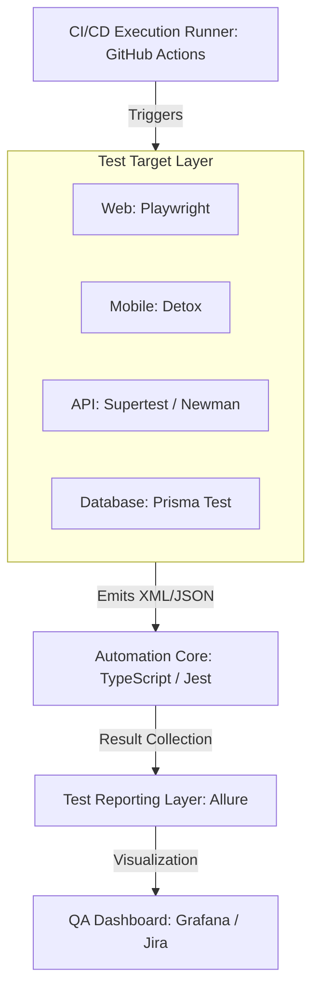
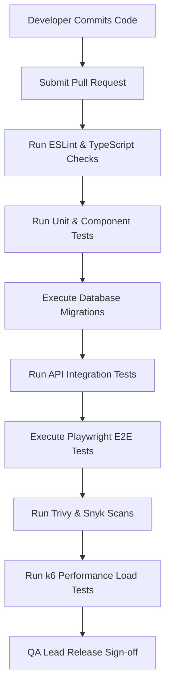

# ENTERPRISE QA AUTOMATION FRAMEWORK & TEST MANAGEMENT STRATEGY

**Project Name:** Enterprise SaaS Business Management Platform  
**Document Version:** 1.0.0 — Baseline Standard  
**Date:** July 13, 2026  
**Authors:** Principal QA Architect, Test Automation Lead & Enterprise Quality Consultant  
**Classification:** Enterprise Internal — Unrestricted  
**Status:** 🏛️ APPROVED QUALITY STANDARD  

---

## SECTION 1 — QA AUTOMATION PRINCIPLES

### 1.1 Why Automation is Important for SaaS
In a multi-tenant cloud platform featuring rapid feature deployment cycles and a modular codebase, manual validation cannot scale. Automated testing is essential to support the platform's execution speed:
*   **Frequent Releases:** Enables multiple daily deployments to staging and production environments with low regression risk.
*   **Multiple Business Modules:** Validates integrations across different business modules (POS, Inventory, Billing, HRM) simultaneously.
*   **Multi-Platform Support:** Validates user experiences across responsive web portals and tablet POS applications.
*   **Reduce Manual Testing Effort:** Frees up QA engineers to focus on exploratory testing and edge-case security checks.
*   **Improve Deployment Confidence:** Ensures that core checkouts, payment processing, and tenant isolation policies remain stable after minor patches.

### 1.2 Automation Goals
```
SPEED (CI Feedback <= 5m) ──> ACCURACY (Zero Flaky Tests) ──> REPEATABILITY (Idempotent Runs) ──> SCALABILITY (Multi-Agent Runs)
```

---

## SECTION 2 — TEST AUTOMATION ARCHITECTURE

Our quality assurance pipeline coordinates test executions from developer machines and CI runners, routing results to centralized reporting dashboards.



### 2.1 Layer Specifications
*   **QA Dashboard:** Centralizes metrics for test pass rates, code coverage trends, regression durations, and bug trackers (Jira/TestRail).
*   **Test Reporting Layer:** Converts execution outputs into human-readable reports, including error traces and browser screenshots.
*   **Automation Framework:** Written in TypeScript, implementing Page Object Models (POM), fixture generation, API clients, and database cleanups.
*   **Target Drivers:** Automated drivers (Playwright, Detox, Supertest, Prisma) that interact with browser containers, mobile simulators, API endpoints, and database engines.
*   **CI/CD Pipeline:** The orchestrator that executes test jobs, provisions database containers, manages feature flags, and blocks deployments on failures.

---

## SECTION 3 — AUTOMATION FRAMEWORK DESIGN

We build our automation project within a structured directory layout in the monorepo, keeping test scripts separated from helper logic.

### 3.1 Framework Directory Layout
```
/tests
├── api/                    # API route test files (REST, webhooks)
├── database/               # Database validation tests (RLS checks, indexes)
├── mobile/                 # React Native Detox end-to-end scripts
├── performance/            # k6 and Artillery performance scenarios
├── security/               # OWASP ZAP configurations and SAST rules
├── web/                    # Next.js Playwright test scripts
└── framework/              # Shared automation helper packages
    ├── config/             # Environment configs and timeouts
    ├── helpers/            # Local storage, date, and math helpers
    ├── fixtures/           # Mock data and product datasets
    └── reporters/          # Custom Allure and JUnit reporters
```

### 3.2 Key Framework Patterns
*   **Reusable Components:** Web and mobile tests use shared Page Object Models (POM) to isolate UI changes from test logic.
*   **Unified Configs:** Standardize browser viewports, mobile hardware targets, and network timeouts within `/framework/config/`.
*   **Environment Handling:** Environment variables dynamically adjust test targets to run against local developer configurations or staging containers.

---

## SECTION 4 — WEB TEST AUTOMATION

We automate web tests to verify administration features, user onboarding, and point-of-sale checkouts.

### 4.1 Web Automation Areas
*   **Authentication:** Verify login redirects, password complexity validation, and token rotation workflows.
*   **POS Cart:** Product lookups, quantity additions, taxes, discount codes, checkout submissions, and receipt printing.
*   **Inventory:** Product creation, batch and expiry definitions, and low-stock alerts.
*   **Reporting:** Sales data generation, daily reconciliation runs, and P&L exports.

### 4.2 Playwright Test Example: Checkout Flow
```typescript
import { test, expect } from '@playwright/test';
import { LoginPage } from '../framework/pages/LoginPage';
import { PosPage } from '../framework/pages/PosPage';

test.describe('Web POS Checkout Journey', () => {
  test('should complete a cashier checkout transaction successfully', async ({ page }) => {
    const login = new LoginPage(page);
    const pos = new PosPage(page);

    await login.navigate();
    await login.performLogin('cashier@test.com', 'pin-1234');

    await pos.addProductToCart('Espresso');
    await pos.addProductToCart('Croissant');
    
    await pos.applyDiscount('VAT-EXEMPT');
    await expect(pos.cartTotal).toHaveText('$5.50');

    await pos.submitPayment('Cash');
    await expect(pos.receiptModal).toBeVisible();
    await expect(pos.receiptText).toContainText('Espresso');
  });
});
```

---

## SECTION 5 — MOBILE TEST AUTOMATION

We automate mobile tests using **Detox** to verify tablet POS features.
*   **Offline Operation:** Verify cash checkouts queue transactions locally when offline and sync data once online.
*   **Hardware Triggers:** Simulate scanner inputs to verify barcode catalog matches.
*   **Device Profiles:** Execute mobile tests against simulated Android and iOS tablets with varying screen viewports.

---

## SECTION 6 — API TEST AUTOMATION

API automation tests verify routing, status codes, and business logic validations.
*   **API Verification Targets:** Validate routes for authentication, user directories, tenant registration, catalog items, and payments.
*   **Schema Checking:** Verify response JSON schemas using AJV or Jest matchers.
*   **Error Handling:** Ensure routes return correct status responses (`400 Bad Request`, `401 Unauthorized`, `403 Forbidden`) on invalid requests.

---

## SECTION 7 — DATABASE TEST AUTOMATION

We run database tests to verify database migrations, constraints, and tenant isolation rules.
*   **RLS Isolations:** Verify that PostgreSQL RLS blocks cross-tenant reads or writes.
*   **Constraint Checking:** Verify that unique database indexes, foreign keys, and values are validated.
*   **Schema Sync:** Run Prisma validation scripts in the CI pipeline to verify that database states match the latest schema code.

---

## SECTION 8 — TEST DATA MANAGEMENT STRATEGY

We manage test data states using isolated test accounts, seed scripts, and factory helpers.
*   **Dynamic Data Seeding:** Setup staging and local databases before test runs using Prisma seed data.
*   **Faker.js Generation:** Generate mock names, barcodes, product profiles, and addresses dynamically.
*   **Environment Cleanups:** Execute script-based database resets after integration test suites complete to clear old records.

---

## SECTION 9 — REGRESSION TESTING STRATEGY

Our regression testing pipeline runs checks at three levels:

```
[ SMOKE TESTS (5m) ] ──> [ CRITICAL PATH (20m) ] ──> [ FULL REGRESSION (1h) ]
* Run on every PR commit   * Run before staging merge  * Run before production deploy
* Core login & checkout    * Full onboarding & billing * Every module & security scan
```

---

## SECTION 10 — TEST CASE MANAGEMENT

Test cases are version-controlled alongside application code.
*   **Traceability:** Tag test cases with requirements IDs to track coverage in our Jira/TestRail dashboards.
*   **Standard Fields:** Ensure tests document:
    `ID | Title | Priority | Test Preconditions | Action Steps | Expected Outcomes | Status`

---

## SECTION 11 — AUTOMATED TEST REPORTING

We compile test results into centralized dashboards to track release quality:

```
Test Runner Execution ──> Emit JSON/JUnit XML ──> Allure Report Generator ──> Grafana Dashboard
```

*   **Failure Analysis:** Allure logs capture failure traces, error responses, console outputs, and browser screenshots.
*   **KPI Visualization:** Grafana dashboards track trend metrics including test execution durations, code coverage, flaky tests, and pass/fail ratios.

---

## SECTION 12 — PERFORMANCE TEST AUTOMATION

*   **API Benchmarks:** Run automated **k6** scripts on staging environments to verify endpoint response times.
*   **Pipeline Warnings:** Configure pipelines to raise warnings when P99 checkout latency exceeds the 50ms SLA target.

---

## SECTION 13 — SECURITY TEST AUTOMATION

*   **SAST Code Scans:** Scan repositories for security vulnerabilities and code smells on every commit using SonarQube.
*   **Dependency Audits:** Run weekly automated Snyk and npm audit scans to identify vulnerable library dependencies.
*   **Container Scans:** Scan Docker base images using Trivy before deploying new container versions to staging.

---

## SECTION 14 — CI/CD QUALITY PIPELINE



---

## SECTION 15 — QA ENVIRONMENT STRATEGY

*   **Local VM Environment:** Docker Compose spins up backend endpoints, client applications, and mock databases locally.
*   **Staging Environment:** Mirrors production setups. Features include Multi-AZ databases populated with obfuscated production data.
*   **Feature Flag Controls:** Use feature flags to isolate in-development code from production environments, allowing us to safely test features in live environments.

---

## SECTION 16 — QUALITY METRICS & KPIs

We monitor quality metrics to evaluate release stability and identify process improvements:

*   **Automation Coverage:** Target statement coverage $\ge 80\%$.
*   **Test Pass Rate:** Maintain a pass rate $\ge 99.5\%$ in release pipelines.
*   **Defect Density:** Keep defect density $\le 0.1$ critical bugs per 1,000 lines of code.
*   **Regression Time:** Complete regression testing in under 30 minutes.
*   **Release Stability:** Target zero SEV-1 production incidents post-release.
*   **Mean Time to Detect (MTTD):** Identify errors and outages within 5 minutes.
*   **Mean Time to Repair (MTTR):** Revert traffic or deploy hotfixes within 15 minutes.

---

## SECTION 17 — ENTERPRISE QUALITY GOVERNANCE

*   **Requirements Reviews:** Product owners, developers, and QA leads review requirements before writing code.
*   **Sign-off Workflow:** Releases require approval from the QA Lead, Security Lead, and Product Owner.
*   **Blameless SRE Audits:** SRE teams conduct post-incident reviews for all production outages to update test coverage rules.

---

## SECTION 18 — QA TOOL STACK REFERENCE

Our standardized QA testing tools are detailed in the table below:

| Category | Selected Tool | Purpose |
| :--- | :--- | :--- |
| **Unit Testing** | **Jest / Vitest** | Executes fast unit and module checks. |
| **Component Testing**| **React Testing Library** | In-process component rendering checks. |
| **Web E2E Testing** | **Playwright** | Browser automation and user journey tests. |
| **Mobile E2E Testing**| **Detox** | Simulates native iOS and Android checkouts. |
| **API Integration** | **Supertest / Newman** | Verifies API controllers and JSON responses. |
| **DB Integration** | **Prisma Test Environment** | Validates database queries and migrations. |
| **Performance** | **k6** | Simulates concurrent checkouts and measures API latency. |
| **Security Auditing**| **OWASP ZAP** | Scans application packages for vulnerabilities. |
| **Static Code Scans** | **SonarQube** | Analyzes code repositories for vulnerabilities and code smells. |
| **CI Runner** | **GitHub Actions** | Orchestrates build, test, and deployment steps. |

---

## SECTION 19 — FINAL QA AUTOMATION ARCHITECTURE

### 19.1 Testing Layers
```
[ DEVELOPMENT LINT ] ──> [ UNIT/COMPONENT CHECKS ] ──> [ INTEGRATION TESTING ] ──> [ STAGING SMOKE/E2E ]
* ESLint Rules           * Vitest Unit Tests          * Supertest API runs        * Playwright Browser runs
* TS Compilers           * RTL Component checks       * Prisma DB Migrations      * axe Accessibility audits
```

### 19.2 CI/CD Pipeline
```
[ Commit PR ] ──> [ Lint Check ] ──> [ Unit Test ] ──> [ Migration Test ] ──> [ Integration Test ] ──> [ Deploy Staging ]
```

### 19.3 Quality Gate Process
```
[ Coverage >= 80% ] ──> [ RLS Policy Asserted ] ──> [ Zero High Vulnerabilities ] ──> [ Build Successful ] ──> [ Release ]
```

---

*End of Enterprise QA Automation Framework & Test Management Strategy*  
*Document maintained by: Principal QA Architect | Status: Approved Standard*
