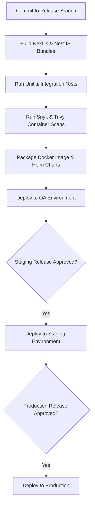
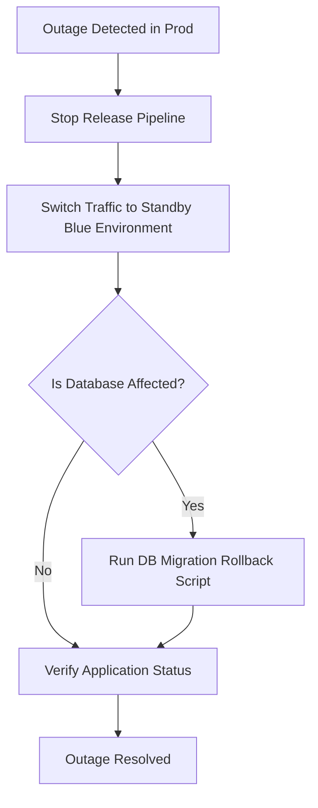

# ENTERPRISE RELEASE MANAGEMENT & DEPLOYMENT VALIDATION STRATEGY

**Project Name:** Enterprise SaaS Business Management Platform  
**Document Version:** 1.0.0 — Baseline Standard  
**Date:** July 13, 2026  
**Authors:** Principal DevOps Architect, Release Engineering Lead & Platform Architect  
**Classification:** Enterprise Internal — Unrestricted  
**Status:** 🏛️ APPROVED DELIVERY STANDARD  

---

## SECTION 1 — RELEASE MANAGEMENT PRINCIPLES

### 1.1 Why Release Management is Critical for SaaS
In a multi-tenant cloud SaaS platform where client businesses run daily checkouts, stock management, and financial ledgers, release updates must be delivered continuously without interrupting operations. 
*   **Continuous Feature Delivery:** Ships business enhancements and patches to clients without platform downtimes.
*   **Customer Stability:** Isolates internal refactoring changes to prevent database blocks and API delays.
*   **Risk Reduction:** Limits change scopes to simplify debugging and ensure reliable rollbacks.
*   **Faster Recovery:** Establishes pre-defined procedures to restore service quickly if post-release errors occur.
*   **Controlled Deployment:** Controls feature rollouts using validation checkpoints and phased migrations.

### 1.2 Release Goals
```
QUALITY (Zero SEV-1 Escapes) ──> SAFETY (Automated Rollbacks) ──> SPEED (Daily Releases) ──> RELIABILITY (99.9% Uptime)
```

---

## SECTION 2 — SOFTWARE RELEASE LIFECYCLE

The platform follows a structured release pipeline to ensure quality and control risks.

```
Idea ──> Requirement ──> Development ──> Testing ──> Staging ──> Approval ──> Production ──> Monitor ──> Review
```

### 2.1 Lifecycle Stage Definitions
1.  **Idea:** Business requirements are proposed to address merchant needs.
2.  **Requirement:** Teams write functional specs and define regression scenarios.
3.  **Development:** Engineers write code in feature branches and run local test suites.
4.  **Testing:** CI runners perform lint checks, unit tests, and integration tests on pull requests.
5.  **Staging:** Merged pull requests deploy to a staging environment to simulate production workloads.
6.  **Release Approval:** Product owners, security architects, and QA leads sign off on release metrics.
7.  **Production Deployment:** Deploy changes to production using Blue/Green or Canary release patterns.
8.  **Monitoring:** Monitor real-time performance logs, error rates, and API latency budgets.
9.  **Review:** Conduct post-release retrospectives to update test suites and improve deployment pipelines.

---

## SECTION 3 — VERSION MANAGEMENT STRATEGY

We use **Semantic Versioning (SemVer) 2.0.0** to manage platform versions.

```
MAJOR . MINOR . PATCH (e.g., 2.5.1)
  │       │       │
  │       │       └── PATCH: Bug fixes and security patches (backwards-compatible)
  │       └────────── MINOR: New features and API extensions (backwards-compatible)
  └────────────────── MAJOR: Breaking changes, major refactors, or schema changes
```

### 3.1 Version Boundaries
*   **Backend APIs:** Expose versions in URLs (e.g., `/api/v1/`) and verify compatibility to prevent breaking changes for mobile clients.
*   **Frontend Apps:** Increment minor and patch numbers on every deployment.
*   **Mobile Apps:** Maintain matching version numbers on the Google Play Store and Apple App Store, and use feature flags to coordinate features with backend releases.

---

## SECTION 4 — GIT BRANCHING STRATEGY

We use a modified Git Flow model to organize code development, reviews, and hotfixes.


### 4.1 Git Branch Controls
*   **Feature Development:** Code changes are developed in branches named `feature/JIRA-ID-description`.
*   **Code Review:** Merging features into the `develop` branch requires a pull request and approvals from two senior engineers.
*   **Release Branches:** Before deployment, release candidates are packaged in branches named `release/vX.Y.Z` for final staging tests.
*   **Production Deployment:** Release branches are merged into the `main` branch, deployed to production, and tagged (e.g., `v1.1.0`).
*   **Hotfixes:** Critical production bugs are resolved in branches named `hotfix/vX.Y.Z-description` branched directly from `main`.

---

## SECTION 5 — ENVIRONMENT PROMOTION STRATEGY

We isolate environments to ensure code is validated before reaching production.

```
[ DEV ENVIRONMENT ] ──> [ QA ENVIRONMENT ] ──> [ STAGING ENVIRONMENT ] ──> [ PRODUCTION ]
* Local Docker runs     * Auto-deployed PRs    * Pre-production testing    * Live systems
* Mock databases        * Automated testing    * Obfuscated datasets       * Multi-AZ hosting
```

### 5.1 Environment Verification Targets
*   **Development:** Used by developers to test code locally before submitting pull requests.
*   **QA Environment:** Automated pipelines deploy pull request branches to QA environments to run integration and accessibility tests.
*   **Staging Environment:** Simulated production environment. Staging runs migrations on obfuscated production datasets to verify query execution times.
*   **Production:** The live system. Production access is restricted to automated deployment runners.

---

## SECTION 6 — CI/CD RELEASE PIPELINE

Our CI/CD pipelines automate building, testing, packaging, and deploying applications.



### 6.1 Deployment Tool Stack
*   **Orchestration:** GitHub Actions pipelines run automation scripts.
*   **Containers:** Applications are packaged into Docker images.
*   **Deployment:** Helm charts deploy resources to Kubernetes clusters.

---

## SECTION 7 — DEPLOYMENT STRATEGIES

We select deployment strategies based on the target service and potential risk.

```
Canary Deployment (API gateway routes 2% traffic to new nodes)
Blue/Green Deployment (Active green cluster, standby blue cluster for rollback)
Rolling Update (Replacements scale up step-by-step)
```

### 7.1 Deployment Strategy Matrix

| Strategy | Operational Method | Primary Advantage | Target Use Case |
| :--- | :--- | :--- | :--- |
| **Rolling Update** | Replaces old container instances with new versions gradually. | Low resource overhead. | Microservices without database schema changes. |
| **Blue/Green** | Provisions a full clone environment, switching active traffic at the DNS level. | Zero downtime and instant rollbacks. | Next.js frontend projects. |
| **Canary** | Routes a small percentage of traffic (e.g., 2%) to the new version to verify stability. | Minimizes error exposure. | API Gateway services and checkout controllers. |

---

## SECTION 8 — DATABASE MIGRATION RELEASE STRATEGY

To ensure zero downtime, database migrations must maintain backwards compatibility with older application versions.

### 8.1 Safe Migration Process
```
[ Step 1: Add Fields ] ──> [ Step 2: Deploy App Code ] ──> [ Step 3: Deprecate Old Fields ]
```

1.  **Add Fields:** Apply database schema migrations that add new fields or tables, leaving existing columns unchanged.
2.  **Deploy Application Code:** Deploy new application versions that write to both the old and new database columns.
3.  **Deprecate Old Fields:** Once the new version is verified, apply a final migration to remove deprecated fields.

### 8.2 Database Migration Checklist
*   **Backup Verification:** Verify that database backup processes complete successfully before starting migrations.
*   **Rollback Verification:** Validate migration rollback scripts on staging databases.
*   **Execution Timeouts:** Configure migration scripts to run with query timeouts to prevent table locks.

---

## SECTION 9 — FEATURE FLAG MANAGEMENT

We use feature flags to decouple code deployments from feature releases.
*   **Gradual Rollouts:** Release new business modules (e.g., *Pharmacy POS*) to select merchant groups before general availability.
*   **Emergency Disables:** Disable payment integrations instantly if provider outages occur.
*   **Tooling:** OpenFeature, LaunchDarkly.

---

## SECTION 10 — MOBILE APPLICATION RELEASE STRATEGY

We manage iOS and Android mobile app updates using staged rollouts.
*   **Beta Verification:** Distribute release builds internally to QA teams using Apple TestFlight and Google Play Beta.
*   **Phased Rollout:** Release updates to Google Play and the App Store in stages (e.g., 1% $\rightarrow$ 10% $\rightarrow$ 50% $\rightarrow$ 100% of users).
*   **Crash Monitoring:** Monitor release stability using Sentry crash reports.

---

## SECTION 11 — ROLLBACK STRATEGY

We establish rollback procedures to restore service quickly if production errors occur.



### 11.1 Rollback Checklist
*   **Application Code:** Revert application container tags in Kubernetes deployments to previous stable versions.
*   **Database Schema:** Execute backwards-compatible rollback scripts to restore database states.
*   **Configurations:** Revert environment variables to matching version states.

---

## SECTION 12 — PRODUCTION VALIDATION

We run automated smoke tests immediately after production deployments to verify system health.
*   **Endpoints Health Checks:** Query `/health` routes on all API nodes.
*   **Integrations Verification:** Validate database and Redis connection statuses.
*   **Authentication Check:** Log in using a test cashier account and verify JWT signatures.
*   **Core Workflows:** Validate order creation and mock checkout pipelines.

---

## SECTION 13 — RELEASE MONITORING

We monitor production environments using dedicated tracking tools.
*   **Application Metrics:** Track API error rates and P99 latency budgets.
*   **Infrastructure Health:** Monitor node CPU loads, memory footprints, and disk usage.
*   **Business Indicators:** Track checkout rates and payment transaction volumes.
*   **Tooling:** Prometheus, Grafana, Sentry, OpenTelemetry.

---

## SECTION 14 — POST-RELEASE INCIDENT RESPONSE

We prioritize and resolve production issues based on their operational impact.

```
SEV-1 (Critical Outage) ──> SLA: Immediate rollback and SRE paging
SEV-2 (Major Degradation) ──> SLA: Hotfix deployment within 4 hours
SEV-3 (Minor Bug) ──> SLA: Resolve in next development sprint
```

*   **SEV-1 (Critical Outage):** POS checkouts are down or tenant isolation boundaries fail. Immediately switch traffic to the standby blue environment.
*   **SEV-2 (Major Degradation):** Performance latency spikes or reporting dashboards fail. Deploy a hotfix patch within 4 hours.
*   **SEV-3 (Minor Bug):** UI styling glitches or administrative dashboard typos. Add issues to the next development sprint.

---

## SECTION 15 — RELEASE QUALITY GATES

Deployments are blocked if any of the following gates fail:

1.  **Code Review:** Pull requests must be approved by two senior engineers.
2.  **Automated Testing:** 100% pass rate on integration and end-to-end test suites.
3.  **Security Scans:** SonarQube, Snyk, and Trivy scans must return zero critical vulnerabilities.
4.  **Performance Budgets:** Staging load tests must maintain checkout response times $\le 50\text{ ms}$.
5.  **Operations:** Grafana and Prometheus monitoring alerts must be active.

---

## SECTION 16 — POST-RELEASE REVIEW

We conduct post-release reviews to identify process improvements.
*   **Release Metrics:** Track deployment frequencies, failure rates, rollback rates, and mean time to recovery (MTTR).
*   **Team Retrospectives:** Evaluate what went well, what failed, and what should be improved for future releases.

---

## SECTION 17 — ENTERPRISE RELEASE GOVERNANCE

We assign clear responsibilities to coordinate releases across teams:

*   **Product Owner:** Approves new feature specifications and coordinates merchant release announcements.
*   **Engineering Lead:** Coordinates pull requests and verifies technical specifications.
*   **QA Lead:** Reviews test suite runs and signs off on release quality.
*   **DevOps Engineer:** Coordinates deployment pipelines and monitors database migrations.
*   **Security Engineer:** Audits dependency scans and verifies RLS settings.

---

## SECTION 18 — RELEASE MANAGEMENT SUMMARY

### 18.1 Enterprise Release Lifecycle
```
[ Develop ] ──> [ PR Reviews ] ──> [ CI Validation ] ──> [ Staging Tests ] ──> [ Sign-off ] ──> [ Deploy ]
```

### 18.2 CI/CD Deployment Pipeline
```
[ Code PR ] ──> [ Lint & Unit Test ] ──> [ Build Image ] ──> [ Security Scan ] ──> [ Deploy QA/Staging ] ──> [ Approve Release ]
```

### 18.3 Production Rollback Flow
```
[ Outage Alert ] ──> [ Halt Release ] ──> [ Revert Container Tag ] ──> [ Run DB Rollback ] ──> [ Verify Health ]
```

### 18.4 Blue/Green Deployment Architecture
```
                     DNS Router (Switch Target)
                       /                   \
                      ▼                     ▼
        [ Active Green Environment ]    [ Standby Blue Environment ]
        * Production Traffic            * Pre-deployment testing
        * Version v1.1.0                * Version v1.0.0 (Rollback target)
```

---

*End of Enterprise Release Management & Deployment Validation Strategy*  
*Document maintained by: Release Engineering Lead | Status: Approved Standard*
