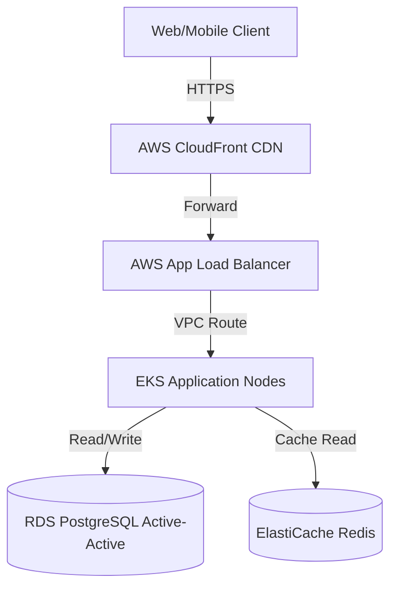
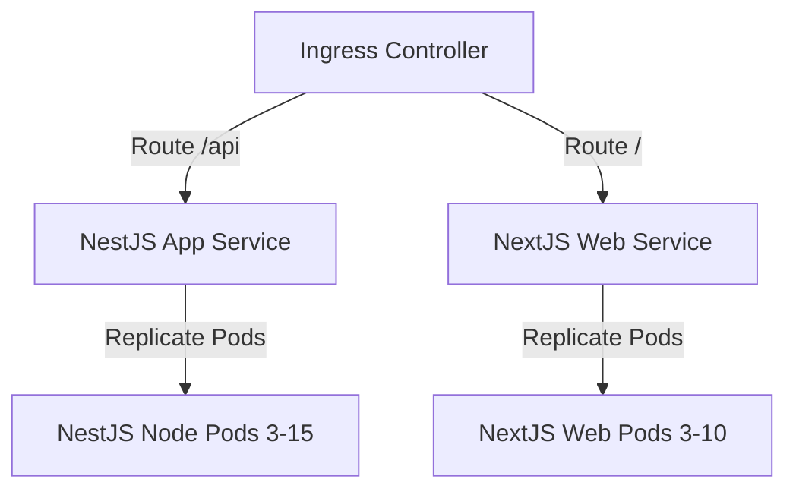

# ENTERPRISE DEVOPS FOUNDATION & INFRASTRUCTURE ARCHITECTURE

**Project Name:** Enterprise SaaS Business Management Platform  
**Document Version:** 1.0.0 — Baseline Standard  
**Date:** July 13, 2026  
**Authors:** Principal DevOps Architect, Cloud Infrastructure Engineer & SRE Lead  
**Classification:** Enterprise Internal — Unrestricted  
**Status:** 🏛️ APPROVED ARCHITECTURE STANDARD  

---

## SECTION 1 — DEVOPS PRINCIPLES

### 1.1 What is DevOps?
DevOps is the combination of cultural philosophies, engineering practices, and automation tools that increases an organization's ability to deliver high-velocity applications securely and reliably. It bridges the gap between software development and systems operations to establish continuous delivery pipelines.

### 1.2 Why SaaS Platforms Need DevOps
For multi-tenant SaaS platforms hosting critical operations like POS checkout, inventory, and accounting, DevOps practices are essential to achieve:
*   **Faster Delivery:** Shifting from quarterly releases to daily deployments of business enhancements and bug fixes.
*   **Reliable Deployments:** Minimizing human errors by automating build, test, and release validation tasks.
*   **Infrastructure Automation:** Managing server, network, and database resources using Infrastructure as Code (IaC) to ensure consistency.
*   **Operational Stability:** Configuring monitoring tools to detect and resolve errors before they affect merchant storefronts.

### 1.3 DevOps Lifecycle
```
Plan ──> Code ──> Build ──> Test ──> Release ──> Deploy ──> Operate ──> Monitor ──> [ Feedback Loop ]
```

---

## SECTION 2 — ENTERPRISE INFRASTRUCTURE ARCHITECTURE

Our infrastructure uses a multi-tier, high-availability architecture designed to isolate client workloads and scale dynamically.

```mermaid
graph TD
    User[Client Applications] -->|HTTPS TLS 1.3| CloudFront[AWS CloudFront CDN]
    CloudFront -->|WAF Scanned Requests| ALB[AWS Application Load Balancer]
    
    subgraph VPC [AWS Virtual Private Cloud]
        subgraph PublicSubnets [Public Subnets]
            ALB
            Bastion[Bastion / VPN Gateway]
        </td>
        
        subgraph PrivateSubnets [Private App Subnets]
            EKS[Kubernetes Cluster EKS]
            NextJS[Next.js Frontend Pods]
            NestJS[NestJS Backend API Pods]
            Workers[Queue Consumer Pods]
            
            EKS --- NextJS
            EKS --- NestJS
            EKS --- Workers
        end
        
        subgraph DBSubnets [Isolated Database Subnets]
            RDS[(RDS PostgreSQL Active-Active)]
            Redis[(Elasticache Redis Cluster)]
            Kafka[(Amazon MSK MQ Cluster)]
        end
    end
    
    NestJS --> RDS
    NestJS --> Redis
    NestJS --> Kafka
    NestJS -->|AWS KMS Encrypted| S3[(Amazon S3 Storage)]
    
    subgraph SecurityShield [Security & Governance]
        WAF[AWS WAF]
        IAM[AWS IAM Access Policies]
        KMS[AWS Key Management Service]
    end
    
    subgraph OpsLayer [Observability & Backup]
        Prom[Prometheus Metrics]
        Graf[Grafana Dashboards]
        AWSBackup[AWS Backup Engine]
    end
```

---

## SECTION 3 — CLOUD PROVIDER EVALUATION & STRATEGY

We evaluated cloud providers to select the best hosting platform for the SaaS lifecycle.

### 3.1 Cloud Provider Comparison

| Evaluation Metric | AWS | Google Cloud (GCP) | Microsoft Azure | DigitalOcean | Hetzner Cloud |
| :--- | :--- | :--- | :--- | :--- | :--- |
| **Cost** | High (Enterprise-focused) | High | High | Low (Flat-rate) | Lowest (Cost-efficient) |
| **Scalability** | Industry leader (EKS/RDS) | Strong (GKE engine) | Strong | Moderate | Basic (Manual clustering) |
| **Reliability** | 99.99% (Global regions) | 99.99% | 99.9% | 99.9% | 99.9% (EU Centric) |
| **Developer Experience** | Complex (Slower setups) | High | Moderate | Easiest (Fast setup) | Simple |
| **Data Compliance** | Global (GDPR, HIPAA, SOC 2)| Global | Global | Basic | European (GDPR-native) |

### 3.2 Platform Growth Strategy

```
[ STARTUP STAGE (Hetzner / DO) ] ──────> [ EXPANSION STAGE (AWS EKS Hybrid) ]
* Simple VPS node deployments             * Migrate database layers to AWS RDS
* Managed Kubernetes (DOKS)               * Enable EKS clustering & global CloudFront
* Direct backup migrations                * Enforce global compliance rules (SOC 2, GDPR)
```

1.  **Startup Stage (Launch to Year 2):** Host applications on Hetzner Cloud (EU) or DigitalOcean (US) to keep infrastructure costs low, utilizing managed databases and Docker containers.
2.  **Enterprise Growth Stage (Year 3+):** Migrate resources to Amazon Web Services (AWS) using Terraform. Deploy workloads on AWS EKS and host data in Multi-AZ AWS RDS databases to meet SOC 2, HIPAA, and GDPR compliance requirements.

---

## SECTION 4 — ENVIRONMENT PROMOTION ARCHITECTURE

To isolate code validation stages, we run five distinct environment configurations.

### 4.1 Environment Sizing and Database Strategy

| Environment | Sizing & Compute Configuration | Database Strategy | Access Control |
| :--- | :--- | :--- | :--- |
| **Local Dev** | Local Developer Machine. | Local SQLite / Dockerized Postgres. | Full developer admin. |
| **Development** | Minimal AWS EC2 nodes. | Shared development database instance. | Engineering team read/write. |
| **QA / Testing** | Multi-node staging cluster. | Fresh seeded PostgreSQL database. | QA automation runner access. |
| **Staging** | Matches production specifications (RDS, ElastiCache). | Obfuscated production database snapshot. | Restricted engineering team access. |
| **Production** | Multi-AZ EKS cluster with RDS Active-Active databases. | Replicated PostgreSQL with continuous backups. | Automated CI/CD runners only. |

---

## SECTION 5 — SERVER ARCHITECTURE DEPLOYMENT SPECIFICATIONS

### 5.1 Deployment Sizing Profiles

#### Small SaaS Deployment (Startup Stage)
*   *Application Nodes:* $1 \times$ Node VPS ($4\text{ vCPUs}, 8\text{GB RAM}$).
*   *Database Engine:* Dockerized PostgreSQL running on local SSD storage.
*   *Cache & Queue:* In-memory Redis instance running on the application server.
*   *Backup:* Daily automated database snapshots routed to external object storage.

#### Medium SaaS Deployment (Growth Stage)
*   *Application Nodes:* $2 \times$ Application VMs ($4\text{ vCPUs}, 16\text{GB RAM}$) configured behind a load balancer.
*   *Database Engine:* $1 \times$ Managed Cloud Database Instance ($8\text{ vCPUs}, 32\text{GB RAM}$) with $1\times$ Read Replica.
*   *Cache & Queue:* Dedicated managed Redis instance ($4\text{GB RAM}$).
*   *Backup:* Hourly database transaction logs with 30-day retention policies.

#### Enterprise SaaS Deployment (Global Scales)
*   *Application Nodes:* Kubernetes clusters (AWS EKS) scaling across multiple Availability Zones.
*   *Database Engine:* Managed Cloud PostgreSQL Instance ($32\text{ vCPUs}, 128\text{GB RAM}$) with Active-Active replication.
*   *Cache & Queue:* Redis cluster configured for sub-millisecond query responses.
*   *Backup:* Continuous database backups, automated replication to secondary cloud regions, and write-once-read-many (WORM) storage configurations.

---

## SECTION 6 — CONTAINERIZATION STRATEGY

We package application components into secure Docker images to ensure consistent runtime environments.

### 6.1 Docker Image Configurations

#### Next.js Frontend Dockerfile
```dockerfile
FROM node:20-alpine AS base
WORKDIR /app
COPY package*.json ./
RUN npm ci

FROM base AS builder
COPY . .
RUN npm run build

FROM node:20-alpine AS runner
WORKDIR /app
ENV NODE_ENV=production
COPY --from=builder /app/next.config.js ./
COPY --from=builder /app/public ./public
COPY --from=builder /app/.next ./.next
COPY --from=builder /app/node_modules ./node_modules
USER node
EXPOSE 3000
CMD ["npm", "start"]
```

#### NestJS Backend Dockerfile
```dockerfile
FROM node:20-alpine AS base
WORKDIR /usr/src/app
COPY package*.json ./
RUN npm ci

FROM base AS builder
COPY . .
RUN npm run build

FROM node:20-alpine AS runner
WORKDIR /usr/src/app
ENV NODE_ENV=production
COPY --from=builder /usr/src/app/dist ./dist
COPY --from=builder /usr/src/app/node_modules ./node_modules
USER node
EXPOSE 4000
CMD ["node", "dist/main"]
```

### 6.2 Docker Best Practices
*   **Multi-Stage Builds:** Use multi-stage builds to keep final production image sizes small.
*   **Non-Root Privilege Executions:** Configure production containers to run under non-root users (`USER node`) to minimize exploit risks.
*   **Vulnerability Scanning:** Configure GitHub Actions pipelines to scan Docker images using **Trivy** before pushing to registries.

---

## SECTION 7 — KUBERNETES FOUNDATION

The platform uses Kubernetes (AWS EKS) to coordinate and scale application containers.

```
                  Kubernetes Cluster (Namespace: production)
                                  │
          ┌───────────────────────┼───────────────────────┐
          ▼                       ▼                       ▼
    Ingress Controller       NextJS Service          NestJS Service
    * Route: saas.com       * Target: NextJS Pods   * Target: NestJS Pods
    * TLS Termination       * Replicas: 3-10        * Replicas: 3-15
          │                       │                       │
    [ ConfigMaps ]          [ Sealed Secrets ]      [ HPA Auto-scaler ]
```

### 7.1 Kubernetes Resource Types
*   **Namespaces:** Isolate environments using namespaces (`dev`, `staging`, `production`).
*   **Deployments:** Manage application container states, replication policies, and rolling updates.
*   **Services:** Expose application pods to internal and external networks.
*   **Ingress:** Manage HTTP routing paths, term TLS certificates, and configure CORS headers.
*   **ConfigMaps & Secrets:** Load environment variables and retrieve application credentials from Secrets Manager.

---

## SECTION 8 — CI/CD FOUNDATION

Our CI/CD pipeline automates code integrations, build steps, and deployments.

```
Developer Commit ──> GitHub PR Trigger ──> Lint & Test ──> Docker Build ──> Trivy Scan ──> Push Registry ──> Helm Deploy
```

*   **GitHub Actions:** Selected for its integration with monorepos, allowing us to configure modular workflow tasks.
*   **GitLab CI / Jenkins:** Used as alternative runners for internal private network servers if data requirements prevent cloud hosting.

---

## SECTION 9 — INFRASTRUCTURE AS CODE (IaC)

We manage cloud resources using **Terraform** to prevent configuration drift.

### 9.1 IaC Project Directory Layout
```
/infra
├── terraform/
│   ├── main.tf             # Cloud provider configs (AWS EKS, VPC, subnets)
│   ├── variables.tf        # Sizing and location variables
│   └── outputs.tf          # Cluster endpoints and connection parameters
├── kubernetes/
│   ├── manifests/          # Raw YAML manifests (namespaces, services)
│   └── helm/               # Helm charts for NestJS and Next.js applications
├── ansible/
│   └── playbooks/          # Host OS patch and hardening scripts
└── scripts/
    └── backup-db.sh        # Database backup and snapshot scripts
```

---

## SECTION 10 — NETWORK ARCHITECTURE

We restrict network access using private subnets, security groups, and routing tables.

```
[ INTERNET ] ──> [ AWS WAF ] ──> [ Public Subnet ALB ] ──> [ Private App Subnets ] ──> [ DB Subnet (Private) ]
```

*   **VPC & Subnets:** Applications run inside private subnets, while database ports are isolated within non-routing DB subnets.
*   **Security Groups:** Compute nodes accept traffic only from local load balancers, and database servers block all connections originating outside application subnets.

---

## SECTION 11 — SECURITY FOUNDATION

We enforce security controls across all infrastructure layers.
*   **Secrets Management:** Store database passwords and API keys in **HashiCorp Vault** or AWS Secrets Manager, injecting them into containers at runtime.
*   **Network Security:** Terminate SSL/TLS certificates at the load balancer level, and configure firewalls to block unused ports.
*   **Access Auditing:** Require engineers to access cloud hosts using SSH bastion gateways, and record user actions in immutable audit trails.

---

## SECTION 12 — BACKUP STRATEGY

We run automated backups to protect database states and media uploads.

### 12.1 Backup Retention Matrix

| Asset Target | Backup Tool | Frequency | Retention Duration |
| :--- | :--- | :--- | :--- |
| **PostgreSQL DB** | AWS RDS Backup Engine | Continuous (WAL files) + Daily snapshots | 35 Days (Point-in-Time Recovery) |
| **Client Uploads**| Amazon S3 Versioning | Real-time versioning + Daily replications | Permanent (WORM configuration) |
| **Configurations**| Git Version Control | On Code Commit | Permanent (Git History) |
| **Kubernetes Config**| Velero Backups | Daily | 90 Days |

---

## SECTION 13 — DISASTER RECOVERY FOUNDATION

We maintain disaster recovery plans to recover platform services after outages.
*   **Recovery Flow:** Detect outages using Prometheus alerts $\rightarrow$ spin up infrastructure using Terraform templates $\rightarrow$ restore databases from snapshots $\rightarrow$ update DNS targets.
*   **Disaster Recovery Metrics:**
    *   **Recovery Time Objective (RTO):** $\le 4\text{ hours}$ (time taken to restore the system after regional failure).
    *   **Recovery Point Objective (RPO):** $\le 1\text{ hour}$ (maximum data loss from restore point).

---

## SECTION 14 — COST OPTIMIZATION

We use monitoring data to optimize resource usage and control cloud costs.
*   **Auto-Scaling Rules:** Scale compute resources down during low-traffic hours and up during peak times.
*   **Resource Limits:** Configure CPU and memory limits on Kubernetes pods to prevent resource leaks from consuming hosts.
*   **Savings Plans:** Purchase AWS Compute Savings Plans and Reserved Instances for baseline workloads to reduce compute costs.
*   **Database Sizing:** Match database instances to active workloads, and scale resources up as tenant counts grow.

---

## SECTION 15 — DEVOPS TOOL STACK REFERENCE

Our standardized DevOps tools are detailed in the table below:

| Category | Tool | Purpose |
| :--- | :--- | :--- |
| **Cloud Hosting** | **Amazon Web Services (AWS)**| Scalable infrastructure provider (EKS, RDS, VPC). |
| **Orchestration** | **Kubernetes / Helm** | Coordinates application containers and manages configs. |
| **Container Engine**| **Docker** | Packages applications into portable runtime images. |
| **Infrastructure** | **Terraform** | Manages cloud infrastructure resources using code (IaC). |
| **OS Automation** | **Ansible** | Configures and updates server operating systems. |
| **CI/CD Pipeline** | **GitHub Actions** | Automates software builds, test runs, and deployments. |
| **Observability** | **Prometheus & Grafana** | Monitors server metrics, log streams, and system alerts. |
| **Secrets Vault** | **HashiCorp Vault** | Stores and rotates API keys and database credentials. |

---

## SECTION 16 — FINAL DEVOPS ARCHITECTURE MERMAID DIAGRAMS

### 16.1 Enterprise Cloud Infrastructure


### 16.2 CI/CD Deployment Pipeline
```
[ Commit PR ] ──> [ Lint & Unit Test ] ──> [ Build Image ] ──> [ Trivy Scan ] ──> [ ECR Registry ] ──> [ Helm Deploy ]
```

### 16.3 Kubernetes Deployment Architecture


### 16.4 Disaster Recovery Architecture
```
[ Regional Outage ] ──> [ PagerDuty Alert ] ──> [ Terraform Deploy DR region ] ──> [ RDS snapshot restore ] ──> [ DNS Swap ]
```

---

*End of Enterprise DevOps Foundation & Infrastructure Architecture*  
*Document maintained by: Principal DevOps Architect | Status: Approved Architecture Standard*
