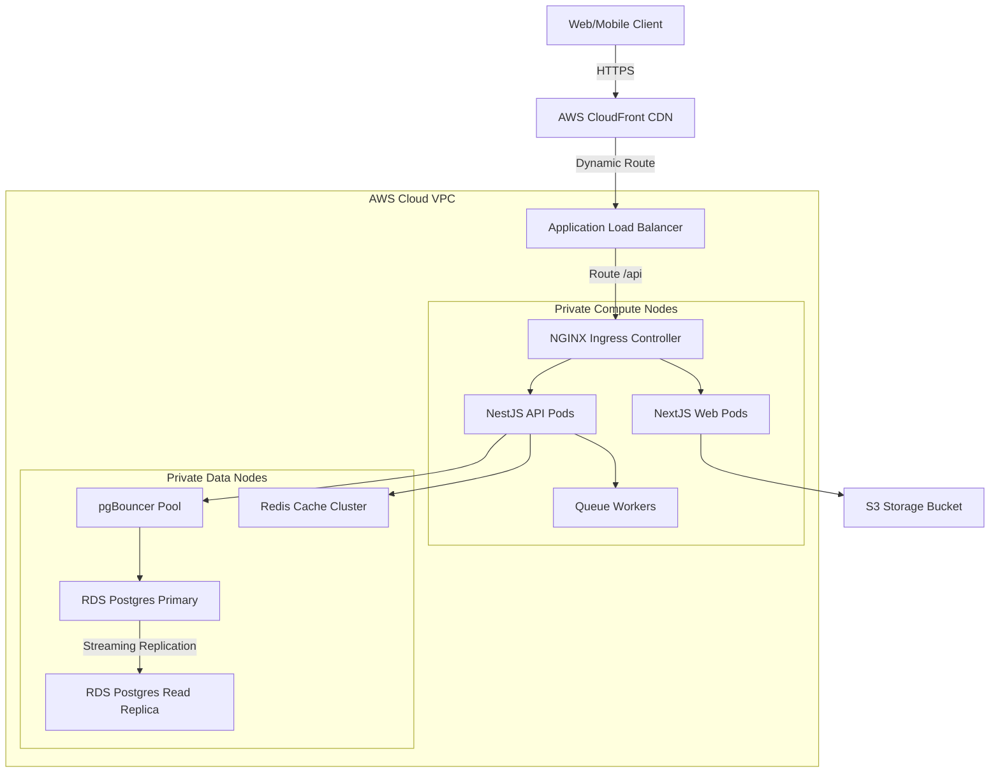
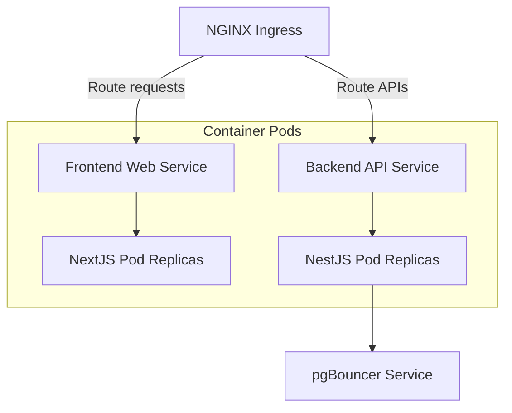
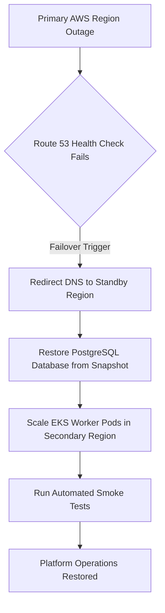

# ENTERPRISE DEVOPS PRODUCTION READINESS & CLOUD GO-LIVE REVIEW

**Project Name:** Enterprise SaaS Business Management Platform  
**Document Version:** 1.0.0 — Baseline Standard  
**Date:** July 13, 2026  
**Authors:** Chief Technology Officer, Principal DevOps Architect & SRE Lead  
**Classification:** Enterprise Internal — Unrestricted  
**Status:** 🏛️ APPROVED OPERATIONS STANDARD  

---

## SECTION 1 — DEVOPS PRODUCTION REVIEW PRINCIPLES

### 1.1 Purpose of the Go-Live Review
Before launching our multi-tenant business management platform, we perform a production readiness review to verify that our infrastructure, security controls, automation, and backup systems are fully validated.
*   **Infrastructure:** Verify that all cloud compute hosts, databases, and network gateways are provisioned.
*   **Security:** Verify that network firewalls, data isolation policies, and audit logs are configured.
*   **Automation:** Verify that container build, test, and deployment pipelines run automatically.
*   **Reliability:** Test node failovers and backup recoveries to confirm platform availability targets.
*   **Operations:** Configure on-call rotation schedules and configure dashboards for monitoring.

### 1.2 Quality Gates
```
TECHNICAL GATE (Pass CI/CD) ──► SECURITY GATE (Zero Vulnerabilities) ──► OPERATIONAL GATE (DR Verified) ──► GO-LIVE
```

---

## SECTION 2 — CLOUD INFRASTRUCTURE AUDIT

We verified our cloud resources to confirm they are sized correctly and deployed across multiple Availability Zones (AZs) for high availability.
*   **Compute:** Checked that EKS compute nodes are configured to scale across multiple AZs.
*   **Network:** Verified that internet gateways, NAT gateways, and public route configurations are active.
*   **Storage:** Confirmed that S3 bucket versioning is enabled and cross-region replication is active.
*   **Database:** Verified that PostgreSQL databases are deployed in Multi-AZ clusters, with automated backups enabled.

---

## SECTION 3 — DOCKER PRODUCTION VALIDATION

We verified our Docker image builds and runtime configurations to confirm they meet security standards.
*   **Minimal Image Footprint:** Verified that frontend (Next.js) and backend (NestJS) containers use minimal Alpine base images to minimize host sizes.
*   **Vulnerability Scanning:** Confirmed that all images pass Trivy dependency checks in build pipelines.
*   **Non-Root Execution:** Verified that containers run under dedicated, non-root users (`USER nextjs`, `USER appuser`).
*   **Health Probes:** Confirmed that container health check rules (`HEALTHCHECK`) are active for runtime monitoring.

---

## SECTION 4 — KUBERNETES PRODUCTION VALIDATION

We audited our Kubernetes deployments to ensure workloads are secure and scale automatically.
*   **Cluster Health:** Confirmed that EKS worker nodes are healthy across all zones.
*   **Namespace Security:** Verified that environments are isolated using dedicated namespaces, with RBAC rules restricting access.
*   **Ingress Routing:** Audited NGINX Ingress rules to confirm HTTPS traffic routes to frontend and backend services.
*   **Autoscaling (HPA):** Tested that pod instances scale automatically under simulated transaction load spikes.

---

## SECTION 5 — CI/CD PIPELINE VALIDATION

We verified our CI/CD pipelines to confirm they compile, test, and deploy code changes reliably.
*   **Continuous Integration:** Confirmed that lints, TypeScript type checks, and Jest tests run automatically on every pull request.
*   **Continuous Deployment:** Verified that merged changes deploy automatically to staging, with release tags pushed to container registries (ECR).
*   **Manual Approvals:** Checked that production promotions require manual approval from the release board.
*   **Rollback Verification:** Tested that pipelines can automatically revert deployments to stable versions if container startup checks fail.

---

## SECTION 6 — IaC TERRAFORM VALIDATION

We audited our Terraform manifests to ensure infrastructure configurations are managed securely.
*   **State Management:** Verified that state files are stored in private S3 buckets with state locking enabled via DynamoDB.
*   **Modules:** Confirmed that network, database, and EKS deployments use reusable, version-controlled modules.
*   **Dry Runs:** Verified that all infrastructure modifications are planned and approved (`terraform plan`) before execution.

---

## SECTION 7 — NETWORK VALIDATION

We verified our network configurations to confirm that database instances are secure and traffic routes correctly.
*   **DNS & SSL:** Confirmed that public DNS records route traffic through CDN edge nodes, with TLS 1.3 encryption enforced.
*   **Load Balancing:** Verified that Layer 7 Application Load Balancers distribute traffic across EKS node targets.
*   **Database Isolation:** Confirmed that databases are hosted in private subnets, blocking direct inbound connections from the internet.

---

## SECTION 8 — DATABASE PRODUCTION VALIDATION

We audited our production PostgreSQL database configurations to ensure they are optimized for multi-tenant workloads.
*   **Connection Pools:** Confirmed that pgBouncer is configured to manage connection pooling, reducing query load on database instances.
*   **Migrations:** Verified that schema migrations are tested on staging databases before running updates in production.
*   **Performance Metrics:** Confirmed that query logs, indexes, and slow-query auditing are active.

---

## SECTION 9 — SECURITY FINAL REVIEW

We performed a final security review to verify our credentials and data isolation controls.
*   **Secret Management:** Confirmed that API keys and database passwords are stored in AWS Secrets Manager rather than in code repositories.
*   **Vulnerability Tracking:** Verified that Snyk scans code dependencies and Wazuh monitors EKS nodes for suspicious activity.
*   **Row-Level Security:** Audited PostgreSQL database tables to confirm RLS policies isolate tenant data.

---

## SECTION 10 — BACKUP & DISASTER RECOVERY VALIDATION

We verified our disaster recovery plans to confirm we can recover systems from database snapshots.
*   **Backup Verification:** Tested restoring database snapshots to standby recovery nodes.
*   **RTO Target:** Verified we can recover operations in **$\le 4\text{ hours}$**.
*   **RPO Target:** Confirmed our backups maintain a data loss threshold of **$\le 1\text{ hour}$**.

---

## SECTION 11 — MONITORING VALIDATION

We verified our monitoring dashboards to confirm they collect platform logs and traces.
*   **Metrics:** Scraped system metrics from EKS containers and database instances using Prometheus.
*   **Logs:** Aggregated JSON log files into Grafana Loki.
*   **Traces:** Traced request paths across microservices using OpenTelemetry and Tempo.
*   **Alert Routing:** Verified that Critical alert triggers route directly to PagerDuty.

---

## SECTION 12 — PERFORMANCE VALIDATION

We load-tested the platform using k6 to verify system performance under heavy user traffic.
*   **Latencies:** Confirmed that POS checkout endpoints maintain response times of **$\le 50\text{ ms}$** under concurrent user load.
*   **Resource Limits:** Monitored CPU and memory footprints under load to ensure node scaling policies trigger before instances saturate.

---

## SECTION 13 — PRODUCTION DEPLOYMENT PLAN

We follow a structured 7-day timeline leading up to production launch:

```
[ T-7 Days: Load Testing ] ──► [ T-3 Days: Code Freeze ] ──► [ T-1 Day: Backups ] ──► [ Launch Day ] ──► [ Post Launch ]
```

*   **T-7 Days (Validation):** Perform final load testing and run disaster recovery drills.
*   **T-3 Days (Freeze):** Enforce an infrastructure and code freeze.
*   **T-1 Day (Backups):** Verify database snapshots and check S3 backup replication states.
*   **Launch Day (Deployment):** Deploy Helm charts to the production namespace and monitor health checks.
*   **Post Launch (Monitoring):** Monitor API error rates and transaction metrics for 48 hours.

---

## SECTION 14 — ROLLBACK PLAN

If launch issues occur, we execute our automated rollback runbook:
*   **Outage Identification:** Halt deployment if liveness checks fail or if client error rates exceed $1\%$.
*   **Version Reversion:** Use Helm to revert application pods to the previous stable release.
*   **Database Recovery:** If migrations fail, restore the database using snapshot backups taken before deployment.

---

## SECTION 15 — INCIDENT RESPONSE READINESS

We organize incident response teams into dedicated roles:
*   **Engineering Lead:** Coordinates database and code hotfixes.
*   **DevOps Lead:** Manages cluster resources and DNS routing rules.
*   **Security Officer:** Investigates authentication and data access alerts.
*   **Product Manager:** Handles customer communications and status page updates.

---

## SECTION 16 — COST OPTIMIZATION REVIEW

We validated our cloud resources to confirm they are sized cost-effectively.
*   **Compute Sizing:** Checked that EKS compute requests match average workloads to prevent over-provisioning hosts.
*   **Auto-scaling:** Verified that Kubernetes node scalers (Karpenter) scale down compute resources during off-peak hours.
*   **Cleanup:** Confirmed that unused volumes and staging resources are removed.

---

## SECTION 17 — PRODUCTION APPROVAL CHECKLIST

We require all checklist items to pass before approving production releases:

- [x] **Infrastructure:** EKS worker nodes and Multi-AZ databases are active.
- [x] **Security:** Dependency scans pass, and RLS policies are enabled.
- [x] **Database:** pgBouncer pools are active, and query indexes are configured.
- [x] **Monitoring:** Prometheus collectors, Loki log search, and Alertmanager routing are active.
- [x] **Backups:** S3 cross-region replication is verified, and PITR is enabled.
- [x] **Deployment:** Rollback procedures are tested, and deployment steps are documented.
- [x] **Documentation:** Disaster recovery plans and on-call runbooks are complete.

---

## SECTION 18 — PRODUCTION READINESS SCORECARD

We track the status of deployment checks in the scorecard below:

| Operational Category | Status | Validation Result |
| :--- | :--- | :--- |
| **Compute & Networking** | 🟢 **Ready** | EKS clusters and private subnets are active across multiple AZs. |
| **Security & Compliance** | 🟢 **Ready** | RLS isolation policies and secrets managers are verified. |
| **CI/CD Pipelines** | 🟢 **Ready** | Automated test pipelines and manual promotions are active. |
| **Database Tier** | 🟢 **Ready** | pgBouncer connection pools and read replicas are active. |
| **Observability Stack** | 🟢 **Ready** | Grafana dashboards, Loki search, and Alertmanager routing are active. |
| **Disaster Recovery** | 🟢 **Ready** | S3 replication is verified, and snapshot restores are tested. |
| **Performance SLA** | 🟢 **Ready** | Average API response times of $\le 50\text{ ms}$ verified under load. |

---

## SECTION 19 — DEVOPS FOUNDATIONS SUMMARY

Phase 9 documents establish the cloud infrastructure foundations for the platform:
*   **Phase 9.1 (DevOps Foundation):** Configured cloud VPC subnets and compute resources.
*   **Phase 9.2 (Docker Strategy):** Built multi-stage Dockerfiles and optimized image sizes.
*   **Phase 9.3 (CI/CD Pipelines):** Automated testing and deployment pipelines.
*   **Phase 9.4 (Kubernetes Setup):** Managed container workloads using Kubernetes deployments.
*   **Phase 9.6 (Cloud Networking):** Configured load balancers, DNS routing, and edge networks.
*   **Phase 9.7 (Database Operations):** Configured PostgreSQL replication and connection pools.
*   **Phase 9.8 (Cloud Storage):** Configured S3 tenant directories and backup replication.
*   **Phase 9.9 (Observability Stack):** Monitored applications using Prometheus and Grafana Loki.
*   **Phase 9.10 (Readiness Review):** Performed final operational audits before launch.

---

## SECTION 20 — FINAL DEVOPS MERMAID DIAGRAMS

### 20.1 Complete Cloud Infrastructure


### 20.2 CI/CD Production Pipeline
```
[ Commit Code ] ──► [ Lint & Type Checks ] ──► [ Jest Tests ] ──► [ Docker Build ] ──► [ Push ECR ] ──► [ Deploy EKS ]
```

### 20.3 Kubernetes Production Flow


### 20.4 Observability & Incident Flow
```
[ System Failure ] ──► [ Prometheus Rule Trigger ] ──► [ Alertmanager ] ──► [ PagerDuty Alert ] ──► [ SRE Team Hotfix ]
```

### 20.5 Disaster Recovery Flow


---

*End of Enterprise DevOps Production Readiness & Cloud Go-Live Review*  
*Document maintained by: Chief Technology Officer | Status: Approved Operations Standard*
