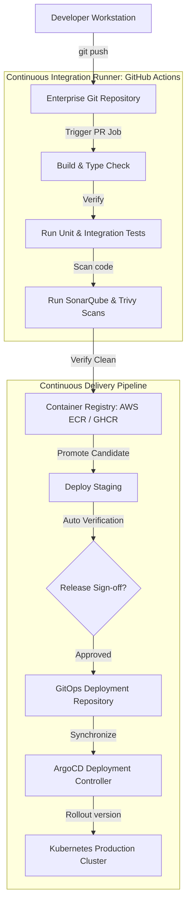
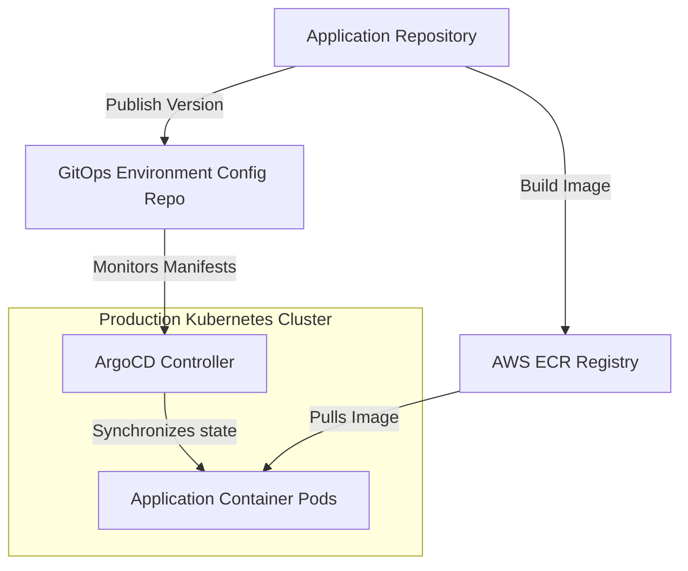
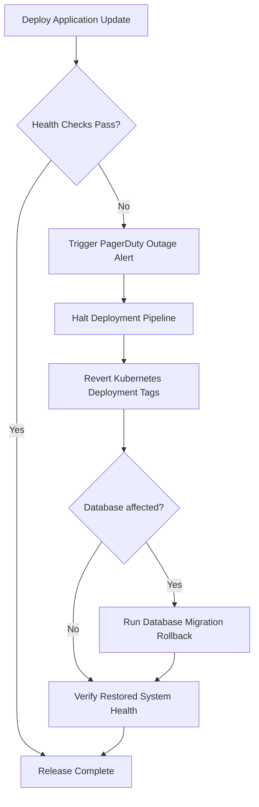
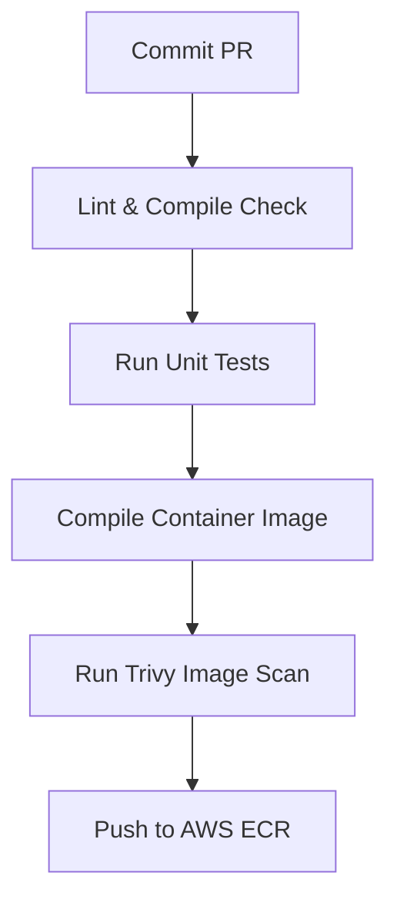
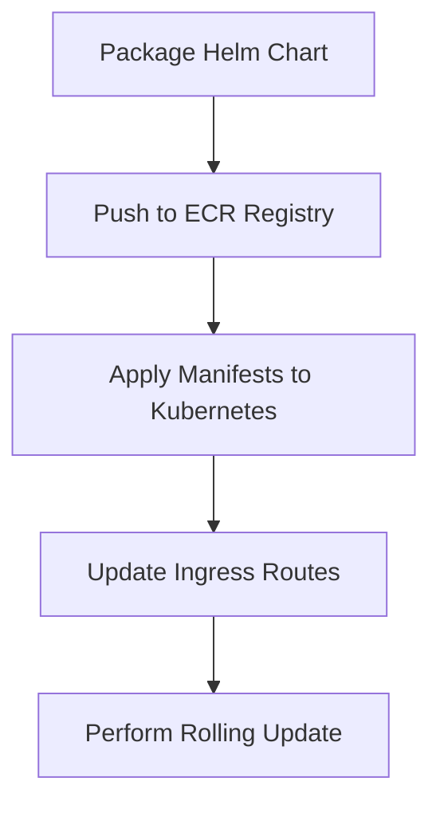

# ENTERPRISE CI/CD PIPELINE ENGINEERING & AUTOMATION STRATEGY

**Project Name:** Enterprise SaaS Business Management Platform  
**Document Version:** 1.0.0 — Baseline Standard  
**Date:** July 13, 2026  
**Authors:** Principal DevOps Architect, CI/CD Platform Lead & GitOps Engineer  
**Classification:** Enterprise Internal — Unrestricted  
**Status:** 🏛️ APPROVED DELIVERY STANDARD  

---

## SECTION 1 — CI/CD PRINCIPLES

### 1.1 What is CI/CD?
Continuous Integration and Continuous Deployment (CI/CD) represents the engineering foundation that automates the lifecycle of software delivery. It enforces quality validation at every commit to ensure that production releases are safe and reproducible.
*   **Continuous Integration (CI):** Developer modifications are automatically integrated, compiled, and validated through tests on centralized runners.
*   **Continuous Delivery (CD):** Once verified, applications are packaged into deployment artifacts (Docker containers, Helm charts) and remain ready to be deployed to target environments.
*   **Continuous Deployment (CD):** Validated changes are automatically promoted to production staging servers without manual intervention.

### 1.2 Operational Benefits
```
FASTER RELEASES (Minutes, not weeks) ──> FEWER ERRORS (Auto-gates) ──> HIGHER QUALITY (80% coverage) ──> DEVELOPER SPEED
```

---

## SECTION 2 — ENTERPRISE CI/CD ARCHITECTURE

Our CI/CD architecture isolates compilation and security checks from execution pipelines, utilizing Git repositories as the absolute source of truth.



---

## SECTION 3 — SOURCE CONTROL STRATEGY

We use a structured branch layout in Git to organize parallel feature development and release pipelines.

```
Feature Development (feature/*) ──> Integration (develop) ──> Release Staging (release/*) ──> Production (main)
                                                                                         └── Emergency Fixes (hotfix/*)
```

### 3.1 Git Workflow Controls
*   **Branch Protections:** The `main` and `develop` branches are protected, requiring a peer-reviewed pull request and passing CI validation checks to merge.
*   **Merge Policies:** Pull requests require approvals from two senior engineers. We squash commits when merging features to keep the Git history clean.
*   **Version Tagging:** Releases are tagged using Semantic Versioning (e.g., `v1.2.0`). Tagging automatically triggers GitHub release notes generation.

---

## SECTION 4 — CONTINUOUS INTEGRATION PIPELINE

Our CI pipelines execute on every commit to verify code quality.

### 4.1 Pipeline Step Actions
1.  **Code Push:** Developers push commits, triggering the GitHub Actions workflow runner.
2.  **Restore Cache:** Restore node module dependencies from the runner's cache to reduce build times.
3.  **Code Linting:** Check code formatting and style guidelines using ESLint.
4.  **Type Compile Checks:** Verify TypeScript compiler builds without syntax errors.
5.  **Unit Tests:** Run unit tests using Jest/Vitest and generate code coverage reports.
6.  **Integration Tests:** Spin up temporary PostgreSQL containers using Testcontainers to run database integration tests.
7.  **Compile Bundles:** Build production-ready Next.js and NestJS bundles.
8.  **Security Scans:** Scan application code and dependencies using Snyk and Trivy.

---

## SECTION 5 — FRONTEND CI PIPELINE

The Next.js frontend pipeline builds static assets and analyzes package bundle sizes.

### 5.1 Next.js Actions Pipeline
```yaml
name: NextJS Frontend CI
on:
  pull_request:
    paths:
      - 'apps/web/**'
jobs:
  validate:
    runs-on: ubuntu-latest
    steps:
      - uses: actions/checkout@v4
      - name: Setup Node
        uses: actions/setup-node@v4
        with:
          node-version: 20
          cache: 'npm'
      - run: npm ci
      - run: npm run lint
      - run: npm run test -- --coverage
      - run: npm run build
      - name: Analyze Bundle Sizes
        run: npx next-bundle-analyzer
```

### 5.2 Frontend Verifications
*   **UI Workflows:** Execute headless browser tests using Playwright to verify critical login and POS paths.
*   **Accessibility (a11y) Audits:** Run axe-core checks to identify WCAG contrast violations.

---

## SECTION 6 — BACKEND CI PIPELINE

The NestJS backend pipeline verifies business logic and checks database schema migrations.

### 6.1 NestJS Actions Pipeline
```yaml
name: NestJS Backend CI
on:
  pull_request:
    paths:
      - 'services/api/**'
jobs:
  validate:
    runs-on: ubuntu-latest
    services:
      postgres:
        image: postgres:16-alpine
        ports:
          - 5432:5432
        env:
          POSTGRES_PASSWORD: secret
    steps:
      - uses: actions/checkout@v4
      - run: npm ci
      - run: npm run lint
      - run: npx prisma migrate dev --dry-run
      - run: npm run test:cov
      - run: npm run build
```

### 6.2 Backend Verifications
*   **API Contracts:** Verify that controllers accept and return payloads matching OpenAPI/Swagger schemas.
*   **Database Migrations:** Run dry-run migrations to verify database schemas match Prisma configurations.

---

## SECTION 7 — DOCKER IMAGE BUILD PIPELINE

Once code checks pass, CI pipelines build and push Docker images to registries.
*   **Version Tagging:** Images are tagged with the Git commit hash and release version (e.g., `api:v1.2.0` and `api:sha-a8f3b2d`).
*   **Registries:** Deploy image packages to private AWS Elastic Container Registries (ECR) or GitHub Container Registries (GHCR).

---

## SECTION 8 — SECURITY PIPELINES (SAST/DAST)

We integrate security validation tools directly into build pipelines.
*   **GitLeaks Scan:** Scan pull requests for hardcoded API tokens, credentials, and private keys.
*   **Snyk Dependency Scan:** Check package files for libraries with known security vulnerabilities.
*   **SonarQube Code Check:** Analyze code structures for quality issues and code smells.
*   **Trivy Container Scan:** Scan Docker images for vulnerabilities and secure configurations.

```
[ Git Commits ] ──> [ GitLeaks ] ──> [ SonarQube ] ──> [ Snyk ] ──> [ Trivy ] ──> [ Pass Approval ]
```

---

## SECTION 9 — DATABASE MIGRATION PIPELINE

We execute database schema migrations in staged pipelines to ensure zero downtime.

```
[ Step 1: Backup DB ] ──> [ Step 2: Staging Dry-run ] ──> [ Step 3: Run Migration ] ──> [ Step 4: Health Check ]
```

*   **Zero-Downtime Rule:** Schema migrations must be backwards-compatible to prevent active application nodes from failing during releases.
*   **Rollback Strategy:** Verify rollback scripts in staging before running migrations on production databases.

---

## SECTION 10 — ENVIRONMENT PROMOTION PIPELINE

Deployments are promoted through isolated environments to ensure stability.
*   **QA Deployments:** Automated pipelines deploy merged commits to the QA environment.
*   **Staging Deployments:** Release candidates deploy to the staging environment to verify system configurations.
*   **Production Deployments:** Releases require manual approvals from the Release Board, and deploy only after staging smoke tests pass.

---

## SECTION 11 — KUBERNETES DEPLOYMENT AUTOMATION

We use Helm charts to manage Kubernetes deployments.
*   **Chart Templates:** Define environment configurations, horizontal pod scaling rules, load balancer routes, and liveness checks in Helm charts.
*   **GitOps Delivery:** ArgoCD monitors Helm repositories and automatically synchronizes cluster configurations with Git targets.

---

## SECTION 12 — GITOPS ARCHITECTURE

We use Git repositories as the absolute source of truth for infrastructure configurations.



*   **ArgoCD:** Monitors the GitOps configuration repository and updates Kubernetes cluster states to match Git manifests, preventing configuration drift.

---

## SECTION 13 — SECRETS MANAGEMENT

*   **Zero Credentials in Git:** Store database passwords and API keys in AWS Secrets Manager or HashiCorp Vault.
*   **Kubernetes Injectors:** Inject secrets into container environments at runtime, keeping credentials secure.

---

## SECTION 14 — AUTOMATED ROLLBACK FLOW

Our pipelines automatically revert deployments to stable versions if production errors occur.



---

## SECTION 15 — RELEASE STRATEGIES

*   **Blue/Green Deployments:** DNS routers switch production traffic to the standby environment once health checks pass, allowing instant rollbacks.
*   **Canary Deployments:** Route a small percentage of traffic (e.g., 2%) to the new version, scaling traffic up as system performance is verified.

---

## SECTION 16 — PIPELINE OBSERVABILITY

We monitor pipeline metrics to track build speeds and release stability:
*   **Build Latency:** Target build times under 5 minutes.
*   **Failure Ratios:** Monitor pipeline pass rates, aiming for $\ge 99\%$ success rates.
*   **Tooling:** Monitor GitHub Actions workflows using Prometheus metrics and Grafana dashboards.

---

## SECTION 17 — CI/CD TOOL STACK REFERENCE

Our standardized CI/CD tools are detailed in the table below:

| Category | Selected Tool | Purpose |
| :--- | :--- | :--- |
| **Pipeline Runner** | **GitHub Actions** | Automates code compilation, testing, and packaging. |
| **GitOps Engine** | **ArgoCD** | Synchronizes cluster states with Git configurations. |
| **Package Manager** | **Helm** | Manages Kubernetes manifests using configuration templates. |
| **Private Registry**| **AWS ECR** | Secure cloud registry for Docker images. |
| **Code Scanning** | **SonarQube** | Analyzes code repositories for vulnerabilities and code smells. |
| **Dependency Checks**| **Snyk** | Scans libraries for security vulnerabilities. |
| **Container Checks**| **Trivy** | Scans Docker images for OS vulnerabilities. |
| **Secret Scanning** | **GitLeaks** | Scans repositories for hardcoded API keys and secrets. |

---

## SECTION 18 — FINAL CI/CD MERMAID DIAGRAMS

### 18.1 Enterprise CI/CD Pipeline


### 18.2 GitOps Deployment Flow
```
[ Commit Config ] ──> [ Update GitOps Repo ] ──> [ ArgoCD Detects Drift ] ──> [ Sync Cluster ] ──> [ Health Check ]
```

### 18.3 Kubernetes Release Pipeline


### 18.4 Automated Rollback Flow
```
[ Outage Detected ] ──> [ Sentry Alert ] ──> [ ArgoCD Revert Commit ] ──> [ Revert Pod Images ] ──> [ Verify API Health ]
```

---

*End of Enterprise CI/CD Pipeline Engineering & Automation Strategy*  
*Document maintained by: Principal DevOps Architect | Status: Approved Delivery Standard*
