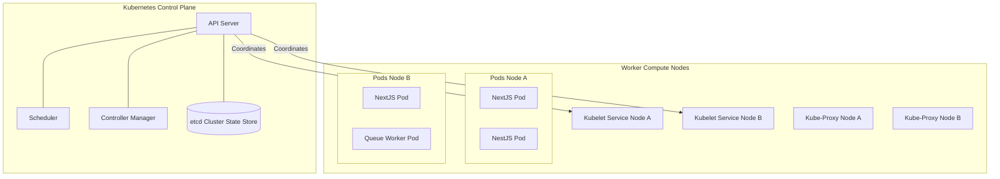
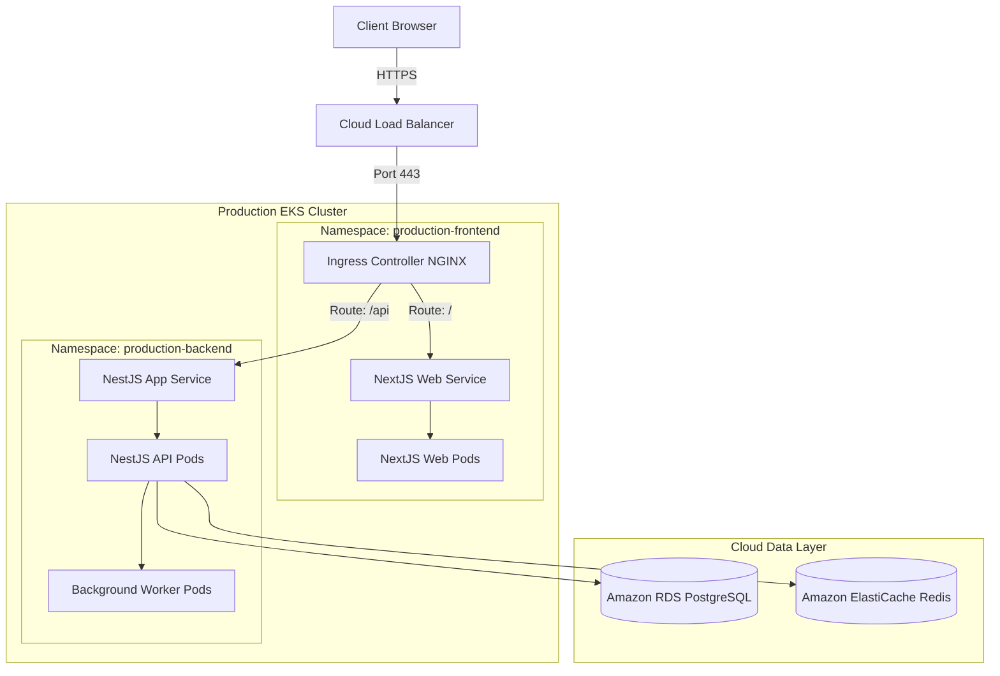
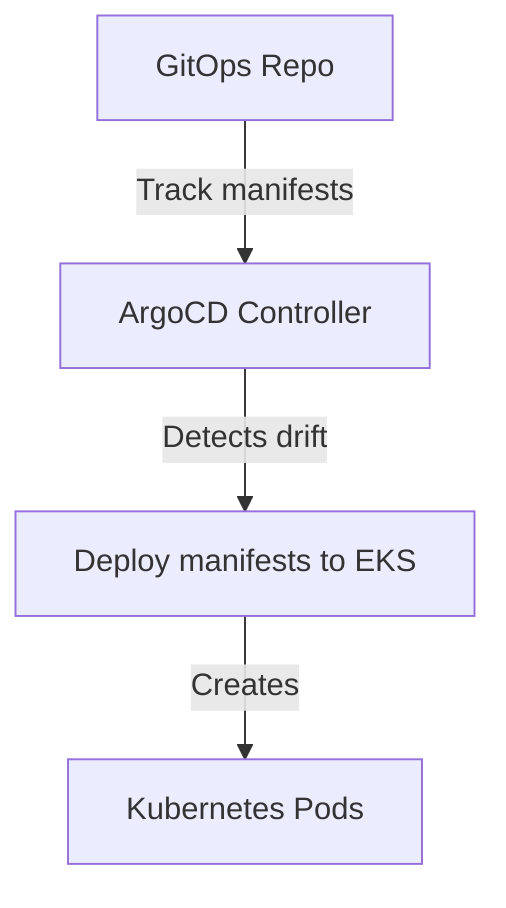
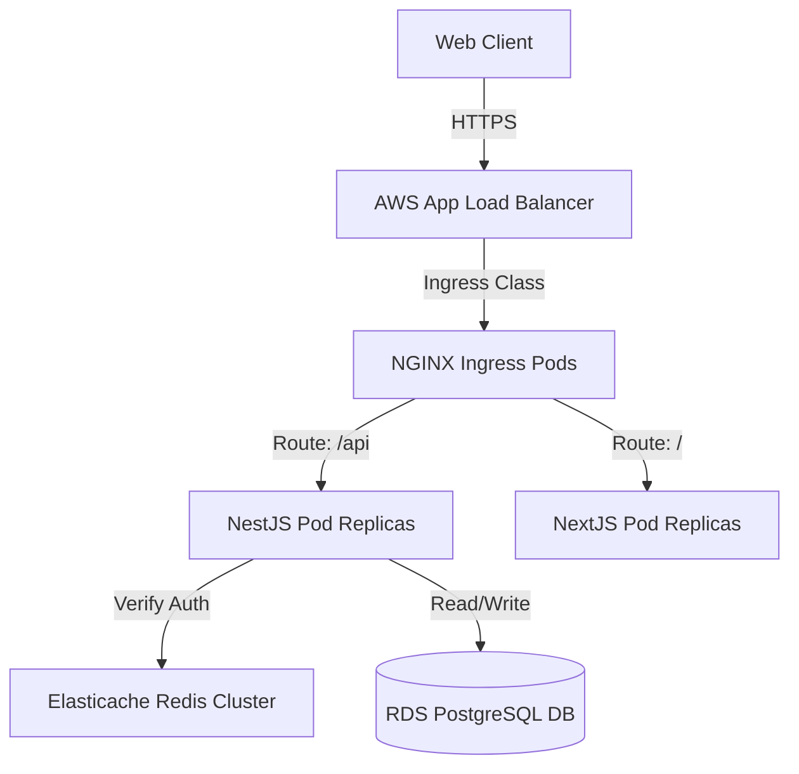
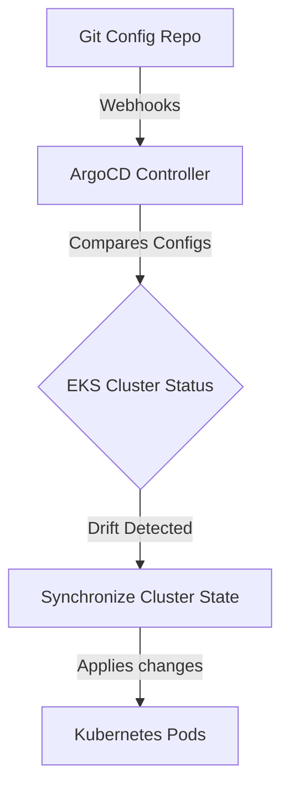
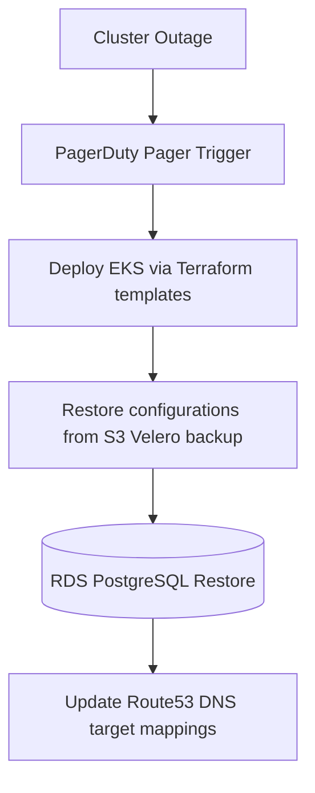

# ENTERPRISE KUBERNETES PRODUCTION ARCHITECTURE & CONTAINER ORCHESTRATION

**Project Name:** Enterprise SaaS Business Management Platform  
**Document Version:** 1.0.0 — Baseline Standard  
**Date:** July 13, 2026  
**Authors:** Principal Kubernetes Architect, Cloud Native Lead & SRE Architect  
**Classification:** Enterprise Internal — Unrestricted  
**Status:** 🏛️ APPROVED KUBERNETES STANDARD  

---

## SECTION 1 — KUBERNETES FUNDAMENTALS

### 1.1 Why Kubernetes is Needed
While Docker packages applications into self-contained container images, virtualizing multi-tenant SaaS services across multiple host servers requires container orchestration:
*   **Docker:** Focuses on packaging and running individual containers on a single host.
*   **Kubernetes (K8s):** Manages cluster nodes, scales workloads horizontally, coordinates networking, and automates failovers.

### 1.2 Operational Benefits
*   **Automated Scaling:** Adjusts pod replicas dynamically in response to shifting CPU and memory loads.
*   **Self-Healing:** Automatically restarts failed containers and replaces unresponsive pods.
*   **Service Discovery & Load Balancing:** Assigns containers static IP addresses and balances traffic across replica sets.
*   **Zero-Downtime Deployments:** Deploys updates using rolling updates to ensure platform availability.
*   **High Availability:** Distributes workloads across multiple host nodes and Availability Zones.

---

## SECTION 2 — KUBERNETES CLUSTER ARCHITECTURE

Our Kubernetes control plane coordinates application workloads running on worker nodes.



### 2.1 Cluster Services
*   **API Server:** The central entry point for administrative commands.
*   **Scheduler:** Allocates pods to worker nodes based on resource availability.
*   **Controller Manager:** Monitors cluster states and reconciles configuration drift.
*   **etcd:** Key-value store that maintains cluster configurations.
*   **Kubelet:** Node agent that ensures container pods run in healthy states.
*   **Pods:** The smallest deployable computing units in Kubernetes, wrapping container groups.

---

## SECTION 3 — PRODUCTION CLUSTER TOPOLOGY

We route traffic through cloud load balancers and ingress controllers to private application subnets.



---

## SECTION 4 — NAMESPACE STRATEGY

We isolate environment workloads using dedicated Kubernetes namespaces.
*   `development`: Used by developers to test application features in isolated environments.
*   `staging`: Pre-production testing namespace. Staging runs migrations on obfuscated production data.
*   `production`: Contains active customer-facing services.
*   `monitoring`: Hosts Grafana Loki collectors and Prometheus metrics.
*   `security`: Contains cluster role policies and Secrets Vault injectors.

---

## SECTION 5 — APPLICATION DEPLOYMENT ARCHITECTURE

We manage application lifecycles using Kubernetes deployments.

### 5.1 NestJS Production Deployment Manifest
```yaml
apiVersion: apps/v1
kind: Deployment
metadata:
  name: nestjs-api
  namespace: production
  labels:
    app: nestjs-api
spec:
  replicas: 3
  selector:
    matchLabels:
      app: nestjs-api
  template:
    metadata:
      labels:
        app: nestjs-api
    spec:
      containers:
      - name: nestjs-api
        image: 123456789012.dkr.ecr.us-east-1.amazonaws.com/nestjs-api:v1.2.0
        ports:
        - containerPort: 4000
        resources:
          requests:
            memory: "512Mi"
            cpu: "500m"
          limits:
            memory: "1024Mi"
            cpu: "1000m"
        livenessProbe:
          httpGet:
            path: /health
            port: 4000
          initialDelaySeconds: 15
          periodSeconds: 20
        readinessProbe:
          httpGet:
            path: /health
            port: 4000
          initialDelaySeconds: 10
          periodSeconds: 10
```

### 5.2 Deployment Definitions
*   **Deployment:** Defines the desired container state and replication policies.
*   **Replica:** Specifies the target count of pod instances.
*   **Pod:** Wraps application containers inside an execution sandbox.

---

## SECTION 6 — SERVICE ARCHITECTURE

We expose application pods using Kubernetes services.
*   **ClusterIP:** Exposes services to internal cluster networks, securing database pods from public access.
*   **NodePort:** Opens fixed ports on worker node IPs for manual testing.
*   **LoadBalancer:** Provisions a cloud load balancer to expose applications externally.

---

## SECTION 7 — INGRESS ARCHITECTURE

We use NGINX Ingress controllers to manage external routing rules.

### 7.1 Ingress Routing Rules
*   `/api` $\rightarrow$ Routes API requests directly to backend NestJS services.
*   `/` $\rightarrow$ Routes remaining traffic to frontend Next.js pods.

### 7.2 Ingress Resource Manifest
```yaml
apiVersion: networking.k8s.io/v1
kind: Ingress
metadata:
  name: saas-ingress
  namespace: production
  annotations:
    kubernetes.io/ingress.class: nginx
    nginx.ingress.kubernetes.io/ssl-redirect: "true"
spec:
  tls:
  - hosts:
    - saas.com
    secretName: saas-tls-cert
  rules:
  - host: saas.com
    http:
      paths:
      - path: /api
        pathType: Prefix
        backend:
          service:
            name: nestjs-api-service
            port:
              number: 4000
      - path: /
        pathType: Prefix
        backend:
          service:
            name: nextjs-web-service
            port:
              number: 3000
```

---

## SECTION 8 — CONFIGURATION MANAGEMENT

We manage non-sensitive configuration values using ConfigMaps, allowing us to update settings without rebuilding images.
*   **Environment:** Mapped to variables like `NODE_ENV`.
*   **Endpoints:** Injects parameters like `API_GATEWAY_URL`.
*   **Flags:** Injects feature flags to enable/disable modules.

---

## SECTION 9 — SECRETS MANAGEMENT

*   **Kubernetes Secrets:** Store base64-encoded strings representing database credentials and JWT signing keys.
*   **Production Injection:** Mount secrets into container directories at runtime using AWS Secrets Manager or HashiCorp Vault.

---

## SECTION 10 — STORAGE ARCHITECTURE

*   **Persistent Volumes (PV):** Request persistent block storage allocations from cloud storage providers.
*   **Persistent Volume Claims (PVC):** Map host directory directories to application pods.
*   **Storage Class:** Select default cloud storage drivers (like AWS EBS gp3).
*   **SaaS Recommendation:** Host database workloads on managed RDS databases, and write tenant uploads directly to Amazon S3.

---

## SECTION 11 — AUTO-SCALING STRATEGY

We scale container capacities in response to traffic workloads using Horizontal Pod Autoscalers (HPA).

```
[ Normal Load (3 Pods) ] ──> [ Traffic Spikes ] ──> [ HPA Scales Up (20 Pods) ]
```

### 11.1 HPA Target Policies
*   **CPU Threshold:** Trigger scaling operations when node CPU usage exceeds $70\%$.
*   **Memory Threshold:** Scale application resources when pod memory utilization exceeds $80\%$.

---

## SECTION 12 — HIGH AVAILABILITY DESIGN

We deploy infrastructure configurations to eliminate single points of failure:
*   **Multi-AZ Node Topologies:** Distribute worker nodes across three availability zones.
*   **Pod Anti-Affinity:** Configure scheduler rules to distribute application pods across separate physical nodes.
*   **Multi-Region DR:** Deploy failover replica clusters in secondary regions to support recovery plans.

---

## SECTION 13 — HELM DEPLOYMENT STRATEGY

We package application manifests into Helm charts to manage deployments.

### 13.1 Helm Directory Structure
```
/charts
├── backend/                # Helm configurations for NestJS APIs
│   ├── Chart.yaml
│   └── values.yaml         # Port configurations, scaling policies, and secrets keys
├── frontend/               # Helm configurations for Next.js frontends
└── worker/                 # Helm configurations for background workers
```

---

## SECTION 14 — GITOPS ARCHITECTURE

We coordinate application deployments using ArgoCD.



*   **Automated Sync:** ArgoCD monitors Git repositories and automatically deploys changes to the EKS cluster, preventing configuration drift.

---

## SECTION 15 — MONITORING INTEGRATION

We monitor cluster performance using Prometheus, Loki, and Grafana.
*   **Infrastructure Metrics:** Monitor node CPU loads, memory footprints, and disk usage.
*   **Application Health:** Collect request counts and API error rates.
*   **Traces:** Monitor application query paths using OpenTelemetry.

---

## SECTION 16 — KUBERNETES SECURITY HARDENING

*   **Role-Based Access Control (RBAC):** Restrict user and service account permissions to required namespaces.
*   **Network Policies:** Restrict network traffic between namespaces, blocking database connections originating from frontend subnets.
*   **Pod Security Standards:** Prevent containers from running with root privileges.

---

## SECTION 17 — DISASTER RECOVERY

*   **Velero Backups:** Create daily snapshots of cluster states and persistent volume data.
*   **DR Recovery Process:** Re-provision AWS infrastructure using Terraform $\rightarrow$ restore cluster configurations using Velero $\rightarrow$ verify data states and update DNS targets.

---

## SECTION 18 — KUBERNETES COST OPTIMIZATION

*   **Resource Sizing:** Match CPU requests to average workloads to prevent over-provisioning hosts.
*   **Autoscaling Nodes:** Enable Karpenter to scale cluster node sizes dynamically based on active workloads.
*   **Spot Instances:** Host non-critical background workers on Spot instances to reduce compute costs.

---

## SECTION 19 — KUBERNETES TOOL STACK REFERENCE

Our standardized Kubernetes tools are detailed in the table below:

| Category | Selected Tool | Purpose |
| :--- | :--- | :--- |
| **Container Engine**| **Kubernetes (EKS)** | Orchestrates application containers across cluster nodes. |
| **Package Manager** | **Helm** | Manages application manifests using templates. |
| **GitOps Agent** | **ArgoCD** | Synchronizes cluster configurations with Git targets. |
| **Ingress Controller**| **NGINX Ingress** | Routes external HTTP traffic to internal cluster nodes. |
| **Metrics Collector**| **Prometheus** | Collects cluster and application performance metrics. |
| **IaC Provisioner** | **Terraform** | Automates EKS cluster creation and cloud network configurations. |
| **Secrets Engine** | **HashiCorp Vault** | Secures API keys and database credentials. |
| **Security Auditing**| **Trivy** | Scans container images for vulnerabilities. |

---

## SECTION 20 — FINAL KUBERNETES MERMAID DIAGRAMS

### 20.1 Production Cluster Architecture


### 20.2 Kubernetes Deployment Flow
```
[ Commit PR ] ──> [ Build Image ] ──> [ Tag v1.2.0 ] ──> [ Helm Chart Upgrade ] ──> [ Rolling Update Pods ]
```

### 20.3 GitOps Architecture


### 20.4 Auto-Scaling Architecture
```
[ Load Spikes ] ──> [ CPU exceeds 70% ] ──> [ HPA scales Pods ] ──> [ Nodes saturated ] ──> [ Karpenter adds Nodes ]
```

### 20.5 Disaster Recovery Architecture


---

*End of Enterprise Kubernetes Production Architecture & Container Orchestration*  
*Document maintained by: Principal Kubernetes Architect | Status: Approved Kubernetes Standard*
