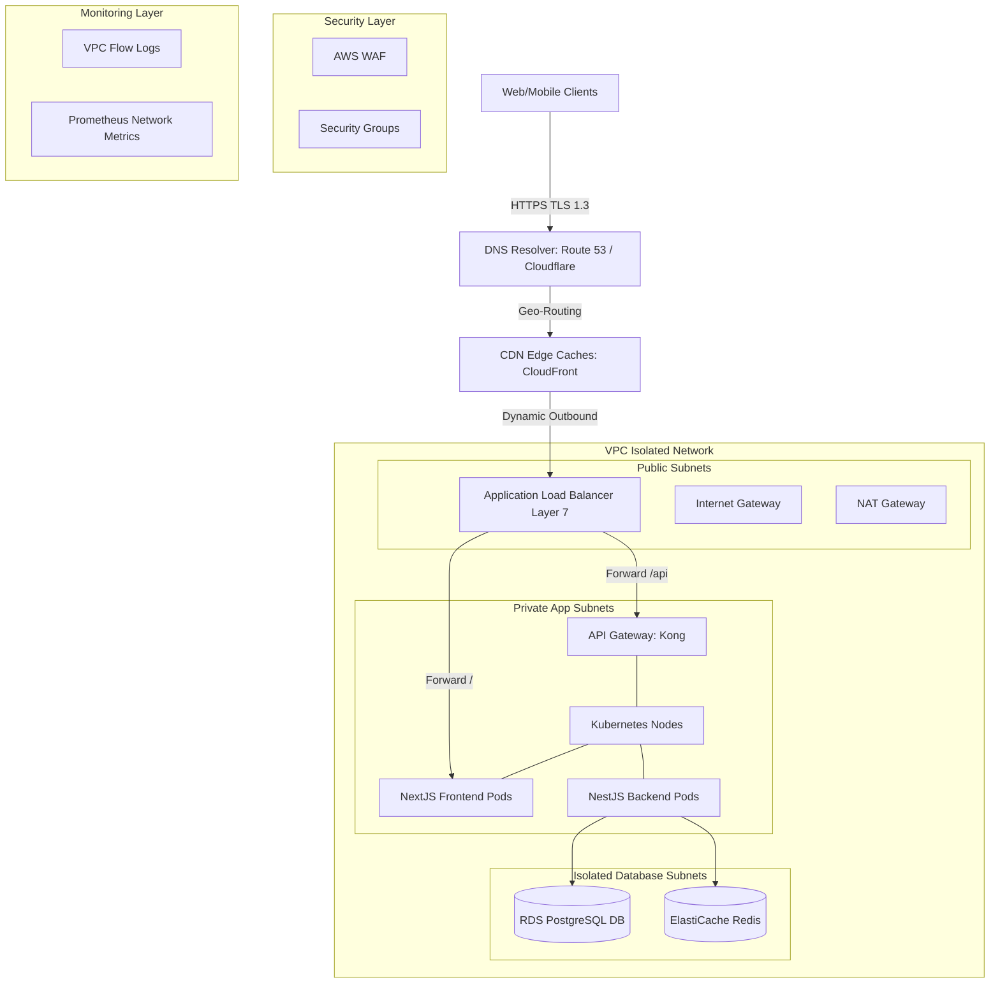
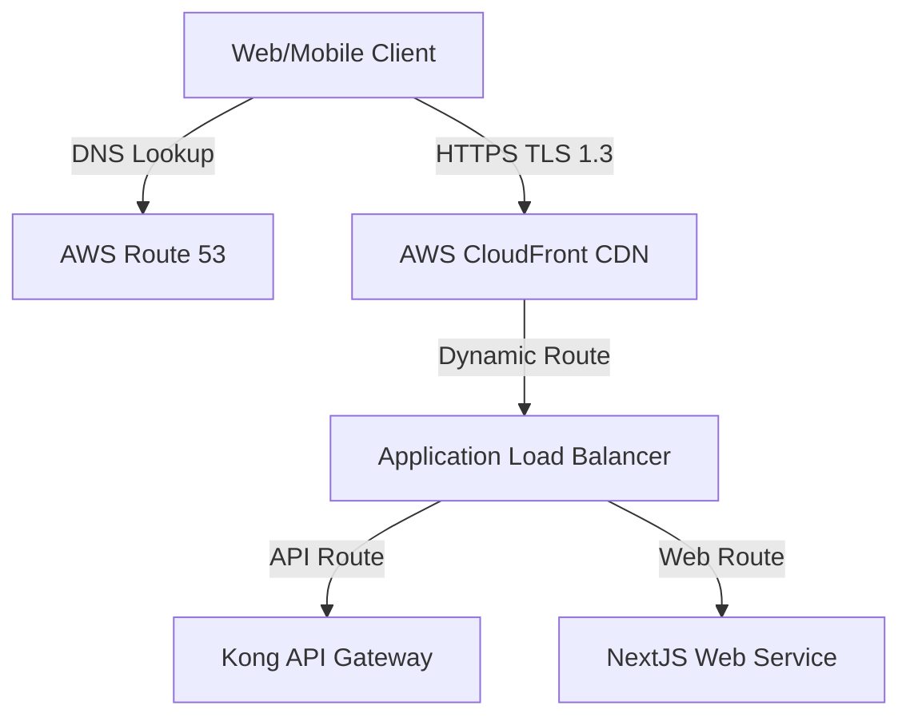
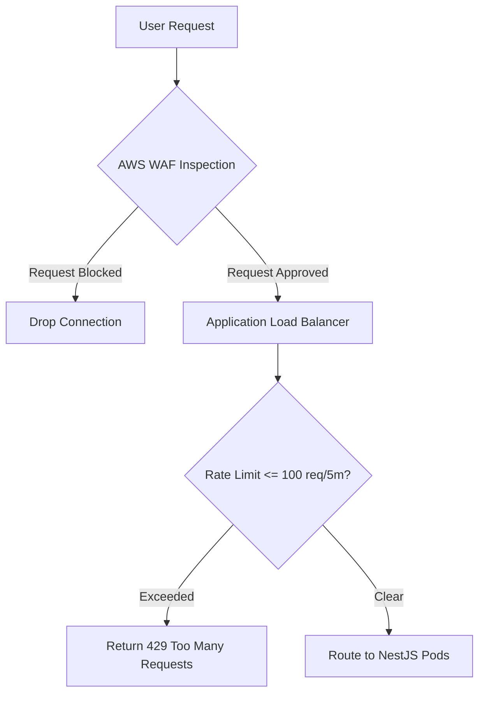
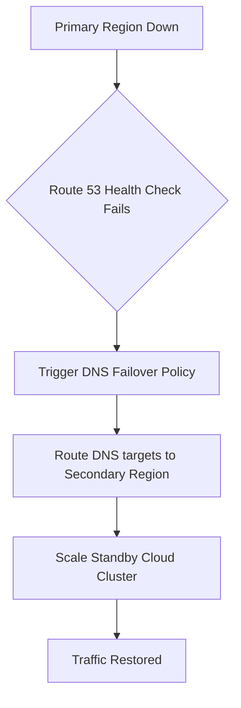

# ENTERPRISE CLOUD NETWORKING, LOAD BALANCING & TRAFFIC MANAGEMENT

**Project Name:** Enterprise SaaS Business Management Platform  
**Document Version:** 1.0.0 — Baseline Standard  
**Date:** July 13, 2026  
**Authors:** Principal Cloud Network Architect, Security Architect & SRE Lead  
**Classification:** Enterprise Internal — Unrestricted  
**Status:** 🏛️ APPROVED NETWORKING STANDARD  

---

## SECTION 1 — CLOUD NETWORKING PRINCIPLES

### 1.1 Why Networking is Critical for SaaS
In a multi-tenant cloud environment where multiple businesses execute real-time point-of-sale transactions and access financial reporting tools, network design is critical to support operations:
*   **User Connectivity:** Ensures cashiers and store managers can access the platform reliably.
*   **Security:** Restricts network access using isolated subnet groups, database firewalls, and encrypted communication pathways.
*   **Performance:** Minimizes latency for users by caching static assets at global CDN edge locations.
*   **Availability:** Distributes load balancer pools across multiple zones to eliminate single points of failure.
*   **Scalability:** Allows subnet and IP allocation strategies to scale as tenant counts grow.

### 1.2 Network Goals
```
SECURITY (Zero Public DB access) ──> PERFORMANCE (Latency <= 50ms) ──> RELIABILITY (99.99% Uptime) ──> SCALABILITY
```

---

## SECTION 2 — ENTERPRISE CLOUD NETWORK ARCHITECTURE

Our network architecture terminates public connections at edge firewalls and routes request streams through isolated subnets.



---

## SECTION 3 — VPC ARCHITECTURE

We partition cloud resources into isolated Virtual Private Clouds (VPC) to prevent configuration drift and restrict access.

```
VPC IP Block (10.0.0.0/16)
  ├── Public Subnets (10.0.1.0/24 - Internet Routing)
  ├── Private App Subnets (10.0.10.0/20 - Kubernetes Compute)
  └── Private DB Subnets (10.0.20.0/24 - Database Isolation)
```

### 3.1 VPC Subnet Segregation
*   **Public Subnet:** Hosts edge load balancers, NAT gateways, and VPN bastion hosts. These nodes are assigned public IP addresses and route traffic directly through internet gateways.
*   **Private Application Subnet:** Hosts Kubernetes worker nodes and backend application pods. These nodes utilize private IP addresses, routing outbound traffic through NAT gateways.
*   **Private Database Subnet:** Hosts PostgreSQL databases and Redis cache servers. These instances are isolated from external networks, blocking all direct outbound internet routes.

---

## SECTION 4 — SUBNET DESIGN

We deploy subnet configurations across three Availability Zones (AZ) to ensure high availability.

### 4.1 Subnet IP Allocation Scheme

| Subnet Group | CIDR Allocation Range | Availability Zone Mapping | Target Hosted Resource |
| :--- | :--- | :--- | :--- |
| `public-az1` | `10.0.1.0/24` | `us-east-1a` | Application Load Balancer / NAT Gateway |
| `public-az2` | `10.0.2.0/24` | `us-east-1b` | Application Load Balancer / NAT Gateway |
| `private-app-az1` | `10.0.16.0/20` | `us-east-1a` | EKS Worker Nodes / NestJS / Next.js Pods |
| `private-app-az2` | `10.0.32.0/20` | `us-east-1b` | EKS Worker Nodes / NestJS / Next.js Pods |
| `private-db-az1` | `10.0.2.0/24` | `us-east-1a` | Managed Amazon RDS PostgreSQL DB |
| `private-db-az2` | `10.0.3.0/24` | `us-east-1b` | Managed Amazon RDS PostgreSQL DB |

---

## SECTION 5 — INTERNET CONNECTIVITY

*   **Internet Gateways (IGW):** Expose public subnets to external networks, allowing load balancers to receive client traffic.
*   **Routing Flows:** Users send requests to the load balancer via the IGW. The load balancer terminates TLS connections and forwards requests to private application nodes.

---

## SECTION 6 — NAT GATEWAY STRATEGY

*   **NAT Gateways:** Enable containers in private subnets to send outbound requests (e.g., executing Stripe API calls or sending SendGrid emails) while blocking inbound connections from the internet.
*   **Routing Paths:** Private NestJS app containers route outbound requests through the local private subnet router to the NAT Gateway, which forwards the traffic to the internet gateway.

---

## SECTION 7 — FIREWALL & SECURITY RULES

We enforce network security by configuring firewalls to restrict inbound and outbound traffic.
*   **Inbound Traffic Rules:** Block all public traffic to port 22 (SSH) and database ports (5432). Allow public traffic only on port 443 (HTTPS) at the application load balancer.
*   **Outbound Traffic Rules:** Allow containers to connect only to validated external API domains, blocking unauthorized outbound data transfers.

---

## SECTION 8 — SECURITY GROUP STRATEGY

We use security groups as virtual firewalls to control traffic for cloud resources.

### 8.1 Security Group Rules

| Target Resource | Direction | Allowed Port | Source Identifier | Purpose |
| :--- | :--- | :--- | :--- | :--- |
| **Load Balancer** | Inbound | `TCP 443` | `0.0.0.0/0` | Accept public user traffic over HTTPS. |
| **Load Balancer** | Outbound | `TCP 3000 / 4000` | `sg-private-app` | Forward user requests to application nodes. |
| **Application Nodes**| Inbound | `TCP 3000 / 4000` | `sg-load-balancer` | Accept traffic forwarded from load balancers. |
| **Database Instance**| Inbound | `TCP 5432` | `sg-private-app` | Allow backend applications to access database pools. |
| **Database Instance**| Outbound | All Blocked | N/A | Prevent database nodes from initiating outbound traffic. |

---

## SECTION 9 — DNS ARCHITECTURE

We manage domain name routing using cloud DNS providers.
*   **A Records:** Map primary domains (e.g., `saas.com`) to CloudFront CDN endpoints.
*   **CNAME Records:** Route tenant subdomains (e.g., `store-a.saas.com`) to the application load balancer.
*   **Tooling:** AWS Route 53 and Cloudflare DNS.

---

## SECTION 10 — CDN ARCHITECTURE

We use Content Delivery Networks (CDNs) to cache static assets close to users, reducing backend server loads.
*   **Static Caching:** Configure CDN edge locations to cache Next.js bundle JS, CSS, and image files.
*   **Dynamic Routing:** Forward dynamic API paths (e.g., `/api/*`) directly to the application load balancer.
*   **Tooling:** AWS CloudFront and Cloudflare CDN.

---

## SECTION 11 — LOAD BALANCING STRATEGY

We balance cluster workloads using layered load balancing configurations:
*   **Layer 4 (TCP):** Distribute connection traffic across ingress controller pods.
*   **Layer 7 (HTTP):** Route HTTP requests to target services based on URL paths (e.g., routing `/api` requests to NestJS APIs).
*   **Load Balancing Algorithms:** Use Least Connection algorithms to distribute traffic evenly across healthy pods.

---

## SECTION 12 — REVERSE PROXY ARCHITECTURE

We deploy Nginx reverse proxies to manage connection security and static assets.
*   **SSL Termination:** Terminate SSL/TLS certificates at the proxy layer, reducing encryption overhead on application pods.
*   **Security Headers:** Inject security headers (`Content-Security-Policy`, `X-Frame-Options`) into all outgoing HTTP responses.

---

## SECTION 13 — API GATEWAY TRAFFIC MANAGEMENT

We use API gateways to manage API traffic, authenticate requests, and protect backend services.
*   **Rate Limiting:** Protect APIs from denial-of-service (DDoS) attacks and brute force attempts.
*   **Request Routing:** Direct API requests to backend microservices based on request paths.
*   **Tooling:** Kong and NGINX Ingress Controller.

---

## SECTION 14 — SSL/TLS SECURITY

*   **HTTPS Enforcement:** Redirect all HTTP traffic to HTTPS (port 443) and enforce TLS 1.3 encryption protocols.
*   **Certificate Management:** Automate certificate renewals using AWS Certificate Manager (ACM) or Let's Encrypt.

---

## SECTION 15 — TRAFFIC MANAGEMENT

We configure traffic management rules to ensure platform reliability.
*   **Rate Limiting:** Restrict client requests to a maximum of 100 requests per 5 minutes per IP address.
*   **Circuit Breakers:** Prevent external service failures (e.g., payment provider outages) from affecting backend API nodes.
*   **Retry Policies:** Configure client applications to retry failed requests using exponential backoff schedules.

---

## SECTION 16 — NETWORK OBSERVABILITY

We monitor network performance metrics using dedicated tracking tools.
*   **Traffic Metrics:** Monitor network bandwidth usage, request latencies, and TCP connection drops.
*   **Observability Logs:** Audit network traffic configurations using VPC Flow Logs.
*   **Tooling:** Prometheus, Grafana, AWS CloudWatch.

---

## SECTION 17 — MULTI-REGION NETWORK STRATEGY

We manage global user traffic using multi-region routing configurations.
*   **Geo-Routing:** Route user requests to the closest regional cloud cluster using Route 53 routing rules.
*   **Disaster Recovery:** Automate failover routing to backup regions if the primary hosting region experiences an outage.

---

## SECTION 18 — NETWORK DISASTER RECOVERY

We maintain network disaster recovery plans to recover platform access after outages.
*   **Regional Failover:** Route DNS targets to standby regions if the primary region experiences an outage.
*   **Infrastructure Recovery:** Automate VPC and network infrastructure setups in secondary regions using Terraform templates.

---

## SECTION 19 — NETWORK TOOL STACK REFERENCE

Our standardized network tools are detailed in the table below:

| Category | Selected Tool | Purpose |
| :--- | :--- | :--- |
| **DNS Resolver** | **AWS Route 53** | Manages domain names and routes traffic using geo-proximity policies. |
| **Global CDN** | **AWS CloudFront** | Caches static assets close to users to reduce latency. |
| **Load Balancer** | **AWS ALB Layer 7** | Routes external HTTP requests to internal cluster nodes. |
| **API Gateway** | **Kong API Gateway** | Manages API traffic, rate limits requests, and authenticates users. |
| **Reverse Proxy** | **NGINX** | Manages SSL/TLS termination and routes local connections. |
| **IaC Provisioner** | **Terraform** | Automates VPC creation and security group configurations. |
| **Network Audits** | **VPC Flow Logs** | Audits network traffic configurations and security groups. |

---

## SECTION 20 — FINAL NETWORKING MERMAID DIAGRAMS

### 20.1 Enterprise Cloud Network Architecture


### 20.2 VPC Security Architecture
```
[ Internet Gateway ]
        │
  [ Public Subnet: ALB / NAT ] (Security Group: Allow TCP 443)
        │
  [ Private App Subnet: NextJS / NestJS ] (Security Group: Allow traffic only from ALB)
        │
  [ Private DB Subnet: PostgreSQL ] (Security Group: Allow traffic only from NestJS App)
```

### 20.3 Traffic Flow Architecture


### 20.4 Load Balancing Architecture
```
                        Application Load Balancer
                       /           |           \
                      ▼            ▼            ▼
                [ NestJS Pod A ] [ NestJS Pod B ] [ NestJS Pod C ]
                (Zone: us-east-1a) (Zone: us-east-1b) (Zone: us-east-1c)
```

### 20.5 Disaster Recovery Network Flow


---

*End of Enterprise Cloud Networking, Load Balancing & Traffic Management*  
*Document maintained by: Principal Cloud Network Architect | Status: Approved Standard*
