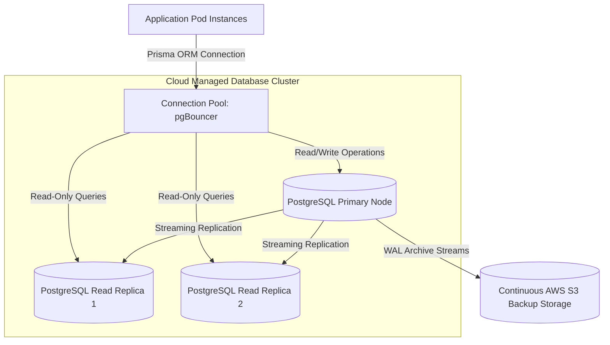
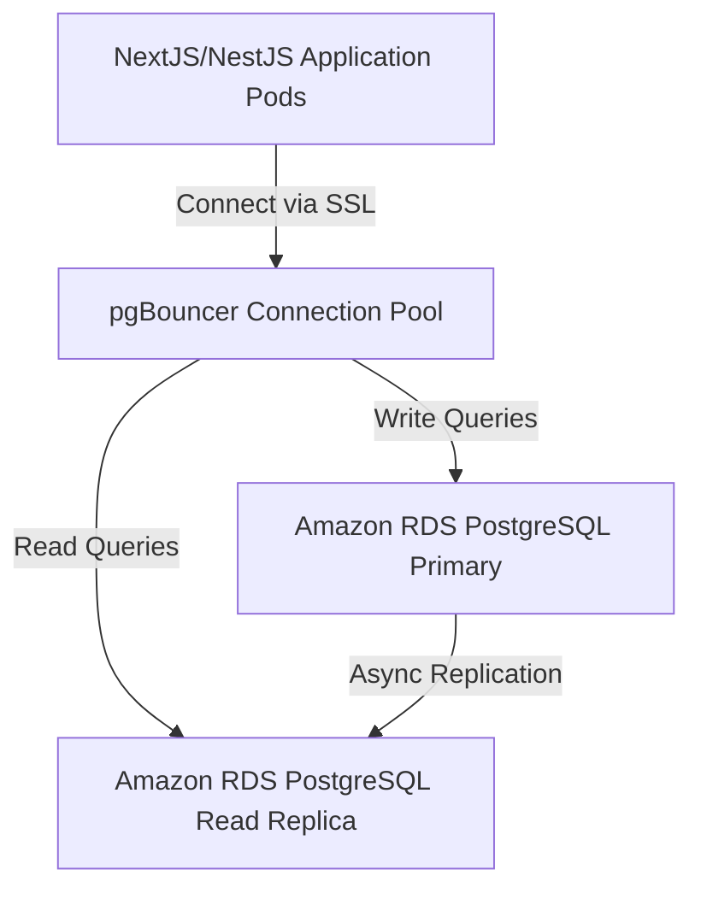
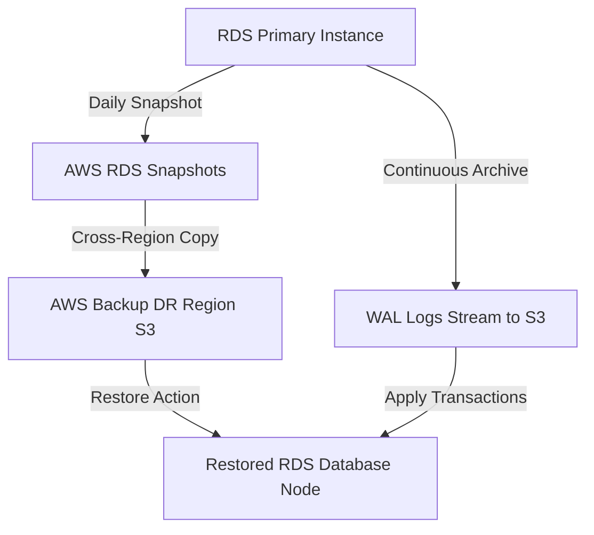
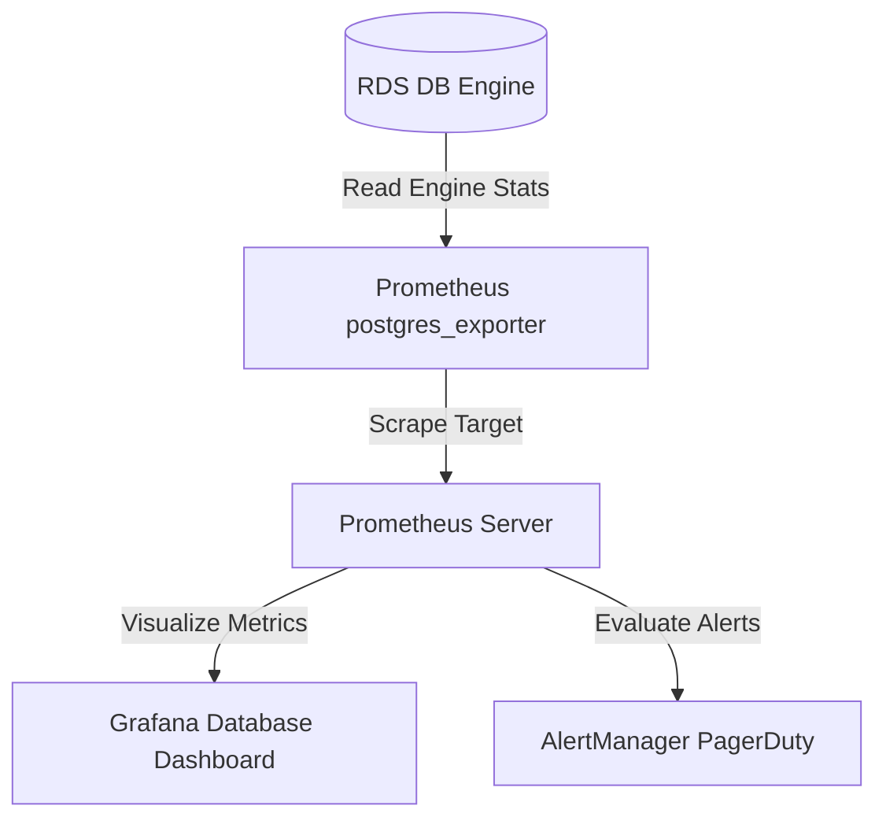

# ENTERPRISE CLOUD DATABASE OPERATIONS & DATA INFRASTRUCTURE STRATEGY

**Project Name:** Enterprise SaaS Business Management Platform  
**Document Version:** 1.0.0 — Baseline Standard  
**Date:** July 13, 2026  
**Authors:** Principal Database Architect, Cloud Database Engineer & SRE Lead  
**Classification:** Enterprise Internal — Unrestricted  
**Status:** 🏛️ APPROVED DATABASE STANDARD  

---

## SECTION 1 — DATABASE ARCHITECTURE PRINCIPLES

### 1.1 Why Database Architecture Matters
For a multi-tenant SaaS platform where multiple companies process critical checkout sales, manage stock, and execute double-entry accounting ledgers, the data platform represents the absolute source of truth.
*   **Data Consistency:** Enforcing ACID guarantees across POS checkout nodes and payment records.
*   **Performance:** Maintaining average query response times $\le 10\text{ ms}$ for search routes.
*   **Security:** Enforcing database-level Row-Level Security (RLS) policies to prevent cross-tenant data access.
*   **Reliability:** Maintaining automated database failover states to prevent merchant checkouts from failing during regional outages.

### 1.2 Data Platform Goals
```
AVAILABILITY (RDS Multi-AZ Failover) ──> PERFORMANCE (pgBouncer) ──> SECURITY (RLS Isolation) ──> SCALABILITY (Read Replicas)
```

---

## SECTION 2 — PRODUCTION POSTGRESQL ARCHITECTURE

Our database tier routes requests from backend API instances through pgBouncer connection pools to replicated database instances.



---

## SECTION 3 — MULTI-TENANT DATABASE MODEL COMPARISON

We evaluated three multi-tenant data isolation models to balance scalability, security, and hosting costs.

### 3.1 SaaS Tenant Data Model Evaluation

| Model Profile | Operational Cost | Security Isolation | Scalability Limit | Maintenance Overhead |
| :--- | :--- | :--- | :--- | :--- |
| **Model 1:** Shared DB + Shared Schema | **Lowest** (Shared compute and storage instances) | **Logical** (Isolated using RLS query filters) | **High** (Limited by single instance sizes) | **Lowest** (Single schema migration runs) |
| **Model 2:** Shared DB + Separate Schema | **Moderate** | **Logical** (Isolated using schema permissions) | **Moderate** (Performance degrades as schema count grows) | **High** (Must run migrations across all schemas) |
| **Model 3:** Separate DB Per Tenant | **Highest** (Provision separate database servers) | **Physical** (Absolute isolation on separate servers) | **Highest** (Scale out dynamically) | **Highest** (Must coordinate updates across databases) |

### 3.2 Architectural Recommendation
*   **Startup to Growth Phase:** Deploy **Model 1 (Shared Database + Shared Schema)**, using PostgreSQL Row-Level Security (RLS) policies to enforce tenant isolation at the query engine level.
*   **Enterprise Growth Phase:** Migrate high-volume tenants to dedicated databases (**Model 3**) using feature flags to route requests, balancing hosting costs and isolation needs.

---

## SECTION 4 — DATABASE DEPLOYMENT STRATEGY

### 4.1 Managed RDS vs. Self-Managed Kubernetes Databases

| Metric | Managed Database (AWS RDS / Cloud SQL) | Self-Managed Database (K8s StatefulSet) |
| :--- | :--- | :--- |
| **Reliability** | 🟢 **99.99%** (Automated multi-AZ replica promotions). | 🟡 **99.9%** (Manual node failover setups required). |
| **Cost** | 🟡 **Higher** (Includes cloud management overhead costs). | 🟢 **Lower** (Utilizes raw virtual compute instances). |
| **Operations** | 🟢 **Zero Overhead** (Automated backups, scaling, and patching). | 🔴 **High Overhead** (Requires dedicated SRE database teams). |

**Decision:** Deploy applications on managed cloud database engines (**AWS RDS PostgreSQL**) to minimize operational overhead and guarantee high availability.

---

## SECTION 5 — DATABASE CONNECTION MANAGEMENT

PostgreSQL allocates a dedicated backend process for each client connection, consuming host RAM. High-volume application servers can exhaust connection limits.

```
[ NestJS Pod Replicas ] ──> [ Prisma Connections ] ──> [ pgBouncer Pools ] ──> [ PostgreSQL Engine ]
```

### 5.1 Connection Pooling Rules
*   **pgBouncer:** Deploy pgBouncer proxies to manage connection pooling, reducing active database connection overhead on PostgreSQL engines.
*   **Pooling Mode:** Use **Transaction Mode** in pgBouncer to allow multiple backend instances to share connections for short transaction blocks.

---

## SECTION 6 — DATABASE PERFORMANCE OPTIMIZATION

### 6.1 Query Optimization Rules
*   **Indexing Strategy:** Enforce B-Tree indexes on foreign key columns and create composite indexes on search query variables (e.g., `tenant_id` + `created_at`).
*   **Slow Query Auditing:** Enable `pg_stat_statements` on databases to track execution statistics and flag slow queries.
*   **Prisma Caching:** Cache static product catalogs and workspace metadata in Redis to reduce database read loads.

---

## SECTION 7 — DATABASE REPLICATION STRATEGY

We scale database reads and support disaster recovery plans using **Streaming Replication**.
*   **Primary Node:** Processes write operations and streams transaction logs (WAL) to read replicas.
*   **Read Replicas:** Expose read-only endpoints, allowing us to route reporting queries away from the primary database instance.

---

## SECTION 8 — DATABASE BACKUP STRATEGY

We run automated backups to protect database states and restore services after failures.
*   **Point-in-Time Recovery (PITR):** Archive Write-Ahead Logs (WAL) continuously to Amazon S3 to support restore points.
*   **Daily Snapshots:** Create daily backup snapshots of database instances, replicating backups to secondary cloud regions to support recovery plans.

---

## SECTION 9 — DISASTER RECOVERY STRATEGY

If the primary database instance fails, we promote healthy read replicas to restore service.
*   **RTO Target:** $\le 5\text{ minutes}$ (time taken to detect database failure and promote a read replica).
*   **RPO Target:** $\le 1\text{ minute}$ (maximum data loss from restore point).

---

## SECTION 10 — DATABASE SECURITY

We enforce security controls to protect databases and tenant records from unauthorized access.
*   **Network Isolation:** Host databases in private subnets, blocking direct inbound internet routing.
*   **Connection Encryption:** Enforce TLS 1.3 encryption on all connections to database pools.
*   **Secrets Management:** Retrieve database credentials at runtime from AWS Secrets Manager, rotating access passwords every 90 days.

---

## SECTION 11 — DATABASE MIGRATION STRATEGY

We manage database schema migrations using **Prisma Migrations**.
*   **Zero-Downtime Rule:** Schema migrations must be backwards-compatible to prevent active application nodes from failing during releases.
*   **Migration Verification:** Execute and validate migrations on staging databases before running schema updates on production instances.

---

## SECTION 12 — DATABASE MONITORING

We monitor database performance metrics to identify query bottlenecks and resource constraints.
*   **Key Performance Indicators (KPIs):** Monitor average query latency, database connection counts, CPU load, and disk storage usage.
*   **Tooling:** Prometheus PostgreSQL Exporter and Grafana dashboards.

---

## SECTION 13 — DATABASE SCALING STRATEGY

We scale database capacities using vertical and horizontal scaling:
*   **Vertical Scaling:** Upgrade database instance sizes (vCPUs, RAM) as user transactions grow.
*   **Horizontal Scaling:** Add read replicas to scale query throughput, and partition large transaction tables to maintain search speeds.

---

## SECTION 14 — DATA ARCHITECTURE EVOLUTION

Our data platform architecture scales to support growth:

```
[ STAGE 1: Single Postgres ] ──► [ STAGE 2: RDS Read Replicas ] ──► [ STAGE 3: TimescaleDB / DW ]
```

1.  **Stage 1 (Launch):** Host applications on a single cloud PostgreSQL instance.
2.  **Stage 2 (Growth):** Add read replicas to distribute query workloads.
3.  **Stage 3 (Enterprise):** Partition large transaction tables, and route history logs to analytical data warehouses (AWS Redshift).

---

## SECTION 15 — DATA GOVERNANCE

*   **Data Retention:** Enforce retention rules to archive transaction logs older than 7 years to glacier storage.
*   **Data Privacy:** Encrypt sensitive columns (such as tax files or client credentials) before saving records.

---

## SECTION 16 — DATABASE OPERATIONS WORKFLOW

We follow a structured operations workflow to resolve database performance issues:

```
Monitoring Alert ──> Slow Query Detected ──> Explain Query Plan ──> Add Index / Refactor ──> Verify Latency
```

---

## SECTION 17 — DATABASE TOOL STACK REFERENCE

Our standardized database tools are detailed in the table below:

| Category | Selected Tool | Purpose |
| :--- | :--- | :--- |
| **Database Engine** | **PostgreSQL (16)** | Relational database engine supporting RLS and JSON types. |
| **ORM Tool** | **Prisma ORM** | Type-safe database mapping and schema migrations. |
| **Connection Proxy** | **pgBouncer** | Connection pooling proxy for PostgreSQL instances. |
| **Database Console** | **pgAdmin / DBeaver** | Graphic user interface for database management. |
| **Execution Metrics**| **pg_stat_statements** | PostgreSQL extension that tracks slow query execution times. |
| **Metrics Collector**| **Prometheus PG Exporter** | Collects database performance metrics. |
| **Managed Hosting** | **AWS RDS** | Cloud host offering automated failovers and backups. |

---

## SECTION 18 — FINAL DATABASE ARCHITECTURE MERMAID DIAGRAMS

### 18.1 Production PostgreSQL Architecture


### 18.2 Multi-Tenant Database Architecture
```
  Multi-Tenant Shared Schema Database
    ├── [ Table: Tenants ] (tenant_id, company_name)
    ├── [ Table: Users ] (user_id, tenant_id, name)
    └── [ Table: Orders ] (order_id, tenant_id, total)
          └── RLS: CREATE POLICY tenant_isolation ON orders
                   USING (tenant_id = current_setting('app.tenant_id'))
```

### 18.3 Backup & Recovery Flow


### 18.4 Database Scaling Architecture
```
              NestJS Application Service (Prisma Routing Client)
                 /                                \
        [ Write Queries ]                  [ Read Queries ]
               /                                    \
              ▼                                      ▼
    [ pgBouncer Primary Port ]             [ pgBouncer Replica Port ]
              │                                      │
    [ RDS PostgreSQL Primary ]             [ RDS Read Replica Instances ]
```

### 18.5 Database Monitoring Architecture


---

*End of Enterprise Cloud Database Operations & Data Infrastructure Strategy*  
*Document maintained by: Principal Database Architect | Status: Approved Database Standard*
