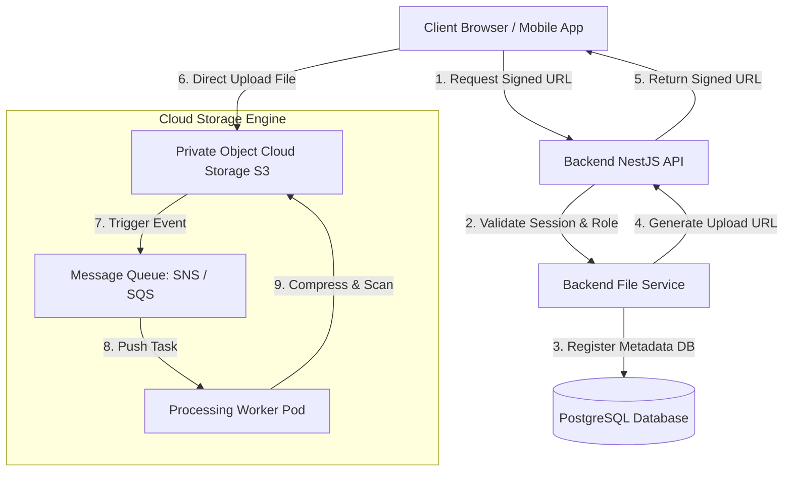
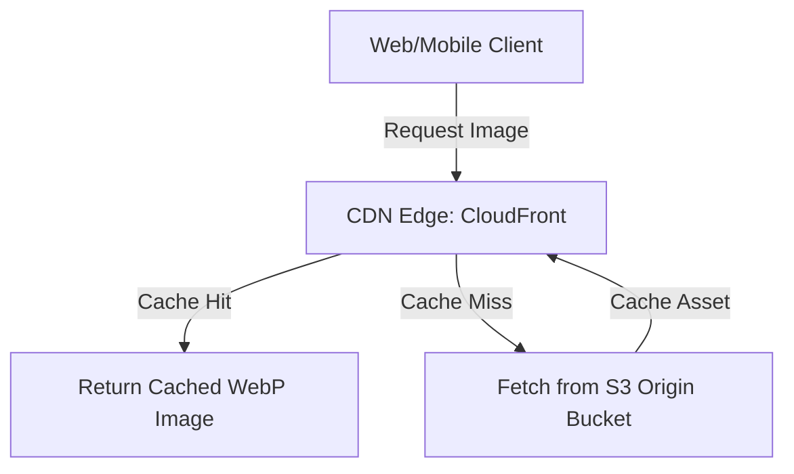
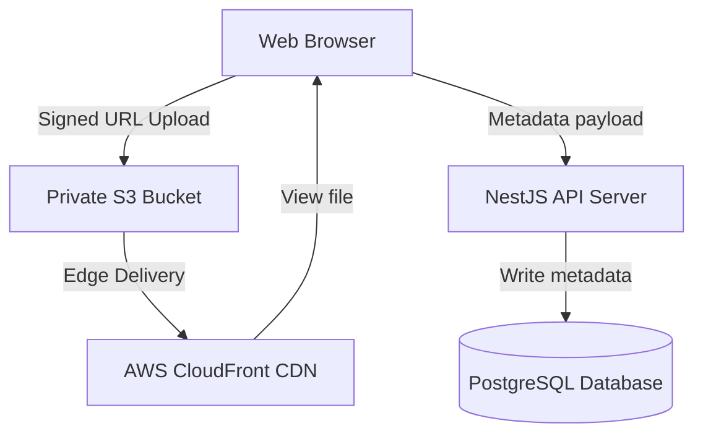
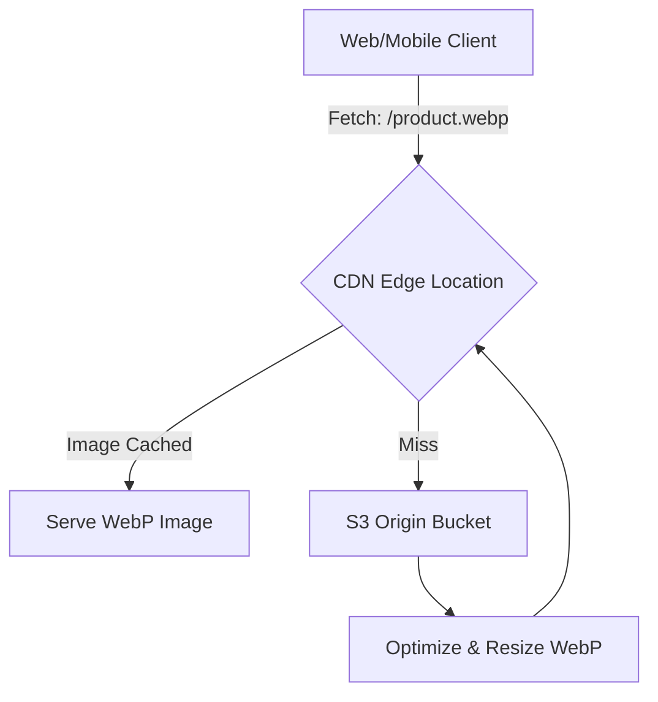
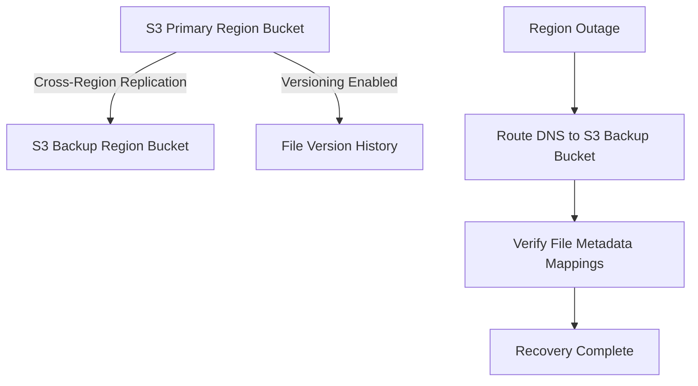

# ENTERPRISE CLOUD STORAGE, FILE MANAGEMENT & DATA LIFECYCLE STRATEGY

**Project Name:** Enterprise SaaS Business Management Platform  
**Document Version:** 1.0.0 — Baseline Standard  
**Date:** July 13, 2026  
**Authors:** Principal Cloud Storage Architect, Security Lead & DevOps Architect  
**Classification:** Enterprise Internal — Unrestricted  
**Status:** 🏛️ APPROVED STORAGE STANDARD  

---

## SECTION 1 — CLOUD STORAGE PRINCIPLES

### 1.1 Why SaaS Platforms Need Cloud Storage
Operating a multi-tenant business management system requires storing business documents (invoices, receipts, legal contracts), employee profiles, and inventory photos. Saving these files directly on web servers introduces availability risk.
*   **Scalability:** Decouples file capacity limits from application host volumes, allowing capacities to scale horizontally.
*   **Reliability:** Guarantees 99.999999999% (eleven 9s) of data durability by replicating files across multiple physical facilities.
*   **Global Access:** Serves static assets to cashiers and store managers close to their physical locations using edge networks.
*   **Cost Efficiency:** Moves old invoices and logs to low-cost archival storage classes automatically.

### 1.2 Storage Model Comparison
```
TRADITIONAL SERVER STORAGE                 CLOUD OBJECT STORAGE
┌──────────────────────┐               ┌──────────────────────┐
│ Application Web Pod  │               │ Application Web Pod  │
├──────────────────────┤               ├──────────────────────┤
│ Local Block Storage  │               │ HTTP API Gateway S3  │
├──────────────────────┤               ├──────────────────────┤
│ Single Server Node   │               │ Multi-Facility Dur   │
└──────────────────────┘               └──────────────────────┘
```

---

## SECTION 2 — STORAGE ARCHITECTURE

Our storage architecture isolates object uploads using secure client URLs and database metadata mapping.



---

## SECTION 3 — OBJECT STORAGE STRATEGY

We use private storage buckets to host client files, utilizing tenant directories to ensure isolation.
*   **Bucket Isolation:** Group business objects into primary buckets and configure path routing rules based on tenant identifiers.

### 3.1 Tenant Directory Structure
```
s3://saas-tenant-files/
  ├── tenant-a8f3b2d1/              # Unique Tenant Identifier Partition
  │     ├── logos/                  # Brand assets & receipts
  │     ├── products/               # Product catalog images (WebP format)
  │     ├── invoices/               # Read-only customer invoice PDFs
  │     ├── reports/                # Excel/CSV audit exports
  │     └── documents/              # Employee identity files
  └── tenant-b9c4e3f2/
```

---

## SECTION 4 — FILE UPLOAD ARCHITECTURE

We route user uploads through validation pipelines to protect platform hosts from malware and excessive storage usage.

```
[ User Action ] ──► [ Frontend Validation ] ──► [ Virus Scan Check ] ──► [ S3 Signed URL ] ──► [ DB Metadata Register ]
```

### 4.1 Upload Validation Rules
*   **Size Restrictions:** Restrict product images to $2\text{ MB}$ and document PDFs to $10\text{ MB}$.
*   **Format Whitelists:** Accept only defined file extensions (`.jpg`, `.png`, `.webp`, `.pdf`, `.csv`, `.xlsx`).
*   **Malware Protection:** Pass dynamic upload uploads through ClamAV virus scanning containers before saving them permanently to S3.

---

## SECTION 5 — FILE PROCESSING PIPELINE

We process large uploads asynchronously using background workers to optimize backend API performance.
*   **Queue Triggers:** When files upload successfully, S3 streams creation events to message queues (SQS).
*   **Worker Engines:** Background workers consume queue events to convert image formats, compile CSV reports, and create file thumbnails.

---

## SECTION 6 — IMAGE MANAGEMENT STRATEGY

We optimize image delivery speeds to keep page loads fast for POS cashiers.
*   **Format Standard:** Compress inventory photos and business logos into WebP format, reducing file sizes by up to $30\%$.
*   **Auto-Resizing:** Automatically generate product photo thumbnail sizes ($150\text{px} \times 150\text{px}$) for search pages.
*   **Global Delivery:** Server assets through Content Delivery Networks (CDNs) to reduce load latency.

---

## SECTION 7 — DOCUMENT MANAGEMENT

We store business invoice PDFs and contracts securely.
*   **Write Once Read Many (WORM):** Configure target buckets to enforce Object Lock policies, preventing users from altering issued billing receipts.
*   **Metadata Tagging:** Tag files with client references (`tenant_id`, `audit_year`) to support search filters.

---

## SECTION 8 — CDN INTEGRATION

We use global CDN networks to cache static assets, minimizing origin database traffic.



---

## SECTION 9 — STORAGE SECURITY

We enforce encryption and access controls across all storage resources.
*   **Encryption at Rest:** Encrypt objects using 256-bit Advanced Encryption Standard (AES-256) keys.
*   **Encryption in Transit:** Enforce HTTPS connection protocols using TLS 1.3 encryption.
*   **Access Credentials:** Generate temporary, expiring signed upload URLs (active for 15 minutes) to prevent unauthorized uploads.
*   **Security Logs:** Audit file read and write operations using CloudTrail logs.

---

## SECTION 10 — ACCESS CONTROL STRATEGY

We verify file permissions against tenant roles before generating access URLs.
*   **Signed Access Token Flows:** Owners can access billing spreadsheets, employees can access product photos, and external guest connections are blocked.

---

## SECTION 11 — DATA LIFECYCLE MANAGEMENT

We configure lifecycle rules to move old objects to lower-cost storage classes.

```
[ Active Hot Storage (S3 Standard) ] ──► [ 90 Days (S3 IA) ] ──► [ 180 Days (Glacier) ] ──► [ 7 Years (Purge) ]
```

### 11.1 Data Tier Storage Rules

| Storage Tier Class | Minimum Retention Period | Target Storage Profiles | Cost Factor (Per GB) |
| :--- | :--- | :--- | :--- |
| **Hot Storage** (S3 Standard) | Immediate | Product catalog images, business logos, active user photos. | **$100\%$ Base Cost** |
| **Warm Storage** (S3 IA) | 30 Days | Documents from previous months, inactive inventory files. | **$50\%$ Cost Saving** |
| **Cold Storage** (S3 Glacier) | 90 Days | Historical billing registers and operational logs. | **$80\%$ Cost Saving** |
| **Archived Tier** (Deep Glacier) | 180 Days | Annual financial compliance summaries (retained for 7 years). | **$95\%$ Cost Saving** |

---

## SECTION 12 — BACKUP STRATEGY

We protect data states using bucket replication configurations.
*   **Cross-Region Replication:** Replicate production buckets to a secondary backup region in real-time.
*   **Version Control:** Enable bucket versioning to recover files after accidental deletions.

---

## SECTION 13 — DISASTER RECOVERY

If the hosting region experiences an outage, we failover to our secondary storage endpoints.
*   **Recovery Steps:** Identify primary region failure $\rightarrow$ route client DNS targets to secondary S3 buckets $\rightarrow$ restore database file mappings to point to replicated hosts.

---

## SECTION 14 — COST OPTIMIZATION

We monitor storage costs and clean up unused resources:
*   **Lifecycle Rules:** Move logs to Glacier automatically after 30 days.
*   **Duplicate Detection:** Run background workers to delete duplicate product catalog uploads.
*   **Multipart Cleanup:** Configure rules to delete incomplete file uploads after 7 days.

---

## SECTION 15 — STORAGE OBSERVABILITY

We monitor storage performance using Prometheus metrics and Grafana dashboards.
*   **Metrics:** Monitor storage bucket volumes, network bandwidth usage, upload latency, and request HTTP error rates.

---

## SECTION 16 — NESTJS FILE SERVICE INTERFACE

Our backend applications process files using a standardized File Service API.

```typescript
export interface FileUploadPayload {
  tenantId: string;
  fileName: string;
  mimeType: string;
  fileSize: number;
}

export interface SignedUrlResponse {
  uploadUrl: string;
  fileKey: string;
  expiresIn: number;
}

export interface IFileStorageService {
  generateUploadUrl(payload: FileUploadPayload): Promise<SignedUrlResponse>;
  getFileUrl(fileKey: string): Promise<string>;
  deleteFile(fileKey: string): Promise<boolean>;
  validateFileType(mimeType: string): boolean;
}
```

---

## SECTION 17 — STORAGE TOOL STACK REFERENCE

Our standardized storage tools are detailed in the table below:

| Category | Selected Tool | Purpose |
| :--- | :--- | :--- |
| **Object Host** | **AWS S3 / Cloudflare R2** | Durable, multi-tenant cloud storage bucket host. |
| **Local Mock Engine** | **MinIO Object Server** | Local S3-compatible service used for development testing. |
| **Content Delivery** | **AWS CloudFront** | Caches and serves static assets close to users. |
| **IaC Provisioner** | **Terraform** | Automates bucket creations and access control policies. |
| **Secrets Engine** | **HashiCorp Vault** | Secures bucket access credentials and API keys. |
| **Malware Scanner** | **ClamAV Engine** | Scans uploaded files for malware. |
| **Metrics Collector**| **Prometheus / Grafana** | Monitors storage volumes and bucket access metrics. |

---

## SECTION 18 — FINAL STORAGE ARCHITECTURE DIAGRAMS

### 18.1 Cloud Storage Architecture


### 18.2 File Upload Processing Flow
```
[ User Select File ] ──► [ Check Size < 10MB ] ──► [ Run ClamAV Scan ] ──► [ Get S3 Signed URL ] ──► [ Direct S3 Push ]
```

### 18.3 CDN Delivery Architecture


### 18.4 Data Lifecycle Flow
```
[ Active Upload ] ──► [ 90 Days Standard ] ──► [ Move to S3 Standard-IA ] ──► [ Move to Glacier ] ──► [ 7 Years: Auto Purge ]
```

### 18.5 Backup Recovery Architecture


---

*End of Enterprise Cloud Storage, File Management & Data Lifecycle Strategy*  
*Document maintained by: Principal Cloud Storage Architect | Status: Approved Storage Standard*
