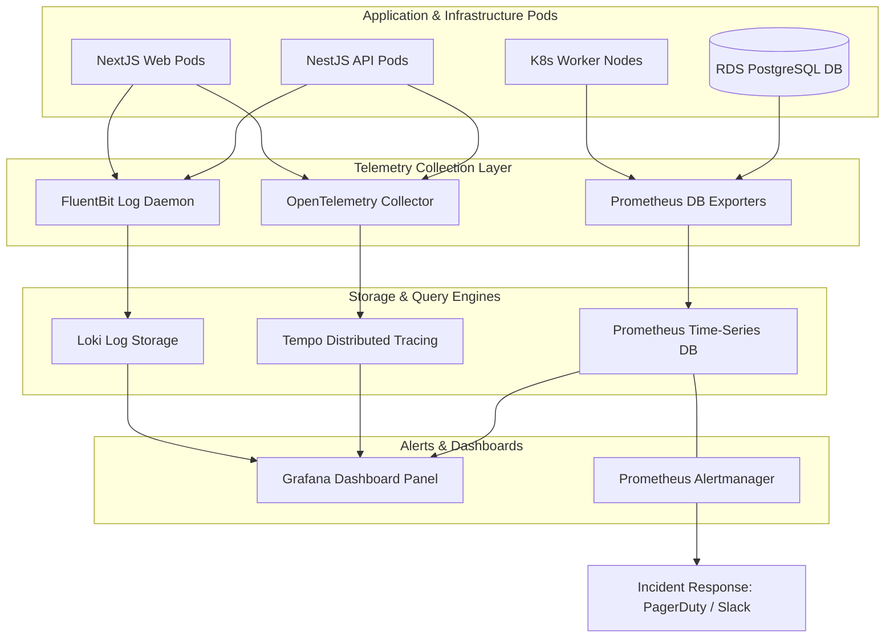
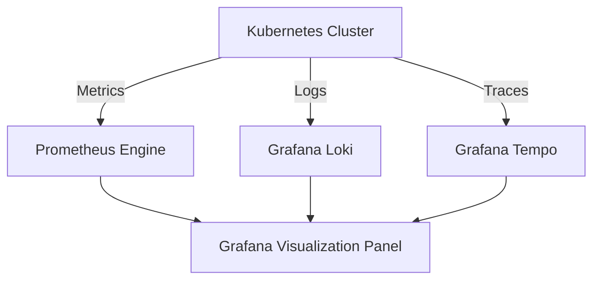
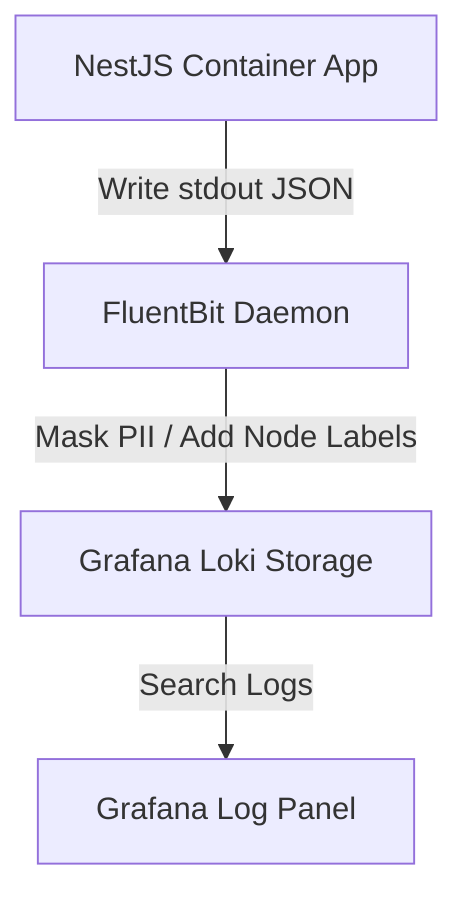
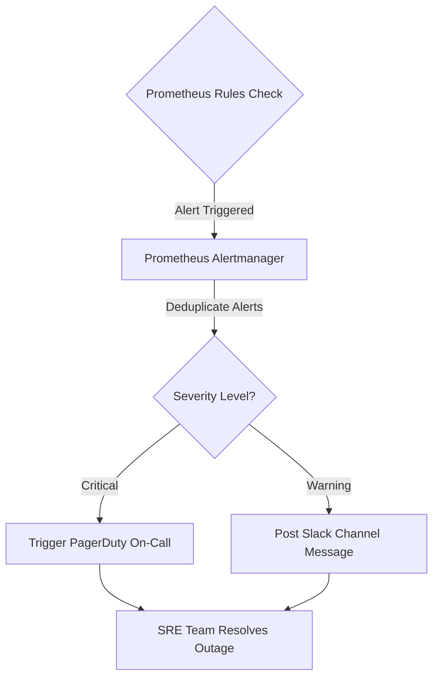

# ENTERPRISE CLOUD MONITORING, LOGGING & OBSERVABILITY INFRASTRUCTURE

**Project Name:** Enterprise SaaS Business Management Platform  
**Document Version:** 1.0.0 — Baseline Standard  
**Date:** July 13, 2026  
**Authors:** Principal SRE Architect, Cloud Observability Lead & DevOps Architect  
**Classification:** Enterprise Internal — Unrestricted  
**Status:** 🏛️ APPROVED OBSERVABILITY STANDARD  

---

## SECTION 1 — OBSERVABILITY FOUNDATION

### 1.1 Monitoring vs. Observability
In multi-tenant SaaS environments, system failures are often complex and span multiple services.
*   **Monitoring (The "What"):** Tracks predefined system metrics to alert operations when a service goes down (e.g., "Backend API server returned a 500 status code").
*   **Observability (The "Why"):** Correlates logs, traces, and metrics to help engineers identify the root cause of failures (e.g., "Tenant A triggered a database lock during checkout because of an unindexed query on the orders table").

### 1.2 The Three Pillars of Observability
```
   METRICS (Numbers: Rate/Error/Duration)
     │
     ├─► LOGS (Discrete Events: JSON logs with Request ID)
     │
     └─► TRACES (Call Paths: Distributed Spans across services)
```

---

## SECTION 2 — OBSERVABILITY ARCHITECTURE

Our observability platform collects logs, traces, and metrics using unified collectors, storing data in specialized backends visualized through a single dashboard.



---

## SECTION 3 — METRICS COLLECTION ARCHITECTURE

We monitor system health using time-series metrics collected by Prometheus and visualized in Grafana.
*   **Application Metrics:** Track API request volumes, error rates, and endpoint latencies.
*   **Infrastructure Metrics:** Monitor node CPU usage, memory utilization, disk IOPS, and network bandwidth.
*   **Database Metrics:** Track database connection counts, transaction lock states, and query execution times.

---

## SECTION 4 — PROMETHEUS IMPLEMENTATION

We deploy Prometheus using the Prometheus Operator on Kubernetes.
*   **Prometheus Server:** Scrapes metrics endpoints from application pods and database exporters.
*   **Service Discovery:** Automatically discovers new application pods using Kubernetes API labels.
*   **Exporters:**
    *   **Node Exporter:** Collects CPU, memory, and disk metrics from worker nodes.
    *   **PostgreSQL Exporter:** Scrapes query and lock statistics from PostgreSQL databases.
    *   **Redis Exporter:** Tracks memory usage and cache hit ratios on Redis nodes.

---

## SECTION 5 — GRAFANA DASHBOARD STRATEGY

We organize Grafana dashboards into targeted views based on operational roles:
*   **Executive Dashboard:** Tracks platform availability SLAs, active user counts, checkout volumes, and real-time revenue stats.
*   **Engineering Dashboard:** Tracks API response times (p95, p99), error rates, CPU/memory usage, and queue lengths.
*   **Database Dashboard:** Tracks PostgreSQL query execution times, lock status, connection pool usage, and WAL storage write rates.
*   **Kubernetes Dashboard:** Monitors worker node capacities, pod replica status, container restarts, and network bandwidth.

---

## SECTION 6 — LOGGING ARCHITECTURE

We collect and store application logs using Promtail, FluentBit, and Loki.
*   **Logging Standard:** Configure applications to write log files in structured JSON formats to support search queries.

### 6.1 Standardized Log JSON Schema
```json
{
  "timestamp": "2026-07-13T13:10:20.123Z",
  "level": "ERROR",
  "serviceName": "api-backend",
  "requestId": "req-8f3b2d1c-4e3f-2b1a",
  "tenantId": "tenant-coffee-pos-77a",
  "userId": "usr-cashier-102",
  "message": "POS Checkout execution failed due to database transaction lock timeout",
  "error": {
    "code": "DB_LOCK_TIMEOUT",
    "stack": "Error: Lock timeout... at DatabaseClient.execute (/app/dist/db.js:14:2)"
  }
}
```

---

## SECTION 7 — DISTRIBUTED TRACING

We use distributed tracing to follow request paths across services, allowing us to debug latency spikes in multi-service workflows.

```
[ Frontend: NextJS ] ──► [ Gateway: Kong ] ──► [ API: NestJS ] ──► [ Queue ] ──► [ Worker Pods ]
  TraceID: 08f3b2d...      TraceID: 08f3b2d...   TraceID: 08f3b2d...         TraceID: 08f3b2d...
```

*   **Implementation:** Configure NestJS and Next.js applications to inject OpenTelemetry context headers (`traceparent`) into outgoing HTTP requests.
*   **Backend Engine:** Store trace spans in Grafana Tempo, enabling developers to jump directly from a log entry to its associated execution trace.

---

## SECTION 8 — APPLICATION MONITORING

*   **Frontend Monitoring:** Monitor web applications for JavaScript execution errors, page load speeds, and web vitals using Sentry and OpenTelemetry.
*   **Mobile Monitoring:** Collect app crash reports and API response times from mobile devices.
*   **Backend Monitoring:** Track exceptions and external API dependencies.

---

## SECTION 9 — DATABASE OBSERVABILITY

We monitor database performance using dedicated PostgreSQL exporters:
*   **Performance Metrics:** Track slow query execution paths, transaction block counts, and table locks.
*   **Resource Utilization:** Monitor disk space usage, memory footprints, and CPU load on database hosts.
*   **Operational Metrics:** Monitor read replica replication lag and connection pool saturation.

---

## SECTION 10 — KUBERNETES MONITORING

*   **Cluster Metrics:** Track node CPU allocations, pod memory usage, and container restart loops.
*   **Control Plane Metrics:** Monitor API server latency and etcd performance.
*   **Workload Health:** Monitor deployment configurations, replica set status, and pod scheduling errors.

---

## SECTION 11 — ALERT MANAGEMENT

We route alerts through Prometheus Alertmanager to notify on-call teams of platform issues.

```
Metric Violation ──► Alertmanager Deduplication ──► PagerDuty Trigger ──► Slack Notification
```

### 11.1 Standard Severity Levels and Responses

| Alert Severity | Trigger Criteria | Notification Target | SLA Target |
| :--- | :--- | :--- | :--- |
| **Critical** | Database down, API Gateway returning $\ge 5\%$ error rates, primary network path offline. | PagerDuty (Phone Call) / SMS / Slack Alert. | **$\le 15\text{ minutes}$ response time.** |
| **High** | Pod memory usage exceeding $90\%$, read replica replication lag $\ge 5\text{ minutes}$. | Slack Alert Channels / Automated Email alerts. | **$\le 1\text{ hour}$ response time.** |
| **Warning** | S3 bucket usage near budget limits, CPU load on non-critical nodes exceeding $85\%$. | Slack non-urgent alerts / Weekly email reports. | **Resolve within next business day.** |

---

## SECTION 12 — INCIDENT MANAGEMENT

We follow a structured incident response workflow to resolve platform outages:
*   **Trigger:** Alertmanager flags an issue and triggers a PagerDuty alert.
*   **Triage:** SRE teams join incident Slack channels and confirm the issue.
*   **Mitigation:** SREs execute rollback procedures or scale resources to restore service.
*   **RCA:** Conduct post-mortem root cause analyses to document remediation actions and prevent recurring failures.

---

## SECTION 13 — SECURITY OBSERVABILITY

*   **Authentication Audits:** Monitor systems for failed login attempts, unauthorized API calls, and suspicious admin console access.
*   **Intrusion Detection:** Scan container logs and system calls for malicious behavior using Wazuh agents.

---

## SECTION 14 — BUSINESS OBSERVABILITY

We correlate technical metrics with business performance indicators to monitor platform health:
*   **Tenant Metrics:** Track active tenant counts and checkout transactions.
*   **Transaction Metrics:** Monitor POS checkout volumes, payment processing rates, and total revenue streams.
*   **Operational Alignment:** If checkouts drop to zero while API error rates spike, alert teams to a potential payment gateway outage.

---

## SECTION 15 — SLO / SLA MONITORING

We define and track Service Level Objectives (SLOs) to measure platform reliability:
*   **Availability SLO:** Target $99.9\%$ uptime for backend APIs over a 30-day window.
*   **Latency SLO:** Ensure $95\%$ of POS checkout requests execute in $\le 50\text{ ms}$.
*   **Error Budgets:** If critical outages consume the monthly error budget, halt feature releases and prioritize stability improvements.

---

## SECTION 16 — OBSERVABILITY DEPLOYMENT

We deploy observability components into a dedicated `monitoring` namespace on Kubernetes.
*   **Configuration:** Configure persistent volume storage classes to persist Prometheus metrics and Loki log history over storage rebuilds.

---

## SECTION 17 — OBSERVABILITY SECURITY

*   **Access Control:** Restrict dashboard modifications to SRE administrators, granting engineering teams read-only access.
*   **Data Masking:** Configure Promtail filters to mask personally identifiable information (PII) like credit card numbers and passwords before logs write to Loki.

---

## SECTION 18 — OBSERVABILITY COST OPTIMIZATION

*   **Log Retention:** Enforce 14-day retention limits on development logs and 30-day limits on production logs.
*   **Metric Cardinality:** Avoid attaching highly dynamic values (like user UUIDs) as labels on Prometheus metrics.
*   **Sampling Strategy:** Configure OpenTelemetry tracing targets to sample $10\%$ of successful requests and $100\%$ of failed transactions.

---

## SECTION 19 — OBSERVABILITY TOOL STACK REFERENCE

Our standardized observability tools are detailed in the table below:

| Category | Selected Tool | Purpose |
| :--- | :--- | :--- |
| **Metrics Database**| **Prometheus** | Time-series database that collects resource and application metrics. |
| **Log Engine** | **Grafana Loki** | Log storage engine that correlates logs with Prometheus labels. |
| **Tracing Backend** | **Grafana Tempo** | Distributed tracing engine that tracks execution spans. |
| **Visualization** | **Grafana** | Dashboard panel that visualizes metrics, logs, and traces. |
| **APM Instrumentation**| **OpenTelemetry** | Standardized instrumentation framework for application traces. |
| **Error Tracker** | **Sentry** | Real-time application crash reporter and exception tracker. |
| **Log Forwarder** | **FluentBit** | Log collector agent that forwards logs to storage engines. |
| **Intrusion Agent** | **Wazuh** | Security monitoring agent that detects host vulnerabilities. |

---

## SECTION 20 — FINAL OBSERVABILITY MERMAID DIAGRAMS

### 20.1 Complete Observability Platform


### 20.2 Metrics Collection Flow
```
[ App Node Exporters ] ──► [ Scraped by Prometheus ] ──► [ Query by Grafana ] ──► [ Visualize Dashboard ]
```

### 20.3 Logging Pipeline


### 20.4 Distributed Tracing Flow
```
[ Frontend: Trace Start ] ──► [ Inject traceparent header ] ──► [ API Backend Service ] ──► [ Save Tempo Spans ]
```

### 20.5 Incident Response Flow


---

*End of Enterprise Cloud Monitoring, Logging & Observability Infrastructure*  
*Document maintained by: Principal SRE Architect | Status: Approved Observability Standard*
