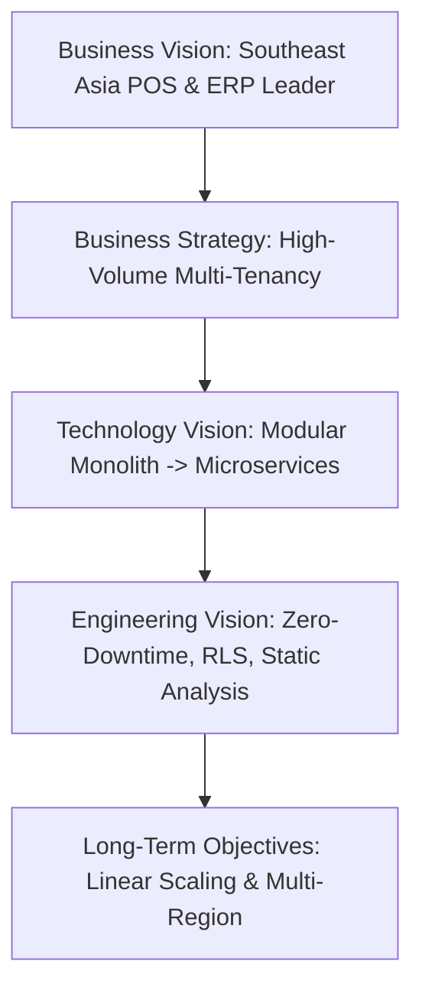
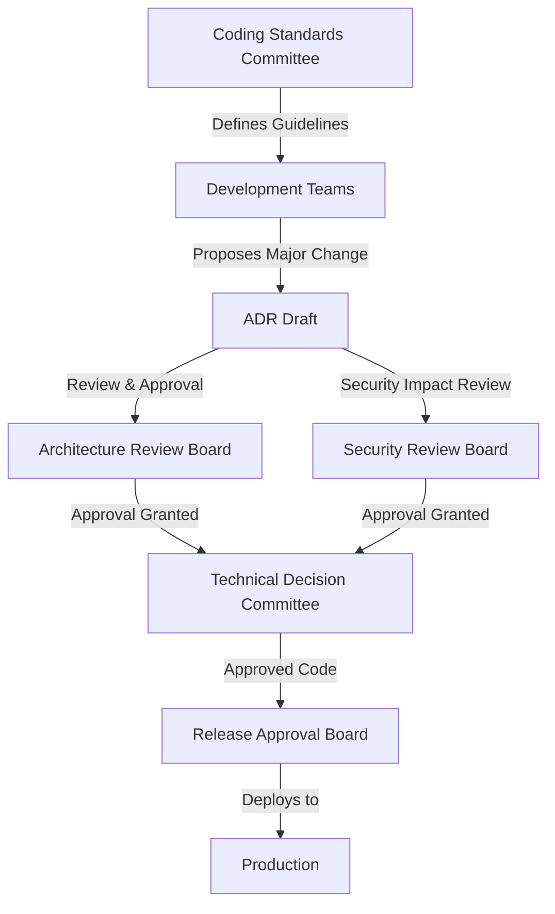
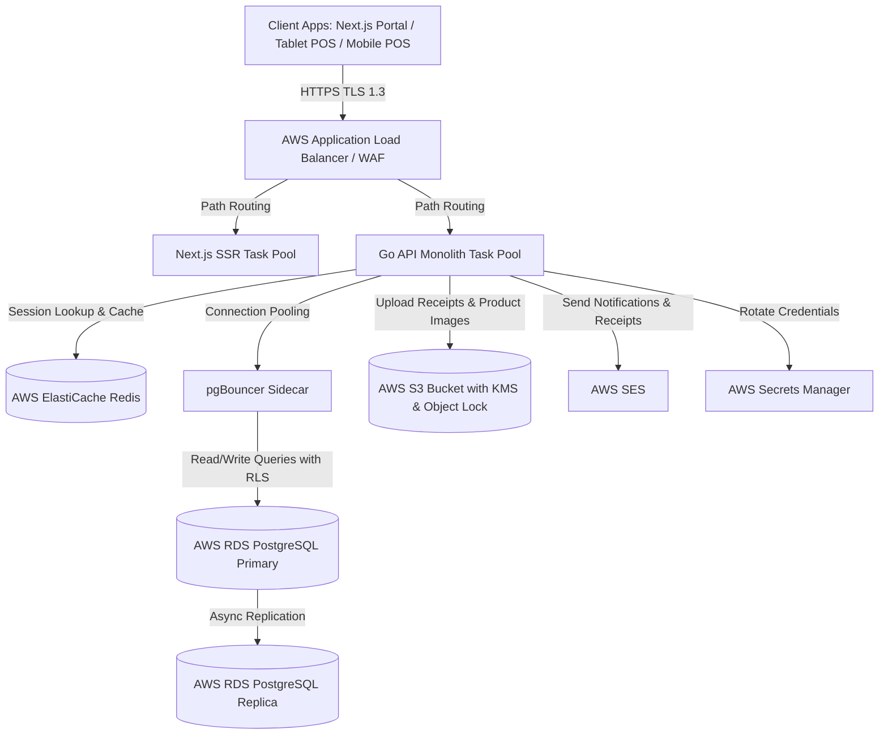
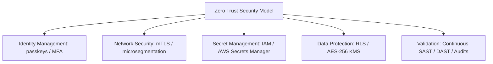

# ENTERPRISE ARCHITECTURE BIBLE & LONG-TERM SYSTEM EVOLUTION STRATEGY

**Project Name:** Enterprise SaaS Business Management Platform  
**Document Version:** 1.0.0 — Baseline Reference  
**Date:** July 13, 2026  
**Authors:** Chief Enterprise Architect, Technical Strategy Board & CTO Advisory Committee  
**Classification:** Enterprise Internal — Unrestricted  
**Status:** 🏛️ APPROVED OFFICIAL STANDARD  

---

## Executive Architecture Summary

This *Enterprise Architecture Bible and Long-Term System Evolution Strategy* serves as the primary governing authority for all engineering, architectural, and operational decisions within the SaaS Business Management Platform ecosystem. Over the next 5–10 years, this document will guide the platform's transition from a high-performance modular monolith to a distributed, multi-tenant cloud-native network, ensuring sustainable scaling across Southeast Asia and global markets.

---

## 1. Architecture Vision

The alignment of business growth with engineering excellence is the core driver of our technical strategy. The platform must scale without requiring linear increases in operational costs, code complexity, or team size.



### 1.1 Enterprise Architecture Vision
To build an enterprise ecosystem where tenant isolation, operational elasticity, and developer velocity co-exist. The architecture must permit modular growth where new business capabilities can be added, updated, or extracted into standalone microservices without disrupting checkouts or reporting systems.

### 1.2 Technology Vision
A cloud-native runtime powered by statically typed, highly concurrent, compiled services (Go) and robust modern web engines (Next.js/TypeScript). State management is anchored on relationally strict, Row-Level Security (RLS) guarded databases (PostgreSQL) and sub-millisecond in-memory caching (Redis). Operational infrastructure is defined entirely as code, deployed onto serverless container hosts, and continuously audited by automated pipelines.

### 1.3 Business Vision
To offer small, medium, and enterprise merchants in emerging economies a highly resilient, low-latency, fully integrated platform that eliminates manual operations, reduces business reporting cycles from hours to minutes, and supports multi-currency/multi-branch operations seamlessly.

### 1.4 Engineering Vision
An engineering culture built on compile-time correctness, strict static analysis, risk-based automated testing, and zero-downtime blue-green deployments. We aim to eradicate tribal knowledge through Git-backed, self-documenting code systems and rigorous post-incident reviews.

### 1.5 Long-Term Objectives (5–10 Years)
*   **Zero-Downtime Operations:** Maintain $\ge 99.99\%$ API checkout availability globally.
*   **Sub-50ms Processing:** P99 processing latency for core POS operations under load.
*   **Linear Infrastructure Costs:** Scale cost-per-tenant down as density increases by utilizing serverless computing and connection sharing.
*   **Zero Data Leakage:** Ensure absolute data isolation between competing merchants through database-level Row-Level Security (RLS).
*   **Zero-Touch Deployment:** Fully automated deployment, testing, verification, and rollback pipelines.

---

## 2. Architecture Principles

Our architectural decisions are governed by twelve immutable design principles. Every architectural proposal, pull request, and design plan must validate itself against these tenets.

| Principle | Why It Exists | Practical Application |
| :--- | :--- | :--- |
| **Modular Monolith** | Minimizes network overhead, deployment complexity, and debugging friction at initial scale. | Keep code within bounded domain packages (`internal/auth`, `internal/orders`). Cross-module calls must go through interfaces, never direct DB query joins. |
| **Clean Architecture** | Decouples business logic from external frameworks, databases, and UI layers. | Handlers process HTTP/JSON; services implement business logic; repositories interact with databases. No SQL queries allowed in HTTP handlers. |
| **Domain-Driven Design (DDD)** | Establishes a shared language between engineers and domain experts, preventing model confusion. | Code reflects real-world concepts (`Tenant`, `Branch`, `Product`, `Order`, `InventoryMovement`). Bounded contexts are strictly enforced. |
| **SOLID Principles** | Ensures classes and structs are easy to extend, test, modify, and reuse over time. | Single Responsibility for handlers/services; interface segregation for database adapters; dependency injection via constructors. |
| **Separation of Concerns** | Keeps files and components focused on a single aspect of the system, reducing bug blast radius. | UI components only render state; APIs only route data; databases only enforce data schema and RLS policies. |
| **High Cohesion** | Groups related behaviors within the same code module to simplify modifications. | All inventory logic (stock adjustments, low-stock triggers, supplier integration) lives within the `internal/inventory` package. |
| **Low Coupling** | Minimizes dependency links between modules, enabling parts of the system to be rewritten independently. | Modules depend on interface contracts. If the `orders` module needs product data, it queries the `products` interface rather than reading `products` tables directly. |
| **API First** | Prevents front-end and backend teams from blocking each other and ensures third-party integrations are straightforward. | Design and version API specs (`openapi.yaml`) before writing code. Generate client SDKs automatically from these specifications. |
| **Security by Design** | Protects user assets, merchant data, and system integrity from malicious exploitation. | Deny-by-default access policies. Implement RLS at the database engine layer. Sanitize all inputs and use parameterized SQL statements. |
| **Scalability by Design** | Prevents system crashes and latency spikes when merchant transaction volume surges. | Keep API instances stateless. Cache read-heavy catalogs in Redis. Scale compute nodes horizontally based on CPU/memory usage. |
| **Observability by Design** | Enables instant debugging and monitoring of issues without needing shell access to servers. | Propagate `request_id` across log messages. Emit structured JSON logs. Trace database calls and third-party API delays using AWS X-Ray. |
| **Cloud-Native Mindset** | Leverages managed services to eliminate the overhead of physical server maintenance. | Use Docker container images, managed PostgreSQL (RDS), automated backup policies, and infrastructure-as-code deployments (Terraform). |

---

## 3. Architectural Governance

To maintain these principles across scaling teams, the platform utilizes five specialized boards. These boards review proposals, verify compliance, and approve system changes.



### 3.1 Architecture Review Board (ARB)
*   **Purpose:** To guide long-term architectural design and align technology investments with business strategy.
*   **Responsibilities:**
    *   Review and approve Architecture Decision Records (ADRs).
    *   Evaluate and authorize new technology stack additions.
    *   Guide decisions regarding monolithic module extraction into standalone services.
*   **Approval Authority:** Final approval on all architectural changes that affect multiple domains, database schemas, or regional deployments.

### 3.2 Technical Decision Committee (TDC)
*   **Purpose:** To resolve everyday engineering design choices and prevent development team blockages.
*   **Responsibilities:**
    *   Determine internal library selections and framework minor version updates.
    *   Standardize API design conventions, response formats, and error codes.
    *   Resolve structural disputes between development teams regarding shared packages.
*   **Approval Authority:** Sign-off on backend repository layouts, internal dependencies, and development utility libraries.

### 3.3 Coding Standards Committee (CSC)
*   **Purpose:** To maintain code quality, readability, and consistency across all repositories.
*   **Responsibilities:**
    *   Maintain and update linter configurations (`golangci-lint`, `eslint`).
    *   Conduct review sessions on code complexity, style violations, and formatting rules.
    *   Update language-specific development guidelines ([Backend Guideline](file:///c:/Users/Prime/Desktop/Project%20System/SaaS%20Business%20Management%20Platform/docs/04-Development/05-Backend-Development-Guideline.md) and [Frontend Guideline](file:///c:/Users/Prime/Desktop/Project%20System/SaaS%20Business%20Management%20Platform/docs/04-Development/06-Frontend-Development-Guideline.md)).
*   **Approval Authority:** Authorized to reject pull requests that do not pass linting or formatting checks.

### 3.4 Security Review Board (SRB)
*   **Purpose:** To assess risk, identify vulnerabilities, and verify compliance with data protection laws.
*   **Responsibilities:**
    *   Review PostgreSQL RLS security rules, IAM access permissions, and KMS setups.
    *   Audit WAF rate limits, DDoS protection configurations, and network security groups.
    *   Evaluate third-party APIs (Stripe, Bakong) to ensure compliance with financial security rules.
*   **Approval Authority:** Absolute veto power over any deployment that fails security scans, introduces data leakage risks, or violates compliance standards.

### 3.5 Release Approval Board (RAB)
*   **Purpose:** To manage release risks and ensure zero-downtime production deployments.
*   **Responsibilities:**
    *   Verify test reports, code coverage, performance results, and rollback checklists.
    *   Authorize production deployments during scheduled windows.
    *   Review post-migration logs and monitor deployment rollback triggers.
*   **Approval Authority:** Sign-off required to shift 100% of production traffic to new releases.

---

## 4. Enterprise System Landscape

The platform is designed to isolate database queries by tenant while sharing infrastructure resources to optimize hosting costs.



### 4.1 Client Applications
*   **Merchant Portal:** A web administration application built with Next.js (TypeScript) for report monitoring, inventory setup, and employee configurations.
*   **Tablet POS Client:** A touch-optimized React Native application for cashiers, supporting local data caching and offline queueing for card/cash/QR checkouts.

### 4.2 Backend Services
*   **Go API Monolith:** Gin-based stateless API instances processing requests under versioned namespaces (`/api/v1/`). Handles authentication, inventory management, purchase orders, and sales tracking.

### 4.3 Shared Services
*   **In-Memory Store:** AWS ElastiCache Redis handling API rate limiting, JWT token blacklisting, and transient session storage.
*   **Object Store:** AWS S3 buckets storing immutable check receipt PDFs, system backups, and merchant product catalog photos.

### 4.4 Integration Layer
*   **AWS ALB:** Handles TLS 1.3 termination, distributes requests to container pools, and runs AWS WAF checks.
*   **Payment Services:** Outbound API integrations with Stripe (for card processing) and Bakong KHQR (for Cambodian Riel and USD payments).

### 4.5 Data Layer
*   **Relational Database:** AWS RDS PostgreSQL 16 configured with Multi-AZ replication. Tenant isolation is managed at the database level using Row-Level Security (RLS).
*   **Connection Pooler:** pgBouncer instances running in transaction mode, reducing active database connection overhead by pooling requests.

### 4.6 Infrastructure Layer
*   **Compute:** Stateless containers hosted on serverless AWS ECS Fargate, scaling automatically based on workload demands.
*   **Network Segments:** Private Virtual Private Cloud (VPC) subnets isolating database and caching instances from direct public routing.

### 4.7 Future Platforms
*   **Event Bus:** AWS EventBridge or Apache Kafka to transition the system to an event-driven architecture, enabling asynchronous processing for notifications and reports.
*   **Data Warehouse:** AWS Redshift to run heavy analysis tasks off the main database tables.

---

## 5. Technology Standards

To ensure long-term codebase consistency, we categorize technologies into three distinct lifecycle tiers.

```
[ PREFERRED ] ──( Gradual Shift )──> [ APPROVED ] ──( Phase Out )──> [ DEPRECATED ]
```

*   **Preferred:** The default choice for all new development. Highly integrated, supported by automated tooling, and optimized for performance.
*   **Approved:** Permitted for use where the preferred option is not a fit.
*   **Deprecated:** Strictly forbidden for new projects. Existing implementations must be scheduled for removal.

### 5.1 Technology Lifecycle Classification

| Layer | Preferred | Approved | Deprecated |
| :--- | :--- | :--- | :--- |
| **Backend Languages** | Go (Golang) 1.22+ | TypeScript (scripts only) | Python (web services), Ruby, PHP |
| **Web Frameworks** | Next.js 14+ (App Router) | React SPA (Static Hosting) | Express.js, Angular, Vue.js |
| **Mobile Engines** | React Native 0.73+ | Native iOS (Swift) | Cordova, PhoneGap, Flutter |
| **Databases** | PostgreSQL 16 (AWS RDS) | AWS DynamoDB (KV only) | MongoDB, MySQL, Oracle DB |
| **Cache Systems** | Redis 7.x (ElastiCache) | Local In-Memory Cache | Memcached |
| **Message Brokers** | AWS EventBridge / SQS | Apache Kafka | RabbitMQ, ActiveMQ |
| **Compute Runtimes**| AWS ECS Fargate | AWS Lambda | AWS EC2 (manual host management) |
| **CI/CD Tools** | GitHub Actions | AWS CodePipeline | Jenkins, TravisCI |
| **Central Logs** | CloudWatch Logs | OpenSearch / ELK Stack | Logstash, Splunk |
| **APM / Dashboards** | Grafana + CloudWatch | AWS X-Ray | Datadog, New Relic |
| **Secured Vaults** | AWS Secrets Manager | HashiCorp Vault | Hardcoded Env Files, SSM Parameter |
| **Test Frameworks** | Go test + testify, Jest | k6, Playwright, Cypress | Selenium, Postman |
| **Documentation** | Markdown + Swagger/OpenAPI | MkDocs / Git Docs | Confluence, PDF manuals |

---

## 6. Architecture Decision Records (ADR)

The key architectural decisions that define the platform are documented below.

### ADR-001: Architecture Style Selection
*   **Decision:** Implement the system core as a **Modular Monolith** rather than distributed microservices or a tightly coupled monolith.
*   **Context:** A modular monolith minimizes network overhead and deployment complexity for our core engineering team while maintaining clear domain boundaries.
*   **Options Considered:** 
    *   *Microservices:* Deemed too complex for initial deployment and development velocity.
    *   *Tightly Coupled Monolith:* Rejected due to the risk of code spaghetti and lack of separation.
*   **Decision Made:** Modular Monolith with strict package separation (`internal/auth`, `internal/orders`).
*   **Reason:** Enables fast deployment and development while keeping a clear path to extract hot services (like POS checkout) if scaling needs change.
*   **Consequences:** Internal modules must communicate through public interfaces, and cross-module database queries are disallowed.
*   **Future Review Date:** July 1, 2027

### ADR-002: Multi-Tenant Data Isolation Strategy
*   **Decision:** Deploy a **Hybrid Multi-Tenant Model** combining a shared database with Row-Level Security (RLS) for standard plans, and dedicated databases for enterprise accounts.
*   **Context:** Standard tenants require cost-efficient shared hosting, whereas enterprise accounts require physical data isolation and custom backup policies.
*   **Options Considered:**
    *   *Database-per-Tenant:* Too expensive to run for low-tier clients.
    *   *Shared Database without RLS:* Introduces a risk of data leaks if query logic contains bugs.
*   **Decision Made:** Shared RDS PostgreSQL instance with RLS enabled on all tenant-scoped tables. Implement database routers to support dedicated RDS instances for enterprise users.
*   **Reason:** Guarantees data isolation at the database engine layer while optimizing hosting costs.
*   **Consequences:** Developers must set the active tenant context (`app.tenant_id`) before running database queries.
*   **Future Review Date:** October 1, 2027

### ADR-003: Core Backend Technology Selection
*   **Decision:** Standardize the backend API on **Go (Golang) and the Gin Framework**.
*   **Context:** The API layer needs to handle thousands of concurrent checkouts with minimal memory usage and rapid startup times.
*   **Options Considered:**
    *   *Node.js/TypeScript:* Good development velocity, but higher memory footprint and slower execution under heavy concurrent tasks.
    *   *Java/Spring Boot:* Excellent ecosystem, but high memory overhead and slow cold starts.
*   **Decision Made:** Go 1.22+ and Gin.
*   **Reason:** Provides native concurrency patterns, fast compile speeds, and small, lightweight Docker images ($\le 20\text{ MB}$).
*   **Consequences:** Requires the development team to follow idiomatic Go patterns for error handling and model mapping.
*   **Future Review Date:** January 15, 2028

### ADR-004: Transactional Connection Pooling
*   **Decision:** Run **pgBouncer in Transaction Mode** as a sidecar alongside application instances.
*   **Context:** PostgreSQL spawns a separate process for every client connection, which can degrade database performance under heavy traffic.
*   **Options Considered:**
    *   *Direct Connection:* Restricts the API pool size to the database server memory limits.
    *   *Application-Level Pooler (e.g., Go SQL pool):* Fails to release connections back to the database when application instances scale up.
*   **Decision Made:** pgBouncer transaction pooling.
*   **Reason:** Allows us to support over 500 concurrent application connections using fewer than 20 database connections, saving RDS resources.
*   **Consequences:** Disallows the use of temporary tables and prepared statements outside transaction wrappers.
*   **Future Review Date:** March 1, 2027

### ADR-005: Audit Log Compliance and Storage
*   **Decision:** Store platform audit logs in **Amazon S3 Buckets configured with WORM (Write Once, Read Many) Object Lock**.
*   **Context:** Compliance requirements demand that financial transactions, payment records, and user login audits remain tamper-proof.
*   **Options Considered:**
    *   *Standard Database Table:* Logs are vulnerable to modification if a high-privilege account is compromised.
    *   *Centralized Syslog Server:* Difficult to verify and audit for tamper-proof status.
*   **Decision Made:** Write logs directly to AWS S3 using Object Lock in compliance mode for 7 years.
*   **Reason:** Prevents anyone, including system administrators, from modifying or deleting audit records once written.
*   **Consequences:** Requires structured log formatting and asynchronous write queues to prevent blocking requests.
*   **Future Review Date:** September 1, 2027

---

## 7. Evolution Roadmap

Our roadmap guides the platform's architectural, infrastructure, and team growth over the next ten years.

```
YEAR 1              YEAR 2              YEAR 3              YEAR 5              YEAR 10
Deploy Monolith ──> Scale Read Replicas ──> Split Checkout ──> Multi-Cloud ──> Self-Healing
Single RDS         Hybrid Isolation     Microservices       Global Edges       Autonomous
```

### 7.1 Year 1: Launch and Regional Baseline
*   **Business Growth:** Support up to 100 active merchants across 3 cities in Cambodia.
*   **Architecture Changes:** Maintain the core modular monolith architecture.
*   **Infrastructure Growth:** Run on a single AWS RDS Multi-AZ instance and a small ECS Fargate cluster.
*   **Engineering Growth:** Form a core team of 5–8 developers focused on general platform features.
*   **Technology Refresh:** Maintain Go 1.22+ and Next.js 14+ baseline setups.

### 7.2 Year 2: Merchant Growth and Database Optimization
*   **Business Growth:** Expand to 1,000+ merchants and launch in Vietnam and Thailand.
*   **Architecture Changes:** Integrate asynchronous event emitters to decouple background tasks (like PDF receipts).
*   **Infrastructure Growth:** Deploy AWS RDS Read Replicas and enable table partitioning on high-volume order tables.
*   **Engineering Growth:** Split the team into three specialized groups: Frontend, Core Backend, and Platform/SRE.
*   **Technology Refresh:** Upgrade the cache layer to Redis Cluster mode to support higher loads.

### 7.3 Year 3: POS Service Separation
*   **Business Growth:** Support 5,000+ active tenants and handle over 10 million transactions monthly.
*   **Architecture Changes:** Extract the checkout engine (`internal/orders`) from the monolith into a standalone, highly scalable Checkout Microservice.
*   **Infrastructure Growth:** Transition from AWS ECS Fargate to an Amazon EKS (Kubernetes) cluster for container management.
*   **Engineering Growth:** Adopt a Spotify-style squad model focused on specific domains (e.g., Payments, Catalog, Core).
*   **Technology Refresh:** Adopt gRPC for internal service-to-service communication.

### 7.4 Year 5: Multi-Region Deployment and Low-Latency Edges
*   **Business Growth:** Expand operations across the APAC region, supporting 20,000+ merchants.
*   **Architecture Changes:** Deploy a Multi-Region architecture with active-active write routers.
*   **Infrastructure Growth:** Store cache and process POS checkouts at edge locations close to users using AWS Local Zones or Cloudflare Workers.
*   **Engineering Growth:** Grow to a 100+ engineer organization with a dedicated Security Operations Center (SOC).
*   **Technology Refresh:** Deploy service meshes (e.g., Istio) to manage and secure distributed microservice communications.

### 7.5 Year 10: Autonomous Commerce Infrastructure
*   **Business Growth:** Support 100,000+ active merchants globally.
*   **Architecture Changes:** A fully decentralized microservices architecture running across multi-cloud regions.
*   **Infrastructure Growth:** Implement self-healing infrastructure that scales, repairs, and configures itself based on AI-driven capacity planners.
*   **Engineering Growth:** A mature open-source developer ecosystem around our platform API.
*   **Technology Refresh:** Adopt serverless and edge compute models for all user-facing transaction paths.

---

## 8. Technical Debt Management

Uncontrolled technical debt degrades velocity. We treat technical debt as an engineering liability that must be identified, tracked, and remediated systematically.

```
                  [ TECHNICAL DEBT ASSESSMENT ]
                                │
          ┌─────────────────────┴─────────────────────┐
          ▼                                           ▼
[ HIGH IMPACT / LOW EFFORT ]                [ HIGH IMPACT / HIGH EFFORT ]
  --> Fix in Current Sprint                   --> Schedule in Technical Roadmap
```

### 8.1 Debt Identification
*   **Static Scanning:** Run weekly automated complexity scans (using `golangci-lint` and SonarQube) to flag code smells.
*   **Architecture Log:** Maintain a central backlog of known shortcuts and deprecations in our ticketing system (Jira/GitHub Issues).
*   **Feedback Loops:** SREs flag operational workarounds, slow DB queries, or complex configuration steps during post-incident reviews.

### 8.2 Prioritization Matrix

| Severity | Description | Remediating Target |
| :--- | :--- | :--- |
| **Blocker** | Design defects that cause system outages, data corruption, or security risks. | Address within the current sprint. |
| **High** | Code coupling that blocks team velocity or degrades API performance. | Address within 30 days. |
| **Medium** | Minor style issues, outdated library versions, or missing unit tests. | Address within 90 days. |
| **Low** | Outdated documentation, minor log clutter, or non-optimal helper methods. | Address during dedicated quarterly debt sprints. |

### 8.3 Debt Reduction Process
*   **The 20% Rule:** Allocate 20% of every development sprint's capacity to refactoring, resolving technical debt, and upgrading packages.
*   **Debt Sprints:** Dedicate one sprint per quarter entirely to system performance, security patching, and structural cleanups.
*   **No Refactor, No Release:** Require high-complexity code alterations to be refactored before merging new features into those areas.

### 8.4 Measurement Metrics
*   **Unit Test Coverage:** Prevent coverage from falling below our 80% baseline.
*   **Complexity Index:** Track cyclomatic complexity scores across backend routes.
*   **Package Age:** Alert when internal packages fall more than three minor versions behind their upstream dependencies.
*   **API Build Times:** Ensure the compilation pipeline completes in under 5 minutes.

### 8.5 Review Frequency
*   **Sprint Reviews:** Technical leads review tech debt issues during sprint planning.
*   **Quarterly Audits:** The ARB audits the overall health of the codebase every 90 days.

---

## 9. Innovation Strategy

We evaluate new technologies carefully before adopting them to prevent scope creep and keep the core platform stable.

### 9.1 Emerging Technology Roadmap

```
EVALUATE ───────────────────────> PROOF OF CONCEPT ───────────────────> SYSTEM INTEGRATION
* AI Checkouts                   * Event-Driven Arch                  * Next.js SSR
* Edge Computing                 * Serverless Reporting               * Go Gin Backend
```

*   **Artificial Intelligence & Machine Learning:** Use machine learning models to analyze sales data and help merchants predict low inventory and automate reordering.
*   **Event-Driven Architecture:** Introduce message queues to handle background tasks asynchronously, keeping checkout routes fast.
*   **Serverless Compute:** Deploy serverless functions (like AWS Lambda) to run resource-heavy, intermittent tasks (like compiling monthly PDF tax reports) without using server capacity.
*   **Edge Computing:** Process POS checkout requests close to merchants to maintain fast transaction times even under poor network conditions.
*   **Multi-Cloud Resilience:** Build cloud-agnostic deployment configurations to run core POS services across multiple cloud providers.
*   **Business Intelligence:** Build real-time analytics engines to help enterprise merchants run high-volume data queries without affecting checkout databases.

### 9.2 Technology Evaluation Criteria

> [!IMPORTANT]
> A new technology is only adopted if it passes four validation gates:

1.  **Business Value:** The technology must lower operating costs, improve system performance, or enable critical business features.
2.  **Maintainability:** The engineering team must have or be able to acquire the skills needed to support the technology long term.
3.  **Security Impact:** The technology must comply with our security policies and not introduce data leakage risks.
4.  **Operational Cost:** The total cost of ownership (TCO), including hosting, monitoring, and team training, must be lower than the value it adds.

---

## 10. Security Evolution

Our security architecture assumes that perimeter defenses can fail, and secures data at every layer.



### 10.1 Identity and Access Management (IAM)
*   **Standard Identity:** Enforce Multi-Factor Authentication (MFA) for administrative roles, and utilize single-use JWT refresh token rotation.
*   **Future Identity:** Support WebAuthn (Passkeys) for secure, passwordless log-ins at tablet POS terminals.
*   **Granular RBAC:** Ensure the system checks user permissions at the API route, service layer, and database query layers.

### 10.2 Zero-Trust Architecture
*   **Network Security:** Segment networks using private VPC subnets. Ensure ECS tasks only accept connections from the ALB security group.
*   **Service Communication:** Secure internal microservice calls with mutual TLS (mTLS) to encrypt and authorize data in transit.
*   **IAM Policies:** Assign permissions to application instances using least-privilege IAM roles rather than permanent credentials.

### 10.3 Secret Management
*   **Centralized Secrets:** Store database passwords and API tokens in AWS Secrets Manager, encrypted with KMS keys.
*   **Automated Rotation:** Automatically rotate database credentials every 90 days.
*   **Ephemeral Injection:** Inject secrets into application environments at runtime, ensuring they are never logged or stored in version control.

### 10.4 Compliance and Threat Protection
*   **Financial Compliance:** Design the platform to align with PCI-DSS standards for card processing and local regulations for QR payments.
*   **Intrusive Protection:** Use web application firewalls (WAF) to block SQL injections, cross-site scripting (XSS), and automated bot traffic.
*   **Audit Trail:** Capture all data modifications and configuration changes in immutable, WORM-compliant audit logs.

### 10.5 Continuous Security Validation
*   **Static Scanning (SAST):** Scan code for vulnerabilities in our CI/CD pipeline using static application security testing (SAST) tools.
*   **Dynamic Scanning (DAST):** Run weekly dynamic security scans against staging environments to identify runtime vulnerabilities.
*   **Penetration Testing:** Hire certified external security firms to conduct annual penetration tests on the platform.

---

## 11. Performance Evolution

We target a sub-50ms processing latency for checkout transactions to keep point-of-sale registers fast and responsive.

### 11.1 Optimization Process
*   **Profiling Cycles:** Run memory and CPU profiling tests on our Go API code during performance optimization sprints.
*   **Database Query Tuning:** Review slow queries weekly using database tools and optimize database indexes to keep queries fast.
*   **Asset Compression:** Automatically compress product images and static resources to reduce frontend load times.

### 11.2 Capacity and Database Scaling
*   **Database Partitioning:** Partition large transaction tables by tenant or date range to maintain fast index search speeds as databases grow.
*   **Write Reduction:** Queue write operations that are not time-critical, keeping checkout database operations focused on processing sales.

### 11.3 Caching Strategy

```
[ BROWSER / CDN CACHE ] ──> [ REDIS SESSION/PRODUCT CACHE ] ──> [ POSTGRESQL PRIMARY ]
```

*   **Multi-Tier Caching:**
    *   *Edge CDN:* Cache static web assets and product catalogs close to users.
    *   *Redis Cache:* Store active user sessions, role configurations, and branch settings in-memory.
    *   *Application Cache:* Cache static configuration variables locally within Go instance memory.

### 11.4 Global Performance Architecture
*   **Latency Routing:** Use geo-proximity DNS routing to direct user requests to the nearest regional data center.
*   **Edge Data Replication:** Replicate product catalogs to edge regions, ensuring POS terminals load menu items instantly.

---

## 12. Scalability Evolution

To handle platform growth, we scale our database, application, and infrastructure layers independently.

### 12.1 Application Scaling
*   **Stateless Scaling:** Ensure Go API instances remain completely stateless, enabling us to scale tasks up or down instantly.
*   **Auto-Scaling Rules:** Scale ECS Fargate tasks automatically based on target CPU and memory usage.

### 12.2 Database Scaling
*   **Read Replicas:** Route heavy read queries and report generation tasks to read replicas to keep the primary database focused on checkout writes.
*   **Tenant Partitioning:** Move high-volume enterprise accounts to dedicated database instances to prevent them from affecting other tenants.

### 12.3 Infrastructure Scaling
*   **Global Balancers:** Use DNS checkups and load balancers to route traffic around healthy instances.
*   **Warm Provisioning:** Maintain pre-warmed container capacity ahead of expected peak shopping hours.

### 12.4 Operations Scaling
*   **Infrastructure as Code:** Manage all infrastructure using declarative Terraform files, ensuring we can clone environments quickly.
*   **Self-Healing Compute:** Configure orchestrators to automatically restart unhealthy container instances.

### 12.5 Organization Scaling
*   **Conway's Law Design:** Align our development team structures with our software architecture domains.
*   **Platform Engineering:** Build internal developer tools to allow product squads to deploy new modules independently.

---

## 13. Documentation Governance

All architectural, development, and operational documentation is treated as code. It must be versioned, reviewed, and updated alongside software releases.

### 13.1 Documentation Lifecycle

| Phase | Standard | Owner |
| :--- | :--- | :--- |
| **Creation** | Write documents in Markdown. Save them in the Git repository (`/docs/`). | Feature Author |
| **Review** | Documentation changes must be reviewed as part of code pull requests. | Bounded Context Lead |
| **Approval** | Major architectural changes require approval from the ARB. | Technical Writer / Principal Architect |
| **Retirement** | Move deprecated documents to the `/docs/archive/` directory. | Product Owner |

### 13.2 Review Cycles
*   **Continuous Updates:** Update relevant documentation files whenever code changes modify database schemas or API routes.
*   **Quarterly Reviews:** Technical leads review documentation folders every 90 days to identify and update outdated pages.

---

## 14. Enterprise Architecture Compliance

We run compliance checks at every phase of the development lifecycle to verify that code meets our security, scalability, and quality standards.

```
COMMIT ──────────> PULL REQUEST ──────────> STAGING DEPLOY ──────────> PRODUCTION
* Lint Check       * Peer Code Review       * Security Scan (DAST)    * Smoke Tests
* Unit Test        * Architecture Sign-off  * Performance Load Test   * Release Approval
```

### 14.1 Compliance Gates
*   **Architecture Reviews:** Verify that new features align with modular monolith boundaries before writing code.
*   **Security Reviews:** Ensure pull requests do not bypass RLS policies or expose raw database connection variables.
*   **Code Reviews:** Require at least one senior engineer's approval on all pull requests before merging code.
*   **Operational Reviews:** Test database migrations in staging to ensure they do not cause locks or require system downtime.
*   **Release Reviews:** Validate that all automated pipeline tests, security checks, and code coverage targets are met before deploying changes to production.

### 14.2 Audit Schedule
*   **Bi-Annual Code Audits:** Run deep-dive code reviews every six months to identify complexity regressions and update styling standards.
*   **Annual Security Audits:** Conduct external security penetration tests and SOC 2 compliance readiness checks once a year.

---

## 15. Architecture Success Metrics

We measure the success of our architecture using key performance and operational indicators.

### 15.1 Key Performance Indicators (KPIs)

| Metric | Target | Measurement Method |
| :--- | :--- | :--- |
| **System Uptime** | $\ge 99.99\%$ availability | Calculated monthly using global ping checks. |
| **Checkout Latency** | P99 checkout time $\le 50\text{ ms}$ | Monitored in real-time using AWS X-Ray traces. |
| **Deployment Frequency** | Multiple deployments per day | Measured using CI/CD pipeline run history. |
| **Mean Time to Recovery** | MTTR $\le 15\text{ minutes}$ | Measured from pager alert to incident resolution. |
| **Vulnerability SLA** | Zero critical findings | Verified daily by automated container scans. |
| **Data Isolation** | Zero cross-tenant data leaks | Verified by automated database integration tests. |
| **Engineering Velocity** | Commit-to-production $\le 30\text{ min}$ | Tracked by monitoring PR merge-to-deploy cycles. |
| **Build Cycle Speed** | CI pipeline completes $\le 5\text{ min}$ | Monitored using GitHub Action execution logs. |

---

## 16. Final Enterprise Architecture Statement

We believe that high-quality software architecture is the foundation of sustainable business growth. 

This document defines our technical strategy, engineering standards, and governance policies. By maintaining a clean **Modular Monolith** codebase, utilizing database-level **Row-Level Security**, and following a structured **Evolution Roadmap**, we ensure our platform remains cost-efficient, secure, and ready to scale.

We are committed to continuous technical improvement, automated testing, and blameless operational reviews. We prioritize long-term system stability and maintainable code over quick, low-quality shortcuts. This strategy will guide our team as we scale the SaaS Business Management Platform to support merchants across Southeast Asia and global markets.

---

*End of Enterprise Architecture Bible and Long-Term System Evolution Strategy*  
*Document maintained by: Chief Enterprise Architect | Review cycle: Bi-Annually*
