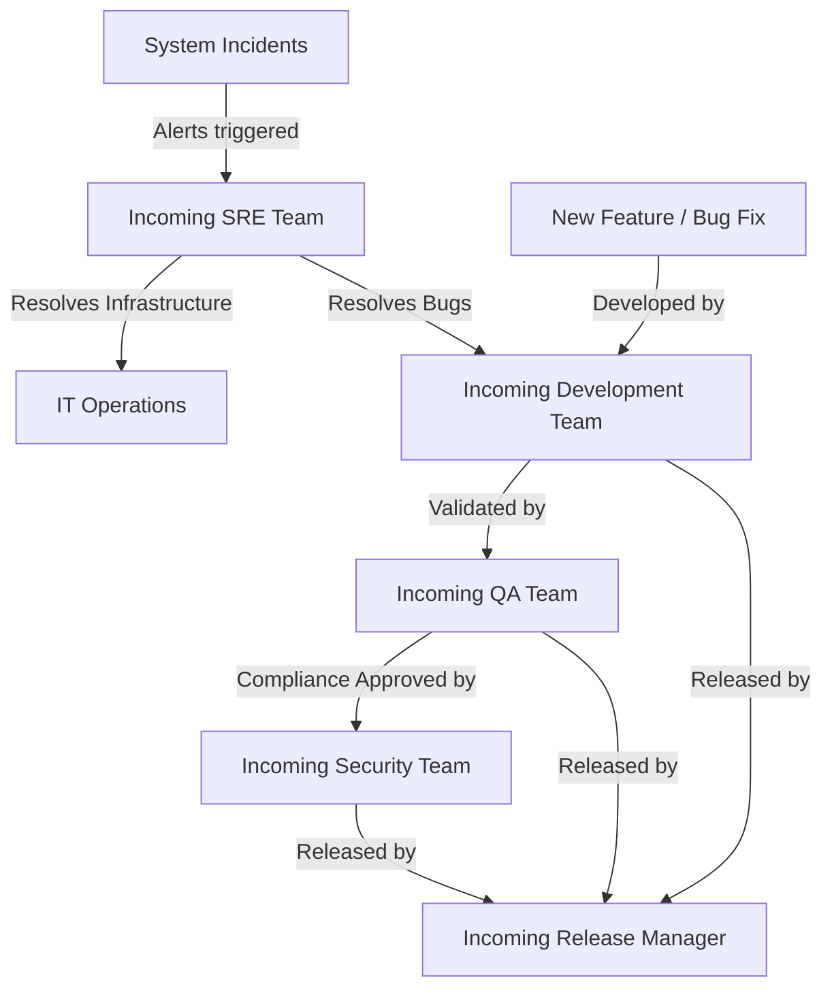
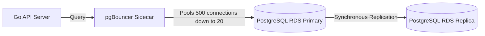

# ENTERPRISE PROJECT HANDOVER & OPERATIONAL CONTINUITY GUIDE

**Project Name:** Enterprise SaaS Business Management Platform  
**Document Version:** 1.0.0 — Baseline Transition  
**Date:** July 13, 2026  
**Authors:** Principal Software Architect, SRE Director & Enterprise Delivery Manager  
**Classification:** Enterprise Internal — Unrestricted  
**Status:** 🤝 READY FOR TRANSITION  

---

## 1. Handover Overview

### 1.1 Purpose
This *Enterprise Project Handover & Operational Continuity Guide* defines the operational transition plan for the SaaS Business Management Platform. Its purpose is to transfer technical and operational ownership from the original development team to the incoming engineering and operations organization, ensuring zero disruption to live merchant services.

### 1.2 Handover Objectives
*   **Operational Continuity:** Protect the $\ge 99.99\%$ availability targets of the POS checkout system.
*   **Eliminate Tribal Knowledge:** Provide clear documentation on repository layouts, build systems, deployment models, and recovery playbooks.
*   **Establish Clear Boundaries:** Define who owns, approves, and executes technical decisions, releases, and incident response tasks.
*   **Accelerate Developer Onboarding:** Enable new developers, database administrators, QA testers, and DevOps engineers to configure and run the system independently.

### 1.3 Intended Audience

| Role | Primary Utility of This Document |
| :--- | :--- |
| **New Developers** | Understand the development workflow, coding standards, and repository layouts (§4, §5, §6). |
| **DevOps & SREs** | Manage deployment pipelines, secrets, monitoring tools, and recovery playbooks (§8, §11). |
| **Database Administrators** | Manage database migrations, connection pooling, and backup tasks (§7). |
| **QA Engineers** | Execute automated test suites and manage the release validation gates (§9). |
| **Security Teams** | Audit RLS policies, rotate secrets, and monitor compliance gates (§10). |
| **Release Managers** | Coordinate production deployments, rollback triggers, and hotfixes (§12). |

### 1.4 Post-Handover Responsibilities



---

## 2. Project Overview

The SaaS Business Management Platform is a multi-tenant cloud solution that consolidates POS operations, real-time inventory tracking, procurement, and financial reporting for retail and hospitality merchants.

### 2.1 Core System Parameters
*   **Business Goal:** Digital enablement of retail and hospitality merchants, reducing daily financial reconciliation cycles to under 15 minutes.
*   **Supported Platforms:** Responsive desktop web browser application (Next.js) and a touch-optimized tablet POS native application (React Native).
*   **Target Users:** Merchant Owners, Store Managers, Cashiers, Inventory Staff, Finance Teams, and Platform Administrators.
*   **Primary Region:** AWS `ap-southeast-1` (Singapore); DR Region: AWS `ap-southeast-2` (Sydney).

### 2.2 Core Business Flows
1.  **POS Sales Flow:** Cashier scans barcodes $\rightarrow$ POS validates stock availability $\rightarrow$ Checkout calculates tax $\rightarrow$ Merchant processes payment (Cash/Card/Bakong QR) $\rightarrow$ Monolith records order $\rightarrow$ Database triggers inventory deduction and saves PDF receipt.
2.  **Inventory Adjustment Flow:** Manager updates stock levels $\rightarrow$ System registers inventory movement $\rightarrow$ Trigger fires alert if stock falls below the low-stock threshold $\rightarrow$ System drafts Purchase Order (PO).
3.  **Tenant Data Isolation Flow:** Tenant signs up $\rightarrow$ Platform provisions unique tenant identifier $\rightarrow$ PostgreSQL Row-Level Security (RLS) isolates tenant data at the database layer.

---

## 3. Repository Structure

The platform uses a monorepo-style folder layout to manage backend, web frontend, and tablet applications.

```
/
├── cmd/
│   └── api/            # Go REST API entry point (main.go)
├── internal/           # Bounded contexts (business logic)
│   ├── auth/           # IAM, JWT rotation, session verification
│   ├── products/       # Product catalogs, categories, barcode lookup
│   ├── orders/         # POS checkout engine, cart calculations
│   ├── inventory/      # Stock tracking, inventory movement logs
│   ├── suppliers/      # Supplier profiles, Purchase Order (PO) workflow
│   └── reports/        # Financial reporting, daily reconciliation
├── db/
│   └── migrations/      # Version-controlled SQL schema files
├── web/                # Next.js Merchant Admin Dashboard
├── mobile/             # React Native Touchscreen Tablet POS app
├── docs/               # Markdown documentation (78 files)
├── deploy/             # Deployment configurations
│   ├── docker/         # Multi-stage Dockerfiles
│   └── terraform/      # Infrastructure as Code (IaC) configurations
├── tests/              # End-to-End, security, and load test scripts
└── scripts/            # Database backfill and administration utilities
```

### 3.1 Folder Rationale
*   `cmd/api/` contains only bootstrap code (database connection setup, cache initialization, router bindings).
*   `internal/` holds the core application logic. Code within internal is not exportable to external modules, preventing unexpected dependencies.
*   `web/` and `mobile/` are isolated client projects that communicate with the backend exclusively via versioned HTTPS APIs.
*   `deploy/terraform/` isolates cloud resource definitions by environment (`staging`, `production`).

---

## 4. Development Team Handover

Incoming developers must follow our established workflows to maintain code quality and prevent build failures.

### 4.1 Development Workflow

```
[ Local Branch ] ──> [ git commit (Conventional) ] ──> [ Push to origin ] ──> [ PR Created ]
                                                                                   │
                                                                                   ▼
[ Merge to main ] <── [ Approval & Release ] <── [ Automated CI Tests & SAST ] <───┘
```

1.  **Task Assignment:** Pick up a task from the backlog in the project management board.
2.  **Branching:** Create a feature branch off the updated `main` branch.
3.  **Local Execution:** Run containers locally using Docker Compose to test code changes:
    ```bash
    docker compose -f docker-compose.dev.yml up -d
    ```
4.  **Static Analysis:** Before committing, run linters locally to catch formatting and syntax issues:
    ```bash
    golangci-lint run ./...
    npm run lint
    ```

### 4.2 Git Commit Standards
We use the **Conventional Commits** specification. Commits must use one of the following prefixes:
*   `feat:` A new user-facing feature.
*   `fix:` A bug fix.
*   `docs:` Documentation modifications.
*   `style:` Code formatting changes (spaces, semicolons, etc.).
*   `refactor:` Code alterations that do not change functionality.
*   `test:` Adding or correcting test cases.
*   `chore:` Build systems or package dependency updates.

### 4.3 Pull Request (PR) Policy
*   PRs must target the `main` branch.
*   All automated CI/CD checks (unit tests, security scans, build checks) must pass.
*   Every PR requires at least one review and approval from a Tech Lead.
*   Keep PRs focused on a single task to make code reviews straightforward.

---

## 5. Backend Team Handover

The API backend is written in Go, prioritizing high concurrency, low latency, and explicit error handling.

### 5.1 System Layer Layout
*   **Router Layer (`/internal/*/handler.go`):** Parses HTTP requests, validates input parameters, and returns standardized JSON responses.
*   **Service Layer (`/internal/*/service.go`):** Implements business logic and coordinates database transactions.
*   **Repository Layer (`/internal/*/repository.go`):** Executes SQL queries against the database using connection pools.

### 5.2 API Conventions
*   **Endpoint Prefix:** `/api/v1/`
*   **Payload Format:** JSON payloads utilizing camelCase naming conventions.
*   **Error Responses:** HTTP errors must return a standardized JSON body:
    ```json
    {
      "error_code": "RESOURCE_NOT_FOUND",
      "message": "The product with ID 1042 was not found.",
      "request_id": "req-98234-abc"
    }
    ```

### 5.3 Row-Level Security (RLS) Integration
Every database connection must be scoped to the calling tenant before executing queries. In database repository functions, execute the following SQL statement before running queries:
```sql
SET LOCAL app.tenant_id = $1;
```
This ensures the database engine automatically isolates queries and blocks cross-tenant reads or writes.

---

## 6. Frontend Team Handover

The frontend codebase is split into the Next.js Web Admin portal and the React Native Tablet POS application.

### 6.1 Next.js Web Admin Portal
*   **Routing:** File-based routing using Next.js App Router (`/web/app/`).
*   **State Management:** Local component state for simple views, React Context for session management, and Jotai for global states.
*   **API Client:** Axios client instance configured with interceptors to handle token expiration and automatic JWT refresh token rotation.
*   **Styling:** Modular CSS or TailwindCSS classes scoped by component.

### 6.2 React Native Tablet POS Application
*   **Navigation:** React Navigation stack controls screen transitions.
*   **Offline Mode:** Uses local database storage (SQLite / WatermelonDB) to cache catalogs and queue checkout transactions when internet connectivity is lost.
*   **Printing Integration:** React Native print bridges communicate directly with Bluetooth/ESC-POS receipt printers.

---

## 7. Database Team Handover

Our primary database is PostgreSQL 16, hosted on AWS RDS Multi-AZ.



### 7.1 Database Connection Architecture
To scale connections without degrading database performance, application tasks route queries through pgBouncer running in transaction mode.
*   **Pooler Location:** Runs as a sidecar container alongside the application task pool.
*   **Configuration Rule:** Direct database access is blocked by security groups; all backend instances must connect through the pgBouncer port.

### 7.2 Schema Migration Guide
*   **Tooling:** Database migrations are managed using `golang-migrate` files in `/db/migrations/`.
*   **Naming Rule:** Migration files must follow a sequential numbering pattern:
    *   `000001_create_tenants_table.up.sql` (Creates database resources)
    *   `000001_create_tenants_table.down.sql` (Reverts database changes)
*   **Deployment Gate:** The CI/CD pipeline runs migrations automatically during deployment, preceding application container rollouts.

### 7.3 Indexing Strategy
*   Ensure every query targets a specific tenant using a composite index that includes `tenant_id` as the primary key.
*   Periodically run queries to check for unused database indexes:
    ```sql
    SELECT schemaname, relname, indexrelname FROM pg_stat_user_indexes WHERE idx_scan = 0;
    ```

---

## 8. DevOps Team Handover

Infrastructure deployment, networking, and scaling are managed using Terraform and GitHub Actions.

### 8.1 Infrastructure Components
*   **IaC Engine:** Terraform 1.7+ storing state files in a secure AWS S3 bucket with state locking managed by DynamoDB.
*   **Network Layout:**
    *   *Public Subnets:* AWS Application Load Balancer and NAT Gateways.
    *   *Private Subnets:* ECS Fargate application task pools.
    *   *Data Subnets:* Private database endpoints and Redis instances.

### 8.2 Docker Strategy
We use multi-stage Docker builds to keep image sizes small and improve container security.
```dockerfile
# Stage 1: Build binary
FROM golang:1.22-alpine AS builder
WORKDIR /app
COPY . .
RUN go build -ldflags="-w -s" -o main cmd/api/main.go

# Stage 2: Final runtime container
FROM gcr.io/distroless/static-debian12
COPY --from=builder /app/main /main
USER nonroot:nonroot
ENTRYPOINT ["/main"]
```
*   **Output Image Size:** $\le 20\text{ MB}$
*   **Security Standard:** Containers are built without shell access or root privileges.

### 8.3 CI/CD Deployment Process

```
[ Code Merge ] ──> [ Build Docker Image ] ──> [ Run Database Migrations ] ──> [ Deploy to Staging ] ──> [ Production Release (Blue-Green) ]
```

*   **Pipeline Runner:** GitHub Actions workflows defined in `.github/workflows/deploy.yml`.
*   **Credentials:** OpenID Connect (OIDC) handles authentication between GitHub pipelines and AWS accounts.
*   **Release Strategy:** Automated Blue-Green deployment. ECS rolls out new containers alongside older ones, swapping traffic weight routing at the ALB only after container health checks pass.

---

## 9. QA Team Handover

We run automated quality validation checks in every pipeline stage to ensure release stability.

### 9.1 Test Suites

| Layer | Execution Method | Coverage Target | Key Tools |
| :--- | :--- | :--- | :--- |
| **Unit Tests** | Run automatically on every commit. | $\ge 80\%$ Coverage | Go testing, Jest |
| **API Integration** | Validates API responses and data integrity. | 100% Core Endpoints | k6, httptest |
| **Security Audits** | Automated checks for dependency and code vulnerabilities. | Zero High Findings | govulncheck, Snyk |
| **Load Testing** | Validates checkout speeds under peak concurrent loads. | P99 latency $\le 50\text{ ms}$ | k6 |

### 9.2 Bug Management Lifecycle
1.  **Bug Discovery:** QA logs found bugs with steps to reproduce and system logs.
2.  **Tracking:** Track bugs using the project management board, categorizing issues by severity (Blocker, High, Medium, Low).
3.  **Validation:** Developers fix bugs on a feature branch, and QA verifies the fix in a staging environment before the PR merges.

---

## 10. Security Team Handover

Our security model enforces least-privilege access controls at every layer of the infrastructure.

### 10.1 Key Security Controls
*   **API Security:** Route traffic through AWS WAF to block common OWASP vulnerabilities and restrict rate limits.
*   **Secrets:** Credentials and API keys are stored in AWS Secrets Manager and rotated automatically every 90 days.
*   **Encryption Standards:** Enforce TLS 1.3 for data in transit and AES-256 (AWS KMS) encryption for databases, backups, and S3 objects.
*   **Network Controls:** Restrict database access. PostgreSQL endpoints only accept connections from ECS Fargate task security groups.

### 10.2 Security Incident Playbook

> [!CAUTION]
> In the event of a suspected database compromise or unauthorized access incident:

1.  **Isolate:** Terminate the affected application task instances via the AWS Console or run:
    ```bash
    aws ecs update-service --cluster production --service api --desired-count 0
    ```
2.  **Rotate:** Revoke existing database credentials and rotate KMS encryption keys.
3.  **Audit:** Analyze CloudWatch Logs and S3 WORM audit records to determine the scope of the incident.

---

## 11. Operations Team Handover

Our operations strategy uses automated alerting and centralized dashboards to monitor platform stability.

### 11.1 Observability Dashboard
*   **Grafana Dashboard:** Visualizes platform SLO metrics, API error rates, container memory limits, and RDS database CPU usage.
*   **Central Logs:** Application containers stream structured JSON logs to AWS CloudWatch Logs.

### 11.2 Alert Handlers
*   **Severity 1 (Critical Uptime/Latency breaches):** PagerDuty alerts the SRE on-call engineer within 5 minutes.
*   **Severity 2 (Minor system errors or slow responses):** System routes alerts to our internal Slack alerting channel.

### 11.3 Backup and Recovery Procedures
*   **Database Backups:** AWS RDS manages daily database snapshots, retaining backups for 7 days.
*   **Point-in-Time Recovery (PITR):** Continual WAL archiving enables us to roll back database states to any specific second within the retention window.

---

## 12. Release Management Guide

Production deployments follow a structured release process to minimize service disruption.

### 12.1 Release Checklist

```
[ Branch Release Cut ] ──> [ QA Validate on Staging ] ──> [ Release Board Approval ] ──> [ Blue-Green Deploy ]
```

*   [ ] Run the test pipeline and verify that all unit and integration tests pass.
*   [ ] Deploy the update to the staging environment and execute regression test suites.
*   [ ] Obtain deployment approvals from the Security Review Board and QA Lead.
*   [ ] Deploy the database migrations preceding application rollouts.
*   [ ] Execute a blue-green container rollout in the production environment.
*   [ ] Run automated smoke tests to verify the deployment status.

### 12.2 Rollback Playbook

> [!WARNING]
> If smoke tests fail or production error rates spike within 5 minutes of a rollout:

1.  **Revert Traffic:** Direct the ALB to route all traffic back to the stable blue container pool.
2.  **Stop Rollout:** Halten the active GitHub Actions deployment workflow.
3.  **Analyze Logs:** Access AWS CloudWatch and pull exception logs for the failed version using the git commit SHA.

---

## 13. Maintenance Guide

Routine system maintenance ensures platform security and helps optimize infrastructure costs.

### 13.1 Scheduled Tasks

| Activity | Frequency | Responsible Role | Key Steps |
| :--- | :--- | :--- | :--- |
| **Dependency Audits** | Monthly | Backend Engineer | Check for updates (`go list -u -m all`), verify test runs. |
| **Vulnerability Patching** | Weekly | Security Engineer | Review Snyk scans, update base container images. |
| **Index Maintenance** | Monthly | Database Admin | Rebuild fragmented indexes and update query planner stats. |
| **Backup Verification** | Quarterly | DevOps / DBA | Restore database backups in a staging sandbox and verify data. |
| **Infrastructure Audit**| Quarterly | DevOps Lead | Review AWS billing reports and right-size underutilized tasks. |

---

## 14. Troubleshooting Guide

Common system alerts, diagnosis steps, and resolution actions are detailed below.

### 14.1 Database Connection Exhaustion
*   **Symptoms:** API returns `500 Internal Server Error` and container logs display `sql: database connection pool exhausted`.
*   **Possible Causes:**
    *   A surge in concurrent checkout transactions.
    *   Unclosed database connections in application code.
*   **Diagnosis Steps:**
    1. Check RDS active connection metrics in AWS CloudWatch.
    2. Check pgBouncer statistics by logging in and running:
       ```sql
       SHOW POOLS;
       ```
*   **Resolution:**
    *   Restart pgBouncer container tasks to release inactive pools.
    *   If transaction volume is high, update the pgBouncer configuration file to increase pool capacity.

### 14.2 High API Processing Latency
*   **Symptoms:** Merchant checkouts take longer than 500ms and CloudWatch alerts flag latency limit breaches.
*   **Possible Causes:**
    *   Unindexed table search queries.
    *   Redis caching server is offline or slow to respond.
*   **Diagnosis Steps:**
    1. Run AWS X-Ray and look for slow spans in transaction request traces.
    2. Review database performance dashboards to find slow queries.
*   **Resolution:**
    *   If database-related, create an index for the query:
       ```sql
       CREATE INDEX CONCURRENTLY idx_orders_tenant_date ON orders(tenant_id, created_at);
       ```
    *   If caching-related, check Redis memory usage and restart the cache instance if necessary.

### 14.3 Container Task Crash Loop
*   **Symptoms:** ECS Fargate tasks exit repeatedly with code `137` or `OutOfMemory`.
*   **Possible Causes:**
    *   Application memory leaks.
    *   The container configuration allocates insufficient memory for the current load.
*   **Diagnosis Steps:**
    1. Check CloudWatch task metrics to inspect container memory usage.
    2. Review exit codes using the AWS CLI:
       ```bash
       aws ecs describe-tasks --cluster production --tasks <task-id>
       ```
*   **Resolution:**
    *   Modify the Terraform task configuration files to allocate more memory resources.
    *   Run memory profile checks locally to identify and fix memory leaks in code.

---

## 15. Knowledge Transfer Checklist

Ensure the incoming engineering team completes all transition verification steps:

*   [ ] **Documentation Review:** Read the [Enterprise Architecture Bible](file:///c:/Users/Prime/Desktop/Project%20System/SaaS%20Business%20Management%20Platform/docs/08-Master-Documentation/01-Enterprise-Architecture-Bible.md) and understand modular monolith boundaries.
*   [ ] **Repository Access:** Ensure all incoming developers have access to the Git repository.
*   [ ] **AWS Sandbox Deploy:** Deploy the infrastructure stack in a staging sandbox environment using Terraform.
*   [ ] **Database Migration:** Run database migration scripts against a staging database instance.
*   [ ] **Local Build:** Build and run the Go API, Next.js dashboard, and React Native application locally.
*   [ ] **Monitoring Setup:** Validate access to Grafana dashboards and verify that alert routing rules are working.
*   [ ] **Backup Restore Test:** Restore an RDS database snapshot and verify data integrity.
*   [ ] **Handover Session:** Complete a Q&A walkthrough session with the outgoing engineering team.

---

## 16. Final Handover Approval

### 16.1 Project Readiness Summary
*   **System Integrity:** Excellent. Core domains are isolated with clear module boundaries.
*   **Security Posture:** Strong. PostgreSQL RLS isolation, WORM audit logging, and automated secrets rotation are active.
*   **Operational Readiness:** Ready. CloudWatch alerting channels, Grafana dashboards, and disaster recovery playbooks are set.

### 16.2 Approval Decision

> ## 🤝 APPROVED FOR HANDOVER
>
> **The SaaS Business Management Platform transition is approved.**
>
> The documentation suite, repository structures, deployment pipelines, operational playbooks, and security configurations are fully prepared for hand-off to the incoming engineering organization.

```
Incoming Tech Lead Signature: _____________________      Date: ______________
Incoming SRE Lead Signature:  _____________________      Date: ______________
```

---

*End of Enterprise Project Handover & Operational Continuity Guide*  
*Document maintained by: SRE Director | Review cycle: Quarterly*
