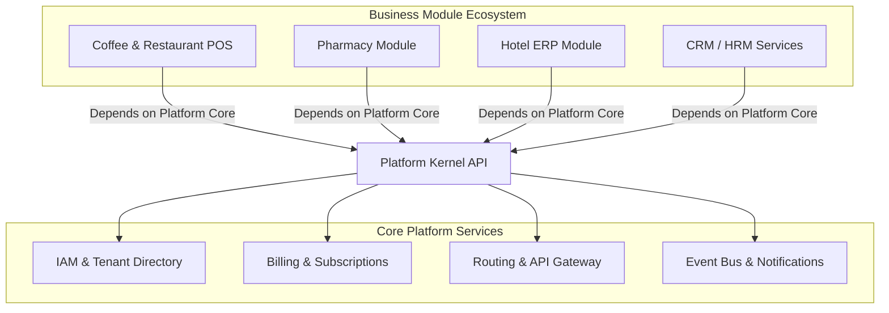
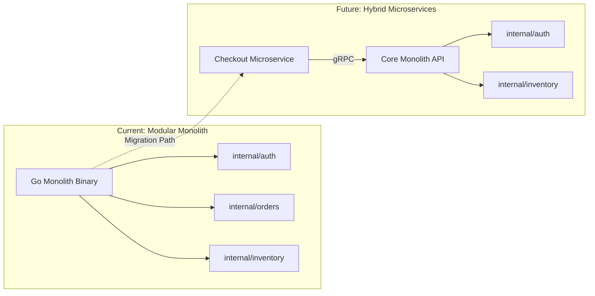
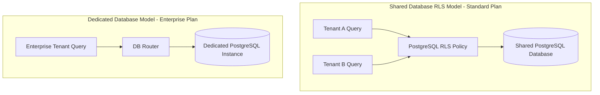

# ENTERPRISE PLATFORM FOUNDATION — ARCHITECTURE DECISION DOCUMENT

**Project Name:** Enterprise SaaS Business Management Platform  
**Document Version:** 1.0.0 — Baseline Standard  
**Date:** July 13, 2026  
**Authors:** Chief Enterprise Architect, SaaS Platform Architect & CTO Advisory Board  
**Classification:** Enterprise Internal — Unrestricted  
**Status:** 🏛️ APPROVED ARCHITECTURAL BASELINE  

---

## Executive Summary

This document establishes the official architectural standards, technology selections, and structural design guidelines for the implementation of the SaaS Business Management Platform. The platform serves as the foundational operating core for multiple vertical business modules (POS, Pharmacy, Hotel, HRM, CRM, Accounting, etc.). The decisions detailed here are designed to enforce data isolation, developer velocity, operational efficiency, and long-term scaling over a 10-year horizon.

---

## 1. Platform Vision

The platform is designed to decouple infrastructure management, tenant billing, authentication, and core data layers from vertical business modules.



### 1.1 Platform Mission
To deliver a secure, robust, and highly performant platform kernel that abstracts the complexities of multi-tenancy, identity access management, billing, notifications, and integration routing, enabling engineering teams to build and deploy specialized business modules within days rather than months.

### 1.2 Long-Term Vision
To evolve into an open enterprise ecosystem where third-party and internal developers can write plug-and-play business modules that run securely across global low-latency edge networks, supporting millions of concurrent transactions with zero data leaks or performance cross-talk.

### 1.3 Core Objectives
*   **High Developer Autonomy:** Module developers must be able to write code, design schemas, and deploy services without modifying the core platform code.
*   **Absolute Multi-Tenant Isolation:** Zero risk of tenant cross-talk or data leaks, enforced at the database engine layer.
*   **Optimal Resource Efficiency:** Keep hosting overhead low for small, emerging merchants while supporting dedicated, high-performance resources for enterprise accounts.
*   **Low Checkout Latency:** Enforce sub-50ms P99 response times for point-of-sale checkout paths globally.

### 1.4 Business Boundaries
*   *Platform Core owns:* Tenant lifecycle, user identities, roles, global subscription billing, payment gateways, inter-module events, audit logging, and centralized notification dispatches.
*   *Business Modules own:* Specialized business logic, custom UI screens, private database tables (isolated by tenant), and module-specific workflows.

---

## 2. Architecture Style Decision

### 2.1 Options Evaluated
1.  **Modular Monolith:** A single deployable binary with strict logical boundaries separating internal modules.
2.  **Microservices:** Fully independent services communicating via network protocols (HTTP/gRPC/Message Queues).
3.  **Hybrid Architecture:** A modular monolith hosting administrative and core domains, combined with microservices for highly concurrent or independent domains (e.g., checkouts, reporting).

### 2.2 Recommendations

| Phase | Recommended Architecture | Decision Rationale |
| :--- | :--- | :--- |
| **Current Stage** | **Modular Monolith** | Minimizes network complexity, infrastructure costs, and deployment overhead for the engineering team. Enforces strict internal package boundaries (`internal/auth`, `internal/orders`) to prevent code coupling. |
| **Future Stage** | **Hybrid / Distributed Services** | As transaction volumes scale, hot domains (such as POS checkout or file generation) will be extracted into independent microservices, leaving administrative features within the core monolith. |



### 2.3 Migration Strategy
1.  **Strict Package Isolation:** Monolith modules must communicate only via public Go interfaces. Direct cross-module function calls or model sharing are disallowed.
2.  **Database Separation:** Modules must query only their own database tables. Cross-module queries must be executed via service-layer method calls rather than SQL table joins.
3.  **Event-Driven Interfaces:** Use an in-memory event dispatcher within the monolith. This simplifies the future transition to an external message broker (like Apache Kafka or AWS EventBridge) when modules are extracted into microservices.

### 2.4 Decision Evaluation

*   **Decision:** Deploy as a **Modular Monolith** in the initial phase, migrating to a **Hybrid Microservices** architecture as traffic and module complexity scale.
*   **Reason:** Optimizes developer velocity and hosting costs at launch, while preserving a clean path to scale the architecture later.
*   **Advantages:**
    *   Simple, zero-downtime deployment pipelines.
    *   No network latency or distributed transaction challenges during initial development.
    *   Low infrastructure hosting costs.
*   **Disadvantages:**
    *   Requires strict code discipline and automated import checking to prevent package coupling.
    *   The entire monolith must be redeployed when releasing minor module updates.
*   **Future Scalability Considerations:** Enforcing interface-only communication between packages ensures modules can be moved to standalone microservices without rewriting core business logic.

---

## 3. Repository Strategy

### 3.1 Options Evaluated
1.  **Polyrepo:** Separate Git repositories for every service, client application, and shared package.
2.  **Monorepo:** A single Git repository housing all client applications, backend services, shared packages, and infrastructure configurations.

### 3.2 Decision Evaluation

*   **Decision:** Implement a **Monorepo** structure using build tooling (such as pnpm workspaces and Go workspaces).
*   **Reason:** Simplifies code sharing, dependency management, and atomic refactoring across frontend clients, backend modules, and shared packages.
*   **Advantages:**
    *   *Atomic Commits:* Make cross-cutting changes (e.g., updating an API response type on both the backend and frontend) in a single pull request.
    *   *Dependency Alignment:* Ensures all services and applications run compatible versions of shared packages.
    *   *Shared Configs:* Consolidates linter configurations, CI/CD pipelines, and infrastructure setups.
*   **Disadvantages:**
    *   Repository size increases over time.
    *   Requires optimized CI/CD build scripts to build and test only the projects modified in a commit.
*   **Future Scalability Considerations:** Use build systems like Turborepo or Nx to cache builds and run test suites in parallel, maintaining pipeline performance as the codebase grows.

---

## 4. Multi-Tenant Strategy

### 4.1 Options Evaluated
1.  **Shared Database, Shared Schema (Row-Level Security):** All tenant data resides in the same tables, isolated by a `tenant_id` column checked by database engine policies.
2.  **Shared Database, Separate Schemas:** Separate schema namespaces within the same database engine for each tenant.
3.  **Separate Databases:** Dedicated database instances for each tenant, ensuring physical data separation.



### 4.2 Recommendations

*   **Current Implementation:** Shared Database, Shared Schema utilizing PostgreSQL Row-Level Security (RLS).
*   **Future Enterprise Implementation:** Hybrid Tenant Model. Standard and growth tier tenants reside in the shared database using RLS, while enterprise accounts are routed to dedicated PostgreSQL database instances.

### 4.3 Decision Evaluation

*   **Decision:** Deploy a **Hybrid Tenant Model** utilizing PostgreSQL Row-Level Security (RLS) on shared databases, with dynamic routing to support dedicated databases for enterprise clients.
*   **Reason:** Optimizes database resource usage and hosting costs for standard users, while offering dedicated performance and physical data isolation to high-value enterprise accounts.
*   **Advantages:**
    *   *RLS Security:* Isolates tenant queries at the database engine layer, protecting against application-layer query bugs.
    *   *Cost Efficiency:* Drastically lowers database memory and connection usage for lower-tier clients.
    *   *Enterprise Growth:* Dynamic routing allows enterprise accounts to scale onto dedicated hardware without code rewrites.
*   **Disadvantages:**
    *   Requires setting the active tenant context (`SET LOCAL app.tenant_id`) before running database queries.
    *   Schema migrations must be managed carefully to ensure updates apply reliably across all shared and dedicated database instances.
*   **Future Scalability Considerations:** Database connection routers must abstract query execution, verifying tenant configurations before selecting connection pools.

---

## 5. Business Module Strategy

To keep the platform core stable, we enforce strict boundaries between core code and vertical business modules.

### 5.1 System Boundaries

```
┌──────────────────────────────────────────────────────────────────────────┐
│                          BUSINESS MODULE LAYER                           │
│   [ Coffee POS ]   [ Restaurant POS ]   [ Pharmacy ]   [ Hotel ERP ]     │
└────────────────────────────────────┬─────────────────────────────────────┘
                                     │ Implements Module Interfaces
                                     ▼
┌──────────────────────────────────────────────────────────────────────────┐
│                         PLATFORM CORE KERNEL                             │
│   [ Identity / IAM ]   [ Subscription Billing ]   [ Tenant Director ]    │
│   [ Event Dispatcher ]  [ Central Notifications ] [ Audit Log System ]   │
└──────────────────────────────────────────────────────────────────────────┘
```

*   **Platform Core Kernel:**
    *   *Responsibilities:* Manage tenant registration, user accounts, subscription billing, API routing, inter-module communications, and audit trails.
    *   *Integrations:* Platform Core code must not depend on business modules. It must compile and run independently of any installed modules.
*   **Business Modules:**
    *   *Responsibilities:* Manage business-specific domain logic, database tables, and user interfaces.
    *   *Integrations:* Modules depend on core platform libraries for tenant validation, session authentication, notification routing, and audit log generation.

### 5.2 Decision Evaluation

*   **Decision:** Build a decoupled **Module Interface Pattern**. Business modules register themselves with the Platform Core kernel at application startup.
*   **Reason:** Ensures the platform core remains stable and easy to maintain while allowing product teams to build and deploy vertical business modules independently.
*   **Advantages:**
    *   *Independent Lifecycle:* Modules can be written, updated, and tested without changing core platform code.
    *   *Clean Code:* Prevents the core database schema and codebase from becoming cluttered with domain-specific features.
*   **Disadvantages:**
    *   Requires writing abstractions for inter-module operations (like stock updates triggered by sales checkout transactions).
*   **Future Scalability Considerations:** Module registration processes must be automated to support dynamic plugin loading and runtime module enabling.

---

## 6. Shared Package Strategy

To maintain codebase consistency and prevent duplicate code, we organize reusable utilities, UI components, and client SDKs into shared packages.

### 6.1 Reusable Packages

| Package Name | Purpose | Key Contents |
| :--- | :--- | :--- |
| **`packages/ui`** | Monorepo-wide UI component library. | Custom buttons, forms, tables, and modal components. |
| **`packages/shared`** | Common helper utilities. | Date calculations, currency formatting, validation helper methods, and error wrappers. |
| **`packages/sdk`** | Auto-generated API client code. | TypeScript clients generated from backend OpenAPI specifications. |
| **`packages/config`** | Shared environment configurations. | Tailwind configurations, TypeScript setups, and build pipeline definitions. |
| **`packages/eslint`** | Unified linter rules. | ESLint and Prettier configurations enforcing code styles. |
| **`packages/types`** | Shared type definitions. | Common API payloads and database schema definitions. |

### 6.2 Decision Evaluation

*   **Decision:** Establish a **Packages Workspace** within the monorepo, referencing shared dependencies using workspace protocols.
*   **Reason:** Minimizes dependency duplication and ensures frontend clients and backend APIs use consistent type and configuration settings.
*   **Advantages:**
    *   Ensures consistent UI designs and styling across all admin portals and user dashboards.
    *   Reduces boilerplates when creating new applications or microservices.
    *   Updating linter configurations automatically applies rules across the entire codebase.
*   **Disadvantages:**
    *   Modifying code in shared packages can affect multiple client applications and services, requiring thorough integration testing.
*   **Future Scalability Considerations:** Run build pipelines that perform unit and integration tests only on projects that import modified packages.

---

## 7. Communication Strategy

### 7.1 Options Evaluated
1.  **REST (JSON over HTTP/2):** Stateless client-to-server and server-to-server data transfers.
2.  **GraphQL:** Query language for APIs, allowing clients to request specific data fields.
3.  **gRPC (Protobuf over HTTP/2):** High-performance, binary RPC framework.
4.  **Message Queue / Event-Driven:** Asynchronous messaging using brokers (SQS, RabbitMQ, Kafka).

### 7.2 Recommendations

| Path | Recommended Protocol | Decision Rationale |
| :--- | :--- | :--- |
| **Internal Calls** | **In-Memory Events / gRPC** | Current monolith modules communicate using in-memory event channels. Future extracted microservices will use gRPC to minimize network latency. |
| **External APIs** | **REST (JSON)** | Provides a standard, widely supported integration protocol for third-party developers, web integrations, and tablet POS terminals. |

### 7.3 Decision Evaluation

*   **Decision:** Standardize external integrations and frontend clients on **REST (JSON over HTTPS)**, and use **in-memory Go channels** (evolving to **gRPC** for microservices) for internal module communications.
*   **Reason:** Balances integration simplicity for frontend apps and external developers with low latency and type safety for internal service operations.
*   **Advantages:**
    *   REST APIs are easy to test, monitor, and scale using standard web proxies.
    *   gRPC minimizes serialization overhead and network latency for backend microservice calls.
*   **Disadvantages:**
    *   Requires maintaining both REST serializers and gRPC Protobuf definitions.
*   **Future Scalability Considerations:** Use automated API generator tools to create REST endpoints and TypeScript SDK code directly from backend Protobuf models.

---

## 8. Authentication and Access Control Strategy

Our authentication model verifies user sessions and enforces data isolation at the gateway, application, and database layers.

```
[ HTTP REQUEST ] ──> [ WAF / ALB ] ──> [ JWT Verification Middleware ] ──> [ RBAC Policy Check ] ──> [ DB RLS Context Setup ]
```

### 8.1 Authentication Architecture
*   **Identity Provider:** Enforce multi-tenant JWT credentials generated by the core auth module.
*   **Session Management:** Short-lived JWT access tokens (15-minute expiration) paired with single-use refresh tokens (7-day expiration).
*   **Storage:** Access and refresh tokens are stored in `httpOnly`, `secure`, and `sameSite` browser cookies to prevent cross-site scripting (XSS) access.

### 8.2 Authorization Architecture
*   **Model:** Role-Based Access Control (RBAC) mapping users to specific permissions.
*   **Enforcement:** API routes verify user permissions using middleware checks before directing requests to business logic modules.

### 8.3 Tenant Isolation
*   **Context Binding:** Database connection middleware retrieves the tenant identifier from verified JWT tokens and runs `SET LOCAL app.tenant_id = $1` on the connection before executing database transactions.
*   **Database Guard:** PostgreSQL Row-Level Security (RLS) policies filter queries, blocking access to records matching different tenant keys.

### 8.4 Decision Evaluation

*   **Decision:** Standardize authorization on **cookie-based JWT rotation** and enforce tenant isolation using **database-level RLS policies**.
*   **Reason:** Eliminates the risk of application-layer query bugs causing cross-tenant data leaks.
*   **Advantages:**
    *   Enforces secure data boundaries that protect tenant data even if application code contains bugs.
    *   Revoking compromised sessions is handled quickly via token blacklist checks in Redis.
*   **Disadvantages:**
    *   Setting connection context variables adds minor database query overhead.
    *   RLS policies add query planning complexity, requiring thorough index tuning.
*   **Future Scalability Considerations:** Connect to external SSO and SAML identity providers to support enterprise logins without modifying the database RLS schema.

---

## 9. Deployment Strategy

### 9.1 Options Evaluated
1.  **Single Virtual Server:** Deploying code directly on a single virtual machine (EC2, Droplet).
2.  **Docker Compose:** Multi-container applications managed using compose files.
3.  **Kubernetes (EKS):** Volumetric orchestration managing containers across server groups.
4.  **Serverless Container Orchestration (AWS ECS Fargate):** Container execution billing resources per task without server management overhead.

### 9.2 Recommendations

| Environment | Recommended Deployment | Decision Rationale |
| :--- | :--- | :--- |
| **Development** | **Docker Compose** | Allows developers to run matching versions of Go, Node, Redis, and PostgreSQL databases locally. |
| **Staging** | **AWS ECS Fargate** | Validates container configurations, deployment scripts, and migration runs in an environment matching production. |
| **Production** | **AWS ECS Fargate** | Provides a highly scalable, serverless container platform that eliminates server administration tasks. |

### 9.3 Decision Evaluation

*   **Decision:** Deploy staging and production environments to **AWS ECS Fargate**, and use **Docker Compose** for local developer setups.
*   **Reason:** Eliminates physical server management overhead and simplifies scaling for the development team.
*   **Advantages:**
    *   No server operating systems to patch or secure.
    *   ECS handles task scaling, container health checks, and load balancer routing automatically.
    *   Low operational overhead compared to managing a Kubernetes cluster.
*   **Disadvantages:**
    *   Vendor lock-in to AWS container scheduling services.
    *   Container start times are slower than running on pre-warmed virtual machines.
*   **Future Scalability Considerations:** As system complexity and team sizes grow, transition to Amazon EKS (Kubernetes) to support multi-cloud deployments and advanced traffic routing.

---

## 10. Development Strategy

We select frameworks and tools that prioritize execution speed, type safety, and development velocity.

### 10.1 Technology Stack Selections

| Layer | Selected Technology | Alternative Evaluated | Selection Reason |
| :--- | :--- | :--- | :--- |
| **Backend API** | **Go (Golang)** | Node.js (TypeScript) | Higher execution speeds, native concurrency handling, and small container image sizes. |
| **Web Portal** | **Next.js 14+** | React SPA | Server-side rendering (SSR) capabilities, build optimizations, and TypeScript integration. |
| **Mobile App** | **React Native** | Flutter | Code sharing with web React components and native device support. |
| **Database** | **PostgreSQL 16** | MongoDB | Strict ACID compliance, relational integrity, and native RLS support. |
| **ORM / SQL** | **sqlx / pgx** | GORM | Prevents unoptimized query generation and ensures precise SQL control. |
| **Cache Store** | **Redis** | Memcached | Rich data structures (lists, hashes) and fast session lookup capabilities. |
| **Queue Broker**| **AWS SQS** | RabbitMQ | Managed messaging queue that requires no server provisioning or patching. |
| **CI/CD** | **GitHub Actions** | Jenkins | Native Git integration and automated, runner-based pipelines. |

### 10.2 Decision Evaluation

*   **Decision:** Standardize the platform on **Go, Next.js, React Native, PostgreSQL, and Redis**, avoiding heavy ORMs in favor of raw SQL libraries (`sqlx`).
*   **Reason:** Ensures the system remains performant, compile-safe, and easy to scale under concurrent merchant transaction loads.
*   **Advantages:**
    *   Fast API compile times and low container startup latencies.
    *   Strong type safety across frontend and backend boundaries.
    *   Precise control over database query performance and indexes.
*   **Disadvantages:**
    *   Requires writing raw SQL queries for complex operations instead of using ORM abstractions.
*   **Future Scalability Considerations:** Database adapters must utilize interfaces to support database replacements or analytics engine integrations later.

---

## 11. Coding Philosophy

We enforce strict coding patterns to ensure our codebase remains clean, readable, and easy to maintain.

```
[ INPUT ] ──> [ HANDLER / ADAPTER ] ──> [ SERVICE / DOMAIN LOGIC ] ──> [ REPOSITORY / ADAPTER ] ──> [ DB ]
```

*   **Domain-Driven Design (DDD):** Align code structures with business boundaries. Maintain clear directories (`auth`, `orders`, `inventory`) and avoid sharing models across domains.
*   **Clean Architecture:** Outer layers (HTTP routing, database drivers) depend on inner logic layers (services, entities). Inner business layers remain free of framework dependencies.
*   **SOLID Principles:** Write focused functions, utilize interface parameters, and inject dependencies at startup.
*   **CQRS (Command Query Responsibility Segregation):** Separate data writes (commands like POS checkouts) from data reads (queries like sales dashboards) to optimize performance.
*   **Repository Pattern:** Abstract database operations behind interfaces, allowing us to swap database backends or run test suites using database mock engines.
*   **Dependency Injection:** Inject required dependencies (database pools, caches) into service constructors at application startup, preventing hidden state configurations.

---

## 12. Enterprise Folder Philosophy

Our monorepo coordinates client projects, backend services, shared packages, and deployment configurations within a clean, version-controlled directory structure.

```
/
├── apps/               # Frontend client applications
│   ├── admin-web/      # Next.js Merchant portal
│   ├── customer-portal/# Next.js Consumer store
│   └── mobile-app/     # React Native Tablet POS application
├── services/           # Backend runtime services
│   ├── api-gateway/    # Internal router and rate limiter
│   ├── auth-service/   # Identity verification server
│   ├── tenant-service/ # Tenant administration logic
│   └── billing-service/# Subscription and payment processor
├── packages/           # Shared, reusable monorepo packages
│   ├── ui/             # Custom component library
│   ├── shared/         # Common utilities (math, formatters)
│   ├── config/         # System build settings
│   └── types/          # Shared type definitions
├── infrastructure/     # Cloud environment configuration files
│   ├── docker/         # Environment Dockerfiles
│   ├── k8s/            # Container orchestration manifest files
│   └── terraform/      # Infrastructure as Code resources
├── .github/            # Pipeline workflows and templates
├── docs/               # System documentation files
└── scripts/            # Database migration and management scripts
```

### 12.1 Root Level Rationale
*   `apps/` contains user-facing client applications. These projects import shared packages but do not contain backend business logic.
*   `services/` houses standalone backend runtime services. These services maintain isolated dependencies and run on independent container ports.
*   `packages/` is the location for shared packages imported by frontend applications and backend services.
*   `infrastructure/` consolidates environment configurations (Terraform files, Kubernetes manifests, and Docker setups) into a single, version-controlled folder.

---

*End of Enterprise Platform Architecture Decision Document*  
*Document maintained by: Chief Enterprise Architect | Status: Approved Standard*
