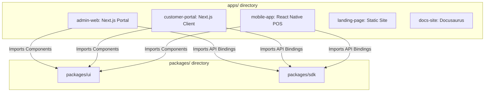

# ENTERPRISE PLATFORM FOUNDATION — MONOREPO STRUCTURE SPECIFICATION

**Project Name:** Enterprise SaaS Business Management Platform  
**Document Version:** 1.0.0 — Baseline Standard  
**Date:** July 13, 2026  
**Authors:** Chief Enterprise Architect, DevOps Director & Monorepo Specialist  
**Classification:** Enterprise Internal — Unrestricted  
**Status:** 🏛️ APPROVED MONOREPO DESIGN  

---

## Executive Summary

This document defines the official repository layout, directory responsibilities, and structural standards for the Enterprise SaaS Business Management Platform monorepo. This structure is designed to support multiple front-end clients, shared UI component packages, and a suite of backend microservices, ensuring that new business modules (CRM, School, Pharmacy, Accounting, etc.) can be added without altering the repository's core configuration.

---

## 1. Repository Root Folder Specification

To manage our applications, services, packages, and deployment configurations, the repository root is organized into ten top-level directories:

| Root Folder | Purpose | Primary Owning Team | Key Content Types |
| :--- | :--- | :--- | :--- |
| **`apps/`** | Hosts user-facing client applications (web, mobile, landing sites). | Frontend Product Engineering | Next.js portal projects, React Native tablet POS codebases. |
| **`services/`** | Hosts backend runtime services, including the API gateway, microservices, and core monolith modules. | Core Backend & Module Engineering | Go and TypeScript services, internal domain packages, and REST handler layers. |
| **`packages/`** | Hosts reusable packages, shared components, configs, and SDKs. | Software Architecture Board | Reusable UI modules, utility libraries, shared types, and compiler configs. |
| **`infrastructure/`** | Hosts all Infrastructure as Code (IaC) and system configurations. | DevOps & Site Reliability Engineering | Terraform modules, Kubernetes files, Docker runtimes, and monitoring setups. |
| **`scripts/`** | Contains administration, setup, and build automation utilities. | SRE & Automation Engineering | Database seeding files, dependency cleanups, and local environment scripts. |
| **`tools/`** | Holds development tools, code generators, and local test setups. | Developer Experience Squad | OpenAPI code generators, mock endpoints, and schema validators. |
| **`templates/`** | Holds boilerplate folder layouts for new services and packages. | Software Architecture Board | Starter templates for new Go microservices and React web portals. |
| **`docs/`** | Houses the project's documentation-as-code files. | Tech Documentation Specialist | SDLC phase manuals, architecture records, and user guides. |
| **`.github/`** | Contains Git automation pipelines and repository governance files. | Release & SecOps Teams | CI/CD YAML configurations, pull request templates, and CODEOWNERS tables. |
| **`assets/`** | Stores static corporate and product design assets. | UX / Brand Design Squad | Brand logotypes, email HTML designs, and receipt print assets. |

---

## 2. Applications (`apps/`)

All user-facing frontend client applications live in the `apps/` directory. Each project imports shared configurations and components from the `packages/` directory, while remaining isolated from backend business logic.



*   **`apps/admin-web/`:** A Next.js Web Admin portal for merchant owners and system administrators. Features include sales reports, inventory setups, and employee roles.
*   **`apps/customer-portal/`:** A consumer-facing Next.js client allowing store customers to review purchase history, pay bills online, and view loyalty points.
*   **`apps/mobile-app/`:** A touch-optimized React Native application for store tablet checkouts, designed to cache catalogs and queue sales offline.
*   **`apps/landing-page/`:** A static marketing website showcasing platform features, plans, pricing matrices, and sales lead forms.
*   **`apps/docs-site/`:** A Docusaurus website that compiles markdown files from the `/docs` directory into a searchable online manual for developers.

---

## 3. Backend Location (`services/`)

To prepare the platform for future microservice extraction, all backend code is housed in the `services/` directory. 

*   **Design Decision:** We disallow a monolithic `/src` directory at the root. Instead, all API endpoints, background processors, and domain modules live in isolated service projects.
*   **Module Boundaries:** The Go monolith is deployed from a service subdirectory (`services/core-api/`). When a domain (e.g., checkouts) needs to be extracted, its code is moved to a new service directory (`services/checkout-api/`) without reorganizing the rest of the repository.

---

## 4. Shared Packages (`packages/`)

Shared configurations and reusable packages live in the `packages/` directory, helping minimize code duplication and ensuring consistent linting and type settings.

*   **`packages/ui/`:** Reusable UI component library (buttons, tables, input fields) styled with TailwindCSS, ensuring consistent designs across all web applications.
*   **`packages/sdk/`:** Auto-generated client SDKs created directly from Go OpenAPI definitions, providing frontend apps with type-safe backend API calls.
*   **`packages/types/`:** Shared TypeScript type definitions mapping standard payload formats and domain states.
*   **`packages/config/`:** Consolidates configuration files (Tailwind configurations, PostCSS setups, and webpack rules).
*   **`packages/eslint/`:** Centralized rules for linting and code styling.
*   **`packages/tsconfig/`:** Consolidates compiler settings for Next.js, React Native, and shared library compilation.
*   **`packages/shared/`:** Shared JavaScript/TypeScript helpers, including monetary rounding routines and regex inputs.
*   **`packages/components/`:** Composed, multi-component layouts (e.g., custom charting components or invoice layout builders).

---

## 5. Infrastructure Configuration (`infrastructure/`)

Deployment configurations, networking scripts, and environment setups are managed in the `infrastructure/` directory, keeping operations code separated from application code.

*   **`infrastructure/docker/`:** Consolidates Dockerfiles for development, staging, and production container builds.
*   **`infrastructure/k8s/`:** Houses Kubernetes deployment resources, ingress routing setups, and horizontal pod scaling configurations.
*   **`infrastructure/terraform/`:** Stores Infrastructure as Code (IaC) files, organized by module (VPC, ECS, RDS, Redis, CloudFront) and environment (`staging`, `production`).
*   **`infrastructure/nginx/`:** Contains load balancer configs, path routing definitions, and proxy caching rules.
*   **`infrastructure/monitoring/`:** Houses dashboard layouts and alert parameters for Prometheus and Grafana.
*   **`infrastructure/logging/`:** Stores log management rules, CloudWatch query scripts, and log rotation parameters.
*   **`infrastructure/secrets/`:** Stores secure configuration templates and access policies for AWS Secrets Manager.

---

## 6. Developer Resources (`scripts/`, `tools/`, `templates/`)

We build automation scripts, development tools, and boilerplates to simplify onboarding and maintain velocity.

*   **`scripts/`:** Automation utilities:
    *   `scripts/setup-dev.sh`: Installs dependencies, configures hosts, and prepares local environments.
    *   `scripts/db-seed.sh`: Seeds local databases with dummy merchant and user records.
    *   `scripts/clean-deps.sh`: Cleans build caches and locks across all projects.
*   **`tools/`:** Developer tools:
    *   `tools/openapi-gen/`: Automatically updates frontend SDK codes from Go router files.
    *   `tools/db-migration/`: Manages database migration runs.
*   **`templates/`:** Standardized boilerplates for new additions:
    *   `templates/go-service/`: Starter template for new backend microservices.
    *   `templates/react-app/`: Starter template for new Next.js portal applications.
    *   `templates/node-package/`: Starter template for new shared JS libraries.

---

## 7. GitHub Configurations (`.github/`)

Repository automation pipelines and security rules are configured in `.github/`:

*   **`workflows/`:** Automates testing and deployments:
    *   `workflows/ci-validate.yml`: Runs tests, checks code styles, and runs security scans on pull requests.
    *   `workflows/deploy-staging.yml`: Deploys updates to staging environments on merges to `main`.
    *   `workflows/deploy-production.yml`: Handles blue-green production releases.
*   **`issue_template/`:** Bug report and feature request templates.
*   **`pull_request_template.md`:** Checklists for developers (e.g., checking test runs, RLS compatibility, and database migrations) before submitting PRs.
*   **`CODEOWNERS`:** Automatically assigns pull request reviewers based on the files modified (e.g., assigning database changes to the DBA team).
*   **`SECURITY.md`:** Explains the platform's security policies and outlines the vulnerability disclosure process.

---

## 8. Documentation-as-Code Integration

System documentation is managed in `/docs/` and integrated directly into our development workflow.

*   **Version Alignments:** Documentation updates must be included in the same pull requests as code modifications.
*   **CI Validation:** Our build pipeline checks that markdown links are valid, and ensures OpenAPI definitions match the latest routing code.

---

## 9. Repository Standards

We follow strict naming conventions to keep the repository layout clean and consistent.

*   **Directory Naming:** All directories must use lowercase names with hyphens (kebab-case).
    *   *Example:* `/apps/admin-web`, `/packages/shared-ui`
*   **File Naming:**
    *   *JavaScript/TypeScript/YAML/SQL:* kebab-case (`user-details.tsx`, `00001_create_users.up.sql`).
    *   *Go files:* snake_case (`main_test.go`, `user_handler.go`).
*   **Package Naming:** Monorepo package names are scoped to the project namespace.
    *   *Example:* `@saas-platform/ui`, `@saas-platform/sdk`, `@saas-platform/types`
*   **Version Strategy:** The repository relies on independent package versioning managed by workspace release managers (e.g., Changesets). Releases are tagged in git using the pattern `package-name@version` (e.g., `@saas-platform/ui@1.2.0`).

---

## 10. Complete Repository Tree Layout

```
/
├── .github/
│   ├── issue_template/
│   │   ├── bug-report.md
│   │   └── feature-request.md
│   ├── workflows/
│   │   ├── ci-validate.yml
│   │   ├── deploy-production.yml
│   │   └── deploy-staging.yml
│   ├── CODEOWNERS
│   ├── pull_request_template.md
│   └── SECURITY.md
├── apps/
│   ├── admin-web/
│   │   └── README.md
│   ├── customer-portal/
│   │   └── README.md
│   ├── docs-site/
│   │   └── README.md
│   ├── landing-page/
│   │   └── README.md
│   └── mobile-app/
│   │   └── README.md
│   └── README.md
├── assets/
│   ├── emails/
│   ├── logos/
│   ├── receipts/
│   └── README.md
├── docs/
│   ├── 01-System-Analysis/
│   ├── 02-System-Design/
│   ├── 03-Implementation-Planning/
│   ├── 04-Development/
│   ├── 05-Testing/
│   ├── 06-Deployment/
│   ├── 07-Operations/
│   ├── 08-Master-Documentation/
│   ├── 09-Enterprise-Platform-Foundation/
│   └── README.md
├── infrastructure/
│   ├── docker/
│   │   ├── development/
│   │   ├── production/
│   │   └── staging/
│   ├── k8s/
│   │   ├── configmaps/
│   │   ├── deployments/
│   │   ├── ingresses/
│   │   ├── secrets/
│   │   └── services/
│   ├── logging/
│   ├── monitoring/
│   ├── nginx/
│   │   ├── conf.d/
│   │   └── nginx.conf
│   ├── secrets/
│   ├── terraform/
│   │   ├── environments/
│   │   │   ├── production/
│   │   │   └── staging/
│   │   └── modules/
│   └── README.md
├── packages/
│   ├── components/
│   │   └── README.md
│   ├── config/
│   │   └── README.md
│   ├── eslint/
│   │   └── README.md
│   ├── sdk/
│   │   └── README.md
│   ├── shared/
│   │   └── README.md
│   ├── tsconfig/
│   │   └── README.md
│   ├── types/
│   │   └── README.md
│   ├── ui/
│   │   └── README.md
│   └── README.md
├── services/
│   └── README.md
├── scripts/
│   ├── clean-deps.sh
│   ├── db-seed.sh
│   ├── setup-dev.sh
│   └── README.md
├── templates/
│   ├── go-service/
│   ├── node-package/
│   ├── react-app/
│   └── README.md
├── tools/
│   ├── db-migration/
│   ├── openapi-gen/
│   └── README.md
├── .editorconfig
├── .gitignore
├── go.work
├── package.json
└── README.md
```

---

*End of Enterprise Monorepo Repository Structure Document*  
*Document maintained by: Software Architecture Board | Status: Approved Standard*
