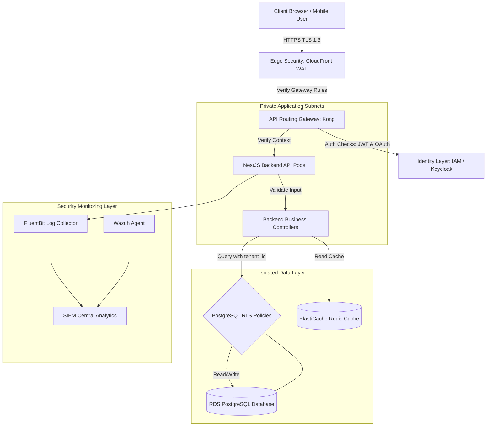
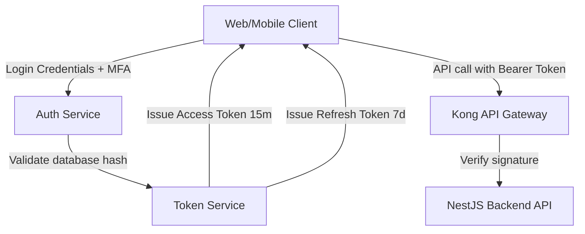
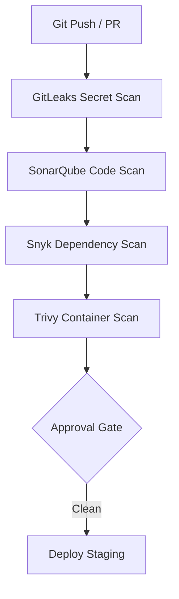
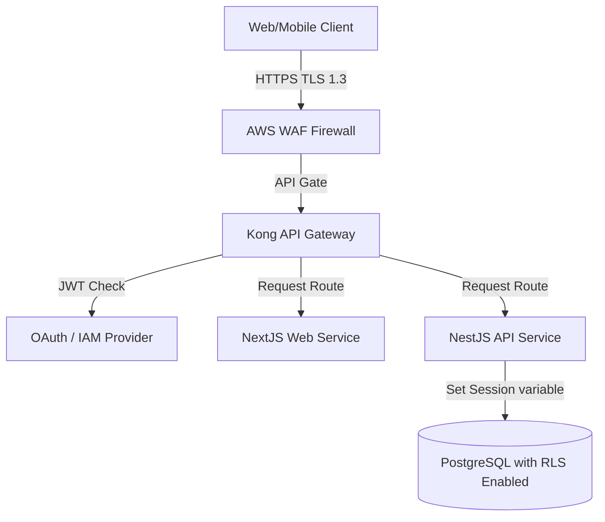
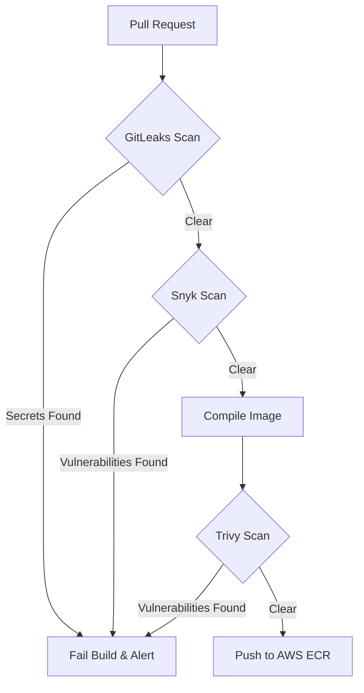
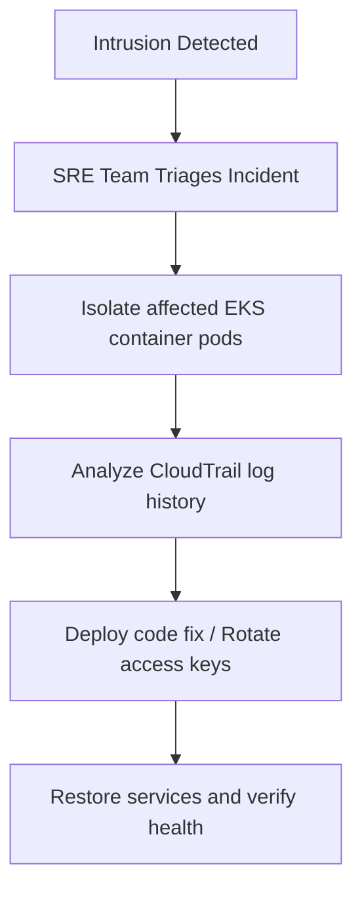

# ENTERPRISE SECURITY ARCHITECTURE & SECURITY FOUNDATION

**Project Name:** Enterprise SaaS Business Management Platform  
**Document Version:** 1.0.0 — Baseline Standard  
**Date:** July 13, 2026  
**Authors:** Chief Information Security Officer (CISO), Enterprise Security Architect & DevSecOps Lead  
**Classification:** Enterprise Internal — Unrestricted  
**Status:** 🏛️ APPROVED SECURITY STANDARD  

---

## SECTION 1 — SECURITY PRINCIPLES

### 1.1 The CIA Triad
Our security architecture is structured around the three core principles of information security:
*   **Confidentiality:** Restricting database query access to authorized tenant accounts and preventing cross-tenant data leaks.
*   **Integrity:** Protecting merchant transaction logs, inventory balances, and tax records from unauthorized changes.
*   **Availability:** Providing high-availability infrastructure layouts to protect core point-of-sale checkout services from denial-of-service (DDoS) outages.

### 1.2 Security by Design
Traditional software development often introduces security assessments as post-development audits. Our SaaS platform integrates threat modeling, static testing, and vulnerability gates directly into code compilation pipelines:
*   **Zero Trust:** Authenticate and authorize every request session before processing operations.
*   **Least Privilege:** Restrict user permissions, container execution environments, and database access pools to their minimum required scopes.
*   **Defense in Depth:** Deploy multiple security layers (WAF, network subnets, API gateways, database RLS, and data encryption) to protect critical assets.
*   **Secure by Default:** Enforce secure-by-default configurations (disabling public ports, masking passwords, and signing upload URLs) across all environments.
*   **Continuous Verification:** Monitor running processes and system configurations continuously using Wazuh and vulnerability scanners.

---

## SECTION 2 — ENTERPRISE SECURITY ARCHITECTURE

Our enterprise security architecture isolates backend services behind firewalls, edge networks, and identity routing gateways.



---

## SECTION 3 — ZERO TRUST SECURITY MODEL

Traditional perimeter networks trust all connections originating from within the firewall. The Zero Trust security model rejects local network trust: **Never Trust, Always Verify**.

```
[ Request Originates ] ──► [ Authenticate JWT ] ──► [ Authorize Tenant ID ] ──► [ Validate Input ] ──► [ Process Query ]
```

### 3.1 Verification Workflow
1.  **Authentication:** Require signed JWT tokens for all incoming requests, verifying cryptographic signatures.
2.  **Authorization:** Map token roles to endpoint permissions, checking user access rights.
3.  **Tenant Verification:** Bind request scopes to target tenant contexts, preventing access to other tenant databases.
4.  **Access Control:** Restrict container routing and system calls to approved paths, maintaining least-privilege configurations.

---

## SECTION 4 — THREAT MODELING

We perform threat modeling on our platform using the **STRIDE** methodology (Spoofing, Tampering, Repudiation, Information Disclosure, Denial of Service, Elevation of Privilege) to identify security risks.

### 4.1 Platform Threat Modeling Matrix

| STRIDE Category | Identified Threat | System Impact | Architectural Mitigation |
| :--- | :--- | :--- | :--- |
| **Spoofing Identity** | Malicious users spoof session credentials to hijack accounts. | Critical — Hijacked accounts allow users to modify business data. | Enforce JWT token verification with refresh token rotation and Multi-Factor Authentication (MFA). |
| **Tampering** | Attackers intercept and modify API payloads (e.g., checkout totals). | Critical — Allows users to manipulate order values and prices. | Enforce SHA-256 integrity signatures on checkouts and encrypt connections with TLS 1.3. |
| **Repudiation** | Users deny executing accounting or inventory modifications. | High — Lack of audit trail prevents fraud investigations. | Write immutable, audit-compliant logs (WORM) capturing user and tenant actions. |
| **Information Disclosure**| Cross-tenant data leaks due to shared schema queries. | Critical — Exposes business data to other tenants. | Enforce database-level PostgreSQL Row-Level Security (RLS) policies using session parameters. |
| **Denial of Service** | DDoS attacks saturate API server CPU capacity. | Critical — Outages prevent merchants from processing checkouts. | Deploy AWS WAF rules, set container resource limits, and configure rate limiters at the gateway. |
| **Elevation of Privilege**| Cashiers exploit backend endpoints to run admin scripts. | Critical — Allows cashiers to alter store settings and prices. | Enforce Role-Based Access Control (RBAC) validations on all backend controller methods. |

---

## SECTION 5 — IDENTITY SECURITY FOUNDATION

Our identity architecture uses JSON Web Tokens (JWT) and OAuth 2.0 to authenticate request sessions.



### 5.1 Identity Standards
*   **Refresh Token Rotation:** Force client applications to trade active refresh tokens for new sets on every token refresh request, invalidating old credentials to prevent reuse.
*   **Multi-Factor Authentication (MFA):** Require TOTP (Time-based One-time Password) authentication codes for manager and administrator logins.

---

## SECTION 6 — ACCESS CONTROL ARCHITECTURE

We authorize user requests using Role-Based Access Control (RBAC) and Attribute-Based Access Control (ABAC).

### 6.1 Role Permission Hierarchy
*   **Owner:** Grants full access to business configuration options, tax setups, and accounting reports.
*   **Admin:** Grants access to employee shift allocations, pricing lists, and inventory adjustments.
*   **Manager:** Grants access to shift cancellations, refund approvals, and product imports.
*   **Employee:** Grants access to standard POS checkouts, customer registration screens, and inventory lookups.
*   **Cashier:** Grants access only to register checkouts, checkout returns, and local item searches.

---

## SECTION 7 — APPLICATION SECURITY

We enforce security controls across all application layers to protect against OWASP Top 10 vulnerabilities.
*   **Cross-Site Scripting (XSS) Protection:** Sanitize client inputs on the frontend and inject security headers (`Content-Security-Policy`) to block untrusted scripts.
*   **CSRF Prevention:** Verify request origins using CSRF tokens and secure, HTTP-only cookie storage flags.
*   **Input Validation:** Validate incoming request payloads in NestJS using decorators (`class-validator`) to sanitize inputs before processing logic.
*   **SQL Injection Prevention:** Query databases using Prisma ORM parameterization patterns to block injection vulnerabilities.

---

## SECTION 8 — API SECURITY ARCHITECTURE

We secure API endpoints at the gateway layer to protect backend services.
*   **Authentication & Authorization:** Verify request signatures and scopes before routing traffic to backend containers.
*   **API Rate Limiting:** Enforce rate-limiting policies at the gateway to restrict client requests (e.g., maximum 100 requests per 5 minutes per IP address) and prevent API abuse.
*   **Gateway Logs:** Log incoming API requests to identify suspicious traffic spikes.

---

## SECTION 9 — DATA SECURITY ARCHITECTURE

We protect customer and business data using encryption and isolation controls.
*   **Encryption in Transit:** Enforce HTTPS routing protocols using TLS 1.3 certificates.
*   **Encryption at Rest:** Encrypt databases and S3 storage buckets using 256-bit Advanced Encryption Standard (AES-256) keys.
*   **Tenant Data Isolation:** Isolate tenant database records using PostgreSQL Row-Level Security (RLS) policies, appending `tenant_id` session parameters to all transaction queries.

---

## SECTION 10 — INFRASTRUCTURE SECURITY

*   **Cloud Access Control:** Restrict cloud resources access using IAM roles based on least-privilege principles.
*   **Container Security:** Scan Docker images for vulnerabilities in build pipelines, and run containers as non-root users.
*   **Kubernetes Hardening:** Enforce network policies to restrict pod communication, blocking database access originating from frontend namespaces.

---

## SECTION 11 — NETWORK SECURITY

We secure communication pathways by configuring isolated network layers.
*   **Public Layer (Edge CDN / Load Balancer):** Filter incoming traffic using Web Application Firewalls (AWS WAF) to block malicious requests.
*   **Private Compute Layer (EKS Pods):** Host application containers in private subnets, blocking direct inbound routing from the internet.
*   **Private Data Layer (PostgreSQL / Redis):** Isolate database instances in private subnets, allowing connections only from authorized application pods.

---

## SECTION 12 — DEVSECOPS SECURITY PIPELINE

We integrate security validation tools directly into build pipelines to automate checks.



---

## SECTION 13 — SECURITY OBSERVABILITY

We monitor system logs and metrics to identify security threats.
*   **Authentication Auditing:** Flag suspicious activities like failed login attempts, multiple concurrent logins, and unauthorized API calls.
*   **Intrusion Detection:** Scan container logs and system call anomalies using Wazuh agents.
*   **Tooling:** OpenSearch SIEM platform, Wazuh, AWS CloudWatch.

---

## SECTION 14 — INCIDENT RESPONSE FOUNDATION

We follow a structured incident response workflow to handle security events:
*   **Detection:** Identify security incidents using SIEM alerts and Wazuh scans.
*   **Containment:** Isolate affected container pods and disable compromised user keys to prevent further damage.
*   **Investigation:** Analyze access logs and audit trails to determine the incident's root cause.
*   **Recovery:** Re-build affected resources and update access keys to restore service.
*   **Lessons Learned:** Document post-incident reviews to improve platform security controls.

---

## SECTION 15 — SECURITY AUDITING STRATEGY

We perform regular security audits to identify vulnerabilities and maintain compliance:
*   **Code Audits:** Scan code repositories weekly for vulnerabilities using Snyk and SonarQube.
*   **Infrastructure Audits:** Audit Terraform configurations and IAM roles monthly to check for drift.
*   **Access Reviews:** Perform quarterly reviews of user and administrator access permissions.

---

## SECTION 16 — SECURITY TOOL STACK REFERENCE

Our standardized security tools are detailed in the table below:

| Category | Selected Tool | Purpose |
| :--- | :--- | :--- |
| **Secrets Engine** | **HashiCorp Vault** | Secures API keys and database credentials. |
| **Threat Detection** | **Wazuh Agent** | Monitors container runtimes for security anomalies. |
| **Container Scan** | **Trivy / Snyk** | Scans container images for vulnerabilities. |
| **Code Scanning** | **SonarQube** | Analyzes code repositories for quality issues and code smells. |
| **Secret Scanning** | **GitLeaks** | Scans repositories for hardcoded credentials. |
| **DAST Scanner** | **OWASP ZAP** | Performs dynamic security testing on active endpoints. |
| **Edge Security** | **AWS WAF** | Filters incoming web traffic to block malicious requests. |

---

## SECTION 17 — SECURITY MATURITY MODEL

Our security program scales along a defined maturity curve:
*   **Level 1 (Basic Security):** Enforce basic requirements like SSL/TLS and static database passwords.
*   **Level 2 (Managed Security):** Integrate static code testing and run backups.
*   **Level 3 (Automated Security):** Automate code scans and container checks in CI/CD pipelines.
*   **Level 4 (Enterprise Security):** Deploy Multi-AZ compute nodes and enforce database RLS isolation.
*   **Level 5 (Zero Trust):** Enforce Zero Trust authentication, rotate keys automatically, and monitor containers continuously.

---

## SECTION 18 — FINAL SECURITY ARCHITECTURE DIAGRAMS

### 18.1 Enterprise Security Architecture


### 18.2 Zero Trust Verification Flow
```
[ User Request ] ──► [ Check JWT signature ] ──► [ Check Tenant ID context ] ──► [ Check Controller Role ] ──► [ Process ]
```

### 18.3 DevSecOps Pipeline


### 18.4 Threat Detection Flow
```
[ Failed Logins ] ──► [ FluentBit Forward ] ──► [ Loki logs ] ──► [ SIEM Alerts ] ──► [ PagerDuty Pager ]
```

### 18.5 Incident Response Flow


---

*End of Enterprise Security Architecture & Security Foundation*  
*Document maintained by: Chief Information Security Officer (CISO) | Status: Approved Security Standard*
