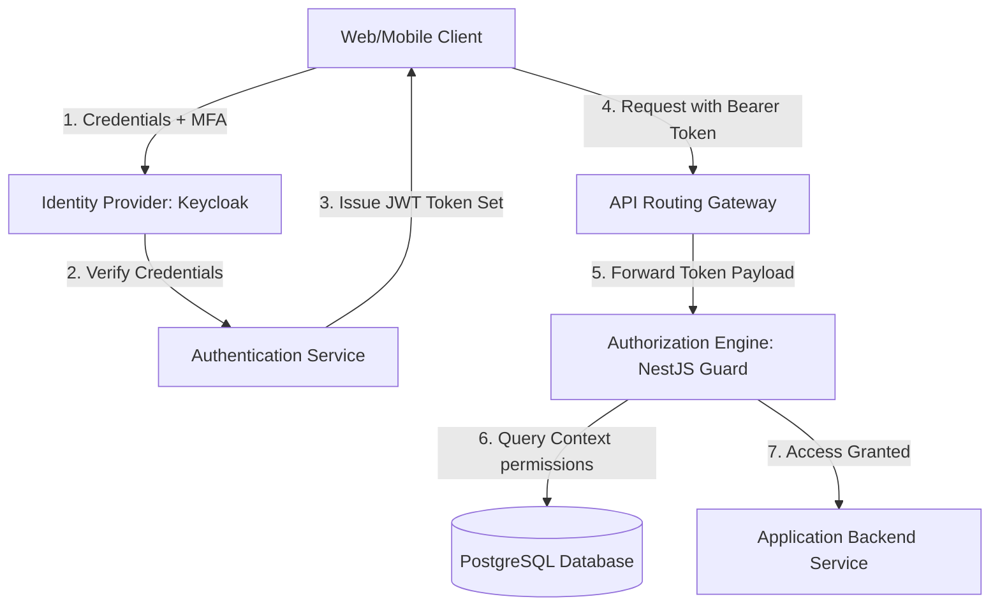
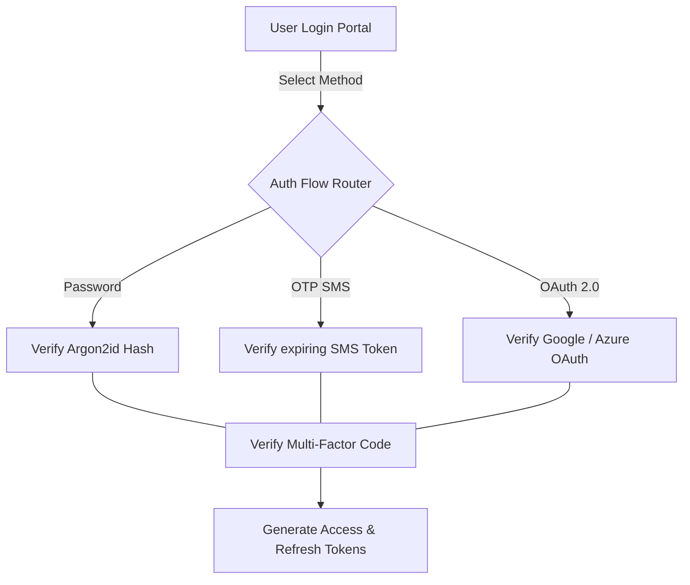
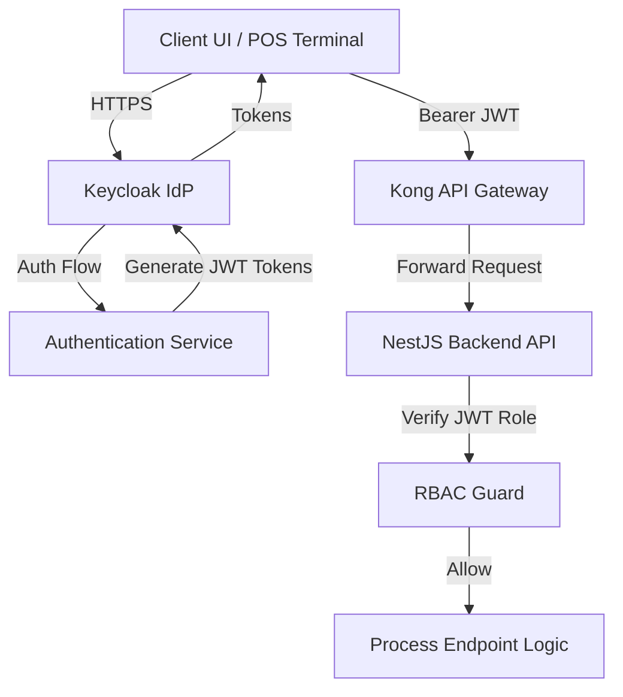
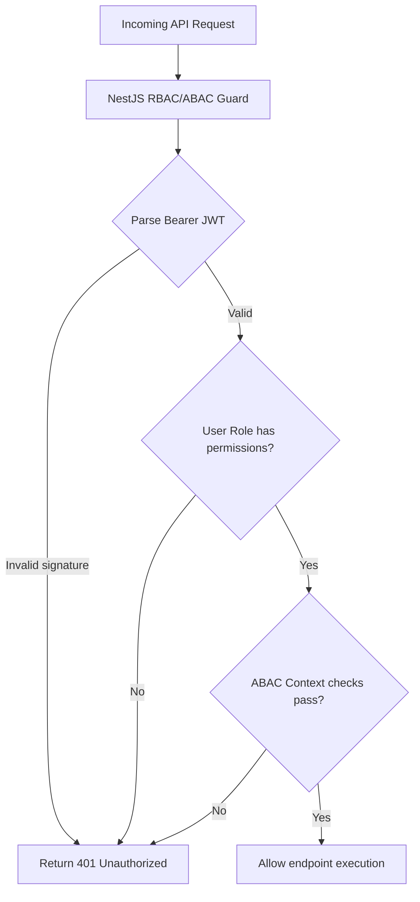
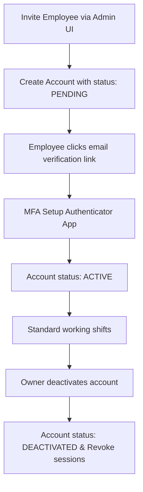

# IDENTITY & ACCESS MANAGEMENT (IAM) ARCHITECTURE

**Project Name:** Enterprise SaaS Business Management Platform  
**Document Version:** 1.0.0 — Baseline Standard  
**Date:** July 13, 2026  
**Authors:** Principal Identity Architect, IAM Engineer & DevSecOps Lead  
**Classification:** Enterprise Internal — Unrestricted  
**Status:** 🏛️ APPROVED IDENTITY STANDARD  

---

## SECTION 1 — IAM FUNDAMENTALS

### 1.1 Core IAM Principles
Our identity infrastructure is built on the four pillars of access management:
*   **Identity (Who are you?):** Defining unique user profile structures across all tenants.
*   **Authentication (Prove who you are):** Verifying credentials, access tokens, and Multi-Factor Authentication (MFA) codes.
*   **Authorization (What can you access?):** Enforcing access controls to verify permissions before executing code blocks.
*   **Accounting (What did you do?):** Log security and transaction events to maintain compliance trails.

### 1.2 The IAM Lifecycle
```
User Creation ──► Verification ──► Active Usage ──► Permission Updates ──► Deactivation / Offboarding
```

---

## SECTION 2 — ENTERPRISE IAM ARCHITECTURE

Our identity architecture uses external identity providers (IdP) and token token generation pipelines to manage user access.



---

## SECTION 3 — USER IDENTITY DATA MODEL

Our identity records map user profiles, authentication methods, tenant memberships, roles, permissions, and audit logs.

*   **User Profile:** Contains non-sensitive metadata such as full name, email, phone number, and preferences.
*   **Authentication Credentials:** Stores password hashes (Argon2id), active MFA secret keys, and social login mappings.
*   **Roles & Permissions:** Links user records to RBAC role mappings.
*   **Tenant Membership:** Links user profiles to active business memberships.
*   **Audit History:** Logs failed login attempts and permission changes to maintain security compliance trails.

---

## SECTION 4 — AUTHENTICATION ARCHITECTURE

We support multiple authentication flows to accommodate cashiers, business owners, and external clients.



---

## SECTION 5 — TOKEN MANAGEMENT

We use JSON Web Tokens (JWT) to secure API calls.
*   **Access Token:** Short-lived tokens (expires in 15 minutes) used to authenticate API requests.
*   **Refresh Token:** Long-lived tokens (expires in 7 days) used to generate new access tokens.
*   **Rotation:** Force client applications to trade active refresh tokens for new sets on every token refresh request, invalidating old credentials to prevent reuse.

### 5.1 Token Payload Schema
```json
{
  "iss": "identity.saas.com",
  "sub": "usr-8f3b2d1c-4e3f-2b1a",
  "tenant_id": "tenant-coffee-pos-77a",
  "role": "manager",
  "permissions": ["inventory:read", "inventory:update", "pos:checkout"],
  "exp": 1783948200
}
```

---

## SECTION 6 — SESSION MANAGEMENT

*   **Session Tracking:** Store active user sessions in Redis to monitor logged-in devices and support session revocation.
*   **Device Management:** Log client IP addresses, user agents, and login times, allowing users to revoke sessions from unrecognized devices.
*   **Concurrent Control:** Limit active sessions to prevent credential sharing among employees (e.g., maximum 3 concurrent sessions per user account).

---

## SECTION 7 — MULTI-TENANT IDENTITY ISOLATION

Our identity system allows users to hold memberships in multiple business workspaces while maintaining strict data isolation.

```
                  User Record: usr-cashier-john
                       │
       ┌───────────────┴───────────────┐
       ▼                               ▼
Membership A: Coffee POS         Membership B: Restaurant
Role: Cashier                    Role: Shift Manager
tenant_id: tenant-coffee-77a     tenant_id: tenant-rest-99b
```

*   **Cross-Tenant Separation:** Application controllers read the user's active `tenant_id` from request headers, scoping all database queries to that tenant context.

---

## SECTION 8 — ROLE-BASED ACCESS CONTROL (RBAC)

We authorize operations by mapping users to roles with defined permissions.

### 8.1 Role Permission Matrix

| Role Identifier | Target Audience | Permitted Module Actions |
| :--- | :--- | :--- |
| **Platform Admin** | SaaS Operations Team | Manage global configurations, billings, and tenant creations. |
| **Business Owner** | Merchants / Subscribers | Access all billing, inventory, HR, accounting, and sales operations. |
| **Manager** | Store/Shift Managers | Edit product listings, approve refunds, and view sales summaries. |
| **Employee** | Store Staff | View inventory levels, add customers, and run standard checkouts. |
| **Cashier** | Checkout Staff | Execute checkouts, accept returns, and view cash drawer balances. |

---

## SECTION 9 — ATTRIBUTE-BASED ACCESS CONTROL (ABAC)

While RBAC manages access by role, we use ABAC to enforce fine-grained security policies based on request contexts.
*   **Branch Constraints:** Restrict access to cash drawer data to employees physically located at the same branch.
*   **Working Hours:** Prevent cashiers from logging in outside of their scheduled working hours.
*   **Department Constraints:** Restrict employee profile views to managers assigned to the same department.

---

## SECTION 10 — PERMISSION MANAGEMENT SCHEMA

Our permission engine uses structured namespaces to manage access control rules:
*   `Namespace: Module -> Feature -> Action`

### 10.1 Permission Namespace Examples
*   `inventory:product:create` $\rightarrow$ Allows creation of new inventory items.
*   `accounting:ledger:write` $\rightarrow$ Allows ledger entry modifications.
*   `crm:customer:delete` $\rightarrow$ Allows customer record deletions.

---

## SECTION 11 — MULTI-FACTOR AUTHENTICATION (MFA)

*   **Authenticator Apps (TOTP):** Enforce RFC 6238 TOTP requirements for all manager and owner accounts.
*   **Backup Codes:** Provide one-time backup recovery codes to users during MFA enrollment to prevent account lockouts.

---

## SECTION 12 — OAUTH2 & SSO INTEGRATION

*   **Social Logins:** Support Google Workspace and Microsoft Entra ID logins for business accounts.
*   **Enterprise Single Sign-On (SSO):** Integrate client identity systems using SAML 2.0 to support enterprise users.

---

## SECTION 13 — IDENTITY PROVIDER (IDP) STRATEGY

We compared custom-built IAM engines against managed Identity Provider solutions.

### 13.1 IdP Strategy Evaluation

| Metric | Custom IAM Engine | Managed IdP (Keycloak / Auth0) |
| :--- | :--- | :--- |
| **Cost** | 🟢 **Lower** (Zero licensing overhead costs). | 🔴 **Higher** (Auth0 scales costs per active user). |
| **Control** | 🟢 **Absolute** (Full database schema customizability). | 🟡 **Limited** (Keycloak requires Java extensions). |
| **Scalability** | 🔴 **High Dev Cost** (Requires custom MFA/SSO updates). | 🟢 **Ready** (Built-in OAuth2, MFA, and SAML systems). |

**Decision:** Deploy **Keycloak** in our cluster namespaces to balance hosting costs, scalability, and security control.

---

## SECTION 14 — USER LIFECYCLE MANAGEMENT

*   **Provisioning:** Create new user accounts and send email verification links automatically.
*   **Deprovisioning:** Deactivate accounts and revoke active refresh tokens immediately when employees leave.

---

## SECTION 15 — IAM AUDIT LOGGING

We record all security events in write-once audit logs:
*   **Authentication Events:** Log successful logins, logouts, and failed credential attempts (capturing client IPs and user agents).
*   **Authorization Events:** Log privilege changes and role updates.
*   **Security Events:** Log password reset requests and MFA configuration changes.

---

## SECTION 16 — IAM SECURITY CONTROLS

We enforce rate limits and lockout policies to protect authentication endpoints from brute-force attacks:
*   **Lockout Policy:** Lock user accounts for 15 minutes after 5 consecutive failed login attempts.
*   **Token Revocation:** Configure backend services to publish token revocation notifications to Redis queues, immediately invalidating active client access.

---

## SECTION 17 — IAM DATABASE DESIGN

Our relational schema manages identity entities and role mappings.

```
  [ Users ] ──► [ Memberships ] ──► [ Tenants ]
      │
  [ User Roles ] ◄──► [ Roles ] ──► [ Role Permissions ] ◄──► [ Permissions ]
      │
  [ Active Sessions ] / [ Audit Logs ]
```

---

## SECTION 18 — IAM OBSERVABILITY

We monitor authentication events using SIEM platforms and Wazuh to identify security anomalies:
*   **Suspicious Activity Alerts:** Trigger alerts if users log in from multiple geolocations within short windows or if failed login rates spike.

---

## SECTION 19 — IAM TOOL STACK REFERENCE

Our standardized IAM tools are detailed in the table below:

| Category | Selected Tool | Purpose |
| :--- | :--- | :--- |
| **Identity Provider**| **Keycloak** | Open-source identity management provider supporting OAuth2 and SAML. |
| **Token Standard** | **JWT (JSON Web Tokens)** | Standard payload format for client-side session states. |
| **Password Hashing**| **Argon2id** | Memory-hard hashing algorithm used for password encryption. |
| **Secrets Engine** | **HashiCorp Vault** | Secures API keys and OAuth client credentials. |
| **Intrusion Agent** | **Wazuh Agent** | Monitors authentication logs for brute-force attacks. |
| **Audit Logs Search**| **Grafana Loki** | Aggregates and indexes authentication audit logs. |

---

## SECTION 20 — FINAL IAM ARCHITECTURE MERMAID DIAGRAMS

### 20.1 Enterprise IAM Architecture


### 20.2 Authentication Flow
```
[ Login Credentials ] ──► [ Check Argon2 Hash ] ──► [ MFA Challenge ] ──► [ Generate Token ] ──► [ Register Redis ]
```

### 20.3 Authorization Flow


### 20.4 Multi-Tenant Access Control
```
                       Kong Ingress Gateway
                                │
                 [ Header: X-Tenant-Id = Tenant-A ]
                                │
               [ NextJS / NestJS Workspace Router ]
                                │
         [ Prisma Client: app.tenant_id = Tenant-A ]
                                │
        [ PostgreSQL RLS: WHERE tenant_id = Tenant-A ]
```

### 20.5 User Lifecycle Management


---

*End of Identity & Access Management (IAM) Architecture*  
*Document maintained by: Principal Identity Architect | Status: Approved Identity Standard*
