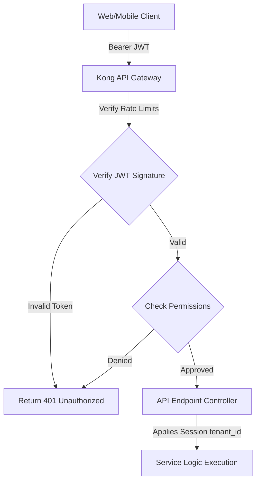
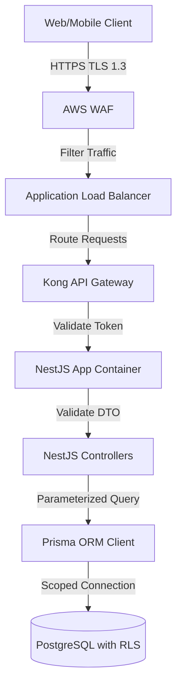
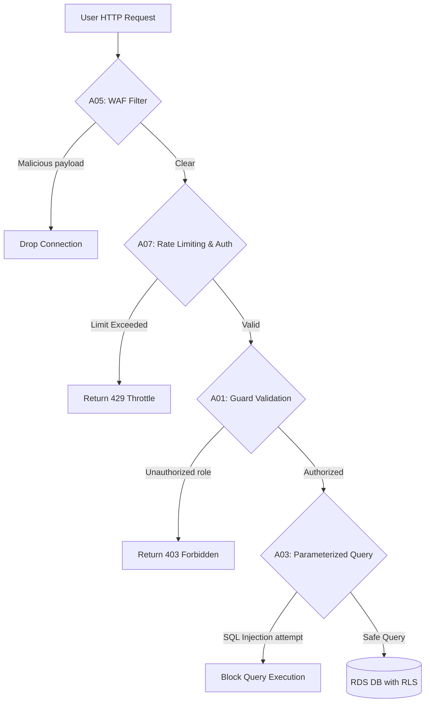
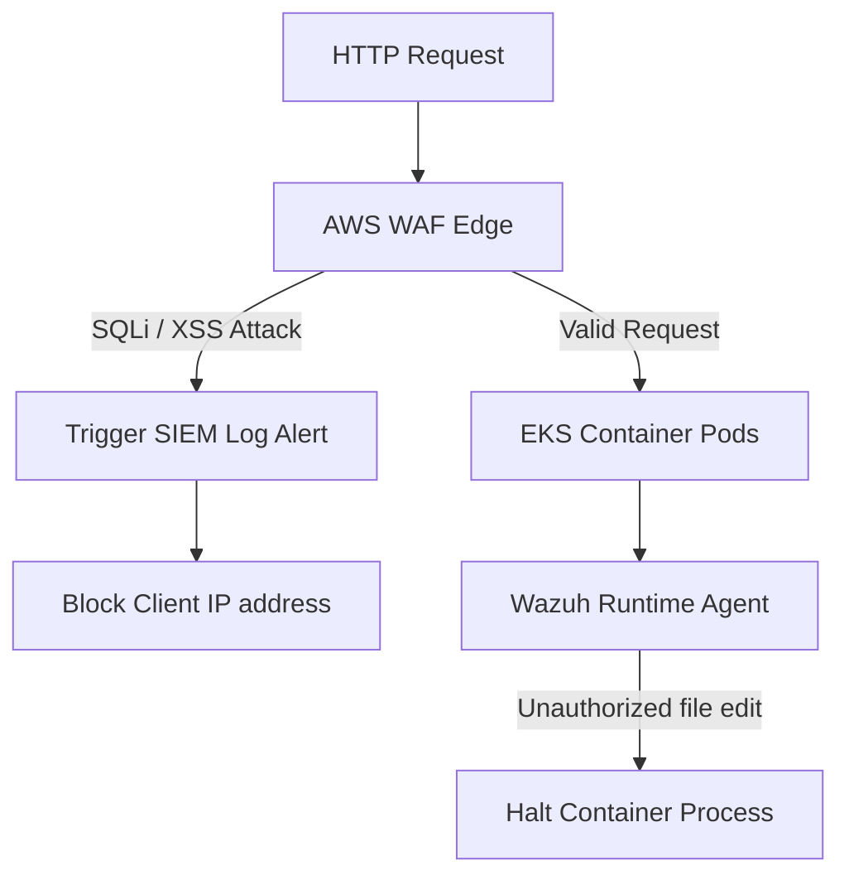

# APPLICATION SECURITY & OWASP PROTECTION STRATEGY

**Project Name:** Enterprise SaaS Business Management Platform  
**Document Version:** 1.0.0 — Baseline Standard  
**Date:** July 13, 2026  
**Authors:** Principal Application Security Engineer, OWASP Specialist & DevSecOps Lead  
**Classification:** Enterprise Internal — Unrestricted  
**Status:** 🏛️ APPROVED APPSEC STANDARD  

---

## SECTION 1 — SECURE SOFTWARE DEVELOPMENT

### 1.1 Security by Design
Integrating security checks early in the development lifecycle prevents vulnerabilities from reaching production systems.

```
Design (Threat Modeling) ──► Dev (Linting & SAST) ──► Test (DAST Scan) ──► Deploy (Container Scan) ──► Monitor (SIEM)
```

### 1.2 Core Security Principles
*   **Secure Default Configuration:** Disable unused ports, enforce TLS 1.3, and set strict security headers by default.
*   **Least Privilege:** Restrict application database connections to standard CRUD permissions, blocking database administrative commands.
*   **Defense in Depth:** Deploy multiple security layers (Edge WAF, API gateway validation, JWT auth, database RLS) to protect customer data.
*   **Fail Secure:** If authorization check processes fail, default to blocking access to prevent data leaks.

---

## SECTION 2 — OWASP TOP 10 PROTECTION MATRIX

We mitigate the OWASP Top 10 vulnerabilities using targeted security controls:

| OWASP Vulnerability | Risk Analysis | System Mitigation Control |
| :--- | :--- | :--- |
| **A01: Broken Access Control** | Cashiers can access admin dashboards or other tenant databases. | Validate `tenant_id` and user permissions using database RLS and NestJS guards on all controller routes. |
| **A02: Cryptographic Failures** | Storing customer passwords or API keys in plain text. | Encrypt databases at rest with AES-256 and hash passwords using memory-hard Argon2id algorithms. |
| **A03: Injection** | SQL injection via dynamic query parameters. | Query databases using parameterized Prisma ORM calls, and validate inputs using class-validators. |
| **A04: Insecure Design** | Architectural flaws that allow attackers to bypass business logic. | Perform STRIDE threat modeling on all system components before development. |
| **A05: Security Misconfiguration** | Exposing Kubernetes dashboard ports or debug headers. | Run automated configuration audits in pipelines, disabling debugging consoles in production. |
| **A06: Vulnerable Components** | Running libraries with known vulnerabilities (e.g., outdated Log4j equivalents). | Scan packages daily in CI pipelines using Snyk and Dependabot. |
| **A07: Identification & Auth Failures** | Brute-force attacks on login portals or predictable session IDs. | Enforce account lockouts after consecutive failed logins and rotate session refresh tokens. |
| **A08: Software & Data Integrity** | Compromised build packages deployed to Kubernetes namespaces. | Sign Docker images in CI pipelines and require pull request approvals from two senior engineers. |
| **A09: Security Logging Failures** | Lacking log trails to track data breaches. | Write structured JSON logs capturing user IDs and tenant IDs to Loki, auditing security events. |
| **A10: SSRF** | API servers fetching malicious payloads from metadata portals. | Restrict outbound traffic from compute subnets to whitelisted domains using egress network policies. |

---

## SECTION 3 — FRONTEND SECURITY ARCHITECTURE

Our Next.js web applications enforce client-side security controls:
*   **XSS Mitigation:** Escape dynamic variables automatically in React templates, and sanitize HTML inputs using DOMPurify.
*   **Secure Cookie Handling:** Store authentication tokens only in HTTP-only, secure, SameSite=Strict cookies to block access from script processes.
*   **Content Security Policy (CSP):** Enforce strict CSP headers, blocking inline script execution and restricting connections to whitelisted API endpoints.

### 3.1 Next.js Content-Security-Policy Configuration
```javascript
// next.config.js - Custom Security Headers configuration
const cspHeader = `
  default-src 'self';
  script-src 'self' 'templated-nonce-value';
  style-src 'self' 'unsafe-inline';
  img-src 'self' data: https://saas-cdn.com;
  connect-src 'self' https://api.saas.com;
  frame-ancestors 'none';
  base-uri 'self';
  form-action 'self';
`;

module.exports = {
  async headers() {
    return [
      {
        source: '/(.*)',
        headers: [
          { key: 'Content-Security-Policy', value: cspHeader.replace(/\n/g, '') },
          { key: 'X-Frame-Options', value: 'DENY' },
          { key: 'X-Content-Type-Options', value: 'nosniff' },
          { key: 'Referrer-Policy', value: 'strict-origin-when-cross-origin' }
        ],
      },
    ];
  },
};
```

---

## SECTION 4 — MOBILE APPLICATION SECURITY

Our React Native mobile POS applications protect data stored on physical devices:
*   **Keychain Storage:** Save JWT tokens and session keys securely using iOS Keychain and Android Keystore APIs.
*   **Certificate Pinning:** Pin API gateway SSL/TLS certificate hashes inside the application binary to block man-in-the-middle (MITM) attacks.
*   **Biometric Authentication:** Integrate iOS FaceID and Android Biometrics verification checks before exposing transaction screens.
*   **Jailbreak Detection:** Check device filesystems on app launch, terminating execution if root access or Cydia environments are identified.

---

## SECTION 5 — BACKEND APPLICATION SECURITY

Our NestJS API gateways use guards and security middlewares to sanitize requests.

### 5.1 NestJS Security Integration
```typescript
import { NestFactory } from '@nestjs/core';
import { AppModule } from './app.module';
import { ValidationPipe } from '@nestjs/common';
import helmet from 'helmet';
import rateLimit from 'express-rate-limit';

async function bootstrap() {
  const app = await NestFactory.create(AppModule);

  // Inject secure HTTP headers using Helmet
  app.use(helmet());

  // Configure API CORS origins
  app.enableCors({
    origin: ['https://saas.com', 'https://pos.saas.com'],
    methods: 'GET,POST,PUT,DELETE',
    allowedHeaders: 'Content-Type,Authorization,X-Tenant-Id',
    credentials: true,
  });

  // Enable global DTO validation pipes
  app.useGlobalPipes(new ValidationPipe({
    whitelist: true,
    forbidNonWhitelisted: true,
    transform: true,
  }));

  // Configure rate limiting
  app.use(rateLimit({
    windowMs: 5 * 60 * 1000, // 5 minutes window
    max: 100, // Limit each IP to 100 requests per window
    message: 'Too many requests from this IP, please try again after 5 minutes',
  }));

  await app.listen(4000);
}
bootstrap();
```

---

## SECTION 6 — API SECURITY ARCHITECTURE

Our API gateways filter incoming requests to protect backend services from abuse.



---

## SECTION 7 — INPUT VALIDATION STRATEGY

We validate all incoming API payloads against strict schemas before executing business logic.
*   **Whitelist Validation:** Check inputs against allowed formats, blocking unexpected characters.
*   **Schema Enforcement:** Validate request formats using NestJS decorators (`class-validator`), checking for required fields and correct data types.

---

## SECTION 8 — AUTHENTICATION SECURITY

We enforce security controls on our authentication endpoints to prevent brute-force attacks:
*   **Argon2id Hashing:** Hash user passwords using memory-hard Argon2id algorithms before storing records in databases.
*   **Lockout Policy:** Lock user accounts for 15 minutes after 5 consecutive failed login attempts, preventing automated password guessing.
*   **MFA Requirements:** Require Time-based One-time Password (TOTP) codes for all manager and owner logins.

---

## SECTION 9 — AUTHORIZATION SECURITY

We verify user permissions and tenant scopes on every request to prevent privilege escalation:
*   **Role Validation:** Verify that the user's role has the required permissions for the endpoint.
*   **Tenant Scope Validation:** Check the user's tenant membership to ensure they can access only their own tenant data.

---

## SECTION 10 — DATABASE SECURITY

We protect our PostgreSQL database instances from injection and data leaks:
*   **Query Parameterization:** Query databases using parameterized Prisma ORM calls to prevent SQL injection vulnerabilities.
*   **Row-Level Security (RLS):** Configure database-level RLS policies to restrict queries to the tenant ID bound to the user's session.
*   **Encryption:** Encrypt sensitive database columns (like client names or tax details) at rest.

---

## SECTION 11 — FILE UPLOAD SECURITY

We scan and validate all uploaded files to protect storage hosts from malware:
*   **Format Whitelists:** Accept only defined file extensions (`.jpg`, `.png`, `.webp`, `.pdf`).
*   **Malware Scans:** Pass dynamic uploads through ClamAV virus scanning containers before saving them to S3.
*   **Isolation:** Store uploaded files in isolated S3 buckets with public access blocked.

---

## SECTION 12 — DEPENDENCY SECURITY

We run daily security scans in CI/CD pipelines using **Snyk** and **Dependabot** to identify libraries with known vulnerabilities.
*   **Security Actions:** If dependencies have high-severity vulnerabilities, block build pipelines and alert developers to update the packages.

---

## SECTION 13 — SECURITY TESTING STRATEGY

We validate platform security using automated and manual testing:
*   **SAST Scans:** Analyze source code repositories for security vulnerabilities and code smells using SonarQube.
*   **DAST Scans:** Run automated web application scans on staging environments using OWASP ZAP to identify vulnerabilities.
*   **Penetration Testing:** Coordinate annual penetration tests with external security firms to identify complex vulnerabilities.

---

## SECTION 14 — RUNTIME APPLICATION PROTECTION

We deploy runtime protection tools to identify and block security threats in production:
*   **AWS WAF:** Filter incoming web traffic at the edge to block injection attacks and malicious web scrapers.
*   **Anomaly Auditing:** Monitor system calls and file changes on compute nodes using Wazuh agents.

---

## SECTION 15 — SECURITY AUDIT LOGGING

We log all security events to Loki to support incident investigations:
*   **Auth Audits:** Log successful logins, logouts, and failed credential attempts.
*   **Operations Audits:** Log privilege changes and critical admin actions.
*   **Data Scopes:** Include user IDs and tenant IDs in all security log entries.

---

## SECTION 16 — SECURE CODING GUIDELINES

We enforce secure coding standards across all development teams:
*   **Secrets Management:** Never hardcode API keys or credentials in source code. Retrieve secrets at runtime from AWS Secrets Manager.
*   **Input Sanitization:** Sanitize all client-side inputs to protect against injection and XSS vulnerabilities.
*   **Secure Error Handling:** Return generic error responses to clients, logging detailed error traces internally for debugging.

---

## SECTION 17 — SECURITY REVIEW PROCESS

We require all code changes to pass a structured security review before production deployment:

```
Developer PR Commit ──► Peer Code Review ──► SAST / Dependency Scans ──► Security Sign-off
```

---

## SECTION 18 — SECURITY TOOL STACK REFERENCE

Our standardized security tools are detailed in the table below:

| Category | Selected Tool | Purpose |
| :--- | :--- | :--- |
| **SAST Analyzer** | **SonarQube** | Analyzes code repositories for vulnerabilities and code smells. |
| **Dependency Scanner**| **Snyk / Dependabot** | Scans third-party libraries for security vulnerabilities. |
| **Container Scan** | **Trivy** | Scans container images for vulnerabilities. |
| **DAST Scanner** | **OWASP ZAP** | Performs dynamic security testing on active endpoints. |
| **Penetration Test** | **Burp Suite Professional** | Advanced penetration testing tool used for manual audits. |
| **Host Security** | **Wazuh Agent** | Monitors container runtimes for security anomalies. |
| **Middlewares** | **Helmet** | Configures secure HTTP response headers in NestJS. |

---

## SECTION 19 — APPLICATION SECURITY MATURITY MODEL

Our application security program scales along a defined maturity curve:
*   **Level 1 (Basic Protection):** Enforce basic requirements like HTTPS routing and input validation.
*   **Level 2 (Secure Development):** Define secure coding guidelines and perform code reviews.
*   **Level 3 (Automated Security):** Automate code scans and container checks in CI/CD pipelines.
*   **Level 4 (Continuous Security):** Monitor container runtimes and perform regular penetration tests.
*   **Level 5 (Enterprise Security):** Enforce Zero Trust verification and run automated threat modeling tools.

---

## SECTION 20 — FINAL APPLICATION SECURITY MERMAID DIAGRAMS

### 20.1 Secure Application Architecture


### 20.2 API Security Flow
```
[ Client Bearer Token ] ──► [ Gateway Signature Check ] ──► [ RBAC Guard ] ──► [ Sanitization Pipe ] ──► [ Process ]
```

### 20.3 OWASP Protection Layers


### 20.4 Security Testing Pipeline
```
[ Developer PR ] ──► [ GitLeaks Check ] ──► [ Snyk Library Scan ] ──► [ SonarQube SAST ] ──► [ Trivy Container Scan ]
```

### 20.5 Runtime Protection Architecture


---

*End of Application Security & OWASP Protection Strategy*  
*Document maintained by: Principal Application Security Engineer | Status: Approved Security Standard*
