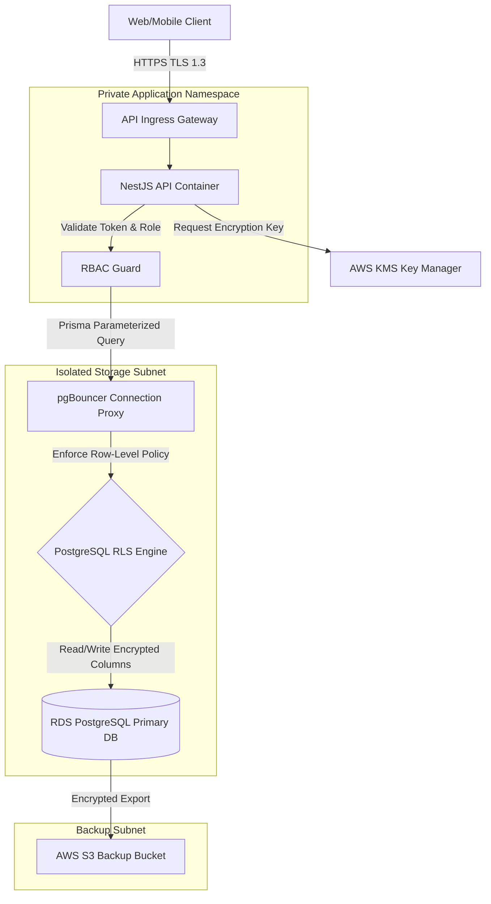
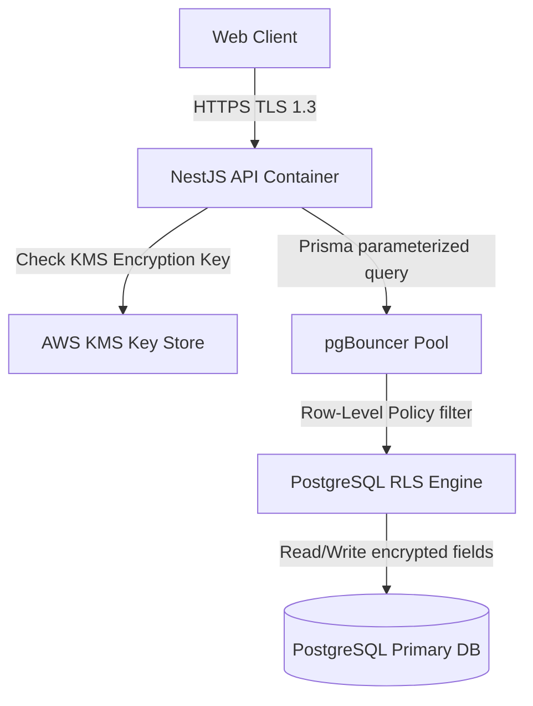
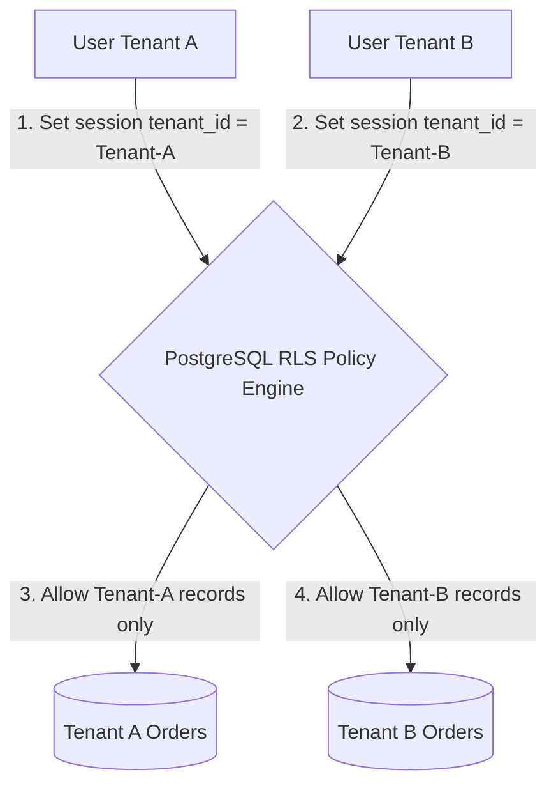
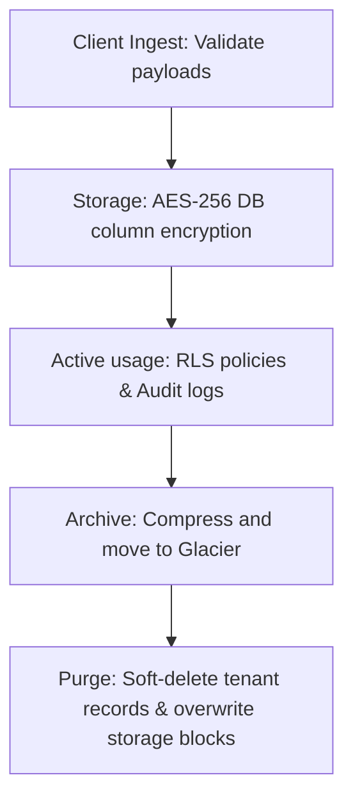

# DATA SECURITY, ENCRYPTION & PRIVACY ARCHITECTURE

**Project Name:** Enterprise SaaS Business Management Platform  
**Document Version:** 1.0.0 — Baseline Standard  
**Date:** July 13, 2026  
**Authors:** Chief Information Security Officer (CISO), Data Security Architect & Privacy Engineer  
**Classification:** Enterprise Internal — Unrestricted  
**Status:** 🏛️ APPROVED DATA SECURITY STANDARD  

---

## SECTION 1 — DATA SECURITY PRINCIPLES

### 1.1 Data Security Goals
To support a multi-tenant business ecosystem, our data platform must enforce security controls to protect records:
*   **Confidentiality:** Enforcing access controls to prevent cross-tenant data leaks and unauthorized database access.
*   **Integrity:** Protecting merchant sales ledgers, checkout prices, and audit logs from unauthorized modifications.
*   **Availability:** Providing database backups and read replica failover pools to guarantee access to tenant data.

### 1.2 Core Data Security Principles
*   **Minimum Data Access:** Restrict database connections to standard user roles based on least-privilege principles.
*   **Encryption Everywhere:** Enforce encryption on all data assets, both in transit (TLS 1.3) and at rest (AES-256).
*   **Data Ownership:** Define tenants as the sole owners of their business records, providing export tools for data portability.
*   **Privacy by Design:** Design application databases to mask personally identifiable information (PII) by default.
*   **Secure Data Lifecycle:** Enforce security controls on data from ingestion through storage, usage, archiving, to destruction.

---

## SECTION 2 — DATA CLASSIFICATION STRATEGY

We categorize system data assets into four classification levels to apply appropriate security controls:

### 2.1 Data Classification Matrix

| Data Class Level | Target Data Type | Sensitivity Impact | Applied Security Control |
| :--- | :--- | :--- | :--- |
| **Level 1:** Public | Product listings, store locations, public marketing catalogs. | Low — Public disclosure has no impact on business operations. | Standard database caching, public CDN routing, read-only API access. |
| **Level 2:** Internal | Business tax rules, shift schedules, tenant inventory settings. | Moderate — Unauthorized changes affect internal store operations. | Identity token authentication, role validation checks, tracking logs. |
| **Level 3:** Confidential | Customer email lists, employee phone numbers, transaction histories. | High — Disclosures violate privacy regulations. | AES-256 database column encryption, query access logging, data masking. |
| **Level 4:** Restricted | User password hashes, credit card tokens, client private API keys. | Critical — Disclosures lead to regulatory fines. | Argon2id hashing, external tokenization providers, HashiCorp Vault storage. |

---

## SECTION 3 — DATA PROTECTION ARCHITECTURE

Our data protection architecture isolates database assets behind multiple security layers:



---

## SECTION 4 — ENCRYPTION STRATEGY

We encrypt all platform data to prevent unauthorized access.
*   **Encryption in Transit:** Enforce TLS 1.3 encryption on all connections, using HSTS headers to redirect HTTP requests.
*   **Encryption at Rest:** Encrypt databases and S3 storage buckets using AES-256 keys managed by cloud KMS systems.
*   **Column-Level Encryption:** Encrypt sensitive database columns (like customer addresses or tax details) using envelope encryption keys.

---

## SECTION 5 — KEY MANAGEMENT ARCHITECTURE

We manage encryption keys using dedicated Key Management Services (KMS):
*   **Key Rotation:** Rotate Master Encryption Keys (MEK) automatically every 90 days.
*   **Access Control:** Restrict key access using IAM roles to ensure only authorized application containers can decrypt columns.

---

## SECTION 6 — DATABASE SECURITY

We configure PostgreSQL instances to enforce access controls and monitor queries:
*   **Database Isolation:** Host databases in private subnets, blocking direct inbound connections from the internet.
*   **Connection Encryption:** Enforce TLS 1.3 encryption on all database connection pools.
*   **Parameterized Queries:** Query databases using parameterized Prisma ORM calls to prevent SQL injection vulnerabilities.

---

## SECTION 7 — MULTI-TENANT DATA ISOLATION

We compared database isolation models to balance security needs and hosting costs:

### 7.1 Multi-Tenant Data Isolation Tradeoffs

| Isolation Model | Security Level | Cost Footprint | Migration Overhead |
| :--- | :--- | :--- | :--- |
| **Shared Database + Tenant ID** | Logical Isolation (Low to Moderate) | **Lowest** (Shared resource pools) | **Low** (Single database migrate runs) |
| **Schema Isolation** | Logical Isolation (Moderate) | **Moderate** (Shared compute instances) | **High** (Migrations run across all schemas) |
| **Database Isolation** | Physical Isolation (Highest) | **Highest** (Separate database nodes) | **Highest** (Coordinate updates across instances) |

---

## SECTION 8 — ROW-LEVEL SECURITY (RLS)

We use PostgreSQL Row-Level Security (RLS) policies to enforce tenant data isolation at the database layer.

```
Incoming Query (tenant_id) ──► RLS Policy Check ──► Query Allowed (Same Tenant) ──► Fetch Records
                                                   └── Query Blocked (Cross Tenant) ──► Return Empty Set
```

### 8.1 PostgreSQL RLS Configuration Example
```sql
-- Enable Row-Level Security on Orders table
ALTER TABLE orders ENABLE ROW LEVEL SECURITY;

-- Create tenant isolation policy
CREATE POLICY tenant_isolation_policy ON orders
    FOR ALL
    USING (tenant_id = current_setting('app.current_tenant_id', true));
```

---

## SECTION 9 — DATA ACCESS CONTROL

We verify user permissions and tenant scopes before executing database queries:
*   **Role Validation:** Verify user roles against requested resources using RBAC rules.
*   **Tenant Scope Validation:** Check user tenant memberships to ensure queries are scoped to the correct tenant context.

---

## SECTION 10 — PRIVACY PROTECTION

We integrate privacy controls to protect personal data and maintain compliance with privacy regulations:
*   **Data Minimization:** Store only the customer and employee data fields required for business operations.
*   **Data Masking:** Mask sensitive database fields (like customer phone numbers or email addresses) in default API responses.
*   **Anonymization:** Anonymize customer identifiers in historical sales reports to protect user privacy.

---

## SECTION 11 — SENSITIVE DATA HANDLING

We enforce specific handling rules for restricted data classes:
*   **User Passwords:** Hash password strings using memory-hard Argon2id algorithms.
*   **Payment Data:** Avoid storing credit card numbers on platform databases. Route card details directly to PCI-compliant payment gateways (like Stripe).
*   **System Secrets:** Store API keys and database credentials in Secrets Managers (AWS Secrets Manager/Vault).

---

## SECTION 12 — DATA RETENTION POLICY

We configure data retention schedules to manage database storage costs and meet compliance requirements:
*   **Active Data:** Retain active business transactions and customer profiles on primary database instances.
*   **Archived Data:** Move invoice records older than 1 year to low-cost archive storage classes.
*   **Deleted Data:** Soft-delete tenant records upon request, purging data permanently after a 30-day recovery window.

---

## SECTION 13 — BACKUP SECURITY

We secure backup snapshots to prevent data exposure:
*   **Backup Encryption:** Encrypt database snapshots and transaction logs using separate KMS keys.
*   **Backup Isolation:** Replicate backup snapshots to isolated cloud accounts to protect data from primary account compromises.
*   **Restore Drills:** Perform monthly restore verification drills on staging instances to check backup integrity.

---

## SECTION 14 — DATA LIFECYCLE MANAGEMENT

We enforce security controls throughout the data lifecycle:
*   **Ingestion:** Sanitize and validate incoming API payloads.
*   **Storage:** Encrypt database columns and S3 buckets.
*   **Archiving:** Compress and move old records to low-cost Glacier storage.
*   **Destruction:** Overwrite storage blocks when deleting records to prevent data recovery.

---

## SECTION 15 — DATA LOSS PREVENTION (DLP)

We deploy Data Loss Prevention (DLP) rules to monitor and block unauthorized data transfers:
*   **Export Restrictions:** Limit CSV/Excel exports of customer lists to authorized administrators.
*   **API Monitoring:** Flag anomalous API responses (e.g., requests returning over 500 customer records) for review.

---

## SECTION 16 — DATA AUDITING

We log database transactions to maintain compliance trails:
*   **Tracked Events:** Log database schema migrations, administrative logins, and data exports.
*   **Audit Fields:** Record the execution timestamp, user UUID, target tenant ID, and source IP address for all monitored actions.

---

## SECTION 17 — DATA COMPLIANCE FOUNDATION

Our data security controls are designed to align with industry compliance frameworks:
*   **GDPR:** Enforce the Right to be Forgotten by soft-deleting customer records and purging data after 30 days.
*   **PCI DSS:** Route payment card details directly to external PCI-compliant processors, keeping databases out of PCI audit scopes.
*   **SOC 2:** Audit security logging and access controls to maintain compliance trails.

---

## SECTION 18 — DATA SECURITY TOOL STACK REFERENCE

Our standardized data security tools are detailed in the table below:

| Category | Selected Tool | Purpose |
| :--- | :--- | :--- |
| **Secrets Engine** | **HashiCorp Vault** | Secures API keys and database credentials. |
| **Key Management** | **AWS KMS** | Manages encryption keys and automates rotations. |
| **Database RLS** | **PostgreSQL (16)** | Relational database engine supporting Row-Level Security policies. |
| **ORM Tool** | **Prisma ORM** | Manages database mapping and schema migrations. |
| **Security Auditing**| **Wazuh Agent** | Monitors database log files for unauthorized access attempts. |
| **SIEM Platform** | **OpenSearch** | Aggregates and indexes data access audit logs. |

---

## SECTION 19 — DATA SECURITY MATURITY MODEL

Our data security program scales along a defined maturity curve:
*   **Level 1 (Basic Protection):** Enforce basic requirements like database passwords and SSL connections.
*   **Level 2 (Encrypted Data):** Encrypt S3 buckets and database files at rest.
*   **Level 3 (Controlled Access):** Enforce database Row-Level Security (RLS) policies and set user role scopes.
*   **Level 4 (Automated Security):** Automate key rotations and monitor database access metrics.
*   **Level 5 (Enterprise Compliance):** Align data security controls with PCI DSS, GDPR, and SOC 2 requirements.

---

## SECTION 20 — FINAL DATA SECURITY MERMAID DIAGRAMS

### 20.1 Data Protection Architecture


### 20.2 Encryption Flow
```
[ Incoming API Request ] ──► [ Decrypt with TLS 1.3 ] ──► [ Query Database ] ──► [ Encrypt with KMS Key ] ──► [ Save S3 / RDS ]
```

### 20.3 Multi-Tenant Data Isolation


### 20.4 Key Management Lifecycle
```
[ Generate Key: KMS ] ──► [ Store Key: Vault ] ──► [ Rotate: Every 90 Days ] ──► [ Revoke / Destroy ]
```

### 20.5 Data Lifecycle Security Flow


---

*End of Data Security, Encryption & Privacy Architecture*  
*Document maintained by: Chief Information Security Officer (CISO) | Status: Approved Data Security Standard*
