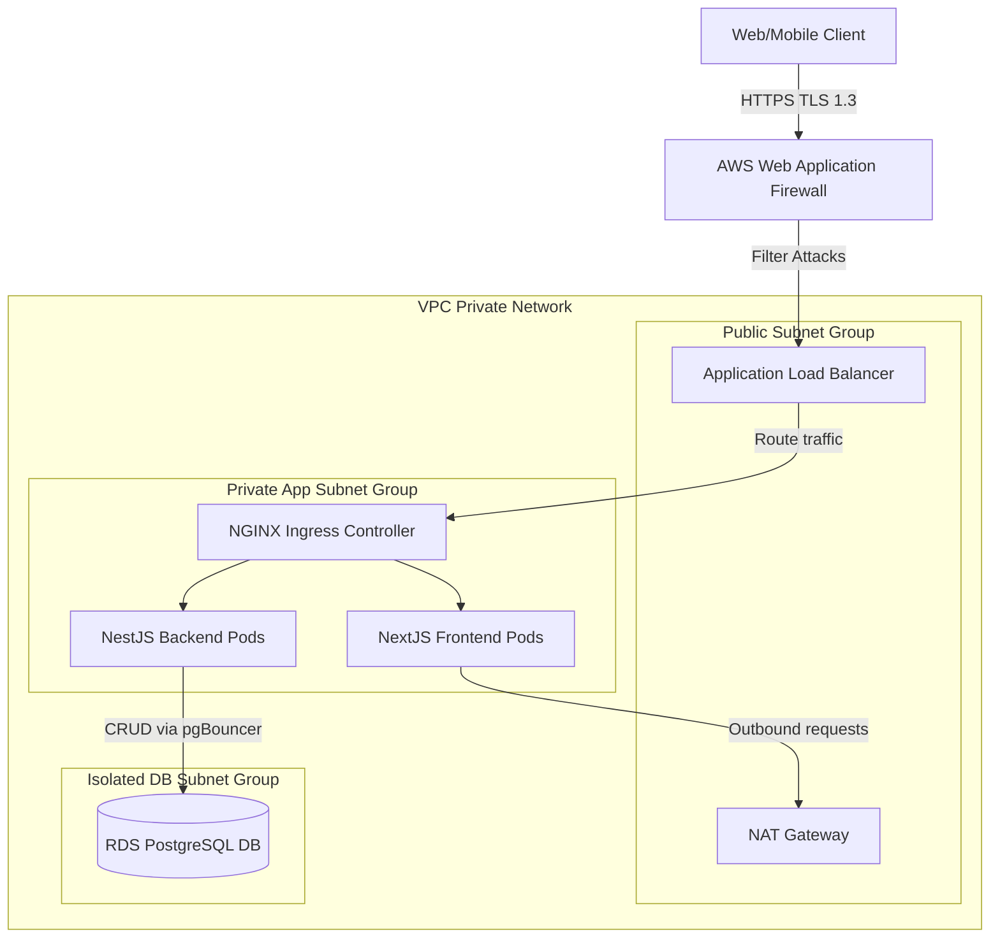
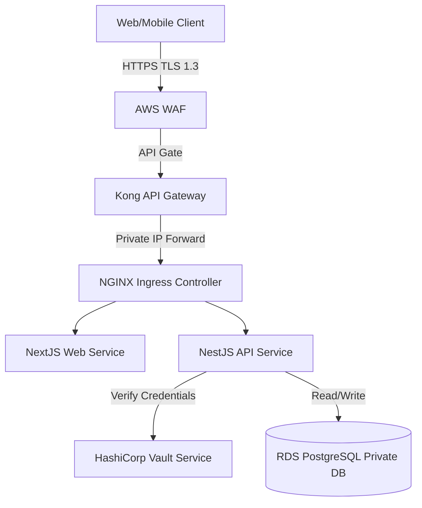
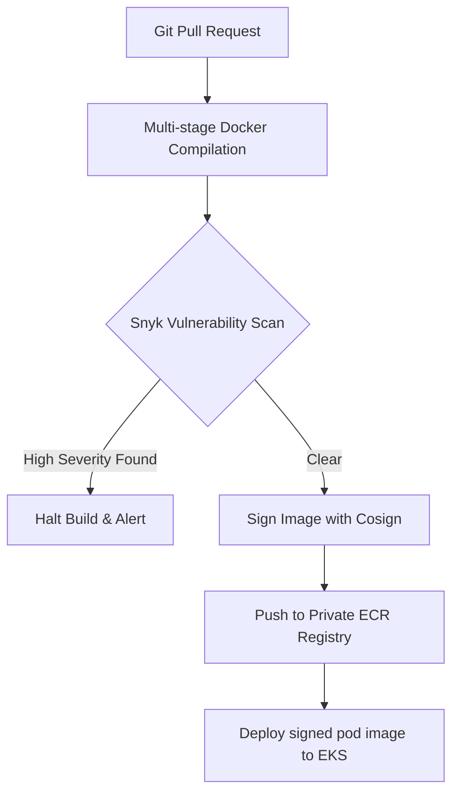
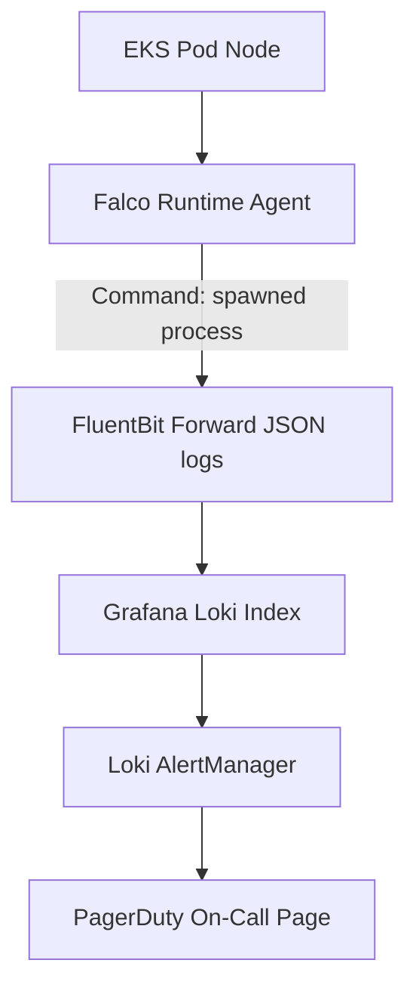

# INFRASTRUCTURE SECURITY & CLOUD SECURITY ARCHITECTURE

**Project Name:** Enterprise SaaS Business Management Platform  
**Document Version:** 1.0.0 — Baseline Standard  
**Date:** July 13, 2026  
**Authors:** Chief Cloud Security Architect, Infrastructure Security Specialist & DevSecOps Lead  
**Classification:** Enterprise Internal — Unrestricted  
**Status:** 🏛️ APPROVED INFRASTRUCTURE SECURITY STANDARD  

---

## SECTION 1 — CLOUD SECURITY PRINCIPLES

### 1.1 Shared Responsibility Model
Operating a cloud-native SaaS environment divides security responsibilities between the cloud provider and the SaaS platform operators:
*   **Security OF the Cloud (Provider):** Replicating physical server instances, managing hypervisor virtualization, and securing facility locations.
*   **Security IN the Cloud (Customer):** Securing container runtimes, configuring network firewalls, and managing database encryption keys.

```
┌────────────────────────────────────────────────────────┐
│ Customer: Application Code, IAM, OS, Container Runtimes │
├────────────────────────────────────────────────────────┤
│ Cloud Provider: Hypervisor, Host Compute, Physical DC   │
└────────────────────────────────────────────────────────┘
```

### 1.2 Core Infrastructure Security Principles
*   **Zero Trust Architecture:** Enforce verification controls on all server actions, network requests, and internal connections.
*   **Least Privilege access:** Limit IAM roles, container access rights, and network routes to their minimum required scopes.
*   **Defense in Depth:** Deploy multiple security layers (Edge WAF, private subnets, Kubernetes network policies, and OS firewalls) to protect system compute nodes.
*   **Continuous Monitoring:** Analyze cluster activities and host system calls continuously using runtime detection tools.

---

## SECTION 2 — CLOUD ACCOUNT SECURITY

We isolate resources and limit the impact of security incidents by partitioning cloud assets across separate accounts.

```
AWS Organizations (Root Organization Console)
  ├── Security Account (Centralized Logging & SIEM)
  ├── Staging Account (Staging VPC & EKS Compute)
  └── Production Account (Production VPC & Managed Databases)
```

### 2.1 Account Security Policies
*   **Root Account Hardening:** Lock the organization's root credentials in physical vaults, using them only for initial configuration steps.
*   **Multi-Factor Authentication (MFA):** Enforce hardware token MFA validations for all user and administrator logins.
*   **Activity Monitoring:** Log and audit administrative actions using central cloud logging services.

---

## SECTION 3 — CLOUD IAM SECURITY

We manage cloud resource access using IAM users and temporary roles based on the principle of least privilege.
*   **No Shared User Credentials:** Require separate IAM user accounts for all engineering team members.
*   **Temporary Session Access:** Configure developers to access resources using temporary session tokens generated via IAM role assumptions, preventing permanent key compromises.
*   **IAM Role Mappings:** Bind Kubernetes service accounts directly to IAM roles using OIDC providers, granting pods only the AWS API permissions required for runtime operations.

---

## SECTION 4 — NETWORK SECURITY ARCHITECTURE

Our network architecture routes traffic through multiple security boundaries, isolating databases and compute nodes from public networks.



---

## SECTION 5 — KUBERNETES SECURITY HARDENING

We enforce security controls to protect our Kubernetes cluster environments:
*   **API Server Protection:** Lock EKS master node endpoints within private subnets, restricting administrative connections to corporate VPN bastion IPs.
*   **Namespace Isolation:** Run application workloads in dedicated namespaces (`production-web`, `production-api`), using RBAC configurations to isolate resources.
*   **Network Policies:** Enforce network policies to restrict pod communication, blocking database connections originating from frontend namespaces.
*   **Pod Security Standards:** Prevent containers from running with root privileges or accessing host host namespaces.

---

## SECTION 6 — CONTAINER SECURITY PIPELINE

We validate Docker images for vulnerabilities before deploying them to production namespaces.

```mermaid
graph TD
    Code[Git Commit] --> Build[Multi-stage Docker Build]
    Build --> Scan{Trivy Dependency Check}
    Scan -->|Vulnerabilities Found| Fail[Halt Build & Alert]
    Scan -->|Clear| Sign[Sign Container Image using Cosign]
    Sign --> Push[Push Container Image to AWS ECR]
    Push --> Deploy[Deploy Pod to Kubernetes Cluster]
```



### 6.1 Container Security Rules
*   **Alpine Base Images:** Use minimal base images (`node:20-alpine`) to minimize host sizes and attack surfaces.
*   **Rootless Execution:** Enforce non-root execution permissions across all container configurations.
*   **Read-Only Filesystem:** Configure container filesystems as read-only to prevent malicious scripts from modifying directories.

---

## SECTION 7 — SERVER OS HARDENING

For non-managed servers, we enforce OS hardening standards based on the Center for Internet Security (CIS) benchmarks:
*   **SSH Security:** Disable root logins and password authentication on servers, allowing connections only via SSH keys.
*   **Unused Services:** Disable legacy services and open ports to minimize attack surfaces.
*   **Automated Patching:** Configure automated patch schedules to install security updates on compute hosts daily.

---

## SECTION 8 — SECRETS MANAGEMENT

*   **Zero Credentials in Code:** Ban storing database passwords, API tokens, and JWT credentials in source code repositories.
*   **Secrets Injection:** Store secrets in AWS Secrets Manager or HashiCorp Vault, injecting them into container filesystems at runtime.
*   **Kubernetes Secrets Encryption:** Encrypt secrets stored in Kubernetes etcd clusters using AWS KMS master keys.

---

## SECTION 9 — CLOUD STORAGE SECURITY

*   **Private S3 Buckets:** Block all public access routes to S3 buckets, routing files through CDN distributions.
*   **Object Encryption:** Encrypt all stored files using AES-256 keys managed by cloud KMS instances.
*   **Audit Logging:** Log all bucket read, write, and deletion operations to support compliance audits.

---

## SECTION 10 — DATABASE INFRASTRUCTURE SECURITY

*   **Private Network Access:** Host PostgreSQL instances in private subnets, allowing connections only from authorized application security groups.
*   **TLS Connections:** Enforce TLS 1.3 encryption on all connections, rejecting unencrypted traffic.
*   **Query Logs:** Log database events to CloudWatch to identify access anomalies and query bottlenecks.

---

## SECTION 11 — RUNTIME SECURITY MONITORING

We monitor running containers using runtime detection tools to identify security threats.
*   **Anomaly Auditing:** Collect system calls on compute nodes using Wazuh agents to detect unauthorized file access and command executions.
*   **Falco Threat Rules:** Define Falco rules to alert on-call teams if containers attempt to spawn privilege escalation scripts.

---

## SECTION 12 — INFRASTRUCTURE MONITORING

*   **Resource Metrics:** Monitor compute node CPU loads, memory footprints, and disk usage to identify resource exhaustion attempts.
*   **Security Logs:** Audit configuration and security changes across cloud accounts using CloudTrail logs.
*   **Tooling:** AWS Security Hub, Prometheus, Grafana.

---

## SECTION 13 — CLOUD SECURITY AUTOMATION

We integrate automated policy checks into our Infrastructure as Code (IaC) deployment pipelines.
*   **Checkov Audits:** Scan Terraform manifests in pipelines using **Checkov** to identify security misconfigurations before deployment.
*   **OPA Gatekeeper:** Enforce cluster policies (like blocking containers from running with root privileges) using Open Policy Agent (OPA) validation steps.

---

## SECTION 14 — VULNERABILITY MANAGEMENT

We follow a structured vulnerability lifecycle to manage security risks:
*   **Identify:** Scan servers, container images, and software packages daily for vulnerabilities.
*   **Analyze:** Prioritize patches based on Common Vulnerability Scoring System (CVSS) severity scores.
*   **Fix:** Apply patches or updates to address identified vulnerabilities.
*   **Verify:** Re-run security scans to confirm the patch resolves the vulnerability.

---

## SECTION 15 — CLOUD SECURITY POSTURE MANAGEMENT (CSPM)

We deploy Cloud Security Posture Management (CSPM) tools to monitor our cloud environments for configuration drift.
*   **Monitored Configurations:** Check for issues like open S3 buckets, public database ports, and weak IAM role policies.
*   **Tooling:** AWS Security Hub.

---

## SECTION 16 — DISASTER RECOVERY SECURITY

*   **Backup Encryption:** Encrypt database snapshots and S3 backup buckets using separate KMS keys.
*   **Recovery IAM Roles:** Define separate, restricted IAM roles for disaster recovery environments to prevent credential reuse.
*   **IaC Re-provisioning:** Automate VPC and network infrastructure setups in secondary regions using Terraform templates.

---

## SECTION 17 — SECURITY OPERATIONS WORKFLOW

We follow a structured workflow to resolve security incidents:

```
Detection Alert ──► Investigation ──► Isolation / Containment ──► Remediation ──► Post-Incident Review
```

---

## SECTION 18 — INFRASTRUCTURE SECURITY TOOL STACK

Our standardized infrastructure security tools are detailed in the table below:

| Category | Selected Tool | Purpose |
| :--- | :--- | :--- |
| **Secrets Engine** | **HashiCorp Vault** | Secures API keys and database credentials. |
| **Container Scan** | **Trivy / Snyk** | Scans container images for vulnerabilities. |
| **Runtime Detection**| **Falco / Wazuh** | Monitors container runtimes for security anomalies. |
| **IaC Scan** | **Checkov** | Scans Terraform manifests for security misconfigurations. |
| **Cluster Policy** | **OPA Gatekeeper** | Enforces security policies on Kubernetes cluster nodes. |
| **Security Hub** | **AWS Security Hub** | Centralized dashboard for cloud security posture tracking. |

---

## SECTION 19 — CLOUD SECURITY MATURITY MODEL

Our infrastructure security program scales along a defined maturity curve:
*   **Level 1 (Basic Cloud Security):** Enforce basic requirements like SSL/TLS and static database passwords.
*   **Level 2 (Controlled Infrastructure):** Encrypt S3 buckets and isolate databases in private subnets.
*   **Level 3 (Automated Security):** Automate container vulnerability scans and IaC configuration checks in pipelines.
*   **Level 4 (Continuous Monitoring):** Monitor container runtimes and audit cloud account activities.
*   **Level 5 (Zero Trust):** Enforce Zero Trust verification, rotate keys automatically, and run automated threat modeling tools.

---

## SECTION 20 — FINAL INFRASTRUCTURE SECURITY ARCHITECTURE

### 20.1 Cloud Security Architecture


### 20.2 Kubernetes Security Architecture
```
                        Kubernetes API Server (Private Endpoint Only)
                                │
               ┌────────────────┴────────────────┐
               ▼                                 ▼
   [ Namespace: production-web ]      [ Namespace: production-api ]
   [ NetworkPolicy: Block DB ]        [ NetworkPolicy: Allow DB ]
   [ Pod Security: Non-Root ]         [ Pod Security: Non-Root ]
```

### 20.3 Container Security Pipeline


### 20.4 Secrets Management Flow
```
[ AWS Secrets Manager ] ──► [ Decrypt via KMS MEK ] ──► [ Mount to EKS Pod ] ──► [ Injected into Container RAM ]
```

### 20.5 Runtime Security Monitoring Flow


---

*End of Infrastructure Security & Cloud Security Architecture*  
*Document maintained by: Chief Cloud Security Architect | Status: Approved Infrastructure Security Standard*
