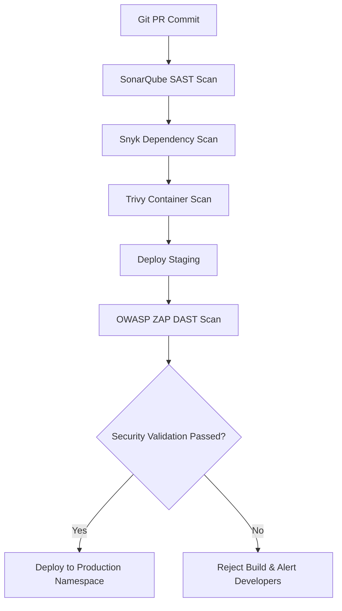
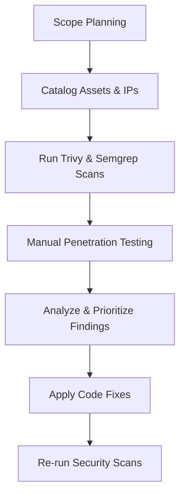
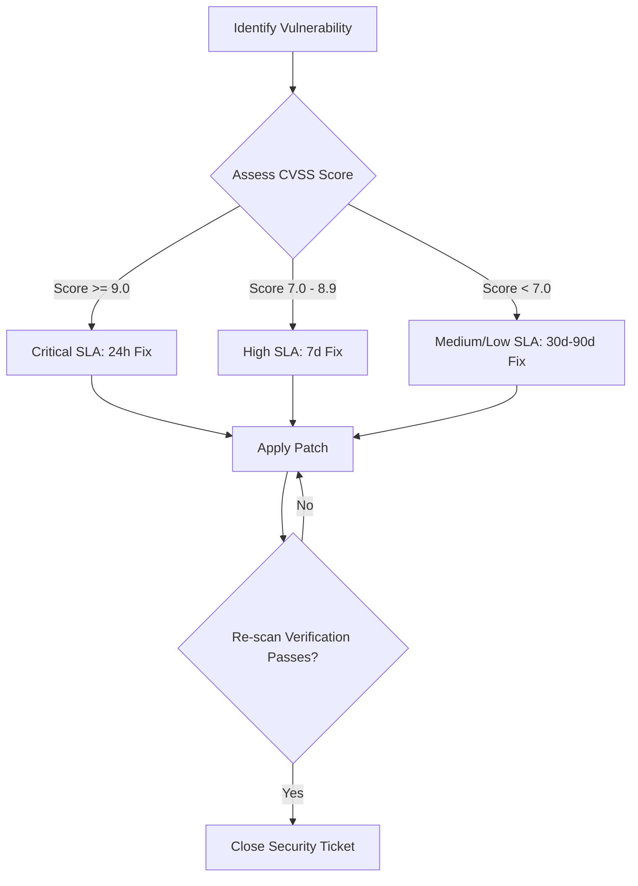
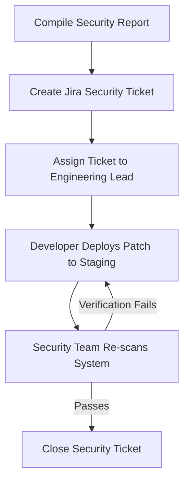

# SECURITY TESTING, VULNERABILITY ASSESSMENT & PENETRATION TESTING STRATEGY

**Project Name:** Enterprise SaaS Business Management Platform  
**Document Version:** 1.0.0 — Baseline Standard  
**Date:** July 13, 2026  
**Authors:** Principal Application Security Engineer, Penetration Tester & DevSecOps Lead  
**Classification:** Enterprise Internal — Unrestricted  
**Status:** 🏛️ APPROVED SECURITY TESTING STANDARD  

---

## SECTION 1 — SECURITY TESTING PRINCIPLES

### 1.1 Core Testing Principles
To protect our multi-tenant SaaS application from security threats, we integrate security testing throughout the development lifecycle:
*   **Find Weaknesses:** Scan code repositories, running systems, and cloud environments to identify vulnerabilities.
*   **Fix Weaknesses:** Route findings directly to engineering backlogs, prioritizing remediations.
*   **Verify Protection:** Re-test security controls to confirm patches resolve identified issues.

### 1.2 Architectural Principles
*   **Continuous Testing:** Automate security scans in build pipelines to test code changes before deployment.
*   **Risk-Based Testing:** Focus testing efforts on high-risk endpoints, such as checkout systems and authentication APIs.
*   **Security Automation:** Automate static code analysis (SAST) and container vulnerability scanning to enable continuous testing.
*   **Defense Validation:** Test the effectiveness of network firewalls, rate limiters, and RLS database policies.

---

## SECTION 2 — SECURITY TESTING LIFECYCLE

We follow a structured lifecycle to coordinate security testing, vulnerability analyses, and validations.

```
Planning ──► Discovery ──► Scanning ──► Testing ──► Analysis ──► Remediation ──► Verification
```

### 2.1 Testing Phases
1.  **Planning:** Define the testing scope, select audit tools, and schedule penetration tests.
2.  **Discovery:** Catalog network hosts, cloud resources, API endpoints, and container images.
3.  **Scanning:** Run automated static analysis (SAST) and vulnerability scans.
4.  **Testing:** Perform manual penetration testing to identify complex vulnerabilities.
5.  **Analysis:** De-duplicate automated findings and prioritize remediations.
6.  **Remediation:** Route tickets to developer backlogs and apply patches.
7.  **Verification:** Re-scan the updated systems to confirm vulnerabilities are resolved.

---

## SECTION 3 — VULNERABILITY MANAGEMENT PROGRAM

We categorize identified vulnerabilities using the Common Vulnerability Scoring System (CVSS) to prioritize remediations.

### 3.1 Vulnerability Remediation SLAs

| Severity Level | CVSS Score Range | Maximum Patch SLA Target | Operational Action Required |
| :--- | :--- | :--- | :--- |
| **Critical** | `9.0 - 10.0` | **$\le 24\text{ hours}$** | Immediately notify security teams, compile a patch, and deploy it to production. |
| **High** | `7.0 - 8.9` | **$\le 7\text{ days}$** | Schedule the fix in the current sprint backlog. |
| **Medium** | `4.0 - 6.9` | **$\le 30\text{ days}$** | Target resolution within the next scheduled release cycle. |
| **Low** | `0.1 - 3.9` | **$\le 90\text{ days}$** | Monitor the issue and apply patches during standard system updates. |

---

## SECTION 4 — STATIC APPLICATION SECURITY TESTING (SAST)

We use Static Application Security Testing (SAST) to analyze source code repositories for security flaws without executing the application.
*   **SonarQube:** Scans Next.js and NestJS codebases for quality issues and code smells.
*   **Semgrep:** Audits repositories for hardcoded credentials and unsafe coding patterns.
*   **CodeQL:** Maps application data flows to identify complex injection and logic bypass vulnerabilities.

---

## SECTION 5 — DYNAMIC APPLICATION SECURITY TESTING (DAST)

We use Dynamic Application Security Testing (DAST) to analyze running applications and identify vulnerabilities.
*   **OWASP ZAP:** Performs automated web scans on staging environments to find XSS vulnerabilities and secure header misconfigurations.
*   **Burp Suite:** Used by security engineers to intercept HTTP traffic and manually test API endpoints.

---

## SECTION 6 — INTERACTIVE APPLICATION SECURITY TESTING (IAST)

*   **Runtime Instrumentation:** Deploy interactive agents inside staging application runtimes to monitor execution paths.
*   **Contextual Audits:** Combine SAST (source code context) and DAST (runtime execution states) to identify vulnerabilities while reducing false positive rates.

---

## SECTION 7 — API SECURITY TESTING

Our backend APIs are scanned regularly using automated and manual tools:
*   **Broken Authentication:** Validate that endpoints reject requests with expired, altered, or missing JWT signatures.
*   **Privilege Escalation:** Verify that cashiers and store staff cannot access administrator endpoints.
*   **API Rate Limiting:** Test endpoints under heavy request loads to confirm rate limiters throttle traffic.
*   **Tooling:** Postman, OWASP ZAP fuzzer tools, and Burp Suite.

---

## SECTION 8 — MOBILE SECURITY TESTING

We validate our React Native mobile POS applications before publishing releases to app stores:
*   **Secure Storage Audits:** Verify that session tokens are stored using Keychain and Android Keystore APIs.
*   **TLS Certificate Validation:** Confirm the application pins SSL certificate hashes and rejects connection attempts from proxies.
*   **Reverse Engineering:** Run static binary analyses on compiled APK and IPA packages using **MobSF** to identify hardcoded secrets.

---

## SECTION 9 — INFRASTRUCTURE SECURITY TESTING

*   **Vulnerability Scanning:** Scan worker node operating systems (Ubuntu) and Kubernetes hosts using OpenSCAP.
*   **Network Audits:** Scan subnet IP ranges and open ports using **Nmap** to identify unauthorized open connections.

---

## SECTION 10 — CLOUD SECURITY TESTING

*   **IAM Auditing:** Scan cloud account configurations using **Prowler** to identify over-privileged roles.
*   **IaC Manifest Audits:** Scan Terraform scripts in CI/CD pipelines using **Checkov** to block infrastructure misconfigurations before deployment.

---

## SECTION 11 — CONTAINER SECURITY TESTING

We scan Docker container configurations in build pipelines:
*   **Trivy Scans:** Scan compiled images for outdated dependencies and vulnerabilities.
*   **Docker Scout:** Audits image configurations to verify they run under non-root users.

---

## SECTION 12 — PENETRATION TESTING STRATEGY

We schedule annual manual penetration tests with certified external firms to identify complex vulnerabilities.
*   **Reconnaissance:** Map public DNS records and edge gateways.
*   **Scanning:** Identify open ports and query API schema endpoints.
*   **Exploitation:** Attempt to exploit vulnerabilities (such as bypassing authentication or injecting SQL payloads).
*   **Privilege Escalation:** Test if compromised cashier accounts can escalate privileges to administrator roles.
*   **Scope:** Next.js web portals, NestJS APIs, Keycloak identity servers, and AWS EKS host systems.

---

## SECTION 13 — RED TEAM EXERCISE

*   **Objective:** Simulate real-world cyberattacks without notifying engineering teams to test incident response readiness.
*   **Audit Scope:** Test team alertness (via email phishing), response processes, and network detection capabilities.

---

## SECTION 14 — SECURITY TEST ENVIRONMENT

*   **Safe Isolation:** Execute vulnerability scans and penetration tests on dedicated staging environments.
*   **Mock Connections:** Configure staging environments with mock payment gateways and obfuscated user databases to prevent exposing real customer data.

---

## SECTION 15 — DevSecOps CI/CD SECURITY GATES

We enforce automated security gates in our CI/CD pipelines:



---

## SECTION 16 — SECURITY REPORTING SCHEMA

Security reports use a standardized format to document findings and coordinate remediations:
*   **Finding Title:** E.g., "SQL Injection Vulnerability in product search endpoint".
*   **Risk Severity:** CVSS Score (e.g., 9.8 Critical).
*   **System Impact:** Impact on data confidentiality and availability.
*   **Evidence:** API request payloads, responses, and stack traces.
*   **Remediation Recommendation:** Code fix instructions.
*   **Verification Status:** Confirmed fixed or pending review.

---

## SECTION 17 — REMEDIATION WORKFLOW

We follow a structured workflow to resolve identified vulnerabilities:

```
Vulnerability Logged ──► Ticket Assigned ──► Code Patch Applied ──► Re-scan Verification ──► Close Ticket
```

---

## SECTION 18 — SECURITY TESTING TOOL STACK

Our standardized security testing tools are detailed in the table below:

| Category | Selected Tool | Purpose |
| :--- | :--- | :--- |
| **SAST Code Scanner** | **SonarQube / Semgrep** | Scans source code repositories for security flaws. |
| **DAST Tool** | **OWASP ZAP** | Performs automated dynamic web application scans. |
| **Mobile Analyzer** | **MobSF** | Analyzes mobile application binaries for vulnerabilities. |
| **Vulnerability Scan**| **Trivy** | Scans container images for vulnerabilities. |
| **Network Audits** | **Nmap** | Scans host IP ranges for unauthorized open ports. |
| **Cloud Configuration**| **Prowler** | Audits cloud environments for configuration drift. |
| **IaC Scan** | **Checkov** | Scans Terraform manifests for security misconfigurations. |

---

## SECTION 19 — SECURITY MATURITY MODEL

Our security testing program scales along a defined maturity curve:
*   **Level 1 (Manual Testing):** Perform periodic manual penetration tests and basic code reviews.
*   **Level 2 (Automated Scanning):** Integrate automated vulnerability scans and library audits.
*   **Level 3 (Integrated DevSecOps):** Enforce automated security gates in CI/CD pipelines.
*   **Level 4 (Continuous Security):** Monitor container runtimes and perform regular penetration tests.
*   **Level 5 (Enterprise Security):** Enforce Zero Trust verification and run automated threat modeling tools.

---

## SECTION 20 — FINAL SECURITY TESTING MERMAID DIAGRAMS

### 20.1 Security Testing Lifecycle


### 20.2 DevSecOps Security Pipeline
```
[ Developer Commit ] ──► [ GitLeaks Check ] ──► [ Snyk Scans ] ──► [ SonarQube SAST ] ──► [ DAST Scan Staging ]
```

### 20.3 Vulnerability Management Flow


### 20.4 Penetration Testing Process
```
[ Reconnaissance ] ──► [ Port Mapping ] ──► [ Exploit Endpoints ] ──► [ Escalate Roles ] ──► [ Document Evidence ]
```

### 20.5 Security Reporting Workflow


---

*End of Security Testing, Vulnerability Assessment & Penetration Testing Strategy*  
*Document maintained by: Principal Application Security Engineer | Status: Approved Security Testing Standard*
