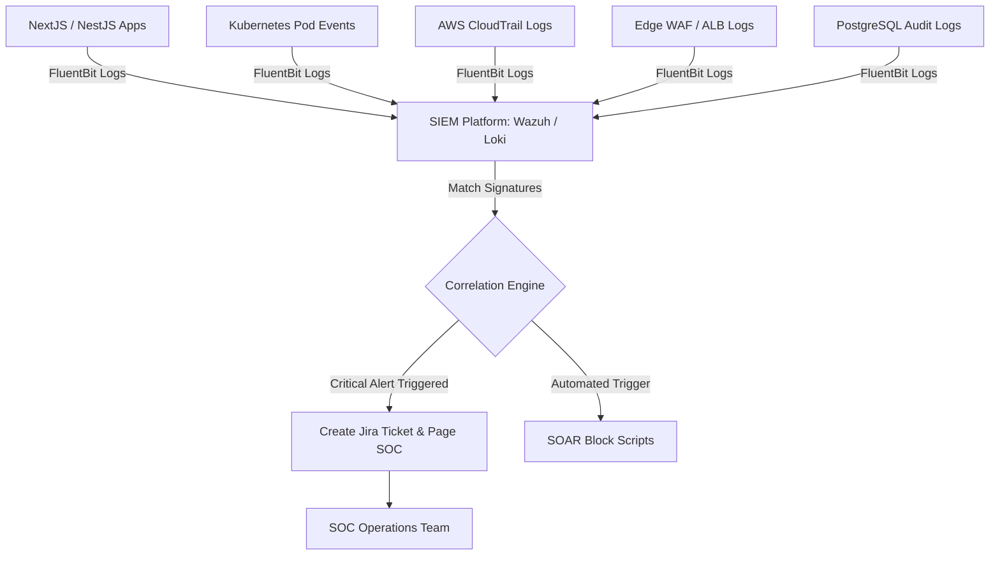
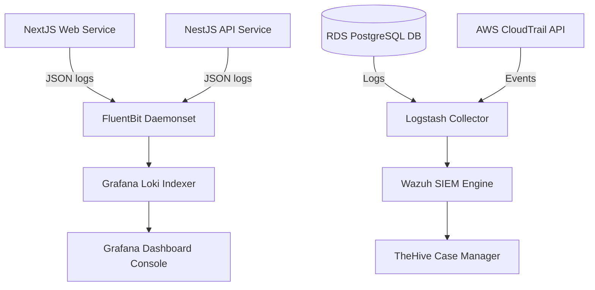
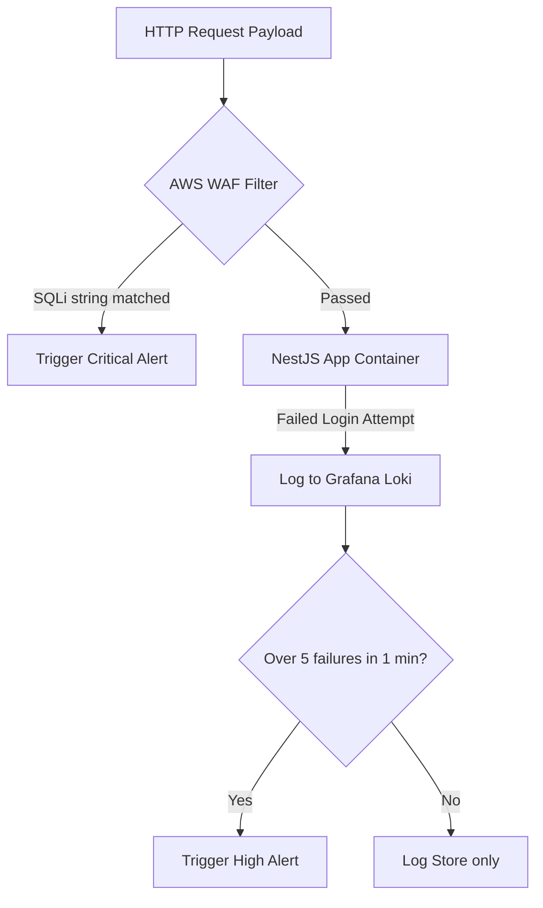
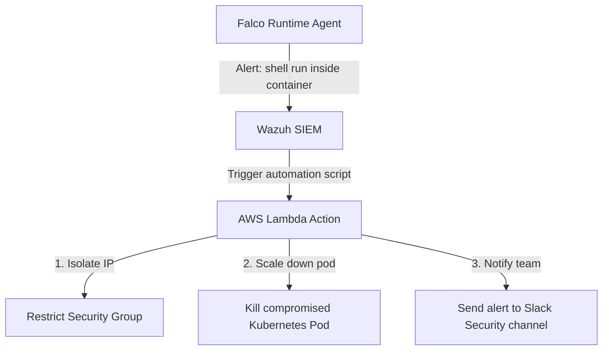

# SECURITY MONITORING, SIEM & INCIDENT RESPONSE ARCHITECTURE

**Project Name:** Enterprise SaaS Business Management Platform  
**Document Version:** 1.0.0 — Baseline Standard  
**Date:** July 13, 2026  
**Authors:** Principal SOC Architect, Incident Response Specialist & SIEM Engineer  
**Classification:** Enterprise Internal — Unrestricted  
**Status:** 🏛️ APPROVED OPERATIONS STANDARD  

---

## SECTION 1 — SECURITY MONITORING PRINCIPLES

### 1.1 Why Security Monitoring Matters
Maintaining continuous monitoring across the SaaS platform enables operations teams to detect security incidents and respond to attacks before data is compromised.

```
Malicious Attack ──► Security Detection ──► Incident Response ──► System Recovery
```

### 1.2 Core Security Monitoring Principles
*   **Continuous Monitoring:** Analyze application logs and system calls continuously.
*   **Real-Time Detection:** Process event logs dynamically to flag suspicious activity immediately.
*   **Automated Response:** Deploy automated workflows to isolate compromised hosts and block malicious IPs.
*   **Evidence Collection:** Store system and access logs in write-once-read-many (WORM) configurations to preserve audit trails.

---

## SECTION 2 — SECURITY OPERATIONS ARCHITECTURE

Our monitoring system aggregates logs from all application and infrastructure layers into a centralized SIEM platform:



---

## SECTION 3 — SIEM ARCHITECTURE

Our Security Information and Event Management (SIEM) architecture uses centralized log collectors and correlation engines to process events:
*   **Collection:** Ingest logs from containers, load balancers, cloud accounts, and databases.
*   **Normalization:** Parse raw log outputs into structured JSON payloads with uniform timestamp formats.
*   **Correlation:** Link events across different layers (e.g., matching a high volume of failed logins on an IP with a subsequent database connection spike).
*   **Detection:** Run detection rules against the normalized event stream to identify threat signatures.
*   **Alerting:** Route critical alerts to on-call paging platforms and security dashboards.
*   **Platform Choice:** Deploy **Wazuh** paired with **Grafana Loki** to manage host intrusion detection and centralized log queries.

---

## SECTION 4 — SECURITY EVENT COLLECTION

We collect security logs across all platform layers:

| Log Layer | Source Component | Key Events Captured |
| :--- | :--- | :--- |
| **Application** | NestJS Gateways / Keycloak | Authentication failures, privilege changes, and raw API errors. |
| **Infrastructure** | EKS Worker Nodes / Kubernetes | Container restarts, shell executions, and API server audits. |
| **Network** | AWS WAF / Kong Ingress | Blocked HTTP requests, rate-limit triggers, and IP addresses. |
| **Database** | RDS PostgreSQL Instances | User connection history, table schema changes, and slow queries. |

---

## SECTION 5 — LOG MANAGEMENT ARCHITECTURE

We use log collectors and indexing engines to process system logs:
*   **Fluent Bit:** Runs as a Kubernetes daemonset to collect logs from container pods and host directories.
*   **Grafana Loki:** Serves as our primary log aggregation and indexing platform.
*   **Loki Storage:** Configured with strict retention policies, storing active logs in hot storage (SSD volumes) for 30 days before archiving them in S3 Glacier.

---

## SECTION 6 — THREAT DETECTION STRATEGY

We define detection rules to flag threats across account, infrastructure, and application layers:
*   **Account Threats:** Flag brute-force login attempts (e.g., over 5 failed logins within 1 minute) and credential abuse (e.g., logins from different geolocations within a short window).
*   **Infrastructure Threats:** Detect host modifications and privilege escalation attempts on container hosts.
*   **Application Threats:** Identify SQL injection attempts, XSS payloads, and suspicious bulk data exports.

---

## SECTION 7 — SECURITY ANALYTICS

*   **Rule-Based Detection:** Apply static signature matching to identify known threat patterns (like SQL injection strings).
*   **Behavioral Auditing:** Establish baseline metrics for standard user access patterns, flagging deviations like unusual access hours or high-volume data exports.

---

## SECTION 8 — ALERT SEVERITY CLASSIFICATION

We categorize alerts into four severity levels to prioritize response times:

*   **Critical (P1 - SLA: $\le 15\text{ minutes}$):** E.g., data breach detections, ransomware indicators, or root-level host compromises.
*   **High (P2 - SLA: $\le 1\text{ hour}$):** E.g., brute-force attacks from blocked IP ranges, or unexpected database administrative actions.
*   **Medium (P3 - SLA: $\le 8\text{ hours}$):** E.g., policy violations or privilege modifications.
*   **Low (P4 - SLA: $\le 24\text{ hours}$):** E.g., minor system errors or unexpected developer logins on staging nodes.

---

## SECTION 9 — INCIDENT RESPONSE FRAMEWORK

We align our security incident response lifecycle with NIST guidelines:

1.  **Preparation:** Maintain playbooks, configure alerts, and conduct tabletop training exercises.
2.  **Identification:** Analyze security alerts and system logs to confirm and scope active incidents.
3.  **Containment:** Isolate compromised compute hosts, revoke compromised tokens, and block malicious IPs to stop the attack.
4.  **Eradication:** Delete malware files, disable backdoors, and verify the integrity of system configurations.
5.  **Recovery:** Restore systems from verified clean backups and return applications to service.
6.  **Lessons Learned:** Hold a post-incident review to identify root causes and update playbooks.

---

## SECTION 10 — INCIDENT RESPONSE TEAM ROLES

*   **Incident Commander:** Leads the response effort, coordinates team tasks, and manages stakeholders.
*   **Security Engineer:** Analyzes host logs, traces attack footprints, and applies isolation rules.
*   **DevOps Engineer:** Coordinates host container restarts, rotates API secrets, and applies network blocking rules.
*   **Backend Engineer:** Reviews application logs to identify API flaws and publishes hotfixes.
*   **Database Engineer:** Audits query logs to identify data exposure and manages database restore tasks.
*   **Communication Manager:** Manages communications with external stakeholders, legal advisors, and affected customers.

---

## SECTION 11 — INCIDENT RESPONSE PLAYBOOKS

### 11.1 Playbook A: User Account Compromise
```
Identify Suspicious Login ──► Suspend User Account ──► Terminate Active JWT Sessions ──► Reset Passwords & MFA
```
1.  **Detection:** Spike in failed logins followed by a successful access from a different geolocation.
2.  **Containment:** Suspend the user account and terminate active sessions in Keycloak.
3.  **Eradication:** Revoke active refresh tokens and clear sessions from the Redis store.
4.  **Recovery:** Require the user to complete password resets and re-register MFA devices upon their next login.

### 11.2 Playbook B: Data Leak Detections
1.  **Detection:** Alert flags a user export exceeding 10,000 customer profiles.
2.  **Containment:** Suspend the exporting user profile and block the source IP address at the edge firewall.
3.  **Investigation:** Analyze database query logs to identify affected tables and estimate data loss.
4.  **Notification:** Notify legal stakeholders and affected customers within regulatory SLAs (e.g., GDPR's 72-hour window).

### 11.3 Playbook C: Malware Indicators
1.  **Detection:** Wazuh agent alerts on a privilege escalation attempt in a container.
2.  **Containment:** Isolate the EKS pod using network policies, redirecting traffic away from the host.
3.  **Eradication:** Terminate the pod, delete the host node from the cluster, and re-provision the host.

---

## SECTION 12 — DIGITAL FORENSICS

*   **Evidence Logs:** Export security logs to write-once-read-many (WORM) S3 storage buckets with object lock policies enabled.
*   **Forensic Timelines:** Construct chronological timelines of attacker actions, correlating events across WAF, Keycloak, database, and container logs.

---

## SECTION 13 — THREAT INTELLIGENCE INTEGRATION

*   **Threat Feeds:** Pull threat feeds dynamically to block traffic from known malicious IP networks.
*   **IOC Detections:** Update Wazuh detection configurations with Indicators of Compromise (IOCs) like file hashes or domain names to identify active attacks.

---

## SECTION 14 — SECURITY AUTOMATION (SOAR)

*   **Automated Blocking:** Integrate our SIEM with edge WAF configurations to block IP addresses that trigger brute-force alerts.
*   **Incident Logging:** Configure SIEM platforms to open tracking tickets in Jira automatically when critical events are flagged.

---

## SECTION 15 — CLOUD SECURITY MONITORING

*   **CloudTrail Logging:** Ingest CloudTrail events into Loki to audit configuration and IAM policy changes.
*   **Security Hub:** Enable AWS Security Hub to monitor cloud environments and alert on configuration drift.

---

## SECTION 16 — KUBERNETES RUNTIME MONITORING

*   **Falco Agents:** Deploy Falco daemons on EKS worker nodes to monitor syscalls and identify unauthorized container changes.
*   **Prometheus Exporters:** Monitor cluster metrics (like unexpected egress bandwidth spikes) to identify potential data exfiltration attempts.

---

## SECTION 17 — SOC SECURITY DASHBOARDS

*   **SOC Command Console:** Displays real-time metrics on critical alerts, active incidents, block rate metrics, and Wazuh host statuses.
*   **Executive Scorecard:** Tracks platform compliance metrics, vulnerability patch SLA metrics, and monthly risk indices.
*   **AppSec Dashboard:** Logs API execution failures, CORS block metrics, and input sanitization alerts.

---

## SECTION 18 — SIEM & OPERATIONAL TOOL STACK

Our standardized SIEM and operational tools are detailed in the table below:

| Category | Selected Tool | Purpose |
| :--- | :--- | :--- |
| **Log Collector** | **Fluent Bit** | Ingests logs from container systems and host directories. |
| **Log Indexer** | **Grafana Loki** | Aggregates and indexes log data. |
| **Intrusion Agent** | **Wazuh Agent** | Performs runtime log analyses and system file checks. |
| **Kubernetes Auditing**| **Falco** | Monitors container runtimes for security anomalies. |
| **Incident Management**| **TheHive** | Collaborative incident response and case tracking platform. |
| **Threat Integrator** | **Cortex** | Integrates threat feeds and automates IOC lookups. |

---

## SECTION 19 — SECURITY OPERATIONS MATURITY MODEL

Our security operations program scales along a defined maturity curve:
*   **Level 1 (Basic Logging):** Store raw logs on compute nodes without central aggregation.
*   **Level 2 (Central Monitoring):** Aggregate system logs into Loki to enable basic text searches.
*   **Level 3 (SIEM Detection):** Use Wazuh to match signatures and run correlation rules against logs.
*   **Level 4 (Automated Response):** Deploy automated WAF and network blocking rules.
*   **Level 5 (Advanced SOC):** Run a dedicated security operations center with threat hunters and automated runbooks.

---

## SECTION 20 — FINAL SIEM & INCIDENT RESPONSE MERMAID DIAGRAMS

### 20.1 SIEM Architecture


### 20.2 Security Event Pipeline
```
[ Log Generated ] ──► [ Parsed to JSON ] ──► [ Ingest to Loki ] ──► [ Correlate Rules ] ──► [ Alert Trigger ]
```

### 20.3 Threat Detection Flow


### 20.4 Incident Response Lifecycle
```
[ Detect Alert ] ──► [ Triage Context ] ──► [ Apply Containment ] ──► [ Purge Attackers ] ──► [ Restore / Review ]
```

### 20.5 Automated Security Response


---

*End of Security Monitoring, SIEM & Incident Response Architecture*  
*Document maintained by: Principal SOC Architect | Status: Approved Operations Standard*
