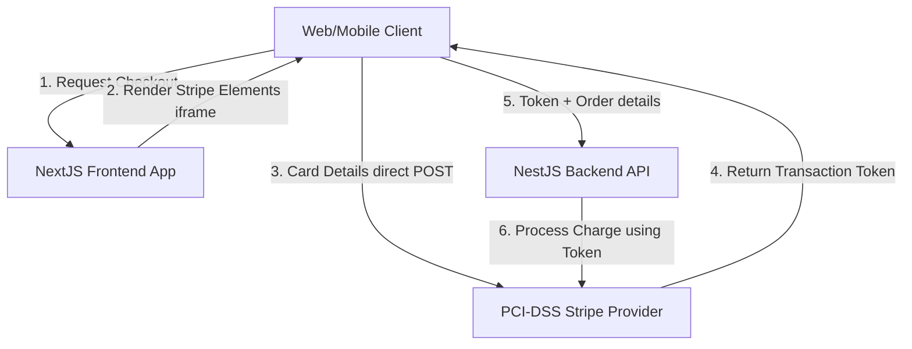
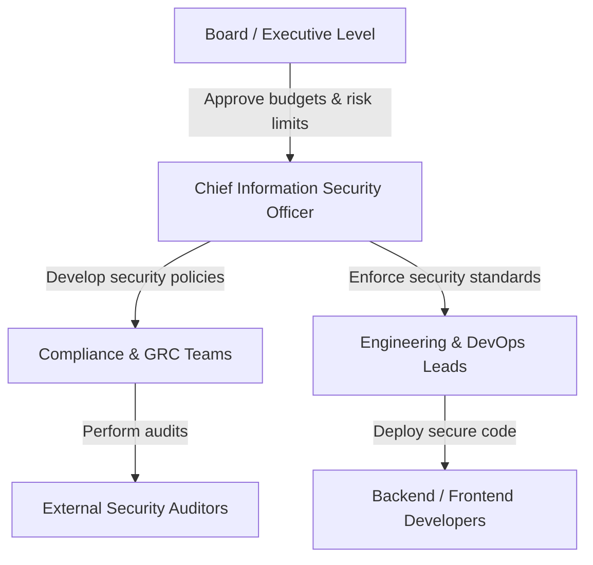
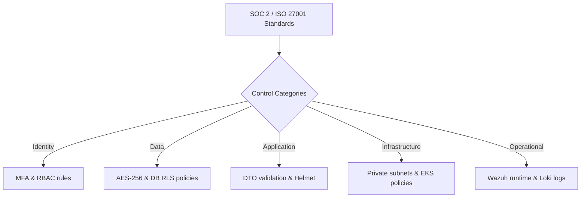
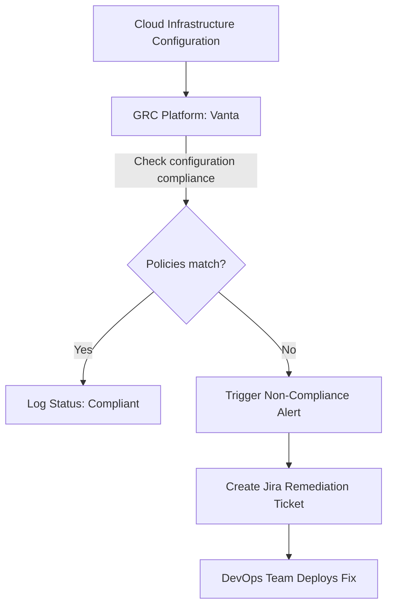

# COMPLIANCE, GOVERNANCE & ENTERPRISE SECURITY STANDARDS

**Project Name:** Enterprise SaaS Business Management Platform  
**Document Version:** 1.0.0 — Baseline Standard  
**Date:** July 13, 2026  
**Authors:** Chief Information Security Officer (CISO), Governance Risk & Compliance (GRC) Architect & Security Lead  
**Classification:** Enterprise Internal — Unrestricted  
**Status:** 🏛️ APPROVED COMPLIANCE STANDARD  

---

## SECTION 1 — SECURITY GOVERNANCE FOUNDATION

### 1.1 People, Process, and Technology
Our security governance program integrates organizational responsibilities, operational processes, and security technologies to manage risk:
*   **People:** Defining clear security roles, accountability structures, and training programs across all business tiers.
*   **Process:** Establishing incident response playbooks, audit schedules, and access review workflows.
*   **Technology:** Deploying identity providers, logging indexers, vulnerability scanners, and configuration checkers.

### 1.2 Security Leadership Roles
*   **Chief Information Security Officer (CISO):** Establishes the platform's security strategy, manages GRC budgets, and presents compliance metrics to executive stakeholders.
*   **Security Team:** Monitors alerts, runs vulnerability scans, and coordinates incident responses.
*   **Engineering Team:** Implements secure code structures, updates dependencies, and remediates code vulnerabilities.
*   **Operations Team:** Hardens server environments, manages network firewalls, and maintains cluster backup snapshots.

---

## SECTION 2 — GOVERNANCE MODEL

We organize security responsibilities across a structured reporting model:

```
Board & Executive Officers (Risk oversight & strategic budgets)
  └── Chief Information Security Officer (GRC strategy & security governance)
        ├── Security Operations (Threat analysis & incident response)
        ├── DevSecOps Engineers (Code scans & pipeline policies)
        └── All Employees (Security awareness & acceptable use)
```

### 2.1 Governance Responsibilities
*   **Board Level:** Sets risk tolerances and approves global security budgets.
*   **Security Leadership:** Implements security policies and compiles audit reports.
*   **Engineering:** Remediates code vulnerabilities and validates API changes.
*   **Operations:** Resolves infrastructure configuration drift and manages backups.
*   **Employees:** Follows acceptable use policies and completes security training.

---

## SECTION 3 — RISK MANAGEMENT FRAMEWORK

We follow a structured risk management lifecycle to identify, analyze, and remediate platform risks:

```
Identify Risk ──► Analyze Risk ──► Evaluate Risk ──► Treat / Mitigate ──► Monitor Risk
```

### 3.1 Risk Assessment Matrix

We score risks by calculating: $\text{Risk Score} = \text{Likelihood} \times \text{Impact}$

| Risk Scenario | Likelihood Score (1-5) | Impact Score (1-5) | Risk Level | Mitigation Strategy |
| :--- | :--- | :--- | :--- | :--- |
| **Cross-Tenant Data Exposure** | 2 (Low) | 5 (Critical) | **High (10)** | Enforce database Row-Level Security (RLS) policies and require code reviews. |
| **SQL Injection Attack** | 3 (Medium) | 4 (High) | **High (12)** | Query databases using parameterized Prisma ORM calls and validate inputs. |
| **Worker Node Server Compromise** | 2 (Low) | 4 (High) | **Medium (8)** | Isolate nodes in private subnets and monitor runtimes using Wazuh. |
| **Phishing Account Takeover** | 4 (High) | 3 (Medium) | **High (12)** | Enforce Multi-Factor Authentication (MFA) on all manager and admin accounts. |

---

## SECTION 4 — SECURITY POLICY FRAMEWORK

Our security program is governed by a defined set of security policies:
*   **Information Security Policy:** Outlines overall security goals and GRC scopes.
*   **Access Control Policy:** Enforces least-privilege principles and requires quarterly user access reviews.
*   **Password Policy:** Establishes character length, complexity, and account lockout rules.
*   **Data Protection Policy:** Enforces TLS 1.3 encryption in transit and AES-256 encryption at rest.
*   **Incident Response Policy:** Defines team roles and notification timelines for security incidents.
*   **Backup Policy:** Establishes backup snapshot and recovery validation schedules.
*   **Acceptable Use Policy:** Details employee hardware handling rules.
*   **Vendor Security Policy:** Defines security check requirements for third-party providers.

---

## SECTION 5 — ISO 27001 ALIGNMENT

We align our Information Security Management System (ISMS) and operational controls with the ISO 27001 standard.

### 5.1 ISO 27001 Control Mapping

| ISO 27001 Control | Control Objective | Platform Implementation |
| :--- | :--- | :--- |
| **A.8.24:** Use of cryptography | Protect data confidentiality and integrity. | Encrypt databases at rest with AES-256 and enforce TLS 1.3 in transit. |
| **A.8.20:** Network security | Isolate subnets and filter traffic. | Deploy VPCs with private subnets, security groups, and ingress WAFs. |
| **A.8.12:** Data leakage prevention | Prevent unauthorized data exports. | Enforce user export limits and monitor outbound API traffic. |
| **A.8.7:** Documented procedures | Standardize deployments and operations. | Maintain deployment manifests and incident playbooks in source repositories. |

---

## SECTION 6 — SOC 2 COMPLIANCE ALIGNMENT

We map platform security controls against the five SOC 2 Trust Services Criteria:
*   **Security:** Deploy edge WAFs, enforce MFA, and run vulnerability scans.
*   **Availability:** Host resources in Multi-AZ clusters and maintain automated backup snapshots.
*   **Processing Integrity:** Validate request payloads against schemas and run regression test suites.
*   **Confidentiality:** Restrict data access using database RLS and encrypt sensitive columns.
*   **Privacy:** Mask personally identifiable information (PII) and implement user deletion workflows.

---

## SECTION 7 — GDPR PRIVACY FRAMEWORK

We implement privacy controls to protect personal data and maintain compliance with GDPR principles:
*   **Consent Management:** Capture and log user consent preferences before storing tracking cookies.
*   **Data Access Request:** Provide self-service tools for users to export their profiles and transaction histories.
*   **Right to Deletion:** Enforce soft-deletion pipelines that purge personal details from databases within 30 days.
*   **Data Minimization:** Store only the customer and employee fields required for transaction processing.

---

## SECTION 8 — PCI DSS PAYMENT SECURITY

To secure transactions and keep our application databases out of PCI audit scopes, we route cardholder data directly to external payment processors.



*   **Audit Scope Isolation:** Next.js and NestJS databases store only anonymized transaction tokens, keeping our infrastructure out of PCI DSS scope.

---

## SECTION 9 — AUDIT MANAGEMENT PROCESS

We coordinate security audits using a structured control testing workflow:

```
Scope & Plan ──► Collect Evidence ──► Control Testing ──► Audit Report ──► Remediation
```

*   **Collect Evidence:** Export IAM lists, firewall rules, and container scan reports to GRC platforms.
*   **Control Testing:** Verify that access reviews are completed and that failed builds block pipeline runs.
*   **Remediation:** Track audit findings in project backlogs.

---

## SECTION 10 — SECURITY CONTROL FRAMEWORK

We group our security controls into five functional categories:

### 10.1 Control Matrix

| Category | Security Control | Purpose |
| :--- | :--- | :--- |
| **Identity** | Keycloak Auth & MFA | Enforce access control, MFA, and lockouts. |
| **Data** | PostgreSQL RLS / KMS Encryption | Ensure tenant isolation and column-level encryption. |
| **Application** | DTO Validation & Helmet Middlewares | Filter incoming payloads and inject secure headers. |
| **Infrastructure**| Private Subnets / EKS Policies | Isolate databases and enforce pod security policies. |
| **Operational** | Wazuh / Grafana Loki Logs | Collect system call audits and centralized application logs. |

---

## SECTION 11 — COMPLIANCE DOCUMENTATION

We store required compliance records in centralized repositories with access restricted to auditors:
*   **Required Records:** Security policies, network architecture diagrams, risk registers, incident history records, external audit reports, and quarterly user access reviews.

---

## SECTION 12 — VENDOR RISK MANAGEMENT

*   **Security Review:** Require third-party providers (like SMS services or analytics tools) to provide SOC 2 reports before integration.
*   **Contract Review:** Include Data Processing Addendums (DPAs) in vendor contracts to define data ownership and breach notification SLAs.

---

## SECTION 13 — SECURITY AWARENESS PROGRAM

We provide regular security training to keep team members informed of security best practices:
*   **Standard Staff:** Training covers password security, social engineering risks, and phishing awareness.
*   **Developers:** Training covers secure coding guidelines, OWASP Top 10 mitigations, and dependency security.
*   **Administrators:** Training covers access management, log audits, and cloud account separation controls.

---

## SECTION 14 — CONTINUOUS COMPLIANCE MONITORING

We integrate compliance monitoring tools with our cloud infrastructure to identify configuration drift:
*   **Continuous Verification:** Scan cloud configurations daily using GRC platforms (like Vanta) to audit storage permissions and IAM policies.
*   **Drift Remediation:** If configuration audits identify non-compliant resources (like public S3 buckets), alert DevOps teams to remediate the issue immediately.

---

## SECTION 15 — SECURITY METRICS & KEY PERFORMANCE INDICATORS (KPIS)

We track performance metrics to measure the effectiveness of our security program:
*   **Critical Vulnerability Resolution Time:** Target: **$\le 24\text{ hours}$**.
*   **Security Incidents:** Target: **$0$** critical incidents per quarter.
*   **MFA Adoption:** Target: **$100\%$** of manager and admin accounts.
*   **Failed Login Lockouts:** Monitored to identify brute-force attempts.

---

## SECTION 16 — COMPLIANCE TOOL STACK REFERENCE

Our standardized compliance tools are detailed in the table below:

| Category | Selected Tool | Purpose |
| :--- | :--- | :--- |
| **GRC Platform** | **Vanta / Secureframe** | Automates compliance monitoring and gathers audit evidence. |
| **Host Auditing** | **Wazuh Agent** | Monitors compute nodes for configuration drift and anomalies. |
| **Policy Scanner**| **Checkov** | Scans Infrastructure as Code manifests for security flaws. |
| **Logger Indexer** | **Grafana Loki** | Stores security audit logs in WORM storage pools. |
| **SIEM Platform** | **OpenSearch** | Aggregates and indexes cloud resource logs. |

---

## SECTION 17 — GOVERNANCE MATURITY MODEL

Our security governance program scales along a defined maturity curve:
*   **Level 1 (Ad Hoc Security):** Implement informal security controls without documented policies.
*   **Level 2 (Documented Security):** Establish formal security policies and perform manual code reviews.
*   **Level 3 (Managed Compliance):** Align operations with SOC 2 requirements and run periodic vulnerability scans.
*   **Level 4 (Continuous Compliance):** Automate compliance audits and monitor resource configurations daily.
*   **Level 5 (Enterprise Governance):** Integrate security controls across all business processes and run a dedicated SOC.

---

## SECTION 18 — COMPLIANCE ROADMAP

We implement compliance certifications across five phases:
*   **Phase 1 (Security Foundation):** Establish core policies and security controls.
*   **Phase 2 (Control Implementation):** Deploy encryption keys, MFA checks, and private subnets.
*   **Phase 3 (Audit Preparation):** Run readiness assessments and compile audit evidence.
*   **Phase 4 (Certification):** Complete formal ISO 27001 and SOC 2 Type I audits.
*   **Phase 5 (Continuous Improvement):** Monitor systems daily, run penetration tests, and automate audit collections.

---

## SECTION 19 — FINAL GOVERNANCE MERMAID DIAGRAMS

### 19.1 Security Governance Model


### 19.2 Risk Management Lifecycle
```
[ Identify Threat ] ──► [ Score: Likelihood * Impact ] ──► [ Prioritize Mitigation ] ──► [ Apply Control ] ──► [ Monitor Drift ]
```

### 19.3 Compliance Control Framework


### 19.4 Audit Process Flow
```
[ Audit Scope Definition ] ──► [ Collect GRC Evidence ] ──► [ Test Security Controls ] ──► [ Identify Findings ] ──► [ Apply Patches ]
```

### 19.5 Continuous Compliance Monitoring


---

## SECTION 20 — PHASE 10 SECURITY ARCHITECTURE SUMMARY

The Enterprise Security Architecture phase consists of eight comprehensive documents defining system controls:

*   **Phase 10.1 — Security Architecture Foundation:** Establishes defense-in-depth principles and defines threat models.
*   **Phase 10.2 — Identity & Access Management (IAM):** Designs user authentication, Keycloak integration, and RBAC/ABAC guard structures.
*   **Phase 10.3 — Application Security & OWASP Strategy:** Hardens Next.js frontends and NestJS backends against application security threats.
*   **Phase 10.4 — Data Security, Encryption & Privacy:** Configures column-level encryption, multi-tenant RLS, and GDPR data lifecycles.
*   **Phase 10.5 — Infrastructure Security & Cloud Architecture:** Hardware baselines, EKS host hardening, and rootless container builds.
*   **Phase 10.6 — Security Testing & Penetration Testing:** Defines pipeline security gates, static analysis rules, and external testing scopes.
*   **Phase 10.7 — Security Monitoring, SIEM & Incident Response:** Centralizes log indexers (Fluent Bit, Loki), configures Wazuh monitoring, and establishes response playbooks.
*   **Phase 10.8 — Compliance, Governance & Enterprise Standards:** Establishes ISMS structures, aligns controls with ISO 27001/SOC 2, and isolates payment data flows to maintain compliance.

---

*End of Compliance, Governance & Enterprise Security Standards*  
*Document maintained by: Chief Information Security Officer (CISO) | Status: Approved Compliance Standard*
