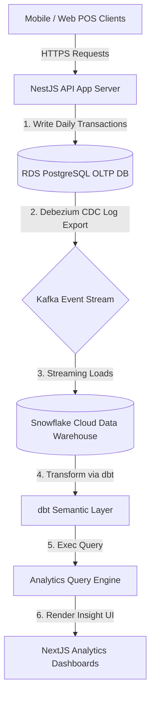
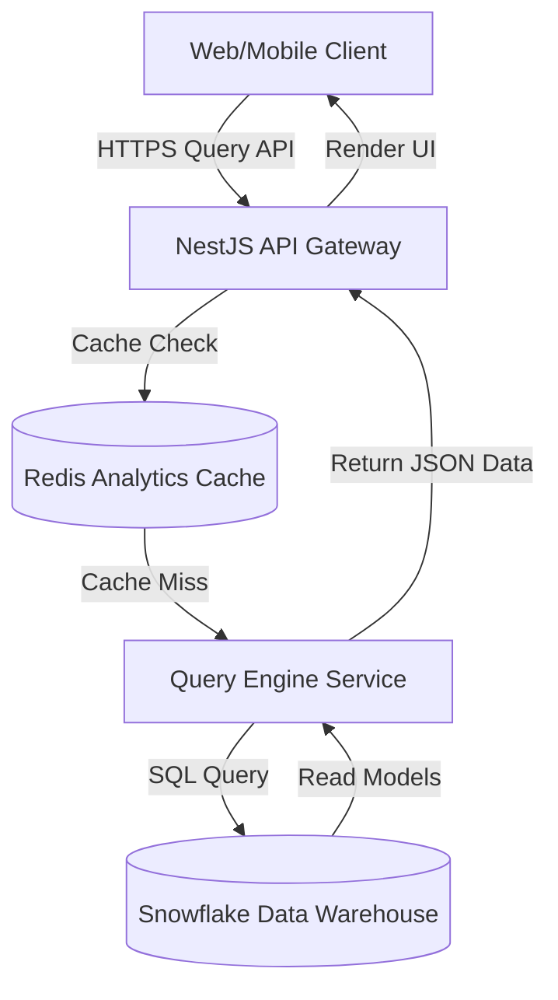
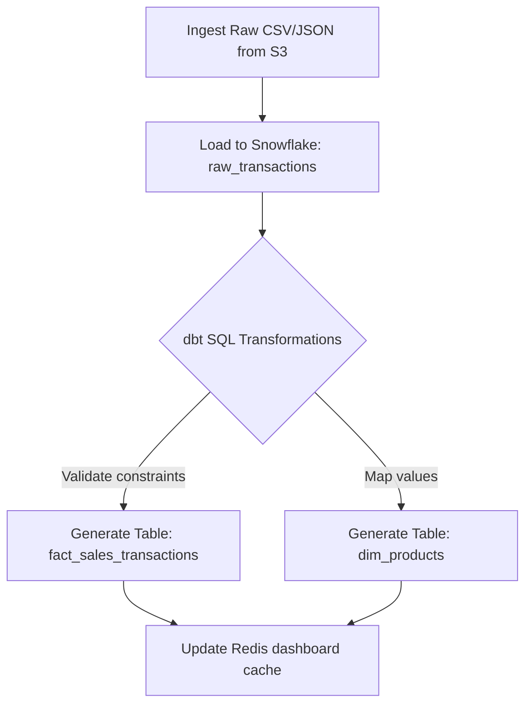
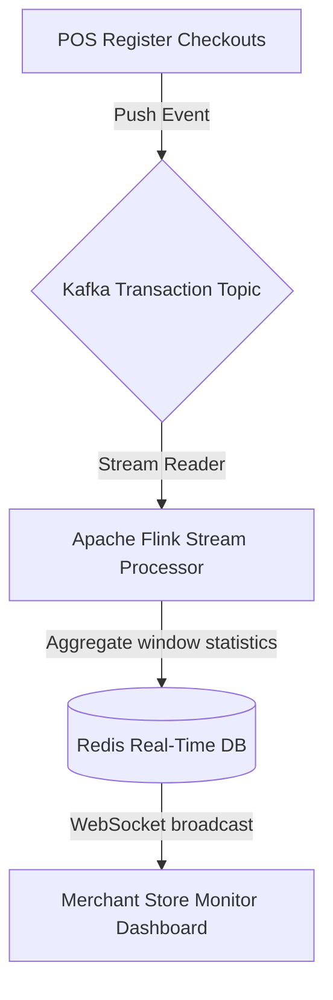

# BUSINESS INTELLIGENCE FOUNDATION & ANALYTICS ARCHITECTURE

**Project Name:** Enterprise SaaS Business Management Platform  
**Document Version:** 1.0.0 — Baseline Standard  
**Date:** July 13, 2026  
**Authors:** Chief Data Officer (CDO), Enterprise Data Architect & Analytics Engineer  
**Classification:** Enterprise Internal — Unrestricted  
**Status:** 🏛️ APPROVED DATA PLATFORM STANDARD  

---

## SECTION 1 — BUSINESS INTELLIGENCE FOUNDATION

### 1.1 The BI Ingestion Chain
To support strategic decision-making, our analytics platform structures raw business metrics into actionable operational decisions:

```
Raw Data (POS/Sales/Logs) ──► Information (KPI Aggregates) ──► Insight (Anomaly Trends) ──► Actionable Decision
```

### 1.2 The Role of SaaS Analytics
Multi-tenant business platforms process high volumes of transaction data daily. Transforming this transactional data into analytical structures allows merchants to optimize operations:
*   **Revenue Growth:** Identifying top-selling products and predicting customer churn to improve sales strategies.
*   **Cost Reduction:** Spotting inventory overstocks and optimizing staffing levels to minimize operational waste.
*   **Customer Insights:** Segmenting customers by purchase history to build targeted marketing campaigns.
*   **Operational Optimization:** Analyzing transaction speeds across cash registers and branches to improve store workflows.

---

## SECTION 2 — ENTERPRISE ANALYTICS ARCHITECTURE

Our analytics platform isolates analytical queries from live transaction processing databases using a decoupled data architecture:



---

## SECTION 3 — DATA PLATFORM STRATEGY

We separate transactional processing databases from analytical engines to protect operational performance:

### 3.1 OLTP vs. OLAP Database Strategies

| Database Strategy | OLTP (Online Transaction Processing) | OLAP (Online Analytical Processing) |
| :--- | :--- | :--- |
| **Primary Workload** | Fast insertions, updates, and reads of individual transaction records. | Complex, large-scale multi-month aggregations and historical trends. |
| **Target Database** | RDS PostgreSQL (Primary Instance) | Snowflake / Google BigQuery |
| **Data Schema** | Highly normalized (3rd Normal Form) to minimize redundancy. | Denormalized Star Schemas (Fact and Dimension Tables). |
| **Connection Pattern** | Fast, short-lived transactional connections. | Long-running queries scanning millions of database rows. |

---

## SECTION 4 — DATA WAREHOUSE ARCHITECTURE

Our cloud data warehouse aggregates and structures historical tenant data to support reporting queries:
*   **Storage Layer:** Stores structured transactional data in columnar formats to optimize query execution speeds.
*   **Semantic Layer:** Defines business logic (like net revenue calculations) centrally, ensuring consistent metrics across all dashboards.
*   **Cloud Data Warehouse Options:** We use **Snowflake** to manage compute resources dynamically, separating warehouse compute costs from persistent data storage costs.

---

## SECTION 5 — DATA LAKE STRATEGY

We deploy a Data Lake alongside our Data Warehouse to ingest unstructured and semi-structured payloads:
*   **Storage Framework:** AWS S3 buckets are configured as our data lake storage layer, using distinct prefixes for raw, structured, and processed files.
*   **Managed Payloads:**
    *   *Structured:* Nightly CSV exports of product lists and transaction logs.
    *   *Semi-Structured:* Raw JSON application events and API request payloads.
    *   *Unstructured:* Scanned invoices, purchase receipts, and employee profile documents.

---

## SECTION 6 — ETL / ELT PIPELINE DESIGN

We use an Extract-Load-Transform (ELT) architecture to ingest and process data.

```
Extract (CDC / S3 APIs) ──► Load (Write Raw DB Columns) ──► Transform (Execute dbt SQLs)
```

*   **dbt (Data Build Tool):** Transforms raw data models inside the warehouse using SQL queries, creating optimized reporting tables.
*   **Apache Airflow:** Schedules and monitors ingestion pipelines to ensure data lands in the warehouse within target SLAs.

---

## SECTION 7 — DATA DIMENSIONAL MODELING

We organize reporting data inside the warehouse using a Star Schema layout:

```
                  Dimension: Date
                         │
 Dimension: Customer ◄───┼───► Dimension: Product
                         │
                  [ Fact: Sales ]
                         │
 Dimension: Employee ◄───┴───► Dimension: Branch
```

### 7.1 Fact and Dimension Schema Examples

#### FACT: `fact_sales_transactions`
*   `transaction_id` (PK)
*   `tenant_id` (FK - Isolation boundary)
*   `customer_id` (FK)
*   `product_id` (FK)
*   `branch_id` (FK)
*   `date_key` (FK)
*   `gross_amount` (Decimal)
*   `discount_amount` (Decimal)
*   `net_amount` (Decimal)

#### DIMENSION: `dim_products`
*   `product_id` (PK)
*   `sku_code` (String)
*   `product_name` (String)
*   `category_name` (String)
*   `unit_price` (Decimal)

---

## SECTION 8 — MULTI-TENANT ANALYTICS ISOLATION

We enforce data isolation boundaries to protect merchant privacy while allowing platform-level reporting:
*   **Merchant Isolation:** Restrict query access to data matching the merchant's authenticated `tenant_id` using column-level and row-level access controls.
*   **Platform Reporting:** Grant SaaS operations teams access to global metadata queries (like aggregate platform growth metrics) while blocking access to individual customer names and invoice details.

---

## SECTION 9 — REPORTING ARCHITECTURE

Our reporting engine generates documents dynamically based on user requests:
*   **Format Outputs:** Support downloading data in PDF (for invoices), Excel (for finance lists), and CSV formats.
*   **Scheduled Delivery:** Configure background workers (scheduled via Airflow) to email weekly sales summaries to store owners automatically.

---

## SECTION 10 — DASHBOARD ARCHITECTURE

We structure analytics dashboards into distinct layouts to support different user roles:
*   **Executive Dashboard:** Tracks overall business health metrics, including monthly recurring revenue (MRR), customer lifetime value, and profit margins.
*   **Store Manager Dashboard:** Monitors daily operational metrics, including net daily sales, current stock alert thresholds, and employee shift completions.
*   **Finance Dashboard:** Reviews financial ledger positions, including total sales tax collected, inventory valuation totals, and business expenses.

---

## SECTION 11 — BUSINESS KPI FRAMEWORK

We define standard KPIs across all business modules to measure performance consistently:

### 11.1 Platform KPI Matrix

| Module | KPI Name | Business Definition | Target Calculation |
| :--- | :--- | :--- | :--- |
| **Sales** | **Average Order Value (AOV)** | Measures average customer spend per transaction. | $\frac{\text{Gross Revenue}}{\text{Total Order Count}}$ |
| **Customer**| **Retention Rate** | Measures the percentage of returning customers. | $\frac{\text{Returning Customers}}{\text{Total Active Customers}}$ |
| **Inventory**| **Stock Turnover** | Measures how quickly inventory is sold. | $\frac{\text{Cost of Goods Sold}}{\text{Average Inventory Value}}$ |
| **Finance** | **Gross Profit Margin** | Measures overall transaction profitability. | $\frac{\text{Gross Profit}}{\text{Net Sales}} \times 100\%$ |
| **HR** | **Sales per Employee** | Monitors employee productivity. | $\frac{\text{Total Net Sales}}{\text{Active Shift Employees}}$ |

---

## SECTION 12 — REAL-TIME ANALYTICS

*   **Ingestion Pipeline:** Stream POS transactions to Apache Kafka topics as they occur.
*   **Stream Processing:** Process incoming transaction streams using Apache Flink to update active sales metrics on dashboards in real time.

---

## SECTION 13 — ANALYTICS API ARCHITECTURE

Our analytics API handles reporting queries from web and mobile clients:
*   **Response Caching:** Cache report payloads in Redis for 1 hour to prevent redundant warehouse queries.
*   **Query Optimization:** Pre-aggregate historical transactions into daily summary tables using dbt scheduled runs, preventing queries from scanning raw transaction tables directly.

---

## SECTION 14 — ANALYTICS SECURITY CONTROLS

*   **Role-Based Access Control (RBAC):** Restrict dashboard access so cashiers can view only their own transaction logs, while store managers can access branch summaries.
*   **Audit Logging:** Log all reporting exports, CSV downloads, and analytical query events to OpenSearch to maintain compliance trails.

---

## SECTION 15 — DATA QUALITY MANAGEMENT

We monitor data ingestion quality to ensure metrics remain accurate:
*   **dbt Assertions:** Run dbt test suites in pipeline runs to verify that primary keys are unique and foreign keys map correctly to dimension tables.
*   **Data Validation:** Scan incoming data profiles using **Great Expectations** to flag anomalies like negative sales prices or empty tenant IDs.

---

## SECTION 16 — ANALYTICS TOOL STACK REFERENCE

Our standardized analytics tools are detailed in the table below:

| Category | Selected Tool | Purpose |
| :--- | :--- | :--- |
| **Data Warehouse** | **Snowflake** | High-performance analytical data warehouse with decoupled compute scaling. |
| **Data Lake Store**| **AWS S3** | Object storage layer for raw JSON events and backups. |
| **Transformation** | **dbt (Data Build Tool)** | Manages SQL transformations and maps dependency schemas. |
| **Orchestration** | **Apache Airflow** | Schedules and monitors ingestion pipelines. |
| **Event Streaming** | **Apache Kafka** | Distributes real-time transaction event streams. |
| **Stream Processor**| **Apache Flink** | Aggregates transactional streams in real time. |
| **BI Tool** | **Metabase** | Embedded query builder and dashboard visualization engine. |

---

## SECTION 17 — AI ANALYTICS FOUNDATION

We structure our data platform to support future machine learning capabilities:
*   **Sales Forecasting:** Predict upcoming sales volumes using historical transaction trends.
*   **Demand Prediction:** Forecast inventory demand levels using historical sales patterns and branch schedules.
*   **Fraud Detection:** Monitor transaction feeds in real time using machine learning models to identify anomalies like duplicate refunds or off-hours cash drawer openings.

---

## SECTION 18 — ANALYTICS MATURITY MODEL

Our analytics program scales along a defined maturity curve:
*   **Level 1 (Basic Reports):** Export raw transaction logs directly from PostgreSQL databases to CSV files.
*   **Level 2 (Dashboards):** Aggregate transactional metrics on central dashboards using read replicas.
*   **Level 3 (Business Intelligence):** Deploy a dedicated data warehouse and build structured star schemas.
*   **Level 4 (Predictive Analytics):** Run forecasting models to predict demand and inventory levels.
*   **Level 5 (AI-Driven Analytics):** Automate business decisions (like restocking orders) using machine learning models.

---

## SECTION 19 — FINAL BI ARCHITECTURE MERMAID DIAGRAMS

### 19.1 Enterprise Analytics Architecture


### 19.2 Data Warehouse Pipeline
```
[ Postgres Transactions ] ──► [ Debezium CDC ] ──► [ Kafka Topic ] ──► [ AWS S3 Lake ] ──► [ Snowflake Warehouse ]
```

### 19.3 ETL/ELT Ingestion Flow


### 19.4 Dashboard Service Architecture
```
                         NextJS Frontend App
                                │
                 [ Header: X-Tenant-Id = Tenant-A ]
                                │
                  [ Analytics Gateway Endpoint ]
                                │
          [ Query: WHERE tenant_id = Tenant-A RLS ]
                                │
              [ Metabase Embedded Sandbox iframe ]
```

### 19.5 Real-Time Analytics Flow


---

*End of Business Intelligence Foundation & Analytics Architecture*  
*Document maintained by: Chief Data Officer (CDO) | Status: Approved Data Platform Standard*
