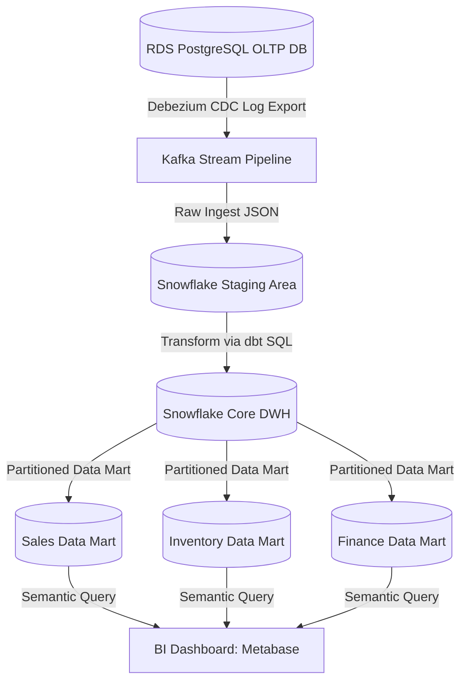
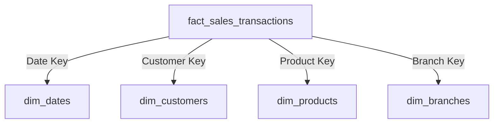
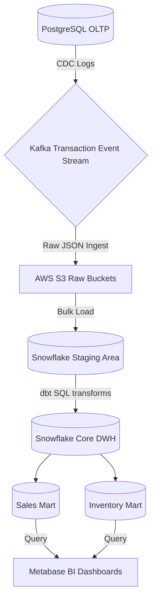
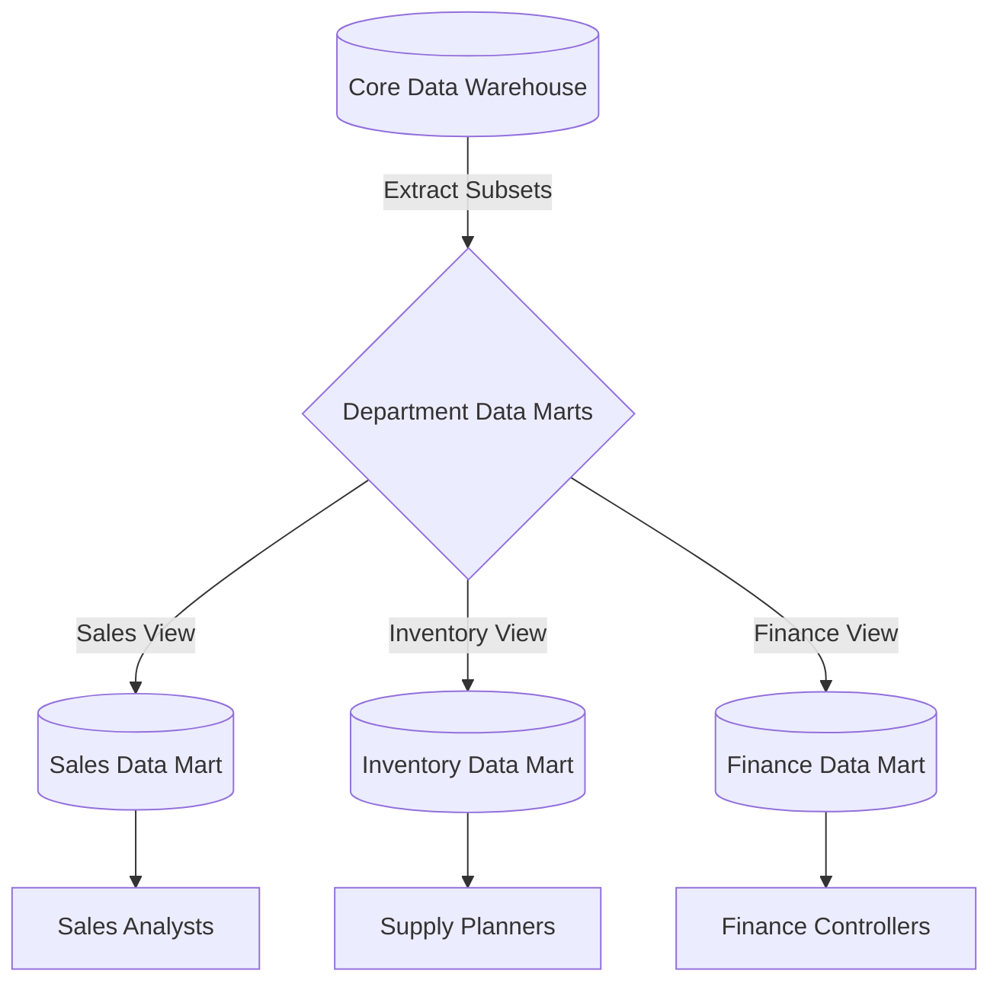
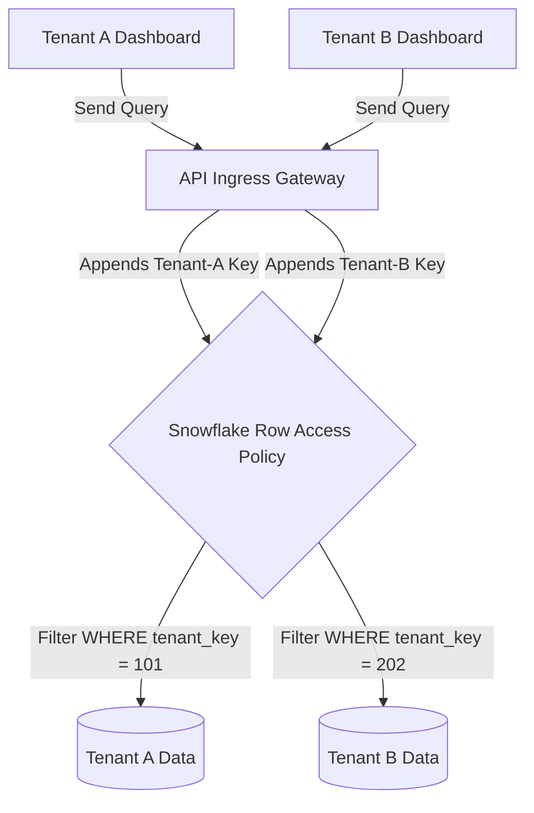

# DATA WAREHOUSE & DATA MODELING ARCHITECTURE

**Project Name:** Enterprise SaaS Business Management Platform  
**Document Version:** 1.0.0 — Baseline Standard  
**Date:** July 13, 2026  
**Authors:** Chief Data Architect, Enterprise Data Warehouse Lead & Database Architect  
**Classification:** Enterprise Internal — Unrestricted  
**Status:** 🏛️ APPROVED DATA WAREHOUSE STANDARD  

---

## SECTION 1 — OLTP VS OLAP ARCHITECTURE

Our data platform splits transactional resources from analytical systems to prevent reporting queries from affecting active POS cash checkouts.

### 1.1 Architectural Comparison

| Architecture Metric | OLTP (Online Transaction Processing) | OLAP (Online Analytical Processing) |
| :--- | :--- | :--- |
| **Primary Purpose** | Handles daily business transactions (e.g., checkout payments, inventory updates). | Processes complex reporting queries and identifies sales trends over time. |
| **Data Structure** | Normalized schema (3NF) to minimize redundancy and write locks. | Denormalized Star Schema (Fact and Dimension Tables). |
| **Access Patterns** | Fast writes and single-row select queries. | Bulk reads scanning millions of historical rows. |
| **Data Freshness** | Real-time transaction state updates. | Batch-loaded (nightly or hourly data syncs). |
| **Typical Queries** | `INSERT INTO sales (tenant_id, product_id, price) VALUES (...)` | `SELECT category, SUM(revenue) FROM fact_sales GROUP BY category` |

---

## SECTION 2 — DATA WAREHOUSE ARCHITECTURE

Our analytics platform structures data across staging, warehousing, and reporting layers:



---

## SECTION 3 — DATA MODELING PRINCIPLES

### 3.1 Analytics Modeling Goals
*   **Performance:** Optimize schemas to return query results quickly without scanning raw databases.
*   **Consistency:** Define business metrics centrally to ensure net revenue metrics match across all dashboards.
*   **Scalability:** Structure schemas to allow developers to add new business modules without modifying existing queries.
*   **Historical Tracking:** Retain historical details (like price modifications) to support accurate audit trails.

### 3.2 Modeling Methodologies
*   **Entity-Relationship (ER) Modeling:** Used in transaction databases (OLTP) to minimize data redundancy using foreign key relationships.
*   **Dimensional Modeling:** Denormalizes data into fact and dimension tables to simplify queries and optimize read speeds.

---

## SECTION 4 — DIMENSIONAL MODELING CONCEPT

Dimensional models separate business events (Facts) from the context surrounding them (Dimensions):
*   **Fact Tables:** Store measurable, quantitative business metrics (e.g., product units sold, transaction net amounts, and discount amounts).
*   **Dimension Tables:** Store descriptive context attributes (e.g., product names, cashier employee profiles, branch locations, and transaction date details).

---

## SECTION 5 — FACT TABLE DESIGN

We design our transactional facts to record business events at the individual checkout level.

### 5.1 Sales Fact Table: `fact_sales_transactions`

| Column Name | Data Type | Key Attribute | Business Description |
| :--- | :--- | :--- | :--- |
| `sales_id` | `VARCHAR(64)` | Primary Key | Unique transaction record hash. |
| `tenant_key` | `INT` | Foreign Key | Maps the record to a specific tenant workspace. |
| `date_key` | `INT` | Foreign Key | Maps to the Calendar Date Dimension. |
| `customer_key` | `INT` | Foreign Key | Maps to the Customer Profile Dimension. |
| `product_key` | `INT` | Foreign Key | Maps to the Product Catalog Dimension. |
| `branch_key` | `INT` | Foreign Key | Maps to the Store Branch Dimension. |
| `quantity` | `INT` | Metric | Number of product units sold. |
| `revenue_amount` | `DECIMAL(18,2)`| Metric | Net revenue amount collected. |
| `cost_amount` | `DECIMAL(18,2)`| Metric | Unit purchase cost calculated. |
| `profit_amount` | `DECIMAL(18,2)`| Metric | Profit margin amount collected. |

### 5.2 Fact Types
*   **Transaction Fact:** Records a single business event as it occurs (e.g., a POS cashier checkout payment).
*   **Periodic Snapshot Fact:** Aggregates transaction metrics over defined intervals (e.g., daily total revenue summaries per branch).
*   **Accumulating Snapshot Fact:** Tracks pipeline workflows from start to finish (e.g., delivery stages from order placement to shipment, tracking step dates).

---

## SECTION 6 — DIMENSION TABLE DESIGN

### 6.1 Dimension Schema Configurations

#### 1. Date Dimension: `dim_dates`
*   Contains pre-calculated dates, days of the week, fiscal periods, quarters, and holiday flags to speed up time-series queries.
*   *Attributes:* `date_key`, `calendar_date`, `day_of_week`, `fiscal_quarter`, `holiday_flag`.

#### 2. Customer Dimension: `dim_customers`
*   Stores merchant client profiles, segment categories, and registration details.
*   *Attributes:* `customer_key`, `customer_id`, `customer_name`, `segment_name`, `tier_level`.

#### 3. Product Dimension: `dim_products`
*   Tracks item names, active SKUs, categories, and unit list prices.
*   *Attributes:* `product_key`, `sku_code`, `product_name`, `category_group`, `retail_price`.

#### 4. Branch Dimension: `dim_branches`
*   Stores store names, city codes, regions, and physical sizes.
*   *Attributes:* `branch_key`, `branch_id`, `branch_name`, `city_name`, `region_zone`.

#### 5. Employee Dimension: `dim_employees`
*   Maintains worker profiles, store roles, and active departments.
*   *Attributes:* `employee_key`, `employee_id`, `employee_name`, `role_title`, `department_name`.

#### 6. Supplier Dimension: `dim_suppliers`
*   Tracks vendor companies, contact emails, and reliability tiers.
*   *Attributes:* `supplier_key`, `supplier_id`, `supplier_name`, `rating_tier`, `country`.

---

## SECTION 7 — STAR SCHEMA DESIGN

We arrange our tables in a Star Schema to simplify reporting queries:



### 7.1 Benefits of Star Schemas
*   **Simple Queries:** Requires fewer table joins to generate reports, reducing query complexity.
*   **Fast Reporting:** Columnar database engines scan facts and dimensions efficiently.
*   **BI Tool Friendly:** Integrates easily with standard visualization tools (like Metabase).

---

## SECTION 8 — SNOWFLAKE SCHEMA DESIGN

A Snowflake Schema normalizes dimension tables into sub-dimensions (e.g., split `dim_products` into a nested `dim_product_categories` table to minimize values redundancy).

### 8.1 Comparison Matrix

| Attribute | Star Schema | Snowflake Schema |
| :--- | :--- | :--- |
| **Normalization** | Fully denormalized (high redundancy). | Partially normalized (low redundancy). |
| **Query Complexity**| Low (simple single-join structures). | High (requires multi-stage sub-dimension joins). |
| **Query Performance**| **Fastest** on columnar data engines. | **Slower** due to query join overheads. |

**Decision:** Enforce **Star Schema** designs across our core data marts to optimize dashboard query speeds.

---

## SECTION 9 — DATA MART ARCHITECTURE

We structure our data warehouse into department-specific Data Marts to simplify queries for different business teams:
*   **Sales Mart:** Tracks cashier transaction velocities and product sales trends.
*   **Inventory Mart:** Monitors warehouse stock levels, supplier lead times, and cost adjustments.
*   **Finance Mart:** Aggregates accounting ledgers and tax records.
*   **HR Mart:** Measures employee sales performance and shift data.
*   **Customer Mart:** Analyzes customer retention rates and average order values.

---

## SECTION 10 — HISTORICAL DATA MANAGEMENT

*   **Audit Trails:** Retain historical transaction records to support financial compliance audits.
*   **Versioning:** Track database record states over time using date ranges and status flags.

---

## SECTION 11 — SLOWLY CHANGING DIMENSIONS (SCD)

When dimensions change (e.g., a customer changes their email or a product category is updated), we handle the update using one of three strategies:
*   **SCD Type 1:** Overwrite the existing record with the new values, losing all historical context.
*   **SCD Type 2:** Append a new record with the updated values, using active status flags and date ranges to preserve historical context.
*   **SCD Type 3:** Store the previous value in a dedicated column in the existing record, keeping only limited history.

**Decision:** Enforce **SCD Type 2** for product and customer dimensions to ensure historical sales reports remain accurate.

### 11.2 SCD Type 2 Implementation Schema Example
```
product_key | sku_code | product_name   | price | valid_from | valid_to   | is_current
--------------------------------------------------------------------------------------
1001        | SKU-COF  | Espresso Bean  | 12.00 | 2026-01-01 | 2026-06-01 | FALSE
1088        | SKU-COF  | Espresso Bean  | 14.50 | 2026-06-02 | 9999-12-31 | TRUE
```

---

## SECTION 12 — MULTI-TENANT DATA WAREHOUSE ISOLATION

We enforce tenant data isolation at the warehouse layer using row-level security filters:
*   **Tenant Mapping:** Include a `tenant_key` column in all fact tables.
*   **Data Access Policies:** Configure data warehouse access roles to filter queries using tenant identifiers, ensuring merchants can query only their own data.

---

## SECTION 13 — DATA WAREHOUSE SECURITY

*   **Encryption at Rest:** Encrypt data warehouse storage volumes using AES-256 keys managed by cloud KMS instances.
*   **Role-Based Access Control (RBAC):** Restrict access so BI users can run queries only on designated data marts.
*   **Column-Level Masking:** Mask sensitive columns (like customer emails) in default queries to protect user privacy.

---

## SECTION 14 — PERFORMANCE OPTIMIZATIONS

*   **Data Partitioning:** Partition fact tables by date and tenant ID to limit the volume of data scanned by queries.
*   **Materialized Views:** Use materialized views to pre-aggregate daily sales summaries, speeding up dashboard queries.

---

## SECTION 15 — DATA PIPELINE INTEGRATION

*   **Ingestion Pipeline:** Stream transactional data from PostgreSQL databases to Kafka topics using Debezium CDC.
*   **Transformation Pipeline:** Run dbt transformation models scheduled via Apache Airflow daily to rebuild reporting schemas.

---

## SECTION 16 — DATA QUALITY MANAGEMENT

*   **Great Expectations Rules:** Run tests in ingestion pipelines to verify that primary keys are unique and foreign keys map correctly to dimension tables.
*   **Data Integrity Tests:** Verify that financial records (Gross, Cost, Profit) balance correctly before loading tables to data marts.

---

## SECTION 17 — DATA GOVERNANCE

*   **Data Catalog:** Maintain a centralized data catalog listing table schemas, column types, and field descriptions.
*   **Metadata Management:** Log all dbt compilation runs to maintain a clear map of data dependencies.

---

## SECTION 18 — DATA WAREHOUSE TOOL STACK REFERENCE

Our standardized data warehouse tools are detailed in the table below:

| Category | Selected Tool | Purpose |
| :--- | :--- | :--- |
| **Data Warehouse** | **Snowflake** | High-performance analytical data warehouse with decoupled compute scaling. |
| **Transformation** | **dbt (Data Build Tool)** | Manages SQL transformations and maps dependency schemas. |
| **Orchestrator** | **Apache Airflow** | Schedules and monitors ingestion pipelines. |
| **Event Stream** | **Apache Kafka** | Distributes real-time transaction event streams. |
| **Data Quality** | **Great Expectations** | Runs automated data validation checks. |
| **Data Catalog** | **Amundsen** | Metadata search and data discovery platform. |

---

## SECTION 19 — DATA MATURITY MODEL

Our data operations scale along a defined maturity curve:
*   **Level 1 (Operational Database):** Run reporting queries directly on transactional databases.
*   **Level 2 (Reporting Database):** Run reporting queries on dedicated read replica databases.
*   **Level 3 (Data Warehouse):** Deploy a dedicated data warehouse and build structured star schemas.
*   **Level 4 (Advanced Analytics):** Use historical data models to forecast sales and optimize inventory levels.
*   **Level 5 (AI Data Platform):** Automate business decisions (like restocking orders) using machine learning models.

---

## SECTION 20 — FINAL DATA WAREHOUSE ARCHITECTURE

### 20.1 Enterprise Data Warehouse Architecture


### 20.2 Star Schema Model


### 20.3 ETL Pipeline Flow
```
[ postgres_table ] ──► [ Airflow Trigger ] ──► [ dbt Run: raw_to_stage ] ──► [ dbt Test: constraints ] ──► [ load_to_fact ]
```

### 20.4 Data Mart Architecture


### 20.5 Multi-Tenant Analytics Isolation


---

*End of Data Warehouse & Data Modeling Architecture*  
*Document maintained by: Chief Data Architect | Status: Approved Data Warehouse Standard*
