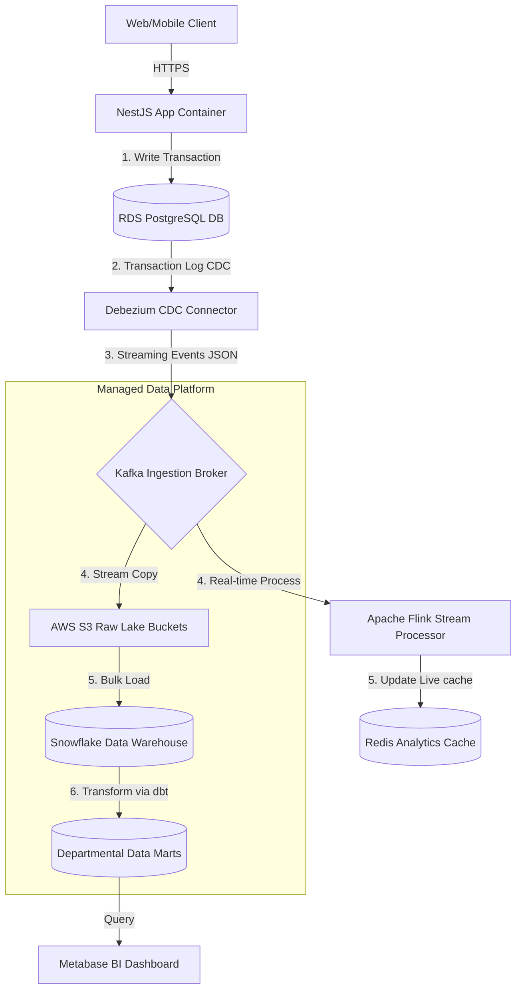
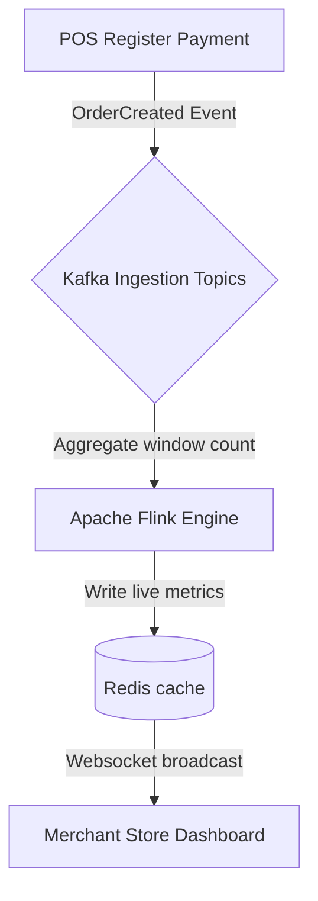
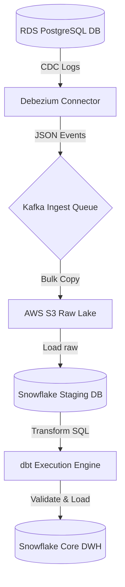
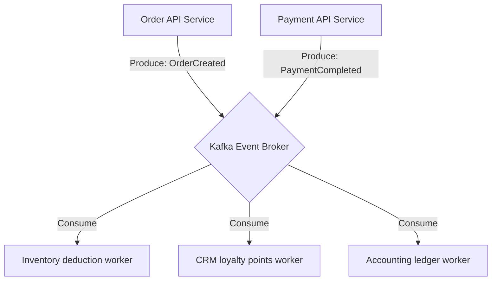
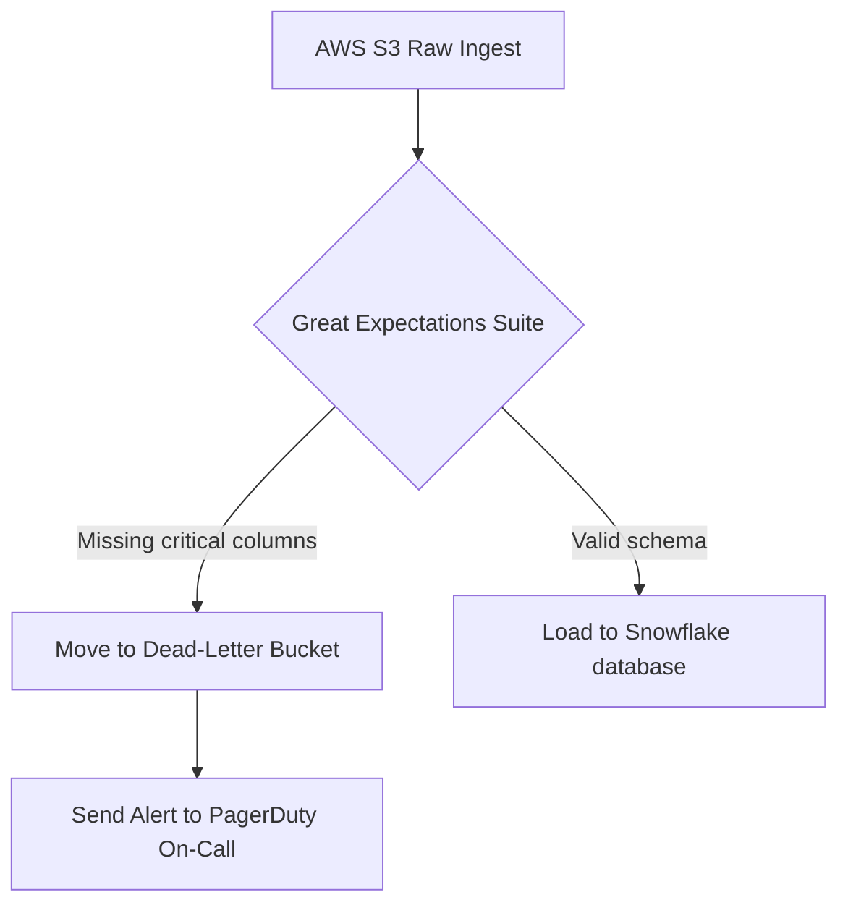

# ETL/ELT DATA PIPELINE & REAL-TIME DATA PROCESSING ARCHITECTURE

**Project Name:** Enterprise SaaS Business Management Platform  
**Document Version:** 1.0.0 — Baseline Standard  
**Date:** July 13, 2026  
**Authors:** Chief Data Engineer, Streaming Data Architect & DevSecOps lead  
**Classification:** Enterprise Internal — Unrestricted  
**Status:** 🏛️ APPROVED DATA PIPELINE STANDARD  

---

## SECTION 1 — DATA PIPELINE FOUNDATION

### 1.1 Ingestion Flow
Our pipeline ingests raw transaction events, normalizes database structures, and generates dashboard insights:

```
Source Data (OLTP/Logs) ──► Processing (ELT/Kafka) ──► Storage (Warehouse) ──► Analytics (BI/AI)
```

### 1.2 The Need for Pipelines
SaaS business architectures generate high volumes of data across distributed tenant databases:
*   **Centralized Analytics:** Aggregates POS, inventory, finance, and CRM data into a single query platform.
*   **Automation:** Automates data synchronization to keep business reports accurate and up to date.
*   **Real-Time Insights:** Provides store owners with real-time checkout metrics and alerts for low inventory.
*   **AI Preparation:** Cleans and structures transaction records to train sales forecasting models.

---

## SECTION 2 — ETL VS. ELT ARCHITECTURE

We choose our pipeline architecture based on compute requirements and database scaling:

### 2.1 Architectural Comparison

| Pipeline Attribute | ETL (Extract, Transform, Load) | ELT (Extract, Load, Transform) |
| :--- | :--- | :--- |
| **Pipeline Order** | Transforms data on external compute nodes before writing to storage. | Ingests raw data directly into the warehouse, using SQL for transformations. |
| **Performance** | Slower, as transformation stages create bottlenecks before loading. | **Faster**, as bulk-load utilities load raw data directly. |
| **Scalability** | Limited by the capacity of external processing compute nodes. | **Highest**, as transformations scale dynamically with the cloud warehouse. |
| **Cloud Compatibility**| Low (designed for on-premise hardware limits). | **Highest** (designed for cloud-native data warehouses). |

**Decision:** Enforce **ELT** architectures for batch analytical data loads, using **dbt** for transformations inside our cloud data warehouse.

---

## SECTION 3 — ENTERPRISE DATA PIPELINE ARCHITECTURE

Our decoupled pipeline architecture isolates analytics tasks from our transaction-processing PostgreSQL databases:



---

## SECTION 4 — DATA EXTRACTION STRATEGY

We extract data from transactional databases, API event streams, and system logs:
*   **Full Extraction:** Scans and exports entire database tables nightly.
    *   *Use Case:* Small metadata tables, like store branches and categories.
*   **Incremental Extraction:** Reads records modified since the last pipeline run using update timestamp columns.
    *   *Use Case:* Large dimension tables, like customer profiles.
*   **Change Data Capture (CDC):** Reads database transaction logs directly to capture updates without querying tables.
    *   *Use Case:* Large transaction tables, like POS sales ledgers.

---

## SECTION 5 — CHANGE DATA CAPTURE (CDC)

We use Change Data Capture (CDC) to capture database updates with minimal impact on PostgreSQL transaction performance:
*   **Debezium Connector:** Monitors PostgreSQL write-ahead logs (WAL) to identify inserts, updates, and deletes.
*   **Kafka Connect:** Formats WAL records as structured JSON events and publishes them to dedicated Kafka topics.

```
PostgreSQL Database ──► Debezium WAL Reader ──► Kafka Connect Topic ──► Data Warehouse Loader
```

---

## SECTION 6 — BATCH PROCESSING ARCHITECTURE

*   **ETL Batch Engine:** Runs daily Airflow tasks to update financial legers and inventory valuations.
*   **Processing Framework:** Schedules dbt compilation runs to transform raw tables into report-ready dimension tables.

---

## SECTION 7 — REAL-TIME STREAMING ARCHITECTURE

We process events in real time to update live store monitoring dashboards:



*   **Flink Analytics:** Aggregates transactions in rolling 1-minute windows to compute sales velocities.

---

## SECTION 8 — EVENT-DRIVEN DATA ARCHITECTURE

Our microservices communicate asynchronously using event topics managed by **Kafka**:
*   `OrderCreated` $\rightarrow$ Triggers customer CRM point updates.
*   `PaymentCompleted` $\rightarrow$ Triggers inventory deduction events and financial ledger updates.
*   `StockChanged` $\rightarrow$ Triggers low-stock alerts for store managers.

---

## SECTION 9 — DATA TRANSFORMATION LAYER

We structure data transformations inside our warehouse across three logical layers:
*   **Raw Layer (Bronze):** Stores raw transaction records and JSON events imported from staging areas.
*   **Clean Layer (Silver):** Sanitizes fields, converts datatypes, filters test logs, and updates status flags using dbt queries.
*   **Business Layer (Gold):** Aggregates cleaned dimensions and facts into star schemas to populate data marts.

---

## SECTION 10 — DATA QUALITY VALIDATION

We validate data quality before loading reporting tables:
*   **Great Expectations:** Runs validation rules on raw S3 files to check for duplicate records and invalid transaction amounts.
*   **dbt Tests:** Enforces constraints on warehouse tables to verify that primary keys are unique and foreign keys map correctly to dimension tables.

---

## SECTION 11 — PIPELINE ORCHESTRATION

We manage and monitor our batch pipelines using **Apache Airflow**:
*   **DAG Configurations:** Airflow Directed Acyclic Graphs (DAGs) schedule, sequence, and monitor dbt runs.
*   **SLA Controls:** If a batch load task exceeds its 2-hour completion SLA, Airflow alerts on-call engineers via Slack.

---

## SECTION 12 — PIPELINE ERROR HANDLING

To prevent pipeline failures from causing data loss, we implement automated error handling:
*   **Retry Policy:** Configure Airflow tasks to retry up to 3 times with exponential backoff delays.
*   **Dead Letter Queue (DLQ):** Route malformed payloads to a dedicated Kafka DLQ topic for manual inspection, allowing the pipeline to continue processing valid messages.

```
Failed Ingestion Payload ──► Dead Letter Queue S3 ──► PagerDuty Alert ──► Developer Triage
```

---

## SECTION 13 — DATA PIPELINE SECURITY

*   **Encryption:** Enforce TLS 1.3 encryption on all connections between pipeline components, and encrypt data at rest using AES-256 keys.
*   **Secrets Management:** Store database credentials and API keys in Secrets Managers (AWS Secrets Manager/Vault).

---

## SECTION 14 — MULTI-TENANT PIPELINE ISOLATION

*   **Tenant ID Routing:** Require all ingestion events and Kafka payloads to include a `tenant_id` header.
*   **Isolation Boundaries:** Scope stream processing tasks to individual tenant contexts to prevent cross-tenant data leaks.

---

## SECTION 15 — PIPELINE OBSERVABILITY

We monitor pipeline performance using centralized dashboards:
*   **Monitored Metrics:** Track execution times, failure rates, ingestion volume bytes, and validation failures.
*   **Tooling:** Grafana, Prometheus, and Datadog.

---

## SECTION 16 — PIPELINE PERFORMANCE OPTIMIZATION

*   **Parallel Processing:** Run dbt models and ingestion tasks concurrently to speed up database loads.
*   **Partitioning:** Partition tables by date and tenant ID to limit the volume of data scanned by queries.
*   **Batch Sizing:** Optimize Kafka batch configurations to balance ingestion latency and database write speeds.

---

## SECTION 17 — PIPELINE TOOL STACK REFERENCE

Our standardized pipeline tools are detailed in the table below:

| Category | Selected Tool | Purpose |
| :--- | :--- | :--- |
| **Message Broker** | **Apache Kafka** | Distributed event broker for real-time transaction streams. |
| **CDC Connector** | **Debezium** | Captures PostgreSQL write-ahead logs (WAL) to identify database changes. |
| **Orchestrator** | **Apache Airflow** | Schedules and monitors ingestion pipelines. |
| **Transformation** | **dbt (Data Build Tool)** | Transforms database tables inside the cloud data warehouse. |
| **Stream Processor**| **Apache Flink** | Processes transactional streams in real time. |
| **Data Quality** | **Great Expectations** | Runs automated data validation checks. |
| **DAG alternative**| **Dagster** | Python orchestrator for developing and testing data assets. |

---

## SECTION 18 — DATA RELIABILITY ENGINEERING

We define SLAs to guarantee data reliability for business dashboards:
*   **Freshness SLA:** Ensure batch dashboard data is updated within 2 hours of ingestion.
*   **Correctness SLA:** Maintain a target data accuracy rate of **$\ge 99.9\%$**, verified using daily Great Expectations checks.
*   **Availability SLA:** Target **$\ge 99.9\%$** availability for our real-time streaming pipelines.

---

## SECTION 19 — DATA PLATFORM MATURITY MODEL

Our data pipelines scale along a defined maturity curve:
*   **Level 1 (Manual Export):** Export data manually using CSV files.
*   **Level 2 (Scheduled ETL):** Run nightly SQL scripts to copy database tables to reporting replicas.
*   **Level 3 (Automated Pipeline):** Deploy Apache Airflow to orchestrate and monitor multi-stage dbt pipelines.
*   **Level 4 (Real-Time Streaming):** Process transactions in real time using Debezium CDC and Kafka event streams.
*   **Level 5 (AI Data Platform):** Automate data pipeline runs and use machine learning models to forecast demand.

---

## SECTION 20 — FINAL DATA PIPELINE ARCHITECTURE

### 20.1 Enterprise ETL/ELT Architecture


### 20.2 CDC Pipeline Flow
```
[ postgresql_records ] ──► [ Debezium log monitor ] ──► [ Kafka Connect ] ──► [ AWS S3 Raw JSON ]
```

### 20.3 Kafka Event Streaming Architecture


### 20.4 Batch Processing Workflow
```
[ Airflow Scheduler ] ──► [ Extract CDC ] ──► [ Load to Snowflake ] ──► [ dbt transform ] ──► [ Validate data ]
```

### 20.5 Data Quality Monitoring Flow


---

*End of ETL/ELT Data Pipeline & Real-Time Data Processing Architecture*  
*Document maintained by: Chief Data Engineer | Status: Approved Data Pipeline Standard*
