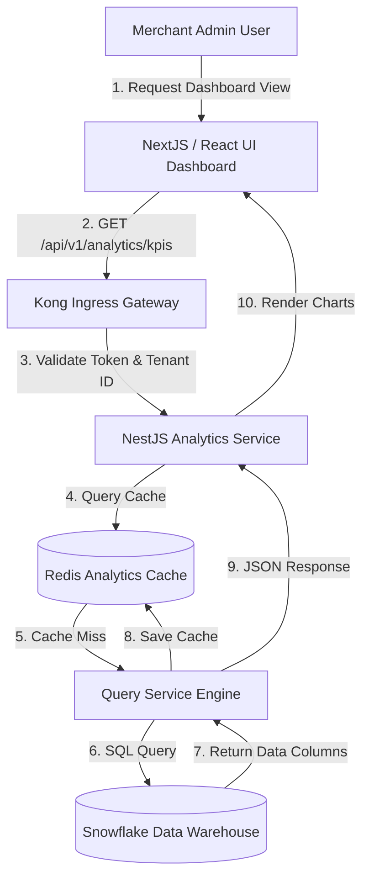
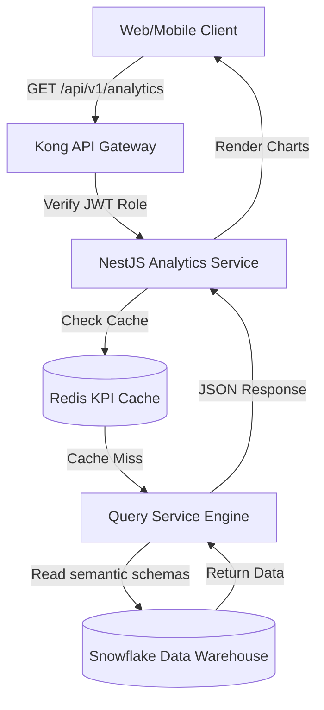
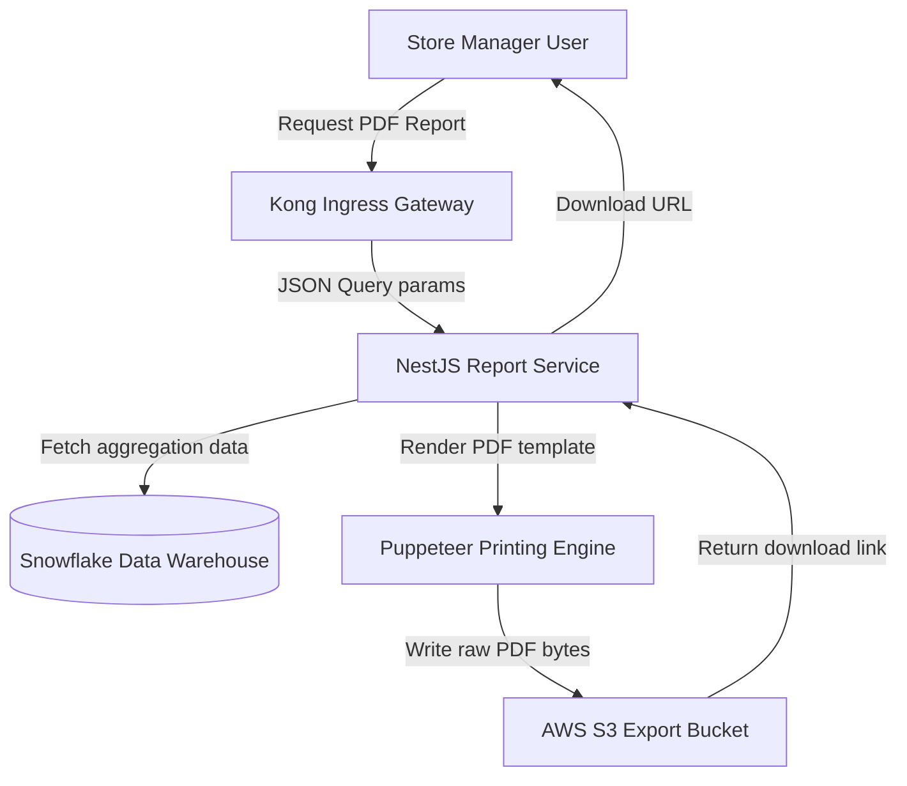
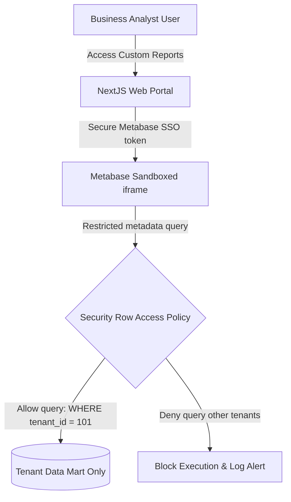

# ANALYTICS DASHBOARD, REPORTING & BUSINESS KPI ARCHITECTURE

**Project Name:** Enterprise SaaS Business Management Platform  
**Document Version:** 1.0.0 — Baseline Standard  
**Date:** July 13, 2026  
**Authors:** Chief Data Officer (CDO), Analytics Product Manager & Data Visualization Specialist  
**Classification:** Enterprise Internal — Unrestricted  
**Status:** 🏛️ APPROVED ANALYTICS EXPERIENCE STANDARD  

---

## SECTION 1 — BUSINESS ANALYTICS FOUNDATION

### 1.1 The Business Data Journey
Our platform transforms daily POS store checkouts and ledger logs into strategic business decisions:

```
POS Transaction ──► Data Ingestion Pipeline ──► Data Warehouse Analytics ──► Strategic Business Decision
```

### 1.2 The Value of Analytics Dashboards
Multi-tenant merchants require analytics dashboards to monitor operations across branches:
*   **Operational Visibility:** Provides a central view of checkout metrics and inventory levels across store locations.
*   **Faster Decisions:** Identifies low stock levels and sales dips quickly to support rapid operational changes.
*   **Performance Tracking:** Tracks cashier sales metrics and employee attendance against targets.
*   **Business Optimization:** Identifies peak hours and customer preferences to optimize store staffing and product placement.

---

## SECTION 2 — ANALYTICS USER EXPERIENCE ARCHITECTURE

Our analytics interface handles dashboard queries from Next.js web apps and React Native mobile clients:



---

## SECTION 3 — DASHBOARD ARCHITECTURE

Our analytics dashboard architecture decouples query and visualization tools from live database resources:
*   **React Dashboard UI:** Uses modern chart libraries (like Chart.js and Recharts) to render interactive metrics dashboards.
*   **Analytics API:** Provides NestJS endpoints that validate queries, scope requests by tenant, and cache reports.
*   **Core UI Components:**
    *   *KPI Cards:* Show total revenue, transaction counts, and growth trends.
    *   *Charts:* Show daily sales trends and category distributions using line and bar charts.
    *   *Tables:* List low-stock products and cashier sales summaries.
    *   *Filters:* Filter reports by date ranges, store branches, and categories.
    *   *Exports:* Support exporting reports to PDF, Excel, and CSV formats.

---

## SECTION 4 — EXECUTIVE DASHBOARD

Designed to give business owners a high-level view of platform performance:
*   **Total Revenue:** Shows gross and net sales values (daily, weekly, monthly, and yearly views).
*   **Gross Profit:** Computes profit margins after subtracting cost of goods sold.
*   **Growth Rate:** Measures changes in sales volume compared to previous periods.
*   **Active Customers:** Tracks the number of unique customers making purchases.
*   **Business Health Score:** Combined score measuring employee attendance, margin levels, and inventory turnover.

---

## SECTION 5 — SALES & POS DASHBOARD

Designed to help store managers optimize checkout lanes and staff assignments:
*   **Total Sales Velocity:** Real-time metrics tracking total sales and transaction counts.
*   **Average Order Value (AOV):** Monitors average customer spend.
*   **Top Products:** Lists top-selling products by volume and revenue contribution.
*   **Peak Hours:** Identifies peak sales periods to support cashier shift scheduling.
*   **Payment Methods:** Tracks transaction volumes across cash, credit cards, and digital wallets.

---

## SECTION 6 — INVENTORY ANALYTICS DASHBOARD

Designed to help supply planners manage warehouse stock and prevent out-of-stock events:
*   **Stock Levels:** Monitors stock volumes across all store locations in real time.
*   **Low Stock Alerts:** Flags products that fall below safety stock thresholds.
*   **Inventory Valuation:** Calculates the total value of current inventory based on unit costs.
*   **Stock Movement:** Tracks stock additions, transfers, and sales deductions over time.
*   **Dead Stock:** Identifies products with zero sales over the last 90 days.
*   **Supplier Performance:** Tracks vendor delivery times and product defect rates.

---

## SECTION 7 — FINANCE DASHBOARD

Designed to help accountants monitor cash flows and prepare statements:
*   **Ledger Aggregation:** Tracks revenues, operating expenses, and net profit margins.
*   **Cash Flow:** Monitors store cash inflows and vendor outflows.
*   **Outstanding Payments:** Lists unpaid supplier invoices and pending customer balances.
*   **Financial Statements:** Automatically generates Income Statements and Profit & Loss reports.

---

## SECTION 8 — CUSTOMER ANALYTICS DASHBOARD

Designed to help marketing teams analyze customer retention and spend:
*   **Customer Growth:** Tracks new customer registrations over time.
*   **Retention Rate:** Measures the percentage of returning customers.
*   **Customer Lifetime Value (LTV):** Estimates total revenue contribution per customer.
*   **Customer Segments:** Groups customers by purchase history and spend levels to support marketing campaigns.

---

## SECTION 9 — HR ANALYTICS DASHBOARD

Designed to help managers monitor employee performance and labor costs:
*   **Staff Counts:** Logs active employees by department and branch location.
*   **Attendance Tracking:** Monitors shift check-ins, lateness rates, and total hours worked.
*   **Sales per Employee:** Measures employee sales productivity.
*   **Salary Costs:** Tracks labor costs against total branch sales.

---

## SECTION 10 — BUSINESS KPI FRAMEWORK

We define standard KPIs across all business domains to monitor performance:

### 10.1 Key Performance Indicator Matrix

| Domain | KPI Name | Target SLA | Business Formula |
| :--- | :--- | :--- | :--- |
| **Sales** | **MRR (Monthly Recurring Revenue)** | Scale $\ge 15\%$ MoM | $\sum \text{Active Subscription Value}$ |
| **Sales** | **ARR (Annual Recurring Revenue)** | Scale $\ge 20\%$ YoY | $\text{MRR} \times 12$ |
| **Customer**| **LTV (Lifetime Value)** | Target $\ge 5 \times \text{CAC}$ | $\text{Average Order Value} \times \text{Purchase Frequency} \times \text{Lifespan}$ |
| **Customer**| **CAC (Acquisition Cost)** | Reduce $10\%$ YoY | $\frac{\text{Total Marketing Costs}}{\text{New Customers Acquired}}$ |
| **Operations**| **Order Completion Rate** | Target $\ge 99.8\%$ | $\frac{\text{Completed Orders}}{\text{Total Orders Submitted}} \times 100\%$ |
| **Inventory**| **Inventory Turnover** | Target $\ge 8.0$ | $\frac{\text{Cost of Goods Sold}}{\text{Average Inventory Value}}$ |

---

## SECTION 11 — REAL-TIME ANALYTICS DASHBOARD

*   **Ingestion Pipeline:** Streams transaction events (orders, payments, inventory updates) to Apache Kafka topics as they occur.
*   **Stream Processing:** Process events using Apache Flink to update dashboard metrics in real time.
*   **Dashboard Updates:** Broadcasts metric updates to client dashboards using WebSockets.

---

## SECTION 12 — REPORTING SYSTEM ARCHITECTURE

Our reporting engine generates PDF, Excel, and CSV reports dynamically based on user queries:
*   **Print Engine:** Converts Next.js reporting templates into print-ready PDF files.
*   **Scheduled Reports:** Airflow workers schedule and run reporting queries, emailing PDF or Excel summaries to store owners weekly.

---

## SECTION 13 — SELF-SERVICE BI SYSTEM

We integrate embedded sandboxes to allow advanced users to build custom reports:
*   **Metabase Sandboxing:** Embed Metabase query builders within Next.js applications using secure iframe connections.
*   **Permission Scopes:** Restrict user queries to the columns and tables permitted by their role and tenant access rights.

---

## SECTION 14 — DATA VISUALIZATION STRATEGY

We match visualization types to specific data attributes to maximize readability:
*   **Line Charts:** Best for trend analyses over time (e.g., monthly sales trends).
*   **Bar Charts:** Best for comparisons (e.g., sales comparison across store branches).
*   **Pie Charts:** Best for distribution analyses (e.g., payment method distributions).
*   **Heat Maps:** Best for activity timelines (e.g., peak transaction hours).

---

## SECTION 15 — ANALYTICS SECURITY CONTROLS

*   **Role-Based Access Control (RBAC):** Restrict dashboard access so cashiers can view only their own transaction logs, while store managers can access branch summaries.
*   **Row-Level Tenant Isolation:** Filter all database queries using tenant IDs to prevent cross-tenant data leaks.
*   **Audit Logging:** Log all data exports, CSV downloads, and query events to Loki to maintain compliance trails.

---

## SECTION 16 — DASHBOARD PERFORMANCE OPTIMIZATION

*   **Redis Caching:** Cache report payloads in Redis for 1 hour to prevent redundant database queries.
*   **Materialized Views:** Use materialized views to pre-aggregate sales metrics, avoiding raw table scans.
*   **Lazy Loading:** Configure dashboard interfaces to load charts asynchronously, prioritizing KPI cards.

---

## SECTION 17 — ANALYTICS API DESIGN

We secure our analytics API endpoints using rate limiters and validation checks:
*   `/api/v1/analytics/dashboard/exec` $\rightarrow$ Fetches executive overview KPIs.
*   `/api/v1/analytics/reports/export` $\rightarrow$ Triggers a PDF report download.
*   `/api/v1/analytics/kpis/sales` $\rightarrow$ Returns daily sales metrics.

---

## SECTION 18 — BI TOOL STACK REFERENCE

Our standardized BI and visualization tools are detailed in the table below:

| Category | Selected Tool | Purpose |
| :--- | :--- | :--- |
| **Enterprise BI** | **Power BI / Tableau** | Used by operations teams to analyze aggregate platform trends. |
| **Embedded BI** | **Metabase** | Embedded query builder and dashboard visualization engine. |
| **Open-Source BI** | **Apache Superset** | Visualizes complex data warehouse and database tables. |
| **Metric Logging** | **Grafana** | Visualizes pipeline metrics and runtime container metrics. |
| **Managed Analytics**| **Looker** | Centralized semantic modeling and reporting platform. |

---

## SECTION 19 — ANALYTICS MATURITY MODEL

Our analytics capabilities scale along a defined maturity curve:
*   **Level 1 (Basic Reports):** Export raw transaction logs to CSV files.
*   **Level 2 (Operational Dashboard):** Aggregate sales metrics on central dashboards using read replicas.
*   **Level 3 (Business Intelligence):** Deploy a dedicated data warehouse and build structured star schemas.
*   **Level 4 (Advanced Analytics):** Use historical data models to forecast sales and optimize inventory levels.
*   **Level 5 (AI-Driven Analytics):** Automate business decisions (like restocking orders) using machine learning models.

---

## SECTION 20 — FINAL DASHBOARD ARCHITECTURE MERMAID DIAGRAMS

### 20.1 Enterprise Dashboard Architecture


### 20.2 KPI Data Flow
```
[ Postgres POS Event ] ──► [ CDC Stream ] ──► [ dbt Warehouse Aggregates ] ──► [ Cache KPI Cards ] ──► [ NextJS UI ]
```

### 20.3 Report Generation Flow


### 20.4 Real-Time Analytics Dashboard
```
[ POS Register ] ──► [ Kafka Stream Topic ] ──► [ Apache Flink window sum ] ──► [ WebSocket Server ] ──► [ Dashboard UI ]
```

### 20.5 Self-Service BI Architecture


---

*End of Analytics Dashboard, Reporting & Business KPI Architecture*  
*Document maintained by: Chief Data Officer (CDO) | Status: Approved Analytics Experience Standard*
