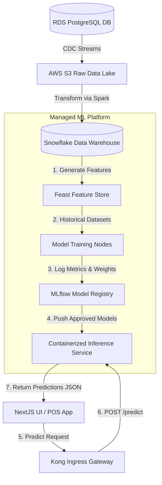
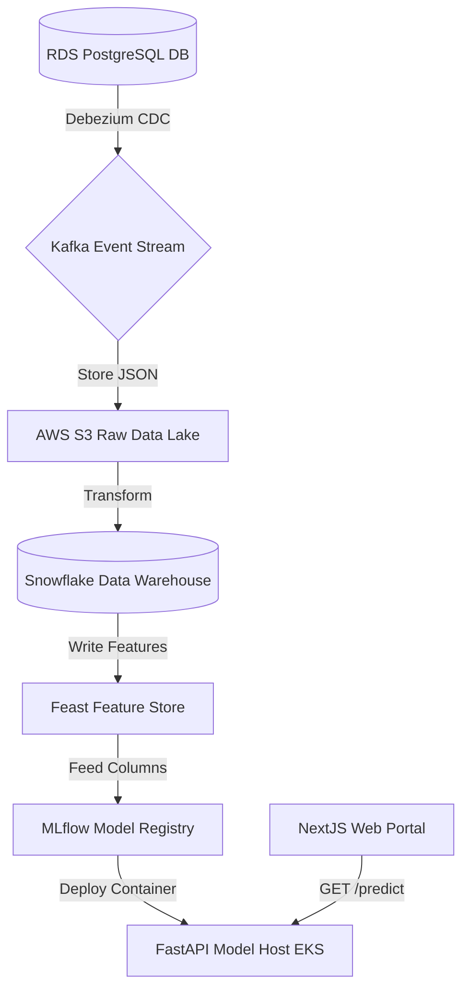
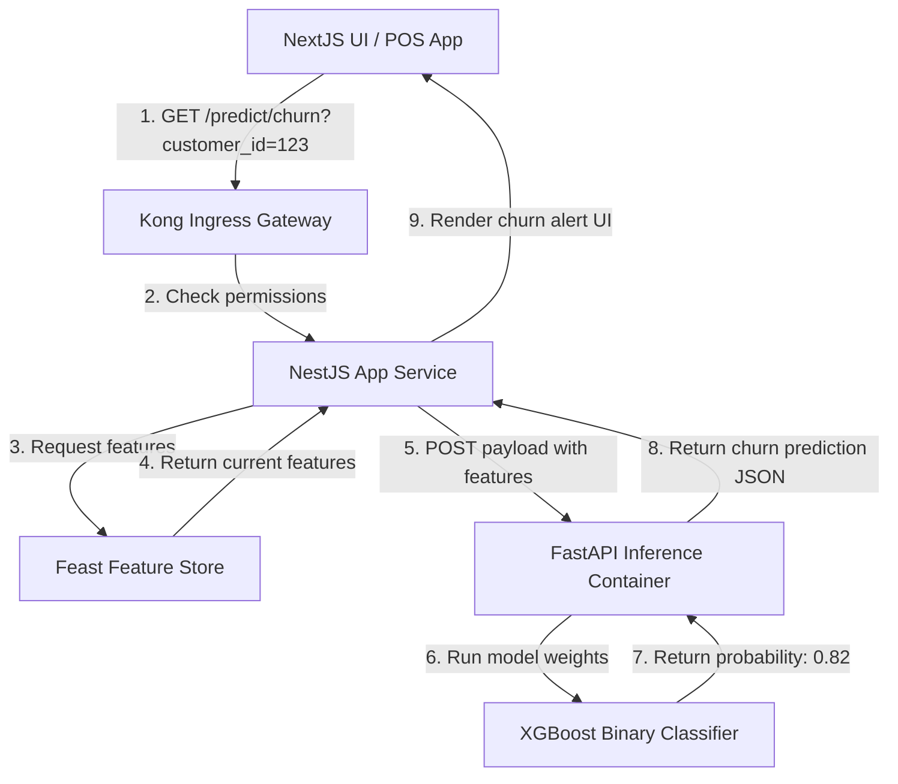

# AI ANALYTICS, PREDICTIVE INTELLIGENCE & MACHINE LEARNING FOUNDATION

**Project Name:** Enterprise SaaS Business Management Platform  
**Document Version:** 1.0.0 — Baseline Standard  
**Date:** July 13, 2026  
**Authors:** Chief AI Officer (CAIO), Machine Learning Architect & Data Scientist  
**Classification:** Enterprise Internal — Unrestricted  
**Status:** 🏛️ APPROVED AI PLATFORM STANDARD  

---

## SECTION 1 — AI ANALYTICS FOUNDATION

### 1.1 The Analytical Intelligence Curve
Our platform processes transactional logs to answer core business questions:

```
Descriptive (What happened?) ──► Predictive (What will happen?) ──► Prescriptive (What should we do?)
```

### 1.2 The Value of AI in SaaS
Operating a multi-tenant business platform generates large datasets across transactions, inventory movements, and customer interactions. Applying machine learning models directly to these data pools enables merchants to optimize operations:
*   **Predictive Stocking:** Anticipating inventory demand to optimize order sizes and reduce stockouts.
*   **Automated Fraud Audits:** Screening transactions in real time to flag employee theft or payment fraud.
*   **Targeted Loyalty Retention:** Identifying customer segments likely to churn and recommending personalized promotions.
*   **Conversational BI:** Allowing store owners to query sales data using natural language commands.

---

## SECTION 2 — ENTERPRISE AI ARCHITECTURE

Our machine learning pipeline decouples model training and deployment from transactional databases, routing analytical features through dedicated feature stores:



---

## SECTION 3 — AI DATA PLATFORM

We organize data lake and data warehouse tiers to support both batch training runs and real-time inference checks:
*   **Structured Data:** Stores historical checkout transaction metrics and ledger records inside Snowflake data warehouses.
*   **Semi-Structured Data:** Ingests raw JSON application event logs and web clickstream data into S3 raw data lakes.
*   **Unstructured Data:** Stores scanned employee PDFs, supplier receipts, and product images in private S3 buckets.

---

## SECTION 4 — MACHINE LEARNING LIFECYCLE (MLSD)

We orchestrate model management across seven lifecycle stages:

```
Data Ingestion ──► Prep & Clean ──► Feature Store ──► Model Training ──► Model Eval ──► Deploy ──► Drift Monitor
```

*   **Data Preparation:** Resolves missing values and scales numeric columns.
*   **Evaluation:** Validates models on testing datasets to confirm performance matches target metrics before deployment.

---

## SECTION 5 — FEATURE ENGINEERING

We compute and store training features inside a Feast feature store, serving them to models during training and inference:
*   **Sales Features:** Calculated historical revenues, rolling average transaction sizes, and peak hour sales ratios.
*   **Customer Features:** Customer purchase frequencies, active return ratios, and days since last purchase.
*   **Inventory Features:** Average item stock lifetimes, supplier lead times, and out-of-stock count trends.
*   **Time Contexts:** Day-of-week indexes, holiday flags, and seasonal sales indexes.

---

## SECTION 6 — SALES FORECASTING SYSTEM

*   **Objective:** Forecast store revenues and sales volumes over the upcoming 30 days to support staffing and budgeting decisions.
*   **Input Context:** Historical sales transaction volumes, seasonal holiday indicators, and local branch characteristics.
*   **Model Framework:** Train Prophet and XGBoost regressors concurrently, selecting the model with the lowest mean absolute error (MAE).

---

## SECTION 7 — DEMAND PREDICTION SYSTEM

*   **Objective:** Forecast product demand levels at individual branches to optimize inventory levels.
*   **Benefits:**
    *   *Reduce Stockouts:* Automatically identify high-demand items and alert planners to restock.
    *   *Minimize Waste:* Limit orders for short-shelf-life products during slow periods to reduce spoilage.
    *   *Optimize Purchasing:* Standardize bulk purchasing workflows by predicting supplier requirements weeks in advance.

---

## SECTION 8 — CUSTOMER INTELLIGENCE

*   **Customer Segmentation:** Group customer profiles based on spending velocities and store visit counts.
*   **Recommendation Engine:** Suggest products to customers based on past purchase histories and segment profiles.
*   **Churn Predictor:** Alert managers if key customer profiles show a high probability of churning (e.g., no visits for 45 days).
*   **Customer Lifetime Value (LTV):** Estimate future revenue contributions per customer to target loyalty rewards.

---

## SECTION 9 — FRAUD DETECTION SYSTEM

*   **Transaction Audits:** Analyze checkout logs in real time to identify anomalies, such as duplicate cashier refunds or unusual off-hours cash drawer openings.
*   **Detection Pipeline:** If a transaction triggers high-risk fraud scores, alert administrators and log the event in audit files.

---

## SECTION 10 — CONVERSATIONAL BI ASSISTANT

Our business assistant allows merchants to query sales data using natural language:

```
Merchant: "Predict next month's revenue" ──► Query Translator ──► Run Model ──► Assistant Answer: "$12,450"
```

*   **Natural Language Processing:** Translates user questions into SQL database queries and model execution parameters.
*   **Supported Queries:** E.g., "Which products contributed most to this month's revenue?" or "Forecast next week's inventory requirements."

---

## SECTION 11 — AI MODEL MANAGEMENT

We manage model deployments across distinct lifecycle stages:
*   **Continuous Testing:** Verify that updated models outperform production baselines before deployment.
*   **Automated Retraining:** Trigger Airflow tasks to retrain models monthly using newly collected transaction data.

---

## SECTION 12 — MLOPS ARCHITECTURE

We automate model training, tracking, and deployment using MLOps workflows:
*   **MLflow Tracking:** Logs model parameters, code versions, training metrics, and weights to a centralized server.
*   **Kubeflow Orchestration:** Schedules training and feature engineering pipelines on Kubernetes clusters.

---

## SECTION 13 — MODEL DEPLOYMENT MODELS

*   **Inference Endpoints:** Run models in containerized API services (using FastAPI frameworks) on EKS nodes.
*   **Serverless Inference:** Run low-frequency models (like monthly forecasting tasks) on serverless runtimes to minimize compute costs.

---

## SECTION 14 — PERFORMANCE MONITORING

*   **Accuracy Metrics:** Log inference predictions and compare them to actual sales metrics as they occur.
*   **Data Drift Checks:** Alert operations teams if incoming data distributions drift from the original training datasets (e.g., due to sudden shifts in customer purchasing behavior).

---

## SECTION 15 — AI SYSTEM SECURITY

*   **API Access Controls:** Require valid JWT signatures and role scopes for all inference API calls.
*   **Training Data Privacy:** Obfuscate all customer names and sensitive attributes before loading datasets into model training environments.
*   **Model Theft Protections:** Limit prediction API rate limits to prevent attackers from querying models repeatedly to reverse-engineer weights.

---

## SECTION 16 — RESPONSIBLE AI GOVERNANCE

*   **Transparency:** Provide explainability reports (using SHAP frameworks) to detail key factors behind model decisions (e.g., explaining why a customer was flagged for churn risk).
*   **Fairness:** Audit recommendation engines to verify they do not favor specific vendor products unfairly.
*   **Human Oversight:** Require manager approval before executing automated inventory purchases suggested by models.

---

## SECTION 17 — AI TECHNOLOGY STACK REFERENCE

Our standardized AI and ML tools are detailed in the table below:

| Category | Selected Tool | Purpose |
| :--- | :--- | :--- |
| **Programming Language** | **Python (3.11)** | Standard runtime for model training and data science pipelines. |
| **Deep Learning** | **PyTorch / TensorFlow** | Frameworks for training deep learning models. |
| **Machine Learning** | **Scikit-learn / XGBoost** | Libraries for training classification and regression models. |
| **Model Registry** | **MLflow** | Tracks model metadata, versions, and training runs. |
| **Pipeline orchestrator**| **Kubeflow** | Schedules training pipelines on Kubernetes clusters. |
| **Feature Store** | **Feast** | Central Feature Store serving metrics for training and inference. |

---

## SECTION 18 — AI MATURITY MODEL

Our artificial intelligence capabilities scale along a defined maturity curve:
*   **Level 1 (Manual Reporting):** Export transactional logs to Excel files to build manual charts.
*   **Level 2 (Business Analytics):** View aggregated sales metrics on central dashboards using read replicas.
*   **Level 3 (Predictive Analytics):** Run time-series models to forecast store sales and inventory requirements.
*   **Level 4 (AI Automation):** Integrate automated recommendation engines and fraud audits.
*   **Level 5 (Autonomous Intelligence):** Automate core operational decisions (like inventory restocking) using machine learning models.

---

## SECTION 19 — AI IMPLEMENTATION ROADMAP

We deploy AI capabilities across five phases:
*   **Phase 1 (Data Foundation):** Deploy S3 data lakes and configure central data warehouses.
*   **Phase 2 (Analytics Dashboard):** Build dashboards to monitor daily sales and inventory metrics.
*   **Phase 3 (Predictive Models):** Deploy demand and sales forecasting models to staging environments.
*   **Phase 4 (AI Assistant):** Launch the conversational BI assistant to allow natural language data queries.
*   **Phase 5 (Autonomous Intelligence):** Automate supply chains using reinforcement learning and predictive pipelines.

---

## SECTION 20 — FINAL AI ANALYTICS MERMAID DIAGRAMS

### 20.1 AI Analytics Platform Architecture


### 20.2 ML Pipeline Flow
```
[ Ingest S3 Data ] ──► [ Scale Columns ] ──► [ Feast Feature Store ] ──► [ Train XGBoost ] ──► [ Evaluate MAE ] ──► [ Register MLflow ]
```

### 20.3 AI Prediction Service


### 20.4 MLOps Lifecycle
```
[ Code Commit ] ──► [ Kubeflow Run ] ──► [ MLflow Metrics Log ] ──► [ Validation Gate ] ──► [ Push to EKS ] ──► [ Drift Monitor ]
```

### 20.5 AI Business Assistant Architecture

```mermaid
graph TD
    Owner[Merchant Owner UI] -->|1. Query: Why did sales decrease?| WebApp[NextJS Web App]
    WebApp -->|2. POST query text| AssistantSvc[NestJS Assistant Service]
    AssistantSvc -->|3. Generate SQL & context| LLM[Mistral-7B Inference Engine]
    LLM -->|4. Return SQL query| AssistantSvc
    
    AssistantSvc -->|5. Run Query| Snowflake[(Snowflake Data Warehouse)]
    Snowflake -->|6. Return transactional data| AssistantSvc
    
    AssistantSvc -->|7. Send data & text| LLM
    LLM -->|8. Generate natural language response| AssistantSvc
    AssistantSvc -->|9. Send formatted answer text| WebApp
    WebApp -->|10. Render response| Owner
```


---

*End of AI Analytics, Predictive Intelligence & Machine Learning Foundation*  
*Document maintained by: Chief AI Officer (CAIO) | Status: Approved AI Platform Standard*
