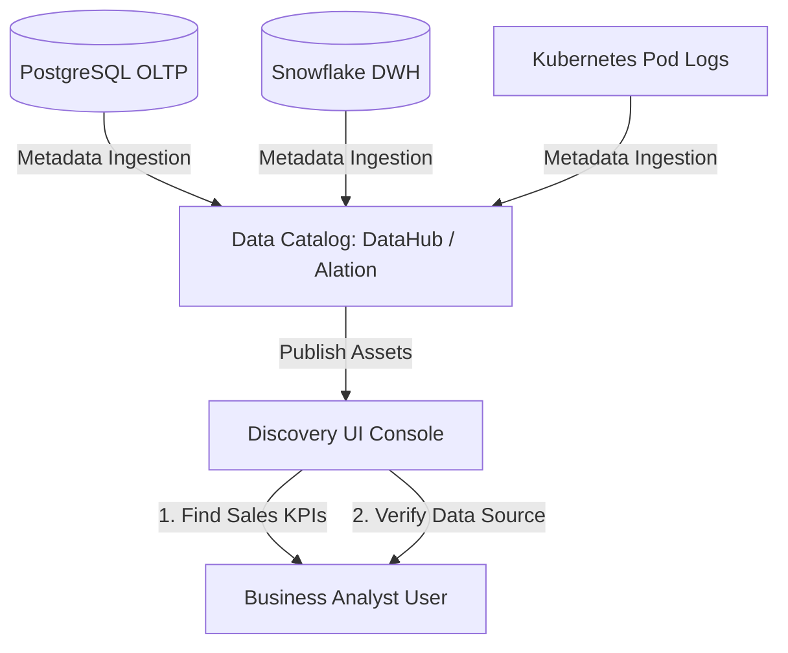
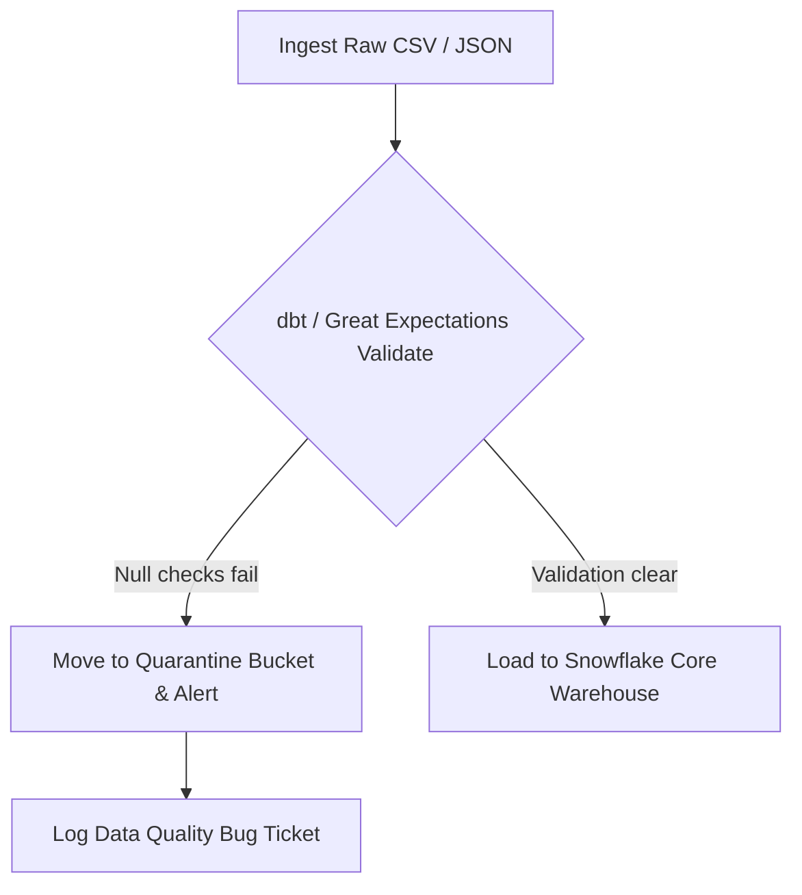
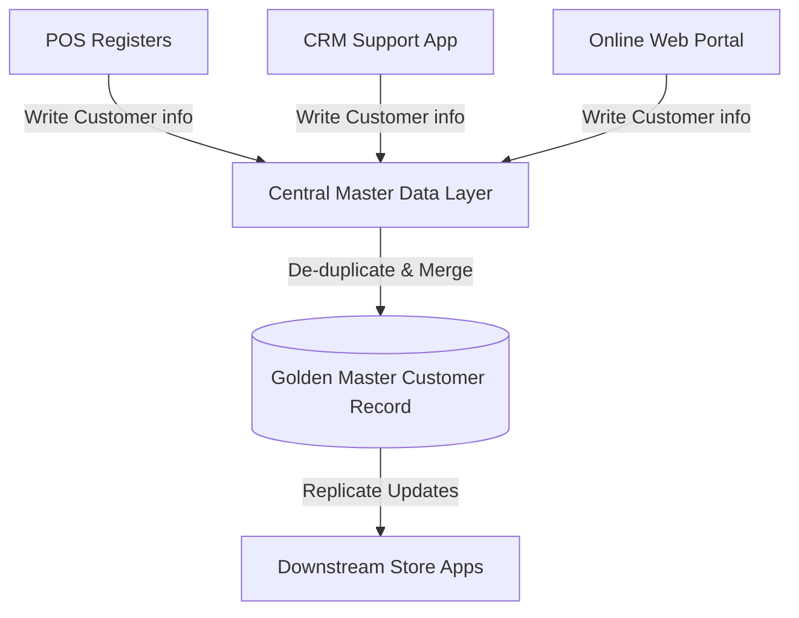
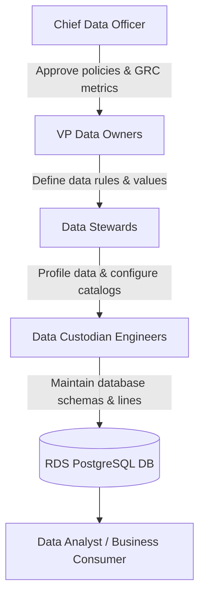
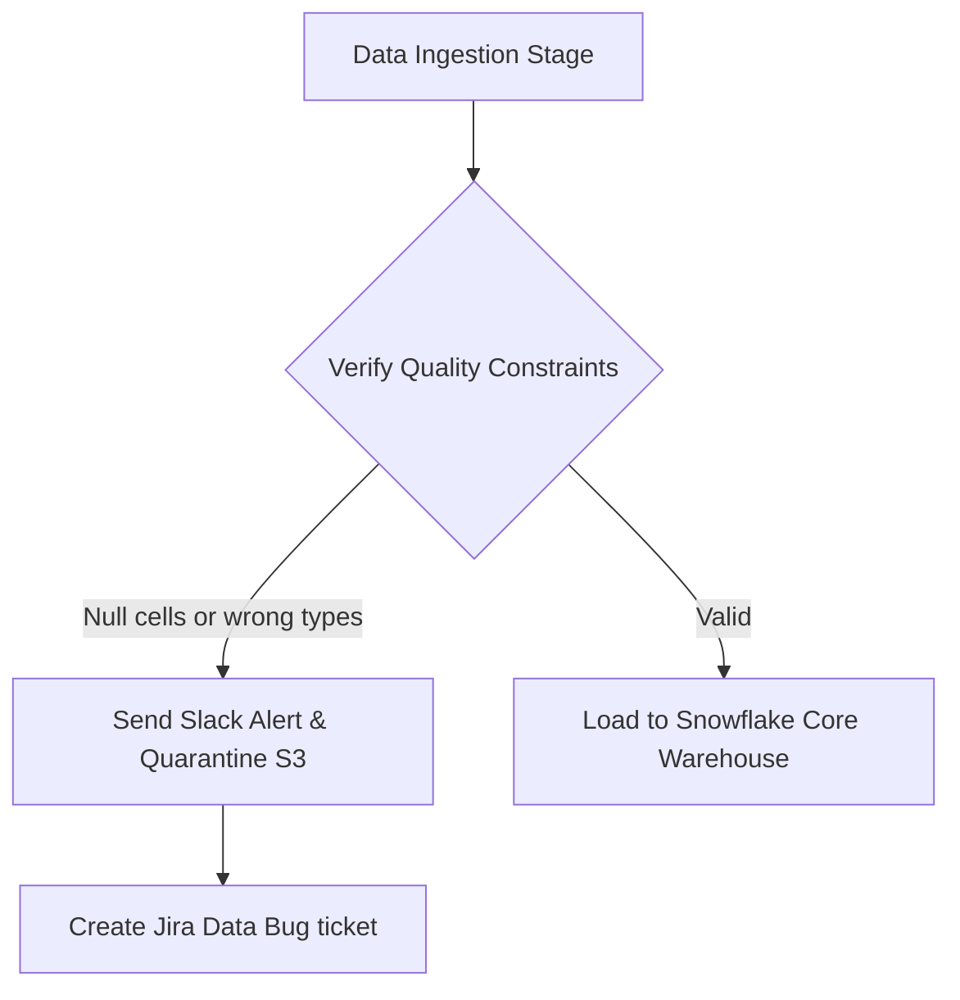
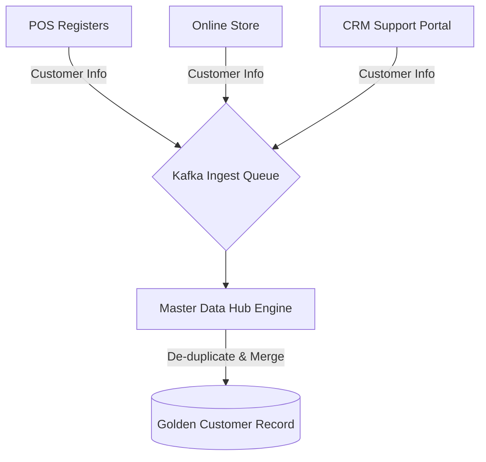
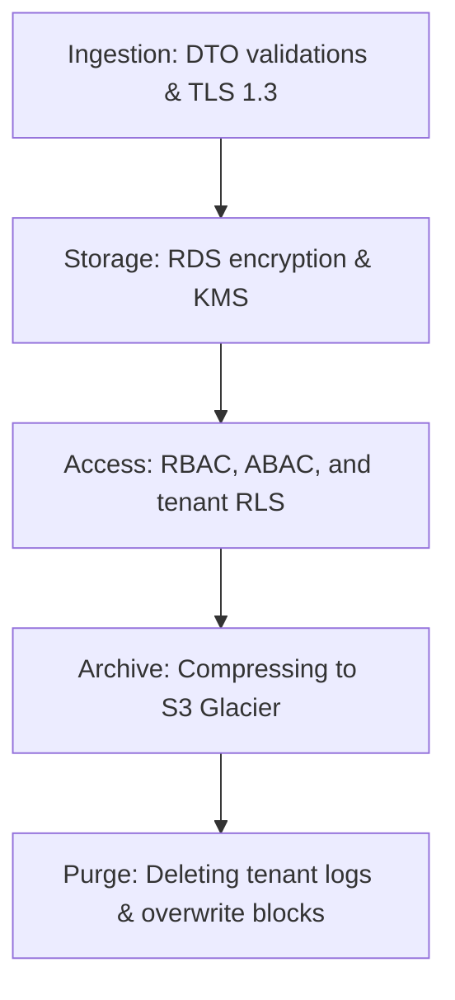

# DATA GOVERNANCE, DATA QUALITY & MASTER DATA MANAGEMENT ARCHITECTURE

**Project Name:** Enterprise SaaS Business Management Platform  
**Document Version:** 1.0.0 — Baseline Standard  
**Date:** July 13, 2026  
**Authors:** Chief Data Officer (CDO), Data Governance Architect & Data Quality Engineer  
**Classification:** Enterprise Internal — Unrestricted  
**Status:** 🏛️ APPROVED GOVERNANCE STANDARD  

---

## SECTION 1 — DATA GOVERNANCE FOUNDATION

### 1.1 People, Process, and Technology
Our data governance program coordinates business stakeholders, operational workflows, and security technologies to manage data as a strategic asset:
*   **Goal:** Establish trusted, secure, and compliance-ready data catalogs across the SaaS ecosystem.

```
Data Owner (Executive) ──► Data Steward (Custodian) ──► Data Engineer (Builder) ──► Business User (Consumer)
```

---

## SECTION 2 — DATA OWNERSHIP MODEL

We assign data accountability across a defined data ownership model:
*   **Chief Data Officer (CDO):** Manages the platform's data strategy, defines governance budgets, and oversees compliance audits.
*   **Data Owner:** Accountable for specific business datasets (e.g., the VP of Finance owns accounting records). Sets data access policies and defines quality rules.
*   **Data Steward:** Manages data quality, maintains dictionaries, and resolves data anomalies.
*   **Data Custodian (Data Engineer):** Implements physical storage security, manages backups, and maintains ETL pipelines.
*   **Data Consumer:** Follows acceptable use policies and queries data to support business operations.

---

## SECTION 3 — DATA STEWARDSHIP MODEL

Data stewards are responsible for managing data assets:
*   **Maintain Quality:** Run profiling tests to check for incomplete records.
*   **Define Rules:** Collaborate with data owners to document business terms and validation rules.
*   **Resolve Issues:** Triage data alerts and coordinate with engineers to resolve anomalies.
*   **Manage Metadata:** Maintain the data catalog to keep table schemas documented.
*   **Monitor Data Usage:** Review access logs to verify compliance with security policies.

---

## SECTION 4 — DATA CATALOG ARCHITECTURE

Our data catalog scans platform metadata to help business analysts discover data assets:



*   **Discoverable Assets:** Database tables, dbt transformation logs, Metabase dashboard locations, and semantic KPIs.

---

## SECTION 5 — DATA DICTIONARY STRUCTURE

We maintain a centralized data dictionary to document database tables, sensitivity classifications, and business owners.

### 5.1 Core Data Dictionary Examples

#### TABLE: `dim_customers`

| Column Name | Data Type | Business Description | Data Owner | Sensitivity Level | Common Usage |
| :--- | :--- | :--- | :--- | :--- | :--- |
| `customer_id` | `VARCHAR(64)`| Unique identifier for client profiles. | VP Customer CRM | Level 3 (Confidential) | Customer loyalty tracking. |
| `customer_name`| `VARCHAR(255)`| Client first and last name. | VP Customer CRM | Level 3 (Confidential) | Invoice printing. |
| `email` | `VARCHAR(255)`| Client primary contact address. | VP Customer CRM | Level 3 (Confidential) | Email notification triggers. |

#### TABLE: `fact_sales_transactions`

| Column Name | Data Type | Business Description | Data Owner | Sensitivity Level | Common Usage |
| :--- | :--- | :--- | :--- | :--- | :--- |
| `transaction_id`| `VARCHAR(64)`| POS transaction identifier. | VP Sales Operations | Level 2 (Internal) | Revenue aggregation. |
| `gross_amount` | `DECIMAL(18,2)`| Total sales amount before discount. | VP Sales Operations | Level 2 (Internal) | Sales velocity tracking. |
| `discount_val` | `DECIMAL(18,2)`| Discount deductions applied. | VP Sales Operations | Level 2 (Internal) | Promo code performance. |

---

## SECTION 6 — DATA LINEAGE ARCHITECTURE

We track data flows throughout the ingestion and reporting lifecycle to support audit trails and impact analyses:

```
PostgreSQL Ingestion ──► Debezium CDC Stream ──► Snowflake Staging ──► dbt Gold Fact ──► Metabase Dashboard
```

*   **Lineage Tracking:** Automatically generates dependency maps showing how transaction tables are transformed into reporting KPIs.

---

## SECTION 7 — DATA QUALITY DIMENSIONS

We define and validate data quality across six core dimensions:
*   **Accuracy:** Transaction amounts must match physical POS sales records.
*   **Completeness:** Customer order records must include an active cashier employee ID.
*   **Consistency:** Total revenue metrics must match across both sales and finance dashboards.
*   **Validity:** Product SKU codes must conform to standard business formats.
*   **Uniqueness:** Customer profiles must use unique email addresses to prevent duplicate accounts.
*   **Timeliness:** Analytical tables must reflect operational transactions within 2 hours of ingestion.

---

## SECTION 8 — DATA QUALITY MONITORING

Our data ingestion pipeline validates files and alerts teams on data quality issues:



---

## SECTION 9 — MASTER DATA MANAGEMENT (MDM)

Our Master Data Management (MDM) architecture reconciles data across core business systems to create a unified source of truth for key entities:



---

## SECTION 10 — CUSTOMER MASTER DATA (SINGLE CUSTOMER VIEW)

*   **The Golden Record:** Consolidates profile data, contact details, transaction histories, and loyalty tiers from different systems to create a single customer view.
*   **Entity Resolution:** Automatically merges duplicate profiles using name and email matching rules.

---

## SECTION 11 — PRODUCT MASTER DATA MANAGEMENT

*   **Central Product Master:** Manages unique SKU codes, categories, list prices, and supplier profiles across all store locations, preventing product conflicts during checkout.

---

## SECTION 12 — REFERENCE DATA MANAGEMENT

*   **Reference Data Management:** Centrally configures and manages code tables for countries, currencies, local tax rates, and business classifications to ensure consistency across tenant workspaces.

---

## SECTION 13 — DATA LIFECYCLE GOVERNANCE

We enforce security controls throughout the data lifecycle:
*   **Ingestion:** Encrypt connections using TLS 1.3 and validate payloads against DTO schemas.
*   **Storage:** Encrypt database volumes at rest using AES-256 keys.
*   **Usage:** Restrict access using RBAC roles and database RLS policies.
*   **Archive:** Compress and move old records to low-cost Glacier storage.
*   **Destruction:** Overwrite storage blocks when deleting records to prevent data recovery.

---

## SECTION 14 — DATA SECURITY GOVERNANCE

*   **Access Control:** Restrict database administrative permissions to authorized engineering roles.
*   **Encryption:** Enforce column-level envelope encryption on sensitive data fields.
*   **Audit Logging:** Log all database query events to OpenSearch to maintain compliance trails.

---

## SECTION 15 — MULTI-TENANT DATA GOVERNANCE

*   **Tenant Data Ownership:** Define merchants as the sole owners of their business records.
*   **Logical Isolation:** Enforce row-level security (RLS) filters on all database queries to prevent cross-tenant data leaks.
*   **Data Quality Rules:** Enable tenants to customize validation rules (such as mandatory customer phone numbers) for their workspaces.

---

## SECTION 16 — DATA COMPLIANCE

*   **GDPR:** Enforce the Right to be Forgotten by soft-deleting customer records and purging data after 30 days.
*   **ISO 27001:** Document data lifecycle procedures and security controls to meet information security management standards.
*   **SOC 2:** Audit security logging and access controls to maintain compliance trails.

---

## SECTION 17 — DATA GOVERNANCE TOOL STACK REFERENCE

Our standardized data governance tools are detailed in the table below:

| Category | Selected Tool | Purpose |
| :--- | :--- | :--- |
| **Enterprise Catalog** | **Alation / Collibra** | Central data asset catalog for policy and dictionary management. |
| **Metadata Ingest** | **Apache Atlas** | Ingests metadata and maps data lineage relationships. |
| **Data Discovery** | **DataHub** | Open-source data catalog and metadata search tool. |
| **Quality Engine** | **Great Expectations** | Runs automated data validation checks. |
| **Schema Validation** | **dbt (Data Build Tool)** | Enforces schema constraints inside the cloud data warehouse. |

---

## SECTION 18 — DATA GOVERNANCE MATURITY MODEL

Our data governance capabilities scale along a defined maturity curve:
*   **Level 1 (Unmanaged Data):** Store raw transaction logs on compute nodes without central aggregation or documentation.
*   **Level 2 (Basic Data Rules):** Document schemas manually and run basic data cleanup scripts.
*   **Level 3 (Governed Data):** Deploy a dedicated data catalog and build structured data dictionaries.
*   **Level 4 (Enterprise Data Management):** Automate data lineage tracking and enforce data quality gates in pipelines.
*   **Level 5 (Data-Driven Organization):** Automate master data reconciliation and manage data assets as strategic business resources.

---

## SECTION 19 — GOVERNANCE ROADMAP

We deploy data governance capabilities across five phases:
*   **Phase 1 (Data Inventory):** Catalog existing database tables, fields, and dependencies.
*   **Phase 2 (Data Quality Framework):** Deploy Great Expectations and build validation pipelines.
*   **Phase 3 (Data Catalog):** Launch DataHub to enable metadata searches for business teams.
*   **Phase 4 (MDM Implementation):** Deploy central master data layers to reconcile customer and product records.
*   **Phase 5 (Continuous Governance):** Monitor data compliance and audit metadata daily.

---

## SECTION 20 — FINAL DATA GOVERNANCE MERMAID DIAGRAMS

### 20.1 Enterprise Data Governance Model


### 20.2 Data Lineage Flow
```
[ postgres.orders ] ──► [ Airflow Ingest ] ──► [ Snowflake: raw_orders ] ──► [ dbt: fact_orders ] ──► [ BI Report ]
```

### 20.3 Data Quality Management Process


### 20.4 Master Data Management Architecture


### 20.5 Data Lifecycle Governance


---

*End of Data Governance, Data Quality & Master Data Management Architecture*  
*Document maintained by: Chief Data Officer (CDO) | Status: Approved Governance Standard*
