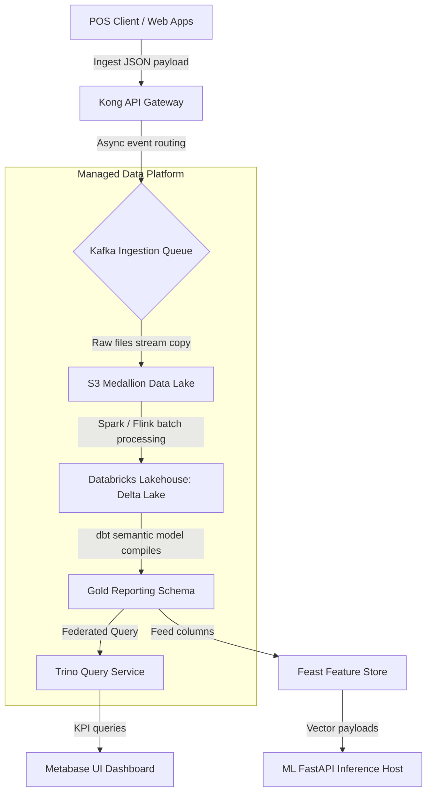
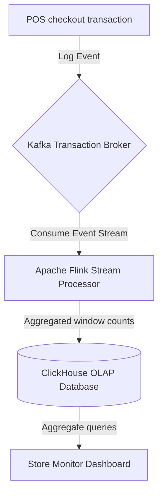
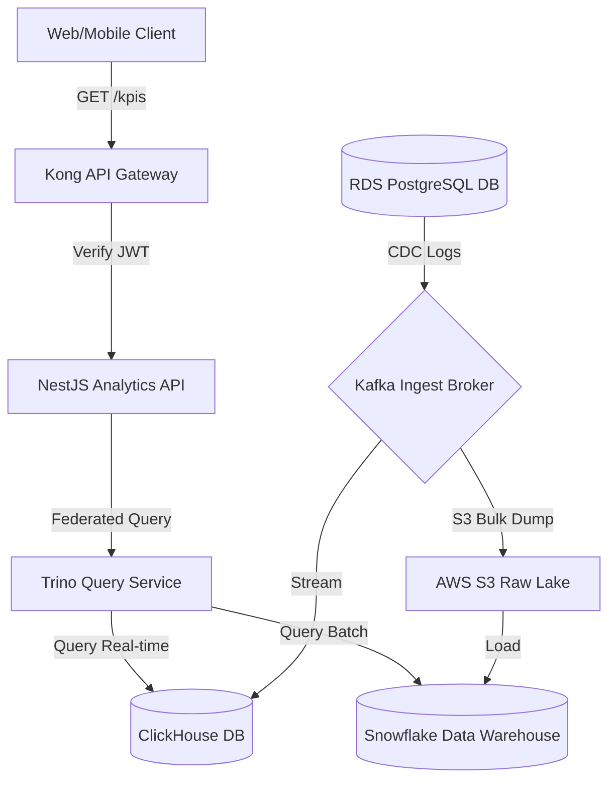
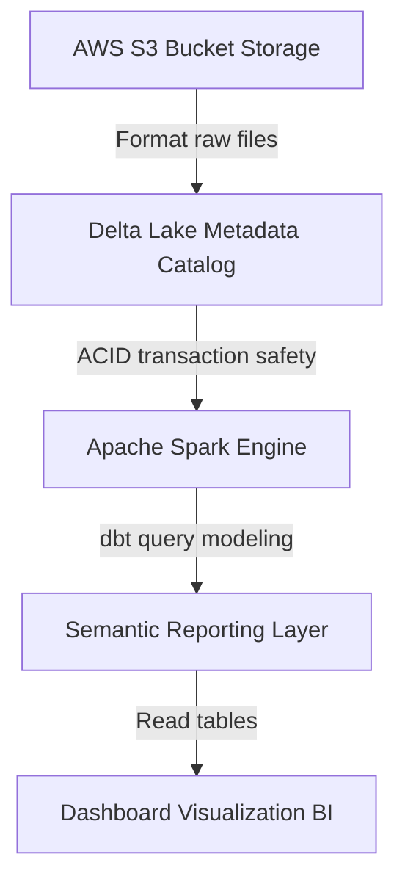
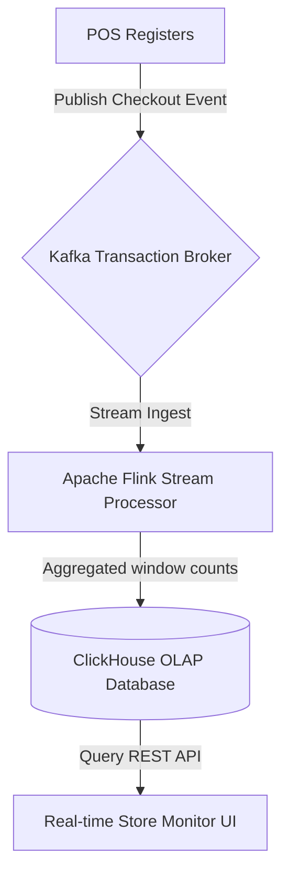
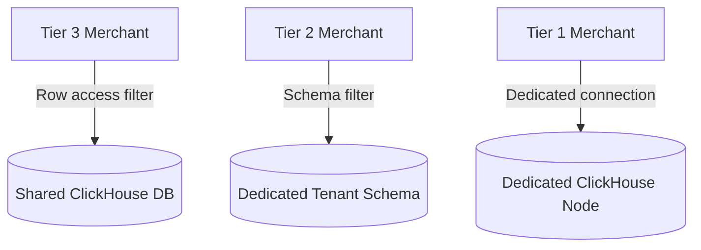

# DATA PLATFORM INFRASTRUCTURE, SCALABILITY & HIGH PERFORMANCE ANALYTICS ARCHITECTURE

**Project Name:** Enterprise SaaS Business Management Platform  
**Document Version:** 1.0.0 — Baseline Standard  
**Date:** July 13, 2026  
**Authors:** Chief Data Architect, Analytics Infrastructure Lead & Cloud Data Engineer  
**Classification:** Enterprise Internal — Unrestricted  
**Status:** 🏛️ APPROVED INFRASTRUCTURE STANDARD  

---

## SECTION 1 — ENTERPRISE DATA PLATFORM EVOLUTION

Our analytics platform structures data capabilities across six evolutionary stages to support growth from single-store dashboards to real-time machine learning predictions:

*   **1. Primary Database Reporting:** Queries run directly against the live transactional database, creating risk of query locks and transaction delays.
*   **2. Read Replica Reporting:** Reads are redirected to a dedicated read-only replica database, isolating reporting traffic from transactional write paths.
*   **3. Cloud Data Warehousing:** Transactional tables are normalized and loaded into a central repository designed for analytical query performance.
*   **4. Data Lake Storage:** Raw JSON payloads, log files, and unstructured objects are stored in low-cost storage layers.
*   **5. Data Lakehouse Architecture:** Combines the file organization and cost advantages of data lakes with the ACID transactions and performance of warehouses.
*   **6. AI Data Platform:** Integrates feature stores and ML inference pipelines to support predictive intelligence.

---

## SECTION 2 — DATA PLATFORM ARCHITECTURE

We partition our data platform into decoupled collection, processing, storage, and visualization layers:



---

## SECTION 3 — DATA LAKEHOUSE ARCHITECTURE

Our platform utilizes a Data Lakehouse model to combine the benefits of structured databases and raw file systems:
*   **Scalability:** Decouples storage costs from query compute costs, storing raw files in low-cost S3 buckets.
*   **Performance:** Accelerates queries using metadata tables, index logs, and optimized file formats.
*   **ACID Transactions:** Prevents data corruption by supporting multi-stage query transactions.
*   **Decoupled Analytics:** Serves both historical BI reports and real-time AI model features from the same storage layer.

---

## SECTION 4 — DATA STORAGE ARCHITECTURE (MEDALLION MODEL)

We organize our Data Lakehouse files into three logical folders based on processing stages:

```
Raw Ingest (Bronze) ──► Cleaned & Formatted (Silver) ──► Business Aggregate (Gold)
```

*   **Bronze Layer (Raw):** Ingests raw database CDC dumps, JSON messages, and log records without modification.
*   **Silver Layer (Cleaned):** Filters developer logs, converts date formats, normalizes schemas, and dedupulates records using Spark jobs.
*   **Gold Layer (Business):** Aggregates cleaned dimensions and facts into dimensional models to populate business-specific data marts.

---

## SECTION 5 — BIG DATA DISTRIBUTED PROCESSING

We scale processing performance by running queries across distributed compute clusters:
*   **Apache Spark:** Used to transform unstructured files and raw JSON logs into cleaned Silver tables.
*   **Apache Flink:** Processes Kafka topics in real time to calculate rolling store performance metrics.
*   **Trino / Presto:** Provides a federated query engine that queries data across S3 lakes, databases, and warehouses using standard SQL.

---

## SECTION 6 — QUERY PERFORMANCE OPTIMIZATION

We implement performance optimizations to keep dashboard query response times fast:
*   **Date Partitioning:** Partition fact tables by tenant ID and transaction date to avoid full table scans.
*   **Materialized Views:** Pre-aggregate daily sales metrics to avoid scanning raw tables on every request.
*   **Columnar Storage:** Store files in columnar formats (like Parquet or ORC) to optimize scan performance.

---

## SECTION 7 — REAL-TIME ANALYTICS INFRASTRUCTURE

We route real-time POS checkouts through a streaming pipeline to update active dashboards:



*   **ClickHouse OLAP:** Used to run fast aggregations on real-time transaction streams.

---

## SECTION 8 — ANALYTICS DATABASE ARCHITECTURE

We compared database architectures to select the optimal engine for our analytical workloads:

### 8.1 Transactional vs. Analytical Databases

| Database Category | Transactional (OLTP) | Real-Time Analytical (ClickHouse) | Cloud Warehouse (Snowflake) |
| :--- | :--- | :--- | :--- |
| **Typical Target** | PostgreSQL | ClickHouse | Snowflake / BigQuery |
| **Storage Layout** | Row-oriented | Column-oriented | Column-oriented |
| **Query Latency** | $\le 10\text{ ms}$ (Single-row writes) | $\le 100\text{ ms}$ (Large aggregations) | $\ge 1\text{ second}$ (Complex batch queries) |
| **Scaling Target** | Scale up (CPU / Memory) | Scale out (Compute cluster) | Scale out (Decoupled auto-scaling) |

**Decision:** Use **PostgreSQL** for live transactional writes, **ClickHouse** for real-time dashboard metrics, and **Snowflake** for historical batch analysis.

---

## SECTION 9 — MULTI-TENANT ANALYTICS SCALABILITY

We scale query performance across different tenant tiers using resource isolation rules:

### 9.1 Tenant Scaling Tiers

*   **Tier 3 (Small Tenants):** Share a common analytics database and compute pool, using row-level security (RLS) filters to isolate data.
*   **Tier 2 (Medium Tenants):** Share database instances but write to dedicated schemas with allocated compute resources.
*   **Tier 1 (Large Tenants):** Deployed on dedicated database instances with isolated compute pools to guarantee query performance.

---

## SECTION 10 — CLOUD DATA ARCHITECTURE

We leverage managed cloud resources to build our analytics infrastructure:
*   **AWS Object Storage:** AWS S3 serves as our raw data lake and backup repository.
*   **AWS EMR Compute:** Spark and Flink clusters scale compute nodes automatically based on pipeline loads.
*   **Snowflake Warehouse:** Manages historical data, automatically pausing compute resources during periods of inactivity to control costs.

---

## SECTION 11 — DATA PLATFORM HIGH AVAILABILITY

*   **Multi-Region Replication:** Replicate S3 buckets and Snowflake databases across multiple availability zones to protect data against cloud region failures.
*   **Failover Policies:** Configure ClickHouse clusters with active replica pools to automate database failovers during host failures.

---

## SECTION 12 — DATA PLATFORM SECURITY

*   **Network Isolation:** Host data warehouses and processing clusters inside private subnets, blocking direct inbound internet routes.
*   **IAM Policies:** Restrict bucket and database access using IAM roles to ensure only authorized service accounts can write data.

---

## SECTION 13 — COST OPTIMIZATION STRATEGY

To manage cloud hosting costs as data volumes scale, we implement cost optimization rules:
*   **Storage Tiering:** Move raw S3 objects from Standard storage to Intelligent-Tiering and Glacier classes after 30 days.
*   **Auto-Pause Warehouses:** Configure Snowflake clusters to pause compute nodes automatically after 5 minutes of query inactivity.
*   **Data Compression:** Compress Parquet files using Snappy compression to minimize storage footprints.

---

## SECTION 14 — DATA PLATFORM MONITORING

*   **Infrastructure Metrics:** Monitor CPU load, memory usage, and network traffic across compute nodes using Prometheus and Grafana dashboards.
*   **Data Freshness Alerts:** Alert on-call teams if batch pipelines fail to update reporting tables within scheduled SLAs.

---

## SECTION 15 — DATAOPS DEVELOPMENT PIPELINES

*   **Version Controlled Schemas:** Manage database schemas and dbt models in Git repositories.
*   **CI/CD Code Validations:** Run automated dbt compile tests and schema check validations on pull requests before deploying changes to production.

---

## SECTION 16 — DATA PLATFORM TOOL STACK REFERENCE

Our standardized data platform tools are detailed in the table below:

| Category | Selected Tool | Purpose |
| :--- | :--- | :--- |
| **Big Data Engine** | **Apache Spark** | Distributed processing engine for large-scale ETL jobs. |
| **Log Collector** | **Apache Kafka** | Distributed message queue for transaction event streams. |
| **Stream Engine** | **Apache Flink** | Processes transactional event streams in real time. |
| **Federated Query** | **Trino / Presto** | Executes SQL queries across distributed database engines. |
| **Real-Time OLAP** | **ClickHouse** | Columnar database designed for fast analytics queries. |
| **Cloud Warehouse** | **Snowflake** | High-performance analytical data warehouse with decoupled compute scaling. |
| **Lakehouse Store** | **Databricks Delta Lake** | Extends data lakes with ACID transactions and metadata tables. |

---

## SECTION 17 — DATA PLATFORM MATURITY MODEL

Our data infrastructure scales along a defined maturity curve:
*   **Level 1 (Database Reporting):** Run reporting queries directly on transactional databases.
*   **Level 2 (Data Warehouse):** Load data into a central warehouse and query tables using star schemas.
*   **Level 3 (Enterprise Analytics):** Deploy a dedicated data lakehouse to store both structured and semi-structured data.
*   **Level 4 (Real-Time Platform):** Process transactions in real time using Debezium CDC and ClickHouse databases.
*   **Level 5 (AI Data Platform):** Automate data pipeline runs and use machine learning models to forecast demand.

---

## SECTION 18 — DATA PLATFORM IMPLEMENTATION ROADMAP

We deploy data infrastructure capabilities across five phases:
*   **Phase 1 (Analytics Database):** Deploy read replica databases to isolate reporting queries.
*   **Phase 2 (Data Warehouse):** Deploy Snowflake warehouses and transform tables using dbt.
*   **Phase 3 (Streaming Platform):** Deploy Kafka brokers and Flink processors to ingest real-time transactions.
*   **Phase 4 (Lakehouse):** Build Delta Lake layers to unify data lake and data warehouse storage.
*   **Phase 5 (AI Data Platform):** Integrate feature stores and deploy ML prediction services to production.

---

## SECTION 19 — FINAL DATA PLATFORM MERMAID DIAGRAMS

### 19.1 Enterprise Data Platform Architecture


### 19.2 Lakehouse Architecture


### 19.3 Big Data Processing Flow
```
[ Raw S3 Logs ] ──► [ Apache Spark EMR ] ──► [ Parquet File Format ] ──► [ Trino Federated Engine ] ──► [ BI Dashboard ]
```

### 19.4 Real-Time Analytics Pipeline


### 19.5 Multi-Tenant Analytics Scaling


---

*End of Data Platform Infrastructure, Scalability & High Performance Analytics Architecture*  
*Document maintained by: Chief Data Officer (CDO) | Status: Approved Infrastructure Standard*
