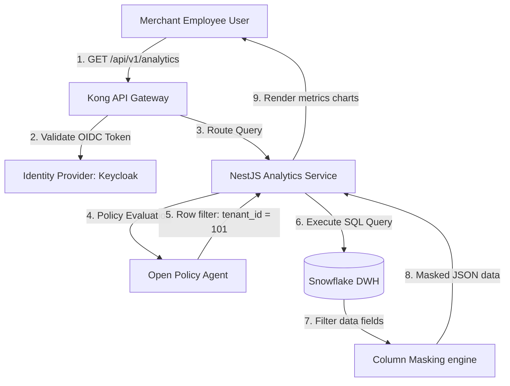
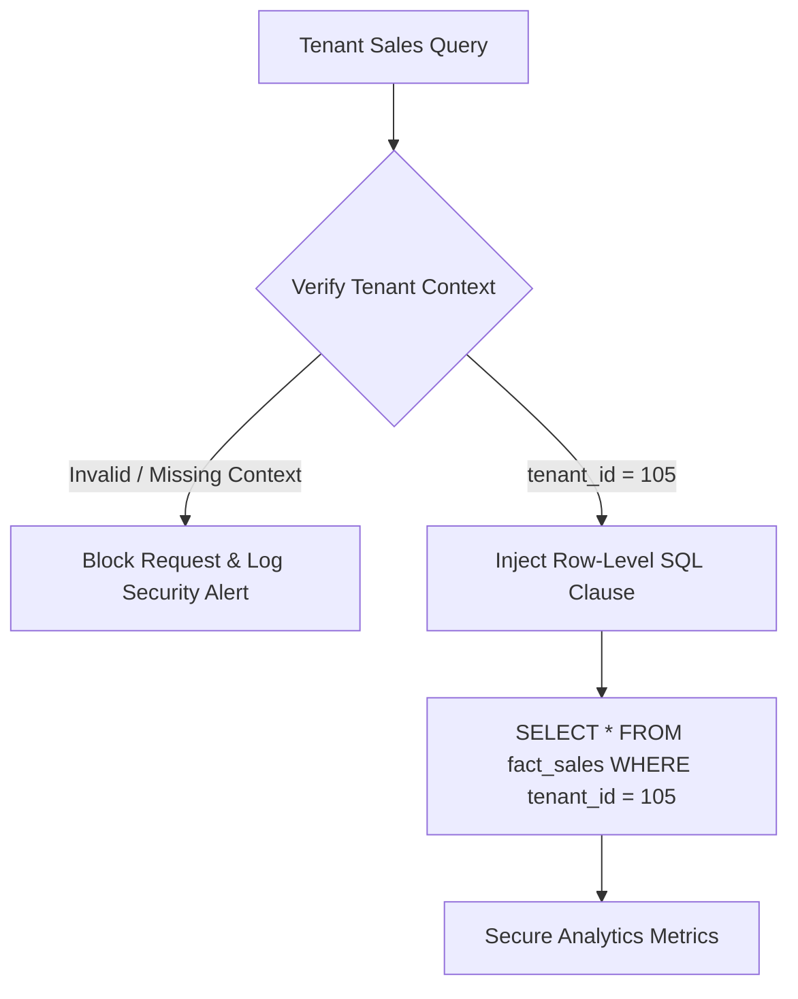
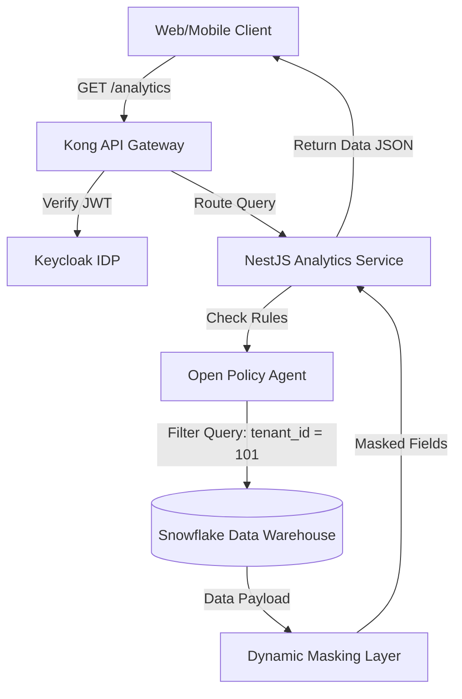
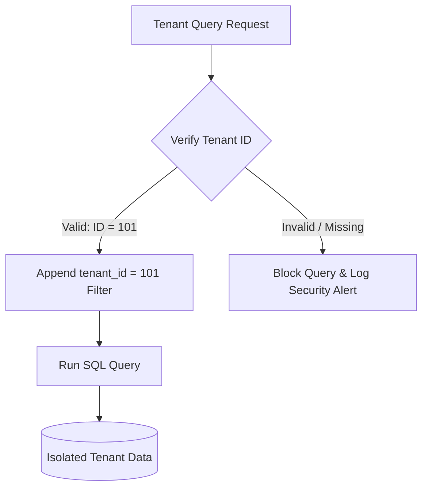
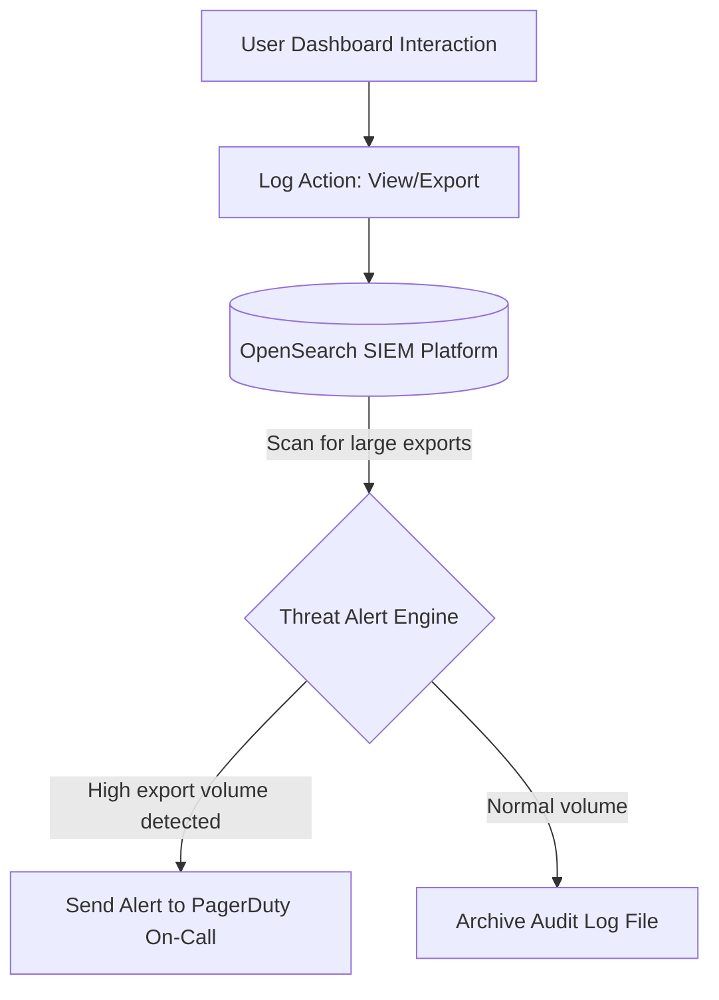

# DATA ANALYTICS SECURITY, PRIVACY & COMPLIANCE ARCHITECTURE

**Project Name:** Enterprise SaaS Business Management Platform  
**Document Version:** 1.0.0 — Baseline Standard  
**Date:** July 13, 2026  
**Authors:** Chief Data Security Officer (CDSO), Data Privacy Architect & Compliance Specialist  
**Classification:** Enterprise Internal — Unrestricted  
**Status:** 🏛️ APPROVED ANALYTICS SECURITY STANDARD  

---

## SECTION 1 — ANALYTICS SECURITY FOUNDATION

### 1.1 Scope of Protection
Our analytics security architecture secures all components of the analytics environment:

```
Analytical Data ──► Dashboard Users ──► Generated Reports ──► Machine Learning Models
```

### 1.2 Core Security Objectives
*   **Confidentiality:** Verify that only authorized users with verified tenant roles can view business dashboards and reports.
*   **Integrity:** Secure data pipelines against modification to ensure reports are accurate.
*   **Availability:** Implement redundant query engines and automated failover pipelines to keep dashboards accessible.

---

## SECTION 2 — ANALYTICS SECURITY ARCHITECTURE

Our analytics platform isolates query compilation and user authentication tasks from live data resources:



---

## SECTION 3 — BI ACCESS CONTROL

*   **Role-Based Access Control (RBAC):** We assign reporting access rights to predefined user roles:
    *   *Platform Administrator:* Can view system usage reports across all tenant workspaces.
    *   *Business Owner:* Can view financial, executive, inventory, and employee metrics for their tenant workspace.
    *   *Store Manager:* Can view sales, inventory, and employee attendance metrics for their branch location.
    *   *Cashier Employee:* Can view only their personal transaction history and check-in logs.
*   **Attribute-Based Access Control (ABAC):** Evaluate user attributes (such as IP addresses and device health indicators) before authorizing data export requests.
*   **Least Privilege:** Configure user accounts with the minimum necessary access rights. For example, cashiers are blocked from accessing executive or accounting dashboards by default.

---

## SECTION 4 — DASHBOARD & REPORT SECURITY

We implement granular access permissions across all platform dashboards:
*   **Executive Dashboard:** Access restricted to Business Owners and CFO roles; sharing dashboard access links is blocked.
*   **Finance Dashboard:** Access restricted to Business Owners and Finance Staff; PDF exports require manager approval.
*   **Inventory Dashboard:** Access granted to Store Managers and Stock Clerks; sharing export data requires MFA validation.
*   **Customer Dashboard:** Access granted to Store Managers and CRM Marketing roles; customer contact emails are masked.

---

## SECTION 5 — MULTI-TENANT ANALYTICS SECURITY

To prevent cross-tenant data leaks, we implement tenant isolation rules throughout the analytics stack:



*   **Enforcement:** Enforce row-level security (RLS) on database tables using `tenant_id` columns, preventing users from querying other tenants' data.

---

## SECTION 6 — DATA WAREHOUSE SECURITY

We secure database tables, views, columns, and rows inside our cloud data warehouse:
*   **Row-Level Security (RLS):** Filter all database queries using tenant IDs.
*   **Column-Level Security (CLS):** Mask columns containing personally identifiable information (PII) to hide them from users without decryption permissions.
*   **Storage Encryption:** Encrypt all warehouse tables at rest using AES-256 keys, and encrypt queries in transit using TLS 1.3.

---

## SECTION 7 — DATA LAKE SECURITY

*   **Storage Permissions:** Restrict access to S3 data lake storage buckets using IAM policies, blocking public read routes.
*   **Encryption:** Encrypt raw S3 data lake buckets using AWS KMS keys.
*   **Classification:** Tag all S3 buckets and files by sensitivity level (e.g., `Confidential-PII` or `Internal-Sales`) to automate access policies.

---

## SECTION 8 — DATA MASKING & ANONYMIZATION

We mask personally identifiable information (PII) before loading data into analytics and model training environments:
*   **Masking:** Replace sensitive customer details (like names and phone numbers) with mask characters (e.g., `Jo** Do*` or `+1-***-***-1234`).
*   **Tokenization:** Replace sensitive data elements (like credit card numbers) with random reference tokens.
*   **Anonymization:** Strip all identifying attributes from data exports to make customer tracking impossible.

---

## SECTION 9 — DATA PRIVACY CONTROLS

To comply with global data privacy regulations (such as GDPR), we implement standard privacy workflows:
*   **Consent Management:** Store and track customer preferences for promotional data processing.
*   **Data Minimization:** Load only the minimal required dataset into analytics environments. For example, we exclude customer addresses from sales trends analysis.
*   **Data Deletion:** Automatically purge customer analytics records from S3 staging lakes 30 days after account deletion.

---

## SECTION 10 — ANALYTICS API SECURITY

*   **Authentication:** Require valid JWT tokens for all analytical endpoint requests.
*   **Authorization:** Validate role scopes before executing backend SQL queries.
*   **Rate Limiting:** Throttle analytical endpoints to prevent denial-of-service (DoS) attacks from long-running database queries.
*   **Query Validation:** Sanitize API parameters to prevent SQL injection attempts through custom filters.

---

## SECTION 11 — AI SYSTEM DATA SECURITY

We secure machine learning datasets and pipelines against data poisoning and reverse-engineering:
*   **Dataset Access Controls:** Restrict model training datasets to authorized data science roles.
*   **Model Theft Protections:** Limit the precision of API outputs (e.g., probability values) to prevent attackers from reverse-engineering model weights.
*   **Privacy Preservation:** Train models using anonymized training datasets to prevent models from memorizing sensitive client data.

---

## SECTION 12 — DATA EXPORT SECURITY

We monitor and control all data export requests to prevent data leaks:
*   **Watermarking:** Automatically embed invisible digital watermarks in PDF, Excel, and CSV file exports to trace data leaks back to the exporting user account.
*   **Expiration Links:** Host exported files on S3 buckets using pre-signed URLs that expire after 1 hour.
*   **Download Tracking:** Log all download events to security monitoring consoles.

---

## SECTION 13 — ANALYTICS AUDIT LOGGING

We log all user dashboard interactions and query events to security logs to maintain compliance trails:

### 13.1 Analytics Audit Log Schema

| Field Name | Log Value | Purpose |
| :--- | :--- | :--- |
| `timestamp` | `2026-07-13T20:26:47Z` | Precise event time. |
| `user_id` | `usr_9812470124` | Identifier of the user triggering the event. |
| `tenant_id` | `tenant_109` | Tenant workspace identifier. |
| `action` | `EXPORT_REPORT` | Event category classification. |
| `target_dataset` | `dim_customer_loyalty` | Table or view accessed. |
| `format` | `PDF` | File export format. |
| `ip_address` | `198.51.100.42` | User IP address for origin tracking. |

---

## SECTION 14 — SECURITY MONITORING

We scan analytics logs to identify and alert on potential security incidents:
*   **Monitored Events:** High-volume data exports, queries run outside of business hours, and multiple failed access attempts.
*   **Tooling:** Forward security logs to centralized SIEM platforms (like OpenSearch or Splunk) to run automated threat alerts.

---

## SECTION 15 — COMPLIANCE ALIGNMENT

We map our analytics security controls to global security and privacy compliance standards:

*   **GDPR:** Support customer data erasure requests and mask personal fields.
*   **ISO 27001:** Enforce access control, logging, and data classification policies across all warehouse resources.
*   **SOC 2:** Audit analytics database access logs and API authentications quarterly.
*   **PCI DSS:** Mask credit card numbers and primary account numbers (PAN) before loading data into analytics databases.

---

## SECTION 16 — ANALYTICS SECURITY TOOL STACK REFERENCE

Our standardized security tools are detailed in the table below:

| Category | Selected Tool | Purpose |
| :--- | :--- | :--- |
| **Data Access Controller**| **Apache Ranger** | Manages security policies for Hadoop, Spark, and Trino clusters. |
| **AWS Security** | **AWS Lake Formation**| Manages permissions for AWS S3 and EMR analytics pipelines. |
| **Lakehouse Security** | **Databricks Security** | Secures SQL workspaces and manages row-level access policies. |
| **Access Orchestrator** | **Immuta / Collibra** | Manages data classification, data masking, and RLS policies. |
| **SIEM Platform** | **OpenSearch SIEM** | Analyzes audit logs to identify potential security incidents. |

---

## SECTION 17 — ANALYTICS SECURITY MATURITY MODEL

Our analytics security capabilities scale along a defined maturity curve:
*   **Level 1 (Basic Report Access):** Authenticate dashboard access using shared login credentials.
*   **Level 2 (Controlled Access):** Authenticate dashboard access using individual user roles and SSO systems.
*   **Level 3 (Governed Analytics):** Enforce data masking on PII columns and filter database queries using tenant IDs.
*   **Level 4 (Automated Security):** Monitor database query logs in real time to alert on suspicious data exports.
*   **Level 5 (Zero Trust Analytics):** Require device health checks and MFA validation for all database queries and data exports.

---

## SECTION 18 — SECURITY IMPLEMENTATION ROADMAP

We deploy analytics security capabilities across five phases:
*   **Phase 1 (Access Control):** Configure dashboard RBAC roles and integrate SSO authentications.
*   **Phase 2 (Data Protection):** Enforce storage encryption at rest and in transit.
*   **Phase 3 (Privacy Controls):** Implement data masking on customer PII fields.
*   **Phase 4 (Compliance):** Enforce data deletion workflows and audit access logs to verify compliance.
*   **Phase 5 (Continuous Monitoring):** Forward database access logs to SIEM systems to run automated threat alerts.

---

## SECTION 19 — FINAL ANALYTICS SECURITY MERMAID DIAGRAMS

### 19.1 Analytics Security Architecture


### 19.2 BI Access Control Flow
```
[ User Logs In ] ──► [ Verify Keycloak Role ] ──► [ Check Dashboard Permissions ] ──► [ Render Dashboard UI ]
```

### 19.3 Multi-Tenant Analytics Isolation


### 19.4 Data Masking Flow
```
[ Raw DB Email ] ──► [ Verify User Permissions ] ──► [ Mask Email: u***@domain.com ] ──► [ Display Masked Email ]
```

### 19.5 Analytics Audit Monitoring


---

## SECTION 20 — PHASE 11 SUMMARY

Phase 11 documents define the analytics capabilities, data processing pipelines, and data governance frameworks for our multi-tenant SaaS platform:

*   **11.1 — Business Intelligence Foundation:** Establishes the platform's core analytics architecture, defining how transactional data is aggregated to support business reporting dashboards.
*   **11.2 — Data Warehouse & Data Modeling Architecture:** Defines the dimensional data model schemas (facts and dimensions) designed to support multi-tenant business intelligence queries.
*   **11.3 — ETL/ELT Data Pipeline Architecture:** Outlines the batch and real-time data pipelines (using Kafka, Flink, and dbt) that clean, validate, and load transaction data into analytics databases.
*   **11.4 — Analytics Dashboard & KPI Architecture:** Details the user interface designs, reporting microservices, and metrics metrics (like MRR, ARR, and LTV) that populate client dashboards.
*   **11.5 — AI Analytics & Predictive Intelligence Foundation:** Defines the machine learning platform (using Feast, MLflow, and Prophet) that serves demand forecasting and fraud detection metrics.
*   **11.6 — Data Governance & Master Data Management:** Establishes data quality validations, catalog metadata directories, data lineage charts, and master data de-duplication rules.
*   **11.7 — Data Platform Infrastructure & Scalability:** Specifies big data processing infrastructures (using Spark clusters, ClickHouse databases, and Trino query engines) designed to scale as data volumes grow.
*   **11.8 — Data Analytics Security & Compliance:** Establishes access controls (RBAC/ABAC), row-level isolation rules, dynamic PII masking, data export validations, and audit logs to protect analytical data.

---

*End of Data Analytics Security, Privacy & Compliance Architecture*  
*Document maintained by: Chief Data Security Officer (CDO) | Status: Approved Analytics Security Standard*
