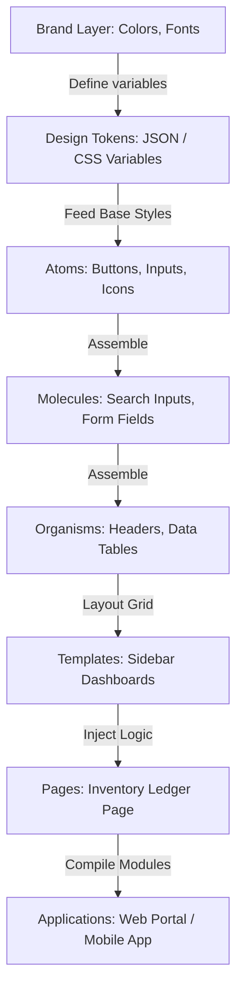
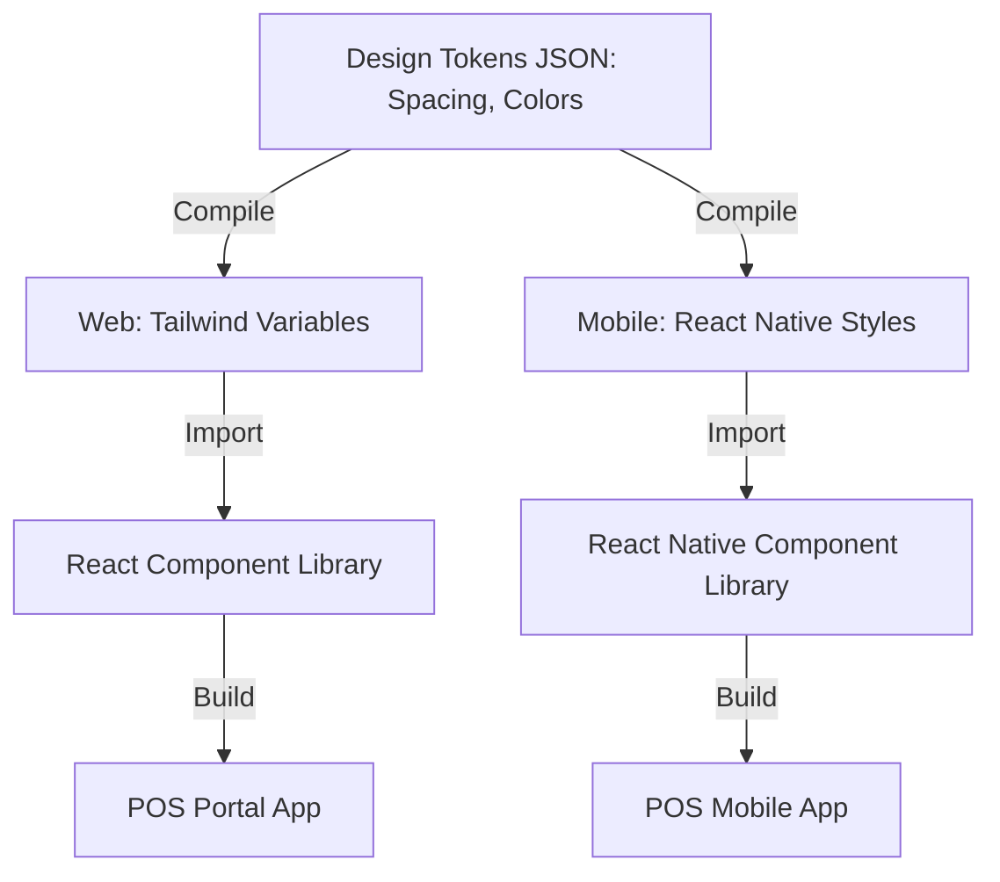
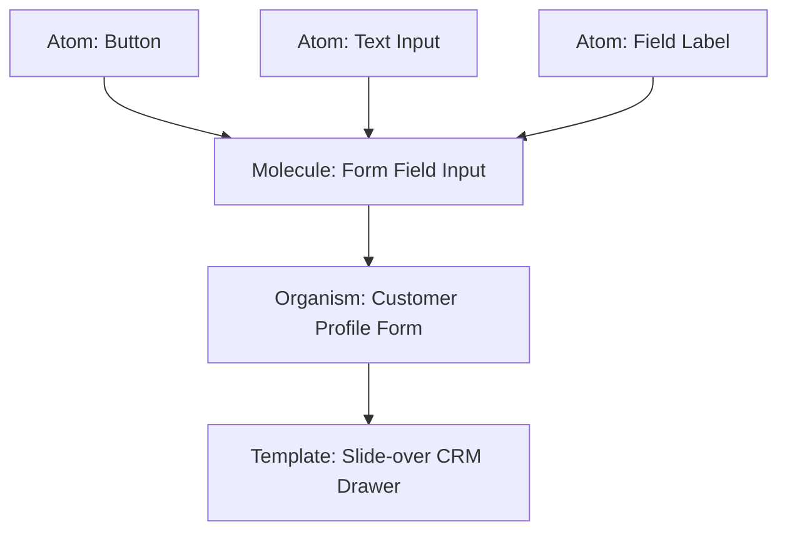
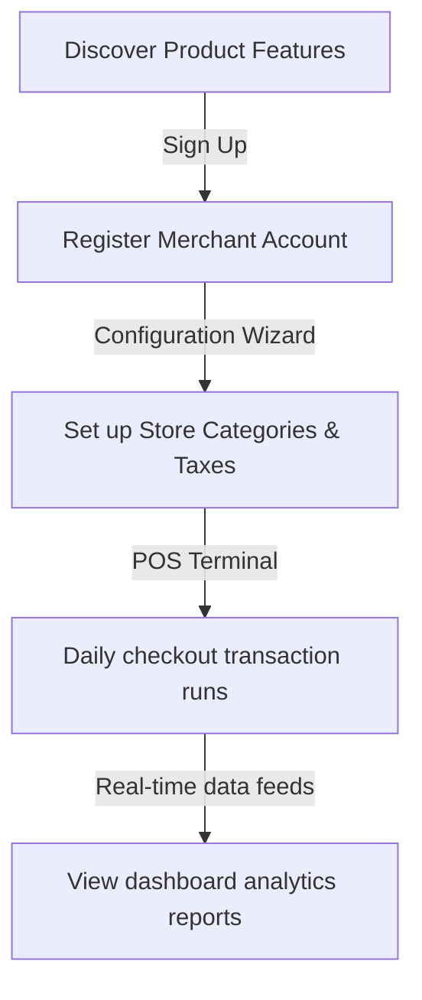
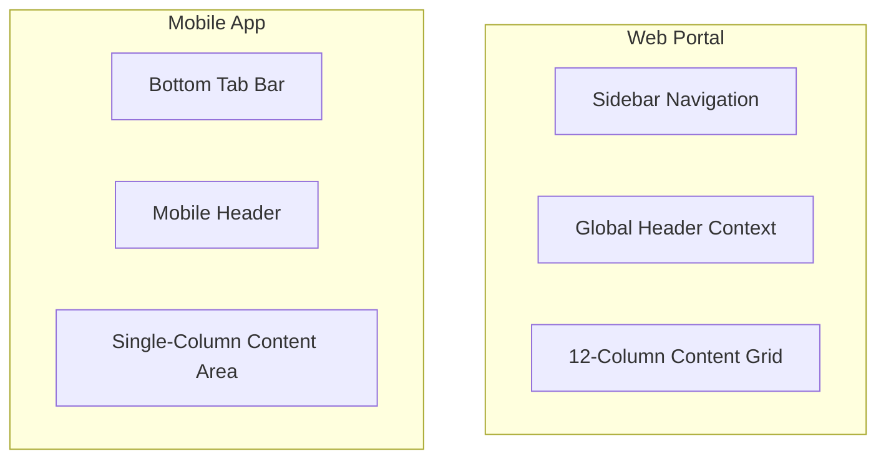

# UX ARCHITECTURE & DESIGN SYSTEM FOUNDATION

**Project Name:** Enterprise SaaS Business Management Platform  
**Document Version:** 1.0.0 — Baseline Standard  
**Date:** July 13, 2026  
**Authors:** Chief Product Officer (CPO), Senior UX Architect & Design System Engineer  
**Classification:** Enterprise Internal — Unrestricted  
**Status:** 🏛️ APPROVED DESIGN SYSTEM STANDARD  

---

## SECTION 1 — UX DESIGN PRINCIPLES

### 1.1 Core Interaction Design Model
We design user interfaces to minimize cognitive load, aiming for predictable interaction flows:

```
User Intent ──► Simple Visual Clue ──► Consistent Reaction ──► Successful Task Completion
```

### 1.2 Enterprise SaaS UX Pillars
*   **Simplicity:** Simplify complex operations (like accounting entries and stock reconciliation) into step-by-step guided workflows.
*   **Consistency:** Maintain uniform navigation panels, layouts, and components across POS, CRM, HR, and Inventory modules.
*   **Scalability:** Design modular components that can accommodate new store types or custom modules without redesigns.
*   **Accessibility:** Design interfaces that meet WCAG 2.2 AA standards, ensuring accessibility for all store employees.
*   **Productivity:** Optimize layouts to prioritize fast keyboard-only POS transactions and bulk data entries.

---

## SECTION 2 — PRODUCT EXPERIENCE STRATEGY

### 2.1 Customer Journey Maps
We define and support the key stages of a merchant's lifecycle on the platform:

```
Discover Portal ──► Register Store ──► Config Branches ──► Daily POS Run ──► View Analytics ──► Expand Business
```

### 2.2 Merchant Experience Map

| Journey Stage | User Actions | Technical Support | UX Goal |
| :--- | :--- | :--- | :--- |
| **1. Discover** | Browse subscription features. | Public Next.js static pages. | Simple feature comparisons. |
| **2. Register** | Create administrator account. | Multi-tenant tenant database setup. | Clean signup form design. |
| **3. Setup** | Import product listings and SKU catalog. | CSV import tools and API. | Auto-mapped columns. |
| **4. Daily Run** | Process customer checkout payments. | High-speed React Native POS app. | Offline transaction support. |
| **5. Analyze** | Check store profit margins. | Real-time Snowflake dashboard. | Quick data filter controls. |
| **6. Expand** | Add store branch location. | Multi-branch routing engines. | Shared inventory catalogs. |

---

## SECTION 3 — DESIGN SYSTEM ARCHITECTURE

Our design system isolates token values and UI components from application business logic:



---

## SECTION 4 — DESIGN TOKENS SYSTEM

Design tokens are the visual atoms of our design system. We store color, spacing, and typography values in a central JSON repository, compile them into CSS variables, and distribute them to React and React Native apps.
*   **Benefits:** Ensures visual consistency across platforms and supports automated light/dark mode themes.

---

## SECTION 5 — COLOR SYSTEM

We define semantic colors across light and dark modes to maintain clear visual hierarchies and meet WCAG contrast guidelines:

### 5.1 Color Tokens Specification

| Color Variable | Light Mode Value | Dark Mode Value | Contrast Ratio (WCAG) | Business Purpose |
| :--- | :--- | :--- | :--- | :--- |
| `--color-primary` | `#0F172A` (Slate 900)| `#F8FAFC` (Slate 50) | $\ge 7:1$ | Header menus, primary call-to-actions. |
| `--color-success` | `#15803D` (Green 700)| `#4ADE80` (Green 400)| $\ge 4.5:1$ | Paid invoices, stock replenishment confirmation. |
| `--color-warning` | `#B45309` (Amber 700)| `#FBBF24` (Amber 400)| $\ge 4.5:1$ | Reorder warnings, pending approvals. |
| `--color-error` | `#B91C1C` (Red 700) | `#F87171` (Red 400) | $\ge 4.5:1$ | Out of stock alerts, failed card charges. |
| `--color-bg-base` | `#F8FAFC` (Slate 50) | `#020617` (Slate 950)| N/A | App canvas background color. |
| `--color-surface` | `#FFFFFF` | `#0F172A` (Slate 900)| N/A | Card components, input forms. |
| `--color-text` | `#1E293B` (Slate 800)| `#E2E8F0` (Slate 200)| $\ge 7:1$ | Standard paragraph and table body text. |

---

## SECTION 6 — TYPOGRAPHY SYSTEM

We use clean, legible typefaces across web and mobile layouts:
*   **Font Family:** Inter (primary sans-serif) for web portals, System Default for mobile interfaces.
*   **Scale Rules:** Heading styles (`h1`-`h4`) emphasize section headers, while monospace layouts display financial tables.

### 6.1 Typography Scale Reference

| Token Name | Font Size (rem / px) | Line Height | Font Weight | Platform Target |
| :--- | :--- | :--- | :--- | :--- |
| `font-size-h1` | `2.25rem` / `36px` | `1.2` | Bold (`700`) | Web (Main titles) |
| `font-size-h3` | `1.5rem` / `24px` | `1.3` | Semi-Bold (`600`) | Web / Tablet (Section headers) |
| `font-size-body` | `1.0rem` / `16px` | `1.5` | Regular (`400`) | Web / Mobile (Standard copy) |
| `font-size-table`| `0.875rem` / `14px`| `1.4` | Regular (`400`) | Monospace (Financial tables) |
| `font-size-label`| `0.75rem` / `12px` | `1.2` | Medium (`500`) | Web / Mobile (Caption headers) |

---

## SECTION 7 — ATOMIC COMPONENT LIBRARY

We organize our component library using the Atomic Design framework:
*   **Atoms:** Buttons (`btn`), Text Inputs (`input-text`), Icons, Badge indicators.
*   **Molecules:** Search Inputs (combining text inputs and icon buttons), Form Field labels, Pagination buttons.
*   **Organisms:** Global Navbar components, Data Tables with filters, Modal dialogs.

---

## SECTION 8 — ENTERPRISE UI PATTERNS

We establish standardized layout patterns to ensure a consistent experience across all modules:
*   **Dashboard Grid:** Layout featuring top KPI cards, a central chart area, and a list of recent activities below.
*   **Standardized Data Tables:** Uses uniform top search bars, multi-select filters, paginated results, and export buttons.
*   **Unified Forms:** Standardizes field alignments, inline error styling, and submit/cancel button arrangements.

---

## SECTION 9 — APPLICATION LAYOUT ARCHITECTURE

### 9.1 Responsive Web Portal Structure
```
┌────────────────────────────────────────────────────────┐
│  Sidebar Logo   │  Header: Tenant Workspace / Profile   │
├─────────────────┴──────────────────────────────────────┤
│  Dashboard List │                                      │
│  - POS          │  Main Content Area:                  │
│  - Inventory    │  Responsive Grid Container           │
│  - Accounting   │  (12-column layout)                  │
│  - CRM          │                                      │
│  - HR           │                                      │
└─────────────────┴──────────────────────────────────────┘
```

### 9.2 Mobile Layout Structure
*   **Header Panel:** Displays branch locations and notification icons.
*   **Navigation:** Uses a bottom navigation bar with icons for POS, Inventory, and Analytics screens.

---

## SECTION 10 — NAVIGATION ARCHITECTURE

We restrict navigation menus dynamically based on user roles and tenant scopes:
*   **Owner Views:** Displays full navigation links, including Dashboard, Sales, Accounting, and HR panels.
*   **Staff Views:** Displays a restricted navigation menu containing only POS checkout, Customer lookup, and Personal shifts.

---

## SECTION 11 — CROSS-MODULE UX EXPERIENCE

We require all platform modules (POS, Inventory, Accounting, CRM, HR) to share the same user experience:
*   **Universal Search:** Pressing `CMD/CTRL + K` launches a global search panel to query orders, customers, or SKUs from any module.
*   **Universal Drawer:** Slider menus open from the right edge, maintaining consistency across checkout, order, and employee detail screens.

---

## SECTION 12 — FORM DESIGN SYSTEM

We enforce strict layout rules for data entry forms:
*   **Validation Rules:** Validate inputs on blur events, using red focus rings and helper text for validation errors.
*   **Multi-Step Forms:** Guide users through multi-stage setup tasks (e.g., adding store branches) with step indicators and back buttons.

---

## SECTION 13 — DATA TABLE UX SYSTEM

Our data tables are designed to handle large datasets efficiently:
*   **Pagination:** Load results in batches of 25, 50, or 100 rows.
*   **Freeze Columns:** Freeze row checkbox and actions columns to keep them visible when scrolling table data horizontally.
*   **Bulk Actions:** Allow users to select multiple rows to run bulk actions, like updating categories or deleting records.

---

## SECTION 14 — DASHBOARD UX SYSTEM

*   **KPI Layout:** Place essential KPI metrics cards at the top of the dashboard, showing totals alongside relative growth percentages.
*   **Chart Design:** Align chart keys clearly, using consistent accent colors to represent different metrics (e.g., green for revenue, slate for costs).

---

## SECTION 15 — RESPONSIVE DESIGN SYSTEM

We scale interfaces responsively across standard viewport breakpoints:
*   **Desktop Viewport ($\ge 1280\text{px}$):** Displays full 3-column layouts with persistent navigation sidebars.
*   **Tablet Viewport ($768\text{px}$ to $1279\text{px}$):** Collapses the navigation sidebar into a compact icon menu.
*   **Mobile Viewport ($< 768\text{px}$):** Replaces persistent sidebars with bottom tab bars, rendering content in single-column layouts.

---

## SECTION 16 — ACCESSIBILITY FOUNDATION

We integrate accessibility checks into our development workflows:
*   **Keyboard Support:** Ensure all buttons, forms, and tabs can be focused using keyboard navigation.
*   **Screen Readers:** Label interactive elements with clear `aria-label` attributes to support screen readers.
*   **Focus Ring Indicators:** Highlight active elements with clear focus ring styling when navigating using keyboard commands.

---

## SECTION 17 — DESIGN SYSTEM TOOL STACK REFERENCE

Our standardized UX and front-end tools are detailed in the table below:

| Category | Selected Tool | Purpose |
| :--- | :--- | :--- |
| **Design Canvas** | **Figma** | Design canvas used for UI layout prototypes. |
| **Component Sandbox** | **Storybook** | Sandbox environment for developing and testing UI components. |
| **Web Runtime** | **React / Next.js** | Front-end framework for portal and dashboard applications. |
| **Mobile Runtime** | **React Native** | Cross-platform framework for mobile applications. |
| **Utility CSS** | **Tailwind CSS** | CSS framework for styling web components. |
| **Component Library** | **MUI / Tailwind UI** | Pre-built UI components customized to match our design system. |

---

## SECTION 18 — DESIGN SYSTEM GOVERNANCE

*   **Review Workflows:** Design updates must be reviewed and approved by the UX team before developers write code.
*   **Storybook Validation:** Developers must register new components in Storybook sandbox folders to verify styling and test responsiveness.

---

## SECTION 19 — DESIGN SYSTEM MATURITY MODEL

Our design system capabilities scale along a defined maturity curve:
*   **Level 1 (Individual UI):** Code custom page styles manually, without using shared tokens or components.
*   **Level 2 (Reusable Components):** Standardize common components (like buttons and tables) in shared developer repositories.
*   **Level 3 (Design System):** Integrate design tokens and compile Storybook catalogs to document guidelines.
*   **Level 4 (Design Platform):** Integrate Figma to generate component code directly from design canvases.
*   **Level 5 (AI-Assisted Design):** Automatically generate custom layouts and test compliance using AI agents.

---

## SECTION 20 — FINAL UX ARCHITECTURE MERMAID DIAGRAMS

### 20.1 Enterprise Design System Architecture


### 20.2 Component Hierarchy


### 20.3 User Experience Flow


### 20.4 Application Layout Architecture


### 20.5 Design Governance Process
```
[ Designer mockups ] ──► [ Review design tokens ] ──► [ Develop in Storybook ] ──► [ Verify WCAG ] ──► [ Deploy npm pack ]
```

---

*End of UX Architecture & Design System Foundation*  
*Document maintained by: Chief Product Officer (CPO) | Status: Approved Design System Standard*
