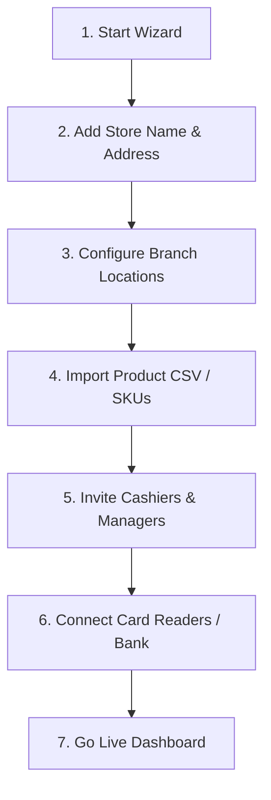
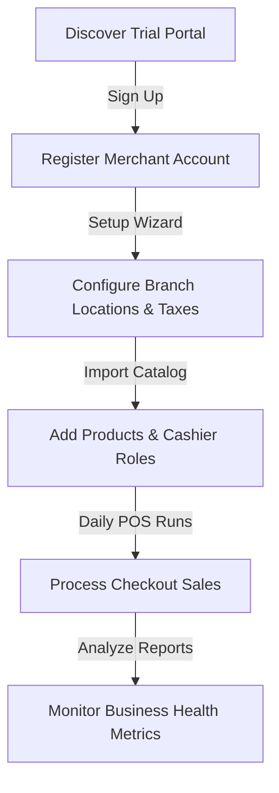
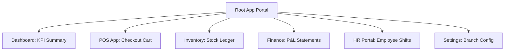
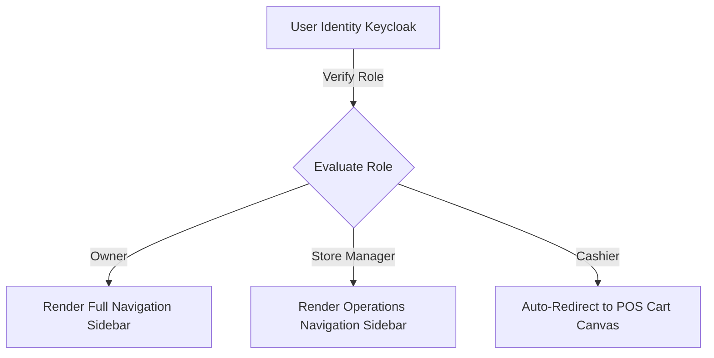
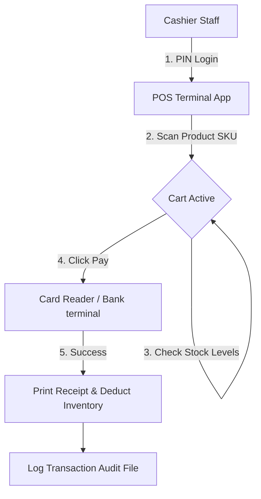

# USER JOURNEY MAPPING & INFORMATION ARCHITECTURE

**Project Name:** Enterprise SaaS Business Management Platform  
**Document Version:** 1.0.0 — Baseline Standard  
**Date:** July 13, 2026  
**Authors:** Chief Product Officer (CPO), UX Research Lead & Information Architect  
**Classification:** Enterprise Internal — Unrestricted  
**Status:** 🏛️ APPROVED UX SPECIFICATION  

---

## SECTION 1 — USER PERSONA ARCHITECTURE

We design our platform interface around four distinct user personas to align UI layouts with specific operational needs and goals:

### 1.1 Persona 1: The Business Owner (Elena — Multi-Branch Franchisee)
*   **Business Goal:** Monitor branch sales performance, manage margins, and audit financial records.
*   **Core Challenge:** Elena has limited time and needs simple, aggregated dashboards to quickly understand store health.
*   **Key UX Requirement:** High-level executive KPI cards with simple comparison metrics and single-click CSV exports.

### 1.2 Persona 2: The Store Manager (Marcus — Operations Manager)
*   **Business Goal:** Manage employee shift schedules, monitor cashier performance, and audit inventory counts.
*   **Core Challenge:** Marcus spends most of his day troubleshooting store issues and requires quick operational control widgets.
*   **Key UX Requirement:** Slide-over detail drawers and bulk-action table controls.

### 1.3 Persona 3: The POS Operator (Aiden — Frontline Staff)
*   **Business Goal:** Process customer checkouts quickly and search product availability.
*   **Core Challenge:** Aiden needs simple, fast workflows to prevent checkout delays during peak hours.
*   **Key UX Requirement:** A large-target touchscreen POS interface with full keyboard shortcut support.

### 1.4 Persona 4: The Platform Administrator (Devon — SaaS Superadmin)
*   **Business Goal:** Monitor tenant registrations, manage subscription billings, and review system audit logs.
*   **Core Challenge:** Devon needs a secure, clear view of all tenant environments to audit permissions and troubleshoot configurations.
*   **Key UX Requirement:** A secure admin portal with tenant search filters and audit trail tables.

---

## SECTION 2 — USER GOAL MAPPING

We map user objectives directly to platform components to ensure features support user goals:

### 2.1 Persona Goal Mapping Matrix

| User Role | User Objective | Platform Feature | Expected Outcome |
| :--- | :--- | :--- | :--- |
| **Business Owner** | Understand daily store revenues. | Executive Analytics Dashboard | Fast business decisions. |
| **Store Manager** | Monitor low inventory items. | Auto-Replenishment Alert | Prevent out-of-stock events. |
| **POS Operator** | Complete checkouts in under 30 seconds.| Touch-Optimized POS Layout | Reduced checkout queues. |
| **Superadmin** | Audit user login history. | Security System Access Logs | Fast compliance validation. |

---

## SECTION 3 — CUSTOMER ONBOARDING JOURNEY

Our onboarding flow is designed to guide new merchants from registration to their first live transaction:

```
Landing Page ──► Register Account ──► Setup Wizard ──► Industry Select ──► Configure Rules ──► Go Live
```

*   **1. Discover Landing Page:** Features simple pricing tables and trial signup forms.
*   **2. Register Account:** Creates the tenant workspace database and administrator login.
*   **3. Setup Wizard:** Automatically launches upon first login, guiding users through basic store configurations.
*   **4. Select Industry:** Customizes dashboard defaults based on business type (e.g., POS layouts for retail, table maps for restaurants).
*   **5. Configure Settings:** Configures tax rules, store currencies, and active payment methods.
*   **6. Invite Employees:** Emails registration links to cashiers and store managers.
*   **7. Go Live:** Redirects the administrator to the main dashboard, offering sample data to explore dashboard features.

---

## SECTION 4 — BUSINESS SETUP EXPERIENCE

Our setup wizard guides owners through configuring their store branch locations:



---

## SECTION 5 — DAILY OPERATION JOURNEY

We design daily workflows around specific store tasks:

### 5.1 Industry Operational Paths

```
Cashier Shift Start ──► POS App Login ──► Ingest Order ──► Swipe Card Payment ──► Print POS Receipt
```

*   **Restaurant Operations:** Cashier reviews active dining tables $\rightarrow$ assigns table order $\rightarrow$ routes ticket to kitchen monitor $\rightarrow$ prints final guest bill.
*   **Coffee Shop Operations:** Barista logs in to POS $\rightarrow$ enters custom drink orders $\rightarrow$ accepts card payment $\rightarrow$ sends order to barista display.
*   **Retail Operations:** Staff scans product barcodes $\rightarrow$ POS automatically applies discounts $\rightarrow$ customer swiping card $\rightarrow$ updates inventory levels.

---

## SECTION 6 — INFORMATION ARCHITECTURE

Our information architecture organizes data across logical nodes to help users locate features:

```
[ Root App Portal ]
   ├── [ Dashboard Console ] ───► (KPI Cards, Growth Trends, Recent Alerts)
   ├── [ POS Terminal ] ────────► (New Sale, Table Map, Customer Search)
   ├── [ Inventory Catalog ] ───► (Products, SKU Stocks, Suppliers, Purchase Orders)
   ├── [ Finance Ledger ] ──────► (Invoices, Expenses, Tax Reports, P&L Statements)
   ├── [ CRM Profiles ] ────────► (Customers, Loyalty Tiers, History Logs)
   ├── [ HR Management ] ───────► (Employee Profiles, Shifts, Attendance Logs)
   └── [ Portal Settings ] ─────► (Tax Configurations, Integrations, Tenant Profile)
```

---

## SECTION 7 — NAVIGATION ARCHITECTURE

*   **Web Navigation (Sidebar):** Displays a persistent sidebar containing main module links. Includes a global header showing selected branch locations, notifications, and user profiles.
*   **Mobile Navigation (Bottom Bar):** Houses top-level links for POS transactions, inventory lookups, activity feeds, and settings menus.

---

## SECTION 8 — ROLE-BASED UX EXPERIENCES

Our navigation dynamically adapts to user permissions:
*   **Owner Home views:** Displays full access menus, highlighting financial KPIs and multi-branch comparison charts.
*   **Manager Home views:** Displays store operations menus, highlighting employee shift changes and low-stock alerts.
*   **Staff Home views:** Opens the POS terminal app automatically, blocking access to administrative setting links.

---

## SECTION 9 — MODULE EXPERIENCE MAP

We map user flows across business modules to maintain interaction consistency:

### 9.1 Module Action Flows

| Module Name | Targeted User | Primary Action | UX Workflow |
| :--- | :--- | :--- | :--- |
| **POS Checkout** | Cashier Operator | Complete sale. | Scan items $\rightarrow$ Review cart $\rightarrow$ Accept payment $\rightarrow$ Print receipt. |
| **Inventory** | Stock Clerk | Replenish safety stock. | Open alert $\rightarrow$ Create purchase order $\rightarrow$ Email supplier. |
| **Accounting** | Finance Accountant | Reconcile bank ledger. | Select bank feed $\rightarrow$ Match transaction $\rightarrow$ Log ledger. |
| **CRM Loyalty** | Store Manager | Register customer. | Open modal $\rightarrow$ Input contact details $\rightarrow$ Assign loyalty tier. |

---

## SECTION 10 — USER FLOW SCHEMATICS

### 10.1 POS Order Flow
```
[ Open Cart Canvas ] ──► [ Scan SKU Barcode ] ──► [ Apply Coupon ] ──► [ Click Card Pay ] ──► [ Print Receipt ]
```

### 10.2 Inventory Replenishment Flow
```
[ View Low Stock ] ──► [ Select Product ] ──► [ Populate Supplier PO ] ──► [ Send Email ] ──► [ Await Delivery ]
```

---

## SECTION 11 — SEARCH EXPERIENCE

Our search system allows users to find data assets quickly from any page:
*   **Figma Global Command Panel:** Pressing `CMD/CTRL + K` launches a global query console.
*   **Action Search:** Users can search and run commands directly (e.g., typing "Create Invoice" redirects the user to the invoice page).
*   **Suggestions:** Shows search results dynamically as the user types.

---

## SECTION 12 — NOTIFICATION EXPERIENCE

We classify notifications by severity level to control alert priority:
*   **System Alerts (High Priority):** Displays database connectivity alerts or backup warnings in header banners.
*   **Business Alerts (Medium Priority):** Delivers low-stock alerts or pending customer signups to side panels.
*   **Security Alerts (Urgent):** Alerts owners via email and SMS on unauthorized settings changes or off-hours logins.

---

## SECTION 13 — ERROR & EMPTY STATE EXPERIENCE

We design system errors to guide users toward resolution:
*   **Offline Mode:** If network connections fail, display a persistent header badge alerting cashiers that transactions are being saved locally.
*   **Empty State Screens:** Avoid displaying empty dashboards when first logging in. Show clear action cards (e.g., "Add your first product to get started").

---

## SECTION 14 — MULTI-TENANT CONTEXT SWITCHING

For owners managing multiple stores, we implement context switching controls:
*   **Branch Selectors:** Place a persistent branch drop-down menu in the global header.
*   **Safety Prompts:** Require confirmation before running bulk actions (like modifying store tax rules) across all branches.

---

## SECTION 15 — MOBILE UX ARCHITECTURE

*   **Responsive Grids:** Scale dashboards to single-column layouts on mobile screens, displaying charts as interactive swipable cards.
*   **Offline Support:** React Native POS clients save transaction data locally during network outages, syncing records with the backend when connection is restored.

---

## SECTION 16 — PRODUCT ANALYTICS & USER BEHAVIOR

We monitor user behavior to identify and resolve usability issues:
*   **Monitored Metrics:** Track feature usage rates, onboarding completion percentages, and transaction drop-off points.
*   **Tooling:** Forward anonymized click events to analytical platforms (like Hotjar and Google Analytics) to optimize layouts.

---

## SECTION 17 — UX DESIGN TOOL STACK REFERENCE

Our standardized design and research tools are detailed in the table below:

| Category | Selected Tool | Purpose |
| :--- | :--- | :--- |
| **UI Design Canvas** | **Figma** | Tool for designing wireframes, high-fidelity mockups, and prototypes. |
| **Journey Mapping** | **Miro / FigJam** | Collaborative whiteboard tool for mapping user flows and journeys. |
| **Usability Testing** | **Maze** | Platform for running remote usability tests and gathering feedback. |
| **Click Analysis** | **Hotjar** | Logs heatmaps and recording sessions to analyze user clicks. |
| **Behavior Tracking** | **Google Analytics** | Monitors portal page views and user drop-off points. |

---

## SECTION 18 — UX GOVERNANCE PROCESS

We audit design quality across five development stages:
*   **1. User Research:** Interview store managers and cashiers to map workflows.
*   **2. Layout Mockup:** Build wireframe prototypes inside Figma.
*   **3. Design Review:** Verify that mockups use standard design tokens.
*   **4. Usability Test:** Run interactive test flows with merchants using Maze.
*   **5. Release Audit:** Inspect front-end code to verify alignment with approved Figma designs.

---

## SECTION 19 — UX MATURITY MODEL

Our user experience capabilities scale along a defined maturity curve:
*   **Level 1 (Feature-Based UX):** Develop features based on technical requirements, without standardized layouts.
*   **Level 2 (Flow-Based UX):** Design user flows to support common customer tasks (like checkout transactions).
*   **Level 3 (UX System):** Deploy a unified design system using consistent tokens, components, and Storybook documentation.
*   **Level 4 (Data-Driven UX):** Optimize layouts based on user click analytics and session recordings.
*   **Level 5 (AI-Personalized UX):** Automatically adapt navigation layouts based on user roles and task frequencies.

---

## SECTION 20 — FINAL UX ARCHITECTURE MERMAID DIAGRAMS

### 20.1 SaaS User Journey Map


### 20.2 Information Architecture Tree


### 20.3 Role-Based Navigation


### 20.4 Business Setup Flow
```
[ Step 1: Add Store Info ] ──► [ Step 2: Configure Branches ] ──► [ Step 3: Import Product CSV ] ──► [ Step 4: Go Live ]
```

### 20.5 Daily Operation Workflow


---

*End of User Journey Mapping & Information Architecture*  
*Document maintained by: Chief Product Officer (CPO) | Status: Approved UX Specification*
