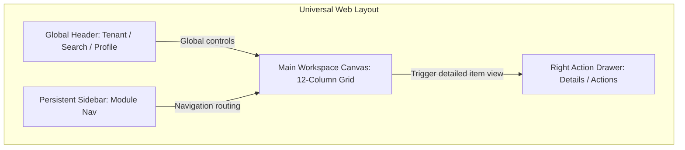
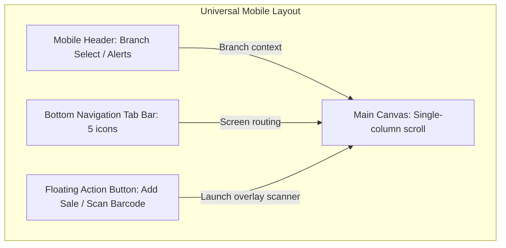
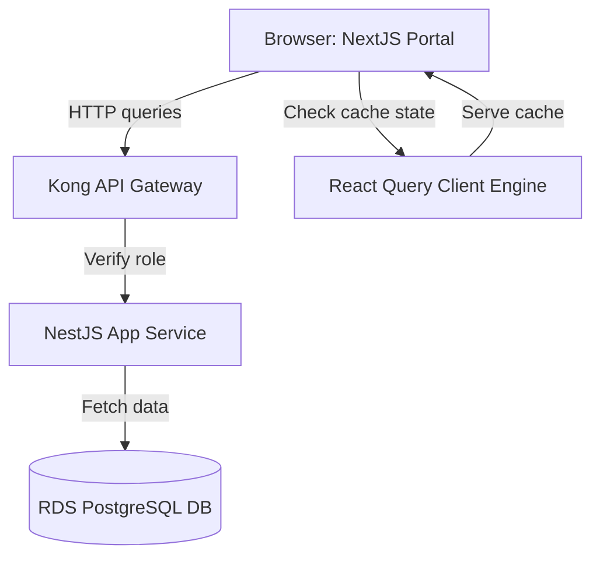
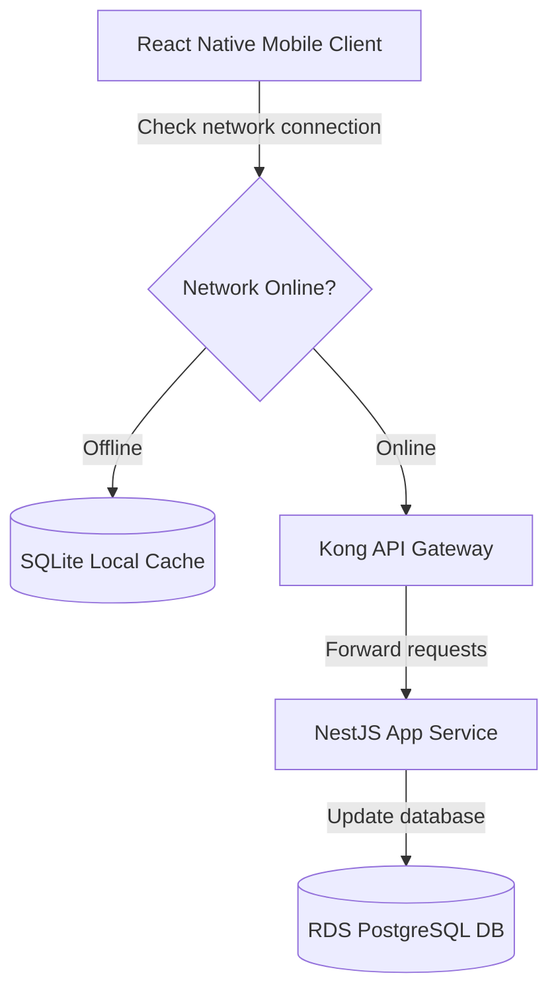
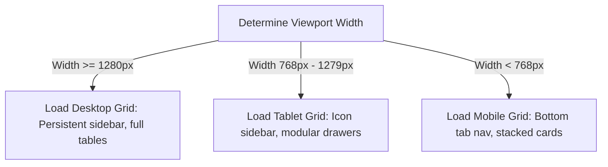
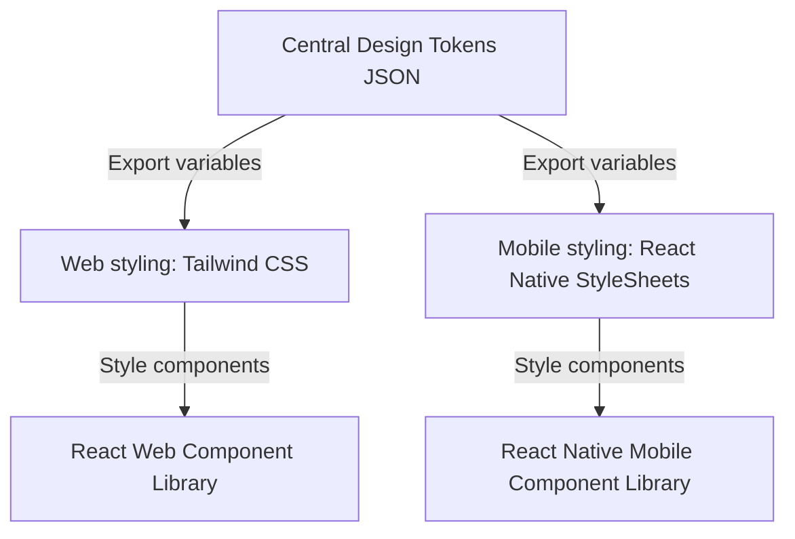

# WEB & MOBILE APPLICATION UX ARCHITECTURE

**Project Name:** Enterprise SaaS Business Management Platform  
**Document Version:** 1.0.0 — Baseline Standard  
**Date:** July 13, 2026  
**Authors:** Principal UX Architect, Mobile UX Specialist & Frontend Architect  
**Classification:** Enterprise Internal — Unrestricted  
**Status:** 🏛️ APPROVED UX SPECIFICATION  

---

## SECTION 1 — WEB APPLICATION UX FOUNDATION

### 1.1 Web SaaS Experience Model
Our web portal is optimized for large screens, complex data views, and productivity-focused operations:
*   **Enterprise Dashboard Experience:** Displays aggregate metrics at the top, followed by interactive data tables and quick-action shortcuts. This layout ensures managers can complete high-volume workflows without having to navigate away from the page.

```
Header Context (Tenant / Branch) ──► Sidebar Nav ──► Main Workspace Canvas ──► Right Action Drawer
```

---

## SECTION 2 — WEB APPLICATION LAYOUT ARCHITECTURE

Our web interface uses a persistent sidebar layout with responsive main workspace grids and sliding action panels:



---

## SECTION 3 — WEB DASHBOARD EXPERIENCE

We standardize the placement of dashboard components to ensure a predictable user experience:
*   **KPI Cards:** Placed at the top of the dashboard, showing totals alongside relative growth percentages.
*   **Charts:** Placed in the center of the dashboard to display sales velocities and category distributions.
*   **Data Tables:** Placed below charts to display lists of low-stock products or cashier sales summaries.
*   **Notifications & Alerts:** Displayed in a header bell icon menu, using color-coded badges to indicate alert severity.
*   **Quick Actions Panel:** Placed in the sidebar or header, offering shortcuts to common tasks like creating invoices or launching POS terminals.

---

## SECTION 4 — WEB NAVIGATION SYSTEM

We organize navigation using a hierarchical breadcrumb trail and module folders:
*   **Main Navigation Sidebar:** Contains top-level links for POS, Inventory, Accounting, CRM, and HR.
*   **Breadcrumb Navigation:** Displays a breadcrumb trail at the top of subpages (e.g., `Inventory > Products > Edit SKU-9812`) to support easy back-navigation.
*   **Profile Menu:** Placed in the top-right corner of the header, providing access to tenant settings, profile configurations, and logout actions.

---

## SECTION 5 — WEB DATA MANAGEMENT UX

We standardize table layouts to support efficient management of large datasets:
*   **Tables:** Freeze row checkbox and actions columns to keep them visible when scrolling table data horizontally.
*   **Filter Panels:** Placed above table columns, offering search inputs, category dropdowns, and date range filters.
*   **Sorting:** Allow users to sort rows by clicking column headers.
*   **Bulk Actions:** Allow users to select multiple rows to run bulk actions, like updating categories or deleting records.
*   **Data Imports:** Provide csv import interfaces that automatically map source columns to database schemas.

---

## SECTION 6 — MOBILE APPLICATION UX FOUNDATION

### 6.1 Mobile SaaS Design Pillars
*   **Fast Action:** Design interfaces for quick, one-handed operations, placing critical action buttons within easy reach of the thumb.
*   **Simple Navigation:** Restrict navigation to a bottom tab bar showing the 5 most critical app screens.
*   **Touch Friendly:** Enforce minimum touch target sizes of $48\text{px} \times 48\text{px}$ to prevent misclicks.
*   **Context Awareness:** Use mobile hardware features (like camera barcode scanners and geolocation sensors) to speed up data entry.

---

## SECTION 7 — MOBILE APPLICATION LAYOUT

Our mobile application layout uses a bottom tab bar navigation and floating action buttons (FAB) for primary actions:



---

## SECTION 8 — MOBILE NAVIGATION ARCHITECTURE

*   **Bottom Navigation Tabs:** Displays Home, Orders, Inventory Search, Task List, and Profile Settings.
*   **Role-Based Views:** Mobile layouts adapt dynamically based on user roles:
    *   *Cashier App:* Launches the POS checkout terminal by default, hiding administrative panels.
    *   *Stock Clerk App:* Launches the barcode scanning tool by default to support fast inventory checks.

---

## SECTION 9 — MOBILE OPERATION EXPERIENCE

We design mobile interfaces to support high-frequency workflows:

### 9.1 POS Mobile Checkout Flow
```
Open Mobile Cart ──► Scan Barcode (Camera) ──► Tap "Charge" ──► Select Payment ──► Send Receipt
```

*   **Inventory Scan Flow:** Stock clerks tap the floating scan button $\rightarrow$ camera scans the product barcode $\rightarrow$ app opens stock quantity inputs $\rightarrow$ user updates count $\rightarrow$ app syncs changes to the server.

---

## SECTION 10 — RESPONSIVE DESIGN SYSTEM

We scale interfaces responsively across standard viewport breakpoints to support desktop, tablet, and mobile screens:

### 10.1 Viewport Breakpoints and Adaptation Rules

| Breakpoint Name | Viewport Width | Sidebar Navigation | Workspace Layout | Component Adaptations |
| :--- | :--- | :--- | :--- | :--- |
| **Desktop** | $\ge 1280\text{px}$ | Persistent | 3-Column Grid | Full data tables, details drawers. |
| **Tablet** | $768\text{px}$ to $1279\text{px}$ | Collapsed Menu | 2-Column Grid | Collapsible columns, modal popups. |
| **Mobile** | $< 768\text{px}$ | Bottom Navigation | 1-Column List | Swipable cards, full-screen sheets. |

---

## SECTION 11 — CROSS-PLATFORM EXPERIENCE

*   **Consistent Elements:** Enforce consistent brand colors, design tokens, component interactions, and business terminology across both web and mobile apps.
*   **Platform Optimizations:** Adapt input methods for each platform, using physical keyboards and mouse clicks on desktop viewports, and touchscreen guestures and camera scanners on mobile devices.

---

## SECTION 12 — OFFLINE-FIRST EXPERIENCE

We build mobile workflows to support uninterrupted operations during network outages:
*   **Local Storage:** Save transactions and stock counts locally using SQLite or WatermelonDB.
*   **Sync Queues:** Queue offline actions and automatically upload them to the server when network connection is restored.
*   **Conflict Resolution:** Resolve database sync conflicts using timestamp-based reconciliation rules.

```
Offline Action ──► Write to SQLite Queue ──► Network Connection Restored ──► Upload to Server ──► Sync Catalog
```

---

## SECTION 13 — MOBILE PERFORMANCE UX

To ensure a smooth mobile user experience, we enforce performance targets:
*   **Loading Speed:** Limit initial app loads to under 2 seconds.
*   **Smooth Animations:** Maintain native 60fps animations during page transitions and sliding actions.
*   **Image Compression:** Compress product images before uploading to reduce network bandwidth usage.

---

## SECTION 14 — NOTIFICATION EXPERIENCE

We organize notification centers based on user viewport sizes:
*   **Web Notification Panel:** Displays slide-out menus listing system warnings, finance approvals, and employee messages.
*   **Mobile Push Notifications:** Sends push alerts for urgent events (such as low-stock alerts, received payments, or security notifications).

---

## SECTION 15 — AUTHENTICATION EXPERIENCE

We secure access credentials using streamlined login interfaces:
*   **Login & Registration:** Enforce simple forms with support for biometric authentication (FaceID/TouchID) on mobile devices.
*   **MFA Validations:** Require MFA verification codes for all administrative settings changes or data export requests.

---

## SECTION 16 — PERMISSION-BASED EXPERIENCE

We customize platform views based on user roles and business types:
*   **Business Owner Views:** Displays full access menus, highlighting financial KPIs and multi-branch comparison charts.
*   **Manager Views:** Displays store operations menus, highlighting employee shift changes and low-stock alerts.
*   **Staff Views:** Opens the POS terminal app automatically, blocking access to administrative settings.
*   **SaaS Superadmin Views:** Displays system performance metrics, tenant registrations, and security audit logs.

---

## SECTION 17 — ACCESSIBILITY EXPERIENCE

We build interfaces to meet accessibility standards across both web and mobile platforms:
*   **Web Accessibility:** Ensure all buttons, forms, and tabs can be focused using keyboard navigation, meeting WCAG contrast ratios.
*   **Mobile Accessibility:** Support dynamic system text scaling and screen reader voice controls (VoiceOver / TalkBack).

---

## SECTION 18 — UX TESTING STRATEGY

We audit and test user interfaces using a standardized usability framework:
*   **Usability Testing:** Run task-based testing sessions with store managers to identify usability issues.
*   **A/B Testing:** Compare alternative button designs or layouts to optimize conversion rates.
*   **User Interviews:** Conduct regular interviews with merchants to map out workflow improvements.

---

## SECTION 19 — UX TECHNOLOGY STACK REFERENCE

Our standardized UX and front-end tools are detailed in the table below:

| Category | Selected Tool | Purpose |
| :--- | :--- | :--- |
| **Web Portal** | **React / Next.js** | Front-end framework for portals, dashboards, and settings menus. |
| **Mobile Portal** | **React Native** | Cross-platform framework for mobile applications. |
| **Styling CSS** | **Tailwind CSS** | CSS framework for styling web components. |
| **Interactive Prototypes**| **Figma** | Prototyping tool used for user flow testing. |
| **Sandbox Environment** | **Storybook** | Sandbox environment for developing and testing UI components. |
| **Data Fetching** | **React Query / SWR** | Manages server state caching and background data syncs. |

---

## SECTION 20 — FINAL WEB & MOBILE UX MERMAID DIAGRAMS

### 20.1 Web Application UX Architecture


### 20.2 Mobile Application UX Architecture


### 20.3 Responsive Design Flow


### 20.4 Offline Sync Experience
```
[ POS Checkout offline ] ──► [ Save to SQLite Queue ] ──► [ Network restored ] ──► [ Upload to Server ] ──► [ Clear Queue ]
```

### 20.5 Cross-Platform Design System


---

*End of Web & Mobile Application UX Architecture*  
*Document maintained by: Principal UX Architect | Status: Approved UX Specification*
