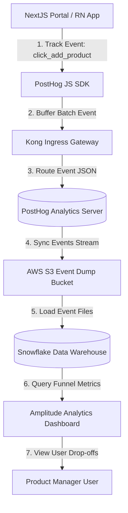
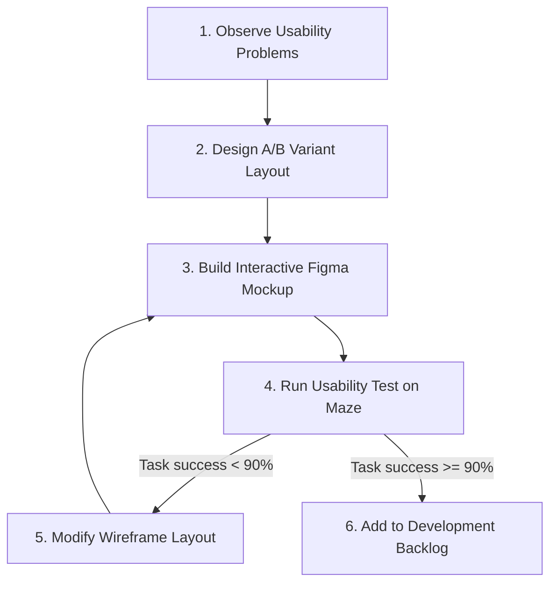
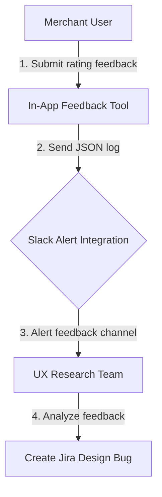
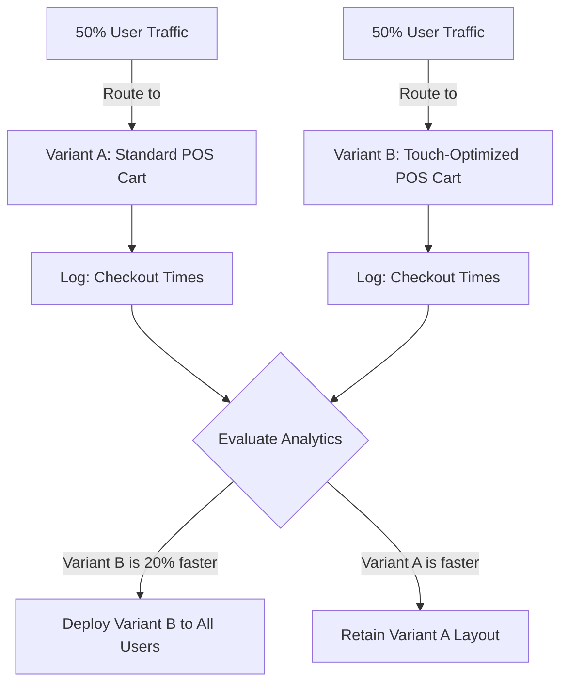
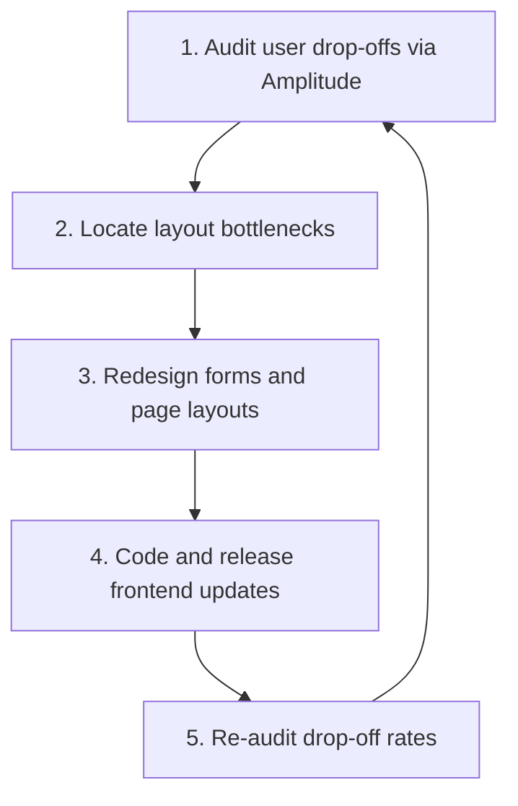

# UX RESEARCH, USABILITY TESTING & PRODUCT ANALYTICS ARCHITECTURE

**Project Name:** Enterprise SaaS Business Management Platform  
**Document Version:** 1.0.0 — Baseline Standard  
**Date:** July 13, 2026  
**Authors:** Head of UX Research, Product Analytics Lead & UX Designer  
**Classification:** Enterprise Internal — Unrestricted  
**Status:** 🏛️ APPROVED UX RESEARCH STANDARD  

---

## SECTION 1 — UX RESEARCH FOUNDATION

### 1.1 Scope of UX Research
We utilize continuous user research to optimize system layouts based on actual store usage:

```
Understand Users ──► Identify Problems ──► Improve Layout Designs ──► Increase Business Value
```

### 1.2 Research-Driven Product Development
We require all feature teams to follow a research-driven design process. Developers do not write production code until usability tests confirm that proposed designs meet target completion rates and ease-of-use scores.

---

## SECTION 2 — USER RESEARCH METHODOLOGY

We select research methods based on project stage and requirements:

### 2.1 Research Method Matrix

| Research Method | Implementation Context | Best Used For |
| :--- | :--- | :--- |
| **User Interviews** | Discovery stage of new module design. | Understanding user goals and workflows. |
| **Surveys** | Post-release feedback collections. | Gathering satisfaction scores from many users. |
| **Observation** | Store visits during checkout shifts. | Documenting physical distractions. |
| **Contextual Inquiry** | Working alongside a cashier at a store. | Identifying checkout delays. |
| **Focus Groups** | Reviewing initial layout design wireframes. | Gathering feedback on early concept designs. |
| **Customer Feedback** | Monitoring active support tickets. | Identifying bug patterns. |

---

## SECTION 3 — USER PERSONA VALIDATION

We validate and update user personas based on actual usage data:
*   **Persona Audits:** Check that Elena's profile (Business Owner) matches typical user behavior, updating details like average sessions and used features.
*   **Triage Pain Points:** Review logs to identify common user pain points, like checkout slowdowns.
*   **Behavior Analysis:** Track feature usage patterns across user roles (e.g., Cashier vs. Store Manager).

---

## SECTION 4 — USER JOURNEY RESEARCH

We monitor critical user journeys to identify usability bottlenecks:
*   **Onboarding Journeys:** Track step-by-step progress through onboarding tasks to identify where new users drop off.
*   **Setup Journeys:** Identify points of confusion when configuring branch settings.
*   **Daily Operation Journeys:** Measure task completion rates for daily cashiers processing checkouts.
*   **Performance Metrics:** Calculate average time-to-complete metrics for common tasks.

---

## SECTION 5 — USABILITY TESTING FRAMEWORK

We execute usability tests across a structured, multi-stage process:

```
Define Test Goal ──► Design Scenario ──► Recruit Merchants ──► Run Usability Test ──► Analyze Metrics ──► Refine UI
```

*   **Scenario Design:** Create realistic testing tasks (e.g., "Add a new inventory item and assign a supplier").
*   **Triage Anomalies:** Identify where users struggle or click incorrect elements to guide layout improvements.

---

## SECTION 6 — USABILITY TEST TYPES

*   **Moderated Testing:** Researchers guide merchants through prototypes, observing their actions in real time.
*   **Unmoderated Testing:** Users complete tasks independently on usability testing platforms, which log their clicks and completion times.
*   **Remote Usability Testing:** Usability sessions conducted via screen-sharing tools to gather feedback from remote branch locations.
*   **Prototype Testing:** Users test interactive Figma mockups before developers write code.
*   **A/B Testing:** Compare alternative layout variants with split user traffic to measure performance differences.

---

## SECTION 7 — PROTOTYPE TESTING WORKFLOW

We validate layouts before writing code by testing interactive prototypes:
*   **Interactive Wireframes:** Build click-through wireframe flows inside Figma.
*   **Usability Testing:** Run remote, unmoderated usability tests on platforms like Maze.
*   **Validation Gate:** Move designs to the development backlog only after prototypes achieve a **$\ge 90\%$** task success rate.

---

## SECTION 8 — PRODUCT ANALYTICS ARCHITECTURE

We track user interactions using decoupled analytics platforms:



---

## SECTION 9 — USER BEHAVIOR TRACKING SCHEMA

We track key user events to monitor platform activity:
*   `user_logged_in` $\rightarrow$ Logs login method (MFA/biometric) and tenant ID.
*   `pos_checkout_completed` $\rightarrow$ Logs order items, amounts, payment type, and checkout time.
*   `inventory_search` $\rightarrow$ Logs query keywords, result counts, and search latency.
*   `report_exported` $\rightarrow$ Logs export format (CSV/PDF) and row counts.
*   `ui_error_displayed` $\rightarrow$ Logs error codes and page URLs.

---

## SECTION 10 — UX METRICS FRAMEWORK

We monitor six key user experience metrics:

### 10.1 Key UX Metrics

| Metric Name | Calculation Formula | Target Standard |
| :--- | :--- | :--- |
| **Activation Rate** | $\frac{\text{Tenants Completing Setup Wizard}}{\text{Total Registered Tenants}} \times 100\%$ | $\ge 85\%$ Setup completion. |
| **Retention Rate** | $\frac{\text{Active Tenants in Month 3}}{\text{Active Tenants in Month 1}} \times 100\%$ | $\ge 92\%$ Retention. |
| **Task Success Rate** | $\frac{\text{Completed Checkouts}}{\text{Total Started Checkouts}} \times 100\%$ | $\ge 99.8\%$ Success. |
| **Time to Complete** | $\text{Average duration of POS Checkout Transaction}$ | $\le 25\text{ seconds}$ per sale. |
| **Error Rate** | $\frac{\text{Transactions Triggering Validation Errors}}{\text{Total Transactions Submitted}} \times 100\%$ | $\le 1.0\%$ Error rate. |
| **Feature Adoption** | $\frac{\text{Active Users Querying Analytics}}{\text{Total Active Tenant Users}} \times 100\%$ | $\ge 40\%$ Analytics usage. |

---

## SECTION 11 — PRODUCT ANALYTICS DASHBOARDS

*   **Conversion Funnels:** Track user progress through onboarding tasks to identify drop-off points.
*   **Retention Charts:** Group cohorts by signup week to analyze platform engagement trends.
*   **Feature Matrices:** Map features by usage frequency to identify underutilized resources.

---

## SECTION 12 — A/B TESTING WORKFLOW

We validate major design changes using A/B testing:

```
Define Hypothesis ──► Build Variant A/B ──► Split Traffic (50/50) ──► Run Test (14 Days) ──► Select Winner
```

*   **Hypothesis Formulation:** e.g., "Adding a barcode scanner shortcut button to the mobile inventory screen will reduce stock update times by $20\%$."
*   **Traffic Split:** Route split traffic to different layout variants using feature flag systems.

---

## SECTION 13 — CUSTOMER FEEDBACK SYSTEM

*   **In-App Feedback:** Integrate simple feedback buttons in portals to gather user ratings.
*   **Satisfaction Surveys:** Automatically send Net Promoter Score (NPS) surveys to store managers quarterly.
*   **Feature Request Boards:** Provide structured portals where merchants can request and vote on new features.

---

## SECTION 14 — UX ERROR ANALYSIS

We analyze usability issues and drop-offs to improve layouts:
*   **Identify Drop-offs:** Review conversion funnels to locate pages with high drop-off rates.
*   **Triage Pain Points:** Review session recordings to understand why users fail to complete tasks.
*   **Layout Adjustments:** Modify form flows and button positions to resolve usability bottlenecks.

---

## SECTION 15 — HEATMAP & SESSION RECORDINGS

*   **Click Maps:** Analyze click maps to verify users notice primary action buttons and identify useless clicks.
*   **Session Reviews:** Review anonymized session recordings of users who encounter errors to identify usability issues.
*   **Frustration Triggers:** Set alerts for signs of user frustration, such as rapid clicks on unresponsive page elements.

---

## SECTION 16 — PRIVACY & ETHICAL CONTROLS

*   **PII Masking:** Automatically mask all text inputs, passwords, and customer names in session recordings to protect user privacy.
*   **Opt-in Consent:** Require consent for user analytics and session tracking during account registration, allowing users to opt out.
*   **Access Control:** Restrict access to raw analytics and session tracking dashboards to authorized UX research roles.

---

## SECTION 17 — UX RESEARCH TOOL STACK REFERENCE

Our standardized UX research and product analytics tools are detailed in the table below:

| Category | Selected Tool | Purpose |
| :--- | :--- | :--- |
| **Growth Analytics** | **Mixpanel / Amplitude** | Tracks user events, conversion funnels, and cohort retention. |
| **Product Analytics** | **PostHog** | Open-source analytics suite for event tracking and feature flags. |
| **Session Tracking** | **Hotjar / FullStory** | Captures click maps and anonymized session recordings. |
| **Usability Platform** | **Maze** | Runs remote, unmoderated usability tests on prototypes. |
| **Survey Engine** | **Typeform / Qualtrics** | Builds and distributes customer satisfaction surveys. |

---

## SECTION 18 — CONTINUOUS IMPROVEMENT LOOP

We continuously refine the user experience using a loop:

```
Research Analytics ──► Design Layouts ──► Test Prototypes ──► Deploy Updates ──► Measure Impact
```

*   **Optimization Cycle:** Run weekly analytics reviews to identify design improvements for subsequent releases.

---

## SECTION 19 — UX MATURITY MODEL

Our user experience processes scale along a defined maturity curve:
*   **Level 1 (Design-Based):** Develop layouts based on developer choices, without user testing.
*   **Level 2 (User-Tested):** Test prototypes with users before writing code.
*   **Level 3 (Data-Driven UX):** Track user events and analyze click maps to optimize layout hierarchies.
*   **Level 4 (Experiment-Driven):** Validate design changes using A/B testing.
*   **Level 5 (AI-Personalized):** Automatically personalize navigation and dashboard layouts based on user roles and task history.

---

## SECTION 20 — FINAL UX RESEARCH MERMAID DIAGRAMS

### 20.1 UX Research Process


### 20.2 User Feedback Loop


### 20.3 Product Analytics Architecture
```
[ User Interaction ] ──► [ PostHog SDK ] ──► [ Ingress Gateway ] ──► [ Event Logs S3 ] ──► [ Amplitude Dashboard ]
```

### 20.4 A/B Testing Flow


### 20.5 Continuous Improvement Cycle


---

*End of UX Research, Usability Testing & Product Analytics Architecture*  
*Document maintained by: Head of UX Research | Status: Approved UX Research Standard*
