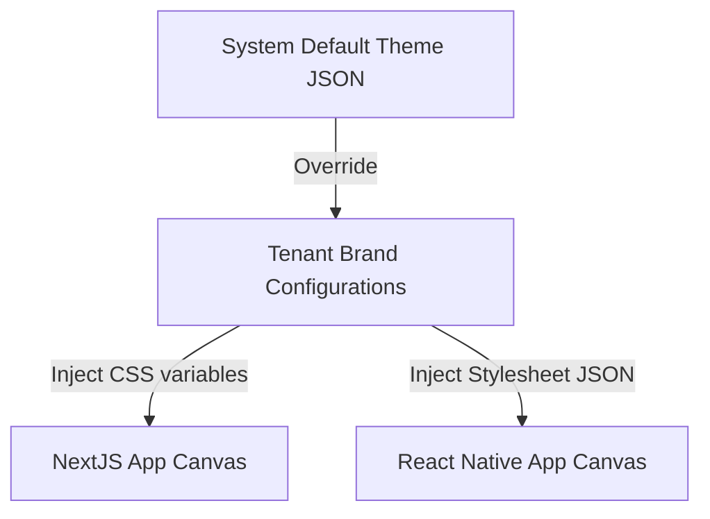
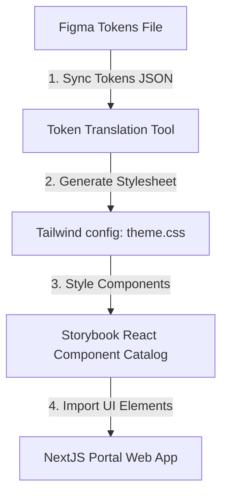
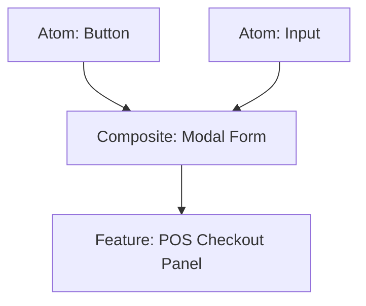
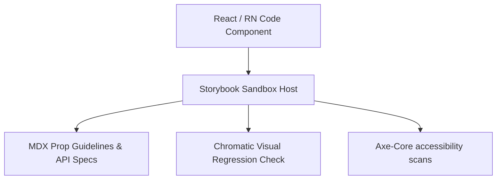
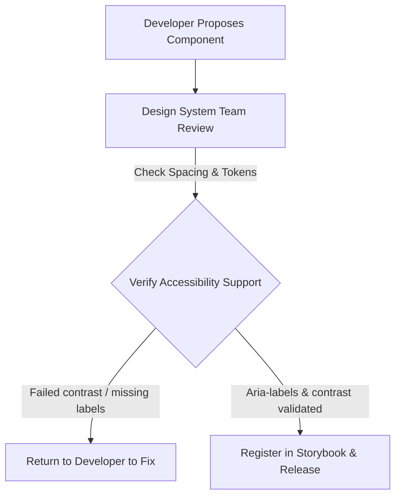

# DESIGN SYSTEM IMPLEMENTATION STRATEGY & FRONTEND HANDOFF

**Project Name:** Enterprise SaaS Business Management Platform  
**Document Version:** 1.0.0 — Baseline Standard  
**Date:** July 13, 2026  
**Authors:** Design System Architect, Frontend Platform Architect & UX Engineering Lead  
**Classification:** Enterprise Internal — Unrestricted  
**Status:** 🏛️ APPROVED FRONTEND DEVELOPMENT STANDARD  

---

## SECTION 1 — DESIGN-TO-DEVELOPMENT WORKFLOW

Our design-to-development workflow ensures that layout designs and UI changes are cataloged, reviewed, and tested before being deployed to production:

```
PRD Spec ──► Figma Mockup ──► Design Review ──► Component Spec ──► Code Implementation ──► Storybook QA ──► Release
```

*   **Continuous Synchronization:** We compile Figma design tokens directly into CSS variables, ensuring frontend apps update automatically when designers modify colors or spacing values.

---

## SECTION 2 — FIGMA DESIGN SYSTEM ARCHITECTURE

We organize our Figma workspaces to serve as a single source of truth for design tokens and component mockups:
*   **Documentation Pages:** Detail design guidelines, grid rules, and component usage instructions.
*   **Core Component Catalogs:** Host atomic components (like buttons and inputs) categorized by states and sizes.
*   **Mockup Sections:** Host page designs and user flow mockups organized by business modules.

---

## SECTION 3 — DESIGN TOKEN IMPLEMENTATION

We compile design tokens into standard CSS variables and Tailwind theme configurations:

### 3.1 CSS Variables Export Example (`theme.css`)
```css
:root {
  /* Color Tokens */
  --color-primary: #0F172A;
  --color-success: #15803D;
  --color-warning: #B45309;
  --color-error: #B91C1C;
  --color-bg-base: #F8FAFC;
  --color-surface: #FFFFFF;

  /* Spacing Tokens */
  --spacing-xs: 0.25rem;  /* 4px */
  --spacing-sm: 0.5rem;   /* 8px */
  --spacing-md: 1.0rem;   /* 16px */
  --spacing-lg: 1.5rem;   /* 24px */

  /* Border Radius */
  --radius-sm: 0.25rem;   /* 4px */
  --radius-md: 0.375rem;  /* 6px */
  --radius-lg: 0.5rem;    /* 8px */
}
```

### 3.2 Tailwind Configurations (`tailwind.config.js`)
```javascript
module.exports = {
  theme: {
    extend: {
      colors: {
        primary: 'var(--color-primary)',
        success: 'var(--color-success)',
        warning: 'var(--color-warning)',
        error: 'var(--color-error)',
        background: 'var(--color-bg-base)',
        surface: 'var(--color-surface)',
      },
      spacing: {
        xs: 'var(--spacing-xs)',
        sm: 'var(--spacing-sm)',
        md: 'var(--spacing-md)',
        lg: 'var(--spacing-lg)',
      },
      borderRadius: {
        sm: 'var(--radius-sm)',
        md: 'var(--radius-md)',
        lg: 'var(--radius-lg)',
      }
    }
  }
}
```

---

## SECTION 4 — COMPONENT SPECIFICATIONS

We document all components to guide implementation and maintain consistency across development teams:

### 4.1 Component Documentation Template

#### Component Name: `Button`
*   **Purpose:** Standard button component used for user submissions and navigation actions.
*   **Props Table:**

| Prop Name | Type | Options | Default Value | Description |
| :--- | :--- | :--- | :--- | :--- |
| `variant` | `string` | `primary`, `secondary`, `danger` | `primary` | Visual style variation. |
| `size` | `string` | `sm`, `md`, `lg` | `md` | Component size rating. |
| `isLoading` | `boolean` | `true`, `false` | `false` | Displays a loading spinner if active. |
| `disabled` | `boolean` | `true`, `false` | `false` | Disables button interactions. |

*   **Responsive Behavior:** Buttons expand to fill full viewports on mobile devices.
*   **Accessibility Rules:** Must support keyboard space/enter key submissions and include clear `aria-label` attributes.

---

## SECTION 5 — FRONTEND COMPONENT LIBRARY

We organize our component library using the Atomic Design framework:
*   **Atomic Components:** Basic inputs, icons, labels, and buttons.
*   **Composite Components:** Search bars, form layouts, modal dialogs, and paginated data tables.
*   **Feature Components:** High-level operational widgets (like POS billing panels or inventory catalogs) used in specific modules.

---

## SECTION 6 — STORYBOOK ARCHITECTURE

We use Storybook to develop and test components in isolation:
*   **Component Playgrounds:** Allow developers to modify component props and verify styling variations interactively.
*   **Visual QA:** Automate visual regression tests (using Chromatic) to flag unexpected styling changes on code check-ins.
*   **Documentation:** Storybook automatically generates documentation pages detailing API props and design guidelines.

---

## SECTION 7 — WEB FRONTEND HANDOFF SPECIFICATION

Figma designs must include the following specifications before developer handoff:
*   **Mockup Link:** Absolute URL to the specific Figma frame.
*   **Design Tokens:** Clearly document the token values used for colors, spacing, and typography.
*   **Layout Rules:** Specify column spans, flex properties, and responsive layout behavior across viewports.
*   **Interactions:** Document hover styles, active focus rings, and transition animations.

---

## SECTION 8 — MOBILE FRONTEND HANDOFF SPECIFICATION

We enforce mobile-specific handoff requirements for React Native applications:
*   **Navigation Mockups:** Document screen transitions, back buttons, and tab bar paths.
*   **Touch Targets:** Ensure all buttons have minimum touch target sizes of $48\text{px} \times 48\text{px}$.
*   **Offline Mode Banners:** Specify banners to display when network connection is lost.

---

## SECTION 9 — DESIGN QA PROCESS

We verify layout compliance using a structured QA flow:

```
Developer Check-in ──► Build Storybook ──► Compare with Figma ──► Triage Differences ──► Merge Code
```

*   **QA Checks:** Review spacing configurations, background colors, font weights, and layout responses across mobile viewports.

---

## SECTION 10 — COMPONENT VERSION MANAGEMENT

We manage design system updates using semantic versioning (SemVer):
*   **Major Update (`v2.0.0`):** Destructive updates, like changing prop names or removing features, requiring developers to follow migration guides.
*   **Minor Update (`v1.2.0`):** Add new features or components without breaking existing APIs.
*   **Patch Update (`v1.1.1`):** Resolves styling bugs or accessibility issues without API modifications.

---

## SECTION 11 — THEME SYSTEM ARCHITECTURE

Our theme system supports light/dark modes and tenant-specific branding overrides:



*   **Implementation:** Store theme variables in theme context files, applying custom variables dynamically based on tenant profiles.

---

## SECTION 12 — MULTI-BRAND & WHITE-LABEL DESIGN

Our white-label SaaS platform supports industry-specific brand customizations:
*   **Branding Configuration:** Allow tenants to upload custom logos and configure primary and secondary accent colors.
*   **Industry Themes:** Provide preconfigured UI layouts matching specific industries (e.g., pharmacy modules use clean teal colors, retail uses bold slate).

---

## SECTION 13 — ACCESSIBILITY COMPLIANCE IMPLEMENTATION

*   **Keyboard Navigation:** Ensure all interactive elements (like tabs and modals) can be focused and triggered using keyboard commands.
*   **Screen Readers:** Label icon buttons with descriptive `aria-label` attributes (e.g., `aria-label="Delete product"`).
*   **Focus Ring Styling:** Enforce high-contrast outlines for active components to guide keyboard users.

---

## SECTION 14 — DESIGN SYSTEM TESTING

We run automated tests on components before major releases:
*   **Visual Regression Tests:** Run Chromatic tests to detect rendering differences across browsers.
*   **Interaction Tests:** Simulate user clicks and inputs in Storybook to verify component states.
*   **Accessibility Tests:** Run automated accessibility audits (using axe-core) to identify contrast issues and missing labels.

---

## SECTION 15 — CROSS-TEAM COLLABORATION MODEL

We coordinate development across specialized roles:
*   **Product Manager:** Defines feature requirements and user stories.
*   **UX Designer:** Builds layouts and prototypes in Figma.
*   **Frontend Developer:** Implements designs using React and React Native.
*   **QA Engineer:** Verifies layout and interaction compliance.

---

## SECTION 16 — DESIGN SYSTEM TOOL STACK REFERENCE

Our standardized design development tools are detailed in the table below:

| Category | Selected Tool | Purpose |
| :--- | :--- | :--- |
| **Design Canvas** | **Figma** | Design canvas used for UI layout prototypes. |
| **Sandbox Environment** | **Storybook** | Sandbox environment for developing and testing UI components. |
| **Visual Regression** | **Chromatic** | Automates visual regression testing for components. |
| **Web Runtime** | **React / Next.js** | Front-end framework for portal and dashboard applications. |
| **Mobile Runtime** | **React Native** | Cross-platform framework for mobile applications. |
| **Utility CSS** | **Tailwind CSS** | CSS framework for styling web components. |
| **Access Testing** | **Axe-core** | Automates accessibility checks in Storybook. |

---

## SECTION 17 — DESIGN SYSTEM GOVERNANCE

*   **Component Proposals:** Developers propose new components by registering them in Storybook directories.
*   **Governance Reviews:** The design system team reviews code quality, accessibility compliance, and styling before merging components into the master branch.

---

## SECTION 18 — DESIGN SYSTEM MATURITY MODEL

Our design system capabilities scale along a defined maturity curve:
*   **Level 1 (Shared UI):** Code custom page styles manually, without using shared tokens or components.
*   **Level 2 (Component Library):** Standardize common components (like buttons and tables) in shared developer repositories.
*   **Level 3 (Design System):** Integrate design tokens and compile Storybook catalogs to document guidelines.
*   **Level 4 (Design Platform):** Integrate Figma to generate component code directly from design canvases.
*   **Level 5 (AI-Assisted Design):** Automatically generate custom layouts and test compliance using AI agents.

---

## SECTION 19 — IMPLEMENTATION ROADMAP

We deploy design system capabilities across five phases:
*   **Phase 1 (Token System):** Build central token files and configure Tailwind CSS theme variables.
*   **Phase 2 (Core Components):** Implement and test atomic components like buttons and inputs.
*   **Phase 3 (Business Components):** Implement complex organisms like data tables and form wizards.
*   **Phase 4 (Storybook Sandbox):** Launch the Storybook documentation catalog to guide development.
*   **Phase 5 (Production Adoption):** Update all platform modules to use the standardized design system.

---

## SECTION 20 — FINAL DESIGN SYSTEM ARCHITECTURE MERMAID DIAGRAMS

### 20.1 Design-to-Code Workflow


### 20.2 Component Architecture


### 20.3 Figma-to-Frontend Pipeline
```
[ Figma Design Styles ] ──► [ Token Dictionary Script ] ──► [ CSS Variables ] ──► [ React Components ]
```

### 20.4 Storybook Architecture


### 20.5 Design Governance Process


---

*End of Design System Implementation Strategy & Frontend Handoff*  
*Document maintained by: Design System Architect | Status: Approved Frontend Development Standard*
