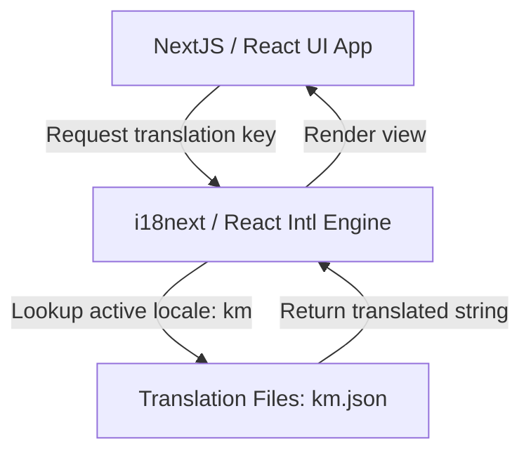
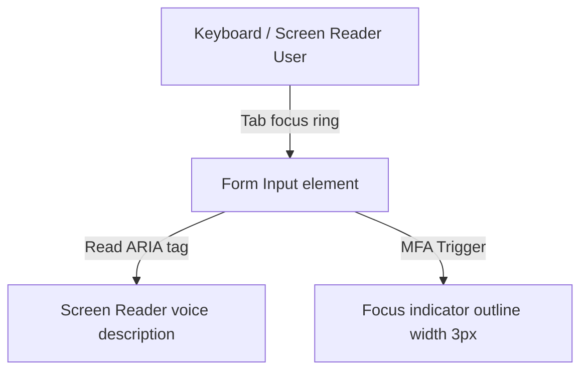
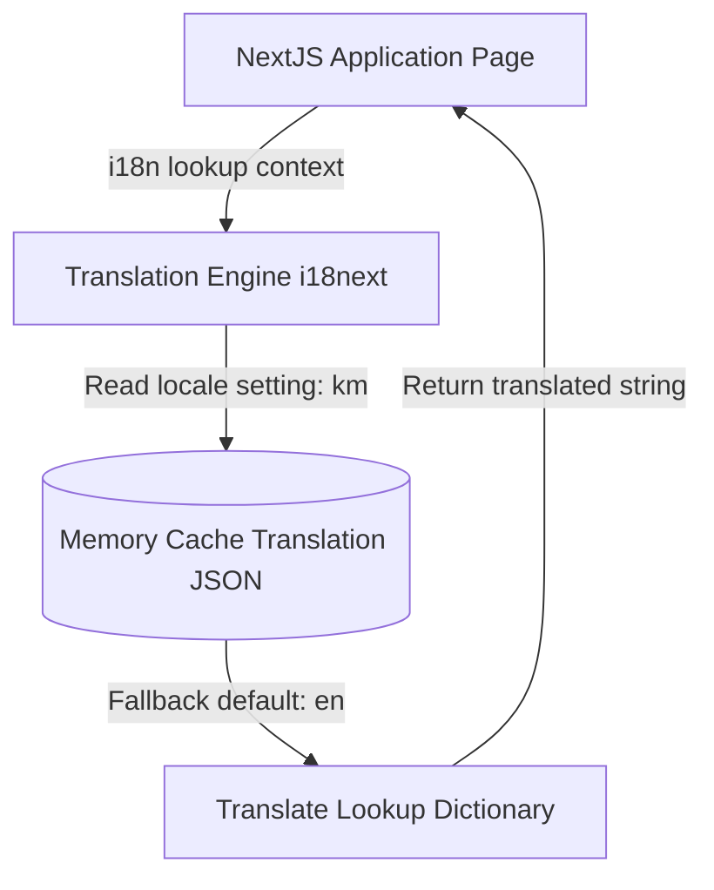
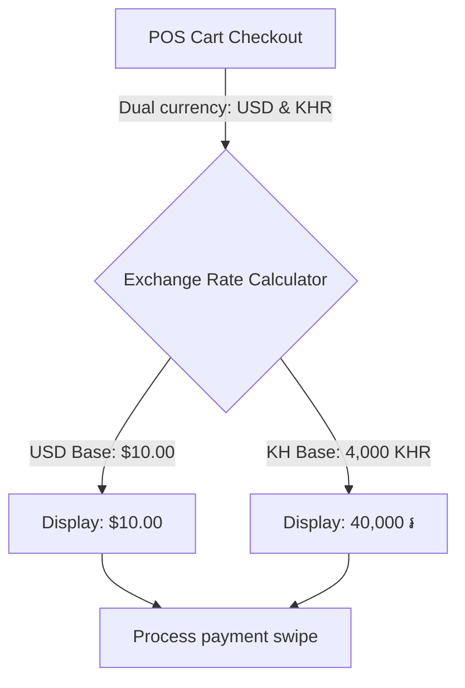
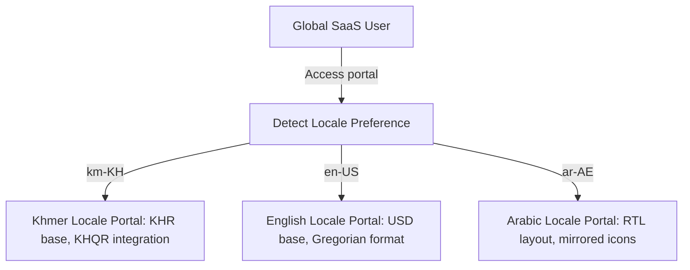

# SAAS UX ACCESSIBILITY, LOCALIZATION & INTERNATIONALIZATION ARCHITECTURE

**Project Name:** Enterprise SaaS Business Management Platform  
**Document Version:** 1.0.0 — Baseline Standard  
**Date:** July 13, 2026  
**Authors:** Global UX Architect, Accessibility Specialist & Localization Engineer  
**Classification:** Enterprise Internal — Unrestricted  
**Status:** 🏛️ APPROVED GLOBALIZATION STANDARD  

---

## SECTION 1 — ACCESSIBILITY FOUNDATION

### 1.1 Universal Design Objective
Our platform is designed to be accessible to all store employees, regardless of physical or cognitive ability:
*   **Goal:** Everyone can use the platform, including users with disabilities.

```
Visual Accessibility (Contrast / Zoom) ──► Motor Support (Keyboard) ──► Cognitive Support (Simple flows)
```

### 1.2 Target Access Audits
*   **Visual Accessibility:** Support screen readers and high-contrast color modes, and ensure text scales up to $200\%$ without breaking layouts.
*   **Motor Accessibility:** Enforce keyboard navigation for all web features, and ensure touch targets on mobile apps are at least $48\text{px} \times 48\text{px}$.
*   **Cognitive Accessibility:** Standardize interface layouts, provide clear error messages, and structure workflows to prevent cognitive fatigue.

---

## SECTION 2 — WCAG COMPLIANCE STRATEGY

We align all platform interfaces with the **WCAG 2.2 AA** standard:
*   **Contrast Ratios:** Text and interactive elements must maintain a contrast ratio of at least **$4.5:1$** against background colors, and larger heading styles must maintain a ratio of at least **$3:1$**.
*   **Keyboard Operation:** Ensure all page elements can be accessed and triggered using Tab, Shift+Tab, and Enter keys.
*   **Focus Ring Indicators:** Highlight focused elements with high-contrast rings (using thick outlines) to guide keyboard users.
*   **Screen Reader Labels:** Add descriptive accessibility attributes (like `aria-label` or `aria-describedby`) to all interactive elements.

---

## SECTION 3 — ACCESSIBLE COMPONENT DESIGNS

All UI components must meet accessibility standards:
*   **Buttons:** Must support space/enter key triggers, highlight with focus outlines, and include screen reader labels when using icon-only designs.
*   **Forms:** Place labels outside input boxes to keep them visible when typing, and display error messages in high-contrast red text.
*   **Data Tables:** Support keyboard tab navigation across cells, and use clear headers to label rows and columns.
*   **Modal Dialogs:** Shift keyboard focus to the modal when opened, trap focus inside the modal canvas, and close the dialog when the Escape key is pressed.

---

## SECTION 4 — INTERNATIONALIZATION (i18n) ARCHITECTURE

Our internationalization architecture translates database records dynamically before rendering views:



---

## SECTION 5 — MULTI-LANGUAGE SYSTEM

Our platform supports English, Khmer, and Chinese locales, dynamically switching interfaces based on user preferences:
*   **Language Selection:** Users select their preferred language from profile settings, saving the selection to database profiles and local caches.
*   **Automated Detection:** Detect default browser language settings during registration to preconfigure initial workspaces.

---

## SECTION 6 — TRANSLATION MANAGEMENT

We store translations in structured JSON files organized by namespace folders:
*   **Namespace Files:** Organize files by module context (e.g., `dashboard.json`, `inventory.json`) to keep file sizes manageable.

### 6.1 Translation Schema Example (`km.json` - Khmer)
```json
{
  "dashboard": {
    "sales": {
      "title": "របាយការណ៍លក់",
      "revenue": "ចំណូលសរុប",
      "growth": "អត្រាកំណើន"
    },
    "inventory": {
      "title": "បញ្ជីសារពើភណ្ឌ",
      "stock_alert": "ការជូនដំណឹងស្តុកទាប"
    }
  }
}
```

### 6.2 Translation Schema Example (`zh.json` - Chinese)
```json
{
  "dashboard": {
    "sales": {
      "title": "销售报告",
      "revenue": "总营业额",
      "growth": "增长率"
    },
    "inventory": {
      "title": "库存管理",
      "stock_alert": "低库存警告"
    }
  }
}
```

---

## SECTION 7 — LOCALIZATION STRATEGY

We format currencies, date-times, numbers, and tax rates based on regional standards:
*   **Numbers:** Format decimals and thousands separators based on locale standards (e.g., using commas in English: `1,250.50`, and spaces in French: `1 250,50`).
*   **Tax Formats:** Calculate and display tax values according to local regulations (e.g., VAT rates in Cambodia, GST rates in Singapore).

---

## SECTION 8 — CAMBODIA MARKET UX DESIGN (INITIAL TARGET)

Designed to support merchant operations in Cambodia:
*   **Dual Currency Support:** Allow checkouts using both KHR and USD currencies, displaying exchange rates on payment screens.
*   **KHQR Payment Integration:** Generate scan-ready KHQR codes for checkouts, supporting mobile payments from local banking apps (like ABA Mobile).
*   **Mobile Optimization:** Optimize layouts for low-bandwidth mobile connections, as many local merchants operate primarily on mobile devices.

---

## SECTION 9 — CHINESE MARKET UX DESIGN

Designed to support merchant operations in Chinese markets:
*   **Simplified Character Support:** Enforce clean, readable character spacing for Simplified Chinese text layouts.
*   **Date Formats:** Display dates in Year-Month-Day order (e.g., `YYYY年MM月DD日`).
*   **Localized Terms:** Use standard regional terminology for business terms (e.g., matching VAT definitions in China).

---

## SECTION 10 — MULTI-CURRENCY ARCHITECTURE

We support multi-currency checkouts and financial reporting:

### 10.1 Supported Currency Formats

| Currency Code | System Symbol | Decimal Places | Formatting Example | Primary Target Market |
| :--- | :--- | :--- | :--- | :--- |
| **USD** | `$` | 2 | `$1,250.75` | US / Cambodia (dual currency) |
| **KHR** | `៛` | 0 | `5,000 ៛` | Cambodia (local) |
| **CNY** | `¥` | 2 | `¥1,250.75` | China |
| **THB** | `฿` | 2 | `1,250.75 ฿` | Thailand |
| **VND** | `₫` | 0 | `1.250 ₫` | Vietnam |

---

## SECTION 11 — DATE & TIME LOCALIZATION

*   **Gregorian Calendar:** Standardize backend times using UTC Gregorian timestamps.
*   **Timezones:** Save times in UTC format, converting timestamps to the merchant's local branch timezone when rendering dashboard reports.

---

## SECTION 12 — RIGHT-TO-LEFT (RTL) READINESS

We design page layouts to support future localization to RTL languages (such as Arabic or Hebrew):
*   **Bi-directional Layouts:** Use flex and grid alignments (using `start` and `end` CSS properties rather than `left` and `right`) to support automatic layout mirroring.
*   **Icon Mirroring:** Ensure directional icons (like back buttons and slider controls) mirror automatically when RTL themes are enabled.

---

## SECTION 13 — CULTURAL UX ADAPTATIONS

We review visual designs to prevent cultural conflicts and align with local preferences:
*   **Color Systems:** Confirm color meanings in target markets. In China, green represents growth and security, while red represents success.
*   **Icons & Images:** Avoid using localized symbols that may not translate well across regions.
*   **Business Customizations:** Adapt workflows to support regional business habits, like accepting split-currency payments at POS terminals in Cambodia.

---

## SECTION 14 — ACCESSIBILITY EXPERIENCE TESTING

We audit accessibility compliance using a structured testing plan:
*   **Screen Reader Audits:** Navigate checkouts using screen readers (NVDA / VoiceOver) to verify text descriptions are read correctly.
*   **Keyboard Audits:** Verify users can navigate and trigger all form fields and actions using only a keyboard.
*   **Contrast Checks:** Scan pages using contrast analyzers to confirm text colors meet WCAG AA standards.

---

## SECTION 15 — LOCALIZATION QUALITY QA

We validate localization quality before major releases:
*   **Translation Reviews:** Have native speakers review interface text to ensure translations are accurate and natural.
*   **Layout Testing:** Test pages in different languages to identify text overflows or layout breaks caused by translated strings.
*   **Format Validations:** Confirm date, currency, and tax fields display correctly according to local standards.

---

## SECTION 16 — GLOBAL USER SETTINGS

Allow users to manage regional preferences in their account settings:
*   **Language Selection:** Dropdown menu to change the interface language.
*   **Timezone Selection:** Dropdown menu to change the active timezone.
*   **Currency Selection:** Select primary checkout and reporting currencies.
*   **Theme Selection:** Switch between Light, Dark, or System themes.

---

## SECTION 17 — GLOBALIZATION TECHNOLOGY STACK REFERENCE

Our standardized globalization tools are detailed in the table below:

| Category | Selected Tool | Purpose |
| :--- | :--- | :--- |
| **Web Translation** | **i18next** | Translation engine for web applications. |
| **Formatting Engine**| **FormatJS / React Intl** | Formats dates, times, currencies, and numbers according to locale. |
| **Design Translation**| **Figma i18n** | Localizes wireframes and layouts inside Figma workspaces. |
| **Loc Translation** | **Lokalise** | Cloud platform for managing translation keys. |
| **Continuous i18n** | **Crowdin** | Automates translation updates within CI/CD pipelines. |

---

## SECTION 18 — ACCESSIBILITY & GLOBALIZATION GOVERNANCE

*   **Design Sign-off:** Designers must verify that color and text schemas meet WCAG contrast guidelines before developers write code.
*   **Translation Approval:** Review translation files before major releases to ensure new keys are translated and do not break layouts.

---

## SECTION 19 — GLOBALIZATION MATURITY MODEL

Our internationalization capabilities scale along a defined maturity curve:
*   **Level 1 (Single Language):** Code all text and formatting directly in English, without supporting other locales.
*   **Level 2 (Multi-Language):** Store text keys in external JSON files to support basic translation switching.
*   **Level 3 (Localized Product):** Format dates, times, currencies, and tax rates based on regional standards.
*   **Level 4 (Global Experience):** Optimize layouts for different screen directions (RTL/LTR) and support regional payment systems.
*   **Level 5 (AI-Personalized):** Automatically personalize translations and currency options based on user location and transaction history.

---

## SECTION 20 — FINAL GLOBALIZATION MERMAID DIAGRAMS

### 20.1 Accessibility Architecture


### 20.2 Internationalization Flow


### 20.3 Localization Pipeline
```
[ Code Commit ] ──► [ Crowdin Translation Sync ] ──► [ Automated Layout Check ] ──► [ Release Locale Files ]
```

### 20.4 Multi-Currency Experience


### 20.5 Global SaaS UX Architecture


---

*End of SaaS UX Accessibility, Localization & Internationalization Architecture*  
*Document maintained by: Global UX Architect | Status: Approved Globalization Standard*
