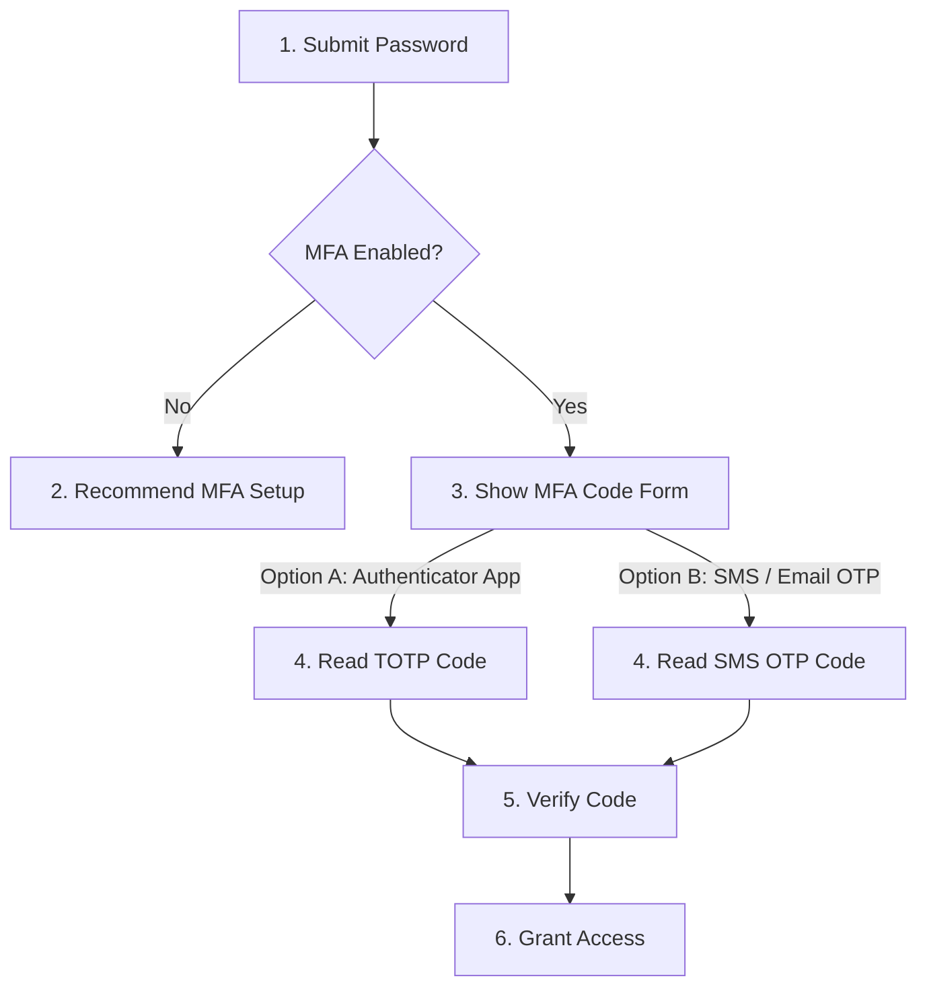
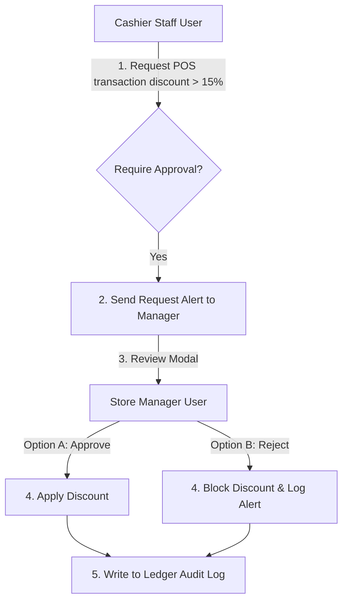
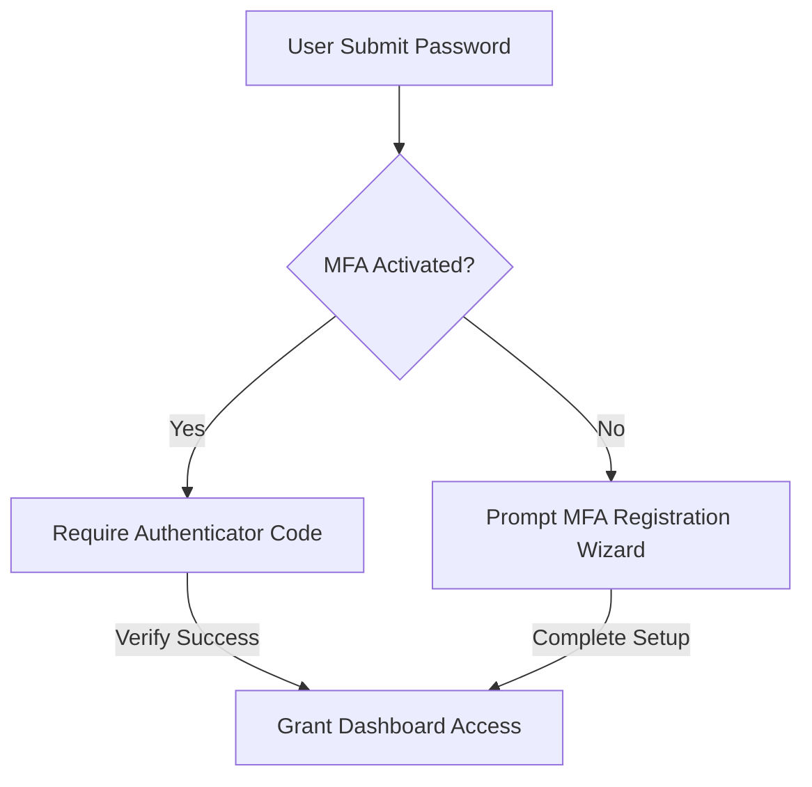
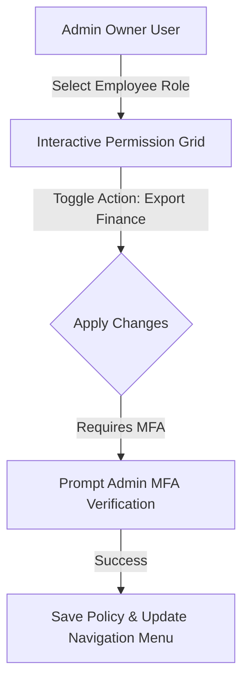
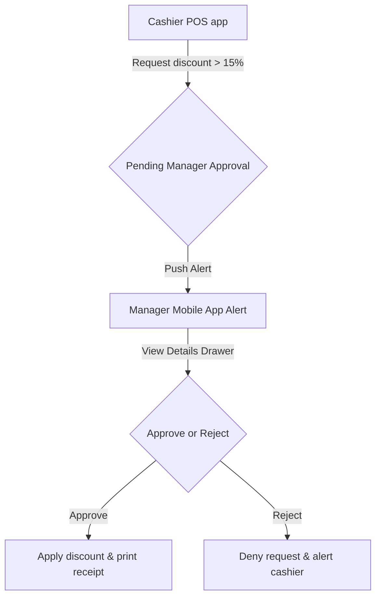
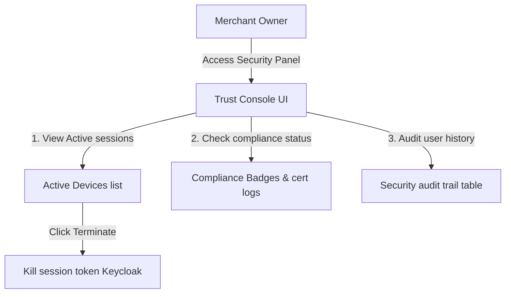

# UX SECURITY, TRUST & USER SAFETY EXPERIENCE ARCHITECTURE

**Project Name:** Enterprise SaaS Business Management Platform  
**Document Version:** 1.0.0 — Baseline Standard  
**Date:** July 13, 2026  
**Authors:** Security UX Architect, Product Security Engineer & Identity Experience Specialist  
**Classification:** Enterprise Internal — Unrestricted  
**Status:** 🏛️ APPROVED UX SECURITY STANDARD  

---

## SECTION 1 — SECURITY UX FOUNDATION

### 1.1 Scope of Security UX
We design user interfaces to protect accounts, prevent user errors, and establish trust throughout the application lifecycle:

```
Protect Accounts ──► Prevent Operational Errors ──► Establish User Trust ──► Safe SaaS Ecosystem
```

### 1.2 UX Security Pillars
*   **Simple:** Simplify security procedures (like MFA registration and session management) to prevent users from bypassing controls.
*   **Transparent:** Clearly explain why permissions are required, how personal data is processed, and what actions trigger security alerts.
*   **Predictable:** Standardize interaction patterns for security-sensitive tasks (like data exports and user invitations) to make anomalies easily noticeable.

---

## SECTION 2 — AUTHENTICATION EXPERIENCE

Our authentication flow guides users securely from account registration to platform access:
*   **Multi-Channel Support:** Enforce secure registration and login paths using emails, phone numbers, social login platforms, and MFA tokens.

```
Register Form ──► Verify Email Link ──► Login Page ──► MFA Challenge ──► Access Dashboard
```

---

## SECTION 3 — LOGIN EXPERIENCE DESIGN

We design login interfaces to prevent credential stuffing and protect user accounts:
*   **Input Forms:** Support password visibility toggles and username auto-completion controls.
*   **Validation Banners:** Display simple validation error messages (like "Incorrect username or password") to prevent username enumeration.
*   **Remember Device:** Allow users to trust their active devices for 30 days, reducing MFA prompts while maintaining account security.
*   **Session Management:** Automatically log out inactive users after 15 minutes of inactivity on cashier terminals, displaying a countdown warning before logging out.

---

## SECTION 4 — USER-FRIENDLY MULTI-FACTOR AUTHENTICATION (MFA)

We design MFA verification screens to balance security with ease of use:



---

## SECTION 5 — PASSWORD SECURITY EXPERIENCE

*   **Password Creation:** Enforce strong password requirements (minimum 12 characters, including numbers and special symbols).
*   **Strength Visualizer:** Display a dynamic strength bar below password fields to guide users when creating passwords.
*   **Reset & Recovery:** Provide secure password reset workflows, sending single-use, time-limited reset links to registered email addresses.

---

## SECTION 6 — AUTHORIZATION EXPERIENCE

We design authorization workflows to show users what permissions are assigned to their accounts, helping them understand their access limits:

```
User Identity ──► Active Role (e.g. Cashier) ──► Assigned Permission Group ──► Authorized Feature Access
```

---

## SECTION 7 — ROLE & PERMISSION MANAGEMENT UX

We provide administrators with clean interfaces to manage user roles and permissions:
*   **Permission Matrix Table:** An interactive grid showing available system actions alongside user roles.
*   **Access Control Actions:** Support adding new roles, assigning permissions, and removing user access instantly.

### 7.1 Role & Permission Matrix Example

| Platform Feature | Platform Admin | Business Owner | Store Manager | Cashier Employee |
| :--- | :--- | :--- | :--- | :--- |
| **Manage Tenant Profile** | 🟢 Granted | 🟢 Granted | 🔴 Blocked | 🔴 Blocked |
| **Edit Branch Settings** | 🟢 Granted | 🟢 Granted | 🟢 Granted | 🔴 Blocked |
| **Edit Product Catalog** | 🟢 Granted | 🟢 Granted | 🟢 Granted | 🔴 Blocked |
| **Process POS checkout** | 🟢 Granted | 🟢 Granted | 🟢 Granted | 🟢 Granted |
| **Export Financial P&L** | 🟢 Granted | 🟢 Granted | 🔴 Blocked | 🔴 Blocked |

---

## SECTION 8 — DATA PRIVACY UX CONTROLS

*   **Customer Profiles:** Mask contact fields (like emails and phone numbers) in customer loyalty tables.
*   **Data Export Controls:** Require MFA verification before exporting store sales ledgers to CSV or Excel files.
*   **Right to be Forgotten:** Provide a settings portal where users can request account deletion, displaying a confirmation prompt to prevent accidental data loss.

---

## SECTION 9 — SECURITY NOTIFICATION EXPERIENCE

We alert users to security-sensitive changes to their accounts:
*   **Alert Categories:** Send notifications for logins from new devices, password modifications, changed permission roles, and multiple failed login attempts.
*   **Alert Banners:** Include the IP address, device name, location, and event timestamp in all security alerts.

---

## SECTION 10 — APPROVAL WORKFLOW UX

We route high-risk transactions through manager approval workflows to prevent unauthorized actions:



---

## SECTION 11 — AUDIT LOG EXPERIENCE

We format audit logs to help administrators review changes:
*   **Summary Cards:** Format logs to state who performed the action, what was changed, when the change occurred, and the IP address used.
*   **Example Event:** "Manager (user_id: 981273) changed product list price of Item 'Latte' from $3.50 to $3.00 at 2026-07-13 20:33:44 from IP 198.51.100.42."

---

## SECTION 12 — SECURE PAYMENT EXPERIENCE

*   **Confirmation Screens:** Display payment confirmation screens showing the total charge, customer details, and selected payment type.
*   **Verification Indicators:** Show clear animations while processing transactions, displaying a green checkmark upon success and a red warning banner upon failure.

---

## SECTION 13 — ERROR MESSAGE SECURITY

To prevent system information leaks, we enforce strict error messaging guidelines:
*   **Avoid Information Leakage:** Do not display stack traces, database table names, or internal IP addresses on error screens.

### 13.1 Error Message Guidelines

| Triggering Event | Poor Error Message (Vulnerable) | Recommended Secure Error Message | Rationale |
| :--- | :--- | :--- | :--- |
| **Failed User Login** | "User profile email does not exist." | "Invalid email or password." | Prevents attackers from identifying valid usernames. |
| **Failed API Query** | "Connection failed: database.table.users." | "System error. Please try again later." | Hides database schemas and connection details. |
| **Permission Denied** | "User role: Cashier does not have edit scope." | "Access Denied." | Hides system authorization rules and scopes. |

---

## SECTION 14 — TRUST-BUILDING UX ELEMENTS

*   **Security Badges:** Display SSL and compliance badges (like ISO 27001 or PCI DSS) in checkout footers.
*   **Data Explanations:** Display tooltips explaining why sensitive fields (like customer phone numbers) are required.
*   **Security Logs:** Offer a settings panel where owners can audit login histories.

---

## SECTION 15 — DEVICE & SESSION MANAGEMENT UX

*   **Active Sessions:** Provide a settings panel listing active devices, showing browser names, IP locations, and last active timestamps.
*   **Remote Terminate:** Allow users to terminate active sessions remotely to secure accounts on lost devices.

---

## SECTION 16 — MOBILE SECURITY EXPERIENCE

*   **Biometrics:** Support FaceID and fingerprint logins on React Native mobile applications.
*   **App Lock:** Prompt for a PIN or biometric verification after 3 minutes of app inactivity.
*   **Secure Storage:** Store local session tokens in encrypted keystores (iOS Keychain / Android Keystore).

---

## SECTION 17 — SECURITY UX TESTING

We audit security interfaces using task-based usability testing:
*   **Testing Workflows:** Test login, password reset, and permission change workflows.
*   **Verification Checklists:** Verify users can configure MFA settings easily and identify validation errors.

---

## SECTION 18 — SECURITY UX TOOL STACK REFERENCE

Our standardized security UX and research tools are detailed in the table below:

| Category | Selected Tool | Purpose |
| :--- | :--- | :--- |
| **Interactive Prototypes**| **Figma** | Prototyping tool used for user flow testing. |
| **Usability Platform** | **Maze** | Runs remote, unmoderated usability tests on prototypes. |
| **User Testing** | **UserTesting** | Recruits target users to test authentication and recovery flows. |
| **Session Tracking** | **Hotjar** | Logs heatmaps and recording sessions to identify user frustration. |
| **Security Audits** | **OWASP ZAP / Burp Suite**| Scans interfaces to identify security vulnerabilities. |
| **Telemetry Analytics** | **PostHog** | Tracks user actions and monitors failed login attempts. |

---

## SECTION 19 — SECURITY UX MATURITY MODEL

Our security UX processes scale along a defined maturity curve:
*   **Level 1 (Basic Login):** Authenticate users using password inputs, without supporting MFA or password strength indicators.
*   **Level 2 (Secure Auth):** Integrate password strength indicators, password reset links, and MFA workflows.
*   **Level 3 (Permission Experience):** Build interactive permission grids and role-based navigation menus.
*   **Level 4 (Privacy-Driven UX):** Enforce data masking on customer PII fields and require MFA for data exports.
*   **Level 5 (Zero Trust UX):** Require device health checks and MFA validation for all database queries and data exports.

---

## SECTION 20 — FINAL SECURITY UX MERMAID DIAGRAMS

### 20.1 Secure Authentication Experience


### 20.2 Permission Management UX


### 20.3 Privacy Control Flow
```
[ View Customer Ledger ] ──► [ Mask PII Columns ] ──► [ Click Export CSV ] ──► [ Prompt MFA Challenge ] ──► [ Download Link ]
```

### 20.4 Approval Workflow Experience


### 20.5 Security Trust Architecture


---

*End of UX Security, Trust & User Safety Experience Architecture*  
*Document maintained by: Security UX Architect | Status: Approved UX Security Standard*
