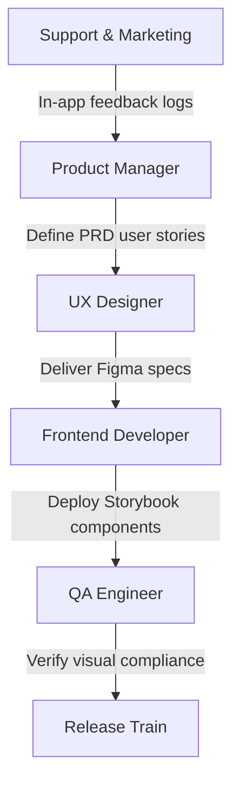
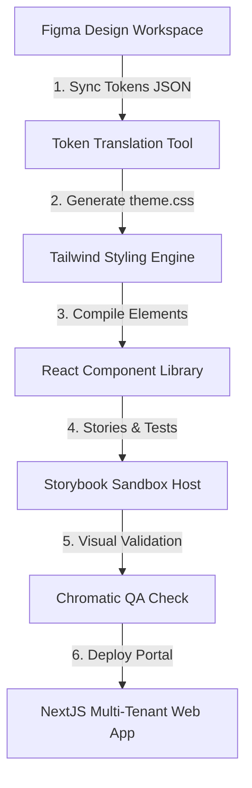
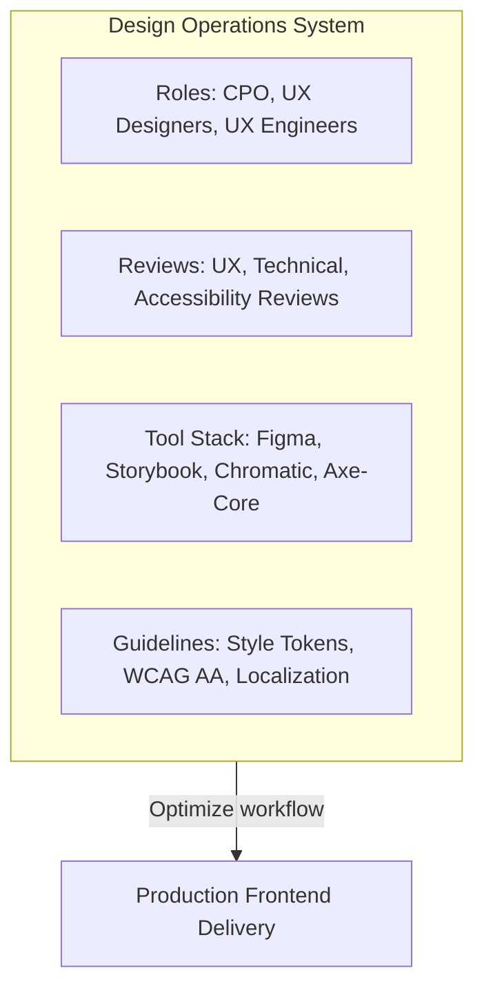
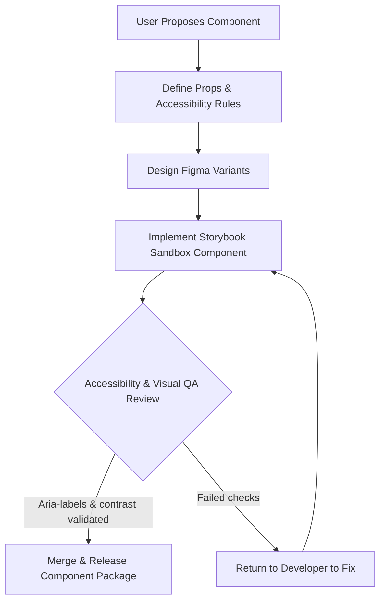
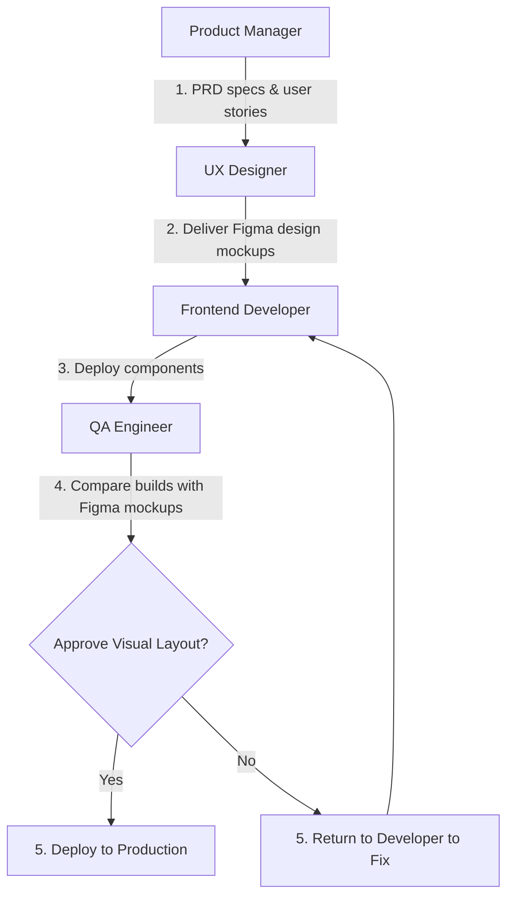

# SAAS PRODUCT UX GOVERNANCE, DESIGN OPERATIONS & FINAL UX BLUEPRINT

**Project Name:** Enterprise SaaS Business Management Platform  
**Document Version:** 1.0.0 — Baseline Standard  
**Date:** July 13, 2026  
**Authors:** Chief Product Officer (CPO), Design Operations Lead & UX Governance Architect  
**Classification:** Enterprise Internal — Unrestricted  
**Status:** 🏛️ APPROVED UX GOVERNANCE STANDARD  

---

## SECTION 1 — UX ORGANIZATION MODEL

We manage our user experience team using a centralized structure to ensure design consistency across all business modules:
*   **Head of Product:** Defines the platform's product roadmap, aligns design initiatives with business goals, and manages UX budgets.
*   **UX Director:** Sets design system visual standards, audits layout quality, and oversees cross-team alignment.
*   **UX Designer:** Researches user flows, builds Figma wireframes, and designs high-fidelity mockups.
*   **UX Researcher:** Conducts usability tests with merchants and coordinates user interviews.
*   **UX Engineer (Frontend Developer):** Codes reusable Storybook component libraries and compiles design tokens.

---

## SECTION 2 — DESIGN OPERATIONS (DESIGN OPS)

Design Operations (DesignOps) manages the people, processes, and tools that support our design team:
*   **People:** Establishes clear design roles and structures cross-team communication channels.
*   **Process:** Standardizes review workflows to ensure layout consistency across modules.
*   **Tools:** Standardizes tools (Figma, Storybook, and Chromatic) to keep design and development environments in sync.
*   **Standards:** Defines and enforces guidelines for accessibility compliance and UI consistency.
*   **Goals:** Efficiency, Consistency, Quality, and Scalability.

---

## SECTION 3 — PRODUCT DESIGN LIFECYCLE

We require all product teams to follow a structured lifecycle when designing and developing new features:

```mermaid
graph TD
    Research[1. User Research & Surveys] --> Define[2. Problem Definition & Scope]
    Define --> Design[3. Figma UX Mockup Design]
    Design --> Proto[4. Interactive Prototype Build]
    Proto --> Test[5. Usability Testing Maze]
    
    Test -->|Success >= 90%| Dev[6. Code Frontend Development]
    Test -->|Failure| Design
    
    Dev --> QA[7. Storybook Visual QA Review]
    QA --> Release[8. Production Release]
    Release --> Measure[9. Post-Release Analytics Audit]
    Measure --> Improve[10. Continuous Layout Optimization]
    
    Improve --> Research
```



---

## SECTION 4 — DESIGN REVIEW PROCESS

We audit layout changes across a structured, multi-stage review process:
*   **1. UX Review:** The design team verifies that new layouts align with visual standards.
*   **2. Product Review:** Product managers verify that designs support product requirements.
*   **3. Technical Review:** Frontend engineers check that layouts can be implemented efficiently.
*   **4. Accessibility Review:** Accessibility specialists verify that color contrasts and keyboard navigation meet WCAG AA guidelines.
*   **5. Final Sign-off:** The UX Director signs off on layouts before developers write code.

---

## SECTION 5 — DESIGN SYSTEM GOVERNANCE

We manage design system updates using a structured request and validation workflow:

```
Component Request ──► Design Proposal ──► Governance Review ──► Implementation ──► Storybook Docs ──► Release
```

*   **Rule:** Developers do not create custom UI elements for specific modules. Any new layout requirements must be reviewed and integrated into the central design system.

---

## SECTION 6 — COMPONENT CONTRIBUTION MODEL

We use an Open Contribution Model to allow developers and designers to contribute to the design system:
*   **Create:** Designers build layout variants inside Figma design libraries.
*   **Implement:** Frontend developers implement and register new components in Storybook sandbox folders.
*   **Review:** The cross-functional team audits code quality and styling consistency.
*   **Approve:** The design system maintainer approves the pull request, updating the central package.

---

## SECTION 7 — UX QUALITY MANAGEMENT

We monitor design quality across five key areas:
*   **Usability:** Track task completion rates and time-to-complete metrics for POS checkouts.
*   **Consistency:** Scan pages using automated linters to verify that layouts use standard design tokens.
*   **Accessibility:** Run automated audits (using axe-core) to identify accessibility issues.
*   **Performance:** Monitor initial page load times and animation frame rates.
*   **User Satisfaction:** Conduct quarterly Net Promoter Score (NPS) surveys to track merchant satisfaction.

---

## SECTION 8 — DESIGN DEBT MANAGEMENT

Design debt occurs when custom page styles or outdated layout patterns bypass governance gates:
*   **Inconsistent Elements:** Spot-check page layouts to identify non-standard styles.
*   **Broken Patterns:** Track pages with high drop-off rates to identify usability issues.
*   **Debt Resolution Process:** Dedicate $20\%$ of frontend development sprints to resolving design debt, replacing custom styling with updated design system components.

---

## SECTION 9 — CROSS-FUNCTIONAL COLLABORATION

We coordinate product design and development across five key roles:



---

## SECTION 10 — UX DOCUMENTATION SYSTEM

We organize our design documentation in a central repository to guide development teams:
*   **Design Guidelines:** Document branding guidelines, color palettes, and typographic scales.
*   **Component Rules:** Document API specifications, prop descriptions, and accessibility requirements for components.
*   **User Flows:** Map standard user journeys, such as onboarding wizards and daily POS checkouts.
*   **Decision Records:** Document key design system decisions and version history logs.

---

## SECTION 11 — DESIGN SYSTEM VERSION CONTROL

We manage design system updates using semantic versioning (SemVer):
*   **Major Update (`v2.0.0`):** Destructive updates (like renamed props or removed components) requiring developers to follow migration guides.
*   **Minor Update (`v1.2.0`):** Adds new components or features without breaking existing APIs.
*   **Patch Update (`v1.1.1`):** Resolves styling bugs or accessibility issues.

---

## SECTION 12 — PRODUCT EXPERIENCE METRICS

We monitor five key metrics to track platform usability and merchant engagement:
*   **Task Success Rate:** Target $\ge 99.8\%$ success rates for POS checkout transactions.
*   **User Satisfaction:** Target $\ge 70$ NPS ratings from store owners.
*   **Feature Adoption:** Track active usage of analytics dashboards and reporting tools.
*   **Retention Rate:** Target $\ge 92\%$ monthly retention rates for active merchants.
*   **Support Reduction:** Track decrease in usability-related support tickets post-release.

---

## SECTION 13 — UX GOVERNANCE TOOL STACK REFERENCE

Our standardized UX governance tools are detailed in the table below:

| Category | Selected Tool | Purpose |
| :--- | :--- | :--- |
| **Design Canvas** | **Figma** | Tool for designing wireframes, high-fidelity mockups, and prototypes. |
| **Component Sandbox** | **Storybook** | Sandbox environment for developing and testing UI components. |
| **Documentation Portal**| **Zeroheight / Notion** | Central portal for design system documentation. |
| **Project Tracker** | **Jira** | Tracks design reviews and component development tasks. |
| **Knowledge Base** | **Confluence** | Hosts design guidelines and product research findings. |

---

## SECTION 14 — ENTERPRISE UX STANDARDS

We require all platform modules to meet our core enterprise design standards:
*   **Consistency:** Use only approved colors, typography scales, and spacing values defined by design tokens.
*   **Accessibility:** Meet WCAG 2.2 AA standards across all page elements.
*   **Localization:** Support multi-currency formats, regional date/time formats, and RTL layout mirroring.
*   **Responsiveness:** Scale layouts responsively across desktop, tablet, and mobile breakpoints.

---

## SECTION 15 — WHITE-LABEL UX GOVERNANCE

Our white-label SaaS platform supports industry-specific brand customizations:
*   **Brand Customizations:** Allow merchants to upload custom logos and configure primary and secondary accent colors.
*   **Theme Configurations:** Support dynamic CSS overrides to apply merchant branding across portal layouts.
*   **Feature Configurations:** Enable administrators to toggle module navigation links based on tenant subscription levels.

---

## SECTION 16 — UX ROADMAP MANAGEMENT

We prioritize design improvements across three strategic areas:
*   **Usability Issues:** Resolve layout bottlenecks and form validation issues reported by merchants.
*   **Design System Evolution:** Develop new components to support upcoming modules.
*   **Research Initiatives:** Conduct regular usability testing sessions to optimize layouts for new industry verticals.

---

## SECTION 17 — UX MATURITY MODEL

Our design operations scale along a defined maturity curve:
*   **Level 1 (UI Creation):** Code page styles manually, without using shared tokens or components.
*   **Level 2 (Reusable Design):** Standardize common components (like buttons and tables) in shared developer repositories.
*   **Level 3 (Design System):** Integrate design tokens and compile Storybook catalogs to document guidelines.
*   **Level 4 (Experience Platform):** Integrate Figma to generate component code directly from design canvases.
*   **Level 5 (AI-Personalized):** Automatically personalizes layouts and checks compliance using AI agents.

---

## SECTION 18 — FINAL UX BLUEPRINT SUMMARY

Phase 12 documents define the user experience guidelines and design system for our multi-tenant SaaS platform:

*   **12.1 — Design System Foundation:** Establishes the design tokens, colors (light/dark modes), typography scales, and component definitions.
*   **12.2 — User Journey & Information Architecture:** Maps customer onboarding, multi-industry workflows, and role-based navigation trees.
*   **12.3 — Web & Mobile Application UX:** Defines layout guidelines, responsive viewports, input methods, and offline SQLite sync behaviors.
*   **12.4 — UX Research & Analytics:** Establishes telemetry tracking (PostHog), user drop-off monitors, and A/B testing frameworks.
*   **12.5 — Design-to-Code Workflow:** Specifies token compilation pipelines (Tailwind CSS), handoff rules, and Storybook visual testing gates.
*   **12.6 — Accessibility & Localization:** Enforces WCAG 2.2 AA compliance, multi-currency formatting, regional timezone rules, and RTL layout mirroring.
*   **12.7 — Security UX & Trust:** Establishes secure login forms, MFA verification steps, permission matrices, and manager approval modals.
*   **12.8 — UX Product Governance:** Defines design team roles, DesignOps processes, contribution models, and design system governance.

---

## SECTION 19 — FINAL ENTERPRISE UX ARCHITECTURE MERMAID DIAGRAMS

### 19.1 Complete UX Architecture


### 19.2 Design Operations Model


### 19.3 Product Design Lifecycle
```
[ User Interview ] ──► [ Figma Layout Mock ] ──► [ Maze Usability Test ] ──► [ Storybook QA ] ──► [ Analytics Audit ]
```

### 19.4 Design System Governance


### 19.5 Cross-Team Collaboration


---

*End of SaaS Product UX Governance, Design Operations & Final UX Blueprint*  
*Document maintained by: Chief Product Officer (CPO) | Status: Approved UX Governance Standard*
