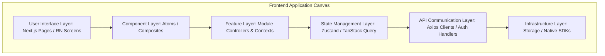
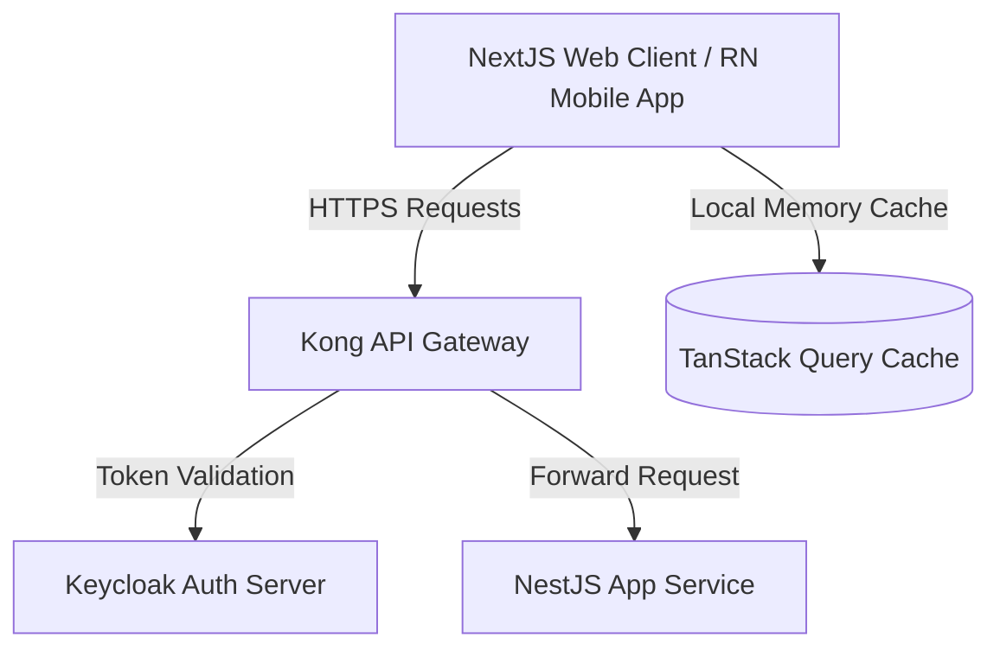
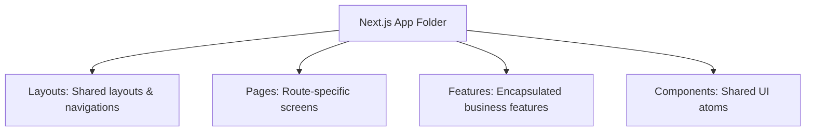
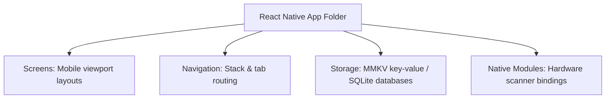
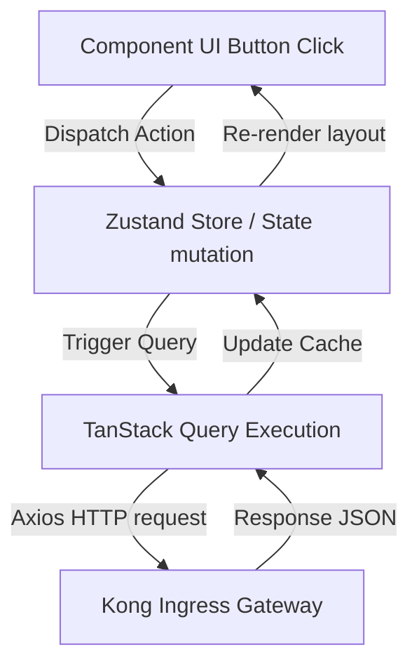

# FRONTEND ARCHITECTURE FOUNDATION & ENGINEERING STANDARDS

**Project Name:** Enterprise SaaS Business Management Platform  
**Document Version:** 1.0.0 — Baseline Standard  
**Date:** July 13, 2026  
**Authors:** Principal Frontend Architect, Senior React Engineer & UI Engineering Lead  
**Classification:** Enterprise Internal — Unrestricted  
**Status:** 🏛️ APPROVED FRONTEND ARCHITECTURE SPECIFICATION  

---

## SECTION 1 — FRONTEND ARCHITECTURE PRINCIPLES

To support a multi-tenant business platform, our web and mobile applications are built on six architectural pillars:
*   **Maintainability:** Decouple layouts from business logic to ensure modifications do not cause side effects.
*   **Scalability:** Organize files into feature directories, allowing developers to scale modules independently without creating merge conflicts.
*   **Performance:** Optimize page rendering, minimize bundle sizes, and cache API responses to keep interactions fast.
*   **Security:** Enforce strict input validation, sanitize HTML rendering to prevent XSS attacks, and store credentials securely.
*   **Developer Experience (DX):** Provide clear TypeScript contracts, mock services, and Storybook components to support rapid development.
*   **Consistency:** Require all frontend modules to use the same design tokens, styling frameworks, state tools, and linting rules.

---

## SECTION 2 — FRONTEND APPLICATION ARCHITECTURE

Our frontend applications use a modular, layered architecture to decouple layouts from server state engines:



---

## SECTION 3 — WEB FRONTEND ARCHITECTURE (NEXT.JS)

Our Next.js applications use the App Router framework, separating layouts, pages, and components within structured directories:

```
src/
├── app/                  # Next.js App Router paths
│   ├── layout.tsx        # Global page layouts
│   ├── page.tsx          # Homepage view
│   └── (dashboard)/      # Dashboard route groups
├── components/           # Shared atomic components (Atoms / Composites)
├── features/             # Business modules (POS, Inventory, Finance)
├── hooks/                # Global React hooks
├── services/             # API client services
├── utils/                # Utility helper functions
└── types/                # Shared TypeScript definitions
```

---

## SECTION 4 — MOBILE FRONTEND ARCHITECTURE (REACT NATIVE)

Our React Native applications are organized to support cross-platform operations, using local storage caches and native module bindings:

```
src/
├── screens/              # Top-level screen views
├── navigation/           # React Navigation stack configs
├── components/           # Mobile atomic components
├── features/             # Business modules
├── services/             # API services
├── storage/              # SQLite / MMKV local caches
└── native/               # Native iOS/Android modules
```

---

## SECTION 5 — FEATURE-BASED ARCHITECTURE

We organize our applications by business features to keep codebase structures clear and modular:
*   **Encapsulation:** Keep feature components, routes, styles, and tests inside their respective feature folders (e.g., `features/pos/`, `features/inventory/`).
*   **Isolation:** Feature directories must not import components from other feature folders directly. Shared elements must be moved to the root `components/` directory.

### 5.1 Directory Layout Example (`features/pos`)
```
src/features/pos/
├── components/           # POS-specific components (Cart, Terminal)
├── hooks/                # POS-specific hooks (usePOSCheckout)
├── services/             # POS-specific API calls
├── state/                # Zustand cart states
├── types/                # POS-specific TypeScript contracts
└── index.ts              # Public exports entrypoint
```

---

## SECTION 6 — COMPONENT ARCHITECTURE LEVELS

We categorize components into four levels to manage complexity and maximize reuse:
*   **UI Components:** Simple, stateless atoms (like buttons, inputs, and badges) that rely entirely on props.
*   **Business Components:** Composite elements (like cards or product grids) that display structured business data but do not handle API operations.
*   **Feature Components:** High-level operational components (like the POS Cart panel) that manage complex logic, connect to state engines, and trigger API queries.
*   **Page Components:** Next.js pages or React Native screens that assemble components to construct layouts.

---

## SECTION 7 — TYPESCRIPT ENGINEERING STANDARDS

We require strict type checks to catch issues early and maintain clean code contracts:
*   **Strict Mode:** Enable `"strict": true` in all `tsconfig.json` configurations.
*   **No Explicit Any:** Ban the use of `any` types. All variables and functions must use explicit types or interfaces.
*   **Interface Over Type:** Use `interface` for structural object shapes and public APIs, and `type` for unions and utility mappings.

### 7.1 Web Interface Definition (`types/pos.ts`)
```typescript
export interface CartItem {
  readonly id: string;
  readonly sku: string;
  readonly name: string;
  readonly unitPrice: number;
  quantity: number;
  discountPercentage?: number;
}

export interface POSCheckoutRequest {
  readonly tenantId: string;
  readonly branchId: string;
  readonly cashierId: string;
  readonly items: readonly CartItem[];
  readonly paymentMethod: 'CASH' | 'CARD' | 'KHQR';
  readonly taxRate: number;
}
```

### 7.2 API Response Typing (`services/posService.ts`)
```typescript
import { POSCheckoutRequest } from '../types/pos';

export interface POSCheckoutResponse {
  readonly success: boolean;
  readonly transactionId: string;
  readonly receiptUrl: string;
  readonly timestamp: string;
}

export const submitPOSCheckout = async (payload: POSCheckoutRequest): Promise<POSCheckoutResponse> => {
  const response = await fetch('/api/v1/pos/checkout', {
    method: 'POST',
    headers: { 'Content-Type': 'application/json' },
    body: JSON.stringify(payload),
  });
  
  if (!response.ok) {
    throw new Error('Checkout API request failed');
  }
  
  return response.json();
};
```

---

## SECTION 8 — STATE MANAGEMENT ARCHITECTURE

We match state scopes to appropriate management tools to balance performance and complexity:

### 8.1 State Management Matrix

| State Type | Scope | Selected Tool | Best Used For |
| :--- | :--- | :--- | :--- |
| **Local State** | Single component lifecycle. | React `useState` | Toggling modal views, tracking inputs. |
| **Global State** | Multi-screen user sessions. | Zustand | Shopping carts, current tenant profiles. |
| **Server State** | Database records and queries. | TanStack Query | Fetching catalogs, loading transaction histories. |

### 8.2 Zustand Store Example (`state/useCartStore.ts`)
```typescript
import { create } from 'zustand';
import { CartItem } from '../types/pos';

interface CartState {
  items: CartItem[];
  addItem: (item: CartItem) => void;
  removeItem: (id: string) => void;
  clearCart: () => void;
}

export const useCartStore = create<CartState>((set) => ({
  items: [],
  addItem: (item) => set((state) => {
    const existingIndex = state.items.findIndex((i) => i.id === item.id);
    if (existingIndex > -1) {
      const updated = [...state.items];
      updated[existingIndex].quantity += item.quantity;
      return { items: updated };
    }
    return { items: [...state.items, item] };
  }),
  removeItem: (id) => set((state) => ({
    items: state.items.filter((item) => item.id !== id),
  })),
  clearCart: () => set({ items: [] }),
}));
```

---

## SECTION 9 — API COMMUNICATION ARCHITECTURE

We coordinate all API requests using a configured Axios client to standardize authorization and error handling:
*   **Authentication Headers:** Automatically attach access tokens to outgoing request headers.
*   **Error Handling Interceptors:** Parse API errors (like expired tokens) to trigger authentication flushes or refresh routines.
*   **Retry Policy:** Automatically retry failed queries (e.g., from network timeouts) up to 3 times before displaying error messages to the user.

---

## SECTION 10 — ROUTING ARCHITECTURE

*   **Public Routes:** Paths accessible without logins (such as marketing pages and password reset screens).
*   **Private Routes:** Dashboard paths that require authenticated login credentials.
*   **Role Guards:** Route configurations that verify user roles before granting access to specific modules (e.g., blocking cashiers from accounting pages).
*   **Mobile Navigation Stack:** Manage transitions inside React Native using stack and tab navigators.

---

## SECTION 11 — AUTHENTICATION FRONTEND ARCHITECTURE

*   **Login Actions:** Users submit credentials to request access and refresh tokens.
*   **Token Storage:** Store tokens securely in browser memory for web portals, and in encrypted keychains for mobile applications.
*   **Session Refreshes:** Send refresh tokens automatically to request new access tokens before they expire.

---

## SECTION 12 — MULTI-TENANT FRONTEND SUPPORT

Our frontend layout adapt to the user's active tenant and branch context:
*   **Context Scoping:** Wrap application routers in a tenant context provider, injecting the current `tenantId` and `branchId` into all API calls automatically.

```
Tenant Selection ──► Save Context ──► Append Headers ──► Return Branch Products
```

---

## SECTION 13 — FRONTEND SECURITY STANDARDS

*   **XSS Protection:** Use React’s default character escaping for text rendering, and sanitize all custom HTML inputs before rendering.
*   **Secure Storage:** Ban the storage of credentials in unencrypted local storage.
*   **Input Sanitization:** Validate and sanitize form inputs to prevent injection attacks.

---

## SECTION 14 — FRONTEND PERFORMANCE STANDARDS

*   **Code Splitting:** Dynamically load heavy dashboard modules using React's lazy loading controls to keep bundle sizes small.
*   **Image Optimizations:** Compress product images, serve optimized formats (WebP), and specify layout dimensions to prevent layout shifts.
*   **Rendering Optimization:** Memoize heavy computation filters to prevent unnecessary re-renders during high-frequency POS interactions.

---

## SECTION 15 — ERROR & FEEDBACK ARCHITECTURE

*   **Error Boundaries:** Wrap page modules in error boundaries to catch unexpected errors, displaying a fallback UI rather than crashing the page.
*   **Loading States:** Show skeleton loaders during API requests to provide immediate feedback to users.
*   **Empty States:** Display user-friendly empty state banners when queries return no data (e.g., "No inventory items found").

---

## SECTION 16 — FRONTEND DEVELOPMENT TOOL STACK REFERENCE

Our standardized frontend development tools are detailed in the table below:

| Category | Selected Tool | Purpose |
| :--- | :--- | :--- |
| **Web Runtime** | **Next.js / React** | Production framework for portal and dashboard applications. |
| **Mobile Runtime** | **React Native** | Cross-platform framework for mobile applications. |
| **Static Types** | **TypeScript** | Static typing engine used to compile clean contracts. |
| **Dev Environment** | **Vite** | Development server used to compile code modules. |
| **Linter** | **ESLint** | Enforces static coding rules and flags potential issues. |
| **Formatter** | **Prettier** | Formats code automatically on save. |
| **Documentation** | **Storybook** | Sandbox environment for developing and testing UI components. |

---

## SECTION 17 — FRONTEND ENGINEERING GOVERNANCE

*   **Code Review Sign-offs:** Require code changes to pass automated checks and gather two engineer approvals before merging pull requests.
*   **Dependency Management:** Restrict developers from adding third-party libraries without architectural reviews to keep bundles slim and secure.

---

## SECTION 18 — FRONTEND MATURITY MODEL

Our frontend engineering processes scale along a defined maturity curve:
*   **Level 1 (Basic):** Manual, ad-hoc styling and direct API calls, without using shared components or caching tools.
*   **Level 2 (Component-Based):** Standardize common components in shared developer repositories.
*   **Level 3 (Feature-Based):** Organize app folders by business feature and integrate global states.
*   **Level 4 (Enterprise Platform):** Standardize code templates, design tokens, and CI/CD validation steps.
*   **Level 5 (AI-Assisted):** Automatically generate custom layouts, verify typing, and test layouts using AI agents.

---

## SECTION 19 — FINAL FRONTEND ARCHITECTURE MERMAID DIAGRAMS

### 19.1 Enterprise Frontend Architecture


### 19.2 Web Application Structure (Next.js)


### 19.3 Mobile Application Structure (React Native)


### 19.4 Feature-Based Architecture
```
[ Feature Folder: pos ] ──► [ Local Components ] ──► [ Local Zustand state ] ──► [ Local Services ]
```

### 19.5 Frontend Data Flow


---

*End of Frontend Architecture Foundation & Engineering Standards*  
*Document maintained by: Principal Frontend Architect | Status: Approved Frontend Architecture Specification*
